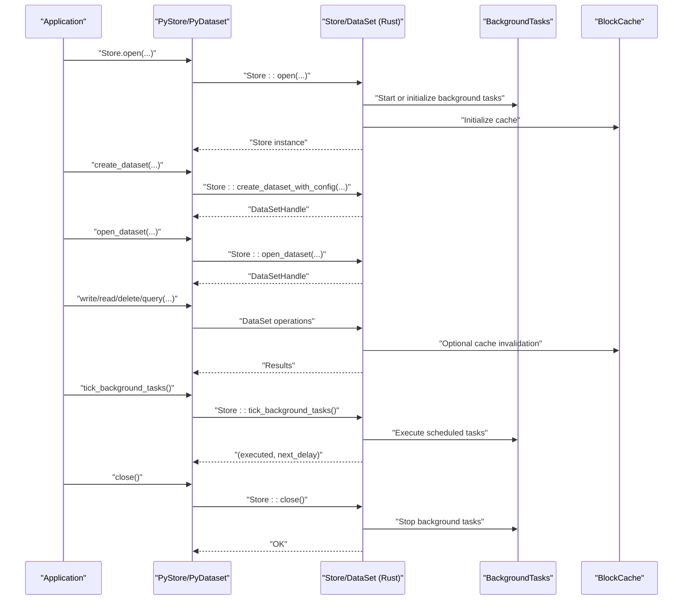
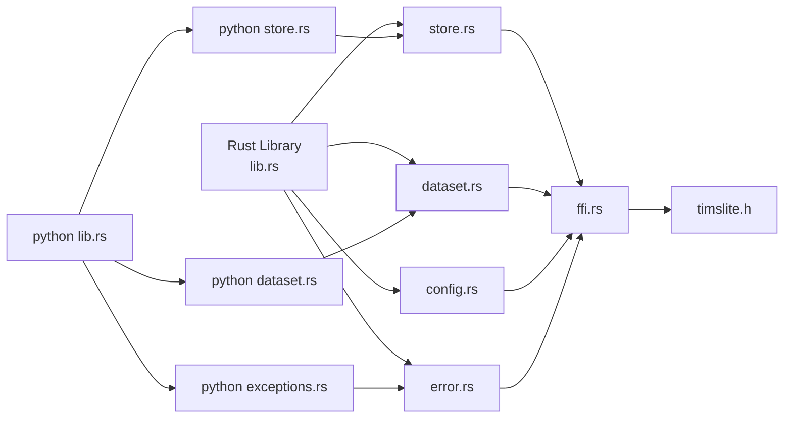

# API Reference

<cite>
**Referenced Files in This Document**
- [lib.rs](file://src/lib.rs)
- [ffi.rs](file://src/ffi.rs)
- [timslite.h](file://include/timslite.h)
- [store.rs](file://src/store.rs)
- [dataset.rs](file://src/dataset.rs)
- [config.rs](file://src/config.rs)
- [error.rs](file://src/error.rs)
- [Cargo.toml](file://Cargo.toml)
- [python lib.rs](file://wrapper/python/src/lib.rs)
- [python store.rs](file://wrapper/python/src/store.rs)
- [python dataset.rs](file://wrapper/python/src/dataset.rs)
- [python exceptions.rs](file://wrapper/python/src/exceptions.rs)
- [python README.md](file://wrapper/python/README.md)
</cite>

## Table of Contents
1. [Introduction](#introduction)
2. [Project Structure](#project-structure)
3. [Core Components](#core-components)
4. [Architecture Overview](#architecture-overview)
5. [Detailed Component Analysis](#detailed-component-analysis)
6. [Dependency Analysis](#dependency-analysis)
7. [Performance Considerations](#performance-considerations)
8. [Troubleshooting Guide](#troubleshooting-guide)
9. [Conclusion](#conclusion)
10. [Appendices](#appendices)

## Introduction
This document provides a comprehensive API reference for TimSLite, covering:
- The Rust library API for store management, dataset operations, configuration builders, and error handling
- The C ABI FFI interface with data structures, function signatures, parameter specifications, and memory management requirements
- The Python bindings API with usage examples and integration patterns

It focuses on public interfaces, method/function descriptions, parameter types, return values, error conditions, and practical usage examples. Thread safety, resource management, and cross-language interoperability considerations are addressed throughout.

## Project Structure
TimSLite exposes:
- A native Rust library with public re-exports for store, dataset, configuration, query iterators, and queue types
- A C ABI FFI layer exporting opaque handles and functions for store, dataset, and queue operations
- Python bindings implemented via PyO3, exposing a Pythonic API over the Rust core

```mermaid
graph TB
subgraph "Rust Library"
L1["lib.rs<br/>Public re-exports"]
L2["store.rs<br/>Store facade"]
L3["dataset.rs<br/>DataSet operations"]
L4["config.rs<br/>StoreConfig / DataSetConfig"]
L5["error.rs<br/>TmslError"]
end
subgraph "FFI Layer"
F1["ffi.rs<br/>Opaque handles + extern \"C\" API"]
H1["timslite.h<br/>C header"]
end
subgraph "Python Bindings"
P0["python lib.rs<br/>PyO3 module"]
P1["python store.rs<br/>PyStore"]
P2["python dataset.rs<br/>PyDataset"]
P3["python exceptions.rs<br/>Exception mapping"]
end
L1 --> L2
L1 --> L3
L1 --> L4
L1 --> L5
L2 --> F1
L3 --> F1
L4 --> F1
L5 --> F1
F1 --> H1
P0 --> P1
P0 --> P2
P0 --> P3
P1 --> L2
P2 --> L3
P3 --> L5
```

**Diagram sources**
- [lib.rs:60-72](file://src/lib.rs#L60-L72)
- [store.rs:46-56](file://src/store.rs#L46-L56)
- [dataset.rs:71-82](file://src/dataset.rs#L71-L82)
- [config.rs:26-52](file://src/config.rs#L26-L52)
- [error.rs:7-43](file://src/error.rs#L7-L43)
- [ffi.rs:141-178](file://src/ffi.rs#L141-L178)
- [timslite.h:11-358](file://include/timslite.h#L11-L358)
- [python lib.rs:14-28](file://wrapper/python/src/lib.rs#L14-L28)
- [python store.rs:16-24](file://wrapper/python/src/store.rs#L16-L24)
- [python dataset.rs:12-18](file://wrapper/python/src/dataset.rs#L12-L18)
- [python exceptions.rs:15-105](file://wrapper/python/src/exceptions.rs#L15-L105)

**Section sources**
- [lib.rs:39-72](file://src/lib.rs#L39-L72)
- [Cargo.toml:6-8](file://Cargo.toml#L6-L8)
- [timslite.h:11-358](file://include/timslite.h#L11-L358)

## Core Components
This section summarizes the primary public APIs and their responsibilities.

- Store
  - Manages datasets, background tasks, block cache, and optional journal
  - Provides lifecycle operations: open, create/open/close/drop dataset, flush, close, background tick
- DataSet
  - Aggregates data/index segments and time index
  - Provides write, append, delete, read, query, flush, close, and queue operations
- Config
  - StoreConfig and StoreConfigBuilder for store-level defaults
  - DataSetConfig and DataSetConfigBuilder for dataset-level defaults and overrides
- Error
  - TmslError enumerates all error variants surfaced to clients
- FFI
  - Exposes opaque handles and extern "C" functions for store, dataset, and queue operations
  - Includes error reporting via null-return or negative return codes with error buffers
- Python bindings
  - PyStore and PyDataset classes expose a Pythonic API over the Rust core
  - Exception hierarchy mirrors TmslError for consistent error handling

**Section sources**
- [store.rs:46-161](file://src/store.rs#L46-L161)
- [dataset.rs:71-218](file://src/dataset.rs#L71-L218)
- [config.rs:26-203](file://src/config.rs#L26-L203)
- [error.rs:7-87](file://src/error.rs#L7-L87)
- [ffi.rs:141-178](file://src/ffi.rs#L141-L178)
- [python store.rs:16-254](file://wrapper/python/src/store.rs#L16-L254)
- [python dataset.rs:12-175](file://wrapper/python/src/dataset.rs#L12-L175)
- [python exceptions.rs:15-193](file://wrapper/python/src/exceptions.rs#L15-L193)

## Architecture Overview
The system architecture centers on the Store facade, which orchestrates DataSet instances, background tasks, and caches. The FFI layer wraps these internals behind opaque handles and C-callable functions. Python bindings provide a thin, ergonomic layer over the Rust API.



**Diagram sources**
- [store.rs:58-161](file://src/store.rs#L58-L161)
- [store.rs:400-540](file://src/store.rs#L400-L540)
- [dataset.rs:241-316](file://src/dataset.rs#L241-L316)
- [dataset.rs:586-627](file://src/dataset.rs#L586-L627)
- [python store.rs:107-145](file://wrapper/python/src/store.rs#L107-L145)
- [python dataset.rs:48-113](file://wrapper/python/src/dataset.rs#L48-L113)

## Detailed Component Analysis

### Rust Library API

#### Store
- Purpose: Top-level facade for dataset lifecycle, background tasks, and cache management
- Key methods:
  - open(data_dir, config) -> Result<Store>
  - create_dataset_with_config(name, dataset_type, config_builder) -> Result<DataSetHandle>
  - create_dataset(name, dataset_type, ...) -> Result<DataSetHandle> (compat wrapper)
  - open_dataset(name, dataset_type) -> Result<DataSetHandle>
  - close_dataset(handle) -> Result<()>
  - drop_dataset_by_name(name, dataset_type) -> Result<()>
  - write_dataset(handle, timestamp, data) -> Result<()>
  - append_dataset(handle, timestamp, data) -> Result<()>
  - delete_dataset_record(handle, timestamp) -> Result<()>
  - tick_background_tasks() -> Result<TickResult>
  - next_background_delay() -> Result<Duration>
  - block_cache() -> &Arc<BlockCache>
  - config() -> &StoreConfig
  - close() -> Result<()> (flushes and closes all datasets and journal)

- Thread safety: Store internally uses locks and atomics for safe concurrent access. Background tasks are coordinated via an internal executor.

- Resource management: Closing the store releases all datasets and stops background tasks. Dropping datasets enforces that no child handles (iterators) remain open.

**Section sources**
- [store.rs:58-161](file://src/store.rs#L58-L161)
- [store.rs:163-381](file://src/store.rs#L163-L381)
- [store.rs:383-540](file://src/store.rs#L383-L540)
- [store.rs:542-561](file://src/store.rs#L542-L561)

#### DataSet
- Purpose: Encapsulates a dataset’s data/index segments and time index
- Key methods:
  - create(id, base_dir, ...) -> Result<DataSet> (explicit creation)
  - open(id, base_dir) -> Result<DataSet> (reads meta)
  - write(timestamp, data) -> Result<()> (dispatches correction/out-of-order/normal)
  - append(timestamp, data) -> Result<()> (variable-length append with migration threshold)
  - delete(timestamp) -> Result<()> (marks index entry as sentinel)
  - read(timestamp, cache) -> Result<Option<(i64, Vec<u8>)>>
  - query_iter(start_ts, end_ts, cache) -> Result<QueryIterator>
  - query(start_ts, end_ts, cache) -> Result<Vec<(i64, Vec<u8>)>>
  - flush() -> Result<()> (syncs index and data segments)
  - close() -> Result<()> (flushes and idle-closes segments)
  - open_queue()/close_queue() -> Result<()> (queue subsystem)

- Timestamp semantics:
  - correction: timestamp == latest -> in-place overwrite in the last pending raw block
  - out-of-order: timestamp < latest -> append to latest segment and update index entry
  - normal: timestamp > latest -> append; continuous mode fills gaps with filler entries

- Thread safety: DataSet operations are guarded by an internal mutex. Iterators maintain counts to enforce proper lifecycle.

**Section sources**
- [dataset.rs:84-218](file://src/dataset.rs#L84-L218)
- [dataset.rs:226-430](file://src/dataset.rs#L226-L430)
- [dataset.rs:525-627](file://src/dataset.rs#L525-L627)
- [dataset.rs:629-692](file://src/dataset.rs#L629-L692)
- [dataset.rs:709-767](file://src/dataset.rs#L709-L767)

#### Configuration Builders
- StoreConfig
  - Fields: flush_interval, idle_timeout, data_segment_size, index_segment_size, initial sizes, compress_level, cache_max_memory, cache_idle_timeout, retention_check_hour, enable_background_thread, enable_journal
  - Builder methods: flush_interval(), idle_timeout(), data_segment_size(), index_segment_size(), initial_*(), compress_level(), cache_max_memory(), cache_idle_timeout(), retention_check_hour(), enable_background_thread(), enable_journal()
  - builder() -> StoreConfigBuilder; default() provides sensible defaults

- DataSetConfig
  - Fields: data_segment_size, index_segment_size, compress_level, index_continuous, initial sizes, retention_window
  - Builder methods: from_store(store), data_segment_size(), index_segment_size(), compress_level(), index_continuous(), initial_data_segment_size(), initial_index_segment_size(), retention_window()
  - builder() -> DataSetConfigBuilder; from_store(config) pre-fills with store defaults

- Notes:
  - Store-level defaults are inherited by datasets unless overridden
  - index_continuous toggles sparse continuous storage mode

**Section sources**
- [config.rs:26-71](file://src/config.rs#L26-L71)
- [config.rs:73-203](file://src/config.rs#L73-L203)
- [config.rs:205-236](file://src/config.rs#L205-L236)
- [config.rs:238-345](file://src/config.rs#L238-L345)

#### Error Handling
- TmslError variants:
  - Io, InvalidMagic, InvalidVersion, MmapError, CompressionError, DecompressionError, InvalidData, NotFound, Expired, AlreadyExists, SegmentFull, QueueAlreadyOpen, QueueNotOpen, ConsumerGroupNotFound, ConsumerGroupExists, QueueClosed, PendingFull

- Propagation:
  - Rust API returns Result<T> with TmslError
  - FFI converts errors to C error buffers and returns negative codes or null pointers
  - Python bindings map TmslError to a hierarchy of Python exceptions

**Section sources**
- [error.rs:7-87](file://src/error.rs#L7-L87)
- [ffi.rs:32-97](file://src/ffi.rs#L32-L97)
- [python exceptions.rs:15-193](file://wrapper/python/src/exceptions.rs#L15-L193)

### C ABI FFI Interface

#### Data Structures
- TmslStoreConfigFFI
  - Fields: version, flush_interval_ms, idle_timeout_ms, data_segment_size, index_segment_size, initial_data_segment_size, initial_index_segment_size, cache_max_memory, cache_idle_timeout_ms, compress_level, retention_check_hour, enable_background_thread, enable_journal
  - Version: TMSL_STORE_CONFIG_FFI_VERSION

- TmslDatasetConfigFFI
  - Fields: version, data_segment_size, index_segment_size, initial_data_segment_size, initial_index_segment_size, retention_window, compress_level, index_continuous
  - Version: TMSL_DATASET_CONFIG_FFI_VERSION

- Opaque handles:
  - Store: pointer to FfiStore (opaque)
  - Dataset: pointer to FfiDataset (opaque)
  - Iterator: pointer to FfiIterator (opaque)
  - Queue/Consumer: numeric IDs registered in static registries

**Section sources**
- [ffi.rs:104-139](file://src/ffi.rs#L104-L139)
- [timslite.h:24-49](file://include/timslite.h#L24-L49)

#### Store Management
- tmsl_store_config_default(out_config, err_buf, err_buf_len) -> int
  - Fills a TmslStoreConfigFFI with defaults
  - Returns 0 on success, -1 on error

- tmsl_store_open(data_dir, err_buf, err_buf_len) -> void*
  - Opens a store at data_dir with default config
  - Returns opaque store pointer or NULL on error

- tmsl_store_open_with_config(data_dir, config_ptr, err_buf, err_buf_len) -> void*
  - Opens a store with explicit config
  - Passing config = NULL is equivalent to tmsl_store_open

- tmsl_store_close(store, err_buf, err_buf_len) -> int
  - Closes a store; fails if any dataset or iterator handle is still open
  - Returns 0 on success, -1 on error

- tmsl_store_tick_background_tasks(store, out_executed, out_next_delay_ms, err_buf, err_buf_len) -> int
  - Executes one tick of background tasks synchronously
  - Writes executed count (0-4) and next delay (ms)
  - Returns 0 on success, -1 on error

- tmsl_store_next_background_delay(store, out_next_delay_ms, err_buf, err_buf_len) -> int
  - Queries delay until next background task without executing
  - Returns 0 on success, -1 on error

- Memory management:
  - Store pointer must be released via tmsl_store_close
  - Dataset pointer must be released via tmsl_dataset_close
  - Iterator pointer must be released via tmsl_iter_close

**Section sources**
- [ffi.rs:278-393](file://src/ffi.rs#L278-L393)
- [timslite.h:53-122](file://include/timslite.h#L53-L122)

#### Dataset Management
- tmsl_dataset_create(store, name, dataset_type, data_segment_size, index_segment_size, compress_level, index_continuous, retention_window, err_buf, err_buf_len) -> void*
  - Creates a new dataset (explicit)
  - Returns opaque dataset pointer or NULL on error

- tmsl_dataset_create_with_config(store, name, dataset_type, config_ptr, err_buf, err_buf_len) -> void*
  - Creates a dataset with explicit TmslDatasetConfigFFI
  - Returns opaque dataset pointer or NULL on error

- tmsl_dataset_open(store, name, dataset_type, err_buf, err_buf_len) -> void*
  - Opens an existing dataset (reads meta)
  - Returns opaque dataset pointer or NULL on error

- tmsl_dataset_close(dataset, err_buf, err_buf_len) -> int
  - Closes a dataset; fails if any iterator handle is still open
  - Returns 0 on success, -1 on error

- tmsl_dataset_drop(store, name, dataset_type, err_buf, err_buf_len) -> int
  - Drops (deletes) an entire dataset
  - Returns 0 on success, -1 on error

- tmsl_dataset_flush(dataset, err_buf, err_buf_len) -> int
  - Flushes dataset (msync only)
  - Returns 0 on success, -1 on error

- tmsl_dataset_latest_timestamp(dataset, out_ts, err_buf, err_buf_len) -> int
  - Writes latest written timestamp (0 if empty)
  - Returns 0 on success, -1 on error

- tmsl_dataset_write(dataset, timestamp, data, data_len, err_buf, err_buf_len) -> int
  - Writes a record; see timestamp dispatch semantics
  - Returns 0 on success, -1 on error

- tmsl_dataset_append(dataset, timestamp, data, data_len, err_buf, err_buf_len) -> int
  - Appends bytes to a record; validates constraints
  - Returns 0 on success, -1 on error

- tmsl_dataset_delete(dataset, timestamp, err_buf, err_buf_len) -> int
  - Deletes a record by marking index entry as sentinel
  - Returns 0 on success, -1 on error

- tmsl_dataset_read(dataset, timestamp, out_ts, out_data, out_data_len, err_buf, err_buf_len) -> int
  - Reads a single record by exact timestamp
  - Allocates via malloc; caller must free via tmsl_data_free
  - Returns 0 (found), 1 (not found), -1 (error)

- Memory management:
  - Returned data from tmsl_dataset_read must be freed via tmsl_data_free
  - Iterator must be closed via tmsl_iter_close

**Section sources**
- [ffi.rs:424-703](file://src/ffi.rs#L424-L703)
- [timslite.h:126-305](file://include/timslite.h#L126-L305)

#### Query Iterator
- tmsl_dataset_query(dataset, start_ts, end_ts, err_buf, err_buf_len) -> void*
  - Returns opaque iterator pointer or NULL on error

- tmsl_iter_next(iter, out_ts, out_data, out_data_len, err_buf, err_buf_len) -> int
  - Retrieves next record from iterator
  - Allocates via malloc; caller must free via tmsl_data_free
  - Returns 0 (success), 1 (exhausted), -1 (error)

- tmsl_iter_close(iter)
  - Frees the iterator

- tmsl_data_free(data)
  - Frees memory allocated by read/query APIs

- tmsl_iter_free_data(data)
  - Compatibility alias for tmsl_data_free

**Section sources**
- [ffi.rs:760-851](file://src/ffi.rs#L760-L851)
- [timslite.h:307-351](file://include/timslite.h#L307-L351)

#### Queue Operations (FFI)
- tmsl_queue_open(store, dataset_handle, err_buf, err_len) -> usize
  - Opens queue subsystem for a dataset; returns queue handle ID or 0 on error

- tmsl_queue_close(store, queue_handle, err_buf, err_len) -> int
  - Closes queue subsystem; invalidates consumer handles
  - Returns 0 on success, -1 on error

- tmsl_queue_consumer_open(queue_handle, group_name, err_buf, err_len) -> usize
  - Opens or creates a consumer group; returns consumer handle ID

- tmsl_queue_consumer_drop(queue_handle, consumer_handle, err_buf, err_len) -> int
  - Drops (closes and removes) a consumer group
  - Returns 0 on success, -1 on error

- tmsl_queue_push(queue_handle, data, data_len, err_buf, err_len) -> c_longlong
  - Pushes data; auto-increments timestamp; returns assigned timestamp (> 0) or 0 on error

- tmsl_queue_poll(consumer_handle, timeout_ms, out_timestamp, out_data, out_len, err_buf, err_len) -> int
  - Polls for next record; returns 0 (success), -1 (error), -2 (timeout)

- tmsl_queue_ack(consumer_handle, timestamp, err_buf, err_len) -> int
  - Acknowledges a polled record
  - Returns 0 on success, -1 on error

- Memory management:
  - Data returned by tmsl_queue_poll must be freed via tmsl_data_free

**Section sources**
- [ffi.rs:853-1040](file://src/ffi.rs#L853-L1040)
- [timslite.h:353-351](file://include/timslite.h#L353-L351)

### Python Bindings API

#### PyStore
- Methods:
  - open(data_dir, config=None) -> PyStore
  - close() -> None
  - create_dataset(name, dataset_type, data_segment_size=None, index_segment_size=None, compress_level=None, index_continuous=False, initial_data_segment_size=None, initial_index_segment_size=None) -> None
  - open_dataset(name, dataset_type) -> PyDataset
  - drop_dataset(name, dataset_type) -> None
  - open_queue(dataset_id) -> PyDatasetQueue
  - tick_background_tasks() -> (executed_tasks: int, next_delay_ms: int)
  - next_background_delay() -> int

- Context manager:
  - __enter__() -> PyStore
  - __exit__(...) -> None

- Notes:
  - Dataset management tracks Arc<Mutex<DataSet>> for sharing
  - read-only access to journal dataset is supported

**Section sources**
- [python store.rs:16-254](file://wrapper/python/src/store.rs#L16-L254)

#### PyDataset
- Methods:
  - write(timestamp: int, data: bytes) -> None
  - append(timestamp: int, data: bytes) -> None
  - read(timestamp: int) -> Optional[Tuple[int, bytes]]
  - delete(timestamp: int) -> None
  - query(start_ts: int, end_ts: int) -> PyQueryIterator
  - query_all(start_ts: int, end_ts: int) -> List[Tuple[int, bytes]]
  - flush() -> None
  - Properties: id: int, data_dir: str, latest_timestamp: int

- Notes:
  - All operations lock the underlying DataSet
  - read(-1) fetches the latest written record

**Section sources**
- [python dataset.rs:12-175](file://wrapper/python/src/dataset.rs#L12-L175)

#### Exceptions
- Exception hierarchy:
  - TmslError (base)
  - TmslIoError, TmslNotFoundError, TmslAlreadyExistsError, TmslInvalidDataError, TmslSegmentFullError, TmslMmapError, TmslCompressionError, TmslDecompressionError, TmslExpiredError, TmslQueueAlreadyOpenError, TmslQueueNotOpenError, TmslConsumerGroupNotFoundError, TmslConsumerGroupExistsError, TmslQueueClosedError, TmslPendingFullError

- Mapping:
  - Rust TmslError mapped to corresponding Python exception types

**Section sources**
- [python exceptions.rs:15-193](file://wrapper/python/src/exceptions.rs#L15-L193)

#### Usage Examples
- Basic usage and context manager
- Manual background task execution when background thread is disabled
- See [python README.md:12-77](file://wrapper/python/README.md#L12-L77) for runnable examples

**Section sources**
- [python README.md:12-77](file://wrapper/python/README.md#L12-L77)

## Dependency Analysis
The FFI layer depends on the Rust core types and wraps them behind opaque handles. Python bindings depend on the FFI layer and the Rust core.



**Diagram sources**
- [lib.rs:39-72](file://src/lib.rs#L39-L72)
- [ffi.rs:141-178](file://src/ffi.rs#L141-L178)
- [timslite.h:11-358](file://include/timslite.h#L11-L358)
- [python lib.rs:14-28](file://wrapper/python/src/lib.rs#L14-L28)

**Section sources**
- [lib.rs:39-72](file://src/lib.rs#L39-L72)
- [ffi.rs:141-178](file://src/ffi.rs#L141-L178)
- [python lib.rs:14-28](file://wrapper/python/src/lib.rs#L14-L28)

## Performance Considerations
- Block-level aggregation and delayed compression reduce I/O overhead; compression occurs on block sealing
- Lazy segment lifecycle minimizes open file descriptors and memory footprint
- Global block cache reduces repeated reads; eviction governed by cache_idle_timeout
- Background tasks coordinate flush, idle-close, cache eviction, and retention reclaim
- Continuous index mode trades off disk space for efficient sparse writes
- Record append migration threshold prevents oversized records; consider splitting large appends

[No sources needed since this section provides general guidance]

## Troubleshooting Guide
Common issues and resolutions:
- Store close fails due to outstanding handles
  - Ensure all datasets and iterators are closed before closing the store
- Dataset close fails due to outstanding iterators
  - Close all iterators via tmsl_iter_close before closing the dataset
- InvalidData errors on timestamp operations
  - Timestamp must be > 0; correction requires latest timestamp; append requires timestamp >= latest_written_timestamp
- Queue errors
  - Queue must be opened before consumer operations; consumer groups must be opened before polling
- Memory allocation failures
  - FFI read/query allocate via malloc; ensure to free via tmsl_data_free
- Python exceptions
  - Use the Tmsl*Error subclasses to catch specific error categories

**Section sources**
- [ffi.rs:344-357](file://src/ffi.rs#L344-L357)
- [ffi.rs:536-550](file://src/ffi.rs#L536-L550)
- [dataset.rs:263-269](file://src/dataset.rs#L263-L269)
- [dataset.rs:338-352](file://src/dataset.rs#L338-L352)
- [python exceptions.rs:165-193](file://wrapper/python/src/exceptions.rs#L165-L193)

## Conclusion
TimSLite provides a robust, high-performance time-series storage solution with clear separation between the Rust core, a C ABI FFI layer, and Python bindings. The APIs emphasize explicit lifecycle management, strong error handling, and predictable resource usage. The FFI and Python layers offer straightforward integration patterns for C/C++ and Python applications, respectively.

[No sources needed since this section summarizes without analyzing specific files]

## Appendices

### API Summary Tables

#### Store API (Rust)
- open(data_dir, config) -> Result<Store>
- create_dataset_with_config(name, dataset_type, config_builder) -> Result<DataSetHandle>
- open_dataset(name, dataset_type) -> Result<DataSetHandle>
- close_dataset(handle) -> Result<()>
- drop_dataset_by_name(name, dataset_type) -> Result<()>
- write_dataset(handle, timestamp, data) -> Result<()>
- append_dataset(handle, timestamp, data) -> Result<()>
- delete_dataset_record(handle, timestamp) -> Result<()>
- tick_background_tasks() -> Result<TickResult>
- next_background_delay() -> Result<Duration>
- close() -> Result<()>
- block_cache() -> &Arc<BlockCache>
- config() -> &StoreConfig

**Section sources**
- [store.rs:58-161](file://src/store.rs#L58-L161)
- [store.rs:163-381](file://src/store.rs#L163-L381)
- [store.rs:383-540](file://src/store.rs#L383-L540)
- [store.rs:542-561](file://src/store.rs#L542-L561)

#### DataSet API (Rust)
- create(id, base_dir, ...) -> Result<DataSet>
- open(id, base_dir) -> Result<DataSet>
- write(timestamp, data) -> Result<()>
- append(timestamp, data) -> Result<()>
- delete(timestamp) -> Result<()>
- read(timestamp, cache) -> Result<Option<(i64, Vec<u8>)>>
- query_iter(start_ts, end_ts, cache) -> Result<QueryIterator>
- query(start_ts, end_ts, cache) -> Result<Vec<(i64, Vec<u8>)>>
- flush() -> Result<()>
- close() -> Result<()>
- open_queue()/close_queue() -> Result<()> (queue subsystem)

**Section sources**
- [dataset.rs:84-218](file://src/dataset.rs#L84-L218)
- [dataset.rs:226-430](file://src/dataset.rs#L226-L430)
- [dataset.rs:525-627](file://src/dataset.rs#L525-L627)
- [dataset.rs:629-692](file://src/dataset.rs#L629-L692)
- [dataset.rs:709-767](file://src/dataset.rs#L709-L767)

#### Configuration API (Rust)
- StoreConfig: builder() -> StoreConfigBuilder; default()
- StoreConfigBuilder: fluent setters; build() -> StoreConfig
- DataSetConfig: from_store(config); builder() -> DataSetConfigBuilder
- DataSetConfigBuilder: from_store(store), fluent setters; build() -> DataSetConfig

**Section sources**
- [config.rs:26-71](file://src/config.rs#L26-L71)
- [config.rs:73-203](file://src/config.rs#L73-L203)
- [config.rs:205-236](file://src/config.rs#L205-L236)
- [config.rs:238-345](file://src/config.rs#L238-L345)

#### FFI API Summary
- Store: tmsl_store_* functions
- Dataset: tmsl_dataset_* functions
- Query: tmsl_dataset_query, tmsl_iter_* functions
- Data free: tmsl_data_free, tmsl_iter_free_data
- Queue: tmsl_queue_* functions

**Section sources**
- [ffi.rs:278-851](file://src/ffi.rs#L278-L851)
- [ffi.rs:853-1040](file://src/ffi.rs#L853-L1040)
- [timslite.h:53-351](file://include/timslite.h#L53-L351)

#### Python API Summary
- PyStore: open, close, create_dataset, open_dataset, drop_dataset, open_queue, tick_background_tasks, next_background_delay
- PyDataset: write, append, read, delete, query, query_all, flush, properties (id, data_dir, latest_timestamp)
- Exceptions: Tmsl*Error subclasses

**Section sources**
- [python store.rs:16-254](file://wrapper/python/src/store.rs#L16-L254)
- [python dataset.rs:12-175](file://wrapper/python/src/dataset.rs#L12-L175)
- [python exceptions.rs:15-193](file://wrapper/python/src/exceptions.rs#L15-L193)