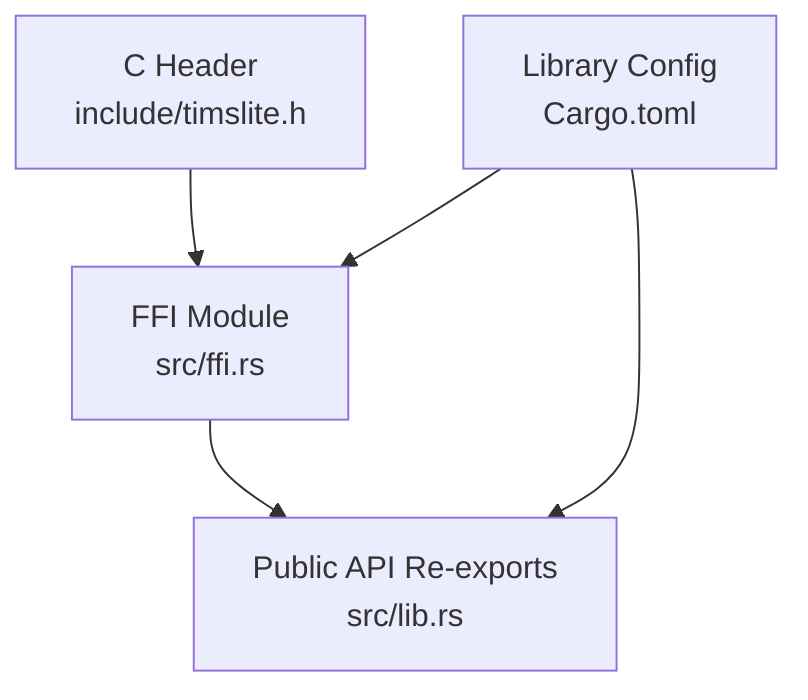
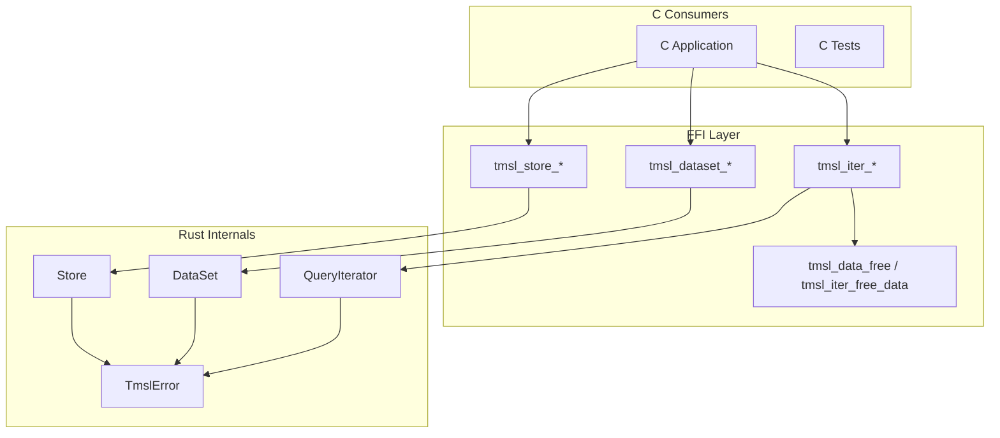
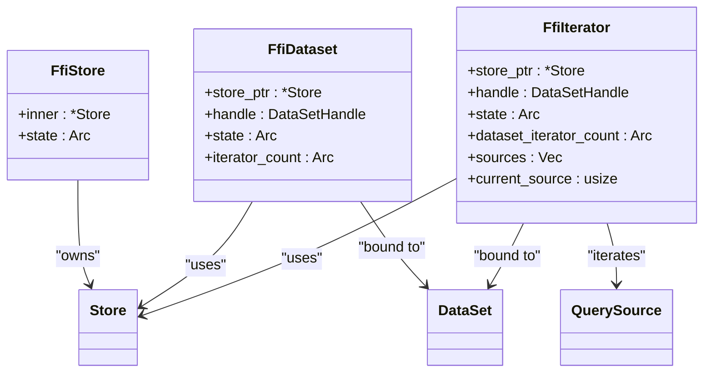
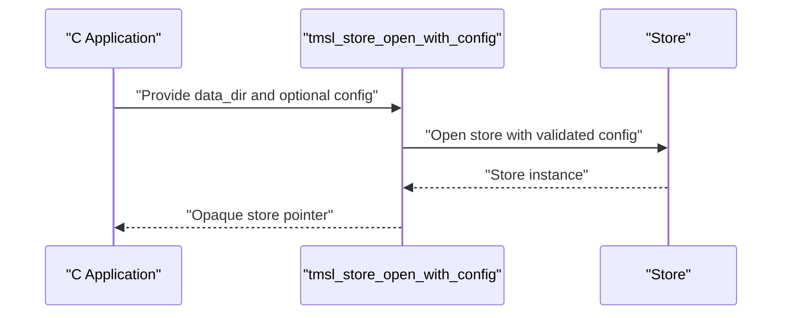
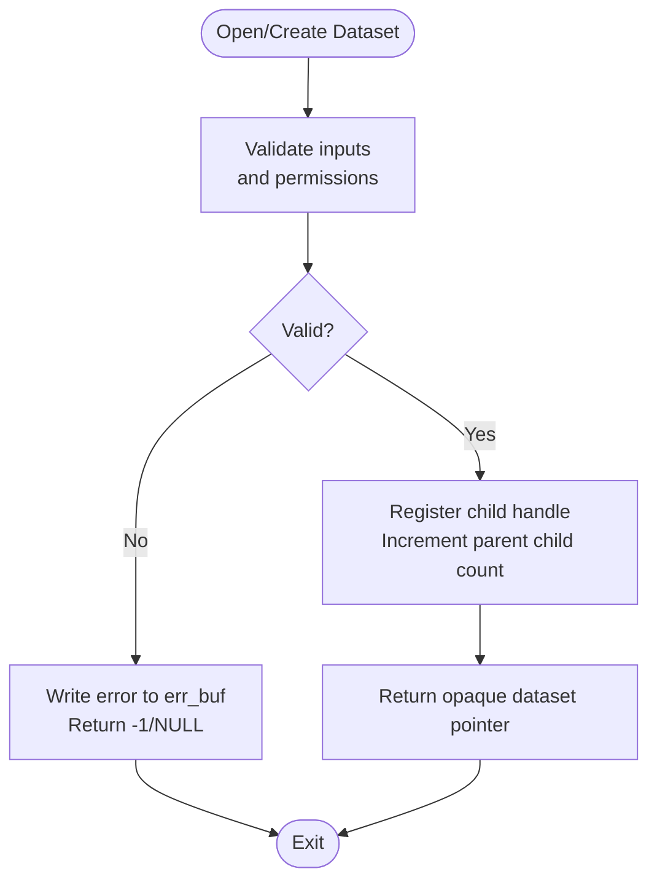
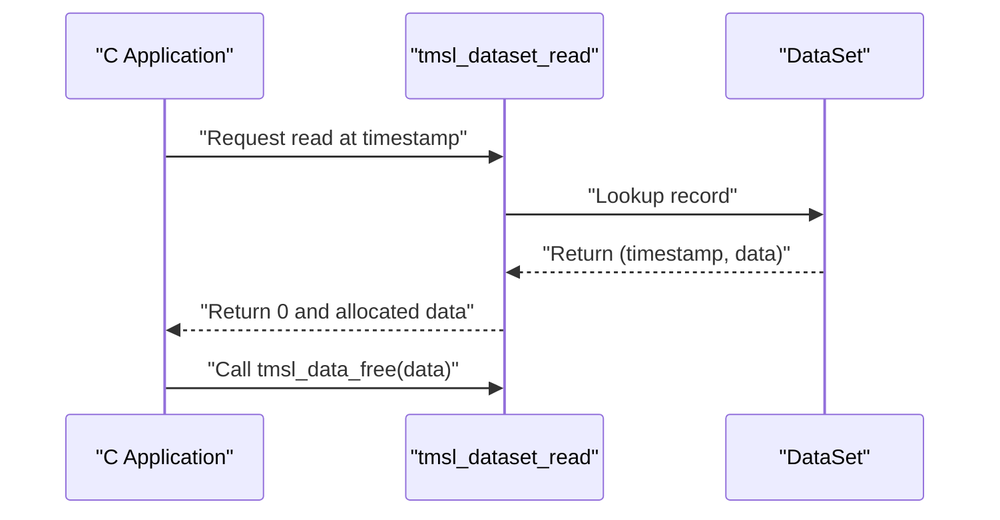
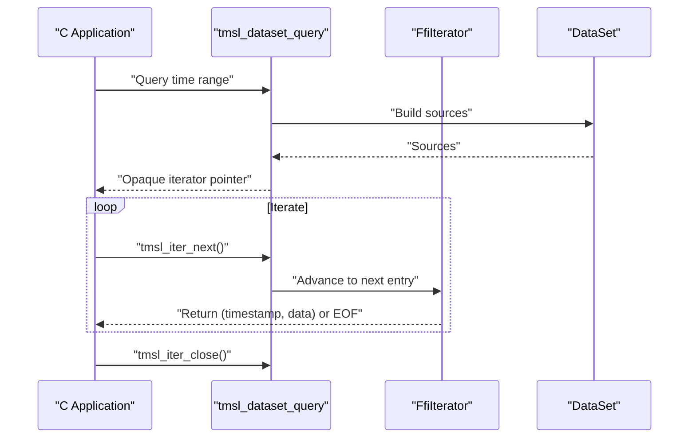
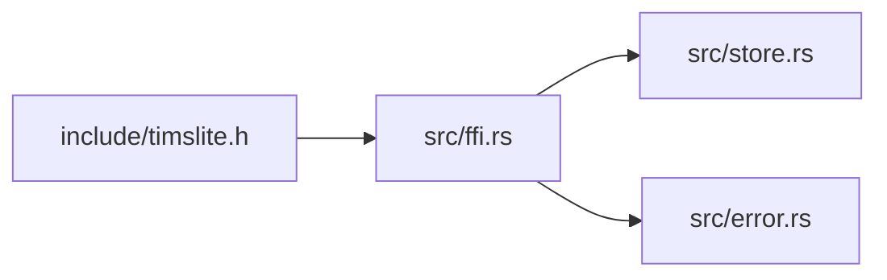

# C ABI FFI API

<cite>
**Referenced Files in This Document**
- [timslite.h](file://include/timslite.h)
- [ffi.rs](file://src/ffi.rs)
- [lib.rs](file://src/lib.rs)
- [Cargo.toml](file://Cargo.toml)
- [error.rs](file://src/error.rs)
- [store.rs](file://src/store.rs)
</cite>

## Table of Contents
1. [Introduction](#introduction)
2. [Project Structure](#project-structure)
3. [Core Components](#core-components)
4. [Architecture Overview](#architecture-overview)
5. [Detailed Component Analysis](#detailed-component-analysis)
6. [Dependency Analysis](#dependency-analysis)
7. [Performance Considerations](#performance-considerations)
8. [Troubleshooting Guide](#troubleshooting-guide)
9. [Conclusion](#conclusion)
10. [Appendices](#appendices)

## Introduction
This document describes the C ABI FFI API for TimSLite, a high-performance, mmap-backed time-series data store. It documents all exported C functions, their signatures, parameter types, return values, memory management requirements, opaque handle lifecycles, error handling, and integration patterns. It also covers the data structures defined in the public header and provides platform and compilation guidance.

## Project Structure
TimSLite exposes a C ABI FFI surface via a dedicated module and a public header. The library builds as a dynamic library (cdylib) and re-exports core types for higher-level bindings.

**Diagram sources**
- [timslite.h:1-358](file://include/timslite.h#L1-L358)
- [ffi.rs:1-120](file://src/ffi.rs#L1-L120)
- [lib.rs:38-73](file://src/lib.rs#L38-L73)
- [Cargo.toml:6-8](file://Cargo.toml#L6-L8)

**Section sources**
- [Cargo.toml:6-8](file://Cargo.toml#L6-L8)
- [lib.rs:38-73](file://src/lib.rs#L38-L73)
- [timslite.h:1-358](file://include/timslite.h#L1-L358)

## Core Components
- Opaque handles
  - FfiStore: An opaque store handle representing a TimSLite store instance. It carries an internal state and is used as the parent handle for datasets and iterators.
  - FfiDataset: An opaque dataset handle bound to a specific store. It tracks child iterator counts and participates in lifecycle validation.
  - FfiIterator: An opaque iterator handle bound to a specific dataset and store. It tracks iteration progress and participates in lifecycle validation.
- Exported C functions
  - Store management: open/close, background task tick and delay query
  - Dataset management: create/open/close/drop/flush/latest timestamp
  - Write/read/delete operations: write, append, delete, single record read
  - Query iteration: query range, iterate next, free returned data, close iterator
- Error handling
  - All functions accept an error buffer and length and write a NUL-terminated error string on failure.
  - Return codes:
    - Integer-returning functions: 0 on success, -1 on error
    - Some functions return specialized codes (e.g., iterator next returns 0/1/-1)
- Memory management
  - Functions that allocate memory for returned data require the caller to free it via provided free functions.
  - Iterators must be closed to release resources.

**Section sources**
- [timslite.h:53-351](file://include/timslite.h#L53-L351)
- [ffi.rs:141-179](file://src/ffi.rs#L141-L179)
- [ffi.rs:32-97](file://src/ffi.rs#L32-L97)

## Architecture Overview
The FFI layer translates C pointers and primitives into Rust types, validates inputs, and delegates to the internal Store, DataSet, and QueryIterator abstractions. It enforces lifecycle rules (e.g., preventing store closure while datasets or iterators are open) and ensures safe interop with C callers.

**Diagram sources**
- [timslite.h:53-351](file://include/timslite.h#L53-L351)
- [ffi.rs:278-851](file://src/ffi.rs#L278-L851)
- [error.rs:6-43](file://src/error.rs#L6-L43)

## Detailed Component Analysis

### Opaque Handles and Lifecycle
- FfiStore
  - Created by store open functions; serves as parent for datasets and iterators.
  - Validation: store close fails if any dataset or iterator children remain open.
- FfiDataset
  - Created by dataset create/open; tracks iterator count and parent store child count.
  - Validation: dataset close fails if any iterators are still open; dataset drop fails if any dataset children remain open.
- FfiIterator
  - Created by dataset query; tracks current source and dataset iterator count.
  - Must be closed via tmsl_iter_close to decrement counts.

**Diagram sources**
- [ffi.rs:141-179](file://src/ffi.rs#L141-L179)
- [store.rs:41-56](file://src/store.rs#L41-L56)

**Section sources**
- [ffi.rs:141-179](file://src/ffi.rs#L141-L179)
- [ffi.rs:332-420](file://src/ffi.rs#L332-L420)
- [ffi.rs:524-585](file://src/ffi.rs#L524-L585)
- [ffi.rs:762-794](file://src/ffi.rs#L762-L794)

### Data Structures

- TmslStoreConfigFFI
  - Purpose: Configure store-level behavior for FFI consumers.
  - Fields:
    - version: Version marker for ABI compatibility.
    - flush_interval_ms: Periodic flush interval in milliseconds.
    - idle_timeout_ms: Idle close timeout in milliseconds.
    - data_segment_size: Default data segment size in bytes.
    - index_segment_size: Default index segment size in bytes.
    - initial_data_segment_size: Initial data segment size in bytes.
    - initial_index_segment_size: Initial index segment size in bytes.
    - cache_max_memory: Maximum memory for block cache in bytes.
    - cache_idle_timeout_ms: Cache idle eviction timeout in milliseconds.
    - compress_level: Compression level (1-9).
    - retention_check_hour: UTC hour for daily retention check.
    - enable_background_thread: Enable/disable background thread.
    - enable_journal: Enable/disable journaling.
  - Usage: Pass to store open functions or fill defaults via tmsl_store_config_default.

- TmslDatasetConfigFFI
  - Purpose: Configure dataset-level behavior for FFI consumers.
  - Fields:
    - version: Version marker for ABI compatibility.
    - data_segment_size: Data segment size in bytes.
    - index_segment_size: Index segment size in bytes.
    - initial_data_segment_size: Initial data segment size in bytes.
    - initial_index_segment_size: Initial index segment size in bytes.
    - retention_window: Retention window in timestamp units (0 means no limit).
    - compress_level: Compression level (1-9).
    - index_continuous: Continuous indexing flag (0/1).
  - Usage: Pass to dataset create with config function.

**Section sources**
- [timslite.h:24-49](file://include/timslite.h#L24-L49)
- [ffi.rs:180-251](file://src/ffi.rs#L180-L251)

### Store Management API
- tmsl_store_config_default
  - Fills a TmslStoreConfigFFI with default values.
  - Parameters: output config pointer, error buffer, error buffer length.
  - Returns: 0 on success, -1 on error.
  - Notes: Validates non-null output pointer.
- tmsl_store_open
  - Opens a store at a given directory with default config.
  - Parameters: data directory path, error buffer, error buffer length.
  - Returns: Opaque store pointer or NULL on error.
- tmsl_store_open_with_config
  - Opens a store with explicit config pointer.
  - Parameters: data directory path, optional config pointer, error buffer, error buffer length.
  - Returns: Opaque store pointer or NULL on error.
  - Notes: Passing NULL config is equivalent to default.
- tmsl_store_close
  - Closes a store and releases resources.
  - Parameters: store pointer, error buffer, error buffer length.
  - Returns: 0 on success, -1 on error.
  - Notes: Fails if any dataset or iterator created from this store is still open.
- tmsl_store_tick_background_tasks
  - Executes one tick of background tasks synchronously.
  - Parameters: store pointer, output executed tasks count, output next delay in ms, error buffer, error buffer length.
  - Returns: 0 on success, -1 on error.
- tmsl_store_next_background_delay
  - Queries the delay until the next background task is due without executing.
  - Parameters: store pointer, output next delay in ms, error buffer, error buffer length.
  - Returns: 0 on success, -1 on error.

**Diagram sources**
- [timslite.h:60-83](file://include/timslite.h#L60-L83)
- [ffi.rs:296-330](file://src/ffi.rs#L296-L330)

**Section sources**
- [timslite.h:60-122](file://include/timslite.h#L60-L122)
- [ffi.rs:278-420](file://src/ffi.rs#L278-L420)

### Dataset Management API
- tmsl_dataset_create
  - Creates a new dataset with explicit parameters.
  - Parameters: store pointer, dataset name, dataset type, sizes, compression level, continuity flag, retention window, error buffer, error buffer length.
  - Returns: Opaque dataset pointer or NULL on error.
- tmsl_dataset_create_with_config
  - Creates a dataset using TmslDatasetConfigFFI.
  - Parameters: store pointer, dataset name, dataset type, config pointer, error buffer, error buffer length.
  - Returns: Opaque dataset pointer or NULL on error.
- tmsl_dataset_open
  - Opens an existing dataset by name/type.
  - Parameters: store pointer, dataset name, dataset type, error buffer, error buffer length.
  - Returns: Opaque dataset pointer or NULL on error.
- tmsl_dataset_close
  - Closes a dataset.
  - Parameters: dataset pointer, error buffer, error buffer length.
  - Returns: 0 on success, -1 on error.
  - Notes: Fails if any iterators are still open.
- tmsl_dataset_drop
  - Drops (deletes) an entire dataset.
  - Parameters: store pointer, dataset name, dataset type, error buffer, error buffer length.
  - Returns: 0 on success, -1 on error.
  - Notes: Fails if any dataset children remain open.
- tmsl_dataset_flush
  - Flushes dataset buffers to disk.
  - Parameters: dataset pointer, error buffer, error buffer length.
  - Returns: 0 on success, -1 on error.
- tmsl_dataset_latest_timestamp
  - Retrieves the maximum written timestamp.
  - Parameters: dataset pointer, output timestamp pointer, error buffer, error buffer length.
  - Returns: 0 on success, -1 on error.

**Diagram sources**
- [timslite.h:141-218](file://include/timslite.h#L141-L218)
- [ffi.rs:424-629](file://src/ffi.rs#L424-L629)

**Section sources**
- [timslite.h:126-218](file://include/timslite.h#L126-L218)
- [ffi.rs:424-629](file://src/ffi.rs#L424-L629)

### Write, Read, Delete API
- tmsl_dataset_write
  - Writes a record at a given timestamp.
  - Parameters: dataset pointer, timestamp, data bytes, data length, error buffer, error buffer length.
  - Returns: 0 on success, -1 on error.
- tmsl_dataset_append
  - Appends bytes to a record (logical record up to 4 MiB).
  - Parameters: dataset pointer, timestamp, data bytes, data length, error buffer, error buffer length.
  - Returns: 0 on success, -1 on error.
- tmsl_dataset_delete
  - Deletes a record by marking its index entry as sentinel.
  - Parameters: dataset pointer, timestamp, error buffer, error buffer length.
  - Returns: 0 on success, -1 on error.
- tmsl_dataset_read
  - Reads a single record by exact timestamp.
  - Parameters: dataset pointer, timestamp (-1 resolves to max written), output timestamp, output data pointer, output data length, error buffer, error buffer length.
  - Returns: 0 on success, 1 on not found, -1 on error.
  - Notes: Caller must free returned data via tmsl_data_free.

**Diagram sources**
- [timslite.h:283-305](file://include/timslite.h#L283-L305)
- [ffi.rs:705-746](file://src/ffi.rs#L705-L746)

**Section sources**
- [timslite.h:222-279](file://include/timslite.h#L222-L279)
- [ffi.rs:631-703](file://src/ffi.rs#L631-L703)
- [ffi.rs:705-746](file://src/ffi.rs#L705-L746)

### Query Iterator API
- tmsl_dataset_query
  - Creates a time-range query iterator.
  - Parameters: dataset pointer, start timestamp (inclusive), end timestamp (inclusive), error buffer, error buffer length.
  - Returns: Opaque iterator pointer or NULL on error.
- tmsl_iter_next
  - Retrieves the next record from the iterator.
  - Parameters: iterator pointer, output timestamp, output data pointer, output data length, error buffer, error buffer length.
  - Returns: 0 on success, 1 when exhausted, -1 on error.
- tmsl_iter_close
  - Closes and frees the iterator.
  - Parameters: iterator pointer.
- tmsl_data_free / tmsl_iter_free_data
  - Frees data returned by read/query APIs.
  - Parameters: data pointer.

**Diagram sources**
- [timslite.h:309-351](file://include/timslite.h#L309-L351)
- [ffi.rs:762-837](file://src/ffi.rs#L762-L837)

**Section sources**
- [timslite.h:309-351](file://include/timslite.h#L309-L351)
- [ffi.rs:762-851](file://src/ffi.rs#L762-L851)

### Error Handling Mechanisms
- All functions accept an error buffer and length.
- On error, a NUL-terminated error string is written into the buffer (if provided).
- Error codes:
  - Integer-returning functions: 0 success, -1 error.
  - Iterator next: 0 success, 1 exhausted, -1 error.
  - Queue poll: 0 success, -1 error, -2 timeout.
- Common error categories (displayed in error strings):
  - Invalid data (e.g., invalid UTF-8, invalid identifiers, unsupported versions)
  - Not found, already exists, expired
  - I/O errors, mmap errors, compression/decompression errors
  - Segment full, queue-related errors

**Section sources**
- [ffi.rs:32-97](file://src/ffi.rs#L32-L97)
- [error.rs:6-78](file://src/error.rs#L6-L78)
- [ffi.rs:855-1040](file://src/ffi.rs#L855-L1040)

### Memory Management and Thread Safety
- Memory allocation/deallocation
  - Returned data pointers from read/query APIs must be freed using tmsl_data_free or tmsl_iter_free_data.
  - Iterators must be closed via tmsl_iter_close.
  - Store and dataset handles are freed internally when their respective close functions return successfully.
- Thread safety
  - The FFI layer marks handles as Send/Sync to enable cross-thread usage where applicable.
  - Background tasks can be executed manually via tmsl_store_tick_background_tasks even when a background thread is enabled.
- Resource cleanup
  - Always close iterators before closing datasets; close datasets before closing stores.
  - Dropping a dataset requires no outstanding dataset children.

**Section sources**
- [ffi.rs:153-178](file://src/ffi.rs#L153-L178)
- [ffi.rs:332-420](file://src/ffi.rs#L332-L420)
- [ffi.rs:524-585](file://src/ffi.rs#L524-L585)
- [ffi.rs:748-758](file://src/ffi.rs#L748-L758)

### Platform-Specific Considerations and Compilation
- Build artifact
  - The library compiles to a dynamic library (cdylib) and an rlib.
- Dependencies
  - Uses libc for memory allocation/free and memmap2/miniz_oxide/log as needed by internals.
- Platform notes
  - Requires a C ABI-compatible environment.
  - Ensure the error buffer is writable and sufficiently sized to avoid truncation.

**Section sources**
- [Cargo.toml:6-14](file://Cargo.toml#L6-L14)
- [lib.rs:38-73](file://src/lib.rs#L38-L73)

## Dependency Analysis
The FFI module depends on internal store and dataset abstractions and exposes a stable C ABI. The header defines the public contract, while the FFI module implements lifecycle checks and error propagation.

**Diagram sources**
- [timslite.h:1-358](file://include/timslite.h#L1-L358)
- [ffi.rs:1-120](file://src/ffi.rs#L1-L120)
- [store.rs:1-60](file://src/store.rs#L1-L60)
- [error.rs:1-43](file://src/error.rs#L1-L43)

**Section sources**
- [timslite.h:1-358](file://include/timslite.h#L1-L358)
- [ffi.rs:1-120](file://src/ffi.rs#L1-L120)
- [store.rs:1-60](file://src/store.rs#L1-L60)
- [error.rs:1-43](file://src/error.rs#L1-L43)

## Performance Considerations
- Background tasks
  - Manual ticks are supported via tmsl_store_tick_background_tasks and tmsl_store_next_background_delay.
- Caching
  - Store-level block cache is configured via TmslStoreConfigFFI; tune cache_max_memory and cache_idle_timeout for workload characteristics.
- Compression
  - Adjust compress_level to balance throughput and storage efficiency.
- Iteration
  - Prefer streaming via tmsl_iter_next to avoid loading entire ranges into memory.

[No sources needed since this section provides general guidance]

## Troubleshooting Guide
- Store close fails with “outstanding child handle(s)”:
  - Ensure all datasets and iterators created from the store are closed.
- Dataset close fails with “outstanding iterator handle(s)”:
  - Close all iterators created from the dataset before closing it.
- tmsl_dataset_read returns 1 (not found):
  - The requested timestamp may be deleted, a filler entry, or the dataset may be empty.
- tmsl_dataset_append returns error:
  - The timestamp must equal the latest timestamp and the record must be uncompressed tail; logical record size limit applies.
- Memory leaks observed:
  - Ensure tmsl_data_free or tmsl_iter_free_data is called for every returned data pointer.
  - Ensure tmsl_iter_close is called for every iterator.

**Section sources**
- [ffi.rs:332-358](file://src/ffi.rs#L332-L358)
- [ffi.rs:524-551](file://src/ffi.rs#L524-L551)
- [ffi.rs:705-746](file://src/ffi.rs#L705-L746)
- [ffi.rs:839-851](file://src/ffi.rs#L839-L851)

## Conclusion
The TimSLite C ABI FFI provides a robust interface for store and dataset lifecycle management, write/read/delete operations, and streaming query iteration. By adhering to the documented memory management and lifecycle rules, C applications can integrate TimSLite safely and efficiently.

[No sources needed since this section summarizes without analyzing specific files]

## Appendices

### API Reference Summary

- Store
  - tmsl_store_config_default(out_config, err_buf, err_buf_len) -> int
  - tmsl_store_open(data_dir, err_buf, err_buf_len) -> void*
  - tmsl_store_open_with_config(data_dir, config, err_buf, err_buf_len) -> void*
  - tmsl_store_close(store, err_buf, err_buf_len) -> int
  - tmsl_store_tick_background_tasks(store, out_executed, out_next_delay_ms, err_buf, err_buf_len) -> int
  - tmsl_store_next_background_delay(store, out_next_delay_ms, err_buf, err_buf_len) -> int
- Dataset
  - tmsl_dataset_create(store, name, type, sizes, compress, continuous, retention, err_buf, err_buf_len) -> void*
  - tmsl_dataset_create_with_config(store, name, type, config, err_buf, err_buf_len) -> void*
  - tmsl_dataset_open(store, name, type, err_buf, err_buf_len) -> void*
  - tmsl_dataset_close(dataset, err_buf, err_buf_len) -> int
  - tmsl_dataset_drop(store, name, type, err_buf, err_buf_len) -> int
  - tmsl_dataset_flush(dataset, err_buf, err_buf_len) -> int
  - tmsl_dataset_latest_timestamp(dataset, out_ts, err_buf, err_buf_len) -> int
- Write/Read/Delete
  - tmsl_dataset_write(dataset, timestamp, data, data_len, err_buf, err_buf_len) -> int
  - tmsl_dataset_append(dataset, timestamp, data, data_len, err_buf, err_buf_len) -> int
  - tmsl_dataset_delete(dataset, timestamp, err_buf, err_buf_len) -> int
  - tmsl_dataset_read(dataset, timestamp, out_ts, out_data, out_data_len, err_buf, err_buf_len) -> int
- Query Iterator
  - tmsl_dataset_query(dataset, start_ts, end_ts, err_buf, err_buf_len) -> void*
  - tmsl_iter_next(iter, out_ts, out_data, out_data_len, err_buf, err_buf_len) -> int
  - tmsl_iter_close(iter) -> void
  - tmsl_data_free(data) -> void
  - tmsl_iter_free_data(data) -> void

**Section sources**
- [timslite.h:53-351](file://include/timslite.h#L53-L351)