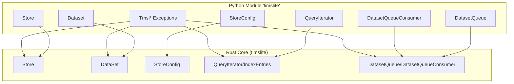
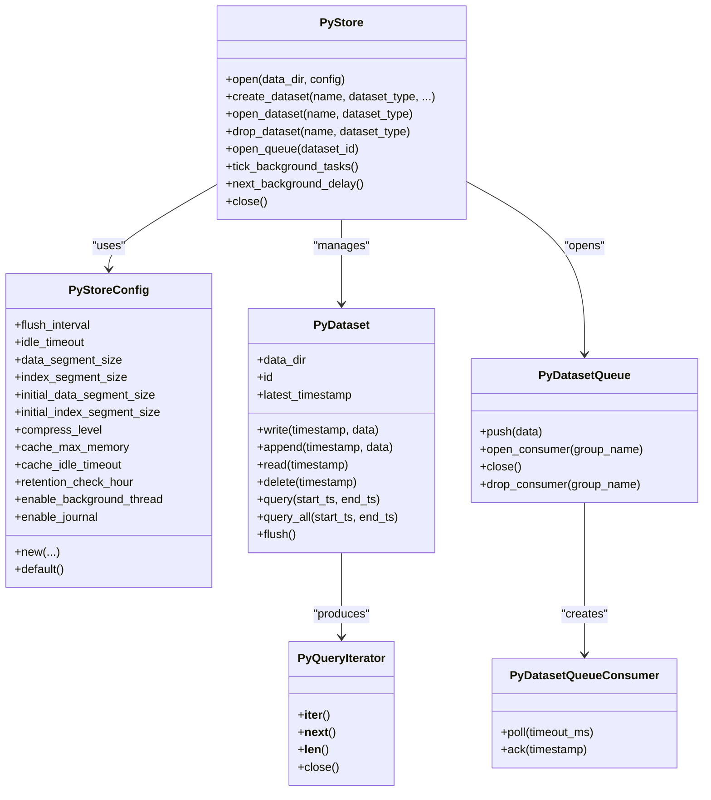
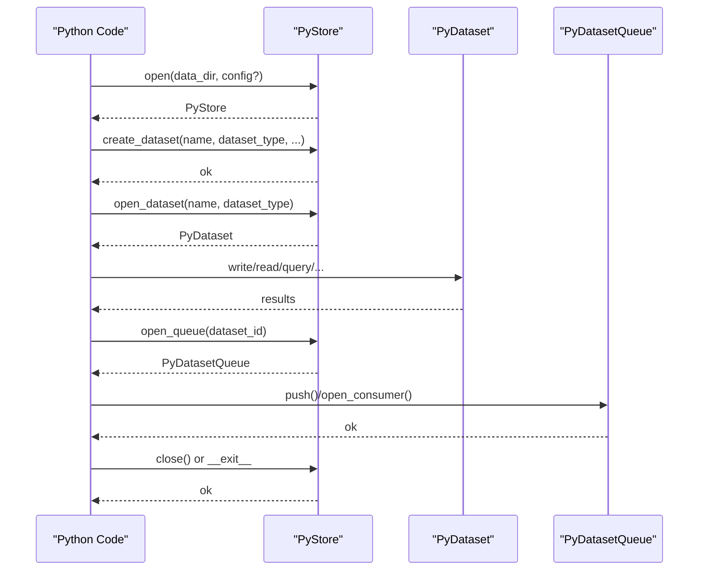
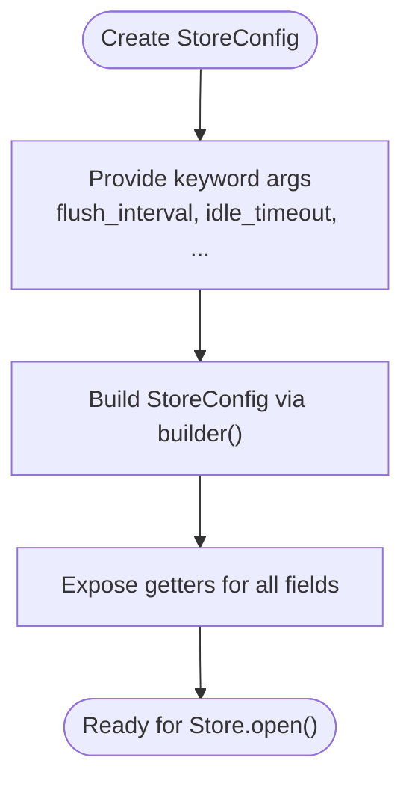
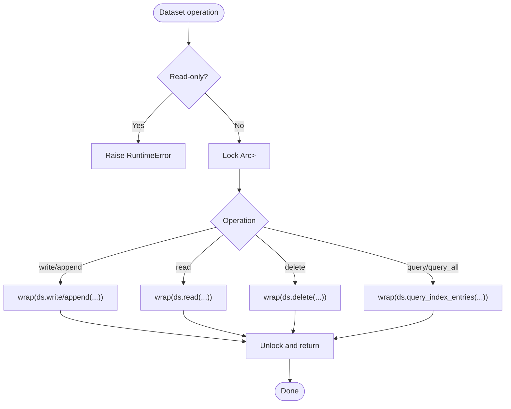
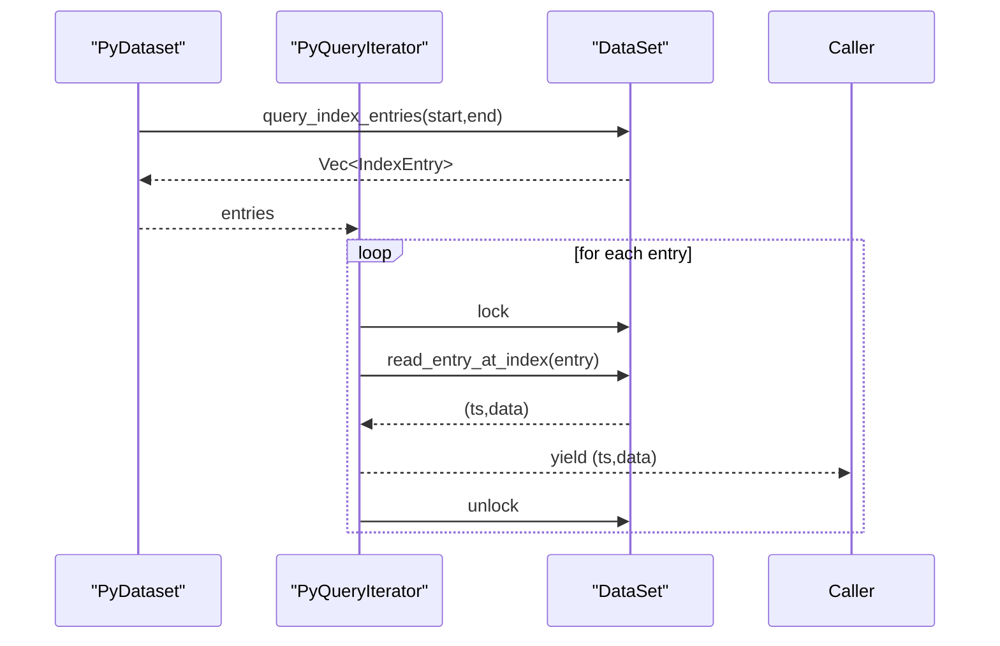
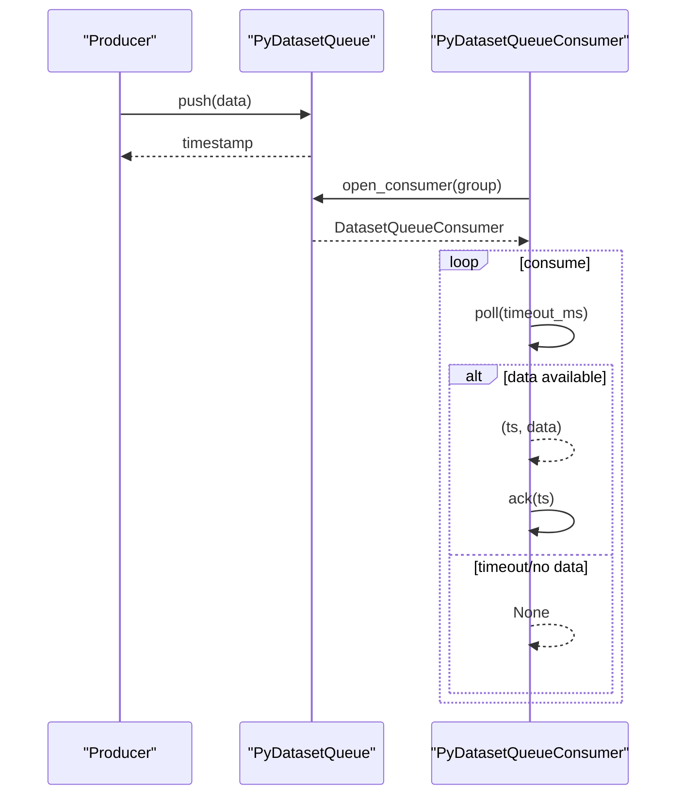
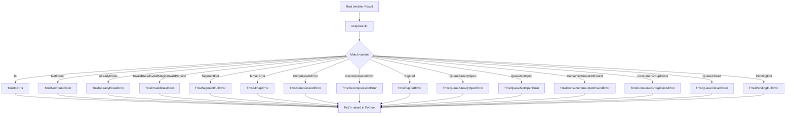
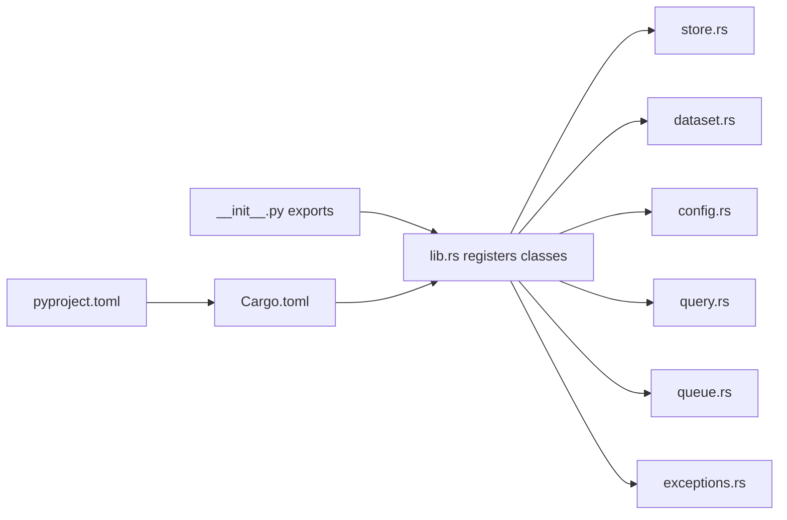

# Python Bindings

<cite>
**Referenced Files in This Document**
- [lib.rs](file://wrapper/python/src/lib.rs)
- [store.rs](file://wrapper/python/src/store.rs)
- [dataset.rs](file://wrapper/python/src/dataset.rs)
- [config.rs](file://wrapper/python/src/config.rs)
- [exceptions.rs](file://wrapper/python/src/exceptions.rs)
- [query.rs](file://wrapper/python/src/query.rs)
- [queue.rs](file://wrapper/python/src/queue.rs)
- [Cargo.toml](file://wrapper/python/Cargo.toml)
- [pyproject.toml](file://wrapper/python/pyproject.toml)
- [__init__.py](file://wrapper/python/python/timslite/__init__.py)
</cite>

## Table of Contents
1. [Introduction](#introduction)
2. [Project Structure](#project-structure)
3. [Core Components](#core-components)
4. [Architecture Overview](#architecture-overview)
5. [Detailed Component Analysis](#detailed-component-analysis)
6. [Dependency Analysis](#dependency-analysis)
7. [Performance Considerations](#performance-considerations)
8. [Troubleshooting Guide](#troubleshooting-guide)
9. [Conclusion](#conclusion)
10. [Appendices](#appendices)

## Introduction
This document describes the Python bindings for TimSLite’s PyO3 interface. It covers the complete Python API surface, including the Store class, Dataset operations, configuration via StoreConfig, and queue support. It also documents the exception hierarchy (TmslException classes), error propagation from Rust to Python, and practical usage patterns for Python workflows such as store initialization, dataset lifecycle, data operations, and query execution. Guidance is included for integrating with pandas and NumPy, memory management and resource cleanup, performance optimization, batch operations, and patterns for synchronous background task execution.

## Project Structure
The Python wrapper is implemented as a PyO3 extension module named timslite. The module exposes:
- Store: main entry point and context manager
- StoreConfig: configuration builder for the store
- Dataset: dataset operations (write, append, read, delete, query)
- QueryIterator: lazy iterator over query results
- DatasetQueue and DatasetQueueConsumer: queue semantics for streaming ingestion and consumption
- Tmsl* exception classes: typed error propagation from Rust

**Diagram sources**
- [lib.rs:14-28](file://wrapper/python/src/lib.rs#L14-L28)
- [store.rs:16-24](file://wrapper/python/src/store.rs#L16-L24)
- [dataset.rs:12-18](file://wrapper/python/src/dataset.rs#L12-L18)
- [config.rs:6-9](file://wrapper/python/src/config.rs#L6-L9)
- [query.rs:11-19](file://wrapper/python/src/query.rs#L11-L19)
- [queue.rs:15-18](file://wrapper/python/src/queue.rs#L15-L18)
- [exceptions.rs:15-106](file://wrapper/python/src/exceptions.rs#L15-L106)

**Section sources**
- [lib.rs:14-28](file://wrapper/python/src/lib.rs#L14-L28)
- [Cargo.toml:6-8](file://wrapper/python/Cargo.toml#L6-L8)
- [pyproject.toml:19-22](file://wrapper/python/pyproject.toml#L19-L22)

## Core Components
- Store
  - Context manager for safe acquisition and release of store resources
  - Dataset lifecycle management: create, open, drop
  - Queue subsystem access per dataset
  - Background task scheduling helpers
- StoreConfig
  - Keyword-based configuration for store creation
  - Accessors expose current values
- Dataset
  - Write, append, read, delete, flush
  - Query iteration and collection
  - Metadata accessors (data directory, latest timestamp)
- QueryIterator
  - Lazy, iterator-based query result traversal
  - Pre-fetches index entries, fetches payload on demand
- DatasetQueue and DatasetQueueConsumer
  - Producer: push records into a dataset-backed queue
  - Consumer: poll and acknowledge records from consumer groups

**Section sources**
- [store.rs:26-254](file://wrapper/python/src/store.rs#L26-L254)
- [config.rs:11-114](file://wrapper/python/src/config.rs#L11-L114)
- [dataset.rs:42-174](file://wrapper/python/src/dataset.rs#L42-L174)
- [query.rs:34-67](file://wrapper/python/src/query.rs#L34-L67)
- [queue.rs:20-109](file://wrapper/python/src/queue.rs#L20-L109)

## Architecture Overview
The Python API is a thin wrapper around the Rust core. Each Python class holds a handle to a Rust type, with careful resource management and error mapping.

**Diagram sources**
- [store.rs:26-254](file://wrapper/python/src/store.rs#L26-L254)
- [config.rs:11-114](file://wrapper/python/src/config.rs#L11-L114)
- [dataset.rs:42-174](file://wrapper/python/src/dataset.rs#L42-L174)
- [query.rs:34-67](file://wrapper/python/src/query.rs#L34-L67)
- [queue.rs:20-109](file://wrapper/python/src/queue.rs#L20-L109)

## Detailed Component Analysis

### Store
- Purpose: primary entry point; manages datasets and queues; controls background tasks
- Key behaviors:
  - Context manager: enter/exit ensures cleanup
  - Dataset management: create/open/drop
  - Queue access: open_queue(dataset_id)
  - Background task control: tick_background_tasks(), next_background_delay()
- Resource safety:
  - close() closes tracked datasets, clears internal maps, and drops the store
  - drop() performs best-effort flush and cleanup

**Diagram sources**
- [store.rs:38-60](file://wrapper/python/src/store.rs#L38-L60)
- [store.rs:101-145](file://wrapper/python/src/store.rs#L101-L145)
- [store.rs:147-174](file://wrapper/python/src/store.rs#L147-L174)
- [store.rs:176-212](file://wrapper/python/src/store.rs#L176-L212)
- [store.rs:214-223](file://wrapper/python/src/store.rs#L214-L223)
- [store.rs:225-253](file://wrapper/python/src/store.rs#L225-L253)
- [store.rs:78-99](file://wrapper/python/src/store.rs#L78-L99)

**Section sources**
- [store.rs:26-254](file://wrapper/python/src/store.rs#L26-L254)
- [store.rs:256-273](file://wrapper/python/src/store.rs#L256-L273)

### StoreConfig
- Purpose: configure store behavior at creation time
- Key behaviors:
  - Constructor accepts keyword arguments for all major settings
  - default() returns a sensible default configuration
  - Getters expose current values for inspection

**Diagram sources**
- [config.rs:13-46](file://wrapper/python/src/config.rs#L13-L46)
- [config.rs:48-53](file://wrapper/python/src/config.rs#L48-L53)
- [config.rs:55-113](file://wrapper/python/src/config.rs#L55-L113)

**Section sources**
- [config.rs:11-114](file://wrapper/python/src/config.rs#L11-L114)

### Dataset
- Purpose: perform dataset operations safely behind a mutex
- Key behaviors:
  - write(timestamp, data): strict ordering enforced
  - append(timestamp, data): append to existing record
  - read(timestamp): exact lookup or latest (-1)
  - delete(timestamp): mark deletion with sentinel
  - query(start_ts, end_ts): lazy iterator
  - query_all(start_ts, end_ts): eager collection
  - flush(): sync pending writes
  - metadata: data_dir, id, latest_timestamp

**Diagram sources**
- [dataset.rs:57-113](file://wrapper/python/src/dataset.rs#L57-L113)
- [dataset.rs:119-148](file://wrapper/python/src/dataset.rs#L119-L148)
- [dataset.rs:150-173](file://wrapper/python/src/dataset.rs#L150-L173)

**Section sources**
- [dataset.rs:42-174](file://wrapper/python/src/dataset.rs#L42-L174)

### QueryIterator
- Purpose: iterate over query results lazily
- Key behaviors:
  - Pre-fetches index entries (cheap)
  - On each __next__, locks dataset, reads one record, releases lock
  - Skips filler entries
  - Supports len() and explicit close()

**Diagram sources**
- [query.rs:21-32](file://wrapper/python/src/query.rs#L21-L32)
- [query.rs:34-67](file://wrapper/python/src/query.rs#L34-L67)

**Section sources**
- [query.rs:34-67](file://wrapper/python/src/query.rs#L34-L67)

### DatasetQueue and DatasetQueueConsumer
- Purpose: stream ingestion and consumption with consumer groups
- Key behaviors:
  - DatasetQueue.push(data): auto-assign timestamp and notify
  - DatasetQueue.open_consumer(group): create/open consumer group
  - DatasetQueueConsumer.poll(timeout_ms): receive next record or None
  - DatasetQueueConsumer.ack(timestamp): advance progress

**Diagram sources**
- [queue.rs:20-62](file://wrapper/python/src/queue.rs#L20-L62)
- [queue.rs:80-109](file://wrapper/python/src/queue.rs#L80-L109)

**Section sources**
- [queue.rs:20-109](file://wrapper/python/src/queue.rs#L20-L109)

### Exception Handling and Error Propagation
- Exception hierarchy rooted at TmslError
- Specific exceptions cover I/O, not found, already exists, invalid data, segment full, mmap, compression/decompression, expiration, queue-related errors, and pending limits
- Error mapping converts Rust TmslError variants to Python exceptions
- Convenience wrap(result) maps errors to PyErr

**Diagram sources**
- [exceptions.rs:164-192](file://wrapper/python/src/exceptions.rs#L164-L192)
- [exceptions.rs:107-162](file://wrapper/python/src/exceptions.rs#L107-L162)

**Section sources**
- [exceptions.rs:15-192](file://wrapper/python/src/exceptions.rs#L15-L192)

## Dependency Analysis
- Python module registration occurs in the #[pymodule] function, which registers exceptions and Python classes
- The module depends on the timslite Rust crate
- The build system uses Maturin to produce a cdylib extension module

**Diagram sources**
- [lib.rs:14-28](file://wrapper/python/src/lib.rs#L14-L28)
- [Cargo.toml:6-8](file://wrapper/python/Cargo.toml#L6-L8)
- [pyproject.toml:19-22](file://wrapper/python/pyproject.toml#L19-L22)
- [__init__.py:16-39](file://wrapper/python/python/timslite/__init__.py#L16-L39)

**Section sources**
- [lib.rs:14-28](file://wrapper/python/src/lib.rs#L14-L28)
- [Cargo.toml:10-12](file://wrapper/python/Cargo.toml#L10-L12)
- [pyproject.toml:19-22](file://wrapper/python/pyproject.toml#L19-L22)
- [__init__.py:16-64](file://wrapper/python/python/timslite/__init__.py#L16-L64)

## Performance Considerations
- Lazy queries: QueryIterator pre-fetches index entries but reads payloads on demand, minimizing memory footprint during iteration
- Batch-friendly APIs: query_all collects results into a pre-sized vector; consider this when expecting large result sets
- Background tasks: Use tick_background_tasks() and next_background_delay() to integrate background work into event loops when background threads are disabled
- Flush strategy: Call flush() periodically to reduce latency for readers; consider trade-offs with throughput
- Compression level: Tune compress_level in StoreConfig for a balance between I/O and CPU
- Segment sizing: Adjust data_segment_size and index_segment_size to match workload characteristics

[No sources needed since this section provides general guidance]

## Troubleshooting Guide
Common issues and resolutions:
- Store is closed: Operations raise RuntimeError when the store has been closed; ensure proper context manager usage or explicit close()
- Read-only dataset: Attempting write/append/delete on read-only datasets raises RuntimeError; journal dataset is intentionally read-only
- Invalid data errors: Timestamps must be > 0 and strictly increasing in non-continuous mode; duplicates and out-of-order writes cause TmslInvalidDataError
- Not found errors: Opening non-existent datasets or querying missing timestamps raise TmslNotFoundError
- Queue errors: QueueAlreadyOpenError indicates attempting to open an already-open queue; QueueClosedError indicates polling after queue closure
- Pending full: When producer pending entries exceed limits, TmslPendingFullError is raised

**Section sources**
- [store.rs:78-99](file://wrapper/python/src/store.rs#L78-L99)
- [dataset.rs:57-76](file://wrapper/python/src/dataset.rs#L57-L76)
- [dataset.rs:105-113](file://wrapper/python/src/dataset.rs#L105-L113)
- [exceptions.rs:168-186](file://wrapper/python/src/exceptions.rs#L168-L186)

## Conclusion
The Python bindings provide a Pythonic, safe, and efficient interface to TimSLite’s high-performance time-series storage. The API cleanly maps to Rust types, with robust error handling and resource management. By leveraging lazy iterators, batch operations, and background task integration, Python applications can achieve strong performance and reliability.

[No sources needed since this section summarizes without analyzing specific files]

## Appendices

### A. Python API Reference

- Store
  - open(data_dir: str, config: Optional[StoreConfig] = None) -> Store
  - create_dataset(name: str, dataset_type: str, data_segment_size: Optional[int] = None, index_segment_size: Optional[int] = None, compress_level: Optional[int] = None, index_continuous: bool = False, initial_data_segment_size: Optional[int] = None, initial_index_segment_size: Optional[int] = None) -> None
  - open_dataset(name: str, dataset_type: str) -> Dataset
  - drop_dataset(name: str, dataset_type: str) -> None
  - open_queue(dataset_id: int) -> DatasetQueue
  - tick_background_tasks() -> Tuple[int, int]: executed tasks and next delay in ms
  - next_background_delay() -> int: next delay in ms
  - close() -> None
  - Context manager: __enter__(), __exit__()

- StoreConfig
  - new(...): keyword arguments for all configuration fields
  - default() -> StoreConfig
  - Properties: flush_interval, idle_timeout, data_segment_size, index_segment_size, initial_data_segment_size, initial_index_segment_size, compress_level, cache_max_memory, cache_idle_timeout, retention_check_hour, enable_background_thread, enable_journal

- Dataset
  - write(timestamp: int, data: bytes) -> None
  - append(timestamp: int, data: bytes) -> None
  - read(timestamp: int) -> Optional[Tuple[int, bytes]]
  - delete(timestamp: int) -> None
  - query(start_ts: int, end_ts: int) -> QueryIterator
  - query_all(start_ts: int, end_ts: int) -> List[Tuple[int, bytes]]
  - flush() -> None
  - Properties: data_dir: str, id: int, latest_timestamp: int

- QueryIterator
  - __iter__() -> QueryIterator
  - __next__() -> Optional[Tuple[int, bytes]]
  - __len__() -> int
  - close() -> None

- DatasetQueue
  - push(data: bytes) -> int: timestamp
  - open_consumer(group_name: str) -> DatasetQueueConsumer
  - close() -> None
  - drop_consumer(group_name: str) -> None

- DatasetQueueConsumer
  - poll(timeout_ms: int) -> Optional[Tuple[int, bytes]]
  - ack(timestamp: int) -> None

- Exceptions
  - TmslError (base)
  - TmslIoError, TmslNotFoundError, TmslAlreadyExistsError, TmslInvalidDataError, TmslSegmentFullError, TmslMmapError, TmslCompressionError, TmslDecompressionError, TmslExpiredError, TmslQueueAlreadyOpenError, TmslQueueNotOpenError, TmslConsumerGroupNotFoundError, TmslConsumerGroupExistsError, TmslQueueClosedError, TmslPendingFullError

**Section sources**
- [store.rs:38-60](file://wrapper/python/src/store.rs#L38-L60)
- [store.rs:101-145](file://wrapper/python/src/store.rs#L101-L145)
- [store.rs:147-174](file://wrapper/python/src/store.rs#L147-L174)
- [store.rs:176-212](file://wrapper/python/src/store.rs#L176-L212)
- [store.rs:214-223](file://wrapper/python/src/store.rs#L214-L223)
- [store.rs:225-253](file://wrapper/python/src/store.rs#L225-L253)
- [config.rs:13-53](file://wrapper/python/src/config.rs#L13-L53)
- [config.rs:55-113](file://wrapper/python/src/config.rs#L55-L113)
- [dataset.rs:57-113](file://wrapper/python/src/dataset.rs#L57-L113)
- [dataset.rs:119-148](file://wrapper/python/src/dataset.rs#L119-L148)
- [dataset.rs:150-173](file://wrapper/python/src/dataset.rs#L150-L173)
- [query.rs:34-67](file://wrapper/python/src/query.rs#L34-L67)
- [queue.rs:20-62](file://wrapper/python/src/queue.rs#L20-L62)
- [queue.rs:80-109](file://wrapper/python/src/queue.rs#L80-L109)
- [exceptions.rs:15-106](file://wrapper/python/src/exceptions.rs#L15-L106)

### B. Usage Examples and Patterns

- Store initialization and context manager
  - Typical usage: open a store, create a dataset, perform writes and queries, and rely on context manager for cleanup
  - Reference: [store.rs:38-60](file://wrapper/python/src/store.rs#L38-L60), [store.rs:62-76](file://wrapper/python/src/store.rs#L62-L76)

- Dataset management
  - Create dataset with optional overrides; open and operate; drop when needed
  - Reference: [store.rs:101-145](file://wrapper/python/src/store.rs#L101-L145), [store.rs:147-174](file://wrapper/python/src/store.rs#L147-L174), [store.rs:214-223](file://wrapper/python/src/store.rs#L214-L223)

- Data operations
  - Write/append/read/delete with proper error handling
  - Reference: [dataset.rs:57-113](file://wrapper/python/src/dataset.rs#L57-L113)

- Query execution
  - Lazy iteration via QueryIterator; eager collection via query_all
  - Reference: [dataset.rs:119-148](file://wrapper/python/src/dataset.rs#L119-L148), [query.rs:34-67](file://wrapper/python/src/query.rs#L34-L67)

- Queue usage
  - Producer push; consumer poll/ack; manage consumer groups
  - Reference: [queue.rs:20-62](file://wrapper/python/src/queue.rs#L20-L62), [queue.rs:80-109](file://wrapper/python/src/queue.rs#L80-L109)

- Background task integration
  - Periodically call tick_background_tasks() and use next_background_delay() to schedule
  - Reference: [store.rs:225-253](file://wrapper/python/src/store.rs#L225-L253)

- Memory management and resource cleanup
  - Use context manager or explicit close(); DatasetQueue.close() and DatasetQueueConsumer.ack() help ensure progress and cleanup
  - Reference: [store.rs:62-76](file://wrapper/python/src/store.rs#L62-L76), [store.rs:78-99](file://wrapper/python/src/store.rs#L78-L99), [queue.rs:46-52](file://wrapper/python/src/queue.rs#L46-L52), [query.rs:61-67](file://wrapper/python/src/query.rs#L61-L67)

- Integration with pandas and NumPy
  - Convert query_all results to DataFrame for analytics
  - Convert bytes payloads to NumPy arrays as needed for downstream processing
  - Reference: [dataset.rs:128-148](file://wrapper/python/src/dataset.rs#L128-L148)

- Batch operations
  - Use query_all for bounded batches; iterate with QueryIterator for streaming
  - Reference: [dataset.rs:128-148](file://wrapper/python/src/dataset.rs#L128-L148), [query.rs:34-67](file://wrapper/python/src/query.rs#L34-L67)

- Async usage patterns
  - Integrate tick_background_tasks() into an event loop or asyncio loop; avoid long blocking operations inside dataset locks
  - Reference: [store.rs:225-253](file://wrapper/python/src/store.rs#L225-L253)

**Section sources**
- [store.rs:38-60](file://wrapper/python/src/store.rs#L38-L60)
- [store.rs:62-76](file://wrapper/python/src/store.rs#L62-L76)
- [store.rs:101-145](file://wrapper/python/src/store.rs#L101-L145)
- [store.rs:147-174](file://wrapper/python/src/store.rs#L147-L174)
- [store.rs:214-223](file://wrapper/python/src/store.rs#L214-L223)
- [store.rs:225-253](file://wrapper/python/src/store.rs#L225-L253)
- [dataset.rs:57-113](file://wrapper/python/src/dataset.rs#L57-L113)
- [dataset.rs:119-148](file://wrapper/python/src/dataset.rs#L119-L148)
- [dataset.rs:128-148](file://wrapper/python/src/dataset.rs#L128-L148)
- [query.rs:34-67](file://wrapper/python/src/query.rs#L34-L67)
- [queue.rs:20-62](file://wrapper/python/src/queue.rs#L20-L62)
- [queue.rs:80-109](file://wrapper/python/src/queue.rs#L80-L109)