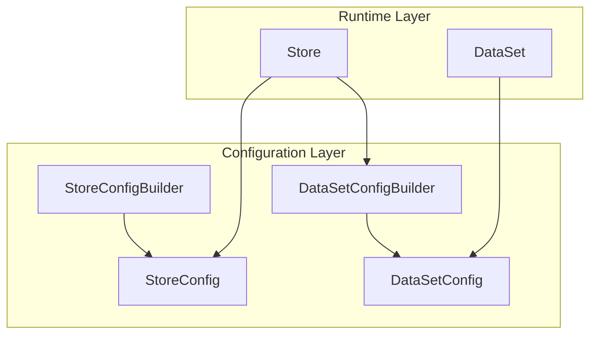
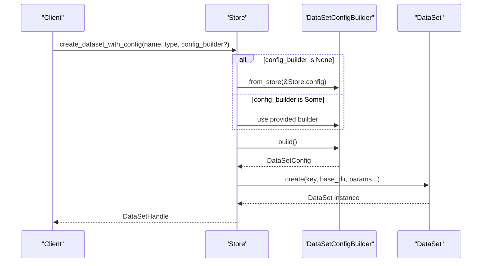
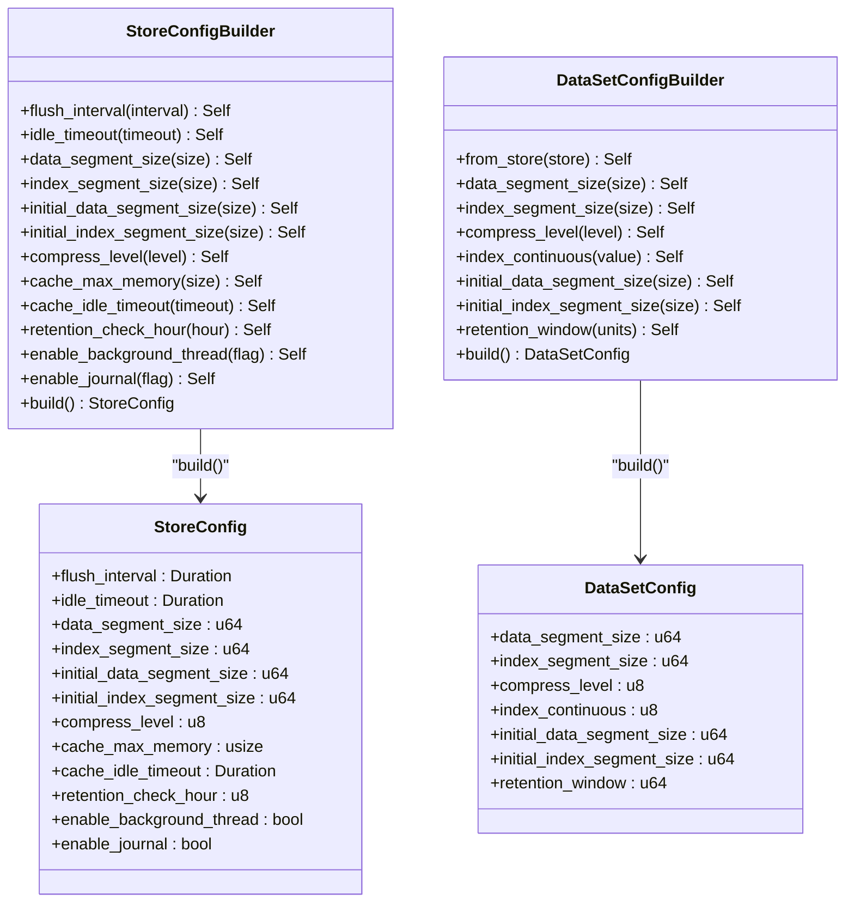
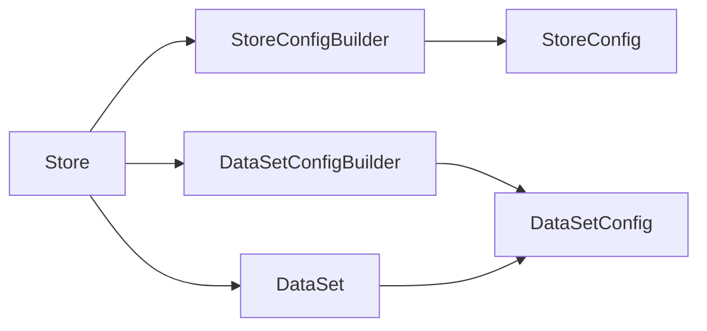

# Configuration Builders

<cite>
**Referenced Files in This Document**
- [config.rs](file://src/config.rs)
- [store.rs](file://src/store.rs)
- [dataset.rs](file://src/dataset.rs)
- [config_test.rs](file://tests/config_test.rs)
- [phase-14-dataset-config-builder.md](file://docs/plan/phase-14-dataset-config-builder.md)
- [store-and-ffi.md](file://docs/design/store-and-ffi.md)
- [timslite.h](file://include/timslite.h)
</cite>

## Table of Contents
1. [Introduction](#introduction)
2. [Project Structure](#project-structure)
3. [Core Components](#core-components)
4. [Architecture Overview](#architecture-overview)
5. [Detailed Component Analysis](#detailed-component-analysis)
6. [Dependency Analysis](#dependency-analysis)
7. [Performance Considerations](#performance-considerations)
8. [Troubleshooting Guide](#troubleshooting-guide)
9. [Conclusion](#conclusion)
10. [Appendices](#appendices)

## Introduction
This document explains TimSLite’s configuration builder system with a focus on:
- StoreConfigBuilder: store-level defaults and runtime behavior controls
- DataSetConfigBuilder: dataset-level tuning for blocks, indexing, compression, and retention

It covers builder pattern implementation, method chaining, validation logic, defaults, parameter ranges, interdependencies, performance implications, and practical configuration scenarios.

## Project Structure
TimSLite organizes configuration builders in a dedicated module and integrates them into the Store and DataSet lifecycle. The builder APIs are exposed to Rust and also bridged to the FFI layer.

**Diagram sources**
- [config.rs:26-203](file://src/config.rs#L26-L203)
- [store.rs:46-226](file://src/store.rs#L46-L226)
- [dataset.rs:71-160](file://src/dataset.rs#L71-L160)

**Section sources**
- [config.rs:1-501](file://src/config.rs#L1-L501)
- [store.rs:1-200](file://src/store.rs#L1-L200)

## Core Components
- StoreConfig: Immutable runtime configuration for the store, including segment sizing, compression, caching, retention, and background behavior.
- StoreConfigBuilder: Fluent builder to set optional fields; unset fields inherit defaults.
- DataSetConfig: Immutable dataset configuration derived from StoreConfig plus dataset-specific overrides.
- DataSetConfigBuilder: Fluent builder to override dataset defaults; supports inheriting from StoreConfig.

Key behaviors:
- Method chaining via returning Self
- Safe numeric clamping/capping (compression level, retention hour)
- Optional fields resolved to defaults during build()

**Section sources**
- [config.rs:26-203](file://src/config.rs#L26-L203)
- [config.rs:206-345](file://src/config.rs#L206-L345)

## Architecture Overview
The builder pattern sits between the Store and DataSet lifecycles. StoreConfigBuilder produces StoreConfig, while DataSetConfigBuilder produces DataSetConfig. Store::create_dataset_with_config consumes an optional builder and forwards parameters to DataSet::create.

**Diagram sources**
- [store.rs:163-226](file://src/store.rs#L163-L226)
- [config.rs:238-345](file://src/config.rs#L238-L345)
- [dataset.rs:84-160](file://src/dataset.rs#L84-L160)

## Detailed Component Analysis

### StoreConfigBuilder
Purpose: Configure store-wide defaults and runtime behavior for newly created datasets.

Fields and defaults:
- flush_interval: 10 minutes
- idle_timeout: 30 minutes
- data_segment_size: 64 MiB
- index_segment_size: 4 MiB
- initial_data_segment_size: 256 KiB
- initial_index_segment_size: 4 KiB
- compress_level: 6
- cache_max_memory: 256 MiB (0 disables)
- cache_idle_timeout: 30 minutes
- retention_check_hour: 0 (UTC)
- enable_background_thread: true
- enable_journal: true

Validation and normalization:
- compress_level is capped at 9
- retention_check_hour is clamped to 0–23
- Boolean toggles default to true unless overridden

Method chaining:
- Each setter returns Self, enabling fluent configuration
- build() merges provided values with defaults

Usage examples:
- Full override: chain setters for all desired fields
- Partial override: set only the fields you need; others inherit defaults
- Disable background thread: set enable_background_thread(false) and call Store::tick_background_tasks manually

**Section sources**
- [config.rs:12-71](file://src/config.rs#L12-L71)
- [config.rs:74-203](file://src/config.rs#L74-L203)
- [config_test.rs:17-43](file://tests/config_test.rs#L17-L43)

### DataSetConfigBuilder
Purpose: Configure dataset-specific parameters derived from StoreConfig with optional overrides.

Fields and defaults:
- data_segment_size: inherits from StoreConfig
- index_segment_size: inherits from StoreConfig
- compress_level: inherits from StoreConfig
- index_continuous: 0 (non-continuous by default)
- initial_data_segment_size: inherits from StoreConfig
- initial_index_segment_size: inherits from StoreConfig
- retention_window: 0 (no limit)

Inheritance and resolution:
- from_store(store_config) pre-fills all fields from StoreConfig
- index_continuous defaults to 0 even when inheriting
- retention_window defaults to 0 (no limit)

Method chaining:
- Each setter returns Self
- build() resolves missing fields from StoreConfig defaults

Integration with Store:
- Store::create_dataset_with_config accepts an optional builder
- If None, builder is created from store defaults
- If Some, build() merges user-provided overrides with store defaults

**Section sources**
- [config.rs:206-236](file://src/config.rs#L206-L236)
- [config.rs:238-345](file://src/config.rs#L238-L345)
- [store.rs:163-226](file://src/store.rs#L163-L226)
- [phase-14-dataset-config-builder.md:9-51](file://docs/plan/phase-14-dataset-config-builder.md#L9-L51)

### Builder Pattern Implementation and Validation Logic
- StoreConfigBuilder
  - Setters accept values and clamp/normalize where needed
  - build() resolves Option<T> to either provided value or default
- DataSetConfigBuilder
  - from_store() pre-fills from StoreConfig
  - build() resolves missing fields to defaults (including index_continuous default to 0)

Validation outcomes:
- Numeric ranges enforced (compress_level ≤ 9; retention_check_hour ∈ [0,23])
- Boolean toggles default to true unless explicitly disabled
- Optional fields allow partial configuration

**Section sources**
- [config.rs:97-203](file://src/config.rs#L97-L203)
- [config.rs:269-345](file://src/config.rs#L269-L345)

### FFI Integration and Compatibility
- StoreConfig FFI mirrors StoreConfig fields for C clients
- DataSetConfig FFI mirrors dataset-level fields for C clients
- FFI functions accept explicit parameters; Rust builder APIs are preferred for advanced scenarios
- FFI dataset creation converts TmslDatasetConfigFFI into a builder internally

**Section sources**
- [store-and-ffi.md:236-265](file://docs/design/store-and-ffi.md#L236-L265)
- [src/ffi.rs:229-251](file://src/ffi.rs#L229-L251)
- [src/ffi.rs:467-494](file://src/ffi.rs#L467-L494)
- [timslite.h:51-70](file://include/timslite.h#L51-L70)

## Architecture Overview

**Diagram sources**
- [config.rs:26-203](file://src/config.rs#L26-L203)
- [config.rs:206-345](file://src/config.rs#L206-L345)

## Detailed Component Analysis

### StoreConfigBuilder Methods and Behavior
- flush_interval, idle_timeout: control background cycle timing and segment idle-close behavior
- data_segment_size, index_segment_size: define maximum expansion targets for new segments
- initial_*_segment_size: define starting sizes for new segments
- compress_level: deflation level (0–9, capped at 9)
- cache_max_memory: block cache capacity (0 disables)
- cache_idle_timeout: cache entry eviction timing
- retention_check_hour: UTC hour for daily retention reclaim
- enable_background_thread: toggle automatic background tasks
- enable_journal: toggle change log

Validation summary:
- compress_level capped at 9
- retention_check_hour clamped to 0–23
- Boolean toggles default true unless overridden

**Section sources**
- [config.rs:74-203](file://src/config.rs#L74-L203)
- [config_test.rs:397-421](file://tests/config_test.rs#L397-L421)

### DataSetConfigBuilder Methods and Behavior
- from_store(): pre-fill from StoreConfig; index_continuous defaults to 0
- data_segment_size, index_segment_size, compress_level, initial_*_segment_size: override store defaults
- index_continuous: 0 (non-continuous) or 1 (continuous)
- retention_window: 0 means no time-based retention limit

Resolution order:
- Provided values take precedence
- Missing values inherit from StoreConfig defaults
- index_continuous defaults to 0 even when inheriting

**Section sources**
- [config.rs:238-345](file://src/config.rs#L238-L345)
- [phase-14-dataset-config-builder.md:9-51](file://docs/plan/phase-14-dataset-config-builder.md#L9-L51)

### Store::create_dataset_with_config Integration
- Accepts an optional DataSetConfigBuilder
- If None: creates builder from store defaults and builds
- If Some: builds provided builder
- Forwards resolved parameters to DataSet::create

**Section sources**
- [store.rs:163-226](file://src/store.rs#L163-L226)

### DataSet Creation and Meta Persistence
- DataSet::create writes immutable parameters to meta
- Open reads meta; sizes and compression cannot be overridden post-creation
- retention_window governs time-based retention policy

**Section sources**
- [dataset.rs:84-160](file://src/dataset.rs#L84-L160)

## Dependency Analysis

**Diagram sources**
- [config.rs:74-203](file://src/config.rs#L74-L203)
- [config.rs:238-345](file://src/config.rs#L238-L345)
- [store.rs:163-226](file://src/store.rs#L163-L226)
- [dataset.rs:84-160](file://src/dataset.rs#L84-L160)

**Section sources**
- [config.rs:74-203](file://src/config.rs#L74-L203)
- [config.rs:238-345](file://src/config.rs#L238-L345)
- [store.rs:163-226](file://src/store.rs#L163-L226)
- [dataset.rs:84-160](file://src/dataset.rs#L84-L160)

## Performance Considerations
- Segment sizing
  - Larger data_segment_size reduces index overhead and improves sequential read throughput but increases memory footprint and compaction cost
  - Larger index_segment_size allows more index entries per segment; tune based on expected cardinality
- Compression level
  - Higher levels reduce storage but increase CPU usage; balance based on storage vs. CPU budget
- Background tasks
  - Shorter flush_interval reduces data loss window but increases fsync frequency
  - Shorter idle_timeout frees resources sooner; adjust based on workload patterns
- Cache
  - Larger cache_max_memory improves read locality; disable (0) to conserve memory if needed
  - Shorter cache_idle_timeout reduces stale data in cache
- Retention
  - retention_window enables time-based reclaim; align retention_check_hour with maintenance windows
- Indexing mode
  - index_continuous affects write-path complexity and index density; choose based on query patterns

[No sources needed since this section provides general guidance]

## Troubleshooting Guide
Common issues and resolutions:
- Unexpected defaults after building
  - Ensure you pass an explicit builder or None to inherit store defaults
- Compression level not applied
  - Verify compress_level is within [0,9]; values above 9 are capped
- Retention hour ignored
  - Confirm retention_check_hour is within [0,23]; values outside are clamped
- Background tasks not running
  - If enable_background_thread is false, call Store::tick_background_tasks periodically
- FFI mismatch
  - For C clients, use TmslDatasetConfigFFI and tmsl_dataset_create_with_config; Rust builder APIs are recommended for advanced scenarios

**Section sources**
- [config.rs:134-156](file://src/config.rs#L134-L156)
- [config_test.rs:415-421](file://tests/config_test.rs#L415-L421)
- [store-and-ffi.md:236-265](file://docs/design/store-and-ffi.md#L236-L265)

## Conclusion
TimSLite’s configuration builders provide a safe, fluent way to configure store and dataset behavior. StoreConfigBuilder centralizes store-wide defaults and runtime controls, while DataSetConfigBuilder offers dataset-specific overrides with inheritance from store defaults. The builders enforce sensible defaults, clamp invalid values, and integrate cleanly with both Rust and FFI APIs. Use the builder pattern to compose configurations tailored to your workload characteristics and performance goals.

[No sources needed since this section summarizes without analyzing specific files]

## Appendices

### Configuration Scenarios and Examples
Note: The following examples describe usage patterns. Refer to the linked sources for exact API paths.

- Scenario A: Use store defaults for everything
  - Create StoreConfig with desired store-level settings
  - Call Store::create_dataset_with_config(name, type, None)
  - Internally resolves to DataSetConfigBuilder::from_store(&store.config).build()

  **Section sources**
  - [config.rs:238-282](file://src/config.rs#L238-L282)
  - [store.rs:194-196](file://src/store.rs#L194-L196)
  - [config_test.rs:17-43](file://tests/config_test.rs#L17-L43)

- Scenario B: Override compression and indexing mode
  - Build DataSetConfigBuilder::from_store(&store.config)
  - Set compress_level(9) and index_continuous(1)
  - Pass to Store::create_dataset_with_config

  **Section sources**
  - [config.rs:272-282](file://src/config.rs#L272-L282)
  - [config.rs:296-306](file://src/config.rs#L296-L306)
  - [config_test.rs:45-47](file://tests/config_test.rs#L45-L47)

- Scenario C: Enable manual background tasks
  - Build StoreConfig with enable_background_thread(false)
  - Periodically call Store::tick_background_tasks()

  **Section sources**
  - [config.rs:158-165](file://src/config.rs#L158-L165)
  - [store-and-ffi.md:273-287](file://docs/design/store-and-ffi.md#L273-L287)

- Scenario D: Configure retention window
  - Build DataSetConfigBuilder and set retention_window(units)
  - Units are in the same time unit as timestamps

  **Section sources**
  - [config.rs:320-324](file://src/config.rs#L320-L324)
  - [config_test.rs:494-499](file://tests/config_test.rs#L494-L499)

### Parameter Ranges and Defaults Reference
- StoreConfig defaults and ranges
  - flush_interval: seconds (default ~600)
  - idle_timeout: seconds (default ~1800)
  - data_segment_size: bytes (default ~67108864)
  - index_segment_size: bytes (default ~4194304)
  - initial_data_segment_size: bytes (default ~262144)
  - initial_index_segment_size: bytes (default ~4096)
  - compress_level: 0–9 (default 6, capped at 9)
  - cache_max_memory: bytes (default ~268435456, 0 disables)
  - cache_idle_timeout: seconds (default ~1800)
  - retention_check_hour: 0–23 (default 0)
  - enable_background_thread: true/false (default true)
  - enable_journal: true/false (default true)

- DataSetConfig defaults and ranges
  - Inherits sizes and compression from StoreConfig
  - index_continuous: 0 or 1 (default 0)
  - retention_window: 0 (no limit) or positive units

**Section sources**
- [config.rs:12-71](file://src/config.rs#L12-L71)
- [config.rs:206-236](file://src/config.rs#L206-L236)
- [config.rs:238-345](file://src/config.rs#L238-L345)