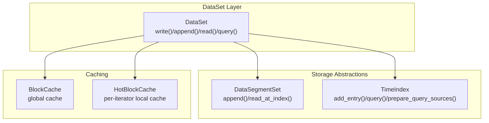
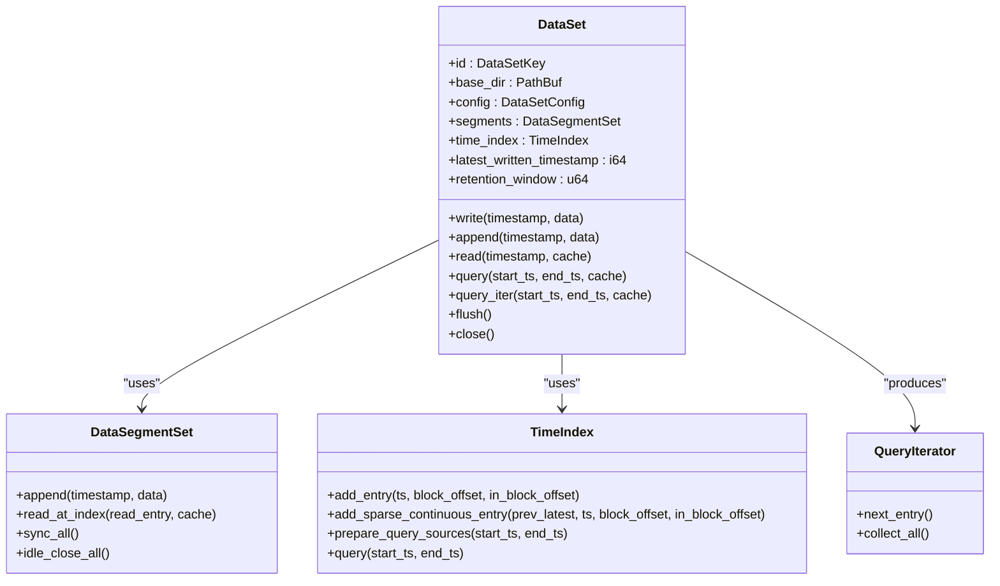
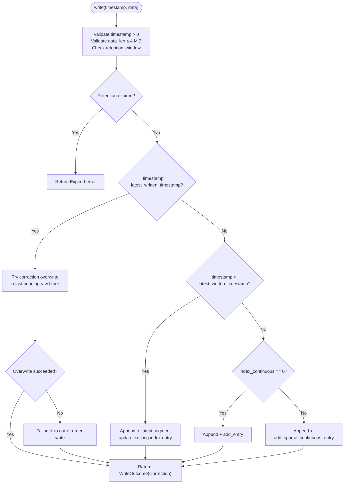
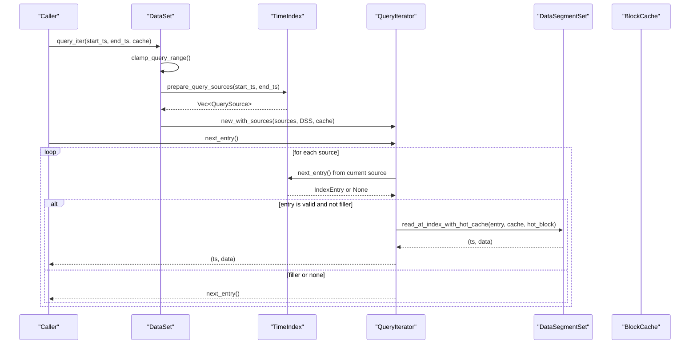
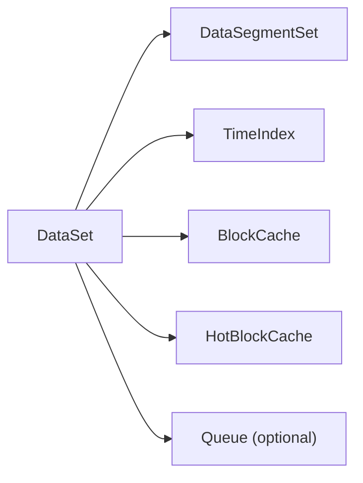

# Dataset Operations

<cite>
**Referenced Files in This Document**
- [dataset.rs](file://src/dataset.rs)
- [lib.rs](file://src/lib.rs)
- [dataset-operations.md](file://docs/design/dataset-operations.md)
- [phase-17-correction-write.md](file://docs/plan/phase-17-correction-write.md)
- [iter.rs](file://src/query/iter.rs)
- [mod.rs (query)](file://src/query/mod.rs)
- [segment/mod.rs](file://src/segment/mod.rs)
- [index/mod.rs](file://src/index/mod.rs)
- [dataset.rs (Python wrapper)](file://wrapper/python/src/dataset.rs)
- [dataset_basic_test.rs](file://tests/dataset_basic_test.rs)
- [correction_write_test.rs](file://tests/correction_write_test.rs)
- [query_test.rs](file://tests/query_test.rs)
- [out_of_order_delete_test.rs](file://tests/out_of_order_delete_test.rs)
- [error.rs](file://src/error.rs)
- [cache.rs](file://src/cache.rs)
</cite>

## Table of Contents
1. [Introduction](#introduction)
2. [Project Structure](#project-structure)
3. [Core Components](#core-components)
4. [Architecture Overview](#architecture-overview)
5. [Detailed Component Analysis](#detailed-component-analysis)
6. [Dependency Analysis](#dependency-analysis)
7. [Performance Considerations](#performance-considerations)
8. [Troubleshooting Guide](#troubleshooting-guide)
9. [Conclusion](#conclusion)
10. [Appendices](#appendices)

## Introduction
This document provides comprehensive documentation for TimSLite’s DataSet operations API. It focuses on the DataSet struct and its primary methods for writing and reading data: write(), append(), read(), and query(). It explains:
- Standard writes, batch-like append operations, and correction writes for out-of-order data
- Single-timestamp reads, range queries, and continuous data retrieval
- Query construction, filtering, sorting, and iteration patterns
- Transaction semantics, data consistency guarantees, and error handling strategies
- Performance optimization techniques and memory management considerations

## Project Structure
TimSLite organizes dataset operations around a central DataSet type that orchestrates:
- DataSegmentSet: manages data segment files and block-level writes
- TimeIndex: manages index segments and supports time-range queries
- QueryIterator: lazy iteration over query results with caching
- BlockCache and HotBlockCache: caches for compressed blocks and intra-query reuse

**Diagram sources**
- [dataset.rs:71-82](file://src/dataset.rs#L71-L82)
- [segment/mod.rs:43-53](file://src/segment/mod.rs#L43-L53)
- [index/mod.rs:20-31](file://src/index/mod.rs#L20-L31)
- [iter.rs:120-126](file://src/query/iter.rs#L120-L126)

**Section sources**
- [lib.rs:38-72](file://src/lib.rs#L38-L72)
- [dataset-operations.md:1-68](file://docs/design/dataset-operations.md#L1-L68)

## Core Components
- DataSet: central API for dataset lifecycle and operations
- DataSegmentSet: block-level aggregation, lazy open/idle-close, and record writes
- TimeIndex: time-indexed index segments with continuous mode support
- QueryIterator: lazy iteration over index sources with HotBlockCache and optional BlockCache
- BlockCache and HotBlockCache: caches for compressed blocks and intra-query reuse

Key responsibilities:
- write(): validates timestamp and data size, selects write branch (normal, correction, out-of-order), updates index and segments, and notifies queue if open
- append(): tail-appends to the latest unsealed record under constraints; may migrate to a single-record block if exceeding thresholds
- read(): resolves single timestamp, handles latest shortcut, and returns (ts, data) or None
- query()/query_iter(): constructs index sources for a time range, iterates lazily, skipping filler entries

**Section sources**
- [dataset.rs:71-82](file://src/dataset.rs#L71-L82)
- [dataset.rs:226-316](file://src/dataset.rs#L226-L316)
- [dataset.rs:318-429](file://src/dataset.rs#L318-L429)
- [dataset.rs:586-627](file://src/dataset.rs#L586-L627)
- [dataset.rs:629-668](file://src/dataset.rs#L629-L668)
- [iter.rs:120-216](file://src/query/iter.rs#L120-L216)

## Architecture Overview
DataSet composes DataSegmentSet and TimeIndex to provide:
- Block-level aggregation with delayed compression
- Lazy segment lifecycle (on-demand open, idle-close after inactivity)
- Time-indexed queries with binary search and continuous mode sparsification
- Optional global and per-iteration caching for compressed blocks

**Diagram sources**
- [dataset.rs:71-82](file://src/dataset.rs#L71-L82)
- [segment/mod.rs:43-53](file://src/segment/mod.rs#L43-L53)
- [index/mod.rs:20-31](file://src/index/mod.rs#L20-L31)
- [iter.rs:120-126](file://src/query/iter.rs#L120-L126)

## Detailed Component Analysis

### DataSet Struct and Lifecycle
- Creation: creates directories, writes immutable meta, initializes DataSegmentSet and TimeIndex
- Opening: loads meta, restores config, loads segments and index, recovers latest_written_timestamp
- Closing: flushes index and segments, closes queues if open
- Dropping: removes entire dataset directory

Operational highlights:
- latest_written_timestamp tracks the highest written timestamp; used for correction/out-of-order semantics and retention checks
- retention_window enforces visibility lower bound across read/write/append/delete operations

**Section sources**
- [dataset.rs:84-224](file://src/dataset.rs#L84-L224)
- [dataset-operations.md:5-67](file://docs/design/dataset-operations.md#L5-L67)

### Write Operations: Standard, Batch, and Correction Writes
DataSet::write() dispatches based on timestamp relationship with latest_written_timestamp and index mode:
- Normal write: append to latest segment and add index entry
- Correction write: overwrite the last pending raw block of the latest record (supports variable-size)
- Out-of-order write: append to latest segment and update existing index entry in place

Important constraints:
- timestamp must be > 0
- data length must not exceed 4 MiB
- retention_window may reject writes older than threshold
- continuous mode may materialize filler entries for sparse ranges

**Diagram sources**
- [dataset.rs:241-316](file://src/dataset.rs#L241-L316)
- [dataset.rs:441-523](file://src/dataset.rs#L441-L523)
- [dataset-operations.md:135-196](file://docs/design/dataset-operations.md#L135-L196)

**Section sources**
- [dataset.rs:241-316](file://src/dataset.rs#L241-L316)
- [dataset.rs:441-523](file://src/dataset.rs#L441-L523)
- [phase-17-correction-write.md:197-251](file://docs/plan/phase-17-correction-write.md#L197-L251)

### Append Operation
DataSet::append() tail-appends to the latest record under strict constraints:
- timestamp must be ≥ latest_written_timestamp
- data length must be ≤ 4 MiB
- latest record must be unsealed/pending and at the tail of the segment
- If appending would exceed 70% of a 64 KiB block, migrates to a single-record block and updates index

Behavioral notes:
- Empty data is accepted and returns Ok(())
- Migration invalidates old cache keys and increments invalid_record_count on the old segment
- Notify queue on new record creation

**Section sources**
- [dataset.rs:318-429](file://src/dataset.rs#L318-L429)
- [dataset-operations.md:306-380](file://docs/design/dataset-operations.md#L306-L380)

### Read Operations
DataSet::read() retrieves a single record by exact timestamp:
- timestamp == -1 resolves to latest_written_timestamp (no backward search)
- Returns None for expired timestamps, missing entries, or deleted/filler entries
- Uses TimeIndex::find_entry() and DataSegmentSet::read_at_index()

Additional helpers:
- read_entry_at_index(entry, cache) for reading from a known index entry
- latest_written_timestamp() for convenience

**Section sources**
- [dataset.rs:586-627](file://src/dataset.rs#L586-L627)
- [dataset.rs:678-692](file://src/dataset.rs#L678-L692)
- [dataset-operations.md:516-554](file://docs/design/dataset-operations.md#L516-L554)

### Query Methods: Filtering, Sorting, and Iteration
DataSet::query_iter() and DataSet::query() provide:
- Range query preparation via TimeIndex::prepare_query_sources()
- Lazy iteration via QueryIterator that skips filler entries
- Optional BlockCache and HotBlockCache for performance

Processing logic:
- Clamp query range to retention threshold
- Build sources for in-memory buffer and index segments
- Iterate entries, skip fillers, read records, and optionally cache decompressed payloads

**Diagram sources**
- [dataset.rs:629-647](file://src/dataset.rs#L629-L647)
- [iter.rs:120-216](file://src/query/iter.rs#L120-L216)
- [index/mod.rs:20-31](file://src/index/mod.rs#L20-L31)

**Section sources**
- [dataset.rs:629-668](file://src/dataset.rs#L629-L668)
- [iter.rs:120-216](file://src/query/iter.rs#L120-L216)
- [dataset-operations.md:469-514](file://docs/design/dataset-operations.md#L469-L514)

### Examples of Data Manipulation and Query Construction
- Basic lifecycle and persistence: create, write, flush, query, reopen and verify
- Correction write: same-size and resize corrections to the latest timestamp
- Query iteration: small range queries and empty-range handling
- Mixed operations: out-of-order writes, deletes, and combined workloads

These examples demonstrate:
- Using Store facade to create/open datasets and perform write/read/query
- Handling errors for expired timestamps and invalid operations
- Verifying correctness across reopen and flush boundaries

**Section sources**
- [dataset_basic_test.rs:18-61](file://tests/dataset_basic_test.rs#L18-L61)
- [correction_write_test.rs:18-47](file://tests/correction_write_test.rs#L18-L47)
- [correction_write_test.rs:50-89](file://tests/correction_write_test.rs#L50-L89)
- [query_test.rs:18-52](file://tests/query_test.rs#L18-L52)
- [query_test.rs:55-80](file://tests/query_test.rs#L55-L80)
- [out_of_order_delete_test.rs:18-50](file://tests/out_of_order_delete_test.rs#L18-L50)
- [out_of_order_delete_test.rs:84-117](file://tests/out_of_order_delete_test.rs#L84-L117)

### Transaction Semantics and Consistency Guarantees
- No explicit transactions or WAL: recent writes can be lost; index must not precede payload
- Publish order: payload/header must be durable before index entry becomes visible
- Crash boundary: index entries are not atomically updated; rely on sentinel fillers and record boundary checks
- Cache invalidation: after correction/out-of-order/delete, invalidate cache keys for old locations
- Retention: enforced visibility lower bound; expired data is not returned by reads or queries

**Section sources**
- [dataset-operations.md:109-118](file://docs/design/dataset-operations.md#L109-L118)
- [dataset.rs:574-584](file://src/dataset.rs#L574-L584)
- [dataset.rs:544-572](file://src/dataset.rs#L544-L572)

### Error Handling Strategies
Common errors and handling patterns:
- InvalidData: timestamp <= 0, data too large, out-of-order constraints, expired timestamps
- NotFound: dataset meta missing, index entry missing, deleted/filler entries
- Expired: timestamp below retention threshold
- AlreadyExists: attempting to create an existing dataset
- Queue-related errors: queue already open/closed, pending limits

Recommended handling:
- Validate inputs early (timestamp > 0, data length ≤ 4 MiB)
- Check retention_window before write/append/delete
- Use read() for optional existence checks; query() for ordered retrieval
- Wrap operations with error conversion in wrappers (e.g., Python)

**Section sources**
- [error.rs:8-43](file://src/error.rs#L8-L43)
- [dataset.rs:25-36](file://src/dataset.rs#L25-L36)
- [dataset.rs:263-269](file://src/dataset.rs#L263-L269)
- [dataset.rs:342-349](file://src/dataset.rs#L342-L349)
- [dataset.rs:549-557](file://src/dataset.rs#L549-L557)

## Dependency Analysis
DataSet depends on:
- DataSegmentSet for block-level writes and reads
- TimeIndex for index management and query source preparation
- BlockCache and HotBlockCache for compressed block caching and intra-query reuse
- Queue subsystem for notification when new data is appended

**Diagram sources**
- [dataset.rs:71-82](file://src/dataset.rs#L71-L82)
- [cache.rs:43-49](file://src/cache.rs#L43-L49)

**Section sources**
- [dataset.rs:71-82](file://src/dataset.rs#L71-L82)
- [cache.rs:43-49](file://src/cache.rs#L43-L49)

## Performance Considerations
- Block-level aggregation: pending raw blocks avoid compression overhead until overflow or migration
- Lazy segment lifecycle: idle-close after inactivity reduces file descriptors and memory
- QueryIterator: lazy evaluation avoids loading entire ranges; HotBlockCache reduces repeated decompressions
- Global BlockCache: caches decompressed payloads keyed by segment and block offsets
- Flush behavior: msync only; does not seal or compress pending blocks
- Append migration: when approaching 70% of a 64 KiB block, migrate to a single-record block to preserve append performance

Recommendations:
- Prefer append() for tail updates to latest record to avoid index churn
- Use query_iter() for large ranges to minimize memory footprint
- Enable BlockCache for repeated scans over compressed blocks
- Tune flush and idle timeouts according to workload characteristics

**Section sources**
- [dataset-operations.md:291-305](file://docs/design/dataset-operations.md#L291-L305)
- [dataset-operations.md:469-514](file://docs/design/dataset-operations.md#L469-L514)
- [cache.rs:51-66](file://src/cache.rs#L51-L66)
- [dataset.rs:397-417](file://src/dataset.rs#L397-L417)

## Troubleshooting Guide
Common issues and resolutions:
- Out-of-order write rejected: ensure index_continuous mode allows sparse filler updates or adjust timestamp ordering
- Correction write fails: verify the latest record is unsealed and at the tail of the last pending raw block
- Expired timestamp errors: check retention_window and latest_written_timestamp; adjust window or reissue within bounds
- Empty queries: confirm timestamps overlap with actual data; remember filler entries are skipped
- Cache misses: enable BlockCache and consider increasing max_memory; monitor cache stats

Validation references:
- Tests for correction writes, out-of-order writes, and query ranges
- Python wrapper behavior for read-only datasets and error propagation

**Section sources**
- [correction_write_test.rs:18-47](file://tests/correction_write_test.rs#L18-L47)
- [out_of_order_delete_test.rs:18-50](file://tests/out_of_order_delete_test.rs#L18-L50)
- [query_test.rs:18-52](file://tests/query_test.rs#L18-L52)
- [dataset.rs (Python wrapper):57-113](file://wrapper/python/src/dataset.rs#L57-L113)

## Conclusion
DataSet provides a robust, high-performance API for time-series data with careful attention to write semantics, query efficiency, and consistency under the constraints of mmap-backed storage. By leveraging block-level aggregation, lazy segment lifecycle, and targeted caching, it delivers strong performance for typical ingestion and retrieval patterns. Understanding retention, correction/out-of-order semantics, and cache invalidation is essential for reliable operation.

## Appendices

### API Reference Summary
- write(timestamp, data): standard, correction, or out-of-order write depending on timestamp relationship
- append(timestamp, data): tail-append to latest record under constraints
- read(timestamp, cache): single-timestamp read with latest shortcut
- query(start_ts, end_ts, cache): collect-all query over a range
- query_iter(start_ts, end_ts, cache): lazy iterator over index sources
- flush(): persist pending state without sealing or compressing
- close(): flush and idle-close segments and index

**Section sources**
- [dataset.rs:226-316](file://src/dataset.rs#L226-L316)
- [dataset.rs:318-429](file://src/dataset.rs#L318-L429)
- [dataset.rs:586-627](file://src/dataset.rs#L586-L627)
- [dataset.rs:629-668](file://src/dataset.rs#L629-L668)
- [dataset.rs:694-716](file://src/dataset.rs#L694-L716)