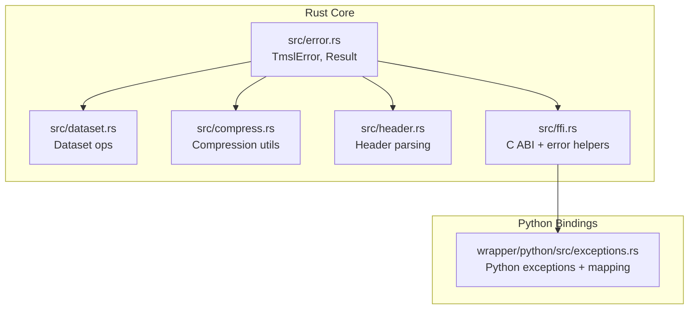
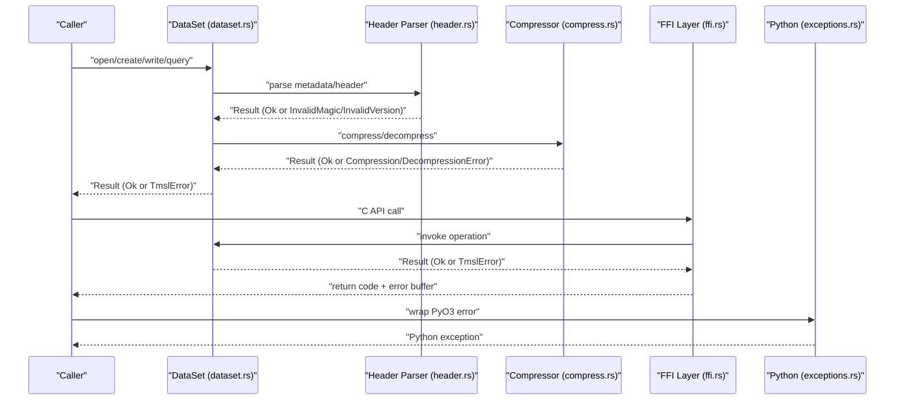
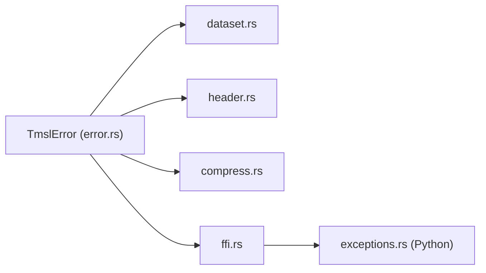

# Error Handling

<cite>
**Referenced Files in This Document**
- [error.rs](file://src/error.rs)
- [lib.rs](file://src/lib.rs)
- [exceptions.rs](file://wrapper/python/src/exceptions.rs)
- [dataset.rs](file://src/dataset.rs)
- [compress.rs](file://src/compress.rs)
- [header.rs](file://src/header.rs)
- [ffi.rs](file://src/ffi.rs)
</cite>

## Table of Contents
1. [Introduction](#introduction)
2. [Project Structure](#project-structure)
3. [Core Components](#core-components)
4. [Architecture Overview](#architecture-overview)
5. [Detailed Component Analysis](#detailed-component-analysis)
6. [Dependency Analysis](#dependency-analysis)
7. [Performance Considerations](#performance-considerations)
8. [Troubleshooting Guide](#troubleshooting-guide)
9. [Conclusion](#conclusion)

## Introduction
This document describes TimSLite’s error handling system. It documents the TmslError enumeration, the Result type alias, propagation patterns across the API, and how errors are surfaced to Python consumers. It also covers diagnostic information, recovery mechanisms, and best practices for production-grade error handling.

## Project Structure
TimSLite centralizes error types in a single module and re-exports them via the crate root. The FFI layer converts Rust errors into C-compatible error buffers and wraps them into Python exceptions for Python bindings.



**Diagram sources**
- [error.rs:1-145](file://src/error.rs#L1-L145)
- [dataset.rs:1-200](file://src/dataset.rs#L1-L200)
- [compress.rs:1-101](file://src/compress.rs#L1-L101)
- [header.rs:630-657](file://src/header.rs#L630-L657)
- [ffi.rs:30-99](file://src/ffi.rs#L30-L99)
- [exceptions.rs:1-193](file://wrapper/python/src/exceptions.rs#L1-L193)

**Section sources**
- [error.rs:1-145](file://src/error.rs#L1-L145)
- [lib.rs:63](file://src/lib.rs#L63)

## Core Components
- TmslError: A centralized enumeration covering I/O, format validation, memory mapping, compression/decompression, data validity, resource presence/absence/expiry, queue state, and capacity limits.
- Result: A convenient alias for std::result::Result<T, TmslError>.
- Error propagation: Functions return Result<T> and convert lower-level errors into TmslError variants, often using map_err or explicit Err(...) branches.
- Python mapping: The Python wrapper defines a hierarchy of exceptions and maps TmslError variants to Python exceptions.

Key characteristics:
- Display messages are human-readable and include contextual details.
- Source chaining is supported for I/O errors.
- FFI writes error messages into a caller-provided C buffer.
- Python exceptions mirror the Rust variant hierarchy.

**Section sources**
- [error.rs:6-87](file://src/error.rs#L6-L87)
- [lib.rs:63](file://src/lib.rs#L63)
- [exceptions.rs:15-192](file://wrapper/python/src/exceptions.rs#L15-L192)

## Architecture Overview
The error architecture follows a layered pattern:
- Lower-level modules (I/O, compression, file parsing) raise TmslError variants.
- Higher-level modules (dataset, query, queue) propagate TmslError up the stack.
- FFI catches errors and writes them into a C buffer.
- Python bindings translate TmslError into Python exceptions.



**Diagram sources**
- [dataset.rs:165-200](file://src/dataset.rs#L165-L200)
- [header.rs:638-657](file://src/header.rs#L638-L657)
- [compress.rs:7-16](file://src/compress.rs#L7-L16)
- [ffi.rs:306-330](file://src/ffi.rs#L306-L330)
- [exceptions.rs:164-192](file://wrapper/python/src/exceptions.rs#L164-L192)

## Detailed Component Analysis

### TmslError Enum Variants and Semantics
- I/O errors: Wraps std::io::Error; carries OS-level diagnostics.
- Format validation: InvalidMagic, InvalidVersion(u16).
- Memory mapping: MmapError(String).
- Compression/decompression: CompressionError(String), DecompressionError(String).
- Data validity: InvalidData(String) for malformed records, out-of-order, duplicates, or corrupt blocks.
- Resource state: NotFound(String), AlreadyExists(String).
- Retention: Expired(String) for timestamps outside retention.
- Segment capacity: SegmentFull.
- Queue subsystem: QueueAlreadyOpen(String), QueueNotOpen(String), ConsumerGroupNotFound(String), ConsumerGroupExists(String), QueueClosed(String), PendingFull(String).

Each variant includes a Display impl that produces a readable message and an Error::source impl for I/O variants.

**Section sources**
- [error.rs:8-78](file://src/error.rs#L8-L78)

### Result Type Alias and Propagation Patterns
- Result<T> is defined as std::result::Result<T, TmslError>.
- Propagation occurs via:
  - map_err to convert lower-level errors into TmslError variants.
  - Explicit Err(...) branches for domain-specific validations.
  - Conversions like From<io::Error> for transparent I/O wrapping.

Examples of propagation:
- Compression utilities convert inflate errors into DecompressionError.
- Header parsing converts raw read errors into InvalidMagic/InvalidData.
- Dataset operations check existence and return AlreadyExists/NotFound.
- FFI converts higher-level errors into Io-wrapped strings for C consumers.

**Section sources**
- [error.rs:86-87](file://src/error.rs#L86-L87)
- [compress.rs:12-16](file://src/compress.rs#L12-L16)
- [header.rs:640-645](file://src/header.rs#L640-L645)
- [dataset.rs:101-106](file://src/dataset.rs#L101-L106)
- [dataset.rs:168-173](file://src/dataset.rs#L168-L173)
- [ffi.rs:322-323](file://src/ffi.rs#L322-L323)

### FFI Error Handling
- Error buffers: write_error writes a formatted message into a C char buffer, safely truncated and null-terminated.
- Panic safety: ffi_catch_int!/ffi_catch_ptr!/ffi_catch_usize! macros catch panics and return sentinel values, writing “internal panic” to the error buffer.
- Error conversion: Many FFI functions map higher-level errors into TmslError::Io(std::io::Error::other(...)) to carry the message back to C.

```mermaid
flowchart TD
Start(["FFI Call"]) --> Validate["Validate pointers and inputs"]
Validate --> Ok{"Valid?"}
Ok --> |No| ErrMsg["write_error(err_buf, err_buf_len, \"...\")<br/>return sentinel"]
Ok --> |Yes| TryOp["Execute operation"]
TryOp --> OpOk{"Operation Ok?"}
OpOk --> |Yes| ReturnVal["Return success value"]
OpOk --> |No| Catch["Catch error or panic"]
Catch --> Write["write_error(err_buf, err_buf_len, err_msg)"]
Write --> ReturnErr["Return sentinel"]
```

**Diagram sources**
- [ffi.rs:32-47](file://src/ffi.rs#L32-L47)
- [ffi.rs:50-97](file://src/ffi.rs#L50-L97)
- [ffi.rs:306-330](file://src/ffi.rs#L306-L330)

**Section sources**
- [ffi.rs:32-47](file://src/ffi.rs#L32-L47)
- [ffi.rs:50-97](file://src/ffi.rs#L50-L97)
- [ffi.rs:306-358](file://src/ffi.rs#L306-L358)

### Python Exception Mapping
- A base TmslError exception is defined and several specific exceptions inherit from it.
- map_error matches TmslError variants and raises the corresponding Python exception with the formatted message.

```mermaid
classDiagram
class TmslError {
+Display
+Error : : source()
}
class TmslIoError
class TmslNotFoundError
class TmslAlreadyExistsError
class TmslInvalidDataError
class TmslSegmentFullError
class TmslMmapError
class TmslCompressionError
class TmslDecompressionError
class TmslExpiredError
class TmslQueueAlreadyOpenError
class TmslQueueNotOpenError
class TmslConsumerGroupNotFoundError
class TmslConsumerGroupExistsError
class TmslQueueClosedError
class TmslPendingFullError
TmslIoError --|> TmslError
TmslNotFoundError --|> TmslError
TmslAlreadyExistsError --|> TmslError
TmslInvalidDataError --|> TmslError
TmslSegmentFullError --|> TmslError
TmslMmapError --|> TmslError
TmslCompressionError --|> TmslError
TmslDecompressionError --|> TmslError
TmslExpiredError --|> TmslError
TmslQueueAlreadyOpenError --|> TmslError
TmslQueueNotOpenError --|> TmslError
TmslConsumerGroupNotFoundError --|> TmslError
TmslConsumerGroupExistsError --|> TmslError
TmslQueueClosedError --|> TmslError
TmslPendingFullError --|> TmslError
```

- wrap(result) converts a Rust Result<T> into a PyResult<T> by mapping errors to Python exceptions.



**Diagram sources**
- [exceptions.rs:15-105](file://wrapper/python/src/exceptions.rs#L15-L105)
- [exceptions.rs:164-192](file://wrapper/python/src/exceptions.rs#L164-L192)

**Section sources**
- [exceptions.rs:15-192](file://wrapper/python/src/exceptions.rs#L15-L192)

### Practical Scenarios and Recovery Mechanisms
- File system errors (I/O):
  - Symptoms: Permission denied, file not found, disk full.
  - Recovery: Fix permissions/path, free space, retry with exponential backoff.
  - Example propagation: I/O errors are converted to TmslError::Io and carried through the stack.
- Invalid configurations:
  - Symptoms: Unsupported version, invalid UTF-8 in names/types, invalid magic/version in files.
  - Recovery: Adjust configuration to supported values, fix file corruption, reinitialize metadata.
  - Example propagation: InvalidMagic/InvalidVersion/InvalidData variants are raised during parsing and header reads.
- Runtime failures (segment full, expired, pending full):
  - Symptoms: SegmentFull indicates expansion is needed; Expired signals retention policy; PendingFull indicates consumer backpressure.
  - Recovery: Expand segments, adjust retention windows, drain consumers, or throttle producers.
  - Example propagation: These are returned directly from dataset operations and queue operations.

**Section sources**
- [error.rs:8-43](file://src/error.rs#L8-L43)
- [header.rs:640-645](file://src/header.rs#L640-L645)
- [dataset.rs:25-36](file://src/dataset.rs#L25-L36)
- [dataset.rs:168-173](file://src/dataset.rs#L168-L173)

## Dependency Analysis
- TmslError is used pervasively across modules:
  - dataset.rs: Creation, opening, writing, querying, deletion, and queue operations.
  - header.rs: Parsing metadata and validating magic/version.
  - compress.rs: Compression/decompression utilities.
  - ffi.rs: FFI entry points and error-to-C-buffer conversion.
  - exceptions.rs: Python exception mapping.



**Diagram sources**
- [error.rs:6-87](file://src/error.rs#L6-L87)
- [dataset.rs:1-200](file://src/dataset.rs#L1-L200)
- [header.rs:638-657](file://src/header.rs#L638-L657)
- [compress.rs:7-16](file://src/compress.rs#L7-L16)
- [ffi.rs:306-330](file://src/ffi.rs#L306-L330)
- [exceptions.rs:164-192](file://wrapper/python/src/exceptions.rs#L164-L192)

**Section sources**
- [error.rs:6-87](file://src/error.rs#L6-L87)
- [dataset.rs:1-200](file://src/dataset.rs#L1-L200)
- [header.rs:638-657](file://src/header.rs#L638-L657)
- [compress.rs:7-16](file://src/compress.rs#L7-L16)
- [ffi.rs:306-330](file://src/ffi.rs#L306-L330)
- [exceptions.rs:164-192](file://wrapper/python/src/exceptions.rs#L164-L192)

## Performance Considerations
- Error boxing and cloning: Keep error messages concise; avoid large allocations in error paths.
- I/O error chaining: source() allows unwrapping underlying io::Error for platform-specific diagnostics without extra copies.
- FFI error buffers: write_error truncates safely; callers should allocate adequate buffers to avoid silent truncation.
- Compression/decompression: Prefer appropriate compression levels to balance CPU and I/O; invalid compressed data triggers DecompressionError.

[No sources needed since this section provides general guidance]

## Troubleshooting Guide
Common symptoms and actions:
- InvalidMagic or InvalidVersion:
  - Cause: Corrupt or incompatible file.
  - Action: Verify file integrity, reinitialize metadata, or upgrade/downgrade according to supported versions.
  - Evidence: Header parsing raises these variants.
- DecompressionError:
  - Cause: Corrupted compressed data.
  - Action: Rebuild affected segments or re-ingest data.
  - Evidence: Compression utilities map inflate errors to DecompressionError.
- AlreadyExists or NotFound:
  - Cause: Attempting to create an existing dataset or open a missing one.
  - Action: Check dataset lifecycle and paths.
  - Evidence: Dataset creation/open checks and returns these variants.
- Expired:
  - Cause: Writing or querying timestamps outside retention.
  - Action: Adjust retention window or filter inputs.
  - Evidence: Dataset operations enforce retention and return Expired.
- SegmentFull:
  - Cause: No space left in segment.
  - Action: Expand segment sizes or seal and rotate to a new segment.
  - Evidence: Dataset write/appending logic returns SegmentFull.
- PendingFull:
  - Cause: Consumer groups exceed max pending entries.
  - Action: Drain consumers or increase limits cautiously.
  - Evidence: Queue operations return PendingFull.

Debugging tips:
- Inspect Display messages for contextual details.
- For I/O errors, use source() to access the underlying std::io::Error for OS diagnostics.
- In Python, catch specific exceptions (e.g., TmslNotFoundError, TmslExpiredError) to tailor handling.
- In C, read the error buffer to diagnose FFI failures; ensure the buffer is large enough.

**Section sources**
- [header.rs:640-645](file://src/header.rs#L640-L645)
- [compress.rs:12-16](file://src/compress.rs#L12-L16)
- [dataset.rs:101-106](file://src/dataset.rs#L101-L106)
- [dataset.rs:168-173](file://src/dataset.rs#L168-L173)
- [dataset.rs:25-36](file://src/dataset.rs#L25-L36)
- [exceptions.rs:164-192](file://wrapper/python/src/exceptions.rs#L164-L192)
- [ffi.rs:32-47](file://src/ffi.rs#L32-L47)

## Conclusion
TimSLite’s error handling is centralized, expressive, and consistent. TmslError encapsulates domain-specific failures with clear semantics, while Result<T> enables straightforward propagation. The FFI and Python layers preserve error fidelity across boundaries. Production deployments should leverage Display messages, source() for I/O diagnostics, and targeted exception handling to build robust systems resilient to file system, configuration, and runtime failures.