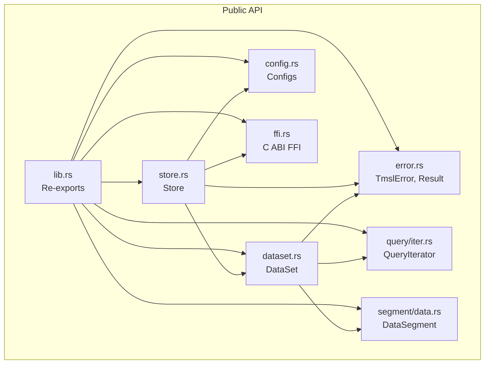
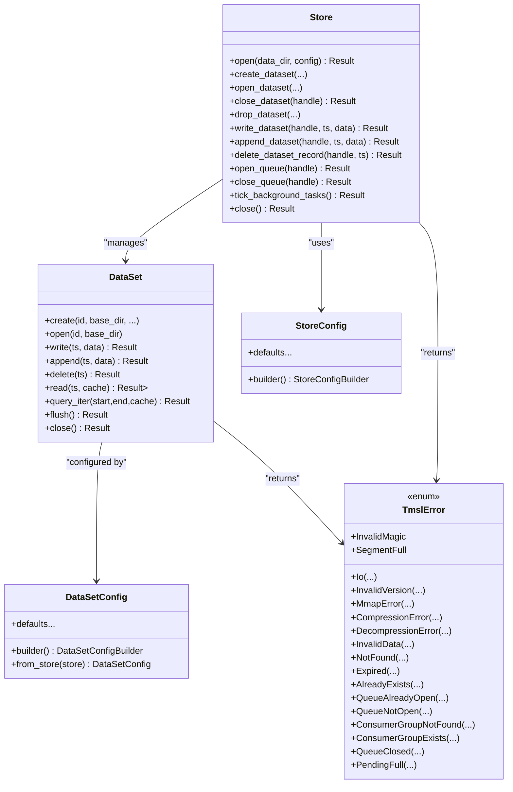
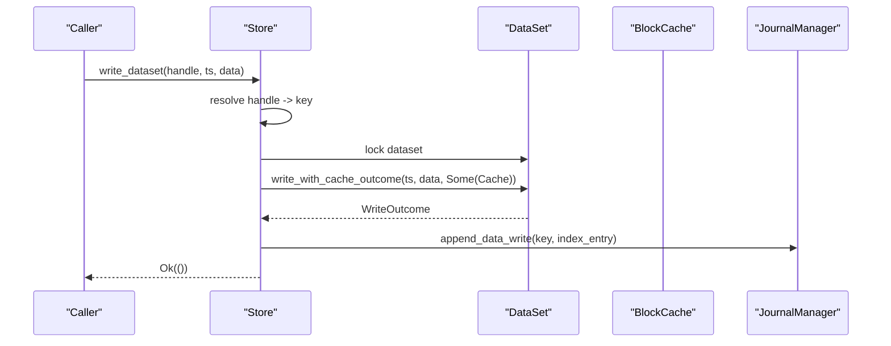
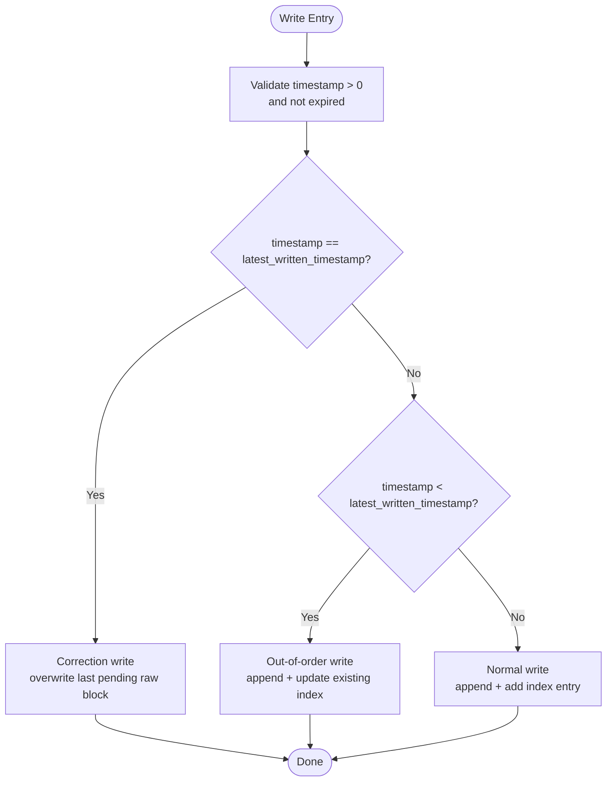
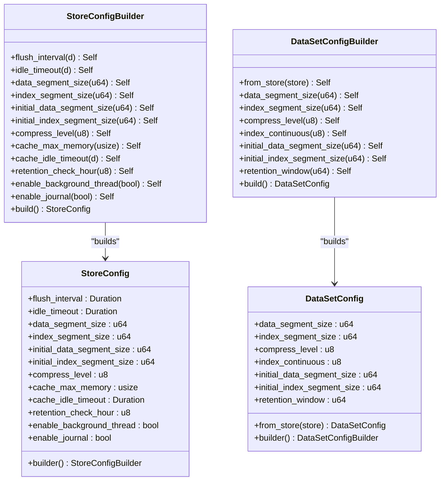
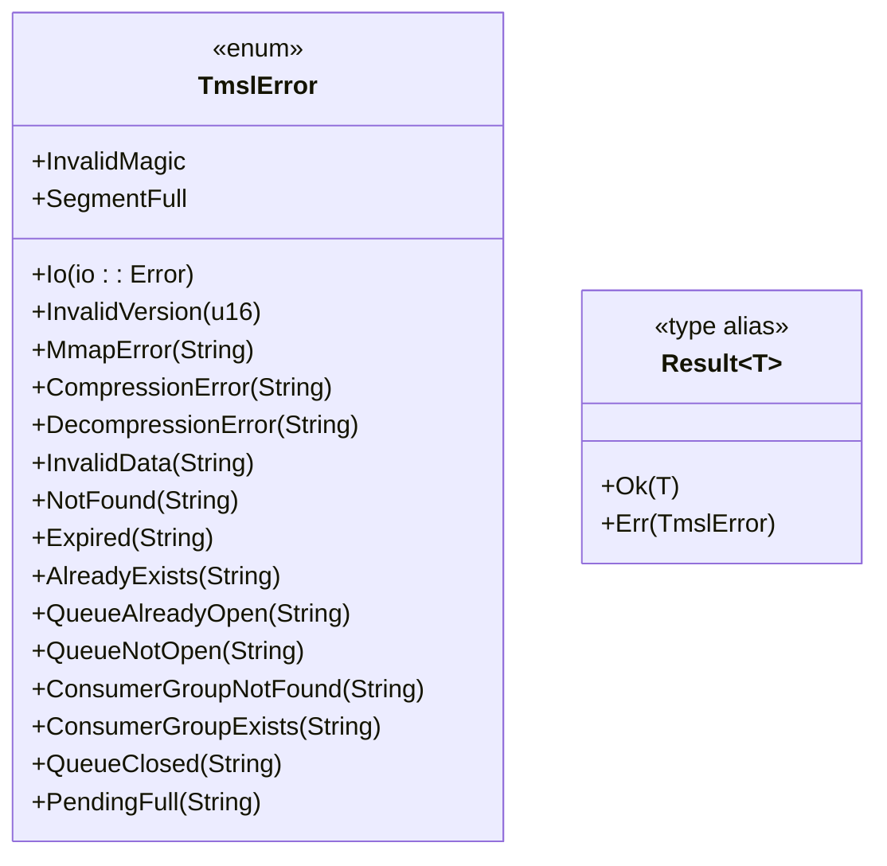
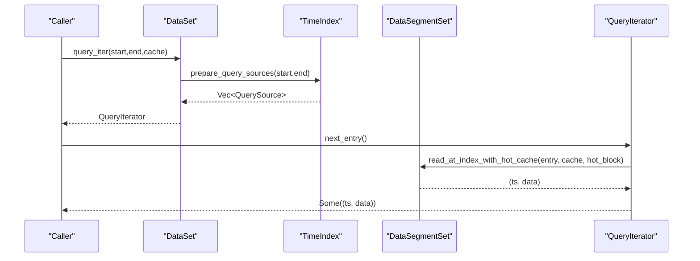
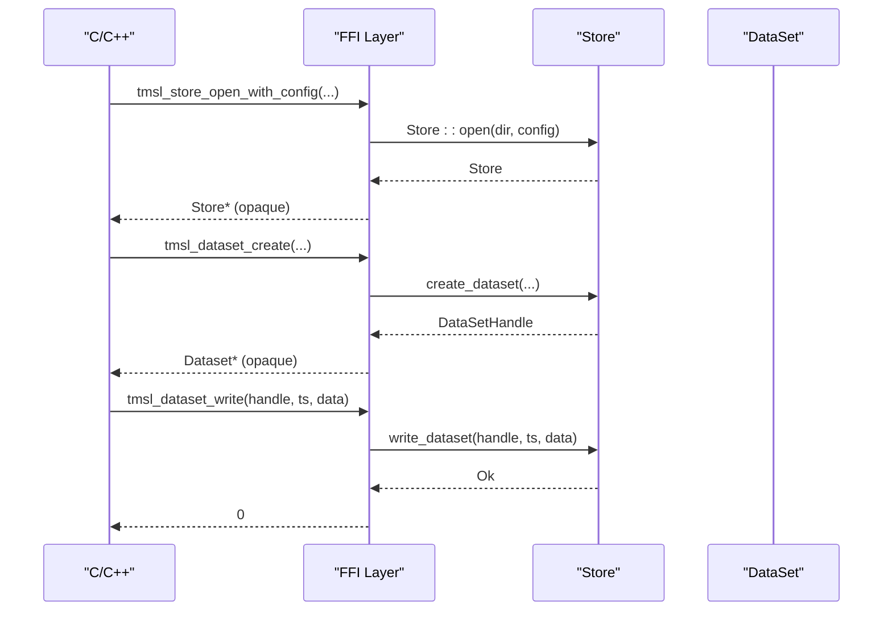
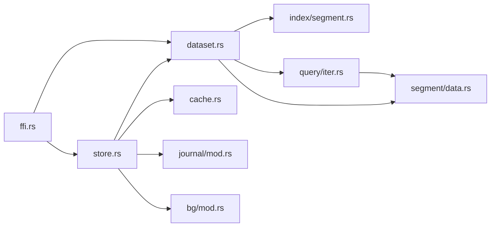

# Rust API

<cite>
**Referenced Files in This Document**
- [lib.rs](file://src/lib.rs)
- [store.rs](file://src/store.rs)
- [dataset.rs](file://src/dataset.rs)
- [config.rs](file://src/config.rs)
- [error.rs](file://src/error.rs)
- [ffi.rs](file://src/ffi.rs)
- [iter.rs](file://src/query/iter.rs)
- [data.rs](file://src/segment/data.rs)
- [Cargo.toml](file://Cargo.toml)
</cite>

## Table of Contents
1. [Introduction](#introduction)
2. [Project Structure](#project-structure)
3. [Core Components](#core-components)
4. [Architecture Overview](#architecture-overview)
5. [Detailed Component Analysis](#detailed-component-analysis)
6. [Dependency Analysis](#dependency-analysis)
7. [Performance Considerations](#performance-considerations)
8. [Troubleshooting Guide](#troubleshooting-guide)
9. [Conclusion](#conclusion)
10. [Appendices](#appendices)

## Introduction
TimSLite is a high-performance, mmap-backed time-series data store designed for efficient ingestion and querying of timestamped records. The Rust crate exposes a native library interface with:
- A Store facade for managing datasets and background tasks
- A DataSet API for write/read/query operations and lifecycle management
- Builders for StoreConfig and DataSetConfig to configure storage behavior
- A comprehensive error model with Result type usage
- An optional C ABI FFI for cross-language interoperability

The crate targets low-latency, continuous ingestion with block-level aggregation, delayed compression, and lazy segment lifecycle management.

## Project Structure
The crate is organized into modules that encapsulate storage internals, indexing, caching, and query iteration. The public API surface is exposed via re-exports in the library root.

**Diagram sources**
- [lib.rs:60-72](file://src/lib.rs#L60-L72)
- [store.rs:46-56](file://src/store.rs#L46-L56)
- [dataset.rs:71-82](file://src/dataset.rs#L71-L82)
- [config.rs:26-52](file://src/config.rs#L26-L52)
- [error.rs:7-43](file://src/error.rs#L7-L43)
- [ffi.rs:104-140](file://src/ffi.rs#L104-L140)
- [iter.rs:120-126](file://src/query/iter.rs#L120-L126)
- [data.rs:39-67](file://src/segment/data.rs#L39-L67)

**Section sources**
- [lib.rs:39-72](file://src/lib.rs#L39-L72)
- [Cargo.toml:6-8](file://Cargo.toml#L6-L8)

## Core Components
This section documents the primary types and their responsibilities.

- Store
  - Manages datasets, background tasks, block cache, journal, and queue subsystems
  - Provides lifecycle operations: open/create/open/close/drop
  - Offers write/append/delete operations that propagate to journal and cache
  - Exposes queue APIs for producer/consumer patterns
- DataSet
  - Encapsulates DataSegmentSet and TimeIndex for a (name, type) pair
  - Implements write, append, delete, read, and query operations
  - Maintains retention window and queue state
- Configurations
  - StoreConfig: runtime and defaults for newly created datasets
  - DataSetConfig: immutable dataset-level parameters persisted in meta
  - Builders: fluent APIs to construct configurations
- Error Model
  - TmslError enum covers I/O, validation, state, and queue-related failures
  - Result<T> alias for ergonomic error propagation

**Section sources**
- [store.rs:46-161](file://src/store.rs#L46-L161)
- [dataset.rs:71-218](file://src/dataset.rs#L71-L218)
- [config.rs:26-203](file://src/config.rs#L26-L203)
- [error.rs:7-87](file://src/error.rs#L7-L87)

## Architecture Overview
The Store acts as a facade coordinating datasets, background tasks, and caches. Writes traverse through the Store to apply journaling and cache hooks, ensuring consistency and performance.

**Diagram sources**
- [store.rs:58-670](file://src/store.rs#L58-L670)
- [dataset.rs:84-721](file://src/dataset.rs#L84-L721)
- [config.rs:26-344](file://src/config.rs#L26-L344)
- [error.rs:7-43](file://src/error.rs#L7-L43)

## Detailed Component Analysis

### Store
Responsibilities:
- Dataset lifecycle: create/open/close/drop
- Global cache and background task coordination
- Journal integration for change logging
- Queue subsystem management
- Batch operations: write/append/delete with cache and journal hooks

Key behaviors:
- Validation of dataset name/type components
- Lazy loading of datasets on open
- Journal append for create/drop/write/append/delete
- Background task scheduling and manual tick support
- Queue open/close and consumer group management

**Diagram sources**
- [store.rs:400-431](file://src/store.rs#L400-L431)
- [dataset.rs:257-316](file://src/dataset.rs#L257-L316)

**Section sources**
- [store.rs:58-161](file://src/store.rs#L58-L161)
- [store.rs:163-381](file://src/store.rs#L163-L381)
- [store.rs:383-472](file://src/store.rs#L383-L472)
- [store.rs:563-670](file://src/store.rs#L563-L670)

### DataSet
Responsibilities:
- Record write/append/delete with timestamp dispatch
- Single-record read and range query with lazy iteration
- Retention enforcement and expiration checks
- Queue integration for publish/subscribe workflows
- Segment and index lifecycle management

Timestamp dispatch:
- Correction write: overwrite last pending raw block at latest timestamp
- Out-of-order write: append and update existing index entry
- Normal write: append and add index entry (sparse continuous mode supported)

**Diagram sources**
- [dataset.rs:241-316](file://src/dataset.rs#L241-L316)

**Section sources**
- [dataset.rs:84-218](file://src/dataset.rs#L84-L218)
- [dataset.rs:226-572](file://src/dataset.rs#L226-L572)
- [dataset.rs:586-692](file://src/dataset.rs#L586-L692)
- [dataset.rs:694-721](file://src/dataset.rs#L694-L721)

### Configuration Builders
StoreConfig and DataSetConfig provide fluent builders to configure storage behavior. StoreConfig controls runtime defaults and background behavior; DataSetConfig defines immutable dataset parameters persisted in meta.

StoreConfig options:
- flush_interval, idle_timeout
- data_segment_size, index_segment_size
- initial_data_segment_size, initial_index_segment_size
- compress_level (0-9)
- cache_max_memory, cache_idle_timeout
- retention_check_hour (UTC hour)
- enable_background_thread, enable_journal

DataSetConfig options:
- Inherits store defaults via DataSetConfig::from_store
- data_segment_size, index_segment_size
- compress_level
- index_continuous (0/1)
- initial_data_segment_size, initial_index_segment_size
- retention_window (timestamp units, 0 = no limit)

**Diagram sources**
- [config.rs:26-203](file://src/config.rs#L26-L203)
- [config.rs:205-344](file://src/config.rs#L205-L344)

**Section sources**
- [config.rs:26-203](file://src/config.rs#L26-L203)
- [config.rs:205-344](file://src/config.rs#L205-L344)

### Error Handling
The TmslError enum enumerates all failure modes:
- I/O and mmap errors
- Invalid magic/version/format
- Compression/decompression failures
- Validation errors (timestamps, sizes, paths)
- Resource not found/existing/closed
- Queue-specific errors (already open, not open, full)
- Retention expiration

Result<T> is the standard return type used across APIs.

**Diagram sources**
- [error.rs:7-87](file://src/error.rs#L7-L87)

**Section sources**
- [error.rs:7-87](file://src/error.rs#L7-L87)

### Query Iterator
DataSet exposes lazy iteration over query results:
- Prepare sources from TimeIndex (in-memory and segment-backed)
- Skip filler entries automatically
- Read records via DataSegmentSet with optional HotBlockCache

**Diagram sources**
- [dataset.rs:629-647](file://src/dataset.rs#L629-L647)
- [iter.rs:120-216](file://src/query/iter.rs#L120-L216)
- [data.rs:39-800](file://src/segment/data.rs#L39-L800)

**Section sources**
- [dataset.rs:629-692](file://src/dataset.rs#L629-L692)
- [iter.rs:13-111](file://src/query/iter.rs#L13-L111)
- [iter.rs:120-216](file://src/query/iter.rs#L120-L216)

### FFI Interface
The crate exports a C ABI for external consumers:
- Store and dataset handles are opaque pointers
- Configs are serialized via FFI structs with version fields
- Queue handles are registered and tracked
- Iterators are created per dataset and closed explicitly

Key FFI operations:
- Store open/close and background tick
- Dataset create/open/close/drop
- Write/append/delete/read/query
- Queue open/poll/ack/close

**Diagram sources**
- [ffi.rs:298-358](file://src/ffi.rs#L298-L358)
- [ffi.rs:424-463](file://src/ffi.rs#L424-L463)
- [ffi.rs:631-655](file://src/ffi.rs#L631-L655)

**Section sources**
- [ffi.rs:104-251](file://src/ffi.rs#L104-L251)
- [ffi.rs:298-463](file://src/ffi.rs#L298-L463)
- [ffi.rs:631-794](file://src/ffi.rs#L631-L794)

## Dependency Analysis
Internal dependencies:
- Store depends on DataSet, BlockCache, JournalManager, BackgroundTasks
- DataSet depends on DataSegmentSet, TimeIndex, BlockCache, QueryIterator
- QueryIterator depends on DataSegmentSet and HotBlockCache
- FFI bridges to Store and DataSet operations

External dependencies:
- memmap2 for memory-mapped files
- miniz_oxide for compression
- log for logging
- libc for FFI allocations

**Diagram sources**
- [store.rs:8-17](file://src/store.rs#L8-L17)
- [dataset.rs:11-21](file://src/dataset.rs#L11-L21)
- [iter.rs:3-11](file://src/query/iter.rs#L3-L11)
- [ffi.rs:10-16](file://src/ffi.rs#L10-L16)

**Section sources**
- [Cargo.toml:10-14](file://Cargo.toml#L10-L14)

## Performance Considerations
- Block-level aggregation (max 64KB) with delayed compression reduces I/O overhead
- Lazy segment lifecycle minimizes open file descriptors and memory usage
- HotBlockCache and BlockCache reduce repeated reads for frequent queries
- Continuous index mode optimizes sparse writes by materializing logical holes on demand
- Background tasks handle periodic flushes, idle-close, cache eviction, and retention reclaim
- mmap-backed IO avoids extra copies when possible; ensure adequate OS page cache

Best practices:
- Tune segment sizes and compression level based on workload characteristics
- Use continuous index mode for sparse write patterns
- Leverage retention windows to reclaim disk space proactively
- Prefer append operations for same-timestamp corrections when feasible
- Monitor background tick delays and adjust intervals as needed

[No sources needed since this section provides general guidance]

## Troubleshooting Guide
Common issues and resolutions:
- InvalidData errors for timestamps <= 0 or exceeding limits
- SegmentFull errors indicating segment expansion or sealing is required
- NotFound for missing datasets or records
- Expired errors when querying timestamps outside retention window
- QueueAlreadyOpen/QueueClosed when mismanaging queue lifecycle
- Io errors from filesystem permissions or disk space

Diagnostic tips:
- Validate dataset name/type components match allowed patterns
- Ensure background tasks are enabled or manually tick periodically
- Confirm cache memory settings align with workload size
- Check retention window configuration for expected data availability

**Section sources**
- [error.rs:7-87](file://src/error.rs#L7-L87)
- [dataset.rs:25-36](file://src/dataset.rs#L25-L36)
- [dataset.rs:263-269](file://src/dataset.rs#L263-L269)
- [dataset.rs:548-572](file://src/dataset.rs#L548-L572)

## Conclusion
TimSLite’s Rust API provides a robust, high-performance foundation for time-series data storage with explicit lifecycle management, flexible configuration, and strong error handling. The Store and DataSet abstractions, combined with builders and lazy query iteration, enable efficient ingestion and retrieval patterns. The optional FFI layer extends reach to other languages while maintaining the same semantics.

[No sources needed since this section summarizes without analyzing specific files]

## Appendices

### Practical Usage Examples
Below are representative operation sequences with code snippet paths. Replace the paths with your actual code locations when integrating.

- Store initialization
  - [Quick start example:16-36](file://src/lib.rs#L16-L36)
  - [Store::open:60-161](file://src/store.rs#L60-L161)
  - [StoreConfig::builder:73-78](file://src/config.rs#L73-L78)

- Dataset creation
  - [Store::create_dataset:231-253](file://src/store.rs#L231-L253)
  - [Store::create_dataset_with_config:167-226](file://src/store.rs#L167-L226)
  - [DataSetConfigBuilder::from_store:272-282](file://src/config.rs#L272-L282)

- Data writing
  - [Store::write_dataset:400-431](file://src/store.rs#L400-L431)
  - [DataSet::write:241-243](file://src/dataset.rs#L241-L243)
  - [DataSet::write_with_cache_outcome:257-316](file://src/dataset.rs#L257-L316)

- Appending data
  - [Store::append_dataset:434-472](file://src/store.rs#L434-L472)
  - [DataSet::append_with_cache_outcome:332-429](file://src/dataset.rs#L332-L429)

- Deleting records
  - [Store::delete_dataset_record:475-502](file://src/store.rs#L475-L502)
  - [DataSet::delete_with_cache_outcome:544-572](file://src/dataset.rs#L544-L572)

- Reading and querying
  - [DataSet::read:594-627](file://src/dataset.rs#L594-L627)
  - [DataSet::query_iter:629-647](file://src/dataset.rs#L629-L647)
  - [DataSet::query:652-660](file://src/dataset.rs#L652-L660)

- Queue operations
  - [Store::open_queue:569-600](file://src/store.rs#L569-L600)
  - [Store::queue_push:648-649](file://src/store.rs#L648-L649)
  - [Store::queue_poll:657-658](file://src/store.rs#L657-L658)
  - [Store::queue_ack:662-663](file://src/store.rs#L662-L663)

- Closing and dropping
  - [Store::close_dataset:302-318](file://src/store.rs#L302-L318)
  - [Store::drop_dataset:321-348](file://src/store.rs#L321-L348)
  - [Store::drop_dataset_by_name:351-381](file://src/store.rs#L351-L381)
  - [DataSet::close:711-716](file://src/dataset.rs#L711-L716)

- Background tasks
  - [Store::tick_background_tasks:522-528](file://src/store.rs#L522-L528)
  - [Store::next_background_delay:534-540](file://src/store.rs#L534-L540)

- FFI usage
  - [tmsl_store_open_with_config:308-330](file://src/ffi.rs#L308-L330)
  - [tmsl_dataset_create:426-463](file://src/ffi.rs#L426-L463)
  - [tmsl_dataset_write:633-655](file://src/ffi.rs#L633-L655)
  - [tmsl_dataset_query:764-794](file://src/ffi.rs#L764-L794)

**Section sources**
- [lib.rs:16-36](file://src/lib.rs#L16-L36)
- [store.rs:60-161](file://src/store.rs#L60-L161)
- [config.rs:73-78](file://src/config.rs#L73-L78)
- [store.rs:231-253](file://src/store.rs#L231-L253)
- [store.rs:167-226](file://src/store.rs#L167-L226)
- [config.rs:272-282](file://src/config.rs#L272-L282)
- [store.rs:400-431](file://src/store.rs#L400-L431)
- [dataset.rs:241-316](file://src/dataset.rs#L241-L316)
- [store.rs:434-472](file://src/store.rs#L434-L472)
- [dataset.rs:332-429](file://src/dataset.rs#L332-L429)
- [store.rs:475-502](file://src/store.rs#L475-L502)
- [dataset.rs:544-572](file://src/dataset.rs#L544-L572)
- [dataset.rs:594-627](file://src/dataset.rs#L594-L627)
- [dataset.rs:629-647](file://src/dataset.rs#L629-L647)
- [dataset.rs:652-660](file://src/dataset.rs#L652-L660)
- [store.rs:302-318](file://src/store.rs#L302-L318)
- [store.rs:321-348](file://src/store.rs#L321-L348)
- [store.rs:351-381](file://src/store.rs#L351-L381)
- [dataset.rs:711-716](file://src/dataset.rs#L711-L716)
- [store.rs:522-528](file://src/store.rs#L522-L528)
- [store.rs:534-540](file://src/store.rs#L534-L540)
- [ffi.rs:308-330](file://src/ffi.rs#L308-L330)
- [ffi.rs:426-463](file://src/ffi.rs#L426-L463)
- [ffi.rs:633-655](file://src/ffi.rs#L633-L655)
- [ffi.rs:764-794](file://src/ffi.rs#L764-L794)

### Thread Safety and Ownership
- Store holds datasets behind an Arc<RwLock<...>> to coordinate concurrent access
- DataSet operations acquire a Mutex internally; avoid long-held locks
- FFI layer registers opaque handles and tracks outstanding iterators/children
- Background tasks are coordinated via an internal executor; manual ticks serialize with the thread when background thread is disabled
- Cache invalidation is integrated with write/append/delete outcomes

**Section sources**
- [store.rs:48-55](file://src/store.rs#L48-L55)
- [store.rs:384-397](file://src/store.rs#L384-L397)
- [ffi.rs:21-28](file://src/ffi.rs#L21-L28)
- [store.rs:522-528](file://src/store.rs#L522-L528)