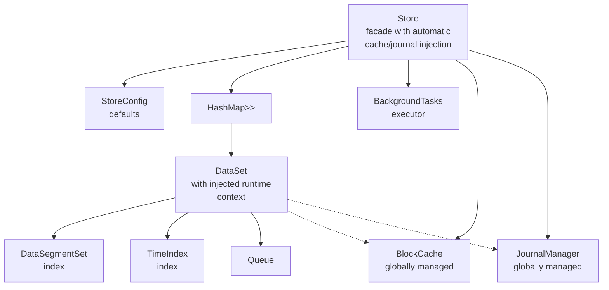
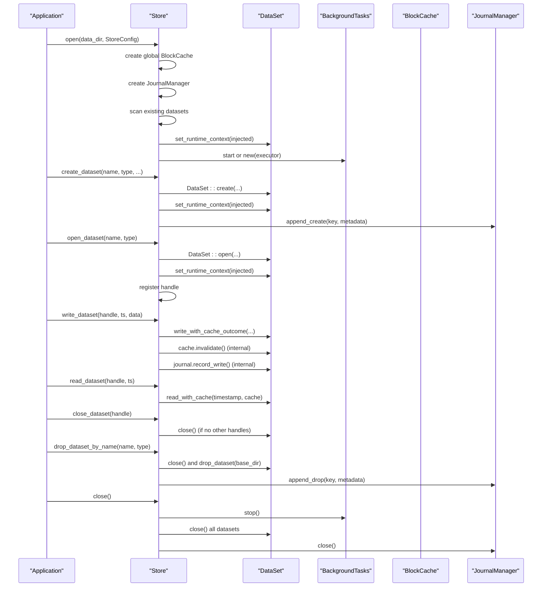
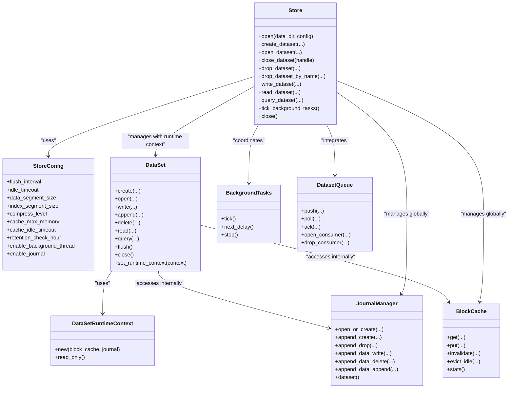

# Store Management

<cite>
**Referenced Files in This Document**
- [store.rs](file://src/store.rs)
- [config.rs](file://src/config.rs)
- [dataset.rs](file://src/dataset.rs)
- [error.rs](file://src/error.rs)
- [journal/mod.rs](file://src/journal/mod.rs)
- [cache.rs](file://src/cache.rs)
- [bg/mod.rs](file://src/bg/mod.rs)
- [queue/mod.rs](file://src/queue/mod.rs)
- [lib.rs](file://src/lib.rs)
- [dataset_lifecycle_test.rs](file://tests/dataset_lifecycle_test.rs)
- [dataset_basic_test.rs](file://tests/dataset_basic_test.rs)
- [test_lifecycle.py](file://wrapper/python/tests/test_lifecycle.py)
- [test_multi_dataset.py](file://wrapper/python/tests/test_multi_dataset.py)
</cite>

## Update Summary
**Changes Made**
- Updated Store facade API to reflect simplified interface where DataSet handles cache and journal internally
- Added documentation for Store-managed BlockCache and JournalManager injection into datasets
- Revised Store architecture diagrams to show internal cache and journal management
- Updated StoreConfig documentation to reflect simplified dataset lifecycle operations
- Enhanced thread safety documentation to cover new runtime context injection pattern

## Table of Contents
1. [Introduction](#introduction)
2. [Project Structure](#project-structure)
3. [Core Components](#core-components)
4. [Architecture Overview](#architecture-overview)
5. [Detailed Component Analysis](#detailed-component-analysis)
6. [Dependency Analysis](#dependency-analysis)
7. [Performance Considerations](#performance-considerations)
8. [Troubleshooting Guide](#troubleshooting-guide)
9. [Conclusion](#conclusion)
10. [Appendices](#appendices)

## Introduction
This document provides comprehensive documentation for TimSLite's Store management API. The Store struct now serves as a simplified facade that automatically injects BlockCache and JournalManager into datasets, allowing DataSet to handle cache and journal operations internally. This architectural change simplifies the Store facade API while maintaining robust dataset lifecycle management, directory management, resource allocation patterns, thread safety, and operational best practices for production deployments.

## Project Structure
TimSLite organizes its store and dataset management with an enhanced architecture where Store manages core resources and injects them into datasets:
- Store facade orchestrates datasets with automatic cache and journal injection.
- Config defines runtime and dataset defaults.
- DataSet encapsulates data/index segments, retention, queue integration, and internal cache/journal management.
- JournalManager maintains an internal change log dataset with read-only access patterns.
- Background tasks coordinate periodic maintenance with global cache awareness.
- Queue provides producer/consumer semantics for datasets with persistent state files.
- Error types unify all failure modes.

**Diagram sources**
- [store.rs:42-52](file://src/store.rs#L42-L52)
- [store.rs:54-61](file://src/store.rs#L54-L61)
- [dataset.rs:37-63](file://src/dataset.rs#L37-L63)
- [journal/mod.rs:369-428](file://src/journal/mod.rs#L369-L428)
- [bg/mod.rs:44-54](file://src/bg/mod.rs#L44-L54)

**Section sources**
- [lib.rs:39-72](file://src/lib.rs#L39-L72)

## Core Components
- **Store**: Simplified top-level facade that manages BlockCache and JournalManager globally, then injects them into datasets via DataSetRuntimeContext. Exposes streamlined dataset lifecycle APIs with automatic resource management.
- **StoreConfig**: Runtime configuration for flush intervals, idle timeouts, cache sizing, and background task behavior.
- **DataSet**: Enhanced to encapsulate cache and journal management internally through DataSetRuntimeContext, reducing Store complexity while maintaining full functionality.
- **DataSetRuntimeContext**: New structure that carries BlockCache and JournalManager references to datasets, enabling internal cache and journal operations.
- **JournalManager**: Manages the internal change log dataset with read-only access patterns for the Store facade.
- **BackgroundTasks**: Periodic executor for flush, idle-close, cache eviction, and retention reclaim with global cache awareness.
- **BlockCache**: Global read cache with LRU and idle eviction, automatically injected into datasets.
- **DatasetQueue/DatasetQueueConsumer**: Producer/consumer queue semantics with persistent state files, integrated with dataset lifecycle.

**Section sources**
- [store.rs:42-52](file://src/store.rs#L42-L52)
- [store.rs:54-61](file://src/store.rs#L54-L61)
- [dataset.rs:37-63](file://src/dataset.rs#L37-L63)
- [journal/mod.rs:369-428](file://src/journal/mod.rs#L369-L428)
- [bg/mod.rs:44-134](file://src/bg/mod.rs#L44-L134)
- [cache.rs:43-191](file://src/cache.rs#L43-L191)
- [queue/mod.rs:380-595](file://src/queue/mod.rs#L380-L595)

## Architecture Overview
The enhanced Store architecture coordinates:
- **Simplified dataset lifecycle**: Store manages BlockCache and JournalManager globally, injecting them into datasets via DataSetRuntimeContext.
- **Automatic resource management**: DataSet handles cache and journal operations internally, reducing Store complexity.
- **Global cache coordination**: BlockCache is centrally managed and injected into all datasets for consistent read performance.
- **Centralized journal management**: JournalManager provides unified change logging with read-only access for Store operations.
- **Background maintenance**: BackgroundTasks operates with awareness of global cache state and dataset lifecycle.

**Diagram sources**
- [store.rs:64-167](file://src/store.rs#L64-L167)
- [store.rs:173-239](file://src/store.rs#L173-L239)
- [store.rs:268-316](file://src/store.rs#L268-L316)
- [store.rs:422-453](file://src/store.rs#L422-L453)
- [store.rs:516-527](file://src/store.rs#L516-L527)
- [store.rs:590-609](file://src/store.rs#L590-L609)
- [dataset.rs:289-302](file://src/dataset.rs#L289-L302)
- [dataset.rs:664-674](file://src/dataset.rs#L664-L674)
- [journal/mod.rs:453-459](file://src/journal/mod.rs#L453-L459)

## Detailed Component Analysis

### Store Struct and Lifecycle
**Updated** Store now manages BlockCache and JournalManager injection into datasets via DataSetRuntimeContext, significantly simplifying the facade API.

- **Initialization**: Store::open(data_dir, StoreConfig) creates global BlockCache and JournalManager, scans for existing datasets, and injects runtime context into each dataset.
- **Automatic Resource Injection**: The `dataset_runtime_context()` method creates DataSetRuntimeContext with both BlockCache and JournalManager references, ensuring all datasets have consistent access to global resources.
- **Enhanced Dataset lifecycle**:
  - `create_dataset_with_config()`: Creates DataSet with injected runtime context, appends create record to journal, and returns handle.
  - `create_dataset()`: Backward-compatible wrapper with automatic runtime context injection.
  - `open_dataset()`: Opens existing dataset with injected runtime context and registers handle.
  - `close_dataset()`: Removes handle; if no other handles reference the dataset, closes it.
  - `drop_dataset()`: Drops dataset directory, appends drop record to journal, and removes from handles.
- **Simplified Facade operations**:
  - `write_dataset()`, `append_dataset()`, `delete_dataset_record()`, `read_dataset()`, `query_dataset()`, `latest_written_timestamp()` delegate to underlying dataset with automatic cache and journal integration.
  - `tick_background_tasks()` and `next_background_delay()` coordinate background maintenance with global cache awareness.
- **Queue operations**: `open_queue()`, `close_queue()`, `open_consumer()`, `drop_consumer()`, `queue_push()`, `queue_poll()`, `queue_ack()` integrate with dataset queue subsystem.

**Thread safety and resource management**:
- Store holds datasets in an Arc<RwLock<HashMap<...>>> for concurrent access.
- Each dataset is wrapped in Arc<Mutex<DataSet>> to protect internal state during operations.
- DataSetRuntimeContext provides safe access to global resources through Arc references.
- BackgroundTasks coordinates with global cache state for eviction and maintenance.
- Store::close() stops background tasks, closes all datasets with proper queue cleanup, and flushes journal.

**Practical examples**:
- Store initialization demonstrates automatic cache and journal injection.
- Dataset lifecycle tests show simplified API usage with automatic resource management.

**Section sources**
- [store.rs:64-167](file://src/store.rs#L64-L167)
- [store.rs:54-61](file://src/store.rs#L54-L61)
- [store.rs:173-239](file://src/store.rs#L173-L239)
- [store.rs:268-316](file://src/store.rs#L268-L316)
- [store.rs:337-404](file://src/store.rs#L337-L404)
- [store.rs:422-550](file://src/store.rs#L422-L550)
- [store.rs:590-609](file://src/store.rs#L590-L609)

### StoreConfig and Defaults
StoreConfig controls:
- `flush_interval`: Background flush cadence for all datasets.
- `idle_timeout`: Inactivity threshold to idle-close segments.
- `data_segment_size`/`index_segment_size`: Default sizes for new datasets.
- `initial_data_segment_size`/`initial_index_segment_size`: Initial sizes expanded up to limits.
- `compress_level`: Compression level for new datasets.
- `cache_max_memory`: Global read cache size (0 disables).
- `cache_idle_timeout`: Idle eviction for global cache.
- `retention_check_hour`: UTC hour for daily retention reclaim.
- `enable_background_thread`: Launch background thread or manual tick.
- `enable_journal`: Enable internal change log.

Builder pattern allows partial overrides; defaults are defined in StoreConfig::default().

**Section sources**
- [config.rs:26-71](file://src/config.rs#L26-L71)
- [config.rs:73-203](file://src/config.rs#L73-L203)
- [config.rs:205-345](file://src/config.rs#L205-L345)

### DataSet Lifecycle and Operations
**Updated** DataSet now manages cache and journal internally through DataSetRuntimeContext, reducing Store complexity.

DataSet encapsulates:
- **Creation**: DataSet::create(...) writes meta and initializes data/index segments with automatic runtime context injection.
- **Opening**: DataSet::open(...) loads meta and recovers latest written timestamp with runtime context.
- **Writing**: `write_with_cache_outcome()` supports normal, correction, and out-of-order writes with internal cache invalidation and journal recording.
- **Deleting**: `delete_with_cache_outcome()` marks entries as deleted and increments invalid record counts with cache invalidation.
- **Querying**: `query_iter_with_cache()` and index entry enumeration with cache integration.
- **Closing**: `flush()` and idle-close segments with queue subsystem cleanup.

**Internal cache and journal management**:
- Cache integration: `invalidate_cache_for_entry()` automatically invalidates cache entries affected by corrections and deletions.
- Journal integration: `record_write()`, `record_delete()`, and `record_append()` automatically record operations to JournalManager.
- Runtime context: `set_runtime_context()` injects BlockCache and JournalManager references for internal operations.

**Retention and expiration**:
- Retention window is enforced per dataset; expired timestamps are rejected with proper cache and journal handling.

**Section sources**
- [dataset.rs:130-202](file://src/dataset.rs#L130-L202)
- [dataset.rs:208-261](file://src/dataset.rs#L208-L261)
- [dataset.rs:289-302](file://src/dataset.rs#L289-L302)
- [dataset.rs:316-375](file://src/dataset.rs#L316-L375)
- [dataset.rs:600-662](file://src/dataset.rs#L600-L662)
- [dataset.rs:664-674](file://src/dataset.rs#L664-L674)

### DataSetRuntimeContext and Resource Injection
**New** DataSetRuntimeContext enables automatic cache and journal injection into datasets.

- **Structure**: Contains optional BlockCache and JournalManager references along with read-only flag.
- **Factory methods**: `new()` creates context with both cache and journal, `read_only()` creates read-only context for JournalManager.
- **Injection mechanism**: Store::dataset_runtime_context() creates context with Arc references to global resources.
- **Internal usage**: DataSet::set_runtime_context() applies injected context to dataset instances.

**Section sources**
- [dataset.rs:37-63](file://src/dataset.rs#L37-L63)
- [store.rs:54-61](file://src/store.rs#L54-L61)
- [store.rs:219-223](file://src/store.rs#L219-L223)
- [store.rs:300-304](file://src/store.rs#L300-L304)

### Journal Change Log
JournalManager maintains an internal dataset (.journal/logs) for auditing with read-only access patterns:
- Records create/drop events and data mutations (write/delete/append) with automatic encoding/decoding.
- Encodes/decodes TLV records with dataset identity and index metadata.
- Append operations are integrated into Store write operations via DataSetRuntimeContext.
- Read-only access for Store facade prevents modification of internal journal dataset.

**Section sources**
- [journal/mod.rs:12-515](file://src/journal/mod.rs#L12-L515)
- [journal/mod.rs:369-428](file://src/journal/mod.rs#L369-L428)
- [journal/mod.rs:453-542](file://src/journal/mod.rs#L453-L542)

### Background Tasks and Maintenance
BackgroundTasks executes:
- **Flush**: Calls flush on all datasets with global cache awareness.
- **Idle-check**: Closes datasets idle beyond idle_timeout with proper queue cleanup.
- **Cache eviction**: Evicts idle entries from BlockCache with configurable idle timeout.
- **Retention reclaim**: Removes expired segments based on dataset retention windows.

**Execution model**:
- Auto mode: Spawns a dedicated thread; manual mode: exposes tick/next_delay for external coordination.
- Global cache integration: Respects cache enablement and idle eviction settings.

**Section sources**
- [bg/mod.rs:44-459](file://src/bg/mod.rs#L44-L459)
- [bg/mod.rs:378-439](file://src/bg/mod.rs#L378-L439)

### Queue Subsystem
DatasetQueue provides:
- **Producer**: `push(data)` auto-increments timestamp and notifies consumers via dataset integration.
- **Consumers**: `open_consumer(group_name)` returns a handle; `poll(timeout)` waits for data; `ack(timestamp)` advances progress.
- **State persistence**: 4KB mmap-backed state files track processed timestamps and pending entries.

**Integration with Store**:
- `open_queue()`, `close_queue()`, `open_consumer()`, `drop_consumer()`, `queue_push()`, `queue_poll()`, `queue_ack()` are exposed via Store with automatic dataset lifecycle management.

**Section sources**
- [queue/mod.rs:380-595](file://src/queue/mod.rs#L380-L595)
- [queue/mod.rs:631-799](file://src/queue/mod.rs#L631-L799)

### Thread Safety and Concurrency
**Updated** Enhanced thread safety with automatic resource injection and internal cache/journal management.

- **Store datasets map**: Arc<RwLock<HashMap<...>>> for concurrent access; dataset instances protected by Arc<Mutex<DataSet>>.
- **Runtime context safety**: DataSetRuntimeContext uses Arc references to ensure thread-safe access to global resources.
- **BackgroundTasks**: Mutex<ExecutorState> guards scheduling state; RwLock<DatasetMap> for dataset enumeration with cache awareness.
- **Queue**: Inner state guarded by Mutex; Condvar for wait/notify; atomic flag indicates closure.
- **Journal**: Access to internal journal dataset is coordinated via JournalManager::dataset() with read-only context.
- **Global cache**: RwLock<HashMap<...>> with atomic counters for hit/miss statistics.

**Concurrency patterns**:
- External ticks are serialized by the ExecutorState mutex.
- Queue poll() uses Condvar to wait with timeout; state file mutex ensures exclusive polling.
- Store::get_dataset() returns Arc<Mutex<DataSet>> to prevent misuse across threads.
- Automatic resource injection eliminates race conditions in cache and journal access.

**Section sources**
- [store.rs:42-52](file://src/store.rs#L42-L52)
- [dataset.rs:262-265](file://src/dataset.rs#L262-L265)
- [bg/mod.rs:44-54](file://src/bg/mod.rs#L44-L54)
- [queue/mod.rs:438-487](file://src/queue/mod.rs#L438-L487)
- [journal/mod.rs:423-428](file://src/journal/mod.rs#L423-L428)

### Error Handling
Common errors include:
- **InvalidData**: Naming validation failures, invalid magic/version, queue errors, pending capacity exceeded.
- **NotFound**: Dataset not found, journal disabled, consumer group not found.
- **AlreadyExists**: Attempting to create an already-open dataset.
- **Expired**: Timestamp outside retention window.
- **QueueAlreadyOpen/QueueClosed/PendingFull**: Queue subsystem constraints.

**Updated** Error propagation maintains consistency with simplified API while ensuring proper cache and journal integration.

**Section sources**
- [error.rs:6-87](file://src/error.rs#L6-L87)
- [store.rs:173-192](file://src/store.rs#L173-L192)
- [store.rs:268-283](file://src/store.rs#L268-L283)
- [store.rs:337-347](file://src/store.rs#L337-L347)

## Dependency Analysis
**Updated** Store dependency structure reflects simplified facade with automatic resource injection.

Store depends on:
- Config for runtime defaults.
- Dataset for data/index segments and lifecycle with automatic cache/journal management.
- JournalManager for internal change log with read-only access.
- BackgroundTasks for periodic maintenance with global cache awareness.
- BlockCache for global read caching with automatic injection.
- Queue for producer/consumer semantics integrated with dataset lifecycle.

**Diagram sources**
- [store.rs:42-52](file://src/store.rs#L42-L52)
- [store.rs:54-61](file://src/store.rs#L54-L61)
- [dataset.rs:37-63](file://src/dataset.rs#L37-L63)
- [journal/mod.rs:369-428](file://src/journal/mod.rs#L369-L428)
- [bg/mod.rs:44-134](file://src/bg/mod.rs#L44-L134)
- [cache.rs:43-191](file://src/cache.rs#L43-L191)
- [queue/mod.rs:380-595](file://src/queue/mod.rs#L380-L595)

**Section sources**
- [store.rs:42-52](file://src/store.rs#L42-L52)
- [config.rs:26-71](file://src/config.rs#L26-L71)
- [dataset.rs:37-63](file://src/dataset.rs#L37-L63)
- [journal/mod.rs:369-428](file://src/journal/mod.rs#L369-L428)
- [bg/mod.rs:44-134](file://src/bg/mod.rs#L44-L134)
- [cache.rs:43-191](file://src/cache.rs#L43-L191)
- [queue/mod.rs:380-595](file://src/queue/mod.rs#L380-L595)

## Performance Considerations
**Updated** Performance characteristics with automatic resource injection and internal cache/journal management.

- **Global cache optimization**: Configure `cache_max_memory` to balance hit rate vs. memory usage; cache_idle_timeout reduces stale entries across all datasets.
- **Background tasks tuning**: Tune `flush_interval` and `idle_timeout` to minimize I/O overhead while preserving responsiveness across all managed datasets.
- **Segment sizing**: Larger `data_segment_size` reduces index growth but increases flush cost; adjust `index_segment_size` accordingly.
- **Compression efficiency**: Higher `compress_level` improves storage efficiency but adds CPU overhead; consider dataset-specific compression strategies.
- **Queue state management**: 4KB fixed size with bounded pending entries; monitor `pending_full` conditions across all queues.
- **Retention optimization**: Use `retention_window` to reclaim disk space proactively; schedule `retention_check_hour` to align with maintenance windows.
- **Resource injection overhead**: Automatic cache and journal injection adds minimal overhead through Arc references, providing consistent performance across all datasets.

## Troubleshooting Guide
**Updated** Common issues with simplified API and automatic resource management.

Common issues and resolutions:
- **Dataset already exists**: Ensure unique dataset names/types; use `drop_dataset_by_name` to clean up before recreation.
- **Not found errors**: Verify dataset exists and meta file is present; confirm correct name/type.
- **Invalid naming**: Dataset name/type must match allowed character sets; validation occurs early.
- **Queue errors**: Ensure queue is open before push/poll/ack; check consumer group name validity.
- **Background thread not running**: If `enable_background_thread` is false, call `tick_background_tasks` periodically.
- **Journal disabled**: Journal operations require `enable_journal=true`.
- **Cache disabled**: Check `cache_max_memory` setting; zero disables global cache functionality.
- **Resource injection failures**: Verify Store initialization completed successfully; check for proper BlockCache and JournalManager creation.

**Operational tips**:
- Always close datasets via `close_dataset` to release resources; use `drop_dataset_by_name` for destructive removal.
- Use `latest_written_timestamp` to track progress and detect anomalies.
- Monitor cache stats via `BlockCache::stats()` to assess effectiveness across all datasets.
- Leverage automatic resource injection for consistent cache and journal behavior.

**Section sources**
- [dataset_lifecycle_test.rs:17-105](file://tests/dataset_lifecycle_test.rs#L17-L105)
- [dataset_basic_test.rs:18-61](file://tests/dataset_basic_test.rs#L18-L61)
- [test_lifecycle.py:8-50](file://wrapper/python/tests/test_lifecycle.py#L8-L50)
- [test_multi_dataset.py:8-35](file://wrapper/python/tests/test_multi_dataset.py#L8-L35)

## Conclusion
TimSLite's enhanced Store provides a robust, simplified, and efficient time-series storage facade. The new architecture with automatic BlockCache and JournalManager injection into datasets significantly reduces API complexity while maintaining strong operational guarantees. The streamlined Store facade, combined with DataSet's internal cache and journal management, delivers improved performance, easier resource management, and better separation of concerns for production environments.

## Appendices

### Practical Examples

- **Store initialization and dataset lifecycle**:
  - Store initialization demonstrates automatic cache and journal injection.
  - Dataset lifecycle tests show simplified API usage with automatic resource management.

- **Error handling scenarios**:
  - Creating duplicates, opening non-existent datasets, and dropping internal journal dataset are validated in tests.

**Section sources**
- [dataset_basic_test.rs:18-61](file://tests/dataset_basic_test.rs#L18-L61)
- [dataset_lifecycle_test.rs:17-105](file://tests/dataset_lifecycle_test.rs#L17-L105)
- [test_lifecycle.py:8-50](file://wrapper/python/tests/test_lifecycle.py#L8-L50)