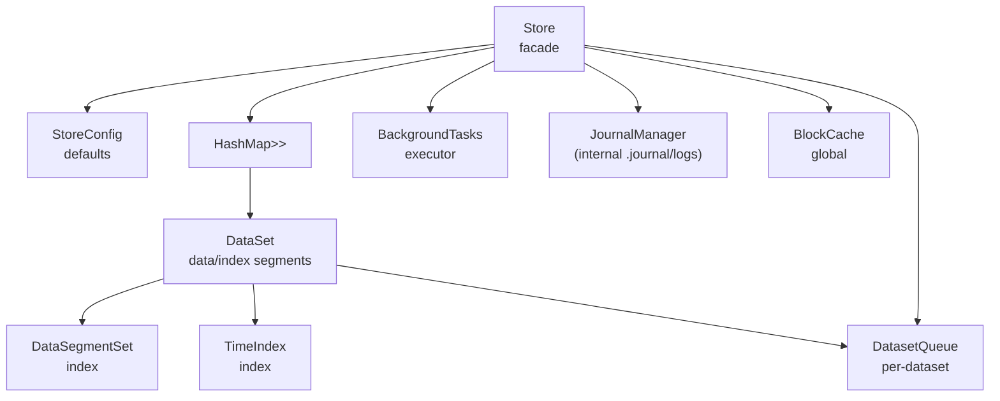
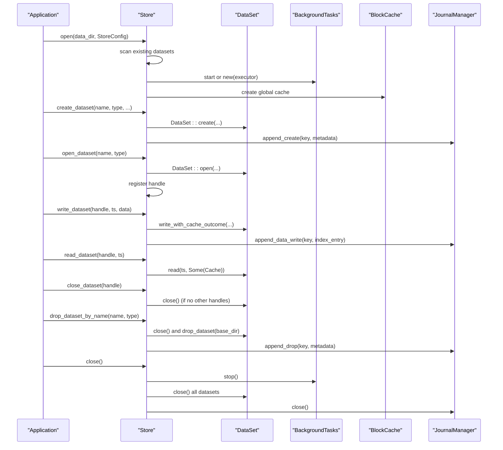
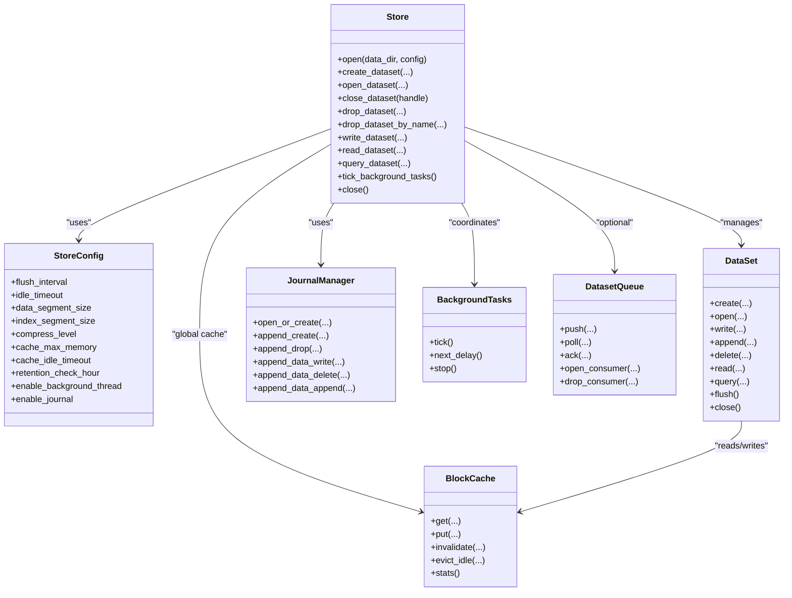

# Store Management

<cite>
**Referenced Files in This Document**
- [store.rs](file://src/store.rs)
- [config.rs](file://src/config.rs)
- [dataset.rs](file://src/dataset.rs)
- [error.rs](file://src/error.rs)
- [journal/mod.rs](file://src/journal/mod.rs)
- [cache.rs](file://src/cache.rs)
- [bg/mod.rs](file://src/bg/mod.rs)
- [queue/mod.rs](file://src/queue/mod.rs)
- [lib.rs](file://src/lib.rs)
- [dataset_lifecycle_test.rs](file://tests/dataset_lifecycle_test.rs)
- [dataset_basic_test.rs](file://tests/dataset_basic_test.rs)
- [test_lifecycle.py](file://wrapper/python/tests/test_lifecycle.py)
- [test_multi_dataset.py](file://wrapper/python/tests/test_multi_dataset.py)
</cite>

## Table of Contents
1. [Introduction](#introduction)
2. [Project Structure](#project-structure)
3. [Core Components](#core-components)
4. [Architecture Overview](#architecture-overview)
5. [Detailed Component Analysis](#detailed-component-analysis)
6. [Dependency Analysis](#dependency-analysis)
7. [Performance Considerations](#performance-considerations)
8. [Troubleshooting Guide](#troubleshooting-guide)
9. [Conclusion](#conclusion)
10. [Appendices](#appendices)

## Introduction
This document provides comprehensive documentation for TimSLite’s Store management API. It covers the Store struct lifecycle (open, create_dataset, open_dataset, drop_dataset, close), initialization with StoreConfig, directory management, resource allocation patterns, dataset lifecycle operations, thread safety and concurrency, queue subsystem integration, and operational best practices for production deployments. Practical examples and diagrams illustrate the intended usage and internal mechanics.

## Project Structure
TimSLite organizes its store and dataset management under a cohesive set of modules:
- Store facade orchestrates datasets, background tasks, journal, and global cache.
- Config defines runtime and dataset defaults.
- Dataset encapsulates data/index segments, retention, and queue integration.
- Journal maintains an internal change log dataset.
- Background tasks coordinate periodic maintenance.
- Queue provides producer/consumer semantics for datasets.
- Error types unify all failure modes.

**Diagram sources**
- [store.rs:46-161](file://src/store.rs#L46-L161)
- [config.rs:26-71](file://src/config.rs#L26-L71)
- [dataset.rs:71-218](file://src/dataset.rs#L71-L218)
- [journal/mod.rs:321-494](file://src/journal/mod.rs#L321-L494)
- [bg/mod.rs:44-134](file://src/bg/mod.rs#L44-L134)
- [queue/mod.rs:380-595](file://src/queue/mod.rs#L380-L595)

**Section sources**
- [lib.rs:39-72](file://src/lib.rs#L39-L72)

## Core Components
- Store: Top-level facade managing datasets, background tasks, journal, and global cache. Exposes dataset lifecycle APIs and queue operations.
- StoreConfig: Runtime configuration for flush intervals, idle timeouts, cache sizing, and background task behavior.
- DataSet: Encapsulates a dataset’s data and index segments, retention policy, and optional queue subsystem.
- JournalManager: Manages the internal change log dataset (.journal/logs) for audit and recovery.
- BackgroundTasks: Periodic executor for flush, idle-close, cache eviction, and retention reclaim.
- BlockCache: Global read cache with LRU and idle eviction.
- DatasetQueue/DatasetQueueConsumer: Producer/consumer queue semantics with persistent state files.

**Section sources**
- [store.rs:46-161](file://src/store.rs#L46-L161)
- [config.rs:26-71](file://src/config.rs#L26-L71)
- [dataset.rs:71-218](file://src/dataset.rs#L71-L218)
- [journal/mod.rs:321-494](file://src/journal/mod.rs#L321-L494)
- [bg/mod.rs:44-134](file://src/bg/mod.rs#L44-L134)
- [cache.rs:43-191](file://src/cache.rs#L43-L191)
- [queue/mod.rs:380-595](file://src/queue/mod.rs#L380-L595)

## Architecture Overview
The Store coordinates:
- Dataset lifecycle: create/open/close/drop with explicit directory layout.
- Global cache: BlockCache shared across datasets for reads.
- Background maintenance: Flush, idle-close, cache eviction, retention reclaim.
- Journal: Internal change log for dataset create/drop and data mutations.
- Queue: Optional producer/consumer queue per dataset with persistent state.

**Diagram sources**
- [store.rs:59-161](file://src/store.rs#L59-L161)
- [store.rs:167-253](file://src/store.rs#L167-L253)
- [store.rs:255-298](file://src/store.rs#L255-L298)
- [store.rs:400-431](file://src/store.rs#L400-L431)
- [store.rs:505-515](file://src/store.rs#L505-L515)
- [store.rs:301-318](file://src/store.rs#L301-L318)
- [store.rs:350-381](file://src/store.rs#L350-L381)
- [store.rs:579-597](file://src/store.rs#L579-L597)
- [dataset.rs:89-160](file://src/dataset.rs#L89-L160)
- [dataset.rs:166-218](file://src/dataset.rs#L166-L218)
- [journal/mod.rs:404-458](file://src/journal/mod.rs#L404-L458)

## Detailed Component Analysis

### Store Struct and Lifecycle
- Initialization: Store::open(data_dir, StoreConfig) ensures the directory exists, initializes JournalManager, scans for existing datasets, builds a global BlockCache, and starts BackgroundTasks either as a background thread or manual executor.
- Dataset lifecycle:
  - create_dataset_with_config(name, type, builder?): Validates naming, checks for duplicates, constructs DataSet::create, registers in the datasets map, appends a create record to the journal, and returns a handle.
  - create_dataset(...): Backward-compatible wrapper around create_dataset_with_config.
  - open_dataset(name, type): Validates naming, checks if already open, otherwise opens existing dataset and registers handle.
  - close_dataset(handle): Removes handle; if no other handles reference the dataset, closes it.
  - drop_dataset(handle)/drop_dataset_by_name(name, type): Drops the dataset directory and appends a drop record to the journal.
- Facade operations:
  - write_dataset/read_dataset/query_dataset/latest_written_timestamp delegate to the underlying dataset with global cache hooks.
  - tick_background_tasks/next_background_delay coordinate background maintenance.
- Queue operations:
  - open_queue/close_queue/open_consumer/drop_consumer/push/poll/ack integrate with the dataset’s queue subsystem.

Thread safety and resource management:
- Store holds datasets in an Arc<RwLock<HashMap<...>>> for concurrent access.
- Each dataset is wrapped in Arc<Mutex<DataSet>> to protect internal state during operations.
- JournalManager::dataset() returns a handle to the internal journal dataset.
- BackgroundTasks uses Mutex<ExecutorState> and Arc<RwLock<DatasetMap>> to coordinate periodic tasks safely.
- Store::close() stops background tasks, closes all datasets (including queue subsystem), and flushes the journal.

Practical examples:
- Store initialization and dataset creation/opening are demonstrated in integration tests and Python wrappers.
- Lifecycle tests show create/open/close/drop behavior and validation.

**Section sources**
- [store.rs:59-161](file://src/store.rs#L59-L161)
- [store.rs:167-253](file://src/store.rs#L167-L253)
- [store.rs:255-298](file://src/store.rs#L255-L298)
- [store.rs:301-318](file://src/store.rs#L301-L318)
- [store.rs:320-381](file://src/store.rs#L320-L381)
- [store.rs:400-515](file://src/store.rs#L400-L515)
- [store.rs:550-576](file://src/store.rs#L550-L576)
- [store.rs:579-597](file://src/store.rs#L579-L597)
- [store.rs:601-706](file://src/store.rs#L601-L706)
- [dataset_lifecycle_test.rs:17-105](file://tests/dataset_lifecycle_test.rs#L17-L105)
- [dataset_basic_test.rs:18-61](file://tests/dataset_basic_test.rs#L18-L61)
- [test_lifecycle.py:8-50](file://wrapper/python/tests/test_lifecycle.py#L8-L50)

### StoreConfig and Defaults
StoreConfig controls:
- flush_interval: Background flush cadence.
- idle_timeout: Inactivity threshold to idle-close segments.
- data_segment_size/index_segment_size: Default sizes for new datasets.
- initial_data_segment_size/initial_index_segment_size: Initial sizes expanded up to limits.
- compress_level: Compression level for new datasets.
- cache_max_memory: Global read cache size (0 disables).
- cache_idle_timeout: Idle eviction for global cache.
- retention_check_hour: UTC hour for daily retention reclaim.
- enable_background_thread: Launch background thread or manual tick.
- enable_journal: Enable internal change log.

Builder pattern allows partial overrides; defaults are defined in StoreConfig::default().

**Section sources**
- [config.rs:26-71](file://src/config.rs#L26-L71)
- [config.rs:73-203](file://src/config.rs#L73-L203)
- [config.rs:205-345](file://src/config.rs#L205-L345)

### DataSet Lifecycle and Operations
DataSet encapsulates:
- Creation: DataSet::create(...) writes meta and initializes data/index segments.
- Opening: DataSet::open(...) loads meta and recovers latest written timestamp.
- Writing: write_with_cache_outcome supports normal, correction, and out-of-order writes; append_with_cache_outcome supports appending to the latest record with migration when needed.
- Deleting: delete_with_cache_outcome marks entries as deleted and increments invalid record counts.
- Querying: query/query_iter and index entry enumeration.
- Closing: flush and idle-close segments; close_queue for queue subsystem.

Retention and expiration:
- Retention window is enforced per dataset; expired timestamps are rejected.

**Section sources**
- [dataset.rs:89-160](file://src/dataset.rs#L89-L160)
- [dataset.rs:166-218](file://src/dataset.rs#L166-L218)
- [dataset.rs:241-316](file://src/dataset.rs#L241-L316)
- [dataset.rs:332-429](file://src/dataset.rs#L332-L429)
- [dataset.rs:544-572](file://src/dataset.rs#L544-L572)
- [dataset.rs:629-668](file://src/dataset.rs#L629-L668)

### Journal Change Log
JournalManager maintains an internal dataset (.journal/logs) for auditing:
- Records create/drop events and data mutations (write/delete/append).
- Encodes/decodes TLV records with dataset identity and index metadata.
- Append operations are integrated into Store write operations.

**Section sources**
- [journal/mod.rs:12-515](file://src/journal/mod.rs#L12-L515)
- [store.rs:218-225](file://src/store.rs#L218-L225)
- [store.rs:404-431](file://src/store.rs#L404-L431)
- [store.rs:474-502](file://src/store.rs#L474-L502)

### Background Tasks and Maintenance
BackgroundTasks executes:
- Flush: Calls flush on all datasets.
- Idle-check: Closes datasets idle beyond idle_timeout.
- Cache eviction: Evicts idle entries from BlockCache.
- Retention reclaim: Removes expired segments based on dataset retention windows.

Execution model:
- Auto mode: Spawns a dedicated thread; manual mode: exposes tick/next_delay for external coordination.

**Section sources**
- [bg/mod.rs:44-459](file://src/bg/mod.rs#L44-L459)
- [store.rs:138-158](file://src/store.rs#L138-L158)
- [store.rs:550-576](file://src/store.rs#L550-L576)

### Queue Subsystem
DatasetQueue provides:
- Producer: push(data) auto-increments timestamp and notifies consumers.
- Consumers: open_consumer(group_name) returns a handle; poll(timeout) waits for data; ack(timestamp) advances progress.
- State persistence: 4KB mmap-backed state files track processed timestamps and pending entries.

Integration with Store:
- open_queue/close_queue/open_consumer/drop_consumer/push/poll/ack are exposed via Store.

**Section sources**
- [queue/mod.rs:380-595](file://src/queue/mod.rs#L380-L595)
- [queue/mod.rs:631-799](file://src/queue/mod.rs#L631-L799)
- [store.rs:601-706](file://src/store.rs#L601-L706)

### Thread Safety and Concurrency
- Store datasets map: Arc<RwLock<HashMap<...>>> for concurrent access; dataset instances protected by Arc<Mutex<DataSet>>.
- BackgroundTasks: Mutex<ExecutorState> guards scheduling state; RwLock<DatasetMap> for dataset enumeration.
- Queue: Inner state guarded by Mutex; Condvar for wait/notify; atomic flag indicates closure.
- Journal: Access to internal journal dataset is coordinated via JournalManager::dataset().
- Global cache: RwLock<HashMap<...>> with atomic counters for hit/miss statistics.

Concurrency patterns:
- External ticks are serialized by the ExecutorState mutex.
- Queue poll() uses Condvar to wait with timeout; state file mutex ensures exclusive polling.
- Store::get_dataset() returns Arc<Mutex<DataSet>> to prevent misuse across threads.

**Section sources**
- [store.rs:46-56](file://src/store.rs#L46-L56)
- [bg/mod.rs:44-54](file://src/bg/mod.rs#L44-L54)
- [queue/mod.rs:438-487](file://src/queue/mod.rs#L438-L487)
- [journal/mod.rs:374-379](file://src/journal/mod.rs#L374-L379)

### Error Handling
Common errors include:
- InvalidData: Naming validation failures, invalid magic/version, queue errors, pending capacity exceeded.
- NotFound: Dataset not found, journal disabled, consumer group not found.
- AlreadyExists: Attempting to create an already-open dataset.
- Expired: Timestamp outside retention window.
- QueueAlreadyOpen/QueueClosed/PendingFull: Queue subsystem constraints.

Store and DataSet propagate errors consistently; JournalManager and BackgroundTasks wrap dataset errors appropriately.

**Section sources**
- [error.rs:6-87](file://src/error.rs#L6-L87)
- [store.rs:167-192](file://src/store.rs#L167-L192)
- [store.rs:255-283](file://src/store.rs#L255-L283)
- [store.rs:320-347](file://src/store.rs#L320-L347)
- [dataset.rs:241-269](file://src/dataset.rs#L241-L269)
- [queue/mod.rs:227-237](file://src/queue/mod.rs#L227-L237)

## Dependency Analysis
Store depends on:
- Config for runtime defaults.
- Dataset for data/index segments and lifecycle.
- Journal for internal change log.
- BackgroundTasks for periodic maintenance.
- BlockCache for global read caching.
- Queue for producer/consumer semantics.

**Diagram sources**
- [store.rs:46-161](file://src/store.rs#L46-L161)
- [config.rs:26-71](file://src/config.rs#L26-L71)
- [dataset.rs:71-218](file://src/dataset.rs#L71-L218)
- [journal/mod.rs:321-494](file://src/journal/mod.rs#L321-L494)
- [bg/mod.rs:44-134](file://src/bg/mod.rs#L44-L134)
- [cache.rs:43-191](file://src/cache.rs#L43-L191)
- [queue/mod.rs:380-595](file://src/queue/mod.rs#L380-L595)

**Section sources**
- [store.rs:46-161](file://src/store.rs#L46-L161)
- [config.rs:26-71](file://src/config.rs#L26-L71)
- [dataset.rs:71-218](file://src/dataset.rs#L71-L218)
- [journal/mod.rs:321-494](file://src/journal/mod.rs#L321-L494)
- [bg/mod.rs:44-134](file://src/bg/mod.rs#L44-L134)
- [cache.rs:43-191](file://src/cache.rs#L43-L191)
- [queue/mod.rs:380-595](file://src/queue/mod.rs#L380-L595)

## Performance Considerations
- Global cache: Configure cache_max_memory to balance hit rate vs. memory usage; cache_idle_timeout reduces stale entries.
- Background tasks: tune flush_interval and idle_timeout to minimize I/O overhead while preserving responsiveness.
- Segment sizing: Larger data_segment_size reduces index growth but increases flush cost; adjust index_segment_size accordingly.
- Compression: Higher compress_level improves storage efficiency but adds CPU overhead.
- Queue state files: 4KB fixed size with bounded pending entries; monitor pending_full conditions.
- Retention: Use retention_window to reclaim disk space proactively; schedule retention_check_hour to align with maintenance windows.

[No sources needed since this section provides general guidance]

## Troubleshooting Guide
Common issues and resolutions:
- Dataset already exists: Ensure unique dataset names/types; use drop_dataset_by_name to clean up before recreation.
- Not found errors: Verify dataset exists and meta file is present; confirm correct name/type.
- Invalid naming: Dataset name/type must match allowed character sets; validation occurs early.
- Queue errors: Ensure queue is open before push/poll/ack; check consumer group name validity.
- Background thread not running: If enable_background_thread is false, call tick_background_tasks periodically.
- Journal disabled: Journal operations require enable_journal=true.

Operational tips:
- Always close datasets via close_dataset to release resources; use drop_dataset_by_name for destructive removal.
- Use latest_written_timestamp to track progress and detect anomalies.
- Monitor cache stats via BlockCache::stats() to assess effectiveness.

**Section sources**
- [dataset_lifecycle_test.rs:17-105](file://tests/dataset_lifecycle_test.rs#L17-L105)
- [dataset_basic_test.rs:18-61](file://tests/dataset_basic_test.rs#L18-L61)
- [test_lifecycle.py:8-50](file://wrapper/python/tests/test_lifecycle.py#L8-L50)
- [test_multi_dataset.py:8-35](file://wrapper/python/tests/test_multi_dataset.py#L8-L35)

## Conclusion
TimSLite’s Store provides a robust, configurable, and efficient time-series storage facade. Its explicit dataset lifecycle, global cache, background maintenance, internal journal, and queue subsystem deliver strong operational guarantees. Proper configuration of StoreConfig and careful resource management ensure reliable performance in production environments.

## Appendices

### Practical Examples

- Store initialization and dataset lifecycle:
  - See integration tests for create/open/write/flush/close flows.
  - Python wrapper tests demonstrate idiomatic usage patterns.

- Error handling scenarios:
  - Creating duplicates, opening non-existent datasets, and dropping internal journal dataset are validated in tests.

**Section sources**
- [dataset_basic_test.rs:18-61](file://tests/dataset_basic_test.rs#L18-L61)
- [dataset_lifecycle_test.rs:17-105](file://tests/dataset_lifecycle_test.rs#L17-L105)
- [test_lifecycle.py:8-50](file://wrapper/python/tests/test_lifecycle.py#L8-L50)