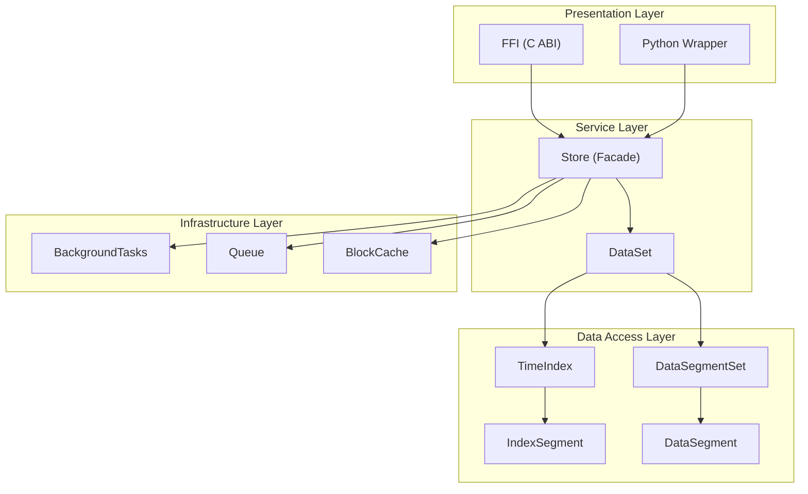
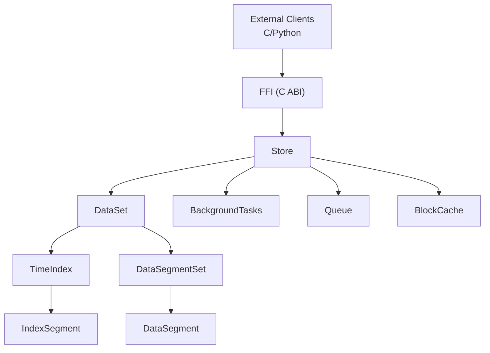
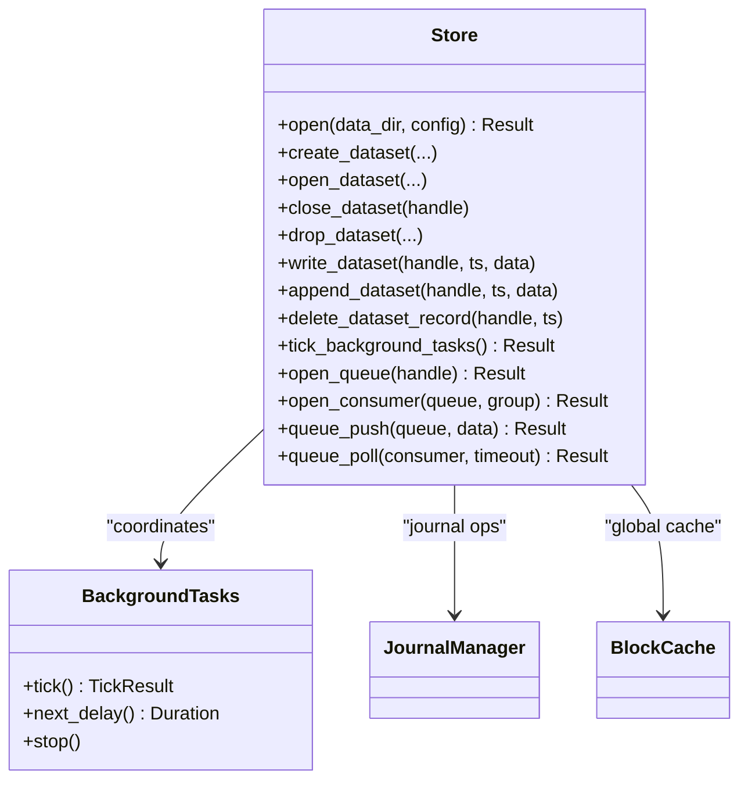
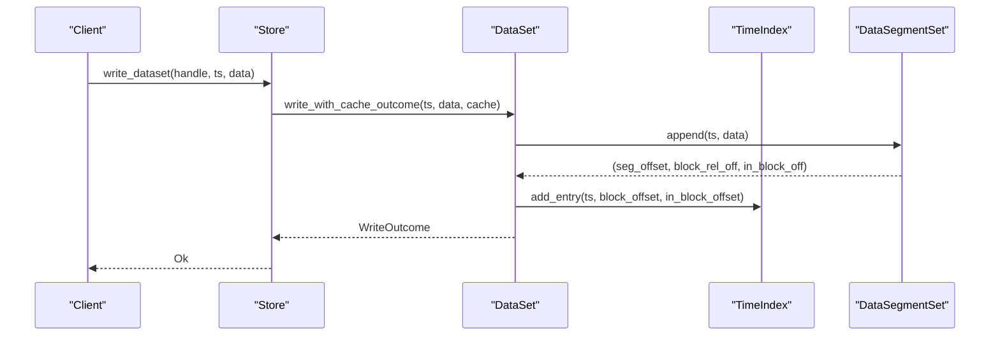
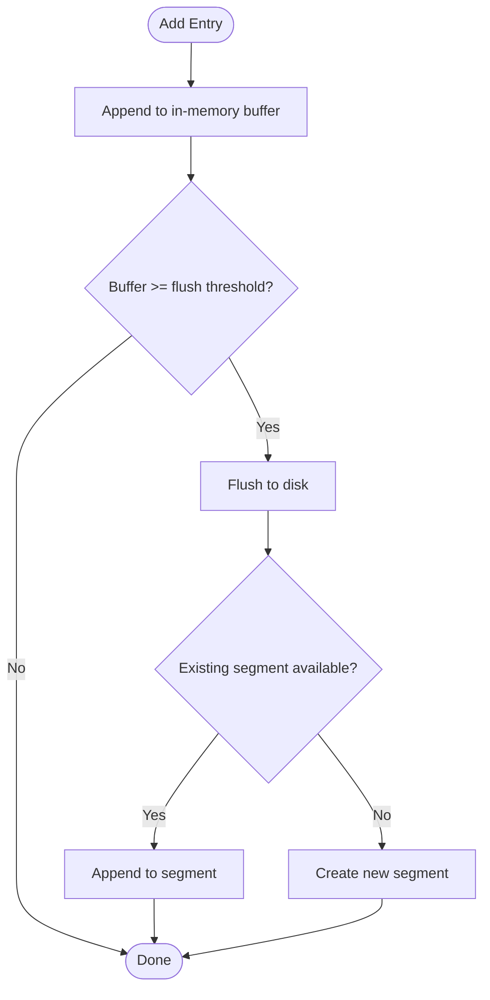
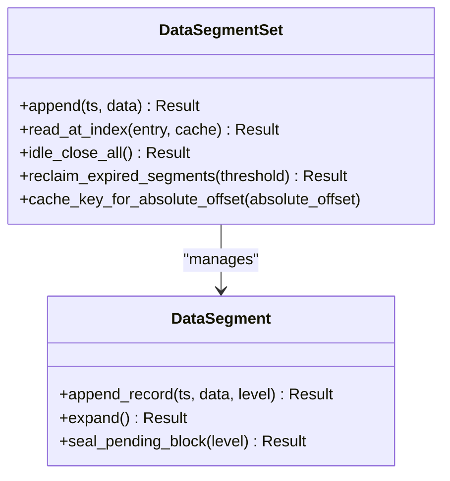
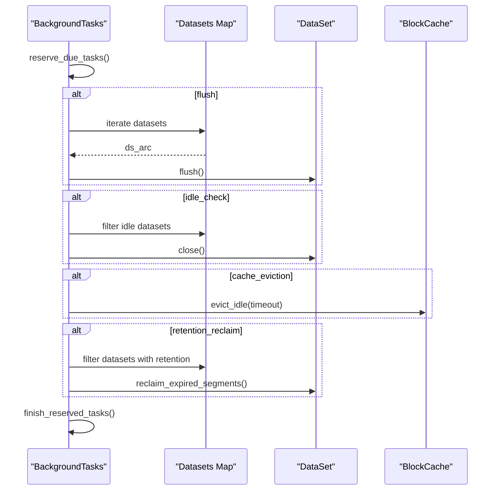
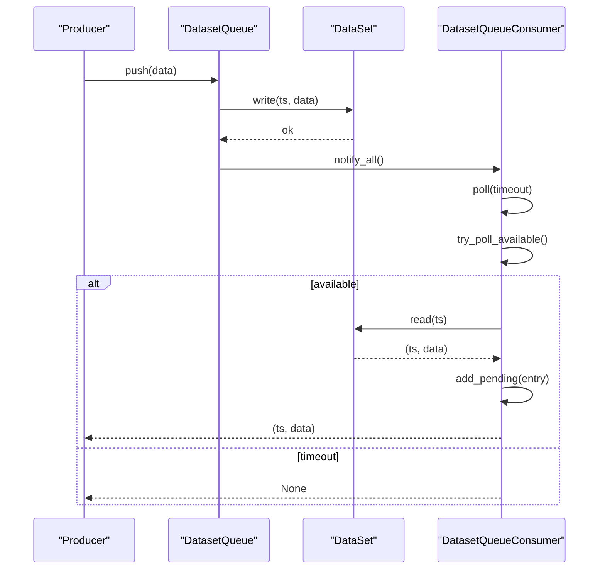
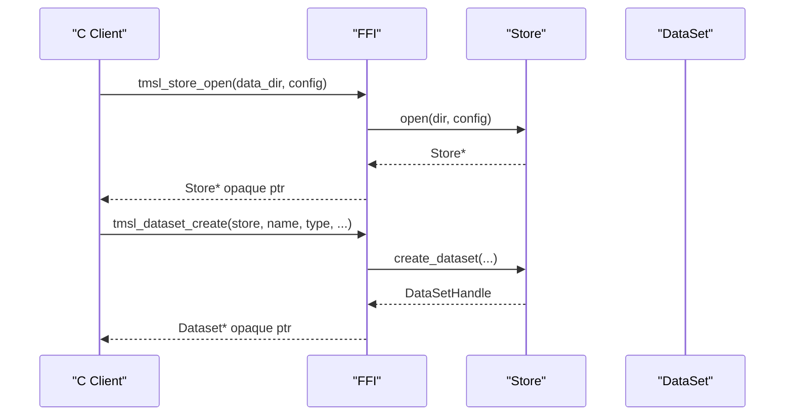
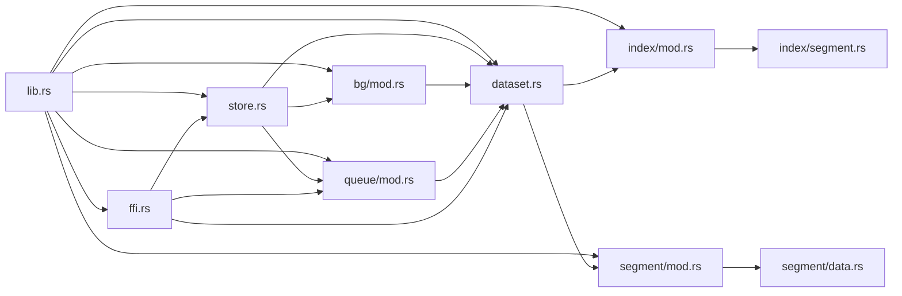

# Architecture Overview

<cite>
**Referenced Files in This Document**
- [lib.rs](file://src/lib.rs)
- [store.rs](file://src/store.rs)
- [dataset.rs](file://src/dataset.rs)
- [index/mod.rs](file://src/index/mod.rs)
- [index/segment.rs](file://src/index/segment.rs)
- [segment/mod.rs](file://src/segment/mod.rs)
- [segment/data.rs](file://src/segment/data.rs)
- [bg/mod.rs](file://src/bg/mod.rs)
- [queue/mod.rs](file://src/queue/mod.rs)
- [ffi.rs](file://src/ffi.rs)
- [Cargo.toml](file://Cargo.toml)
- [design.md](file://design.md)
</cite>

## Table of Contents
1. [Introduction](#introduction)
2. [Project Structure](#project-structure)
3. [Core Components](#core-components)
4. [Architecture Overview](#architecture-overview)
5. [Detailed Component Analysis](#detailed-component-analysis)
6. [Dependency Analysis](#dependency-analysis)
7. [Performance Considerations](#performance-considerations)
8. [Troubleshooting Guide](#troubleshooting-guide)
9. [Conclusion](#conclusion)

## Introduction
This document presents the architecture of TimSLite, a high-performance, memory-mapped time-series data store. The system is organized into layered modules that separate concerns across presentation, service, data access, and infrastructure. It supports:
- Block-level aggregation with delayed compression
- Lazy segment lifecycle management
- Time-indexed queries with binary search
- A C ABI FFI interface for cross-language integration
- Background task coordination for flushing, idle-closing, cache eviction, and retention reclaim
- A queue subsystem for producer/consumer semantics with persistent state files

## Project Structure
TimSLite is structured around a central facade (Store) that orchestrates datasets, indices, and segments. Supporting modules provide background task coordination, queue semantics, and FFI bindings.

**Diagram sources**
- [lib.rs:39-72](file://src/lib.rs#L39-L72)
- [store.rs:46-56](file://src/store.rs#L46-L56)
- [dataset.rs:71-82](file://src/dataset.rs#L71-L82)
- [index/mod.rs:20-31](file://src/index/mod.rs#L20-L31)
- [segment/mod.rs:43-53](file://src/segment/mod.rs#L43-L53)
- [bg/mod.rs:44-54](file://src/bg/mod.rs#L44-L54)
- [queue/mod.rs:380-388](file://src/queue/mod.rs#L380-L388)

**Section sources**
- [lib.rs:39-72](file://src/lib.rs#L39-L72)
- [Cargo.toml:6-8](file://Cargo.toml#L6-L8)

## Core Components
- Store: Top-level facade managing datasets, background tasks, journal, and caches. Exposes lifecycle operations (create/open/close/drop), write/append/delete, and queue operations.
- DataSet: Aggregates DataSegmentSet and TimeIndex for a (name, type) pair. Implements write, append, delete, read, and query operations with timestamp dispatch logic.
- TimeIndex: Manages index segments with lazy lifecycle and time-range queries. Supports continuous mode for O(1) segment lookups.
- DataSegmentSet: Manages multiple DataSegment files with lazy open/idle-close, append/read routing, and retention reclaim.
- BackgroundTasks: Coordinates periodic tasks (flush, idle-check, cache eviction, retention) in auto or manual modes.
- Queue: Provides producer/consumer semantics with persistent 4KB mmap state files and condvar-based notifications.
- FFI: Exposes a C ABI interface for external languages, with opaque handles and error propagation.

**Section sources**
- [store.rs:46-161](file://src/store.rs#L46-L161)
- [dataset.rs:71-218](file://src/dataset.rs#L71-L218)
- [index/mod.rs:20-82](file://src/index/mod.rs#L20-L82)
- [segment/mod.rs:43-176](file://src/segment/mod.rs#L43-L176)
- [bg/mod.rs:44-134](file://src/bg/mod.rs#L44-L134)
- [queue/mod.rs:380-595](file://src/queue/mod.rs#L380-L595)
- [ffi.rs:296-420](file://src/ffi.rs#L296-L420)

## Architecture Overview
TimSLite follows a layered design:
- Presentation: FFI and Python wrapper expose APIs to external systems.
- Service: Store and DataSet orchestrate operations and enforce lifecycle policies.
- Data Access: TimeIndex and DataSegmentSet encapsulate indexing and storage.
- Infrastructure: BackgroundTasks, Queue, and BlockCache provide operational and runtime services.

**Diagram sources**
- [ffi.rs:296-420](file://src/ffi.rs#L296-L420)
- [store.rs:46-161](file://src/store.rs#L46-L161)
- [dataset.rs:71-218](file://src/dataset.rs#L71-L218)
- [index/mod.rs:20-82](file://src/index/mod.rs#L20-L82)
- [segment/mod.rs:43-176](file://src/segment/mod.rs#L43-L176)
- [bg/mod.rs:44-134](file://src/bg/mod.rs#L44-L134)
- [queue/mod.rs:380-595](file://src/queue/mod.rs#L380-L595)

## Detailed Component Analysis

### Store Facade
The Store acts as a central coordinator:
- Manages dataset registry with lazy open/idle-close semantics
- Initializes and controls BackgroundTasks
- Provides write/append/delete/read/query operations
- Integrates with JournalManager and BlockCache

**Diagram sources**
- [store.rs:46-161](file://src/store.rs#L46-L161)
- [bg/mod.rs:44-134](file://src/bg/mod.rs#L44-L134)

**Section sources**
- [store.rs:46-161](file://src/store.rs#L46-L161)
- [store.rs:383-397](file://src/store.rs#L383-L397)
- [store.rs:400-502](file://src/store.rs#L400-L502)
- [store.rs:563-669](file://src/store.rs#L563-L669)

### DataSet: Data Access Orchestration
DataSet aggregates DataSegmentSet and TimeIndex, implementing:
- Timestamp-aware write/append/delete with correction/out-of-order handling
- Query preparation and iteration
- Queue integration and notifications

**Diagram sources**
- [store.rs:400-431](file://src/store.rs#L400-L431)
- [dataset.rs:257-316](file://src/dataset.rs#L257-L316)
- [segment/mod.rs:180-272](file://src/segment/mod.rs#L180-L272)
- [index/mod.rs:67-82](file://src/index/mod.rs#L67-L82)

**Section sources**
- [dataset.rs:226-316](file://src/dataset.rs#L226-L316)
- [dataset.rs:318-429](file://src/dataset.rs#L318-L429)
- [dataset.rs:525-572](file://src/dataset.rs#L525-L572)
- [dataset.rs:629-660](file://src/dataset.rs#L629-L660)

### TimeIndex: Index Management
TimeIndex manages index segments with:
- In-memory buffer flushed to disk when threshold is reached
- Lazy open/idle-close lifecycle for segments
- Continuous mode support for O(1) segment lookups
- Sparse continuous entry handling and filler removal

**Diagram sources**
- [index/mod.rs:67-82](file://src/index/mod.rs#L67-L82)
- [index/mod.rs:413-457](file://src/index/mod.rs#L413-L457)
- [index/mod.rs:552-614](file://src/index/mod.rs#L552-L614)

**Section sources**
- [index/mod.rs:20-82](file://src/index/mod.rs#L20-L82)
- [index/mod.rs:412-550](file://src/index/mod.rs#L412-L550)
- [index/mod.rs:616-709](file://src/index/mod.rs#L616-L709)

### DataSegmentSet: Storage Management
DataSegmentSet provides:
- Lazy open/idle-close lifecycle for data segments
- Append operations with expansion/sealing logic
- Cross-segment reads and retention reclaim
- Cache key computation for global block cache

**Diagram sources**
- [segment/mod.rs:43-176](file://src/segment/mod.rs#L43-L176)
- [segment/mod.rs:180-450](file://src/segment/mod.rs#L180-L450)

**Section sources**
- [segment/mod.rs:43-176](file://src/segment/mod.rs#L43-L176)
- [segment/mod.rs:180-450](file://src/segment/mod.rs#L180-L450)

### Background Tasks Coordination
BackgroundTasks coordinates periodic maintenance:
- Flush: syncs datasets and queues
- Idle-check: closes idle datasets
- Cache eviction: prunes idle cache entries
- Retention reclaim: deletes expired segments

**Diagram sources**
- [bg/mod.rs:194-318](file://src/bg/mod.rs#L194-L318)
- [bg/mod.rs:320-439](file://src/bg/mod.rs#L320-L439)

**Section sources**
- [bg/mod.rs:44-134](file://src/bg/mod.rs#L44-L134)
- [bg/mod.rs:194-318](file://src/bg/mod.rs#L194-L318)
- [bg/mod.rs:320-439](file://src/bg/mod.rs#L320-L439)

### Queue Subsystem
The queue subsystem provides:
- Producer/consumer semantics with persistent state files
- Multi-consumer-group support with shared progress
- Condvar-based wait/notify for polling
- Pending entry tracking with ack/cleanup

**Diagram sources**
- [queue/mod.rs:525-562](file://src/queue/mod.rs#L525-L562)
- [queue/mod.rs:631-774](file://src/queue/mod.rs#L631-L774)

**Section sources**
- [queue/mod.rs:380-595](file://src/queue/mod.rs#L380-L595)
- [queue/mod.rs:631-774](file://src/queue/mod.rs#L631-L774)

### FFI and Cross-Language Integration
The FFI layer exposes:
- Store and dataset lifecycle operations
- Write/append/delete/read/query iterators
- Background task ticking and delays
- Opaque handles and error propagation

**Diagram sources**
- [ffi.rs:296-330](file://src/ffi.rs#L296-L330)
- [ffi.rs:424-494](file://src/ffi.rs#L424-L494)

**Section sources**
- [ffi.rs:296-330](file://src/ffi.rs#L296-L330)
- [ffi.rs:424-494](file://src/ffi.rs#L424-L494)
- [ffi.rs:360-420](file://src/ffi.rs#L360-L420)

## Dependency Analysis
The module-level dependencies reflect a clean separation of concerns:
- lib.rs re-exports public APIs and constants
- Store depends on DataSet, BackgroundTasks, JournalManager, and BlockCache
- DataSet depends on DataSegmentSet, TimeIndex, and queue internals
- TimeIndex and DataSegmentSet depend on segment internals and headers
- BackgroundTasks depends on DataSet and BlockCache
- Queue depends on DataSet and uses memmap2 for state files
- FFI depends on Store, DataSet, and query/queue types

**Diagram sources**
- [lib.rs:39-72](file://src/lib.rs#L39-L72)
- [store.rs:8-18](file://src/store.rs#L8-L18)
- [dataset.rs:11-22](file://src/dataset.rs#L11-L22)
- [index/mod.rs:6-17](file://src/index/mod.rs#L6-L17)
- [segment/mod.rs:5-16](file://src/segment/mod.rs#L5-L16)
- [bg/mod.rs:10-18](file://src/bg/mod.rs#L10-L18)
- [queue/mod.rs:24-27](file://src/queue/mod.rs#L24-L27)
- [ffi.rs:10-17](file://src/ffi.rs#L10-L17)

**Section sources**
- [lib.rs:39-72](file://src/lib.rs#L39-L72)

## Performance Considerations
- Memory-mapped files: Index and data segments use memory-mapped I/O for efficient random access and reduced kernel overhead.
- Lazy segment lifecycle: Segments are opened on demand and idle-closed after inactivity, minimizing resource usage.
- Block-level aggregation with delayed compression: Reduces I/O and improves compression ratios by sealing blocks when full.
- Global block cache: Shared cache across datasets reduces repeated decompression and disk reads.
- Background task coordination: Periodic maintenance avoids long-running operations during hot paths.
- Continuous index mode: Enables O(1) segment lookups for contiguous timestamp sequences.

[No sources needed since this section provides general guidance]

## Troubleshooting Guide
Common issues and diagnostics:
- Background tasks not executing: Verify background thread mode and call tick_background_tasks() in manual mode.
- Queue state file errors: Check magic/version compatibility and pending entry limits.
- Segment expansion failures: Ensure sufficient disk space and valid segment sizes.
- Cache eviction conflicts: Confirm cache is enabled and idle timeouts are configured appropriately.

**Section sources**
- [bg/mod.rs:194-203](file://src/bg/mod.rs#L194-L203)
- [queue/mod.rs:114-191](file://src/queue/mod.rs#L114-L191)
- [segment/mod.rs:224-268](file://src/segment/mod.rs#L224-L268)
- [bg/mod.rs:378-385](file://src/bg/mod.rs#L378-L385)

## Conclusion
TimSLite’s architecture balances performance, maintainability, and cross-language interoperability. The layered design isolates concerns, while memory-mapped files, lazy lifecycles, and background coordination deliver high throughput for time-series workloads. The FFI and queue subsystems enable practical deployment across diverse environments.