# Component Interactions

<cite>
**Referenced Files in This Document**
- [lib.rs](file://src/lib.rs)
- [store.rs](file://src/store.rs)
- [dataset.rs](file://src/dataset.rs)
- [segment/mod.rs](file://src/segment/mod.rs)
- [segment/data.rs](file://src/segment/data.rs)
- [index/mod.rs](file://src/index/mod.rs)
- [compress.rs](file://src/compress.rs)
- [bg/mod.rs](file://src/bg/mod.rs)
- [queue/mod.rs](file://src/queue/mod.rs)
- [journal/mod.rs](file://src/journal/mod.rs)
</cite>

## Table of Contents
1. [Introduction](#introduction)
2. [Project Structure](#project-structure)
3. [Core Components](#core-components)
4. [Architecture Overview](#architecture-overview)
5. [Detailed Component Analysis](#detailed-component-analysis)
6. [Dependency Analysis](#dependency-analysis)
7. [Performance Considerations](#performance-considerations)
8. [Troubleshooting Guide](#troubleshooting-guide)
9. [Conclusion](#conclusion)

## Introduction
This document explains how TimSLite coordinates multiple datasets, how datasets manage data segments and time indexes, and how background tasks coordinate maintenance operations. It also documents observer patterns for background task notifications, factory patterns for segment creation, and strategy patterns for compression algorithms. Interaction diagrams illustrate normal operations and error scenarios.

## Project Structure
TimSLite organizes storage around a Store facade that manages multiple Datasets. Each Dataset composes a DataSegmentSet (factory for DataSegment instances) and a TimeIndex (index segments). Background maintenance is coordinated by BackgroundTasks, and queues integrate with datasets for producer/consumer semantics. Journaling is handled by JournalManager.

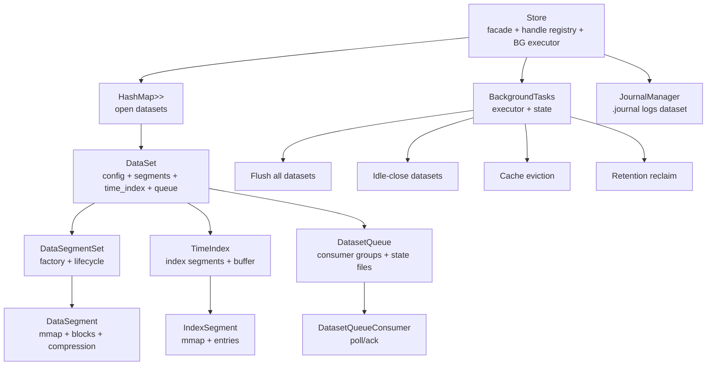

**Diagram sources**
- [store.rs:46-161](file://src/store.rs#L46-L161)
- [dataset.rs:71-218](file://src/dataset.rs#L71-L218)
- [segment/mod.rs:43-176](file://src/segment/mod.rs#L43-L176)
- [index/mod.rs:20-54](file://src/index/mod.rs#L20-L54)
- [bg/mod.rs:44-134](file://src/bg/mod.rs#L44-L134)
- [queue/mod.rs:383-595](file://src/queue/mod.rs#L383-L595)
- [journal/mod.rs:321-379](file://src/journal/mod.rs#L321-L379)

**Section sources**
- [lib.rs:38-73](file://src/lib.rs#L38-L73)
- [store.rs:46-161](file://src/store.rs#L46-L161)
- [dataset.rs:71-218](file://src/dataset.rs#L71-L218)
- [segment/mod.rs:43-176](file://src/segment/mod.rs#L43-L176)
- [index/mod.rs:20-54](file://src/index/mod.rs#L20-L54)
- [bg/mod.rs:44-134](file://src/bg/mod.rs#L44-L134)
- [queue/mod.rs:383-595](file://src/queue/mod.rs#L383-L595)
- [journal/mod.rs:321-379](file://src/journal/mod.rs#L321-L379)

## Core Components
- Store: Top-level facade that owns datasets, background tasks, block cache, and journal. It exposes lifecycle APIs (create/open/close/drop), write/read/query, and queue operations. It also drives background ticks and forwards journal events.
- DataSet: Aggregates DataSegmentSet and TimeIndex. Manages write branches (normal, correction, out-of-order), append operations, deletes, reads, and queries. Maintains queue integration and retention window.
- DataSegmentSet: Factory and lifecycle manager for DataSegment instances. Handles lazy open/idle-close, append/overwrite/append-to-last, and cross-segment reads.
- DataSegment: Single data file with block aggregation, pending/raw state, sealing/compression, and mmap lifecycle.
- TimeIndex: Manages index segments with in-memory buffering and lazy open/idle-close. Supports continuous/non-continuous modes and query preparation.
- BackgroundTasks: Executor that schedules and runs flush, idle-check, cache eviction, and retention reclaim across all datasets.
- Queue: Producer/consumer groups with persistent state files and condvar-based notifications.
- JournalManager: Internal dataset (.journal/logs) for durable change log of dataset lifecycle and data mutations.

**Section sources**
- [store.rs:46-161](file://src/store.rs#L46-L161)
- [dataset.rs:71-218](file://src/dataset.rs#L71-L218)
- [segment/mod.rs:43-176](file://src/segment/mod.rs#L43-L176)
- [segment/data.rs:39-122](file://src/segment/data.rs#L39-L122)
- [index/mod.rs:20-54](file://src/index/mod.rs#L20-L54)
- [bg/mod.rs:44-134](file://src/bg/mod.rs#L44-L134)
- [queue/mod.rs:383-595](file://src/queue/mod.rs#L383-L595)
- [journal/mod.rs:321-379](file://src/journal/mod.rs#L321-L379)

## Architecture Overview
TimSLite’s architecture centers on a Store that orchestrates Datasets. Each Dataset encapsulates DataSegmentSet and TimeIndex, enabling efficient writes and queries. BackgroundTasks coordinate periodic maintenance across all datasets. Queues integrate with datasets to provide durable producer/consumer semantics. JournalManager records dataset lifecycle and mutation events.

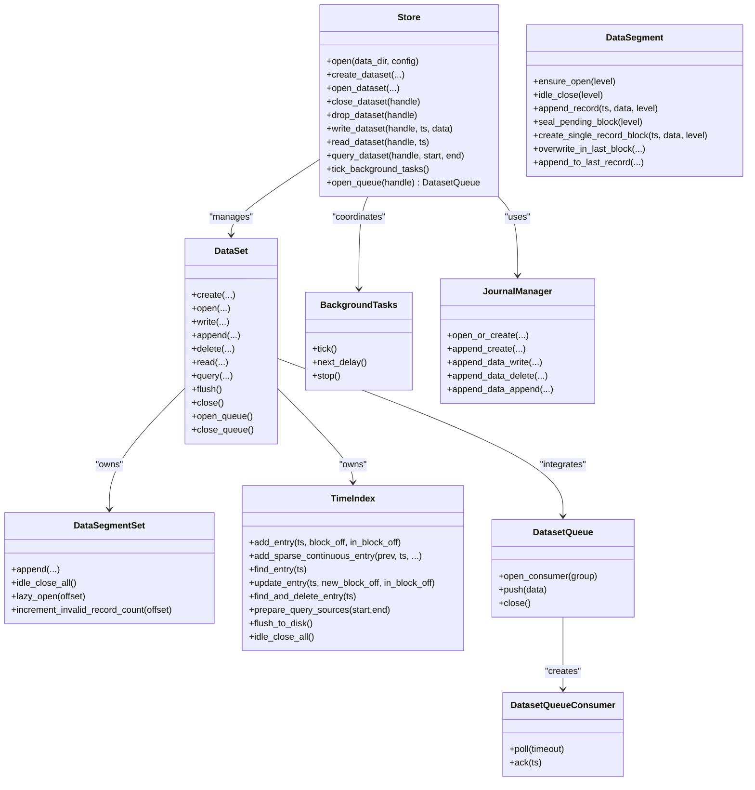

**Diagram sources**
- [store.rs:46-161](file://src/store.rs#L46-L161)
- [dataset.rs:71-218](file://src/dataset.rs#L71-L218)
- [segment/mod.rs:43-176](file://src/segment/mod.rs#L43-L176)
- [segment/data.rs:39-122](file://src/segment/data.rs#L39-L122)
- [index/mod.rs:20-54](file://src/index/mod.rs#L20-L54)
- [bg/mod.rs:44-134](file://src/bg/mod.rs#L44-L134)
- [queue/mod.rs:383-595](file://src/queue/mod.rs#L383-L595)
- [journal/mod.rs:321-379](file://src/journal/mod.rs#L321-L379)

## Detailed Component Analysis

### Store Coordination of Datasets and Background Tasks
- Store maintains an Arc<RwLock<HashMap<DataSetKey, Arc<Mutex<DataSet>>>>> to track open datasets and provides handle-based access.
- BackgroundTasks is configured with intervals and timeouts and can run either in a dedicated thread or be driven manually via tick().
- Store forwards write/read/query operations to the underlying DataSet and applies journal and cache hooks.
- Store exposes queue operations that delegate to the dataset’s queue subsystem.

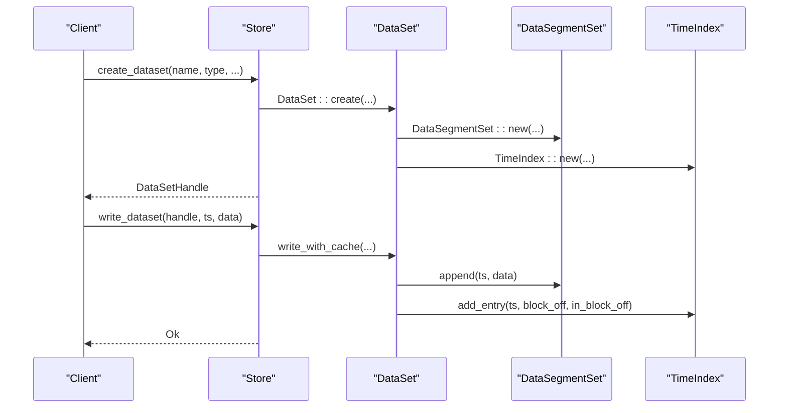

**Diagram sources**
- [store.rs:163-253](file://src/store.rs#L163-L253)
- [dataset.rs:89-160](file://src/dataset.rs#L89-L160)
- [segment/mod.rs:178-272](file://src/segment/mod.rs#L178-L272)
- [index/mod.rs:67-82](file://src/index/mod.rs#L67-L82)

**Section sources**
- [store.rs:46-161](file://src/store.rs#L46-L161)
- [dataset.rs:89-160](file://src/dataset.rs#L89-L160)
- [segment/mod.rs:178-272](file://src/segment/mod.rs#L178-L272)
- [index/mod.rs:67-82](file://src/index/mod.rs#L67-L82)

### Dataset Write Branches and Append Semantics
- Normal write: appends to latest segment, adds index entry. In continuous mode, fills sparse gaps.
- Correction write: in-place overwrite in the last pending raw block of the latest segment; falls back to out-of-order write if sealed/compressed.
- Out-of-order write: appends to latest segment and updates existing index entry; increments invalid_record_count on the old segment if applicable.
- Append operation: merges data into the last record of the latest segment when conditions permit; migrates to a new record if threshold exceeded.

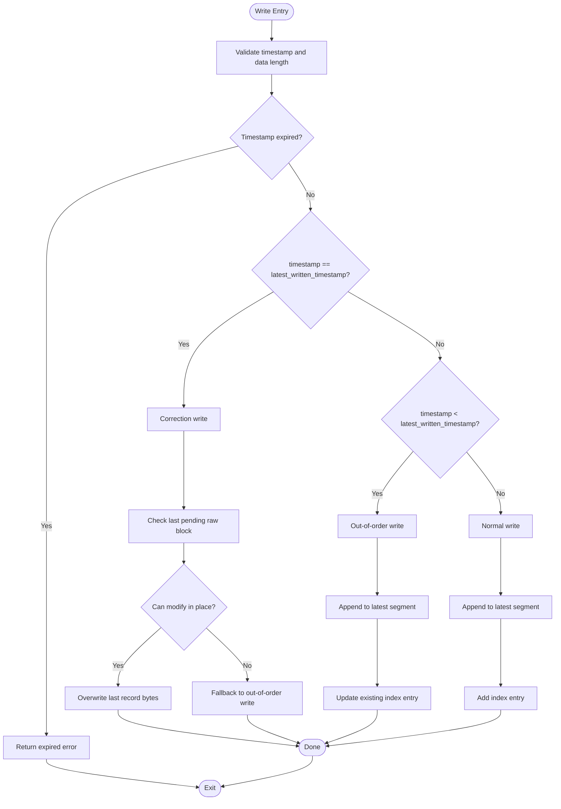

**Diagram sources**
- [dataset.rs:257-316](file://src/dataset.rs#L257-L316)
- [dataset.rs:441-476](file://src/dataset.rs#L441-L476)
- [dataset.rs:478-523](file://src/dataset.rs#L478-L523)

**Section sources**
- [dataset.rs:257-316](file://src/dataset.rs#L257-L316)
- [dataset.rs:441-476](file://src/dataset.rs#L441-L476)
- [dataset.rs:478-523](file://src/dataset.rs#L478-L523)

### DataSegmentSet Factory Pattern and Lifecycle
- Factory responsibilities:
  - Creates new segments when appending exceeds capacity or when none exist.
  - Lazily opens closed segments by file_offset and rehydrates state.
  - Ensures pending blocks are sealed and compressed appropriately.
- Lifecycle:
  - Lazy open: reopen closed segment with mmap.
  - Idle close: flush and unmap; retain metadata for later reopen.
  - Expand: grow segment file size up to max_file_size.
- Append path:
  - Try to append to current segment.
  - On SegmentFull, expand or create new segment, seal previous if needed.

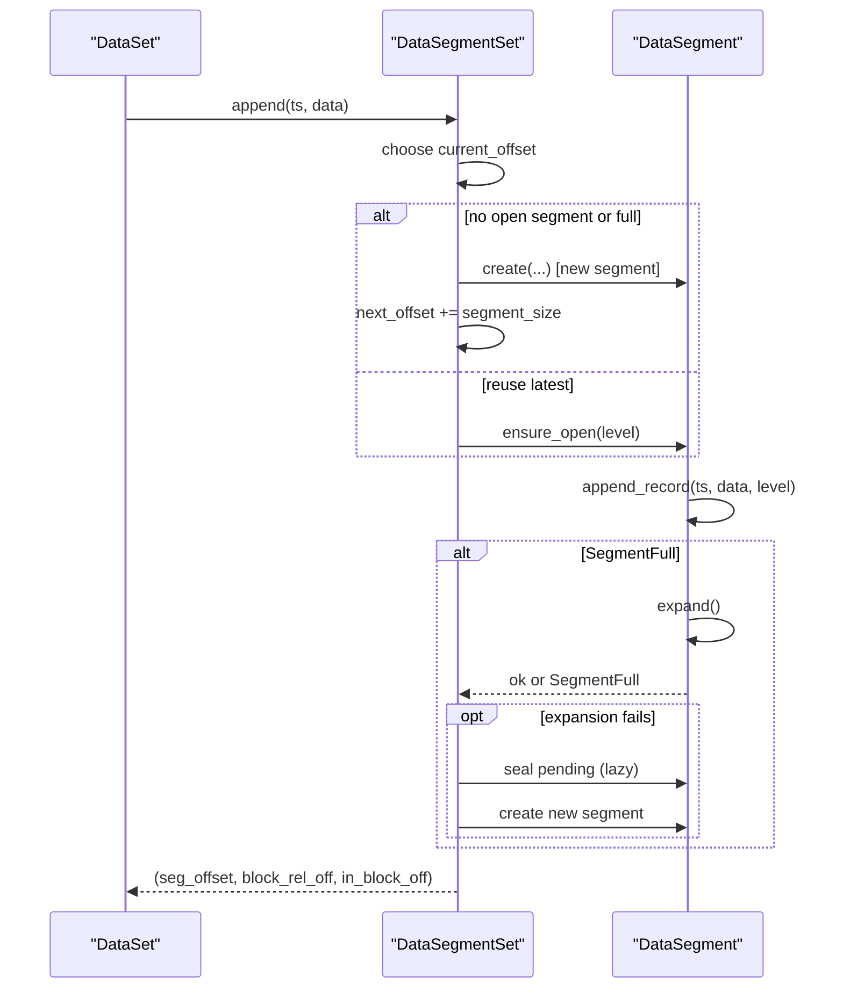

**Diagram sources**
- [segment/mod.rs:178-272](file://src/segment/mod.rs#L178-L272)
- [segment/data.rs:352-407](file://src/segment/data.rs#L352-L407)
- [segment/data.rs:284-306](file://src/segment/data.rs#L284-L306)

**Section sources**
- [segment/mod.rs:178-272](file://src/segment/mod.rs#L178-L272)
- [segment/data.rs:352-407](file://src/segment/data.rs#L352-L407)
- [segment/data.rs:284-306](file://src/segment/data.rs#L284-L306)

### TimeIndex Management and Query Preparation
- In-memory buffer accumulates entries and flushes to disk when threshold is reached.
- Continuous mode computes segment start and entry index to enable O(1) lookups and sparse filler entries.
- Query preparation builds ordered sources from in-memory buffer and open/closed index segments.

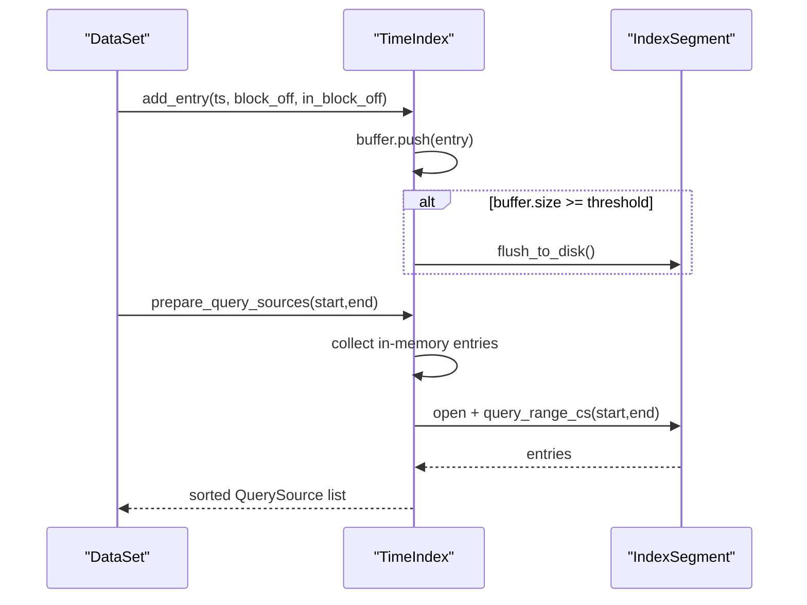

**Diagram sources**
- [index/mod.rs:67-82](file://src/index/mod.rs#L67-L82)
- [index/mod.rs:413-457](file://src/index/mod.rs#L413-L457)
- [index/mod.rs:651-709](file://src/index/mod.rs#L651-L709)

**Section sources**
- [index/mod.rs:67-82](file://src/index/mod.rs#L67-L82)
- [index/mod.rs:413-457](file://src/index/mod.rs#L413-L457)
- [index/mod.rs:651-709](file://src/index/mod.rs#L651-L709)

### Background Task Coordination and Maintenance
- BackgroundTasks schedules four tasks: flush, idle-check, cache eviction, and retention reclaim.
- It serializes concurrent ticks via a Mutex<ExecutorState>.
- Manual vs auto mode:
  - Manual: tick() executes reserved tasks and returns counts and next delay.
  - Auto: start() spawns a thread that loops tick() with shutdown signaling.

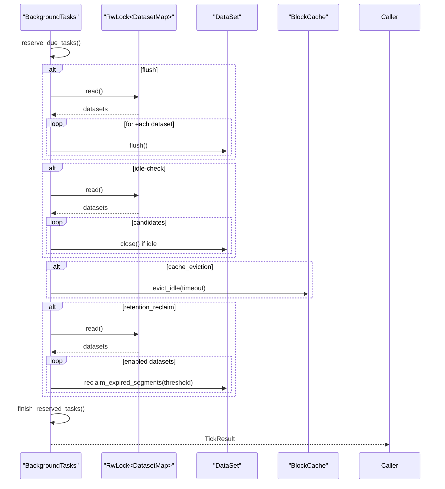

**Diagram sources**
- [bg/mod.rs:194-203](file://src/bg/mod.rs#L194-L203)
- [bg/mod.rs:250-284](file://src/bg/mod.rs#L250-L284)
- [bg/mod.rs:286-299](file://src/bg/mod.rs#L286-L299)
- [bg/mod.rs:320-332](file://src/bg/mod.rs#L320-L332)
- [bg/mod.rs:334-376](file://src/bg/mod.rs#L334-L376)
- [bg/mod.rs:378-385](file://src/bg/mod.rs#L378-L385)
- [bg/mod.rs:387-439](file://src/bg/mod.rs#L387-L439)

**Section sources**
- [bg/mod.rs:194-203](file://src/bg/mod.rs#L194-L203)
- [bg/mod.rs:250-284](file://src/bg/mod.rs#L250-L284)
- [bg/mod.rs:286-299](file://src/bg/mod.rs#L286-L299)
- [bg/mod.rs:320-332](file://src/bg/mod.rs#L320-L332)
- [bg/mod.rs:334-376](file://src/bg/mod.rs#L334-L376)
- [bg/mod.rs:378-385](file://src/bg/mod.rs#L378-L385)
- [bg/mod.rs:387-439](file://src/bg/mod.rs#L387-L439)

### Observer Pattern for Background Task Notifications
- Store integrates with BackgroundTasks via a shared ExecutorState protected by a Mutex.
- Consumers can poll for notifications using condvar-based wait/notify mechanisms in the queue subsystem.
- The queue subsystem uses Arc<(Mutex<bool>, Condvar)> to signal new data availability to waiting consumers.

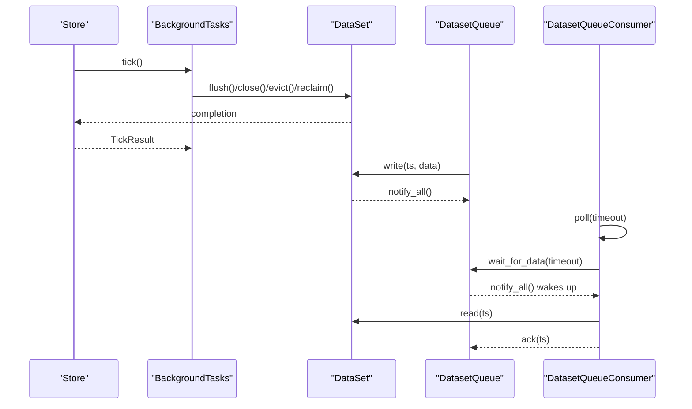

**Diagram sources**
- [bg/mod.rs:194-203](file://src/bg/mod.rs#L194-L203)
- [queue/mod.rs:529-562](file://src/queue/mod.rs#L529-L562)
- [queue/mod.rs:710-774](file://src/queue/mod.rs#L710-L774)

**Section sources**
- [bg/mod.rs:194-203](file://src/bg/mod.rs#L194-L203)
- [queue/mod.rs:529-562](file://src/queue/mod.rs#L529-L562)
- [queue/mod.rs:710-774](file://src/queue/mod.rs#L710-L774)

### Factory Patterns for Segment Creation
- DataSegmentSet.new(...) initializes a fresh dataset with empty segment collections.
- DataSegmentSet.load_existing(...) reconstructs closed segments from persisted files.
- DataSegmentSet.append(...) acts as a factory for new segments when needed, creating with initial size and expanding as required.

**Section sources**
- [segment/mod.rs:57-75](file://src/segment/mod.rs#L57-L75)
- [segment/mod.rs:128-176](file://src/segment/mod.rs#L128-L176)
- [segment/mod.rs:178-272](file://src/segment/mod.rs#L178-L272)

### Strategy Pattern for Compression Algorithms
- Compression is implemented via a strategy-like function that delegates to deflate_compress/deflate_decompress.
- DataSegment.compress_level determines compression level for sealing pending blocks and single-record blocks.
- Compression decisions are made at block sealing time; should_use_compressed can evaluate benefit.

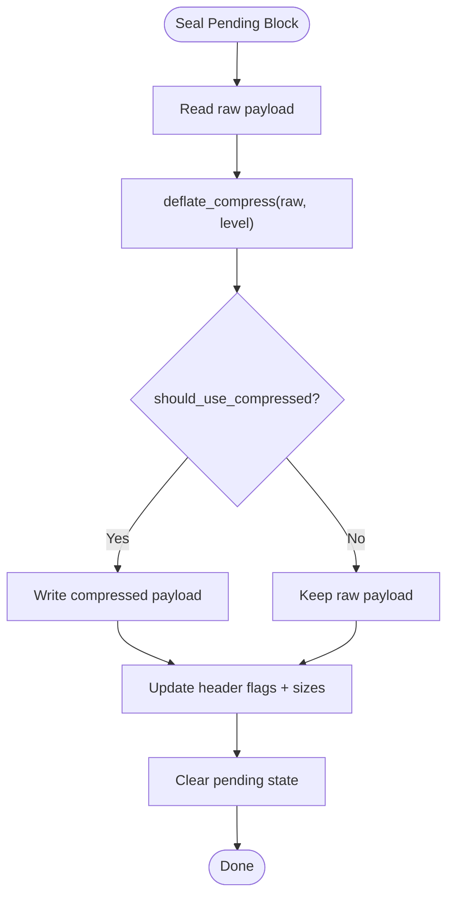

**Diagram sources**
- [segment/data.rs:500-534](file://src/segment/data.rs#L500-L534)
- [compress.rs:8-23](file://src/compress.rs#L8-L23)

**Section sources**
- [segment/data.rs:500-534](file://src/segment/data.rs#L500-L534)
- [compress.rs:8-23](file://src/compress.rs#L8-L23)

### Queue Integration and Consumer Groups
- DatasetQueue is constructed with dataset handle, inner state, and notify condvar pair.
- Consumer groups maintain independent progress via state files with processed_ts and pending entries.
- Polling uses condvar to wait for notifications; ack updates state and cleans up acknowledged entries.

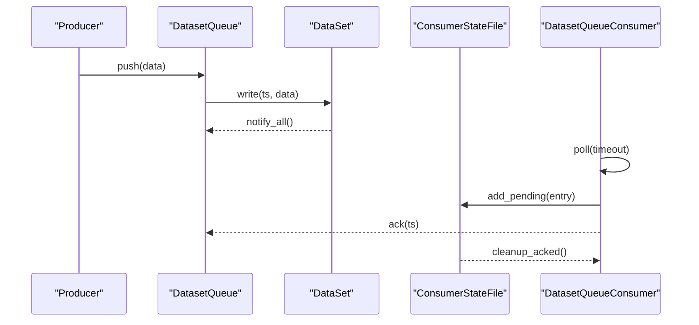

**Diagram sources**
- [queue/mod.rs:529-562](file://src/queue/mod.rs#L529-L562)
- [queue/mod.rs:640-708](file://src/queue/mod.rs#L640-L708)
- [queue/mod.rs:784-798](file://src/queue/mod.rs#L784-L798)

**Section sources**
- [queue/mod.rs:383-595](file://src/queue/mod.rs#L383-L595)
- [queue/mod.rs:640-708](file://src/queue/mod.rs#L640-L708)
- [queue/mod.rs:784-798](file://src/queue/mod.rs#L784-L798)

### Journal Change Log Integration
- JournalManager creates/open the internal .journal/logs dataset and encodes lifecycle/mutation records.
- Store forwards write/delete/append outcomes to JournalManager via append_* calls.

**Section sources**
- [journal/mod.rs:321-379](file://src/journal/mod.rs#L321-L379)
- [store.rs:400-502](file://src/store.rs#L400-L502)

## Dependency Analysis
- Coupling:
  - Store depends on DataSet, BackgroundTasks, JournalManager, and BlockCache.
  - DataSet depends on DataSegmentSet and TimeIndex.
  - DataSegmentSet depends on DataSegment; DataSegment depends on compression utilities.
  - TimeIndex depends on IndexSegment; IndexSegment depends on mmap-backed files.
  - Queue subsystem depends on DataSet and condvar/notify primitives.
- Cohesion:
  - Each module encapsulates a single responsibility: storage, indexing, background maintenance, queueing, or journaling.
- External dependencies:
  - Compression via miniz_oxide.
  - Memory-mapped files via memmap2.

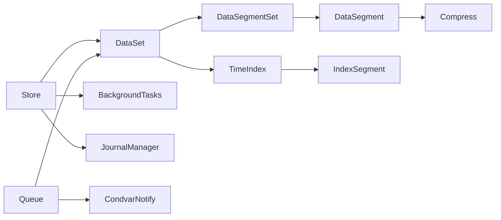

**Diagram sources**
- [store.rs:46-161](file://src/store.rs#L46-L161)
- [dataset.rs:71-218](file://src/dataset.rs#L71-L218)
- [segment/mod.rs:43-176](file://src/segment/mod.rs#L43-L176)
- [segment/data.rs:39-122](file://src/segment/data.rs#L39-L122)
- [index/mod.rs:20-54](file://src/index/mod.rs#L20-L54)
- [compress.rs:8-23](file://src/compress.rs#L8-L23)
- [queue/mod.rs:383-595](file://src/queue/mod.rs#L383-L595)

**Section sources**
- [store.rs:46-161](file://src/store.rs#L46-L161)
- [dataset.rs:71-218](file://src/dataset.rs#L71-L218)
- [segment/mod.rs:43-176](file://src/segment/mod.rs#L43-L176)
- [segment/data.rs:39-122](file://src/segment/data.rs#L39-L122)
- [index/mod.rs:20-54](file://src/index/mod.rs#L20-L54)
- [compress.rs:8-23](file://src/compress.rs#L8-L23)
- [queue/mod.rs:383-595](file://src/queue/mod.rs#L383-L595)

## Performance Considerations
- Lazy open/idle-close minimizes memory footprint and IO churn.
- In-memory index buffer reduces frequent disk writes; flush occurs at threshold.
- Compression reduces storage and improves throughput for compressible data; benefit evaluated per block.
- Background tasks are serialized to prevent contention; intervals balance responsiveness and overhead.
- Queue state files are 4KB fixed-size mmapped regions to reduce syscalls and improve latency.

## Troubleshooting Guide
- Background tasks not executing:
  - Verify store initialization with enable_background_thread and that tick() is invoked in manual mode.
- Segment full errors during append:
  - Ensure DataSegmentSet expands or creates new segment; confirm segment_size and initial_segment_size configuration.
- Index entry not found:
  - For out-of-order writes in continuous mode, ensure filler entries are correctly materialized; verify base_timestamp alignment.
- Queue polling timeouts:
  - Confirm push() triggers notify_all() and consumers are not closed; check pending entry capacity and ack behavior.
- Journal disabled:
  - JournalManager::is_enabled() must be true; otherwise, journal operations return NotFound.

**Section sources**
- [bg/mod.rs:194-203](file://src/bg/mod.rs#L194-L203)
- [segment/mod.rs:178-272](file://src/segment/mod.rs#L178-L272)
- [index/mod.rs:247-305](file://src/index/mod.rs#L247-L305)
- [queue/mod.rs:640-708](file://src/queue/mod.rs#L640-L708)
- [journal/mod.rs:370-372](file://src/journal/mod.rs#L370-L372)

## Conclusion
TimSLite’s component interactions demonstrate a clean separation of concerns: Store orchestrates datasets and background maintenance, DataSet encapsulates write/append/delete/read/query logic, DataSegmentSet and DataSegment provide robust factory and lifecycle management, TimeIndex offers efficient indexing and query preparation, BackgroundTasks coordinates maintenance, and Queue/Journal enhance durability and observability. The documented patterns (observer, factory, strategy) enable scalable and maintainable operations across normal and error scenarios.