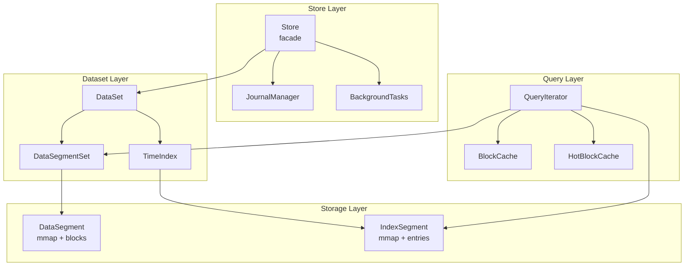
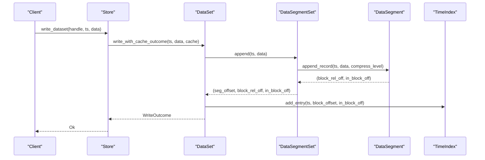
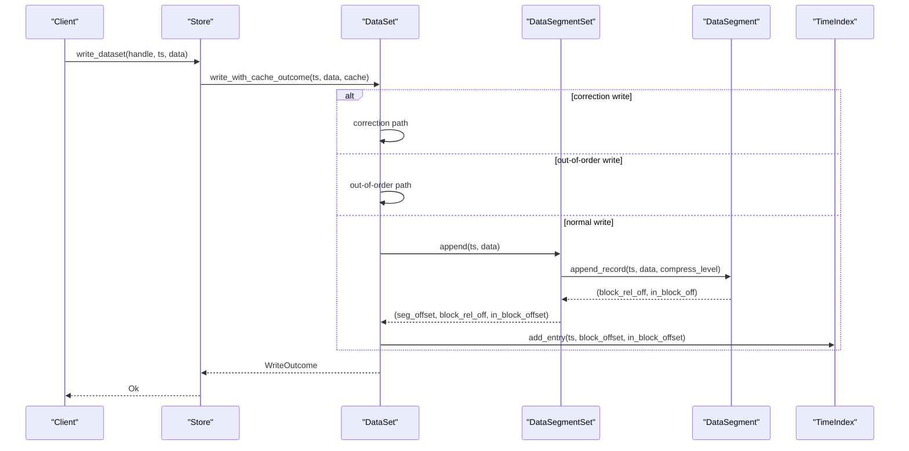
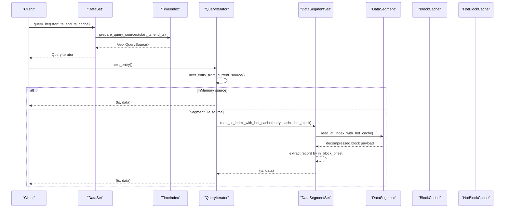
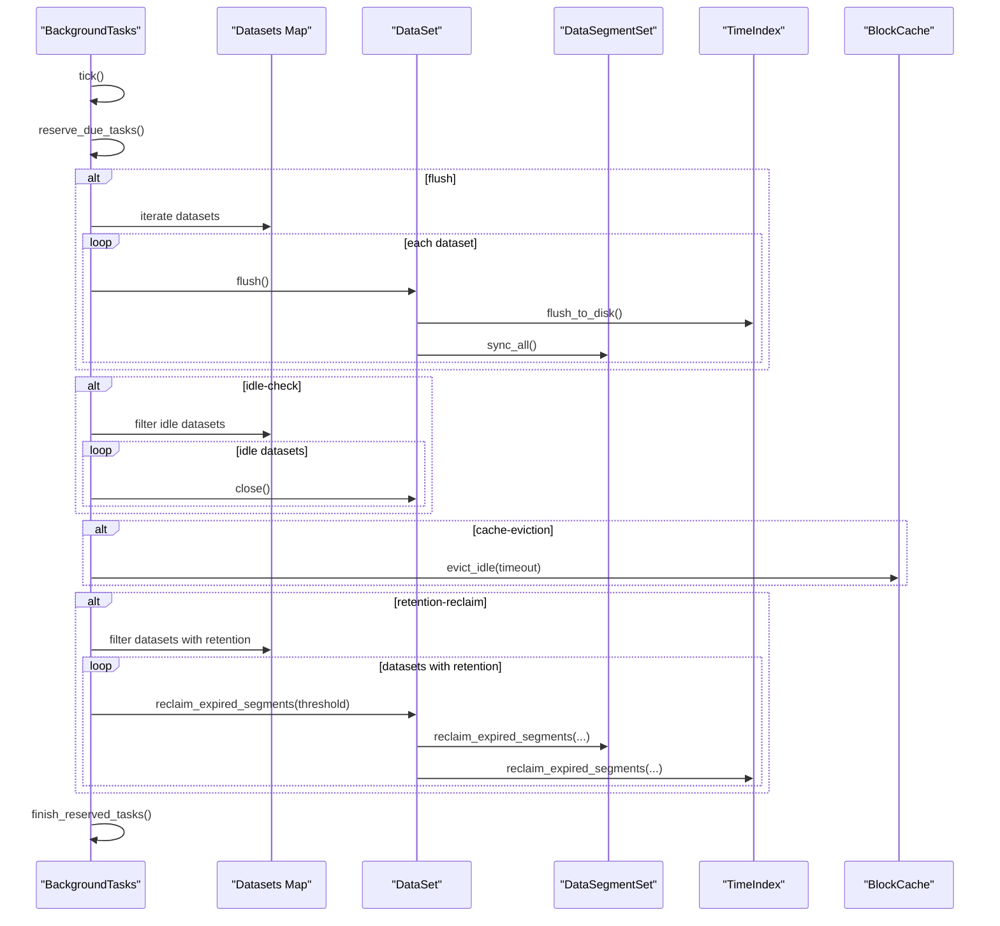
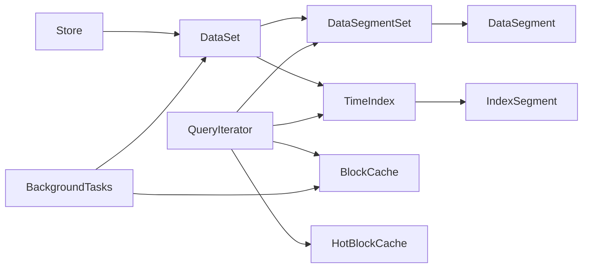

# Data Flow Patterns

<cite>
**Referenced Files in This Document**
- [lib.rs](file://src/lib.rs)
- [store.rs](file://src/store.rs)
- [dataset.rs](file://src/dataset.rs)
- [segment/mod.rs](file://src/segment/mod.rs)
- [segment/data.rs](file://src/segment/data.rs)
- [index/mod.rs](file://src/index/mod.rs)
- [index/segment.rs](file://src/index/segment.rs)
- [query/iter.rs](file://src/query/iter.rs)
- [bg/mod.rs](file://src/bg/mod.rs)
- [cache.rs](file://src/cache.rs)
- [block.rs](file://src/block.rs)
- [header.rs](file://src/header.rs)
- [compress.rs](file://src/compress.rs)
</cite>

## Table of Contents
1. [Introduction](#introduction)
2. [Project Structure](#project-structure)
3. [Core Components](#core-components)
4. [Architecture Overview](#architecture-overview)
5. [Detailed Component Analysis](#detailed-component-analysis)
6. [Dependency Analysis](#dependency-analysis)
7. [Performance Considerations](#performance-considerations)
8. [Troubleshooting Guide](#troubleshooting-guide)
9. [Conclusion](#conclusion)

## Introduction
This document explains TimSLite's data flow patterns across the write path, read path, and background maintenance. It covers how client operations propagate through the Store facade into the DataSet, how DataSegment and IndexSegment manage memory-mapped files, how query iterators traverse indexes and blocks, and how background tasks maintain flush cycles, idle closures, cache eviction, and retention. It also documents data transformation stages, buffer management, and memory mapping operations, and provides sequence diagrams for typical operations.

## Project Structure
TimSLite organizes storage into modular components:
- Store: top-level facade managing datasets, background tasks, and journaling
- DataSet: dataset lifecycle and operations (write, append, delete, query)
- DataSegmentSet/DataSegment: block-level aggregation, compression, and mmap lifecycle
- TimeIndex/IndexSegment: time-ordered index with continuous/sparse modes
- QueryIterator: lazy traversal of index sources and block reads
- BackgroundTasks: periodic maintenance (flush, idle-close, cache eviction, retention)
- Cache: global and hot-block caches for performance
- Header/Compression utilities: file format metadata and compression wrappers

**Diagram sources**
- [store.rs:46-56](file://src/store.rs#L46-L56)
- [dataset.rs:71-82](file://src/dataset.rs#L71-L82)
- [segment/mod.rs:43-53](file://src/segment/mod.rs#L43-L53)
- [index/mod.rs:20-31](file://src/index/mod.rs#L20-L31)
- [query/iter.rs:120-126](file://src/query/iter.rs#L120-L126)

**Section sources**
- [lib.rs:38-72](file://src/lib.rs#L38-L72)
- [store.rs:46-161](file://src/store.rs#L46-L161)
- [dataset.rs:71-218](file://src/dataset.rs#L71-L218)

## Core Components
- Store: Manages datasets, handles client operations (create/open/close/drop), journaling, and background tasks. Provides write/append/delete APIs that delegate to DataSet and apply journal/global cache hooks.
- DataSet: Implements write/append/delete semantics, timestamp dispatch, correction/out-of-order writes, and query preparation. Coordinates DataSegmentSet and TimeIndex.
- DataSegmentSet/DataSegment: Aggregates records into blocks, seals/compresses blocks, manages lazy open/idle-close, and performs block-level operations (overwrite, append, single-record).
- TimeIndex/IndexSegment: Maintains time-ordered index entries, supports continuous/sparse modes, and provides efficient range queries and index sources for queries.
- QueryIterator: Lazily traverses index sources (in-memory and segment files), resolves entries to block-level records, and integrates with caches.
- BackgroundTasks: Periodic maintenance including flush, idle-close, cache eviction, and retention reclaim.
- Cache/HotBlockCache: Global block cache and per-query hot cache for reduced decompression and IO.

**Section sources**
- [store.rs:400-472](file://src/store.rs#L400-L472)
- [dataset.rs:226-316](file://src/dataset.rs#L226-L316)
- [segment/mod.rs:43-53](file://src/segment/mod.rs#L43-L53)
- [segment/data.rs:39-67](file://src/segment/data.rs#L39-L67)
- [index/mod.rs:20-31](file://src/index/mod.rs#L20-L31)
- [index/segment.rs:72-93](file://src/index/segment.rs#L72-L93)
- [query/iter.rs:120-126](file://src/query/iter.rs#L120-L126)
- [bg/mod.rs:44-54](file://src/bg/mod.rs#L44-L54)
- [cache.rs:43-49](file://src/cache.rs#L43-L49)

## Architecture Overview
TimSLite uses a layered architecture:
- Client-facing Store delegates to DataSet for operations
- DataSet orchestrates DataSegmentSet (data) and TimeIndex (index)
- Both DataSegment and IndexSegment use memory-mapped files for efficient IO
- QueryIterator bridges index traversal with block-level reads and caching
- BackgroundTasks run periodically to maintain system health

**Diagram sources**
- [store.rs:400-431](file://src/store.rs#L400-L431)
- [dataset.rs:257-316](file://src/dataset.rs#L257-L316)
- [segment/mod.rs:180-272](file://src/segment/mod.rs#L180-L272)
- [segment/data.rs:352-407](file://src/segment/data.rs#L352-L407)
- [index/mod.rs:67-82](file://src/index/mod.rs#L67-L82)

## Detailed Component Analysis

### Write Path: Client to Storage
The write path transforms client data into blocks, updates the index, and persists state via memory-mapped files.

**Diagram sources**
- [store.rs:400-431](file://src/store.rs#L400-L431)
- [dataset.rs:257-316](file://src/dataset.rs#L257-L316)
- [segment/mod.rs:180-272](file://src/segment/mod.rs#L180-L272)
- [segment/data.rs:352-407](file://src/segment/data.rs#L352-L407)
- [index/mod.rs:67-82](file://src/index/mod.rs#L67-L82)

Key transformations and buffers:
- Record aggregation into blocks with a fixed maximum payload size
- Pending raw blocks for in-progress aggregation; sealed and optionally compressed when full
- Index buffering with automatic flush when threshold is reached
- Header state updates (min/max timestamps, wrote positions, pending state) persisted via mmap

**Section sources**
- [dataset.rs:226-316](file://src/dataset.rs#L226-L316)
- [segment/data.rs:352-594](file://src/segment/data.rs#L352-L594)
- [index/mod.rs:67-82](file://src/index/mod.rs#L67-L82)
- [header.rs:160-213](file://src/header.rs#L160-L213)

### Read Path: Query Iterators and Index Traversal
The read path builds lazy sources from the index and resolves entries to block-level records, integrating caches for performance.

**Diagram sources**
- [dataset.rs:631-647](file://src/dataset.rs#L631-L647)
- [index/mod.rs:651-709](file://src/index/mod.rs#L651-L709)
- [query/iter.rs:158-191](file://src/query/iter.rs#L158-L191)
- [segment/mod.rs:470-485](file://src/segment/mod.rs#L470-L485)
- [segment/data.rs:734-800](file://src/segment/data.rs#L734-L800)
- [cache.rs:288-353](file://src/cache.rs#L288-L353)

Index traversal specifics:
- Continuous mode uses O(1) direct lookup; non-continuous uses binary search
- QueryIterator skips filler entries and merges in-memory and segment sources
- HotBlockCache avoids repeated decompression for sequential reads from the same block

**Section sources**
- [index/segment.rs:240-330](file://src/index/segment.rs#L240-L330)
- [query/iter.rs:14-30](file://src/query/iter.rs#L14-L30)
- [cache.rs:288-353](file://src/cache.rs#L288-L353)

### Background Processing Flow
BackgroundTasks coordinates periodic maintenance across all datasets and caches.

**Diagram sources**
- [bg/mod.rs:194-318](file://src/bg/mod.rs#L194-L318)
- [bg/mod.rs:320-439](file://src/bg/mod.rs#L320-L439)
- [dataset.rs:694-707](file://src/dataset.rs#L694-L707)
- [segment/mod.rs:528-543](file://src/segment/mod.rs#L528-L543)
- [index/mod.rs:739-771](file://src/index/mod.rs#L739-L771)

**Section sources**
- [bg/mod.rs:221-284](file://src/bg/mod.rs#L221-L284)
- [bg/mod.rs:320-439](file://src/bg/mod.rs#L320-L439)

### Data Transformation Stages
- Block aggregation: Records are packed into blocks with a fixed header and payload; pending raw blocks are sealed and optionally compressed when full
- Compression: Deflate compression is applied to block payloads; compression is only used when beneficial
- Indexing: Timestamp-to-offset mapping is buffered and flushed to index segments; continuous mode materializes filler entries sparsely
- Query extraction: Index entries resolve to block offsets; blocks are decompressed and records extracted by in-block offset

**Section sources**
- [block.rs:27-80](file://src/block.rs#L27-L80)
- [compress.rs:8-23](file://src/compress.rs#L8-L23)
- [index/segment.rs:24-64](file://src/index/segment.rs#L24-L64)
- [segment/data.rs:500-534](file://src/segment/data.rs#L500-L534)

### Buffer Management and Memory Mapping
- DataSegment and IndexSegment use memory-mapped files for zero-copy IO; lifecycle includes lazy open, idle close, and expansion
- DataFileMetadata and IndexFileMetadata encapsulate immutable meta and mutable state; state updates are flushed to disk
- DataSegment maintains pending block state in header state; pending is cleared upon sealing or expansion
- IndexSegment supports expansion and sealing; wrote_position is tracked for efficient range queries

**Section sources**
- [segment/data.rs:131-174](file://src/segment/data.rs#L131-L174)
- [index/segment.rs:144-173](file://src/index/segment.rs#L144-L173)
- [header.rs:215-247](file://src/header.rs#L215-L247)
- [header.rs:459-483](file://src/header.rs#L459-L483)

### Transaction Semantics and Consistency
- Write outcomes are atomic per operation: either the record is appended and the index updated, or an error is returned
- Correction writes modify only the last pending raw block in place; out-of-order writes update existing index entries and increment invalid record counts on old segments
- Deletion marks index entries as sentinels and increments invalid record counts; queries skip filler entries
- Background flush ensures index buffer and segment state are synchronized to disk
- Continuous index mode enforces ordering invariants and sparse filler materialization to maintain correctness

**Section sources**
- [dataset.rs:441-476](file://src/dataset.rs#L441-L476)
- [dataset.rs:525-572](file://src/dataset.rs#L525-L572)
- [index/mod.rs:341-410](file://src/index/mod.rs#L341-L410)
- [index/mod.rs:412-457](file://src/index/mod.rs#L412-L457)

## Dependency Analysis
The following diagram shows key dependencies among major components:

**Diagram sources**
- [store.rs:46-56](file://src/store.rs#L46-L56)
- [dataset.rs:71-82](file://src/dataset.rs#L71-L82)
- [segment/mod.rs:43-53](file://src/segment/mod.rs#L43-L53)
- [index/mod.rs:20-31](file://src/index/mod.rs#L20-L31)
- [query/iter.rs:120-126](file://src/query/iter.rs#L120-L126)
- [bg/mod.rs:44-54](file://src/bg/mod.rs#L44-L54)

**Section sources**
- [lib.rs:39-72](file://src/lib.rs#L39-L72)

## Performance Considerations
- Block-level aggregation reduces IO overhead; compression is applied only when beneficial
- Memory-mapped files eliminate user/kernel copies for reads/writes
- HotBlockCache minimizes decompression for sequential reads from the same block
- Background flush intervals balance durability and throughput
- Cache eviction targets idle entries to reclaim memory under pressure
- Continuous index mode enables O(1) lookups for dense timestamp distributions

[No sources needed since this section provides general guidance]

## Troubleshooting Guide
Common operational issues and diagnostics:
- Segment full errors during append indicate insufficient space; the system expands or seals and creates a new segment
- Pending block restoration failures suggest corruption or mismatched header state; reopening may recover pending state
- Index segment full indicates insufficient capacity; expansion occurs automatically when possible
- Retention reclaim failures on empty or corrupted segments are logged and skipped
- Cache misses and LRU evictions can be monitored via cache statistics

**Section sources**
- [segment/data.rs:284-313](file://src/segment/data.rs#L284-L313)
- [segment/data.rs:409-453](file://src/segment/data.rs#L409-L453)
- [index/segment.rs:204-229](file://src/index/segment.rs#L204-L229)
- [bg/mod.rs:387-439](file://src/bg/mod.rs#L387-L439)
- [cache.rs:182-190](file://src/cache.rs#L182-L190)

## Conclusion
TimSLite’s data flow combines block-level aggregation, memory-mapped storage, and efficient indexing to deliver high-throughput time-series storage. The write path ensures atomicity and consistency through careful index updates and invalid record accounting. The read path leverages lazy sources and caching for optimal performance. Background tasks maintain system health by flushing, closing idle resources, evicting stale cache entries, and reclaiming expired data. Together, these mechanisms provide a robust foundation for continuous ingestion and efficient querying.