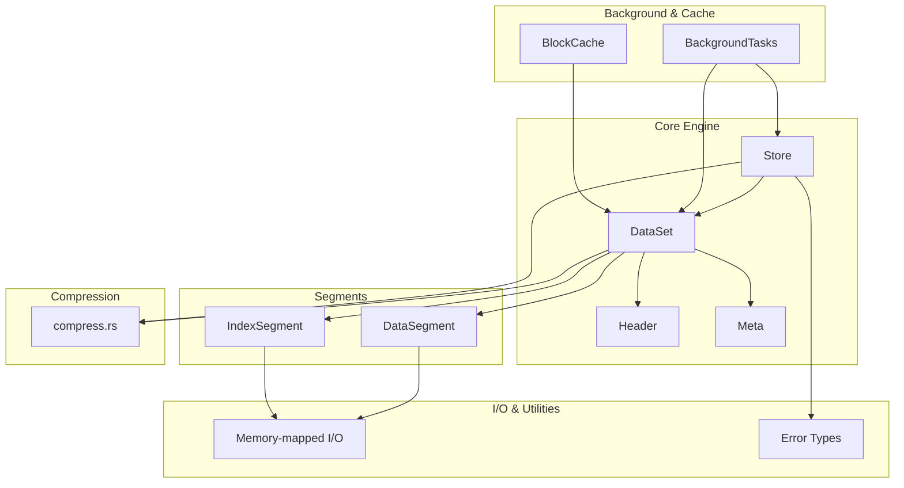
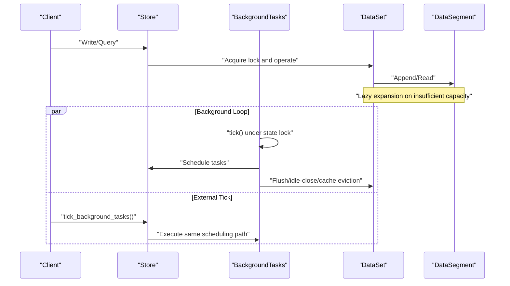
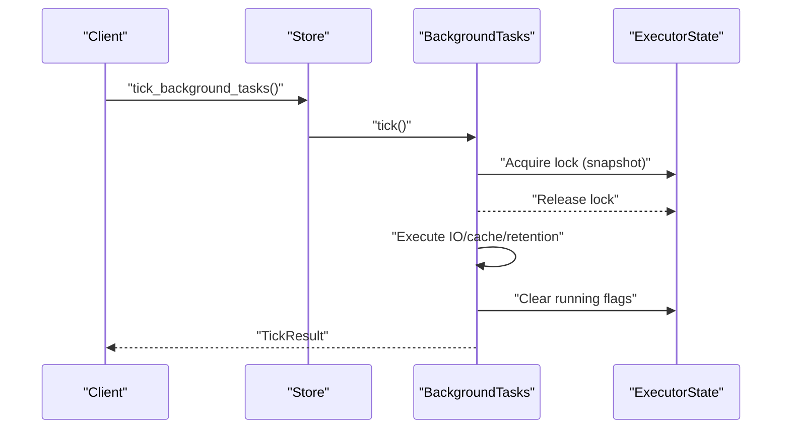
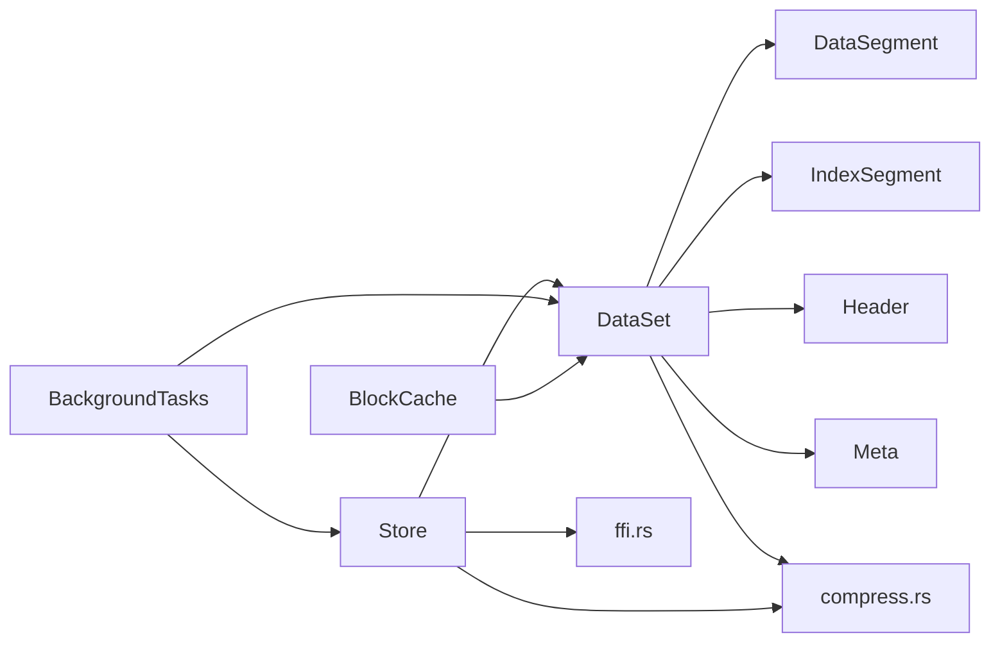

# Design Patterns

<cite>
**Referenced Files in This Document**
- [lib.rs](file://src/lib.rs)
- [segment/mod.rs](file://src/segment/mod.rs)
- [segment/data.rs](file://src/segment/data.rs)
- [bg/mod.rs](file://src/bg/mod.rs)
- [compress.rs](file://src/compress.rs)
- [config.rs](file://src/config.rs)
- [store.rs](file://src/store.rs)
- [ffi.rs](file://src/ffi.rs)
- [background-and-cache.md](file://docs/design/background-and-cache.md)
- [compression.md](file://docs/design/compression.md)
- [lazy-allocation.md](file://docs/plan/phase-12-lazy-allocation.md)
- [phase-12-lazy-allocation.md](file://docs/plan/phase-12-lazy-allocation.md)
- [lazy_allocation_test.rs](file://tests/lazy_allocation_test.rs)
- [background_test.rs](file://tests/background_test.rs)
- [store-and-ffi.md](file://docs/design/store-and-ffi.md)
</cite>

## Table of Contents
1. [Introduction](#introduction)
2. [Project Structure](#project-structure)
3. [Core Components](#core-components)
4. [Architecture Overview](#architecture-overview)
5. [Detailed Component Analysis](#detailed-component-analysis)
6. [Dependency Analysis](#dependency-analysis)
7. [Performance Considerations](#performance-considerations)
8. [Troubleshooting Guide](#troubleshooting-guide)
9. [Conclusion](#conclusion)
10. [Appendices](#appendices)

## Introduction
This document explains the design patterns implemented across TimSLite’s architecture. It focuses on:
- Factory pattern for segment creation
- Observer-like coordination via background task scheduling
- Strategy pattern for compression algorithms
- Lazy initialization for resource efficiency
- RAII for safe resource management
- Builder pattern for flexible configuration
- Module-based organization for separation of concerns

Where applicable, we provide code example paths and explain the benefits of each pattern in the context of TimSLite’s storage engine.

## Project Structure
TimSLite is organized into cohesive modules that separate concerns:
- Storage engine core: store, dataset, header, meta
- Segment management: data segments and index segments
- Background tasks and caching: background executor and block cache
- Compression utilities
- Query iterators and hot blocks
- Journaling and queue support
- FFI bindings and configuration builders

**Section sources**
- [lib.rs](file://src/lib.rs)

## Core Components
- Store: top-level handle managing datasets, background tasks, and configuration.
- DataSet: per-dataset writer/query interface with internal locking and segment management.
- DataSegment/IndexSegment: file-backed segments with memory-mapped I/O and lifecycle controls.
- BackgroundTasks: scheduler for periodic maintenance (flush, idle-close, cache eviction, retention).
- BlockCache: global LRU cache for decompressed blocks.
- Compression utilities: strategy-like helpers for deflate/inflate and compression decisions.

**Section sources**
- [store.rs](file://src/store.rs)
- [segment/mod.rs](file://src/segment/mod.rs)
- [segment/data.rs](file://src/segment/data.rs)
- [bg/mod.rs](file://src/bg/mod.rs)
- [compress.rs](file://src/compress.rs)

## Architecture Overview
The system coordinates background maintenance through a shared executor state, while foreground operations drive segment writes and queries. Segments are lazily expanded as needed, and compression is applied according to configurable strategies.

**Diagram sources**
- [bg/mod.rs](file://src/bg/mod.rs)
- [background-and-cache.md](file://docs/design/background-and-cache.md)
- [store.rs](file://src/store.rs)
- [segment/mod.rs](file://src/segment/mod.rs)

## Detailed Component Analysis

### Factory Pattern: Segment Creation
TimSLite uses a factory-like approach to construct segments with controlled initialization and sizing. The DataSegment factory ensures:
- Proper header initialization
- Safe file truncation and memory mapping
- Validation of initial sizes against header requirements

Key implementation points:
- Creation path initializes metadata and writes header to mapped memory.
- Opening path reconstructs segment state from disk metadata.
- Expansion path grows segments safely with remapping.

Benefits:
- Encapsulates complex file and memory-mapping setup.
- Enforces invariants (e.g., initial size ≥ header size).
- Supports lazy growth to reduce upfront disk usage.

Example paths:
- [DataSegment::create:76-99](file://src/segment/data.rs#L76-L99)
- [DataSegment::open](file://src/segment/data.rs)
- [DataSegment::expand](file://src/segment/data.rs)

**Section sources**
- [segment/data.rs](file://src/segment/data.rs)
- [segment/mod.rs](file://src/segment/mod.rs)

### Observer Pattern: Background Task Coordination
TimSLite coordinates background maintenance using a shared executor state and a unified tick path. The design ensures:
- A single scheduling path is used by both the background thread and external ticks.
- State lock protects scheduling state; long-running IO occurs outside the state lock.
- Consistent ordering prevents deadlocks and avoids duplicate task execution.

Key implementation points:
- ExecutorState holds last timestamps and next deadlines.
- BackgroundTasks::tick computes due tasks and executes them after releasing the state lock.
- Store::tick_background_tasks delegates to the same scheduling path.

Example paths:
- [ExecutorState and shared state](file://src/bg/mod.rs)
- [BackgroundTasks::tick](file://src/bg/mod.rs)
- [Store::tick_background_tasks](file://src/store.rs)
- [FFI tick functions:368-393](file://src/ffi.rs#L368-L393)

**Diagram sources**
- [bg/mod.rs](file://src/bg/mod.rs)
- [background-and-cache.md](file://docs/design/background-and-cache.md)
- [ffi.rs:368-393](file://src/ffi.rs#L368-L393)

**Section sources**
- [bg/mod.rs](file://src/bg/mod.rs)
- [background-and-cache.md](file://docs/design/background-and-cache.md)
- [store.rs](file://src/store.rs)
- [ffi.rs:368-393](file://src/ffi.rs#L368-L393)

### Strategy Pattern: Compression Algorithms
TimSLite applies a strategy-like approach for compression:
- Compression utilities expose a simple API for deflate/inflate and compression effectiveness checks.
- The system decides when to compress based on block state and thresholds (pending overflow, single-record blocks).
- Compression level is configurable and influences trade-offs between speed and size.

Key implementation points:
- Deflate/inflate wrappers encapsulate miniz_oxide usage.
- Decision logic is documented in design docs (defer to SEALED+COMPRESSED invariants).
- Compression is applied during sealing transitions, not per-record.

Example paths:
- [deflate/inflate utilities:5-16](file://src/compress.rs#L5-L16)
- [compression design and flags:1-83](file://docs/design/compression.md#L1-L83)

Benefits:
- Clear separation between compression policy and segment/block logic.
- Configurable compression level enables tuning for workload characteristics.

**Section sources**
- [compress.rs](file://src/compress.rs)
- [compression.md:1-83](file://docs/design/compression.md#L1-L83)

### Lazy Initialization: Resource Efficiency
TimSLite employs lazy initialization to minimize upfront resource usage:
- Background executor state is lazily initialized when background threads are disabled.
- Segments are expanded only when writes approach capacity.
- Initial segment sizes are configurable to reduce initial disk footprint.

Example paths:
- [Lazy executor state behavior:191-210](file://docs/design/background-and-cache.md#L191-L210)
- [Segment expansion logic:487-521](file://src/segment/mod.rs#L487-L521)
- [Initial segment sizes in tests:22-26](file://tests/lazy_allocation_test.rs#L22-L26)

Benefits:
- Reduced memory and disk overhead during startup.
- On-demand growth aligns resource consumption with workload.

**Section sources**
- [background-and-cache.md:191-210](file://docs/design/background-and-cache.md#L191-L210)
- [segment/mod.rs:487-521](file://src/segment/mod.rs#L487-L521)
- [lazy_allocation_test.rs:22-26](file://tests/lazy_allocation_test.rs#L22-L26)

### RAII: Safe Resource Management
RAII ensures resources are acquired and released deterministically:
- Memory-mapped files are managed via scoped mapping lifetimes.
- idle-close operations enforce unmapping before closing to prevent leaks.
- File handles are closed in destructors or explicit cleanup paths.

Example paths:
- [DataSegment creation and mapping:90-99](file://src/segment/data.rs#L90-L99)
- [Idle-close and mmap safety:196-199](file://docs/plan/overview.md#L196-L199)

Benefits:
- Prevents resource leaks and undefined behavior.
- Simplifies error-handling by tying cleanup to scope.

**Section sources**
- [segment/data.rs:90-99](file://src/segment/data.rs#L90-L99)
- [plan.md:196-199](file://docs/plan/overview.md#L196-L199)

### Builder Pattern: Configuration Flexibility
TimSLite exposes builder-style configuration APIs:
- StoreConfig and DatasetConfig provide fluent setters for sizing, compression level, retention, and toggles.
- FFI structures mirror configuration for cross-language usage.

Example paths:
- [StoreConfig builder usage](file://src/config.rs)
- [FFI config structures:235-266](file://docs/design/store-and-ffi.md#L235-L266)

Benefits:
- Enables ergonomic, readable configuration construction.
- Reduces risk of missing defaults or inconsistent settings.

**Section sources**
- [config.rs](file://src/config.rs)
- [store-and-ffi.md:235-266](file://docs/design/store-and-ffi.md#L235-L266)

### Module-Based Organization: Separation of Concerns
Modules isolate responsibilities:
- segment/: data/index segments and their lifecycle
- bg/: background scheduling and state
- compress/: compression utilities
- query/: iterators and hot blocks
- store.rs: top-level orchestration
- ffi.rs: opaque handles and C-compatible APIs

Benefits:
- Easier testing, maintenance, and refactoring.
- Clear boundaries between I/O, scheduling, compression, and query layers.

**Section sources**
- [lib.rs](file://src/lib.rs)
- [segment/mod.rs](file://src/segment/mod.rs)
- [bg/mod.rs](file://src/bg/mod.rs)
- [compress.rs](file://src/compress.rs)
- [query/mod.rs](file://src/query/mod.rs)
- [store.rs](file://src/store.rs)
- [ffi.rs](file://src/ffi.rs)

## Dependency Analysis
The following diagram highlights key dependencies among major components:

**Diagram sources**
- [store.rs](file://src/store.rs)
- [segment/mod.rs](file://src/segment/mod.rs)
- [bg/mod.rs](file://src/bg/mod.rs)
- [compress.rs](file://src/compress.rs)
- [ffi.rs](file://src/ffi.rs)

**Section sources**
- [store.rs](file://src/store.rs)
- [segment/mod.rs](file://src/segment/mod.rs)
- [bg/mod.rs](file://src/bg/mod.rs)
- [compress.rs](file://src/compress.rs)
- [ffi.rs](file://src/ffi.rs)

## Performance Considerations
- Background scheduling separates short-lived state locks from long-running IO to avoid contention and deadlocks.
- Lazy expansion reduces initial disk usage and defers expensive operations until necessary.
- Global block cache avoids repeated decompression of sealed blocks.
- Compression decisions are conservative to avoid unnecessary IO and preserve throughput for write-heavy workloads.

[No sources needed since this section provides general guidance]

## Troubleshooting Guide
Common issues and mitigations:
- Deadlocks: Ensure background thread and external ticks share the same scheduling path guarded by the state lock.
- Resource leaks: Verify idle-close sequences unmmap before close.
- Segment full errors: Trigger expansion or adjust initial sizes; confirm expansion logic is invoked before writes.

Example paths:
- [Background tick and delay behavior](file://src/bg/mod.rs)
- [Concurrent external ticks test:642-651](file://tests/background_test.rs#L642-L651)
- [Lazy allocation integration test:17-50](file://tests/lazy_allocation_test.rs#L17-L50)

**Section sources**
- [bg/mod.rs](file://src/bg/mod.rs)
- [background_test.rs:642-651](file://tests/background_test.rs#L642-L651)
- [lazy_allocation_test.rs:17-50](file://tests/lazy_allocation_test.rs#L17-L50)

## Conclusion
TimSLite’s architecture leverages well-established design patterns to achieve robustness, efficiency, and maintainability:
- Factory pattern streamlines segment creation and lifecycle.
- Unified background scheduling provides predictable, deadlock-free maintenance.
- Strategy-like compression allows flexible, configurable compression policies.
- Lazy initialization and RAII improve resource efficiency and safety.
- Builder patterns and module-based organization simplify configuration and separation of concerns.

[No sources needed since this section summarizes without analyzing specific files]

## Appendices

### Example Paths by Pattern
- Factory: [DataSegment::create:76-99](file://src/segment/data.rs#L76-L99)
- Observer-like coordination: [BackgroundTasks::tick](file://src/bg/mod.rs), [Store::tick_background_tasks](file://src/store.rs)
- Strategy: [compress.rs:5-16](file://src/compress.rs#L5-L16), [compression.md:1-83](file://docs/design/compression.md#L1-L83)
- Lazy initialization: [background-and-cache.md:191-210](file://docs/design/background-and-cache.md#L191-L210)
- RAII: [segment/data.rs:90-99](file://src/segment/data.rs#L90-L99)
- Builder: [config.rs](file://src/config.rs), [store-and-ffi.md:235-266](file://docs/design/store-and-ffi.md#L235-L266)

[No sources needed since this section lists previously cited paths]