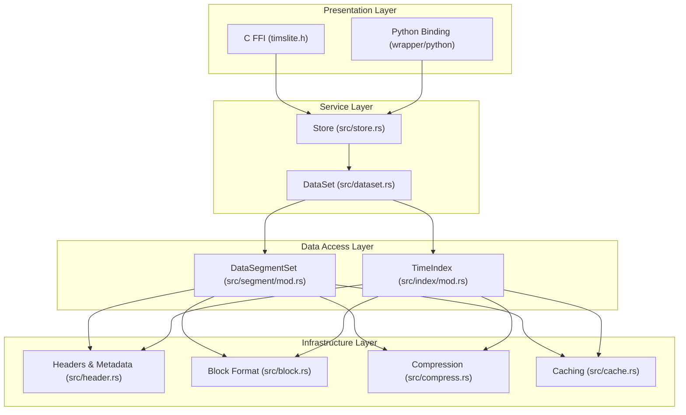
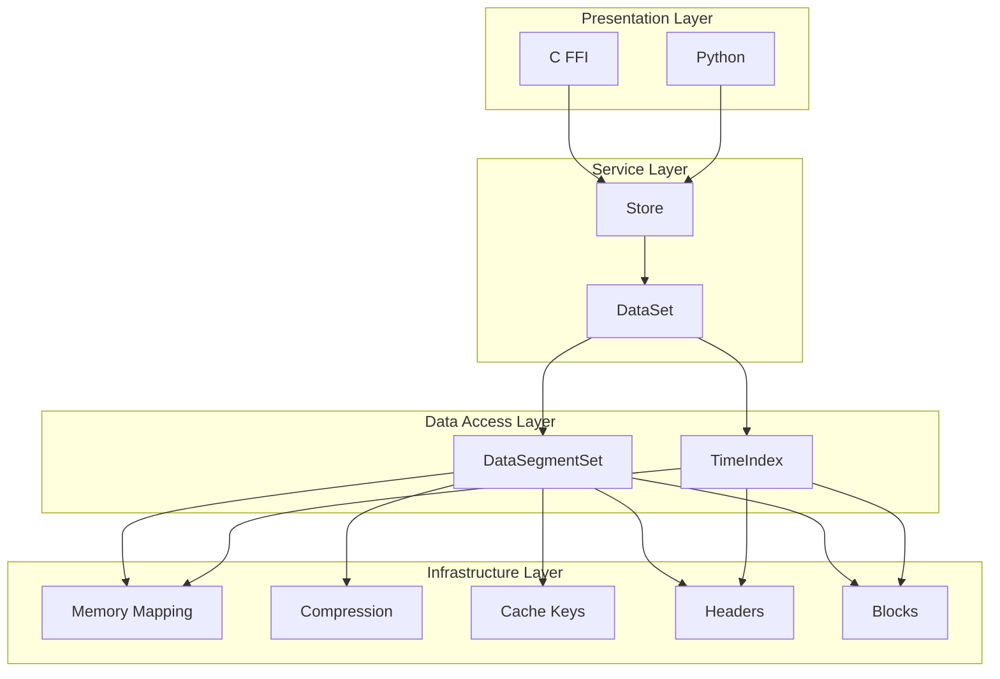
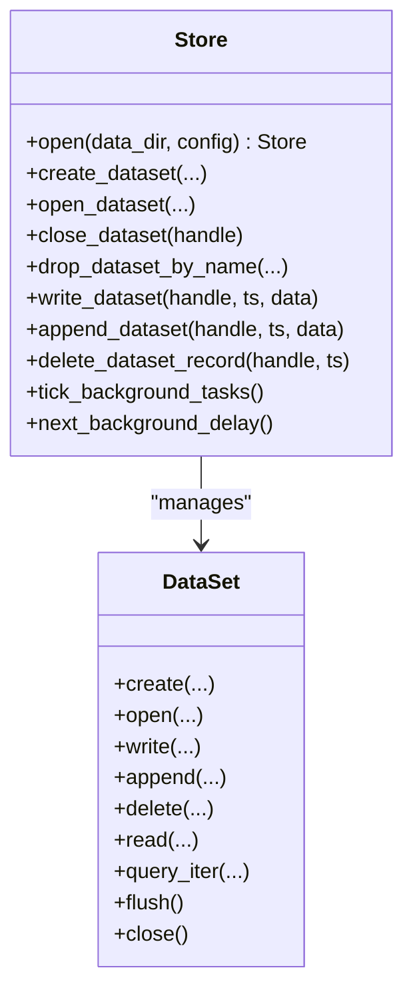
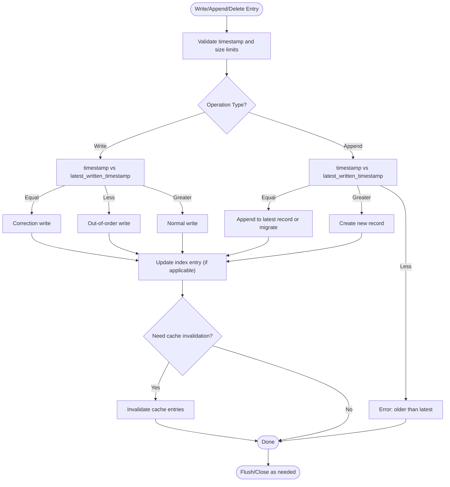
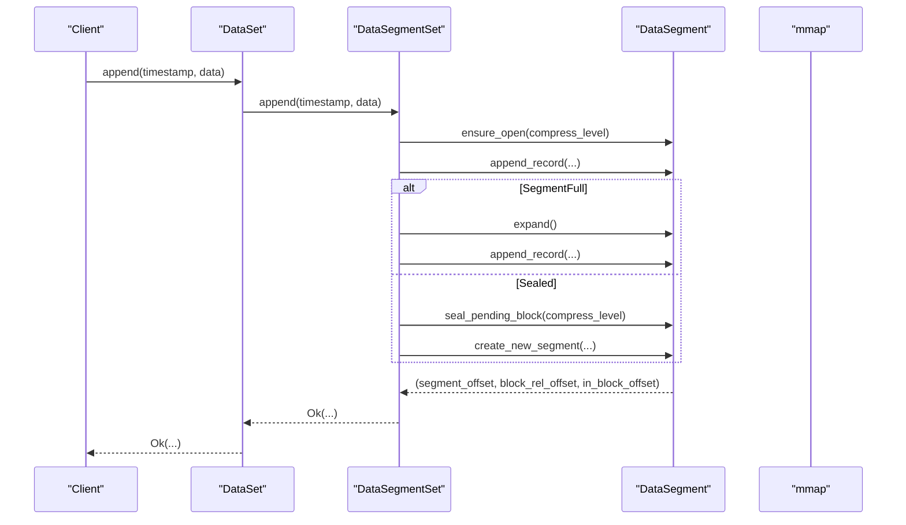
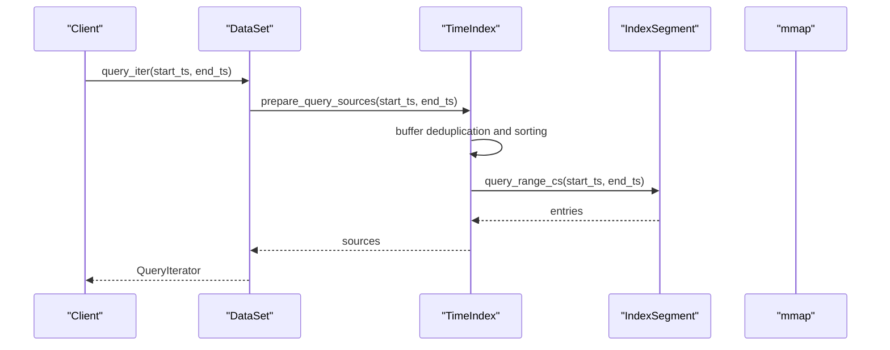
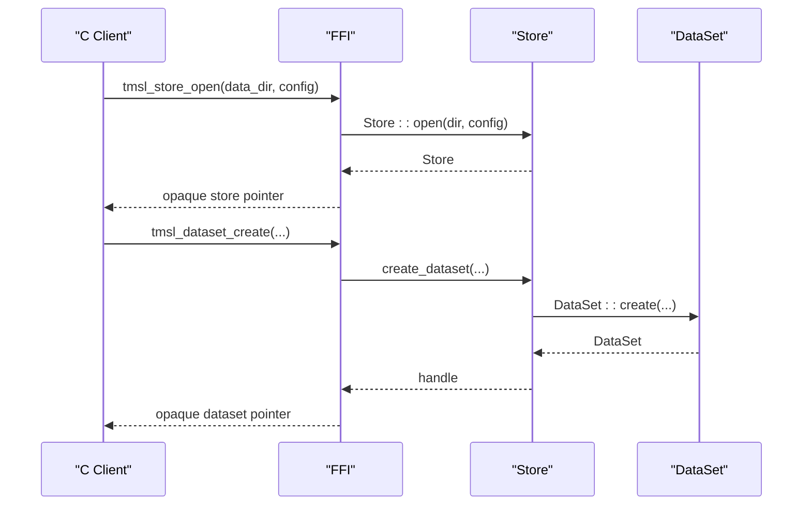
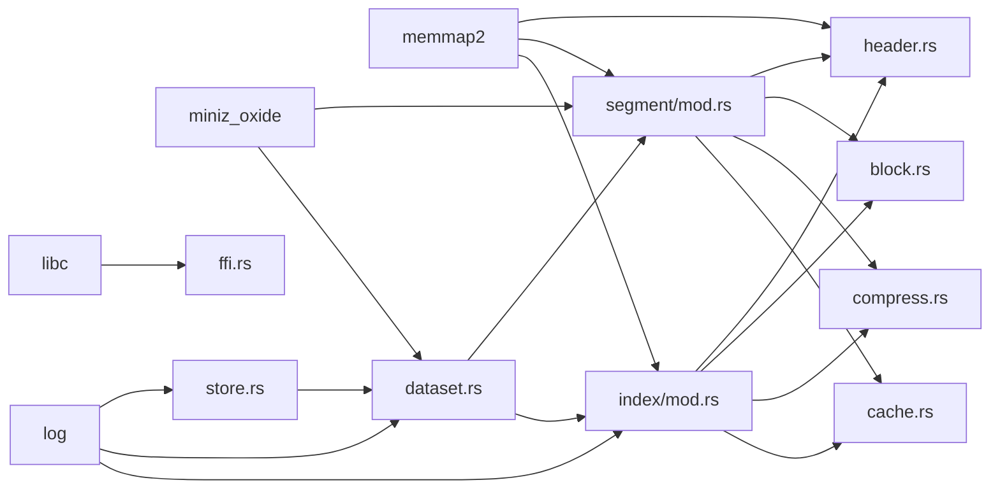

# System Architecture

<cite>
**Referenced Files in This Document**
- [lib.rs](file://src/lib.rs)
- [store.rs](file://src/store.rs)
- [dataset.rs](file://src/dataset.rs)
- [ffi.rs](file://src/ffi.rs)
- [segment/mod.rs](file://src/segment/mod.rs)
- [index/mod.rs](file://src/index/mod.rs)
- [compress.rs](file://src/compress.rs)
- [cache.rs](file://src/cache.rs)
- [header.rs](file://src/header.rs)
- [block.rs](file://src/block.rs)
- [timslite.h](file://include/timslite.h)
- [Cargo.toml](file://Cargo.toml)
- [python/src/lib.rs](file://wrapper/python/src/lib.rs)
- [python/src/store.rs](file://wrapper/python/src/store.rs)
</cite>

## Table of Contents
1. [Introduction](#introduction)
2. [Project Structure](#project-structure)
3. [Core Components](#core-components)
4. [Architecture Overview](#architecture-overview)
5. [Detailed Component Analysis](#detailed-component-analysis)
6. [Dependency Analysis](#dependency-analysis)
7. [Performance Considerations](#performance-considerations)
8. [Troubleshooting Guide](#troubleshooting-guide)
9. [Conclusion](#conclusion)

## Introduction
TimSLite is a high-performance, mmap-backed time-series data storage library designed for efficient ingestion, indexing, and querying of timestamped records. It provides:
- Block-level aggregation with delayed compression
- Lazy segment lifecycle management
- Continuous and non-continuous indexing modes
- Cross-language compatibility via a C ABI FFI and a Python binding
- Background task orchestration for flushing, idle-close, cache eviction, and retention

The system is organized into a layered architecture:
- Presentation Layer: FFI/C and Python bindings
- Service Layer: Store and DataSet abstractions
- Data Access Layer: Segments and Index management
- Infrastructure Layer: Memory-mapped files, compression, and caching

## Project Structure
The repository is organized into Rust crates and language bindings:
- Core library under src/ exposes public APIs and internal modules
- FFI under include/ defines the C ABI contract
- Python binding under wrapper/python/ provides a thin PyO3 wrapper

**Diagram sources**
- [lib.rs:39-72](file://src/lib.rs#L39-L72)
- [store.rs:46-56](file://src/store.rs#L46-L56)
- [dataset.rs:71-82](file://src/dataset.rs#L71-L82)
- [segment/mod.rs:43-53](file://src/segment/mod.rs#L43-L53)
- [index/mod.rs:20-31](file://src/index/mod.rs#L20-L31)
- [header.rs:17-28](file://src/header.rs#L17-L28)
- [block.rs:10-16](file://src/block.rs#L10-L16)
- [compress.rs:5-16](file://src/compress.rs#L5-L16)
- [cache.rs:43-49](file://src/cache.rs#L43-L49)
- [timslite.h:21-49](file://include/timslite.h#L21-L49)

**Section sources**
- [lib.rs:39-72](file://src/lib.rs#L39-L72)
- [Cargo.toml:6-8](file://Cargo.toml#L6-L8)

## Core Components
- Store: Top-level facade managing datasets, background tasks, block cache, and journal. It enforces lifecycle rules and coordinates cross-language operations.
- DataSet: Aggregates DataSegmentSet and TimeIndex for a (name, type) pair. Implements write, append, delete, read, and query operations with correction/out-of-order semantics.
- DataSegmentSet: Manages multiple data segment files with lazy open/idle-close, append, and cross-segment reads. Integrates compression and cache key derivation.
- TimeIndex: Manages index segments with in-memory buffering and time-range queries. Supports continuous mode with filler entries and pure-filler segment removal.
- FFI: Exposes C ABI functions for store and dataset operations, with opaque handles and error handling helpers.
- Python Binding: Thin PyO3 wrapper exposing Store, Dataset, and related classes to Python.

**Section sources**
- [store.rs:46-56](file://src/store.rs#L46-L56)
- [dataset.rs:71-82](file://src/dataset.rs#L71-L82)
- [segment/mod.rs:43-53](file://src/segment/mod.rs#L43-L53)
- [index/mod.rs:20-31](file://src/index/mod.rs#L20-L31)
- [ffi.rs:104-178](file://src/ffi.rs#L104-L178)
- [python/src/lib.rs:14-28](file://wrapper/python/src/lib.rs#L14-L28)

## Architecture Overview
The architecture follows a layered design with clear separation of concerns:
- Presentation Layer: Provides FFI and Python APIs for external consumption
- Service Layer: Encapsulates business logic and lifecycle management
- Data Access Layer: Implements file-backed storage with memory mapping and indexing
- Infrastructure Layer: Supplies compression, caching, and file format primitives

**Diagram sources**
- [store.rs:46-56](file://src/store.rs#L46-L56)
- [dataset.rs:71-82](file://src/dataset.rs#L71-L82)
- [segment/mod.rs:43-53](file://src/segment/mod.rs#L43-L53)
- [index/mod.rs:20-31](file://src/index/mod.rs#L20-L31)
- [header.rs:17-28](file://src/header.rs#L17-L28)
- [block.rs:10-16](file://src/block.rs#L10-L16)
- [compress.rs:5-16](file://src/compress.rs#L5-L16)
- [cache.rs:9-21](file://src/cache.rs#L9-L21)

## Detailed Component Analysis

### Store: Facade and Orchestration
Responsibilities:
- Manage datasets and background tasks
- Validate dataset names/types and enforce lifecycle rules
- Coordinate writes, appends, deletes, and journaling
- Provide synchronous background task ticking and delay inspection

Key interactions:
- Creates and opens datasets, maintains handle-to-key mapping
- Delegates write/appends/deletes to DataSet with journal hooks
- Controls background tasks via BackgroundTasks

**Diagram sources**
- [store.rs:46-161](file://src/store.rs#L46-L161)
- [dataset.rs:84-218](file://src/dataset.rs#L84-L218)

**Section sources**
- [store.rs:46-161](file://src/store.rs#L46-L161)
- [store.rs:383-397](file://src/store.rs#L383-L397)

### DataSet: Time-Series Operations
Responsibilities:
- Implement write/append/delete semantics with correction/out-of-order handling
- Manage DataSegmentSet and TimeIndex lifecycles
- Support single-record reads and range queries with lazy sources
- Enforce retention and invalid record accounting

Processing logic highlights:
- Correction write: overwrite last pending raw block if possible; otherwise fallback to out-of-order write
- Out-of-order write: append to latest segment and update index entry in place
- Append: extend the latest record or migrate to a new block depending on thresholds
- Continuous mode: materialize filler entries for gaps and maintain base timestamp alignment

**Diagram sources**
- [dataset.rs:241-316](file://src/dataset.rs#L241-L316)
- [dataset.rs:332-429](file://src/dataset.rs#L332-L429)
- [dataset.rs:525-572](file://src/dataset.rs#L525-L572)

**Section sources**
- [dataset.rs:241-316](file://src/dataset.rs#L241-L316)
- [dataset.rs:332-429](file://src/dataset.rs#L332-L429)
- [dataset.rs:525-572](file://src/dataset.rs#L525-L572)

### DataSegmentSet: Segment Management and Memory Mapping
Responsibilities:
- Manage data segment files with lazy open/idle-close
- Append records with block-level aggregation and compression decisions
- Provide cross-segment reads and cache key derivation
- Reclaim expired segments based on retention windows

Integration points:
- Uses memmap2 for read-only header scans and state updates
- Applies compression via miniz_oxide when beneficial
- Maintains DataFileMetadata in headers for min/max timestamps and state

**Diagram sources**
- [segment/mod.rs:180-272](file://src/segment/mod.rs#L180-L272)
- [header.rs:215-457](file://src/header.rs#L215-L457)
- [compress.rs:5-23](file://src/compress.rs#L5-L23)

**Section sources**
- [segment/mod.rs:180-272](file://src/segment/mod.rs#L180-L272)
- [header.rs:215-457](file://src/header.rs#L215-L457)
- [compress.rs:5-23](file://src/compress.rs#L5-L23)

### TimeIndex: Index Segments and Queries
Responsibilities:
- Buffer index entries in-memory and flush to disk segments
- Support continuous mode with filler entries and pure-filler segment removal
- Prepare lazy query sources for efficient iteration across segments

Key behaviors:
- Continuous mode calculates segment start and entry indices based on base timestamp and capacity
- Filler entries are skipped during flush for pure-filler segments
- Query preparation builds ordered sources with first timestamp metadata

**Diagram sources**
- [index/mod.rs:650-709](file://src/index/mod.rs#L650-L709)
- [index/mod.rs:616-648](file://src/index/mod.rs#L616-L648)

**Section sources**
- [index/mod.rs:650-709](file://src/index/mod.rs#L650-L709)
- [index/mod.rs:616-648](file://src/index/mod.rs#L616-L648)

### FFI and Python Bindings: Cross-Language Compatibility
Responsibilities:
- Provide C ABI functions for store and dataset operations
- Maintain opaque handles and registries for safe resource management
- Expose Python classes wrapping Rust Store and DataSet

Highlights:
- FFI converts between C structs and Rust config types
- Python binding mirrors Store methods and manages dataset sharing
- Both layers enforce lifecycle constraints (e.g., outstanding handles before closing)

**Diagram sources**
- [ffi.rs:296-330](file://src/ffi.rs#L296-L330)
- [ffi.rs:424-463](file://src/ffi.rs#L424-L463)
- [timslite.h:63-83](file://include/timslite.h#L63-L83)
- [timslite.h:126-145](file://include/timslite.h#L126-L145)

**Section sources**
- [ffi.rs:296-330](file://src/ffi.rs#L296-L330)
- [ffi.rs:424-463](file://src/ffi.rs#L424-L463)
- [timslite.h:63-83](file://include/timslite.h#L63-L83)
- [python/src/store.rs:107-144](file://wrapper/python/src/store.rs#L107-L144)

## Dependency Analysis
External dependencies and their roles:
- memmap2: memory-mapped files for headers and blocks
- miniz_oxide: deflate compression for blocks
- log: structured logging
- libc: FFI memory allocation helpers

Internal module dependencies:
- Store depends on DataSet, BackgroundTasks, BlockCache, JournalManager
- DataSet depends on DataSegmentSet, TimeIndex, BlockCache
- DataSegmentSet depends on DataFileMetadata, compression, cache keys
- TimeIndex depends on IndexFileMetadata, block header constants

**Diagram sources**
- [Cargo.toml:10-14](file://Cargo.toml#L10-L14)
- [store.rs:8-17](file://src/store.rs#L8-L17)
- [dataset.rs:11-21](file://src/dataset.rs#L11-L21)
- [segment/mod.rs:12-17](file://src/segment/mod.rs#L12-L17)
- [index/mod.rs:14-16](file://src/index/mod.rs#L14-L16)
- [header.rs](file://src/header.rs#L13)
- [block.rs](file://src/block.rs#L6)
- [compress.rs](file://src/compress.rs#L3)
- [cache.rs](file://src/cache.rs#L2)
- [ffi.rs:3-8](file://src/ffi.rs#L3-L8)

**Section sources**
- [Cargo.toml:10-14](file://Cargo.toml#L10-L14)
- [store.rs:8-17](file://src/store.rs#L8-L17)
- [dataset.rs:11-21](file://src/dataset.rs#L11-L21)

## Performance Considerations
- Block-level aggregation: Up to 64KB per block reduces I/O overhead and improves compression ratios.
- Delayed compression: Blocks are compressed upon sealing when beneficial, minimizing CPU during high-throughput writes.
- Lazy segment lifecycle: Segments are opened on demand and idle-closed after inactivity to conserve resources.
- In-memory index buffering: Index entries are buffered and flushed in batches to reduce disk writes.
- Continuous indexing: Reduces index fragmentation by materializing filler entries only when necessary.
- Global block cache: LRU eviction with idle timeouts balances memory usage and hit rates.
- Memory-mapped headers: Fast header reads and minimal syscalls for metadata operations.

[No sources needed since this section provides general guidance]

## Troubleshooting Guide
Common issues and diagnostics:
- Invalid dataset handle: Ensure handles are registered and not orphaned; FFI enforces outstanding child counts before closing.
- Truncated or corrupted files: Header validation checks magic/version and state lengths; truncated files raise invalid data errors.
- Compression errors: Decompression failures surface as specific error variants; verify compression levels and data integrity.
- Retention and reclaimed segments: Verify retention window and check logs for reclaimed data/index segments.

Operational tips:
- Use synchronous background ticks when background threads are disabled to drive flushes and cache eviction.
- Monitor cache statistics to tune cache_max_memory and idle timeouts.
- For Python usage, ensure datasets are closed before closing the store to release mmap handles.

**Section sources**
- [ffi.rs:332-358](file://src/ffi.rs#L332-L358)
- [header.rs:93-126](file://src/header.rs#L93-L126)
- [compress.rs:12-16](file://src/compress.rs#L12-L16)
- [cache.rs:152-173](file://src/cache.rs#L152-L173)

## Conclusion
TimSLite’s layered architecture cleanly separates presentation, service, data access, and infrastructure concerns. Its use of memory-mapped files, block-level aggregation, delayed compression, and lazy segment lifecycle enables high throughput for time-series workloads. The C ABI and Python bindings provide robust cross-language compatibility, while the service layer centralizes lifecycle management and background operations. Together, these design choices deliver a memory-efficient, scalable, and interoperable time-series storage solution.