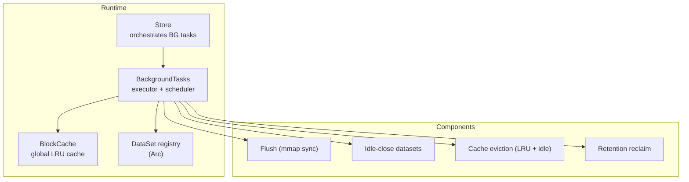
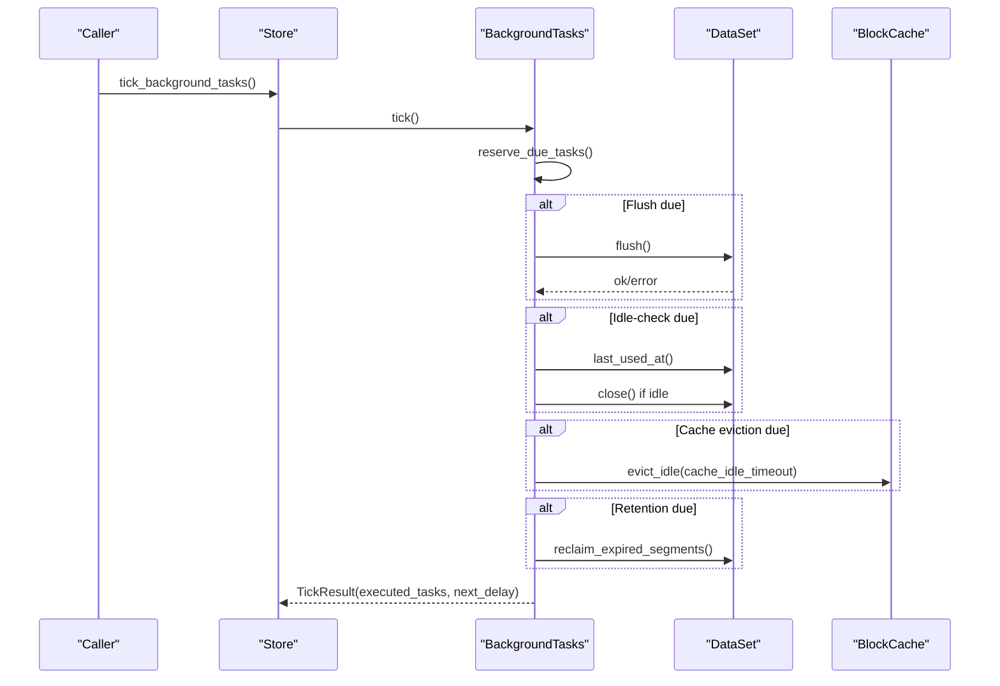
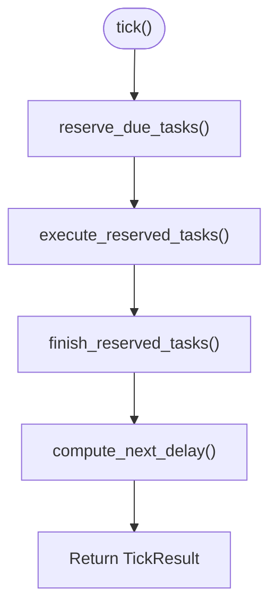
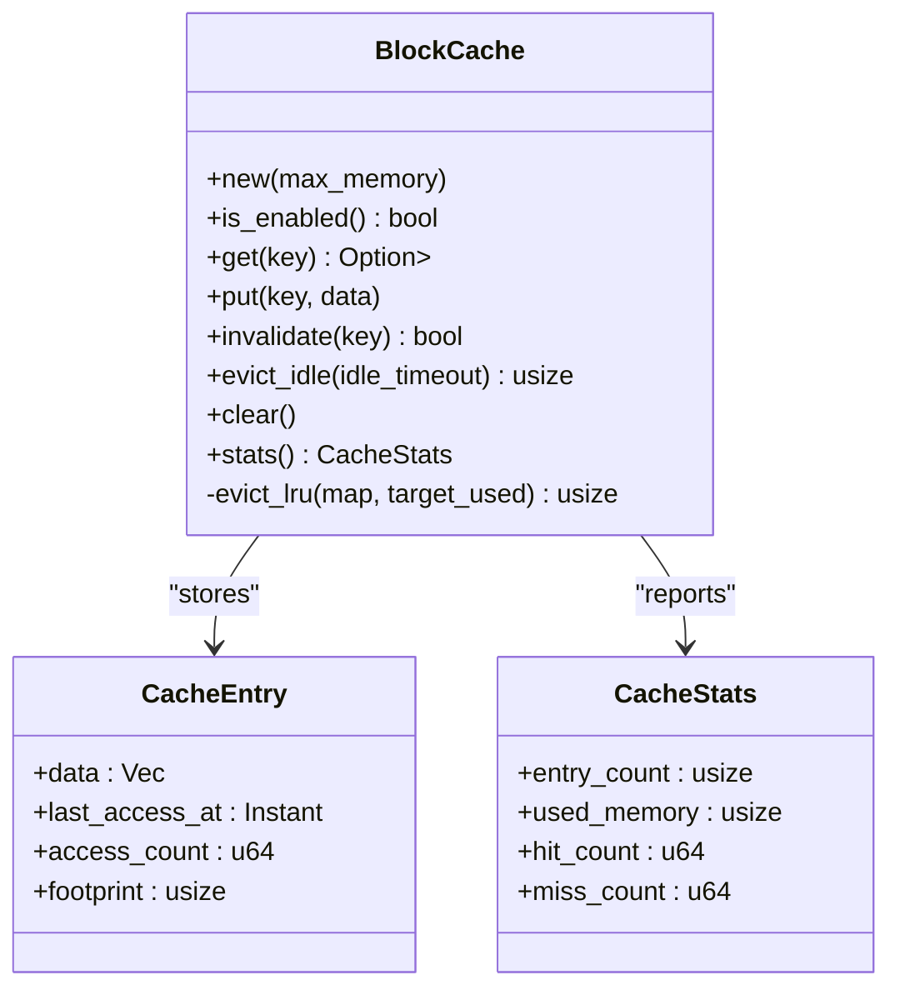
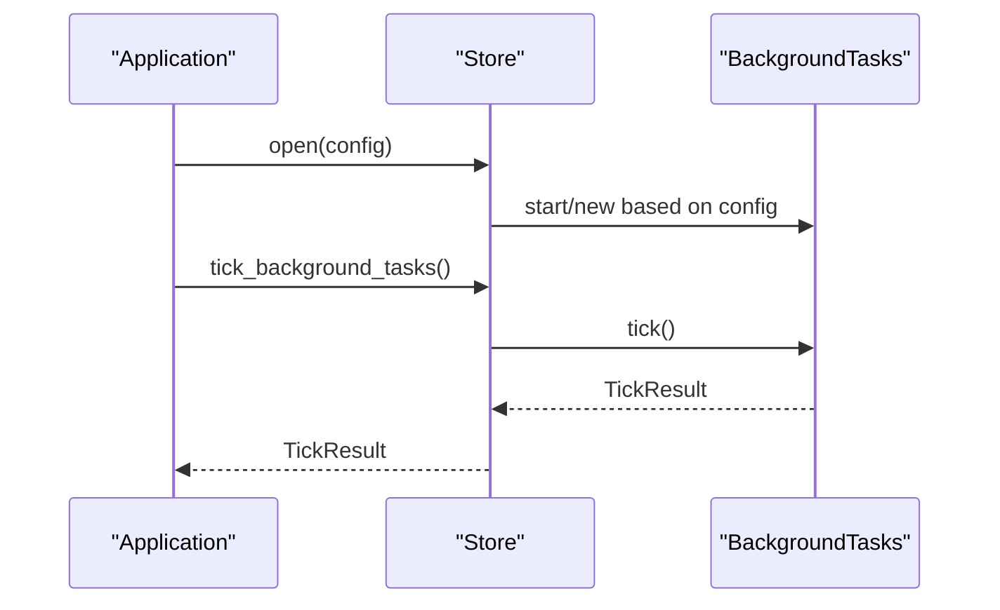
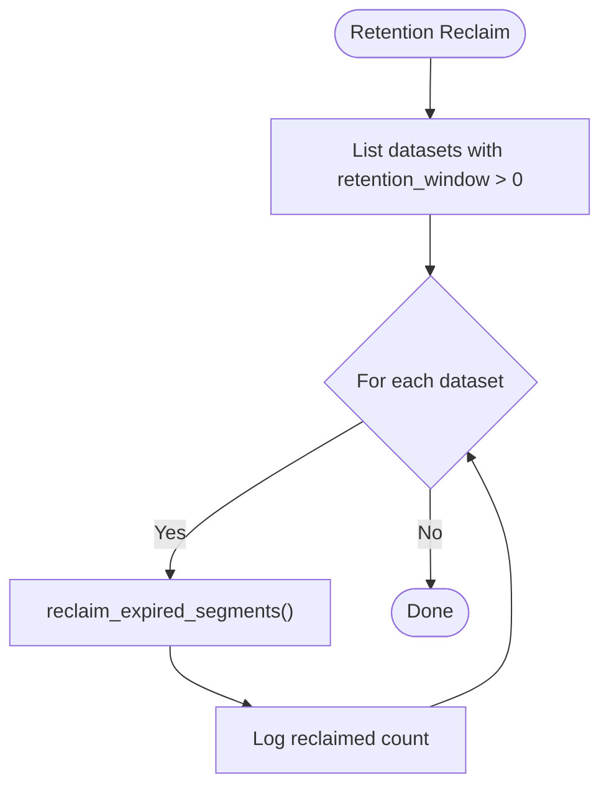
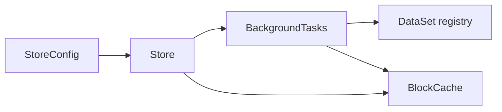

# Background Processing

<cite>
**Referenced Files in This Document**
- [bg/mod.rs](file://src/bg/mod.rs)
- [cache.rs](file://src/cache.rs)
- [store.rs](file://src/store.rs)
- [config.rs](file://src/config.rs)
- [lib.rs](file://src/lib.rs)
- [queue/mod.rs](file://src/queue/mod.rs)
- [dataset.rs](file://src/dataset.rs)
- [background_test.rs](file://tests/background_test.rs)
- [test_store_manual_bg.py](file://wrapper/python/tests/test_store_manual_bg.py)
</cite>

## Table of Contents
1. [Introduction](#introduction)
2. [Project Structure](#project-structure)
3. [Core Components](#core-components)
4. [Architecture Overview](#architecture-overview)
5. [Detailed Component Analysis](#detailed-component-analysis)
6. [Dependency Analysis](#dependency-analysis)
7. [Performance Considerations](#performance-considerations)
8. [Troubleshooting Guide](#troubleshooting-guide)
9. [Conclusion](#conclusion)
10. [Appendices](#appendices)

## Introduction
This document explains TimSLite’s background processing system: how it manages global caches, schedules and executes maintenance tasks, enforces retention policies, coordinates idle dataset lifecycle, and supports both automatic and manual execution modes. It also covers monitoring, performance impact, troubleshooting, and scaling for high-throughput scenarios.

## Project Structure
TimSLite organizes background processing under a cohesive set of modules:
- Background executor and scheduling: src/bg/mod.rs
- Global block cache and hot block cache: src/cache.rs
- Store facade and background task orchestration: src/store.rs
- Configuration for intervals and thresholds: src/config.rs
- Queue subsystem (flush coordination): src/queue/mod.rs
- Dataset APIs (flush, retention reclaim): src/dataset.rs
- Public re-exports and constants: src/lib.rs
- Tests for background behavior and manual execution: tests/background_test.rs, wrapper/python/tests/test_store_manual_bg.py

**Diagram sources**
- [store.rs:138-158](file://src/store.rs#L138-L158)
- [bg/mod.rs:103-190](file://src/bg/mod.rs#L103-L190)
- [cache.rs:43-63](file://src/cache.rs#L43-L63)

**Section sources**
- [lib.rs:38-73](file://src/lib.rs#L38-L73)
- [config.rs:26-71](file://src/config.rs#L26-L71)

## Core Components
- BackgroundTasks: central executor that decides which tasks are due and runs them. It supports auto mode (spawns a thread) and manual mode (caller invokes tick).
- BlockCache: global LRU cache with per-entry access tracking and idle eviction. Uses a watermark-based eviction strategy to maintain headroom.
- Store: integrates background tasks with dataset lifecycle and exposes manual tick and next-delay APIs.
- Queue subsystem: flushes state files to disk during background flush, ensuring durable progress markers.

Key responsibilities:
- Scheduling: compute next_delay, reserve_due_tasks, execute_reserved_tasks, finish_reserved_tasks
- Coordination: iterate all datasets, apply idle timeouts, trigger flush, eviction, retention reclaim
- Resource management: respect cache_max_memory, enforce retention windows, auto-close idle datasets

**Section sources**
- [bg/mod.rs:22-54](file://src/bg/mod.rs#L22-L54)
- [bg/mod.rs:194-203](file://src/bg/mod.rs#L194-L203)
- [cache.rs:43-113](file://src/cache.rs#L43-L113)
- [store.rs:514-540](file://src/store.rs#L514-L540)
- [queue/mod.rs:220-224](file://src/queue/mod.rs#L220-L224)

## Architecture Overview
The background system operates on a shared ExecutorState guarded by a mutex. Tasks are scheduled independently:
- Flush: periodic sync of dataset state (mmap) to disk
- Idle-close: closes datasets inactive beyond idle_timeout
- Cache eviction: evicts least-recently-used entries and idle entries
- Retention reclaim: removes expired segments based on dataset retention_window

**Diagram sources**
- [store.rs:514-528](file://src/store.rs#L514-L528)
- [bg/mod.rs:250-318](file://src/bg/mod.rs#L250-L318)
- [bg/mod.rs:320-439](file://src/bg/mod.rs#L320-L439)
- [cache.rs:152-173](file://src/cache.rs#L152-L173)
- [dataset.rs:875-890](file://src/dataset.rs#L875-L890)

## Detailed Component Analysis

### BackgroundTasks: Scheduling and Execution
- Modes:
  - start(): spawns a dedicated thread that loops, computes delays, and ticks
  - new(): constructs executor without a thread; caller drives via tick()
- ExecutorState tracks last timestamps and running flags for each task to prevent overlap
- next_delay() computes the minimum wait across all tasks, respecting running flags and cache enablement
- reserve_due_tasks(): sets due flags and updates last timestamps for tasks that become due
- execute_reserved_tasks(): runs flush, idle-check, cache-eviction, and retention-reclaim in order
- finish_reserved_tasks(): resets running flags after completion

**Diagram sources**
- [bg/mod.rs:194-203](file://src/bg/mod.rs#L194-L203)
- [bg/mod.rs:250-284](file://src/bg/mod.rs#L250-L284)
- [bg/mod.rs:286-318](file://src/bg/mod.rs#L286-L318)
- [bg/mod.rs:221-248](file://src/bg/mod.rs#L221-L248)

Operational highlights:
- Flush: iterates all datasets and calls flush on each
- Idle-check: scans datasets for inactivity beyond idle_timeout and closes them
- Cache eviction: triggers BlockCache::evict_idle when cache is enabled
- Retention reclaim: for datasets with retention_window > 0, calls reclaim_expired_segments and logs totals

**Section sources**
- [bg/mod.rs:103-190](file://src/bg/mod.rs#L103-L190)
- [bg/mod.rs:221-248](file://src/bg/mod.rs#L221-L248)
- [bg/mod.rs:250-318](file://src/bg/mod.rs#L250-L318)
- [bg/mod.rs:320-439](file://src/bg/mod.rs#L320-L439)

### Global BlockCache: LRU and Memory Management
- Enabled when cache_max_memory > 0; otherwise all cache operations are no-ops
- Entry structure tracks last_access_at and access_count; get increments hits, miss increments misses
- put():
  - Skips duplicates
  - Computes footprint = data_len + ENTRY_OVERHEAD
  - Evicts using evict_lru to stay under 85% of max_memory before insertion
- evict_lru():
  - Sorts entries by last_access_at and removes until target_used is freed
- evict_idle():
  - Removes entries older than cache_idle_timeout
- Stats expose entry_count, used_memory, hit_count, miss_count

**Diagram sources**
- [cache.rs:43-191](file://src/cache.rs#L43-L191)

Memory allocation pattern:
- Each cache entry allocates Vec<u8> sized to the stored block payload
- Footprint calculation ensures eviction decisions account for overhead
- Watermark-based eviction proactively frees space before exceeding limits

**Section sources**
- [cache.rs:23-26](file://src/cache.rs#L23-L26)
- [cache.rs:87-113](file://src/cache.rs#L87-L113)
- [cache.rs:129-150](file://src/cache.rs#L129-L150)
- [cache.rs:152-173](file://src/cache.rs#L152-L173)
- [cache.rs:182-190](file://src/cache.rs#L182-L190)

### Store Integration and Manual Execution
- Store::open initializes BlockCache and BackgroundTasks according to StoreConfig
- When enable_background_thread is true, BackgroundTasks::start is used; otherwise BackgroundTasks::new
- Store::tick_background_tasks delegates to BackgroundTasks::tick
- Store::next_background_delay delegates to BackgroundTasks::next_delay
- Manual execution is safe even when a background thread is running; internal Mutex serializes access

**Diagram sources**
- [store.rs:138-158](file://src/store.rs#L138-L158)
- [store.rs:514-540](file://src/store.rs#L514-L540)

**Section sources**
- [store.rs:124-158](file://src/store.rs#L124-L158)
- [store.rs:514-540](file://src/store.rs#L514-L540)

### Retention Policy Enforcement and Automatic Cleanup
- Retention is enforced per dataset via retention_window (timestamp units)
- BackgroundTasks::run_retention_reclaim:
  - Collects datasets with retention_window > 0
  - Calls reclaim_expired_segments on each and logs reclaimed counts
- Dataset::reclaim_expired_segments computes threshold from retention_window and delegates to segment and index layers

**Diagram sources**
- [bg/mod.rs:387-439](file://src/bg/mod.rs#L387-L439)
- [dataset.rs:875-890](file://src/dataset.rs#L875-L890)

**Section sources**
- [bg/mod.rs:387-439](file://src/bg/mod.rs#L387-L439)
- [dataset.rs:875-890](file://src/dataset.rs#L875-L890)

### Queue Flush Coordination
- Queue state files are persisted via ConsumerStateFile::flush during background flush
- This ensures consumer progress and pending entries are durably synchronized

**Section sources**
- [queue/mod.rs:220-224](file://src/queue/mod.rs#L220-L224)

## Dependency Analysis
- BackgroundTasks depends on:
  - Store datasets registry (Arc<RwLock<DatasetMap>>)
  - Global BlockCache (Arc<BlockCache>)
  - Configuration-derived intervals and retention hour
- Store composes BackgroundTasks and BlockCache, exposing manual tick and next-delay APIs
- Cache is optional; when disabled (cache_max_memory = 0), cache-related tasks are effectively no-ops

**Diagram sources**
- [config.rs:26-71](file://src/config.rs#L26-L71)
- [store.rs:124-158](file://src/store.rs#L124-L158)
- [bg/mod.rs:105-133](file://src/bg/mod.rs#L105-L133)

**Section sources**
- [config.rs:26-71](file://src/config.rs#L26-L71)
- [store.rs:124-158](file://src/store.rs#L124-L158)
- [bg/mod.rs:105-133](file://src/bg/mod.rs#L105-L133)

## Performance Considerations
- Task scheduling granularity:
  - Flush interval: default 10 minutes
  - Idle-check interval: fixed 60 seconds
  - Cache eviction interval: fixed 60 seconds
  - Retention check: daily at configured UTC hour
- Concurrency:
  - ExecutorState protected by Mutex; all tick operations are serialized
  - Dataset iteration holds read locks; long-running tasks can block next_delay computation
- Cache memory:
  - 85% watermark prevents frequent eviction thrashing
  - Access counters and last_access_at enable LRU eviction
- I/O:
  - Flush performs mmap flush; queue state files are flushed during dataset flush
- Throughput:
  - Manual mode allows tight integration with application loops
  - Auto mode offloads scheduling to a dedicated thread

[No sources needed since this section provides general guidance]

## Troubleshooting Guide
Common issues and remedies:
- Background thread not running:
  - Verify StoreConfig::enable_background_thread is true during Store::open
  - Confirm BackgroundTasks::start was used
- Manual mode not progressing:
  - Ensure periodic calls to Store::tick_background_tasks()
  - Use Store::next_background_delay() to debug scheduling
- Cache not evicting:
  - Confirm cache_max_memory > 0
  - Check cache_idle_timeout and last_access_at timestamps
- Retention not reclaiming:
  - Ensure dataset retention_window > 0
  - Verify timestamps align with retention semantics
- Idle-close not closing datasets:
  - Confirm idle_timeout is appropriate and last_used_at is updated by operations

Validation references:
- Background executor initialization and ticking behavior
- Manual tick and next_delay tests
- Manual background execution in Python wrapper tests

**Section sources**
- [store.rs:138-158](file://src/store.rs#L138-L158)
- [store.rs:514-540](file://src/store.rs#L514-L540)
- [tests/background_test.rs](file://tests/background_test.rs)
- [test_store_manual_bg.py](file://wrapper/python/tests/test_store_manual_bg.py)

## Conclusion
TimSLite’s background processing system provides robust, configurable maintenance for time-series datasets. It balances global cache efficiency with dataset lifecycle management and retention enforcement. Applications can choose between automatic or manual execution modes, monitor scheduling via next_delay, and tune intervals and memory to meet throughput and latency goals.

[No sources needed since this section summarizes without analyzing specific files]

## Appendices

### Configuration Reference
- StoreConfig fields influencing background processing:
  - flush_interval: background flush interval
  - idle_timeout: idle-close threshold for datasets
  - cache_max_memory: global cache size (0 disables)
  - cache_idle_timeout: idle eviction threshold
  - retention_check_hour: UTC hour for daily retention reclaim
  - enable_background_thread: auto vs manual mode

**Section sources**
- [config.rs:26-71](file://src/config.rs#L26-L71)
- [config.rs:80-203](file://src/config.rs#L80-L203)

### API Surface for Background Operations
- Store::tick_background_tasks(): execute one tick synchronously
- Store::next_background_delay(): peek next due time without executing
- BackgroundTasks::tick()/next_delay(): lower-level APIs for advanced usage

**Section sources**
- [store.rs:514-540](file://src/store.rs#L514-L540)
- [bg/mod.rs:194-209](file://src/bg/mod.rs#L194-L209)