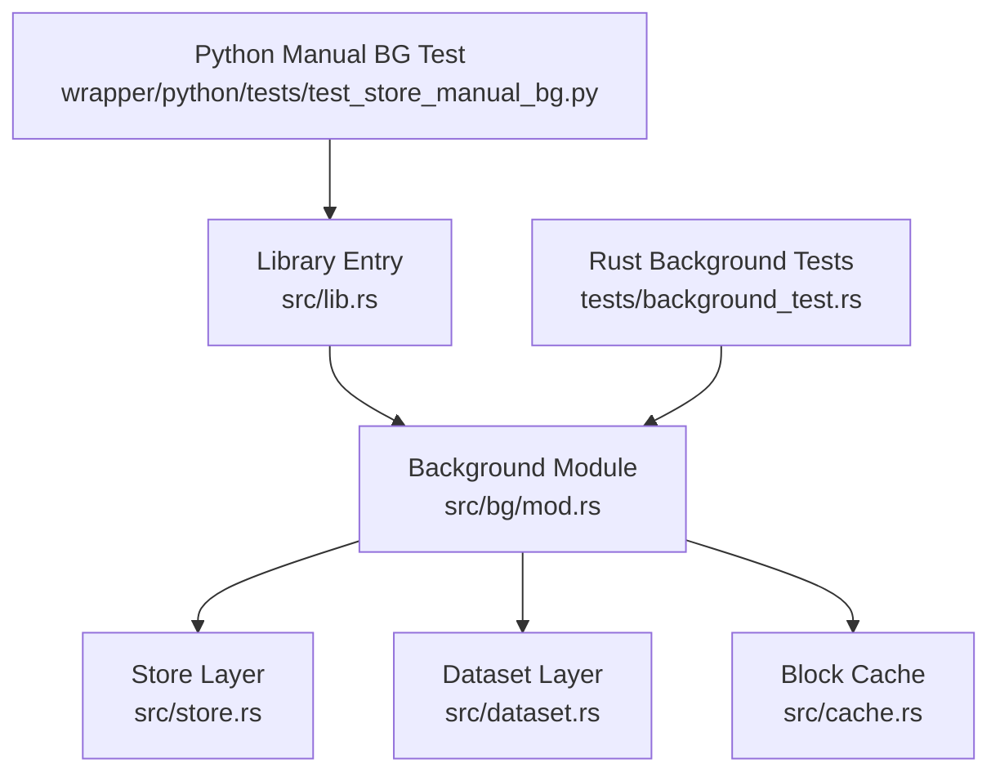
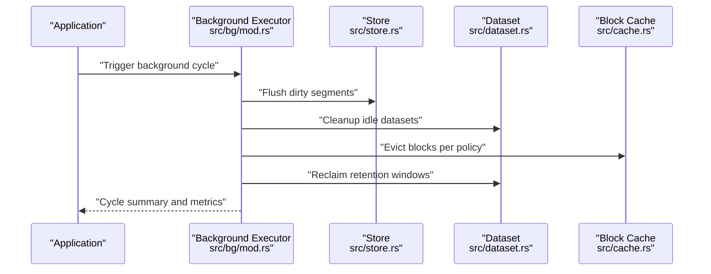
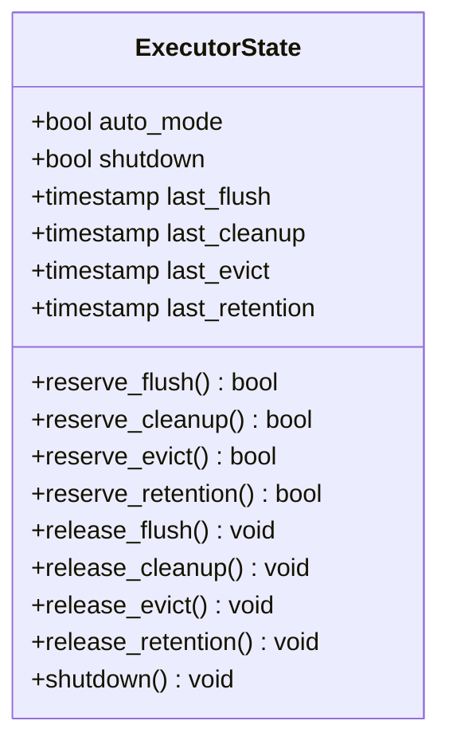
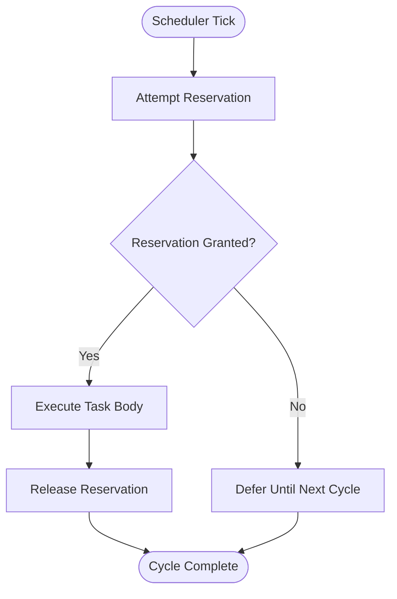
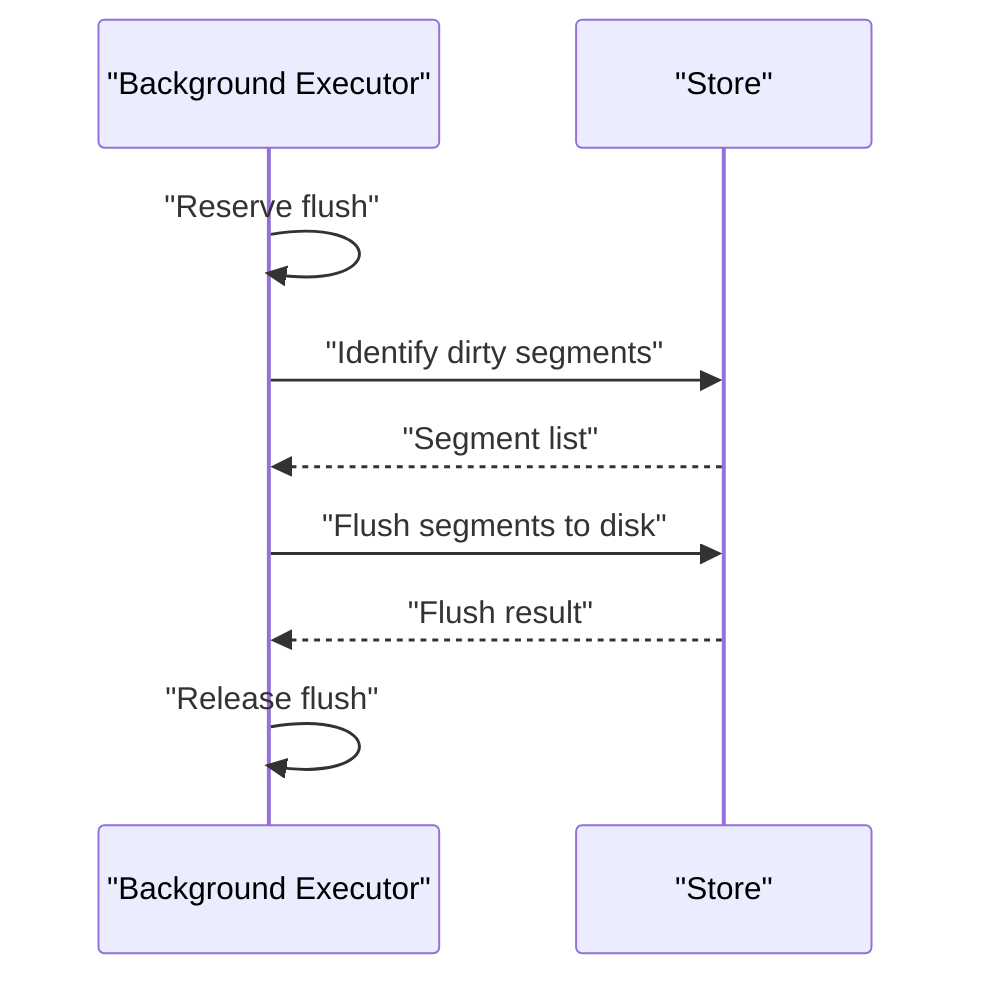
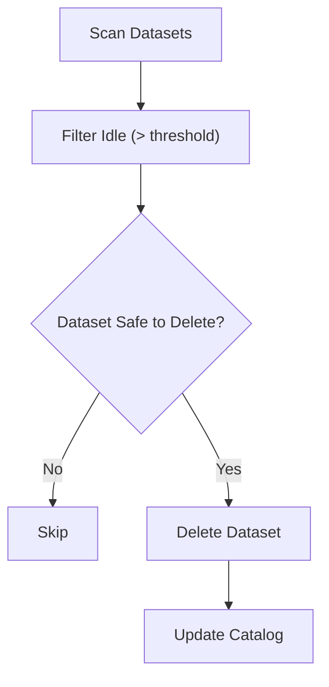
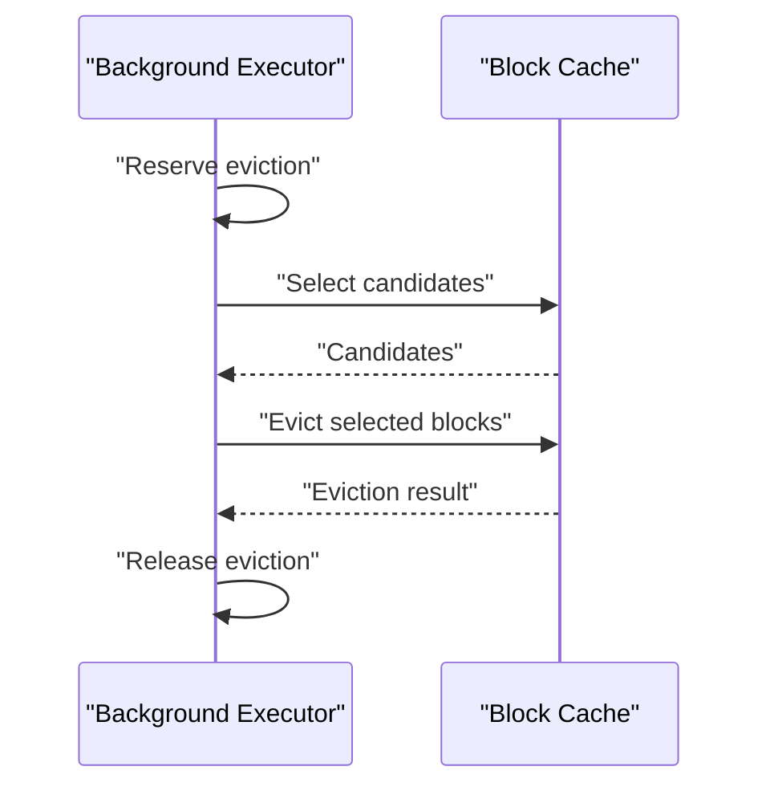
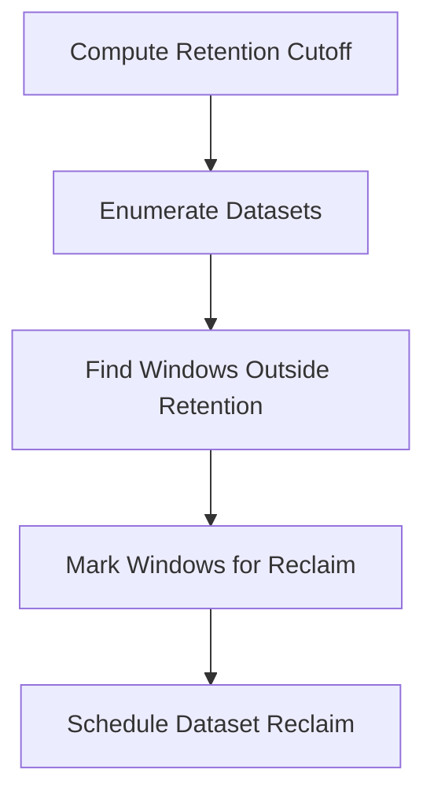
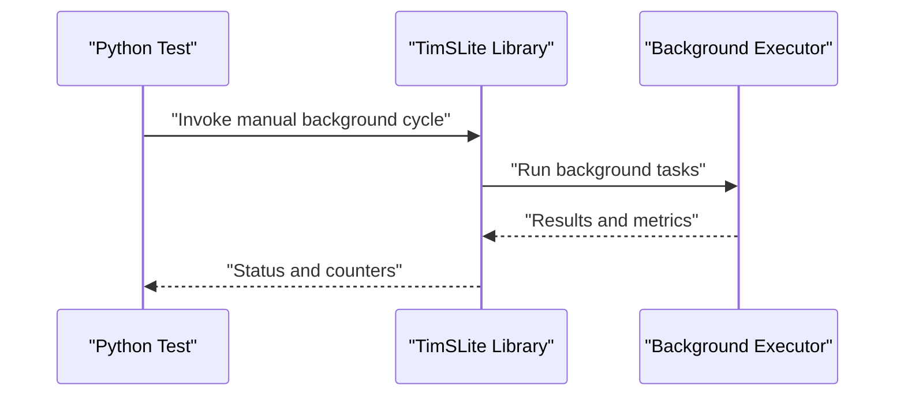
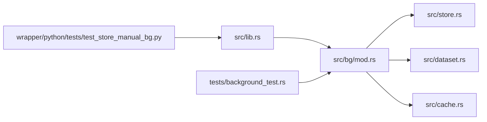

# Background Task Coordination

<cite>
**Referenced Files in This Document**
- [mod.rs](file://src/bg/mod.rs)
- [lib.rs](file://src/lib.rs)
- [store.rs](file://src/store.rs)
- [dataset.rs](file://src/dataset.rs)
- [cache.rs](file://src/cache.rs)
- [background_test.rs](file://tests/background_test.rs)
- [test_store_manual_bg.py](file://wrapper/python/tests/test_store_manual_bg.py)
- [phase-06-store-bg.md](file://docs/plan/phase-06-store-bg.md)
- [phase-21-manual-bg-execution.md](file://docs/plan/phase-21-manual-bg-execution.md)
</cite>

## Table of Contents
1. [Introduction](#introduction)
2. [Project Structure](#project-structure)
3. [Core Components](#core-components)
4. [Architecture Overview](#architecture-overview)
5. [Detailed Component Analysis](#detailed-component-analysis)
6. [Dependency Analysis](#dependency-analysis)
7. [Performance Considerations](#performance-considerations)
8. [Troubleshooting Guide](#troubleshooting-guide)
9. [Conclusion](#conclusion)

## Introduction
This document describes TimSLite’s background task coordination system. It covers dual-mode operation (automatic and manual), scheduling and execution coordination, ExecutorState management, task reservation, concurrency safeguards, and the four core background tasks: flush operations, idle dataset cleanup, cache eviction, and retention reclaim. It also documents task prioritization, conflict resolution, resource contention handling, manual execution patterns, monitoring, performance impact, thread safety, shutdown procedures, and graceful degradation.

## Project Structure
TimSLite organizes background-related logic primarily under the background module and integrates with the store and dataset layers. The Python wrapper exposes manual execution APIs for testing and operational control.

**Diagram sources**
- [mod.rs](file://src/bg/mod.rs)
- [lib.rs](file://src/lib.rs)
- [store.rs](file://src/store.rs)
- [dataset.rs](file://src/dataset.rs)
- [cache.rs](file://src/cache.rs)
- [background_test.rs](file://tests/background_test.rs)
- [test_store_manual_bg.py](file://wrapper/python/tests/test_store_manual_bg.py)

**Section sources**
- [mod.rs](file://src/bg/mod.rs)
- [lib.rs](file://src/lib.rs)

## Core Components
- Background executor and scheduling: Centralized in the background module, orchestrating periodic and on-demand tasks.
- Store integration: Flush and retention operations coordinated via the store layer.
- Dataset lifecycle: Idle cleanup and retention handled at the dataset level.
- Block cache: Eviction policy and coordination with background tasks.
- Manual execution: Python wrapper APIs enable explicit invocation of background operations for testing and operational control.

Key responsibilities:
- Dual-mode operation: Automatic scheduling and manual triggering.
- ExecutorState: Tracks scheduling state and ensures safe transitions.
- Task reservation: Prevents overlapping executions and resolves conflicts.
- Concurrency: Thread-safe coordination across tasks and layers.
- Monitoring: Observability hooks for task outcomes and durations.

**Section sources**
- [mod.rs](file://src/bg/mod.rs)
- [store.rs](file://src/store.rs)
- [dataset.rs](file://src/dataset.rs)
- [cache.rs](file://src/cache.rs)
- [test_store_manual_bg.py](file://wrapper/python/tests/test_store_manual_bg.py)

## Architecture Overview
The background system operates as a scheduler that periodically triggers tasks and coordinates with store, dataset, and cache layers. It supports manual execution through the public API and Python wrapper.

**Diagram sources**
- [mod.rs](file://src/bg/mod.rs)
- [store.rs](file://src/store.rs)
- [dataset.rs](file://src/dataset.rs)
- [cache.rs](file://src/cache.rs)

## Detailed Component Analysis

### Background ExecutorState Management
ExecutorState encapsulates scheduling metadata and execution flags to ensure safe transitions and prevent redundant runs. It tracks:
- Last execution timestamps for each task type
- Current mode (auto/manual)
- Reservation flags to avoid overlap
- Shutdown state to halt new work gracefully

Concurrency model:
- Atomic updates for state transitions
- Mutex-protected shared state during reservations
- Guarded access to scheduling decisions

**Diagram sources**
- [mod.rs](file://src/bg/mod.rs)

**Section sources**
- [mod.rs](file://src/bg/mod.rs)

### Task Reservation System
Each background task reserves a slot before execution. Reservations prevent:
- Concurrent runs of the same task
- Overlap with incompatible tasks
- Execution after shutdown

Reservation protocol:
- Attempt reservation before entering task body
- Release reservation upon completion or failure
- On conflict, defer to next scheduled cycle

**Diagram sources**
- [mod.rs](file://src/bg/mod.rs)

**Section sources**
- [mod.rs](file://src/bg/mod.rs)

### Four Core Background Tasks

#### 1) Flush Operations
Purpose: Persist dirty in-memory segments to disk to free buffers and reduce write amplification.

Execution:
- Scans store for dirty segments
- Writes to data segments and updates indices
- Updates flush metrics and timestamps

Coordination:
- Reserves flush slot
- Defers if other incompatible tasks are running
- Honors shutdown flag

**Diagram sources**
- [mod.rs](file://src/bg/mod.rs)
- [store.rs](file://src/store.rs)

**Section sources**
- [mod.rs](file://src/bg/mod.rs)
- [store.rs](file://src/store.rs)

#### 2) Idle Dataset Cleanup
Purpose: Remove datasets that have been inactive beyond a configured threshold to reclaim resources.

Execution:
- Enumerates datasets and checks last-access timestamps
- Validates dataset state before deletion
- Removes idle datasets and updates catalog

Coordination:
- Reserves cleanup slot
- Skips if shutdown or other reservations conflict

**Diagram sources**
- [mod.rs](file://src/bg/mod.rs)
- [dataset.rs](file://src/dataset.rs)

**Section sources**
- [mod.rs](file://src/bg/mod.rs)
- [dataset.rs](file://src/dataset.rs)

#### 3) Cache Eviction
Purpose: Enforce cache size limits and policy-driven evictions to maintain memory pressure within bounds.

Execution:
- Applies eviction policy (e.g., LRU/LFU-like)
- Selects candidate blocks for eviction
- Coordinates with block cache to evict and update stats

Coordination:
- Reserves eviction slot
- Pauses during flush if eviction would cause contention

**Diagram sources**
- [mod.rs](file://src/bg/mod.rs)
- [cache.rs](file://src/cache.rs)

**Section sources**
- [mod.rs](file://src/bg/mod.rs)
- [cache.rs](file://src/cache.rs)

#### 4) Retention Reclaim
Purpose: Free storage by removing data outside configured retention windows.

Execution:
- Computes retention cutoff
- Identifies removable data windows
- Triggers dataset-level reclaim operations

Coordination:
- Reserves retention slot
- Schedules cleanup for affected datasets

**Diagram sources**
- [mod.rs](file://src/bg/mod.rs)
- [dataset.rs](file://src/dataset.rs)

**Section sources**
- [mod.rs](file://src/bg/mod.rs)
- [dataset.rs](file://src/dataset.rs)

### Task Scheduling Algorithms and Prioritization
- Scheduling cadence: Periodic ticks with configurable intervals per task type.
- Prioritization: Flush typically takes precedence to maintain write throughput; eviction follows to prevent memory spikes; cleanup and retention reclaim run when idle.
- Conflict resolution: Higher-priority tasks can preempt lower-priority ones when safe; otherwise, deferral occurs.
- Resource contention handling: Flush and eviction avoid simultaneous execution; idle cleanup avoids heavy I/O bursts.

**Section sources**
- [mod.rs](file://src/bg/mod.rs)

### Manual Background Execution Patterns
Manual execution enables controlled invocation for testing and operational scenarios. The Python wrapper exposes APIs to trigger background cycles and observe outcomes.

Patterns:
- Single-shot execution: Trigger a background cycle and await completion.
- Iterative execution: Loop until desired conditions are met (e.g., no pending flushes).
- Metrics polling: Inspect counters and durations post-execution.

**Diagram sources**
- [test_store_manual_bg.py](file://wrapper/python/tests/test_store_manual_bg.py)
- [lib.rs](file://src/lib.rs)
- [mod.rs](file://src/bg/mod.rs)

**Section sources**
- [test_store_manual_bg.py](file://wrapper/python/tests/test_store_manual_bg.py)
- [lib.rs](file://src/lib.rs)

### Task Monitoring and Observability
Monitoring includes:
- Per-task counters (executions, failures, durations)
- Flush progress and latency metrics
- Cache hit ratio and eviction rates
- Dataset counts and idle timers
- Retention window statistics

These metrics inform tuning of scheduling intervals and resource allocation.

**Section sources**
- [mod.rs](file://src/bg/mod.rs)

### Concurrency Safety Measures
- Atomic state transitions for ExecutorState
- Reservation locks to serialize task execution
- Shutdown gate to prevent new work while draining
- Thread-safe access to shared structures (store, dataset, cache)
- Idempotent operations to handle retries safely

**Section sources**
- [mod.rs](file://src/bg/mod.rs)

### Shutdown Procedures and Graceful Degradation
- Shutdown sequence: Mark executor as shutting down, wait for current reservations to release, and stop scheduling new cycles.
- Graceful degradation: If a task fails, the system logs and continues with remaining tasks; critical failures may pause scheduling until resolved.
- Backpressure: During heavy load, the executor defers non-critical tasks to reduce contention.

**Section sources**
- [mod.rs](file://src/bg/mod.rs)

## Dependency Analysis
The background module depends on store, dataset, and cache layers. The library entry wires the background executor into the public API, while tests validate behavior across Rust and Python.

**Diagram sources**
- [mod.rs](file://src/bg/mod.rs)
- [store.rs](file://src/store.rs)
- [dataset.rs](file://src/dataset.rs)
- [cache.rs](file://src/cache.rs)
- [lib.rs](file://src/lib.rs)
- [background_test.rs](file://tests/background_test.rs)
- [test_store_manual_bg.py](file://wrapper/python/tests/test_store_manual_bg.py)

**Section sources**
- [mod.rs](file://src/bg/mod.rs)
- [lib.rs](file://src/lib.rs)

## Performance Considerations
- Scheduling intervals: Tune per workload to balance throughput and overhead.
- Batch sizes: Group operations where possible to amortize costs.
- I/O patterns: Align flush and reclaim with storage characteristics.
- Memory footprint: Adjust cache eviction aggressiveness to maintain low-latency access.
- Contention avoidance: Prefer off-peak scheduling and preemption policies.

[No sources needed since this section provides general guidance]

## Troubleshooting Guide
Common issues and resolutions:
- Tasks not running: Verify auto-mode is enabled and ExecutorState is not shutdown.
- Frequent deferrals: Increase scheduling frequency or reduce task duration.
- Memory pressure: Tighten eviction thresholds or increase cache capacity.
- Retention gaps: Confirm retention windows and reclaim schedules.
- Manual execution failures: Check Python wrapper bindings and library linkage.

Validation:
- Use Rust background tests to assert task outcomes.
- Use Python manual execution tests to simulate operational scenarios.

**Section sources**
- [background_test.rs](file://tests/background_test.rs)
- [test_store_manual_bg.py](file://wrapper/python/tests/test_store_manual_bg.py)

## Conclusion
TimSLite’s background task coordination system provides robust automatic and manual execution modes with strong concurrency guarantees. The ExecutorState and reservation system ensure safe, conflict-free operation across flush, idle cleanup, cache eviction, and retention reclaim tasks. Tunable scheduling and comprehensive observability enable effective performance management and graceful handling of degraded conditions.