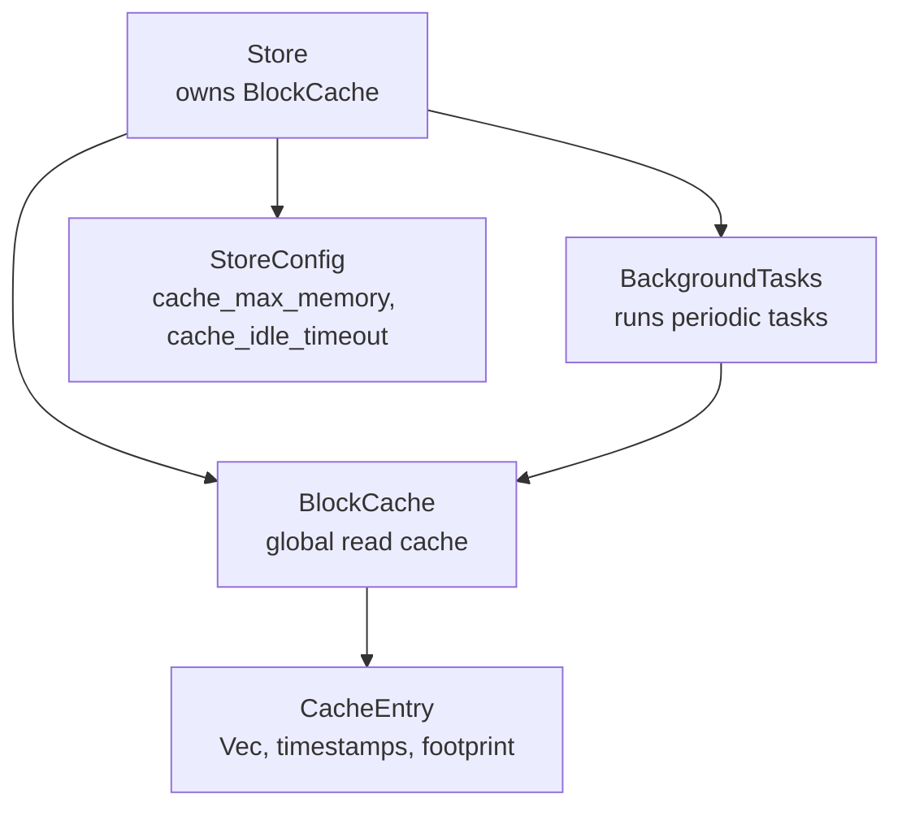
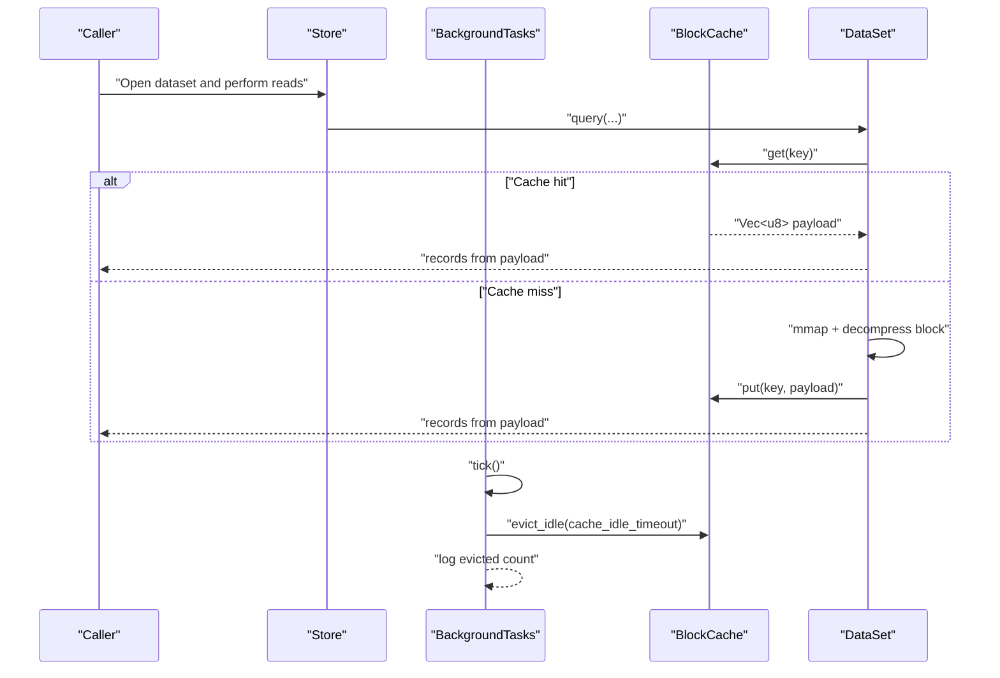
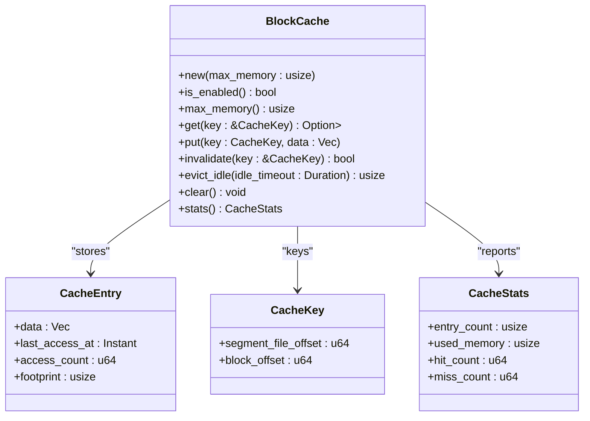
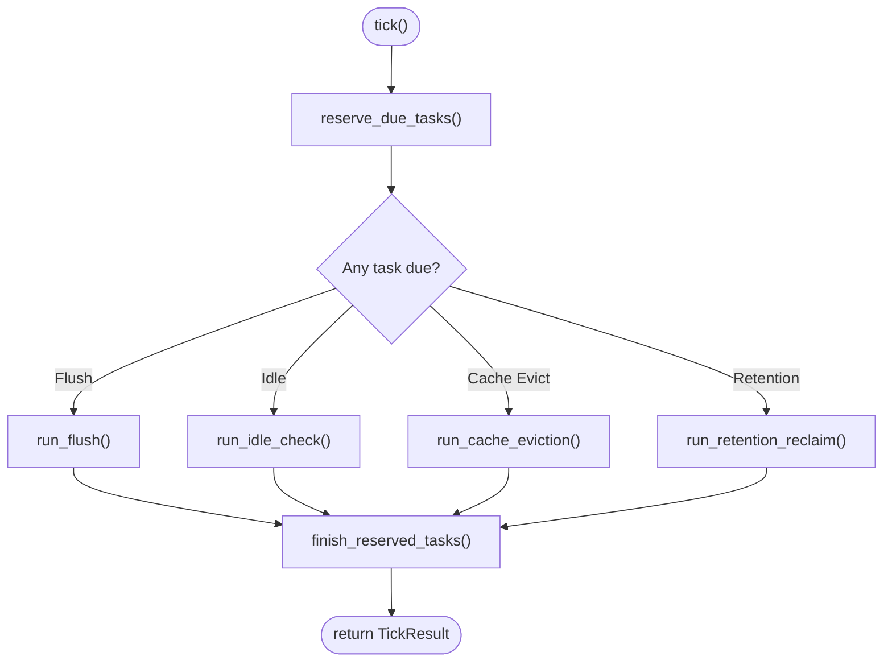
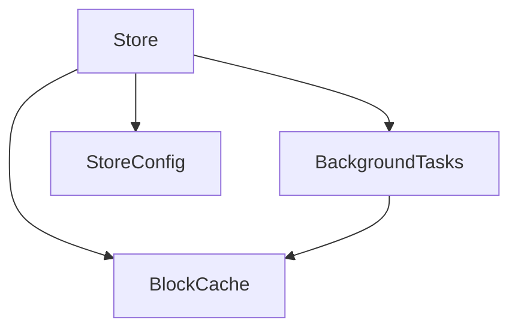

# Cache Management

<cite>
**Referenced Files in This Document**
- [cache.rs](file://src/cache.rs)
- [config.rs](file://src/config.rs)
- [bg/mod.rs](file://src/bg/mod.rs)
- [store.rs](file://src/store.rs)
- [lib.rs](file://src/lib.rs)
- [phase-09-blockcache.md](file://docs/plan/phase-09-blockcache.md)
- [background-and-cache.md](file://docs/design/background-and-cache.md)
</cite>

## Table of Contents
1. [Introduction](#introduction)
2. [Project Structure](#project-structure)
3. [Core Components](#core-components)
4. [Architecture Overview](#architecture-overview)
5. [Detailed Component Analysis](#detailed-component-analysis)
6. [Dependency Analysis](#dependency-analysis)
7. [Performance Considerations](#performance-considerations)
8. [Troubleshooting Guide](#troubleshooting-guide)
9. [Conclusion](#conclusion)
10. [Appendices](#appendices)

## Introduction
This document explains TimSLite’s global block cache management system. It covers the LRU eviction strategy, memory allocation patterns, cache coordination with background tasks, and how caching integrates into read paths. It also documents cache enable/disable behavior, idle timeout configuration, eviction thresholds, performance impact, memory efficiency, sizing guidelines, monitoring hit rates, and troubleshooting cache-related issues.

## Project Structure
TimSLite organizes cache-related logic across several modules:
- Global read cache: [BlockCache:43-191](file://src/cache.rs#L43-L191)
- Local per-query cache: [HotBlockCache:291-359](file://src/cache.rs#L291-L359)
- Background coordination: [BackgroundTasks:44-459](file://src/bg/mod.rs#L44-L459)
- Store integration and configuration: [Store:46-161](file://src/store.rs#L46-L161), [StoreConfig:26-71](file://src/config.rs#L26-L71)
- Public re-exports: [lib.rs:69-72](file://src/lib.rs#L69-L72)

**Diagram sources**
- [store.rs:46-161](file://src/store.rs#L46-L161)
- [bg/mod.rs:44-54](file://src/bg/mod.rs#L44-L54)
- [cache.rs:43-191](file://src/cache.rs#L43-L191)
- [config.rs:26-71](file://src/config.rs#L26-L71)

**Section sources**
- [lib.rs:69-72](file://src/lib.rs#L69-L72)
- [store.rs:46-161](file://src/store.rs#L46-L161)
- [config.rs:26-71](file://src/config.rs#L26-L71)

## Core Components
- Global read cache: [BlockCache:43-191](file://src/cache.rs#L43-L191)
  - Stores decompressed block payloads keyed by segment and block offsets.
  - Tracks used memory and maintains hit/miss counts.
  - Provides LRU eviction and idle eviction.
- Local per-query cache: [HotBlockCache:291-359](file://src/cache.rs#L291-L359)
  - Lightweight, lock-free cache for the current block during a single query iteration.
  - Avoids contention by keeping a single cached block per query.
- Background coordinator: [BackgroundTasks:44-459](file://src/bg/mod.rs#L44-L459)
  - Schedules flush, idle segment close, cache eviction, and retention reclaim.
  - Invokes [BlockCache::evict_idle:152-173](file://src/cache.rs#L152-L173) periodically.
- Store integration: [Store:46-161](file://src/store.rs#L46-L161)
  - Creates and owns [BlockCache:43-191](file://src/cache.rs#L43-L191) with configured limits.
  - Starts background tasks depending on [StoreConfig:26-71](file://src/config.rs#L26-L71).
- Configuration: [StoreConfig:26-71](file://src/config.rs#L26-L71)
  - Controls cache enablement and thresholds via [cache_max_memory](file://src/config.rs#L42) and [cache_idle_timeout](file://src/config.rs#L44).

**Section sources**
- [cache.rs:43-191](file://src/cache.rs#L43-L191)
- [cache.rs:291-359](file://src/cache.rs#L291-L359)
- [bg/mod.rs:44-459](file://src/bg/mod.rs#L44-L459)
- [store.rs:46-161](file://src/store.rs#L46-L161)
- [config.rs:26-71](file://src/config.rs#L26-L71)

## Architecture Overview
The cache participates in read paths and background maintenance:

**Diagram sources**
- [store.rs:46-161](file://src/store.rs#L46-L161)
- [bg/mod.rs:286-385](file://src/bg/mod.rs#L286-L385)
- [cache.rs:68-113](file://src/cache.rs#L68-L113)
- [cache.rs:152-173](file://src/cache.rs#L152-L173)

## Detailed Component Analysis

### Global Block Cache: BlockCache
- Enable/disable behavior
  - Cache is enabled when [max_memory](file://src/cache.rs#L44) > 0; otherwise all operations short-circuit.
  - See [is_enabled:61-63](file://src/cache.rs#L61-L63).
- Memory allocation pattern
  - Each entry stores a [Vec<u8>](file://src/cache.rs#L29) payload and metadata.
  - Footprint estimation includes payload length plus fixed overhead via [entry_footprint:24-26](file://src/cache.rs#L24-L26).
  - Used memory tracked atomically via [used_memory](file://src/cache.rs#L45).
- LRU eviction strategy
  - On insert, if total used memory would exceed 85% of [max_memory](file://src/cache.rs#L44), the cache triggers [evict_lru:129-150](file://src/cache.rs#L129-L150) to free space.
  - LRU order determined by [last_access_at](file://src/cache.rs#L30) timestamps.
- Idle eviction
  - Background tasks call [evict_idle:152-173](file://src/cache.rs#L152-L173) with [cache_idle_timeout](file://src/config.rs#L44) to remove stale entries.
- Stats and invalidation
  - Exposes [stats:182-190](file://src/cache.rs#L182-L190) for monitoring hit/miss counts and memory usage.
  - Supports [invalidate:115-127](file://src/cache.rs#L115-L127) to remove a specific key and update memory accounting.

**Diagram sources**
- [cache.rs:43-191](file://src/cache.rs#L43-L191)

**Section sources**
- [cache.rs:43-191](file://src/cache.rs#L43-L191)
- [cache.rs:24-26](file://src/cache.rs#L24-L26)
- [cache.rs:129-150](file://src/cache.rs#L129-L150)
- [cache.rs:152-173](file://src/cache.rs#L152-L173)
- [cache.rs:182-190](file://src/cache.rs#L182-L190)

### Background Coordination: BackgroundTasks
- Periodic tasks
  - Flush: [run_flush:320-332](file://src/bg/mod.rs#L320-L332)
  - Idle segment close: [run_idle_check:334-376](file://src/bg/mod.rs#L334-L376)
  - Cache eviction: [run_cache_eviction:378-385](file://src/bg/mod.rs#L378-L385)
  - Retention reclaim: [run_retention_reclaim:387-439](file://src/bg/mod.rs#L387-L439)
- Scheduling intervals
  - Fixed intervals: idle check (60s), cache eviction (60s), and dynamic retention timing.
  - Next delay computation considers cache enablement and intervals.
- Integration with BlockCache
  - Calls [BlockCache::evict_idle:152-173](file://src/cache.rs#L152-L173) when enabled.

**Diagram sources**
- [bg/mod.rs:194-318](file://src/bg/mod.rs#L194-L318)
- [bg/mod.rs:286-385](file://src/bg/mod.rs#L286-L385)

**Section sources**
- [bg/mod.rs:44-459](file://src/bg/mod.rs#L44-L459)
- [bg/mod.rs:221-248](file://src/bg/mod.rs#L221-L248)
- [bg/mod.rs:286-385](file://src/bg/mod.rs#L286-L385)

### Store Integration and Configuration
- Store ownership
  - [Store:46-56](file://src/store.rs#L46-L56) constructs [BlockCache:43-191](file://src/cache.rs#L43-L191) with [cache_max_memory](file://src/config.rs#L42) and starts [BackgroundTasks:44-54](file://src/bg/mod.rs#L44-L54).
- Configuration
  - [StoreConfig:26-71](file://src/config.rs#L26-L71) defines defaults for cache behavior, including [cache_max_memory](file://src/config.rs#L42) and [cache_idle_timeout](file://src/config.rs#L44).
- Public exports
  - [HotBlockCache:291-359](file://src/cache.rs#L291-L359) is re-exported via [lib.rs](file://src/lib.rs#L69).

**Diagram sources**
- [store.rs:124-158](file://src/store.rs#L124-L158)
- [config.rs:26-71](file://src/config.rs#L26-L71)
- [bg/mod.rs:44-54](file://src/bg/mod.rs#L44-L54)
- [cache.rs:43-191](file://src/cache.rs#L43-L191)

**Section sources**
- [store.rs:124-158](file://src/store.rs#L124-L158)
- [config.rs:26-71](file://src/config.rs#L26-L71)
- [lib.rs](file://src/lib.rs#L69)

## Dependency Analysis
- Coupling
  - [BackgroundTasks:44-54](file://src/bg/mod.rs#L44-L54) depends on [BlockCache:43-191](file://src/cache.rs#L43-L191) for idle eviction.
  - [Store:46-56](file://src/store.rs#L46-L56) composes [BlockCache:43-191](file://src/cache.rs#L43-L191) and [BackgroundTasks:44-54](file://src/bg/mod.rs#L44-L54).
- Cohesion
  - [BlockCache:43-191](file://src/cache.rs#L43-L191) encapsulates cache semantics and memory accounting.
  - [HotBlockCache:291-359](file://src/cache.rs#L291-L359) isolates per-query hot-path logic.
- External dependencies
  - Uses standard synchronization primitives ([RwLock](file://src/cache.rs#L46), [AtomicUsize](file://src/cache.rs#L45), [AtomicU64:47-48](file://src/cache.rs#L47-L48)).

**Diagram sources**
- [store.rs:46-161](file://src/store.rs#L46-L161)
- [bg/mod.rs:44-54](file://src/bg/mod.rs#L44-L54)
- [cache.rs:43-191](file://src/cache.rs#L43-L191)
- [config.rs:26-71](file://src/config.rs#L26-L71)

**Section sources**
- [store.rs:46-161](file://src/store.rs#L46-L161)
- [bg/mod.rs:44-54](file://src/bg/mod.rs#L44-L54)
- [cache.rs:43-191](file://src/cache.rs#L43-L191)
- [config.rs:26-71](file://src/config.rs#L26-L71)

## Performance Considerations
- Memory footprint
  - Each cache entry adds a fixed overhead plus payload size; see [entry_footprint:24-26](file://src/cache.rs#L24-L26).
  - Total memory usage is tracked atomically via [used_memory](file://src/cache.rs#L45).
- Eviction thresholds
  - Insertion triggers LRU eviction when used memory would exceed 85% of [max_memory](file://src/cache.rs#L44).
  - Background idle eviction removes entries older than [cache_idle_timeout](file://src/config.rs#L44).
- Contention and locality
  - Global cache uses a write lock for lookups/insertions; consider the hot-path local cache [HotBlockCache:291-359](file://src/cache.rs#L291-L359) to reduce contention during iteration.
- Background scheduling
  - Cache eviction runs every 60 seconds when enabled; tune [StoreConfig::enable_background_thread](file://src/config.rs#L49) and intervals accordingly.

[No sources needed since this section provides general guidance]

## Troubleshooting Guide
- Cache appears disabled
  - Cause: [cache_max_memory](file://src/config.rs#L42) set to 0.
  - Behavior: [is_enabled:61-63](file://src/cache.rs#L61-L63) returns false; [get:68-85](file://src/cache.rs#L68-L85) returns None; [put:87-113](file://src/cache.rs#L87-L113) is a no-op.
- Low hit rate
  - Verify read patterns and block reuse; monitor [stats:182-190](file://src/cache.rs#L182-L190) for hit/miss counts.
  - Consider increasing [cache_max_memory](file://src/config.rs#L42) or reducing [cache_idle_timeout](file://src/config.rs#L44) to retain useful blocks longer.
- Memory growth
  - Confirm background eviction is active; check [BackgroundTasks::compute_next_delay:221-248](file://src/bg/mod.rs#L221-L248) and [run_cache_eviction:378-385](file://src/bg/mod.rs#L378-L385).
  - Inspect [used_memory](file://src/cache.rs#L45) via [stats:182-190](file://src/cache.rs#L182-L190).
- Idle entries not removed
  - Ensure [BackgroundTasks:44-54](file://src/bg/mod.rs#L44-L54) is running and [cache_idle_timeout](file://src/config.rs#L44) is reasonable.
  - Validate timestamps are updated on access via [get:68-85](file://src/cache.rs#L68-L85).

**Section sources**
- [cache.rs:61-63](file://src/cache.rs#L61-L63)
- [cache.rs:68-113](file://src/cache.rs#L68-L113)
- [cache.rs:182-190](file://src/cache.rs#L182-L190)
- [bg/mod.rs:221-248](file://src/bg/mod.rs#L221-L248)
- [bg/mod.rs:378-385](file://src/bg/mod.rs#L378-L385)
- [config.rs:42-44](file://src/config.rs#L42-L44)

## Conclusion
TimSLite’s cache system provides a practical balance of simplicity and performance:
- Global [BlockCache:43-191](file://src/cache.rs#L43-L191) offers LRU and idle eviction with straightforward memory accounting.
- [BackgroundTasks:44-459](file://src/bg/mod.rs#L44-L459) coordinates periodic maintenance, including cache eviction.
- [Store:46-161](file://src/store.rs#L46-L161) integrates cache and background tasks according to [StoreConfig:26-71](file://src/config.rs#L26-L71).
- For optimal performance, size the cache appropriately, monitor hit rates, and rely on background eviction to manage idle entries.

[No sources needed since this section summarizes without analyzing specific files]

## Appendices

### Configuration Options for Cache
- cache_max_memory: Maximum memory for the global read cache (bytes; 0 disables).
- cache_idle_timeout: Idle threshold for cache entries (evicted by background tasks).
- enable_background_thread: Enables automatic background thread; otherwise manual ticking is required.

**Section sources**
- [config.rs:42-44](file://src/config.rs#L42-L44)
- [config.rs](file://src/config.rs#L49)
- [store.rs:139-158](file://src/store.rs#L139-L158)

### Monitoring Cache Hit Rates
- Use [stats:182-190](file://src/cache.rs#L182-L190) to track:
  - entry_count: number of cached blocks
  - used_memory: bytes currently used
  - hit_count and miss_count: counters for cache behavior
- Compare miss_count growth to adjust cache sizing or access patterns.

**Section sources**
- [cache.rs:182-190](file://src/cache.rs#L182-L190)

### Cache Sizing Guidelines
- Start with defaults from [StoreConfig::default:54-71](file://src/config.rs#L54-L71).
- Increase cache_max_memory proportionally to expected working set size and block payload sizes.
- Keep cache_idle_timeout aligned with typical query patterns to avoid premature eviction.

**Section sources**
- [config.rs:64-65](file://src/config.rs#L64-L65)
- [config.rs](file://src/config.rs#L65)

### Integration Notes
- Background eviction is coordinated by [BackgroundTasks:44-54](file://src/bg/mod.rs#L44-L54) and invoked via [run_cache_eviction:378-385](file://src/bg/mod.rs#L378-L385).
- The hot-path local cache [HotBlockCache:291-359](file://src/cache.rs#L291-L359) complements the global cache for per-query reuse.

**Section sources**
- [bg/mod.rs:378-385](file://src/bg/mod.rs#L378-L385)
- [cache.rs:291-359](file://src/cache.rs#L291-L359)