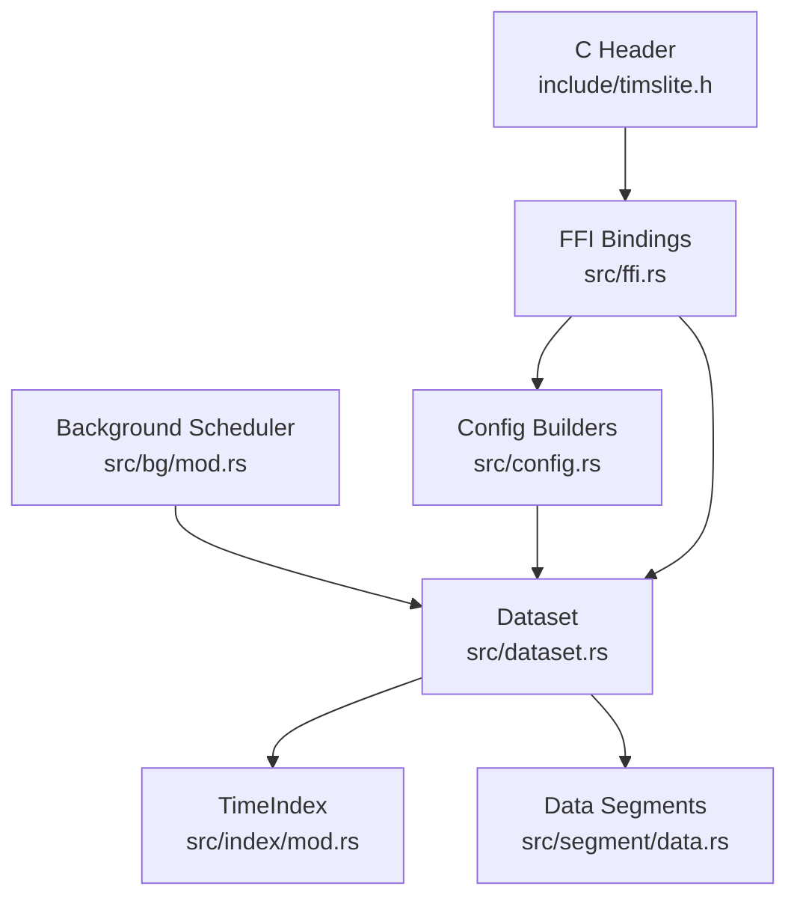
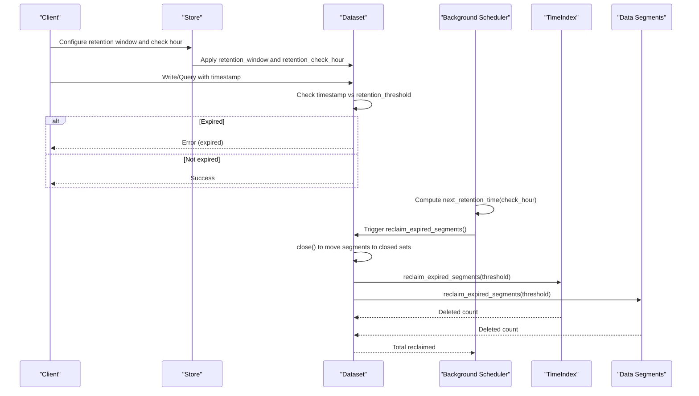
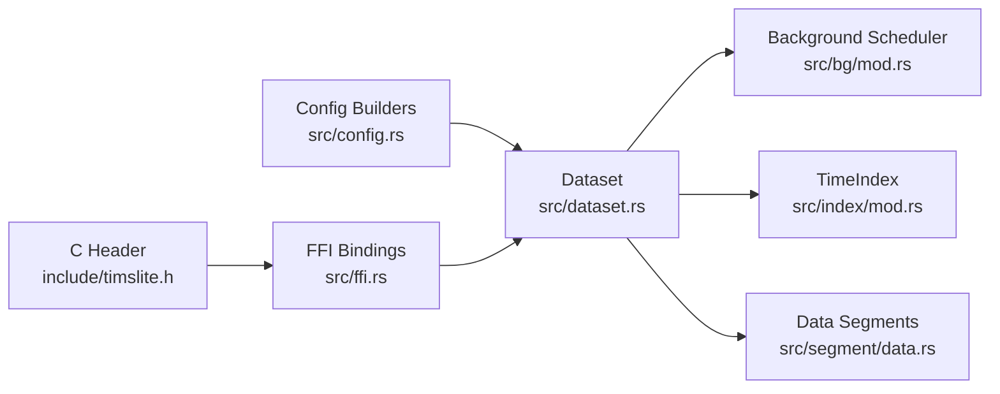
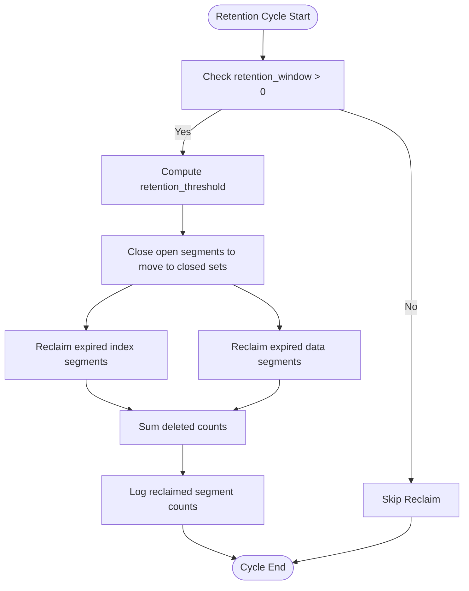

# Retention Policies

<cite>
**Referenced Files in This Document**
- [bg/mod.rs](file://src/bg/mod.rs)
- [dataset.rs](file://src/dataset.rs)
- [index/mod.rs](file://src/index/mod.rs)
- [segment/data.rs](file://src/segment/data.rs)
- [config.rs](file://src/config.rs)
- [ffi.rs](file://src/ffi.rs)
- [timslite.h](file://include/timslite.h)
- [dataset-operations.md](file://docs/design/dataset-operations.md)
- [phase-16-data-retention.md](file://docs/plan/phase-16-data-retention.md)
- [dataset_lifecycle_test.rs](file://tests/dataset_lifecycle_test.rs)
</cite>

## Table of Contents
1. [Introduction](#introduction)
2. [Project Structure](#project-structure)
3. [Core Components](#core-components)
4. [Architecture Overview](#architecture-overview)
5. [Detailed Component Analysis](#detailed-component-analysis)
6. [Dependency Analysis](#dependency-analysis)
7. [Performance Considerations](#performance-considerations)
8. [Troubleshooting Guide](#troubleshooting-guide)
9. [Conclusion](#conclusion)
10. [Appendices](#appendices)

## Introduction
This document explains TimSLite’s data retention and lifecycle management system. It covers retention window configuration, automatic cleanup operations, segment expiration handling, UTC-based retention scheduling, daily cleanup cycles, and retention check hour configuration. It also details the reclaim_expired_segments functionality, space reclamation processes, and data lifecycle management across datasets. Compliance and archival considerations, best practices, monitoring, troubleshooting, retention inheritance, dataset-specific settings, and bulk retention operations are included.

## Project Structure
TimSLite organizes retention logic across several modules:
- Background scheduler orchestrates periodic retention checks and reclaims expired segments.
- Dataset encapsulates retention policies and triggers reclaim operations.
- Index and data segment managers handle expiration checks and physical deletion of closed segments.
- Configuration builders define retention windows and scheduling parameters.
- FFI bindings expose retention configuration to external consumers.

**Diagram sources**
- [bg/mod.rs](file://src/bg/mod.rs)
- [dataset.rs](file://src/dataset.rs)
- [index/mod.rs](file://src/index/mod.rs)
- [segment/data.rs](file://src/segment/data.rs)
- [config.rs](file://src/config.rs)
- [ffi.rs](file://src/ffi.rs)
- [timslite.h](file://include/timslite.h)

**Section sources**
- [bg/mod.rs](file://src/bg/mod.rs)
- [dataset.rs](file://src/dataset.rs)
- [index/mod.rs](file://src/index/mod.rs)
- [segment/data.rs](file://src/segment/data.rs)
- [config.rs](file://src/config.rs)
- [ffi.rs](file://src/ffi.rs)
- [timslite.h](file://include/timslite.h)

## Core Components
- Retention window: A configurable duration that defines the valid time range for stored data. Timestamps outside this window are considered expired.
- Retention threshold: A derived boundary computed from the current time and the retention window.
- Expiration enforcement: Writes and queries validate timestamps against the retention threshold.
- Automatic reclaim: Background scheduler identifies datasets with a positive retention window and runs reclaim operations during scheduled maintenance windows.
- Segment expiration: Closed segments are evaluated independently for data and index segments; only fully expired segments are physically deleted.

Key responsibilities:
- Dataset: Stores retention window, computes threshold, enforces expiration on writes/queries, and triggers reclaim.
- TimeIndex: Manages index segments and deletes expired closed index segments.
- DataSegments: Manages data segments and deletes expired closed data segments.
- Background Scheduler: Schedules and executes retention reclaim across datasets.
- Config: Provides builders to configure retention window and retention check hour.
- FFI: Exposes retention configuration to external consumers.

**Section sources**
- [dataset.rs](file://src/dataset.rs)
- [index/mod.rs](file://src/index/mod.rs)
- [segment/data.rs](file://src/segment/data.rs)
- [config.rs](file://src/config.rs)
- [bg/mod.rs](file://src/bg/mod.rs)

## Architecture Overview
The retention lifecycle integrates configuration, enforcement, and automated cleanup:

**Diagram sources**
- [bg/mod.rs](file://src/bg/mod.rs)
- [dataset.rs](file://src/dataset.rs)
- [index/mod.rs](file://src/index/mod.rs)
- [segment/data.rs](file://src/segment/data.rs)

## Detailed Component Analysis

### Retention Window and Threshold
- Retention window is configured per dataset via configuration builders and persisted with the dataset metadata.
- The retention threshold is computed from the current time and the retention window. Timestamps strictly less than the threshold are expired.
- Enforced on write and query paths to prevent ingestion or retrieval of expired data.

Best practices:
- Align retention window units with timestamp units (e.g., seconds or milliseconds).
- Choose a retention window that balances compliance requirements and query needs.
- Prefer non-zero retention windows to enable automatic cleanup; zero disables retention enforcement.

**Section sources**
- [dataset.rs](file://src/dataset.rs)
- [config.rs](file://src/config.rs)
- [phase-16-data-retention.md](file://docs/plan/phase-16-data-retention.md)

### UTC-Based Retention Scheduling and Daily Cycles
- The background scheduler computes the next retention reclaim time based on a UTC-based delay. The schedule targets a specific UTC hour each day.
- The scheduler maintains a next_retention Instant and a flag indicating whether a retention run is currently in progress.
- When the scheduled time arrives, the scheduler triggers reclaim operations across datasets with a positive retention window.

Operational notes:
- The retention_check_hour determines the UTC hour for daily cleanup.
- The scheduler avoids overlapping runs by tracking retention_running state.
- Reclaim is executed only when the dataset’s retention_window is greater than zero.

**Section sources**
- [bg/mod.rs](file://src/bg/mod.rs)

### Reclaiming Expired Segments
- The reclaim process closes all open segments to move them into closed sets.
- For index segments, the scheduler opens each closed segment briefly (read-only mmap) to read the last entry timestamp, then deletes the file if it is fully expired.
- For data segments, the scheduler uses cached max_timestamp values from closed segments to decide deletion without opening files.
- Both deletions are logged for auditability.

Safety and guarantees:
- Only fully expired segments are deleted; mixed segments remain intact.
- Deletion is destructive and not recoverable.
- During reclaim, opened files are released immediately after inspection.

**Section sources**
- [dataset.rs](file://src/dataset.rs)
- [index/mod.rs](file://src/index/mod.rs)
- [segment/data.rs](file://src/segment/data.rs)
- [dataset-operations.md](file://docs/design/dataset-operations.md)

### Retention Policy Enforcement Across Datasets
- Each dataset independently controls its retention window and participates in background reclaim only if the window is positive.
- Datasets can have different retention windows; there is no global inheritance mechanism.
- Bulk retention operations occur across all enabled datasets during a single scheduled run.

**Section sources**
- [bg/mod.rs](file://src/bg/mod.rs)
- [dataset.rs](file://src/dataset.rs)

### Compliance and Archival Strategies
- Retention enforces a hard boundary for data availability based on timestamps.
- For compliance scenarios requiring immutable records, consider:
  - Using longer retention windows aligned with regulatory periods.
  - Maintaining external archival copies prior to expiration.
  - Avoiding zero retention windows in regulated environments.
- Archival strategies should account for the fact that reclaim deletes entire expired segments; partial recovery within a segment is not supported.

**Section sources**
- [dataset-operations.md](file://docs/design/dataset-operations.md)

### Monitoring Retention Operations
- Logs indicate successful reclaim events with the number of segments deleted per dataset.
- Use logs to track:
  - Scheduled reclaim invocations.
  - Number of index and data segments reclaimed.
  - Errors encountered while reading segment metadata.

Operational tips:
- Monitor background scheduler logs for next_retention updates and retention_running transitions.
- Track reclaimed counts to estimate storage savings and validate retention effectiveness.

**Section sources**
- [bg/mod.rs](file://src/bg/mod.rs)
- [index/mod.rs](file://src/index/mod.rs)
- [segment/data.rs](file://src/segment/data.rs)

### Retention Configuration Best Practices
- Set retention_check_hour to a UTC hour that aligns with your maintenance windows.
- Use DataSetConfigBuilder to set retention_window per dataset; overrides take precedence over inherited defaults.
- Keep retention_window units consistent with timestamp units.
- For continuous mode datasets, reopening preserves remaining segments; reclaimed segments are permanently removed.

**Section sources**
- [config.rs](file://src/config.rs)
- [phase-16-data-retention.md](file://docs/plan/phase-16-data-retention.md)

### FFI and External Integration
- The public C API exposes retention configuration parameters for dataset creation.
- Consumers must pass retention_ms and ensure compatibility with existing calls by adapting to new parameters.

**Section sources**
- [ffi.rs](file://src/ffi.rs)
- [timslite.h](file://include/timslite.h)
- [phase-16-data-retention.md](file://docs/plan/phase-16-data-retention.md)

## Dependency Analysis
Retention depends on:
- Background scheduler for scheduling and triggering reclaim.
- Dataset for computing thresholds and invoking reclaim.
- Index and data segment managers for evaluating and deleting closed segments.
- Configuration builders for setting retention_window and retention_check_hour.
- FFI for exposing configuration to external consumers.

**Diagram sources**
- [config.rs](file://src/config.rs)
- [dataset.rs](file://src/dataset.rs)
- [bg/mod.rs](file://src/bg/mod.rs)
- [index/mod.rs](file://src/index/mod.rs)
- [segment/data.rs](file://src/segment/data.rs)
- [ffi.rs](file://src/ffi.rs)
- [timslite.h](file://include/timslite.h)

**Section sources**
- [config.rs](file://src/config.rs)
- [dataset.rs](file://src/dataset.rs)
- [bg/mod.rs](file://src/bg/mod.rs)
- [index/mod.rs](file://src/index/mod.rs)
- [segment/data.rs](file://src/segment/data.rs)
- [ffi.rs](file://src/ffi.rs)
- [timslite.h](file://include/timslite.h)

## Performance Considerations
- Reclaim operations scan closed segments and delete expired ones; index segment reclaim reads last entry timestamps via read-only mmap and releases immediately.
- Data segment reclaim leverages cached max_timestamp values to avoid file I/O.
- Running reclaim during off-peak UTC hours reduces impact on concurrent write/query workloads.
- Frequent small retention windows increase reclaim frequency; tune retention_check_hour to balance load.

[No sources needed since this section provides general guidance]

## Troubleshooting Guide
Common issues and resolutions:
- No reclaim occurs:
  - Verify retention_window > 0 for the dataset.
  - Confirm retention_check_hour is set and the scheduler’s next_retention Instant is advancing.
- Reclaim deletes nothing:
  - Ensure segments are closed (flush and idle_close_all) before reclaim.
  - Check that timestamps are older than the computed retention threshold.
- Errors reading segment metadata:
  - Inspect warnings in logs indicating failed metadata reads; expired segments with unreadable metadata are skipped to maintain safety.
- Unexpected data loss:
  - Remember reclaim deletes entire expired segments; ensure backups or archival copies exist before enabling aggressive retention windows.

Validation and testing:
- Use dataset lifecycle tests to confirm retention behavior and reclaim outcomes.
- Validate retention window persistence across create/open cycles.

**Section sources**
- [bg/mod.rs](file://src/bg/mod.rs)
- [dataset.rs](file://src/dataset.rs)
- [index/mod.rs](file://src/index/mod.rs)
- [segment/data.rs](file://src/segment/data.rs)
- [dataset_lifecycle_test.rs](file://tests/dataset_lifecycle_test.rs)

## Conclusion
TimSLite’s retention system provides robust, UTC-based scheduling, dataset-scoped enforcement, and efficient segment-level reclaim. By configuring retention windows and check hours appropriately, operators can automate lifecycle management, enforce compliance, and reclaim disk space safely. Use the provided monitoring signals and test coverage to validate behavior and troubleshoot issues effectively.

[No sources needed since this section summarizes without analyzing specific files]

## Appendices

### Retention Flowchart

**Diagram sources**
- [dataset.rs](file://src/dataset.rs)
- [index/mod.rs](file://src/index/mod.rs)
- [segment/data.rs](file://src/segment/data.rs)