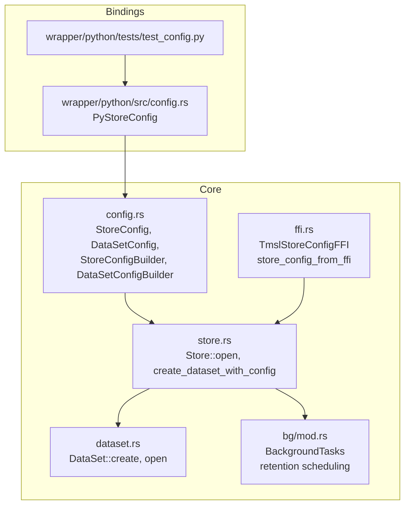
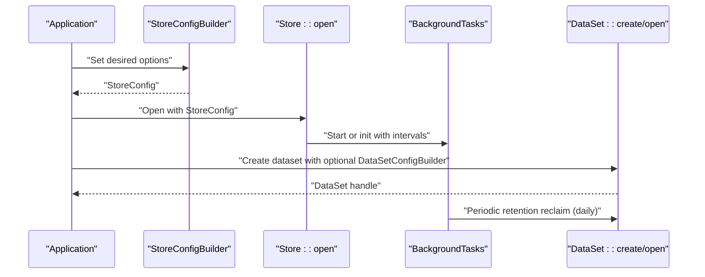
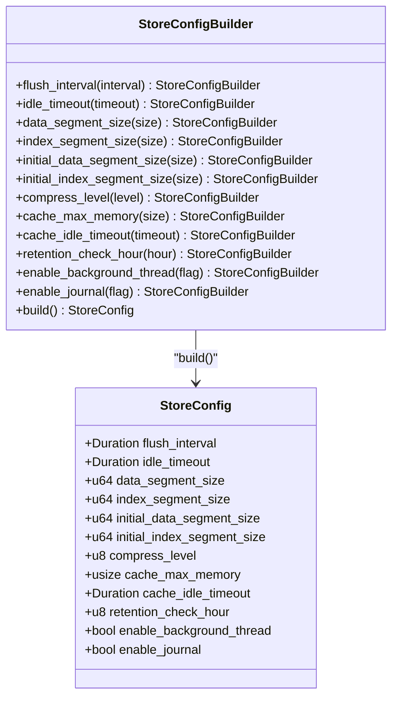
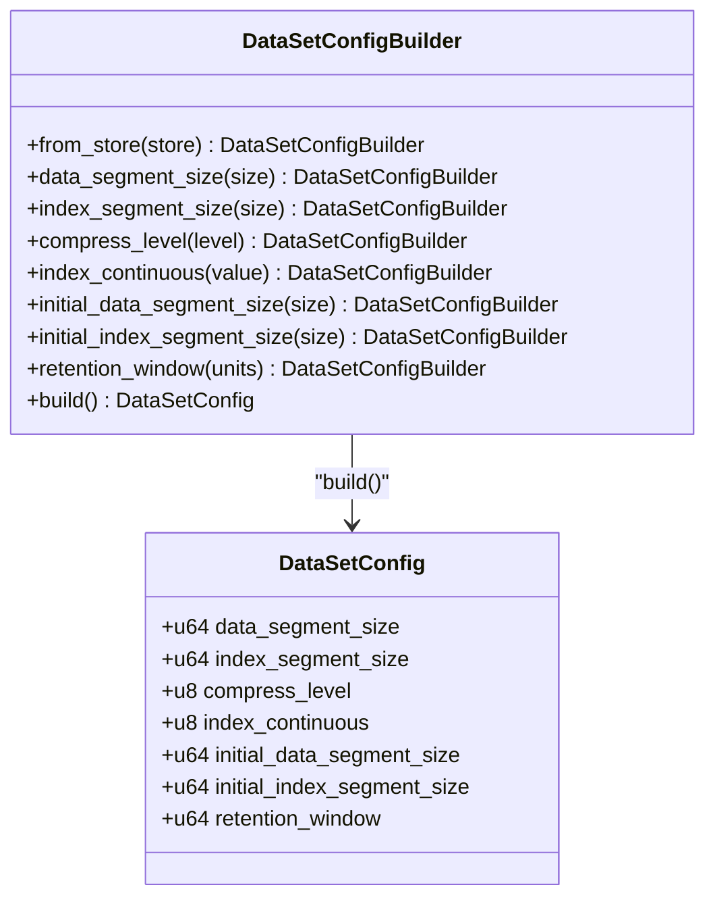
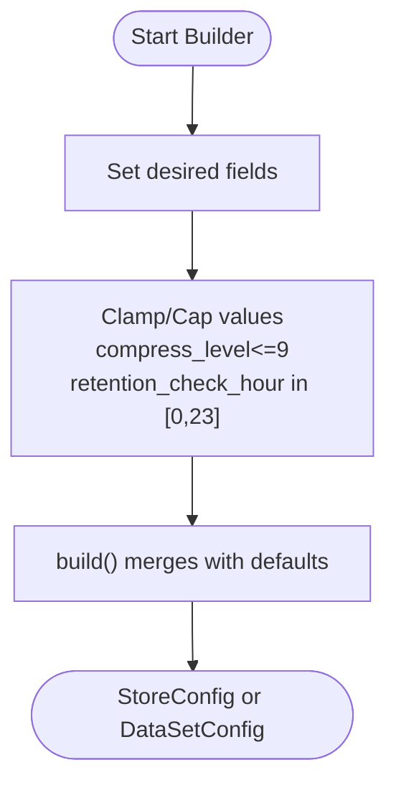
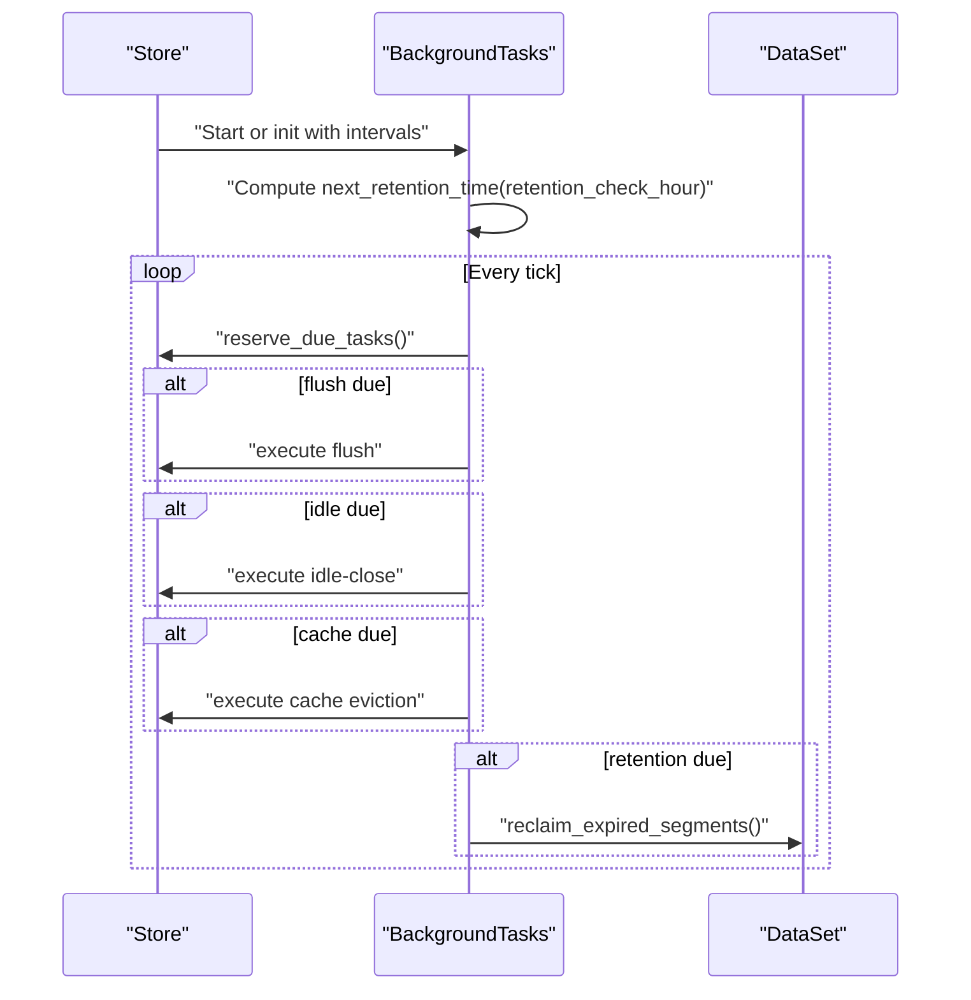
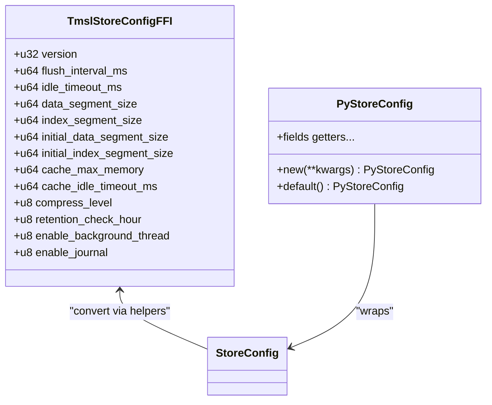
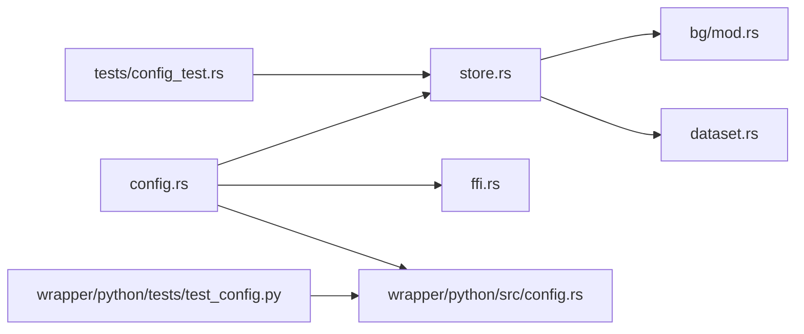

# Configuration Guide

<cite>
**Referenced Files in This Document**
- [config.rs](file://src/config.rs)
- [store.rs](file://src/store.rs)
- [dataset.rs](file://src/dataset.rs)
- [bg/mod.rs](file://src/bg/mod.rs)
- [ffi.rs](file://src/ffi.rs)
- [config.rs (Python wrapper)](file://wrapper/python/src/config.rs)
- [test_config.rs](file://tests/config_test.rs)
- [test_config.py](file://wrapper/python/tests/test_config.py)
</cite>

## Table of Contents
1. [Introduction](#introduction)
2. [Project Structure](#project-structure)
3. [Core Components](#core-components)
4. [Architecture Overview](#architecture-overview)
5. [Detailed Component Analysis](#detailed-component-analysis)
6. [Dependency Analysis](#dependency-analysis)
7. [Performance Considerations](#performance-considerations)
8. [Troubleshooting Guide](#troubleshooting-guide)
9. [Conclusion](#conclusion)
10. [Appendices](#appendices)

## Introduction
This guide documents TimSLite’s configuration model, covering store-level and dataset-level options, performance tuning, memory allocation, retention policies, and runtime behavior. It explains the builder pattern used to construct configurations, validation rules, and how settings propagate from store to dataset. It also provides practical examples for common scenarios and troubleshooting tips.

## Project Structure
TimSLite exposes configuration types and builders in the core Rust module and integrates them across store initialization, dataset creation, background tasks, and FFI wrappers. The Python binding mirrors the Rust configuration API for convenience.

**Diagram sources**
- [config.rs:26-203](file://src/config.rs#L26-L203)
- [store.rs:58-161](file://src/store.rs#L58-L161)
- [dataset.rs:84-200](file://src/dataset.rs#L84-L200)
- [bg/mod.rs:44-134](file://src/bg/mod.rs#L44-L134)
- [ffi.rs:104-227](file://src/ffi.rs#L104-L227)
- [config.rs (Python wrapper):6-122](file://wrapper/python/src/config.rs#L6-L122)
- [test_config.py:1-73](file://wrapper/python/tests/test_config.py#L1-L73)

**Section sources**
- [config.rs:1-501](file://src/config.rs#L1-L501)
- [store.rs:1-200](file://src/store.rs#L1-L200)
- [dataset.rs:1-200](file://src/dataset.rs#L1-L200)
- [bg/mod.rs:1-200](file://src/bg/mod.rs#L1-L200)
- [ffi.rs:1-200](file://src/ffi.rs#L1-L200)
- [config.rs (Python wrapper):1-122](file://wrapper/python/src/config.rs#L1-L122)
- [test_config.rs:1-108](file://tests/config_test.rs#L1-L108)
- [test_config.py:1-73](file://wrapper/python/tests/test_config.py#L1-L73)

## Core Components
- StoreConfig: Global store-level settings applied during Store::open and used as defaults for new datasets.
- DataSetConfig: Per-dataset immutable settings stored in the dataset’s meta file upon creation.
- Builders: StoreConfigBuilder and DataSetConfigBuilder provide a fluent API to assemble configurations with sensible defaults.

Key configuration categories:
- Storage sizing: data_segment_size, index_segment_size, initial_data_segment_size, initial_index_segment_size
- Compression: compress_level (deflate 0–9)
- Memory: cache_max_memory (bytes; 0 disables cache)
- Background tasks: flush_interval, idle_timeout, cache_idle_timeout, enable_background_thread, enable_journal
- Retention: retention_check_hour (UTC hour), retention_window (dataset-level window in timestamp units)

Defaults and behavior are defined in the configuration module and enforced during store initialization and dataset lifecycle.

**Section sources**
- [config.rs:26-203](file://src/config.rs#L26-L203)
- [config.rs:206-345](file://src/config.rs#L206-L345)

## Architecture Overview
The configuration pipeline flows from builder to store-level defaults, then to dataset creation, and finally to background task scheduling and retention checks.

**Diagram sources**
- [config.rs:73-203](file://src/config.rs#L73-L203)
- [store.rs:58-161](file://src/store.rs#L58-L161)
- [bg/mod.rs:103-190](file://src/bg/mod.rs#L103-L190)
- [dataset.rs:84-200](file://src/dataset.rs#L84-L200)

## Detailed Component Analysis

### Store Configuration Model
StoreConfig encapsulates global runtime and storage parameters. It supports:
- Builder-style construction with per-field setters
- Automatic fallback to defaults for unset fields
- Validation via clamping/capping (e.g., compress_level capped at 9, retention_check_hour clamped to 0–23)
- Optional background thread control and journaling toggle

**Diagram sources**
- [config.rs:26-203](file://src/config.rs#L26-L203)

**Section sources**
- [config.rs:26-203](file://src/config.rs#L26-L203)

### Dataset Configuration Model
DataSetConfig defines immutable per-dataset parameters stored in the dataset’s meta file. It inherits defaults from StoreConfig when created without overrides.

**Diagram sources**
- [config.rs:206-345](file://src/config.rs#L206-L345)

**Section sources**
- [config.rs:206-345](file://src/config.rs#L206-L345)
- [dataset.rs:84-200](file://src/dataset.rs#L84-L200)

### Builder Pattern and Validation Rules
- StoreConfigBuilder setters cap or clamp values where applicable (e.g., compress_level max 9, retention_check_hour in [0,23]).
- build() merges provided values with StoreConfig::default(), ensuring no field remains unset.
- DataSetConfigBuilder::from_store() pre-fills fields from StoreConfig; unspecified fields inherit store defaults; index_continuous defaults to 0.

**Diagram sources**
- [config.rs:97-203](file://src/config.rs#L97-L203)
- [config.rs:269-345](file://src/config.rs#L269-L345)

**Section sources**
- [config.rs:97-203](file://src/config.rs#L97-L203)
- [config.rs:269-345](file://src/config.rs#L269-L345)

### Runtime Configuration Behavior
- Store::open reads StoreConfig and initializes:
  - Journal manager
  - Block cache with cache_max_memory
  - BackgroundTasks either as a spawned thread or as an executor requiring manual ticks
- BackgroundTasks schedules:
  - Flush cycles (mmap sync)
  - Idle-close checks
  - Cache eviction
  - Daily retention reclaim at retention_check_hour UTC

**Diagram sources**
- [store.rs:138-158](file://src/store.rs#L138-L158)
- [bg/mod.rs:103-190](file://src/bg/mod.rs#L103-L190)
- [bg/mod.rs:387-439](file://src/bg/mod.rs#L387-L439)

**Section sources**
- [store.rs:138-158](file://src/store.rs#L138-L158)
- [bg/mod.rs:73-96](file://src/bg/mod.rs#L73-L96)
- [bg/mod.rs:387-439](file://src/bg/mod.rs#L387-L439)

### Environment-Specific Settings and FFI Integration
- FFI exposes TmslStoreConfigFFI with versioning and conversion helpers to/from StoreConfig.
- Python wrapper PyStoreConfig mirrors StoreConfig fields and defaults, enabling kwargs-based configuration.

**Diagram sources**
- [ffi.rs:104-227](file://src/ffi.rs#L104-L227)
- [config.rs (Python wrapper):6-122](file://wrapper/python/src/config.rs#L6-L122)

**Section sources**
- [ffi.rs:104-227](file://src/ffi.rs#L104-L227)
- [config.rs (Python wrapper):6-122](file://wrapper/python/src/config.rs#L6-L122)

## Dependency Analysis
Configuration dependencies across modules:

**Diagram sources**
- [config.rs:1-501](file://src/config.rs#L1-L501)
- [store.rs:1-200](file://src/store.rs#L1-L200)
- [dataset.rs:1-200](file://src/dataset.rs#L1-L200)
- [bg/mod.rs:1-200](file://src/bg/mod.rs#L1-L200)
- [ffi.rs:1-200](file://src/ffi.rs#L1-L200)
- [config.rs (Python wrapper):1-122](file://wrapper/python/src/config.rs#L1-L122)
- [test_config.rs:1-108](file://tests/config_test.rs#L1-L108)
- [test_config.py:1-73](file://wrapper/python/tests/test_config.py#L1-L73)

**Section sources**
- [config.rs:1-501](file://src/config.rs#L1-L501)
- [store.rs:1-200](file://src/store.rs#L1-L200)
- [dataset.rs:1-200](file://src/dataset.rs#L1-L200)
- [bg/mod.rs:1-200](file://src/bg/mod.rs#L1-L200)
- [ffi.rs:1-200](file://src/ffi.rs#L1-L200)
- [config.rs (Python wrapper):1-122](file://wrapper/python/src/config.rs#L1-L122)
- [test_config.rs:1-108](file://tests/config_test.rs#L1-L108)
- [test_config.py:1-73](file://wrapper/python/tests/test_config.py#L1-L73)

## Performance Considerations
- Segment sizing:
  - data_segment_size and index_segment_size control maximum segment sizes; larger sizes reduce index overhead but increase idle-close and retention reclaim costs.
  - initial_data_segment_size and initial_index_segment_size allow smaller startup footprints, expanding to configured maximums.
- Compression:
  - compress_level 0 disables compression; higher levels trade CPU for reduced disk usage. Choose based on workload characteristics.
- Cache:
  - cache_max_memory controls read block cache capacity; set to 0 to disable caching. cache_idle_timeout governs eviction timing.
- Background intervals:
  - flush_interval balances durability and fsync frequency; shorter intervals increase CPU/disk activity.
  - idle_timeout reduces resource usage by closing inactive segments; tune for workload access patterns.
- Retention:
  - retention_check_hour determines daily reclaim timing; align with maintenance windows.
  - retention_window sets data validity in timestamp units; ensure it matches your timestamp granularity and retention needs.

[No sources needed since this section provides general guidance]

## Troubleshooting Guide
Common configuration issues and resolutions:
- Unexpected defaults after opening a store:
  - Verify StoreConfigBuilder was used or defaults applied intentionally. Confirm store defaults are as expected.
- Builder values outside allowed ranges:
  - compress_level is capped at 9; retention_check_hour is clamped to 0–23. Adjust accordingly.
- Manual background tasks required:
  - When enable_background_thread is false, call Store::tick_background_tasks() periodically to drive flush, idle, cache, and retention.
- Dataset inherits unexpected settings:
  - When creating datasets without a builder, all fields inherit from StoreConfig. Use DataSetConfigBuilder::from_store() to override selectively.
- FFI version mismatch:
  - TmslStoreConfigFFI has a version field; ensure client code uses a compatible version to avoid “unsupported store config version” errors.
- Python kwargs not taking effect:
  - Ensure PyStoreConfig kwargs are passed correctly; confirm defaults and overrides in tests.

**Section sources**
- [config.rs:134-156](file://src/config.rs#L134-L156)
- [config.rs:415-421](file://src/config.rs#L415-L421)
- [store.rs:148-158](file://src/store.rs#L148-L158)
- [ffi.rs:198-227](file://src/ffi.rs#L198-L227)
- [test_config.py:22-46](file://wrapper/python/tests/test_config.py#L22-L46)

## Conclusion
TimSLite’s configuration model centers on robust defaults, explicit builders, and clear separation between store-level and dataset-level concerns. By leveraging builders and understanding background task scheduling, operators can tailor performance, memory usage, and retention policies to diverse deployment scenarios while maintaining predictable behavior and strong validation.

[No sources needed since this section summarizes without analyzing specific files]

## Appendices

### Configuration Options Reference
- Store-level (StoreConfig)
  - flush_interval: Duration between flush cycles
  - idle_timeout: Duration before segments are idle-closed
  - data_segment_size: Default maximum data segment size
  - index_segment_size: Default maximum index segment size
  - initial_data_segment_size: Initial data segment size (expands to data_segment_size)
  - initial_index_segment_size: Initial index segment size (expands to index_segment_size)
  - compress_level: Deflate compression level (0–9)
  - cache_max_memory: Read cache capacity in bytes (0 disables)
  - cache_idle_timeout: Cache entry idle timeout
  - retention_check_hour: UTC hour for daily retention reclaim
  - enable_background_thread: Launch background thread (auto) or manual tick
  - enable_journal: Enable built-in change log

- Dataset-level (DataSetConfig)
  - data_segment_size: Immutable after creation
  - index_segment_size: Immutable after creation
  - compress_level: Immutable after creation
  - index_continuous: 0=non-continuous, 1=continuous storage
  - initial_data_segment_size: Immutable after creation
  - initial_index_segment_size: Immutable after creation
  - retention_window: Data validity window in timestamp units (0=no limit)

**Section sources**
- [config.rs:26-203](file://src/config.rs#L26-L203)
- [config.rs:206-345](file://src/config.rs#L206-L345)

### Best Practices by Deployment Scenario
- High-throughput logging
  - Increase data_segment_size and index_segment_size to reduce index overhead.
  - Keep flush_interval moderate to balance durability and fsync cost.
  - Consider cache_max_memory > 0 for read-heavy workloads.
- Long-term data archiving
  - Set retention_window to enforce automatic reclaim of expired data.
  - Align retention_check_hour with off-peak hours.
  - Use higher compress_level to reduce disk footprint.
- Real-time analytics
  - Tune idle_timeout to keep hot segments open.
  - Disable cache_max_memory if memory is constrained and accept higher read latency.
  - Prefer continuous index mode (index_continuous=1) for sparse writes within a segment.

[No sources needed since this section provides general guidance]

### Example Workflows
- Using store defaults for a dataset
  - Open store with StoreConfig; create dataset without a builder to inherit all store defaults.
  - See integration test for default inheritance behavior.

- Overriding specific dataset settings
  - Pre-fill a DataSetConfigBuilder from StoreConfig and override selected fields (e.g., compress_level).
  - Use create_dataset_with_config to apply the builder.

- Python kwargs usage
  - Pass kwargs to PyStoreConfig to customize fields; confirm behavior via tests.

**Section sources**
- [test_config.rs:18-43](file://tests/config_test.rs#L18-L43)
- [test_config.rs:46-76](file://tests/config_test.rs#L46-L76)
- [test_config.py:47-73](file://wrapper/python/tests/test_config.py#L47-L73)