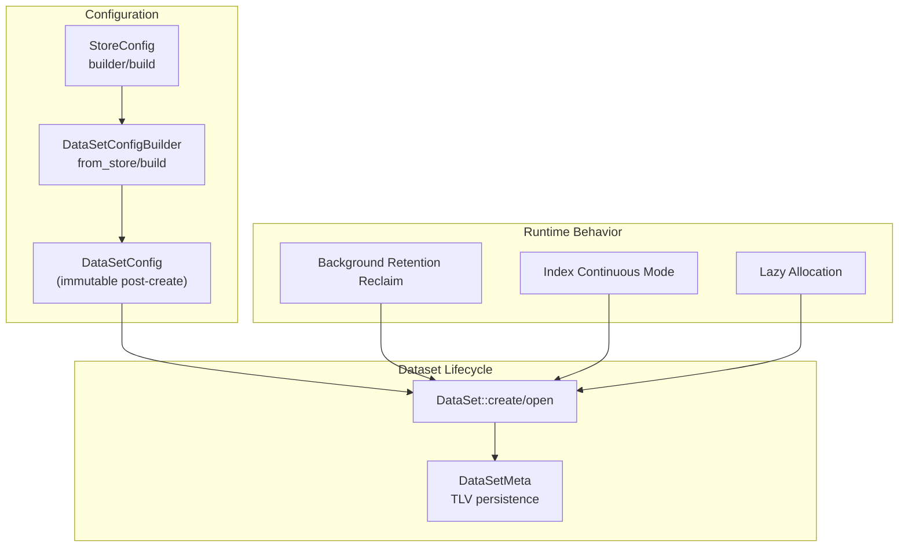
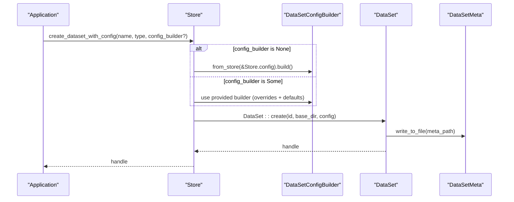
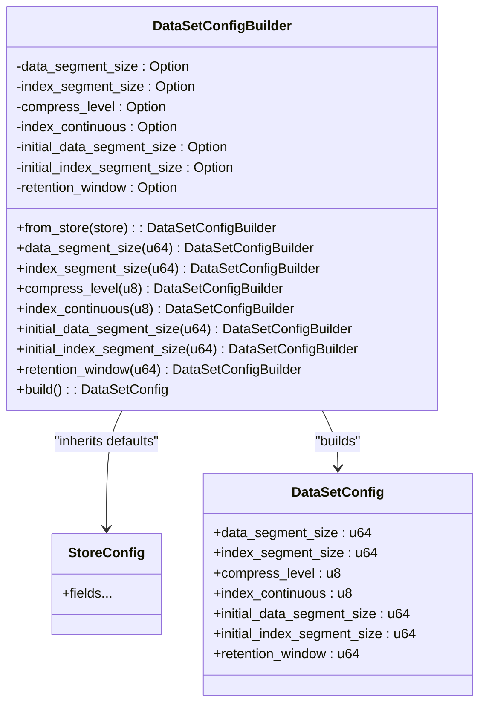
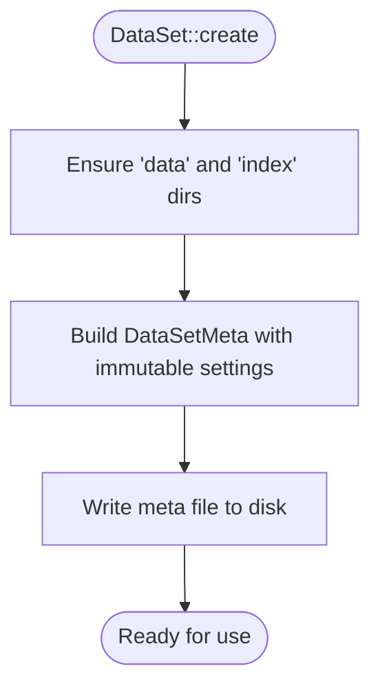
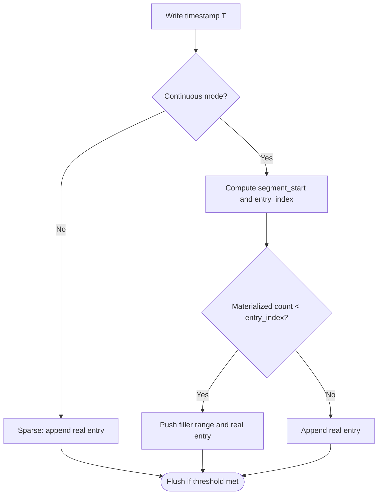
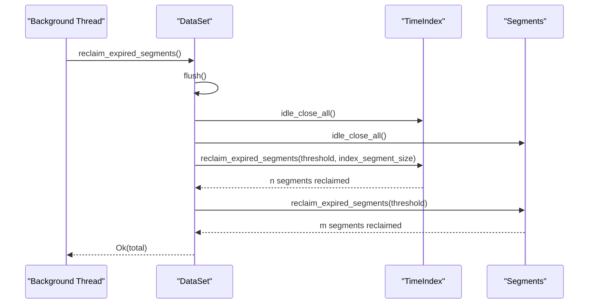
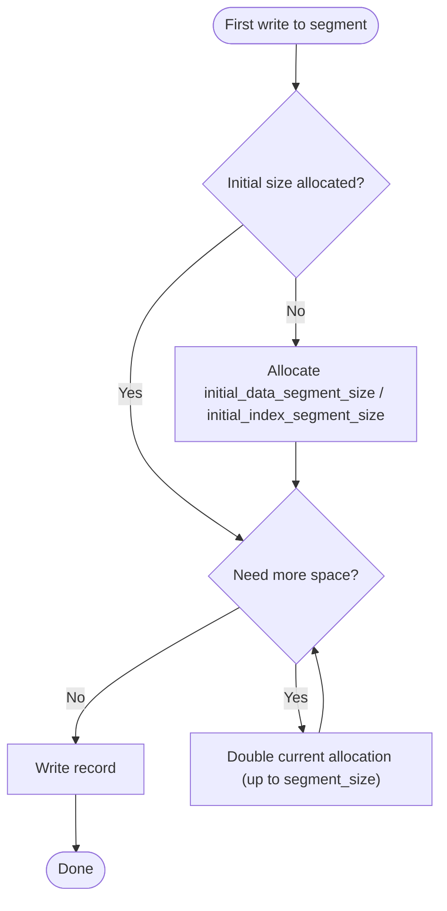
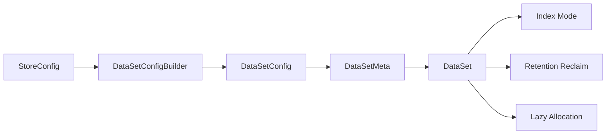

# Dataset Configuration

<cite>
**Referenced Files in This Document**
- [config.rs](file://src/config.rs)
- [dataset.rs](file://src/dataset.rs)
- [meta.rs](file://src/meta.rs)
- [bg/mod.rs](file://src/bg/mod.rs)
- [index/mod.rs](file://src/index/mod.rs)
- [lazy-allocation.md](file://docs/design/lazy-allocation.md)
- [phase-14-dataset-config-builder.md](file://docs/plan/phase-14-dataset-config-builder.md)
- [phase-16-data-retention.md](file://docs/plan/phase-16-data-retention.md)
- [dataset-operations.md](file://docs/design/dataset-operations.md)
- [phase-10-continuous-storage.md](file://docs/plan/phase-10-continuous-storage.md)
- [phase-24-sparse-continuous-index.md](file://docs/plan/phase-24-sparse-continuous-index.md)
- [config_test.rs](file://tests/config_test.rs)
</cite>

## Table of Contents
1. [Introduction](#introduction)
2. [Project Structure](#project-structure)
3. [Core Components](#core-components)
4. [Architecture Overview](#architecture-overview)
5. [Detailed Component Analysis](#detailed-component-analysis)
6. [Dependency Analysis](#dependency-analysis)
7. [Performance Considerations](#performance-considerations)
8. [Troubleshooting Guide](#troubleshooting-guide)
9. [Conclusion](#conclusion)
10. [Appendices](#appendices)

## Introduction
This document explains TimSLite dataset-level configuration with a focus on the DataSetConfig builder pattern, store-level defaults, and dataset overrides. It covers:
- Segment sizing and initial allocation parameters
- Compression levels
- Index continuity mode and its performance trade-offs
- Retention window for lifecycle management
- Validation rules and inheritance behavior
- Practical configuration examples for typical workloads

## Project Structure
TimSLite’s dataset configuration spans several modules:
- Store and dataset configuration builders
- Dataset creation and persistence of immutable settings
- Background retention reclamation
- Index continuous/sparse behavior
- Lazy allocation design for initial segment sizes

**Diagram sources**
- [config.rs:25-203](file://src/config.rs#L25-L203)
- [config.rs:238-306](file://src/config.rs#L238-L306)
- [dataset.rs:84-125](file://src/dataset.rs#L84-L125)
- [meta.rs:197-232](file://src/meta.rs#L197-L232)
- [bg/mod.rs:387-425](file://src/bg/mod.rs#L387-L425)
- [index/mod.rs:307-339](file://src/index/mod.rs#L307-L339)
- [lazy-allocation.md:1-39](file://docs/design/lazy-allocation.md#L1-L39)

**Section sources**
- [config.rs:25-203](file://src/config.rs#L25-L203)
- [config.rs:238-306](file://src/config.rs#L238-L306)
- [dataset.rs:84-125](file://src/dataset.rs#L84-L125)
- [meta.rs:197-232](file://src/meta.rs#L197-L232)
- [bg/mod.rs:387-425](file://src/bg/mod.rs#L387-L425)
- [index/mod.rs:307-339](file://src/index/mod.rs#L307-L339)
- [lazy-allocation.md:1-39](file://docs/design/lazy-allocation.md#L1-L39)

## Core Components
- StoreConfig: Defines store-wide defaults for segment sizes, compression, initial allocations, caching, background thread, and retention scheduling.
- DataSetConfigBuilder: Pre-fills defaults from StoreConfig, allows selective overrides, and sets index_continuous default to 0.
- DataSetConfig: Immutable dataset configuration persisted in the dataset meta file.
- DataSetMeta: Persists immutable dataset settings (including retention_window) as TLVs.
- Background Retention Reclaim: Periodically removes expired segments based on retention_window.
- Index Continuous Mode: Controls whether index entries are stored contiguously with sparse filler segments.

**Section sources**
- [config.rs:25-203](file://src/config.rs#L25-L203)
- [config.rs:238-306](file://src/config.rs#L238-L306)
- [config.rs:206-236](file://src/config.rs#L206-L236)
- [meta.rs:197-232](file://src/meta.rs#L197-L232)
- [bg/mod.rs:387-425](file://src/bg/mod.rs#L387-L425)
- [index/mod.rs:307-339](file://src/index/mod.rs#L307-L339)

## Architecture Overview
The dataset configuration pipeline:
- Store opens with StoreConfig defaults
- Store::create_dataset_with_config accepts an optional DataSetConfigBuilder
- If None, builder is pre-filled from StoreConfig and built
- If Some(builder), only specified fields are set; unset fields inherit StoreConfig defaults
- DataSet::create persists immutable settings into meta file
- Runtime behavior (compression, lazy allocation, retention) uses these persisted settings

**Diagram sources**
- [phase-14-dataset-config-builder.md:37-71](file://docs/plan/phase-14-dataset-config-builder.md#L37-L71)
- [config.rs:238-306](file://src/config.rs#L238-L306)
- [dataset.rs:84-125](file://src/dataset.rs#L84-L125)
- [meta.rs:197-232](file://src/meta.rs#L197-L232)

## Detailed Component Analysis

### DataSetConfigBuilder and Inheritance from Store Defaults
- Pre-fill defaults via from_store(store_config)
- Unset fields inherit store defaults
- index_continuous defaults to 0 (sparse mode)
- Optional retention_window supported

**Diagram sources**
- [config.rs:238-306](file://src/config.rs#L238-L306)
- [config.rs:206-236](file://src/config.rs#L206-L236)
- [phase-14-dataset-config-builder.md:9-26](file://docs/plan/phase-14-dataset-config-builder.md#L9-L26)

**Section sources**
- [config.rs:238-306](file://src/config.rs#L238-L306)
- [phase-14-dataset-config-builder.md:9-26](file://docs/plan/phase-14-dataset-config-builder.md#L9-L26)

### Immutable Dataset Settings and Persistence
- DataSet::create writes immutable settings to meta file
- These settings cannot be changed after creation
- Includes segment sizes, compression, initial allocations, index continuity, and retention window

**Diagram sources**
- [dataset.rs:84-125](file://src/dataset.rs#L84-L125)

**Section sources**
- [dataset.rs:84-125](file://src/dataset.rs#L84-L125)

### Index Continuity Mode: Sparse vs Continuous
- index_continuous = 0: Sparse mode (default)
- index_continuous = 1: Continuous mode with sparse filler segments
- Continuous mode uses a logical grid and sparse filler to avoid full-materialization of gaps
- Hole invariants are enforced during upserts

**Diagram sources**
- [index/mod.rs:307-339](file://src/index/mod.rs#L307-L339)
- [phase-24-sparse-continuous-index.md:1-29](file://docs/plan/phase-24-sparse-continuous-index.md#L1-L29)

**Section sources**
- [index/mod.rs:307-339](file://src/index/mod.rs#L307-L339)
- [phase-10-continuous-storage.md:18-25](file://docs/plan/phase-10-continuous-storage.md#L18-L25)
- [phase-24-sparse-continuous-index.md:1-29](file://docs/plan/phase-24-sparse-continuous-index.md#L1-L29)

### Retention Window and Automatic Lifecycle Management
- retention_window is stored in meta as a TLV (type 0x08)
- Unit must match the dataset’s timestamp unit
- When > 0, background reclaim removes expired segments based on latest_written_timestamp minus retention_window
- Queries are constrained to the valid time range

**Diagram sources**
- [bg/mod.rs:387-425](file://src/bg/mod.rs#L387-L425)
- [dataset-operations.md:566-613](file://docs/design/dataset-operations.md#L566-L613)
- [phase-16-data-retention.md:1-39](file://docs/plan/phase-16-data-retention.md#L1-L39)

**Section sources**
- [bg/mod.rs:387-425](file://src/bg/mod.rs#L387-L425)
- [dataset-operations.md:566-613](file://docs/design/dataset-operations.md#L566-L613)
- [phase-16-data-retention.md:1-39](file://docs/plan/phase-16-data-retention.md#L1-L39)

### Initial Segment Sizes and Lazy Allocation
- initial_data_segment_size and initial_index_segment_size define initial allocation sizes
- Lazy allocation expands segments up to configured segment_size during write
- Constraints ensure initial sizes do not exceed maximum sizes and meet minimum header requirements

**Diagram sources**
- [lazy-allocation.md:1-39](file://docs/design/lazy-allocation.md#L1-L39)

**Section sources**
- [lazy-allocation.md:17-39](file://docs/design/lazy-allocation.md#L17-L39)

### Configuration Validation Rules
- data_segment_size and index_segment_size must be greater than zero
- compress_level must be within [0..9]
- index_continuous must be 0 or 1
- initial_data_segment_size and initial_index_segment_size must be greater than zero and less than or equal to respective segment_size
- If initial_* equals segment_size, behavior degrades to full pre-allocation

**Section sources**
- [meta.rs:197-232](file://src/meta.rs#L197-L232)

## Dependency Analysis
- StoreConfig drives defaults for DataSetConfigBuilder
- DataSetConfig is immutable and persisted in DataSetMeta
- Runtime behavior depends on persisted settings:
  - Compression and segment sizes influence IO and CPU
  - Index continuity affects write amplification and lookup locality
  - Retention window triggers background reclaim and constrains queries
  - Lazy allocation reduces initial disk footprint but may increase write-time expansions

**Diagram sources**
- [config.rs:25-203](file://src/config.rs#L25-L203)
- [config.rs:238-306](file://src/config.rs#L238-L306)
- [meta.rs:197-232](file://src/meta.rs#L197-L232)
- [dataset.rs:84-125](file://src/dataset.rs#L84-L125)
- [bg/mod.rs:387-425](file://src/bg/mod.rs#L387-L425)

**Section sources**
- [config.rs:25-203](file://src/config.rs#L25-L203)
- [config.rs:238-306](file://src/config.rs#L238-L306)
- [meta.rs:197-232](file://src/meta.rs#L197-L232)
- [dataset.rs:84-125](file://src/dataset.rs#L84-L125)
- [bg/mod.rs:387-425](file://src/bg/mod.rs#L387-L425)

## Performance Considerations
- Compression levels (0–9):
  - Lower levels reduce CPU overhead and improve random read/write latency
  - Higher levels increase CPU and IO during flush/reclaim; choose based on storage cost vs CPU budget
- Segment sizes:
  - Larger segments reduce metadata overhead and improve sequential IO throughput
  - Smaller segments reduce worst-case expansion cost and memory pressure
- Index continuity:
  - Continuous mode improves locality for dense time series but increases write amplification for sparse data due to filler entries
  - Sparse mode minimizes filler writes but may increase index traversal for gaps
- Lazy allocation:
  - Reduces initial disk usage and startup time for small datasets
  - Can cause temporary spikes during early growth; plan initial sizes accordingly
- Retention window:
  - Enables predictable disk usage via background reclaim
  - Threshold computation uses saturating subtraction; ensure timestamps and retention units align

[No sources needed since this section provides general guidance]

## Troubleshooting Guide
- Symptom: Unexpectedly large disk usage immediately after creation
  - Cause: initial_data_segment_size or initial_index_segment_size set too low, triggering rapid expansion
  - Action: Increase initial sizes or rely on lazy allocation defaults
- Symptom: High CPU during writes for sparse datasets
  - Cause: Continuous index mode with frequent gaps leading to filler generation
  - Action: Switch to sparse mode (index_continuous = 0) or adjust write cadence
- Symptom: Queries return fewer results than expected
  - Cause: retention_window filtering out older data
  - Action: Verify retention_window and timestamp units; adjust or disable retention if needed
- Symptom: Errors about invalid configuration
  - Cause: compress_level outside [0..9], index_continuous not 0/1, or initial sizes exceeding segment_size
  - Action: Correct values per validation rules

**Section sources**
- [meta.rs:197-232](file://src/meta.rs#L197-L232)
- [lazy-allocation.md:17-39](file://docs/design/lazy-allocation.md#L17-L39)
- [dataset-operations.md:566-613](file://docs/design/dataset-operations.md#L566-L613)

## Conclusion
TimSLite’s dataset configuration centers on an explicit builder pattern that inherits robust defaults from StoreConfig while allowing targeted overrides. Immutable dataset settings ensure predictable runtime behavior, while continuous index mode and retention policies provide flexibility for diverse workloads. Proper tuning of segment sizes, compression, and initial allocations balances startup cost, write amplification, and long-term storage efficiency.

[No sources needed since this section summarizes without analyzing specific files]

## Appendices

### Best Practices by Use Case
- Sensor data collection (high-frequency, bursty writes)
  - Prefer sparse index mode (index_continuous = 0)
  - Moderate compression (level 4–6) to balance CPU and storage
  - Enable retention with a window aligned to data freshness needs
  - Use moderate segment sizes to reduce fragmentation without excessive pre-allocation
- Financial tick data (dense, near-continuous writes)
  - Consider continuous index mode (index_continuous = 1) for improved locality
  - Lower compression (level 1–3) to minimize write amplification
  - Retention window to cap historical depth; reclaim during off-peak hours
- Application logs (high volume, short-lived retention)
  - Sparse index mode (index_continuous = 0)
  - Higher compression (level 7–9) to reduce storage costs
  - Short retention window; rely on background reclaim to maintain disk headroom

[No sources needed since this section provides general guidance]

### Configuration Validation Checklist
- data_segment_size > 0 and index_segment_size > 0
- compress_level ∈ [0..9]
- index_continuous ∈ {0, 1}
- initial_data_segment_size > 0 and ≤ data_segment_size
- initial_index_segment_size > 0 and ≤ index_segment_size
- retention_window ≥ 0 (0 disables retention)

**Section sources**
- [meta.rs:197-232](file://src/meta.rs#L197-L232)

### Examples: Dataset-Specific Configurations
- Sensor temperature dataset
  - data_segment_size: inherited from StoreConfig
  - index_segment_size: inherited from StoreConfig
  - compress_level: overridden to 6
  - index_continuous: overridden to 0 (sparse)
  - initial_data_segment_size: inherited from StoreConfig
  - initial_index_segment_size: inherited from StoreConfig
  - retention_window: set to 7 days in seconds
- Financial OHLC dataset
  - data_segment_size: inherited from StoreConfig
  - index_segment_size: inherited from StoreConfig
  - compress_level: overridden to 3
  - index_continuous: overridden to 1 (continuous)
  - initial_data_segment_size: inherited from StoreConfig
  - initial_index_segment_size: inherited from StoreConfig
  - retention_window: set to 30 days in seconds
- Application logs dataset
  - data_segment_size: inherited from StoreConfig
  - index_segment_size: inherited from StoreConfig
  - compress_level: overridden to 9
  - index_continuous: overridden to 0 (sparse)
  - initial_data_segment_size: inherited from StoreConfig
  - initial_index_segment_size: inherited from StoreConfig
  - retention_window: set to 1 day in seconds

**Section sources**
- [phase-14-dataset-config-builder.md:243-257](file://docs/plan/phase-14-dataset-config-builder.md#L243-L257)
- [config_test.rs:17-47](file://tests/config_test.rs#L17-L47)