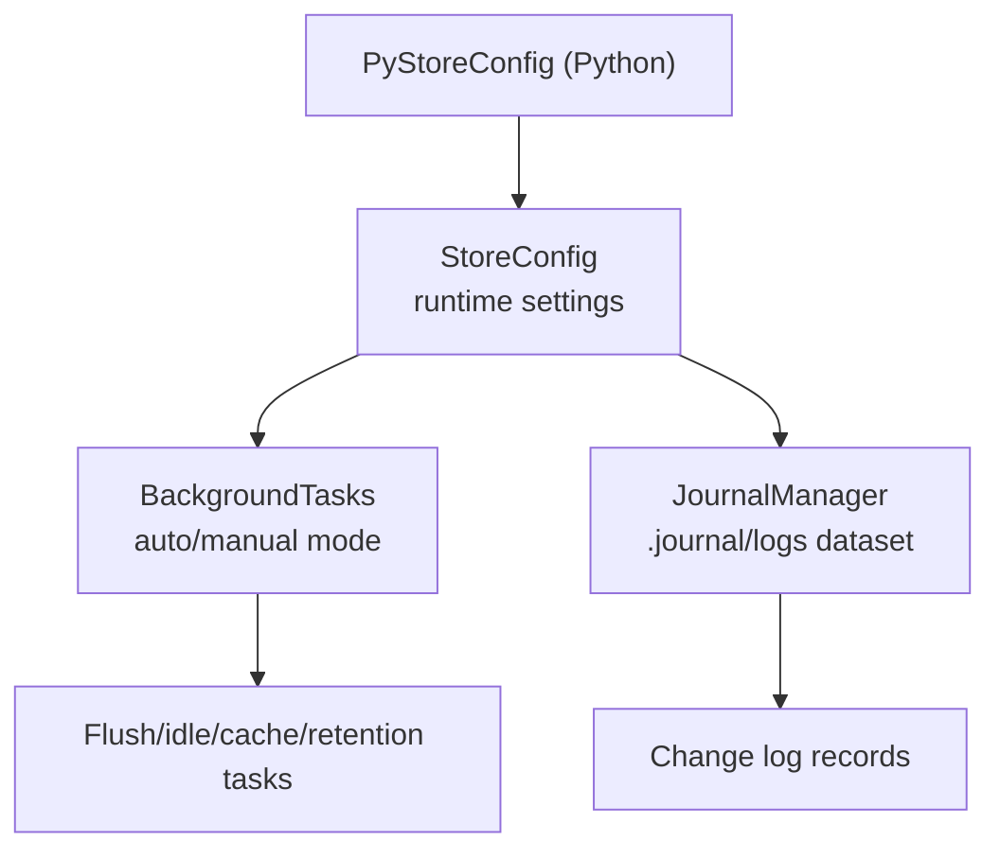
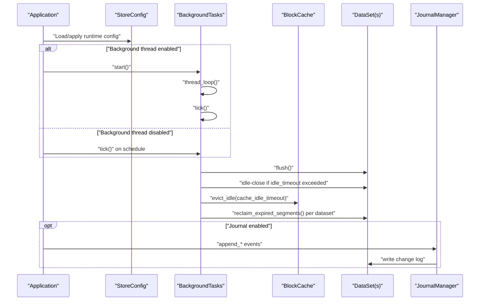
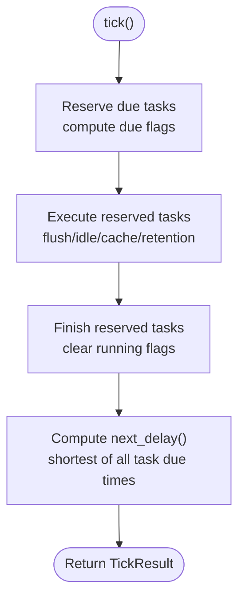
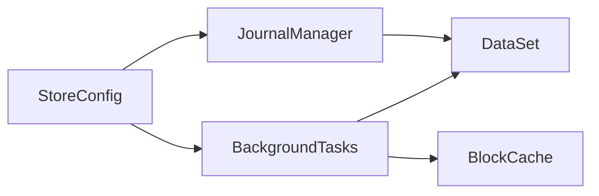

# Operational Configuration

<cite>
**Referenced Files in This Document**
- [config.rs](file://src/config.rs)
- [mod.rs (Background Tasks)](file://src/bg/mod.rs)
- [mod.rs (Journal)](file://src/journal/mod.rs)
- [config.rs (Python Wrapper)](file://wrapper/python/src/config.rs)
- [Cargo.toml](file://Cargo.toml)
- [phase-21-manual-bg-execution.md](file://docs/plan/phase-21-manual-bg-execution.md)
- [phase-28-journal.md](file://docs/design/journal.md)
- [background-and-cache.md](file://docs/design/background-and-cache.md)
- [store-and-ffi.md](file://docs/design/store-and-ffi.md)
- [test_store_manual_bg.py](file://wrapper/python/tests/test_store_manual_bg.py)
</cite>

## Table of Contents
1. [Introduction](#introduction)
2. [Project Structure](#project-structure)
3. [Core Components](#core-components)
4. [Architecture Overview](#architecture-overview)
5. [Detailed Component Analysis](#detailed-component-analysis)
6. [Dependency Analysis](#dependency-analysis)
7. [Performance Considerations](#performance-considerations)
8. [Troubleshooting Guide](#troubleshooting-guide)
9. [Conclusion](#conclusion)
10. [Appendices](#appendices)

## Introduction
This document provides operational configuration guidance for TimSLite production deployments. It covers runtime configuration management, environment-specific settings, background thread management, journal settings, retention policies, manual background task execution, monitoring and logging, maintenance scheduling, disaster recovery, backup strategies, data retention, security considerations, access controls, compliance, operational checklists, health monitoring, and troubleshooting.

## Project Structure
TimSLite exposes configuration and operational capabilities through Rust core modules and a Python FFI wrapper. The primary operational surfaces are:
- Store-level configuration controlling flush intervals, idle timeouts, cache behavior, retention scheduling, background thread enablement, and journal enablement.
- Background task executor supporting automatic or manual execution modes.
- Journal subsystem providing an internal change log dataset for auditability and recovery support.
- Python bindings enabling configuration via keyword arguments.

**Diagram sources**
- [config.rs:26-71](file://src/config.rs#L26-L71)
- [mod.rs (Background Tasks):44-54](file://src/bg/mod.rs#L44-L54)
- [mod.rs (Journal):321-327](file://src/journal/mod.rs#L321-L327)
- [config.rs (Python Wrapper):6-122](file://wrapper/python/src/config.rs#L6-L122)

**Section sources**
- [config.rs:26-71](file://src/config.rs#L26-L71)
- [mod.rs (Background Tasks):44-54](file://src/bg/mod.rs#L44-L54)
- [mod.rs (Journal):321-327](file://src/journal/mod.rs#L321-L327)
- [config.rs (Python Wrapper):6-122](file://wrapper/python/src/config.rs#L6-L122)

## Core Components
- StoreConfig: Defines store-wide defaults for newly created datasets and operational behavior. Includes flush interval, idle timeout, segment sizes, compression level, cache memory and idle timeout, retention check hour, background thread enablement, and journal enablement.
- BackgroundTasks: Manages periodic tasks (flush, idle-close, cache eviction, retention reclaim) in either auto-spawned thread or manual invocation mode.
- JournalManager: Controls the internal .journal/logs dataset used for change logging when enabled.
- PyStoreConfig: Python-side configuration exposing StoreConfig fields as keyword arguments.

Operational controls:
- Background thread management: enable/disable automatic background thread; manual tick orchestration when disabled.
- Journal settings: enable/disable the built-in change log dataset.
- Retention policies: UTC hour for daily retention reclaim and per-dataset retention window.

**Section sources**
- [config.rs:26-71](file://src/config.rs#L26-L71)
- [config.rs:80-203](file://src/config.rs#L80-L203)
- [mod.rs (Background Tasks):44-54](file://src/bg/mod.rs#L44-L54)
- [mod.rs (Background Tasks):103-190](file://src/bg/mod.rs#L103-L190)
- [mod.rs (Journal):321-327](file://src/journal/mod.rs#L321-L327)
- [config.rs (Python Wrapper):14-46](file://wrapper/python/src/config.rs#L14-L46)

## Architecture Overview
The operational runtime integrates configuration-driven behavior with background task scheduling and optional journaling.

**Diagram sources**
- [config.rs:26-71](file://src/config.rs#L26-L71)
- [mod.rs (Background Tasks):136-190](file://src/bg/mod.rs#L136-L190)
- [mod.rs (Background Tasks):194-219](file://src/bg/mod.rs#L194-L219)
- [mod.rs (Background Tasks):320-439](file://src/bg/mod.rs#L320-L439)
- [mod.rs (Journal):480-493](file://src/journal/mod.rs#L480-L493)

## Detailed Component Analysis

### Runtime Configuration Management
- Store-level defaults and builder pattern:
  - Flush interval controls mmap sync cadence.
  - Idle timeout governs automatic closing of inactive datasets.
  - Segment sizes define growth limits and initial sizes for data/index segments.
  - Compression level applies to newly created datasets.
  - Cache memory and idle timeout configure read block cache behavior.
  - Retention check hour sets the UTC hour for daily retention reclaim.
  - Background thread enablement toggles automatic background execution.
  - Journal enablement toggles the internal change log dataset.

- Environment-specific overrides:
  - Use the builder to override defaults per environment (dev/staging/production).
  - Python wrapper exposes the same fields as keyword arguments for FFI-based deployments.

- Operational implications:
  - Lower flush intervals increase fsync frequency; higher intervals reduce overhead but increase risk of data loss during crashes.
  - Tight idle timeouts reduce resource usage; longer timeouts improve responsiveness.
  - Larger segments reduce metadata overhead but increase compaction costs.
  - Higher compression reduces disk usage at CPU cost.
  - Cache memory and idle timeout balance hit rate vs. memory pressure.
  - Retention check hour should align with backup windows to minimize contention.
  - Background thread enablement depends on platform threading support; otherwise manual tick scheduling is required.
  - Journal enablement adds write overhead but supports auditing and recovery.

**Section sources**
- [config.rs:26-71](file://src/config.rs#L26-L71)
- [config.rs:80-203](file://src/config.rs#L80-L203)
- [config.rs (Python Wrapper):14-46](file://wrapper/python/src/config.rs#L14-L46)

### Background Thread Management
- Auto mode:
  - BackgroundTasks::start spawns a dedicated thread that periodically computes delays and executes tasks.
  - Shutdown signaling via channel allows graceful termination.

- Manual mode:
  - BackgroundTasks::new constructs an executor without a thread.
  - Applications must call tick() on a regular schedule to drive flush/idle/cache/retention.
  - The design ensures safe concurrent external ticks via internal synchronization.

- Task scheduling:
  - Flush: driven by flush_interval.
  - Idle check: fixed interval independent of cache enablement.
  - Cache eviction: fixed interval gated by cache enablement.
  - Retention reclaim: scheduled at the configured UTC hour with daily recurrence.

- Logging:
  - Background tasks emit logs for flush failures, idle-close outcomes, cache eviction counts, and retention reclaim totals.

**Diagram sources**
- [mod.rs (Background Tasks):194-219](file://src/bg/mod.rs#L194-L219)
- [mod.rs (Background Tasks):250-284](file://src/bg/mod.rs#L250-L284)
- [mod.rs (Background Tasks):286-318](file://src/bg/mod.rs#L286-L318)
- [mod.rs (Background Tasks):221-248](file://src/bg/mod.rs#L221-L248)

**Section sources**
- [mod.rs (Background Tasks):103-190](file://src/bg/mod.rs#L103-L190)
- [mod.rs (Background Tasks):221-248](file://src/bg/mod.rs#L221-L248)
- [mod.rs (Background Tasks):320-439](file://src/bg/mod.rs#L320-L439)
- [phase-21-manual-bg-execution.md](file://docs/plan/phase-21-manual-bg-execution.md)

### Journal Settings and Retention Policies
- Journal subsystem:
  - Internal dataset named .journal/logs.
  - Records include dataset lifecycle (create/drop) and data operations (write/delete/append).
  - Encoded as TLV records with strict validation.
  - Optional; controlled by StoreConfig.enable_journal.

- Retention policies:
  - Store-level retention_check_hour schedules daily retention reclaim at a UTC hour.
  - Dataset-level retention_window defines per-dataset data validity period in timestamp units.
  - Retention reclaim removes expired segment files across datasets with enabled windows.

- Operational controls:
  - Enable/disable journal globally via StoreConfig.
  - Configure daily retention hour and per-dataset retention window via StoreConfig and DataSetConfig.

**Section sources**
- [mod.rs (Journal):12-310](file://src/journal/mod.rs#L12-L310)
- [mod.rs (Journal):321-327](file://src/journal/mod.rs#L321-L327)
- [config.rs:205-236](file://src/config.rs#L205-L236)
- [config.rs:238-345](file://src/config.rs#L238-L345)

### Manual Background Task Execution
- When enable_background_thread is false, applications must periodically call BackgroundTasks::tick().
- The tick() method returns the number of tasks executed and the delay until the next task is due.
- Applications can integrate tick() into existing event loops or schedulers.

- Python wrapper:
  - PyStoreConfig exposes StoreConfig fields as keyword arguments for FFI-based integrations.

- Testing reference:
  - Manual background execution is validated in Python tests.

**Section sources**
- [config.rs:47-51](file://src/config.rs#L47-L51)
- [mod.rs (Background Tasks):194-219](file://src/bg/mod.rs#L194-L219)
- [config.rs (Python Wrapper):14-46](file://wrapper/python/src/config.rs#L14-L46)
- [test_store_manual_bg.py](file://wrapper/python/tests/test_store_manual_bg.py)

### Operational Monitoring, Logging, and Maintenance Scheduling
- Logging:
  - Background tasks log flush failures, idle-close actions, cache eviction counts, and retention reclaim totals.
  - Journal appends are logged with dataset keys and operation details.

- Maintenance scheduling:
  - Use retention_check_hour to schedule daily retention reclaim at a non-business hour.
  - Align flush_interval and idle_timeout with workload characteristics to balance durability and performance.

- Observability:
  - Monitor TickResult.next_delay to detect scheduling gaps when manual mode is used.
  - Track journal flush and close operations for recovery readiness.

**Section sources**
- [mod.rs (Background Tasks):320-439](file://src/bg/mod.rs#L320-L439)
- [mod.rs (Journal):460-478](file://src/journal/mod.rs#L460-L478)

### Disaster Recovery, Backup Strategies, and Data Retention
- Journal-based auditing:
  - Journal records capture dataset lifecycle and data operations, aiding forensic analysis and recovery planning.

- Backup strategies:
  - Schedule backups around retention_check_hour to minimize contention.
  - Use snapshot or copy-based backup of the data directory; journal logs are part of the dataset.

- Data retention:
  - Configure dataset-level retention_window to enforce time-based data validity.
  - Rely on retention reclaim to remove expired segment files automatically.

**Section sources**
- [mod.rs (Journal):321-327](file://src/journal/mod.rs#L321-L327)
- [config.rs:214-216](file://src/config.rs#L214-L216)
- [mod.rs (Background Tasks):387-439](file://src/bg/mod.rs#L387-L439)

### Security, Access Controls, and Compliance
- Access controls:
  - Restrict filesystem permissions on the data directory to least-privileged accounts.
  - Use OS-level access control lists to limit who can modify or delete data.

- Compliance:
  - Enable journal to maintain an auditable change log.
  - Define retention windows aligned with regulatory requirements.
  - Document backup windows and retention hours to satisfy audit trails.

- Logging:
  - Ensure log destinations are secure and protected from tampering.
  - Rotate logs externally to prevent unbounded growth.

[No sources needed since this section provides general guidance]

## Dependency Analysis
- StoreConfig drives BackgroundTasks and JournalManager initialization.
- BackgroundTasks coordinates with BlockCache and DataSet instances.
- JournalManager writes to the .journal/logs dataset using DataSet APIs.

**Diagram sources**
- [config.rs:26-71](file://src/config.rs#L26-L71)
- [mod.rs (Background Tasks):44-54](file://src/bg/mod.rs#L44-L54)
- [mod.rs (Journal):321-327](file://src/journal/mod.rs#L321-L327)

**Section sources**
- [config.rs:26-71](file://src/config.rs#L26-L71)
- [mod.rs (Background Tasks):44-54](file://src/bg/mod.rs#L44-L54)
- [mod.rs (Journal):321-327](file://src/journal/mod.rs#L321-L327)

## Performance Considerations
- Flush interval tuning:
  - Shorter intervals increase durability but also IO and CPU usage.
  - Longer intervals reduce overhead but increase potential data loss risk.

- Cache sizing:
  - Increase cache_max_memory to improve read throughput; monitor memory pressure.
  - Adjust cache_idle_timeout to balance hit rate and memory footprint.

- Segment sizing:
  - Larger segments reduce metadata overhead but increase compaction and retention reclaim costs.
  - Initial segment sizes help warm-up performance for bursty workloads.

- Compression:
  - Higher compression ratios reduce disk usage but increase CPU utilization.
  - Choose compression levels based on storage vs. CPU trade-offs.

- Background thread mode:
  - Auto mode simplifies deployment but relies on platform threading.
  - Manual mode requires careful scheduling but offers deterministic control.

[No sources needed since this section provides general guidance]

## Troubleshooting Guide
Common operational issues and resolutions:
- Background tasks not executing:
  - Verify enable_background_thread setting.
  - In manual mode, confirm periodic tick() calls and monitor TickResult.next_delay.

- Excessive cache memory usage:
  - Reduce cache_max_memory or shorten cache_idle_timeout.

- Frequent idle closes:
  - Increase idle_timeout to keep datasets open longer.

- Retention reclaim not running:
  - Confirm retention_check_hour aligns with backup windows.
  - Ensure datasets have retention_window set appropriately.

- Journal errors:
  - Check journal enablement and dataset availability.
  - Review journal flush/close logs for failures.

- Python integration:
  - Validate PyStoreConfig keyword arguments and ensure correct units (seconds for durations).

**Section sources**
- [config.rs:47-51](file://src/config.rs#L47-L51)
- [mod.rs (Background Tasks):194-219](file://src/bg/mod.rs#L194-L219)
- [mod.rs (Background Tasks):320-439](file://src/bg/mod.rs#L320-L439)
- [mod.rs (Journal):460-478](file://src/journal/mod.rs#L460-L478)
- [config.rs (Python Wrapper):14-46](file://wrapper/python/src/config.rs#L14-L46)

## Conclusion
TimSLite’s operational configuration centers on StoreConfig defaults and builders, flexible background task execution modes, and optional journaling. Production deployments should tune flush intervals, cache sizing, segment sizes, and retention policies to balance performance, durability, and compliance. Manual background task execution is supported for environments without background threads. Journaling enhances auditability and recovery readiness when enabled. Align maintenance windows with retention hours and backup schedules to minimize disruption.

[No sources needed since this section summarizes without analyzing specific files]

## Appendices

### Operational Checklists
- Pre-deployment
  - Select environment-specific StoreConfig overrides.
  - Decide background thread mode and schedule tick() if manual.
  - Enable journal for auditability.
  - Define retention windows and UTC hour for daily reclaim.
- Daily Operations
  - Monitor TickResult.next_delay for scheduling gaps (manual mode).
  - Review background task logs for errors.
  - Validate journal flush and close operations.
- Backups and DR
  - Schedule backups around retention_check_hour.
  - Test restore procedures using .journal/logs and dataset snapshots.
- Compliance
  - Document retention windows and audit trail usage.
  - Enforce filesystem access controls on the data directory.

[No sources needed since this section provides general guidance]

### Health Monitoring Configuration
- Metrics to track:
  - Background task execution counts and durations.
  - Cache hit rate and eviction counts.
  - Retention reclaim totals per cycle.
  - Journal flush and close success rates.
- Alert thresholds:
  - Zero tasks executed for extended periods (manual mode).
  - Elevated retention reclaim durations.
  - Journal flush failures.

[No sources needed since this section provides general guidance]