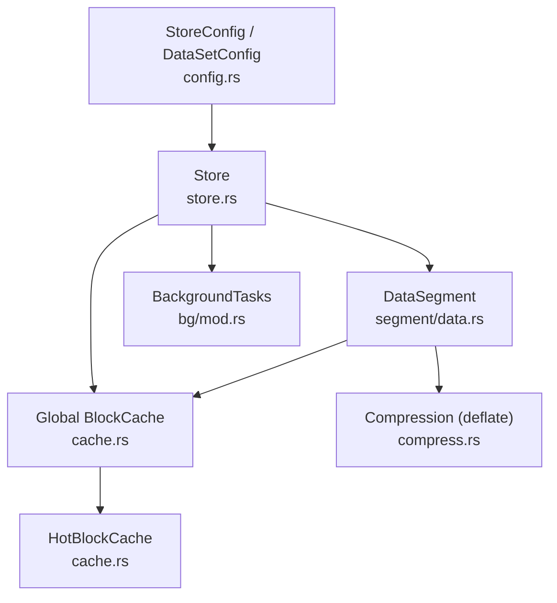
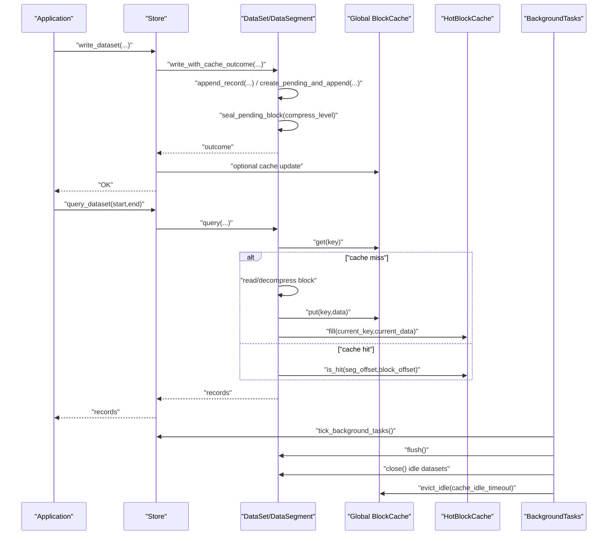
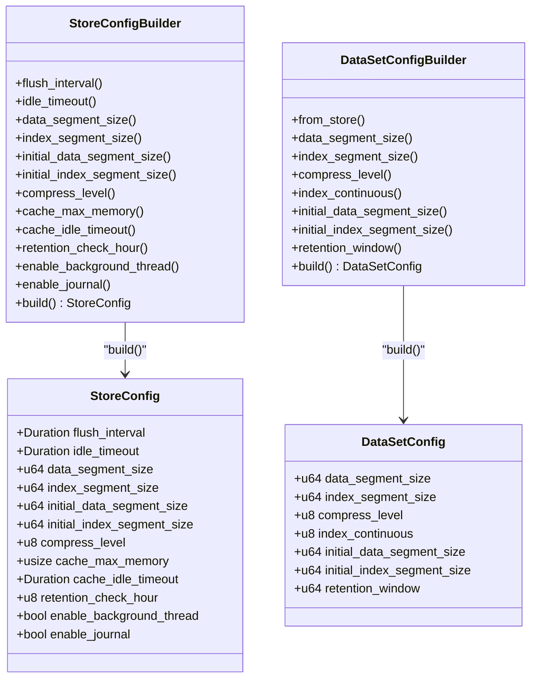

# Performance Tuning

<cite>
**Referenced Files in This Document**
- [config.rs](file://src/config.rs)
- [cache.rs](file://src/cache.rs)
- [compress.rs](file://src/compress.rs)
- [data.rs](file://src/segment/data.rs)
- [store.rs](file://src/store.rs)
- [bg/mod.rs](file://src/bg/mod.rs)
- [lib.rs](file://src/lib.rs)
- [test_config.rs](file://tests/config_test.rs)
- [test_config.py](file://wrapper/python/tests/test_config.py)
</cite>

## Table of Contents
1. [Introduction](#introduction)
2. [Project Structure](#project-structure)
3. [Core Components](#core-components)
4. [Architecture Overview](#architecture-overview)
5. [Detailed Component Analysis](#detailed-component-analysis)
6. [Dependency Analysis](#dependency-analysis)
7. [Performance Considerations](#performance-considerations)
8. [Troubleshooting Guide](#troubleshooting-guide)
9. [Conclusion](#conclusion)
10. [Appendices](#appendices)

## Introduction
This document provides performance tuning guidance for TimSLite configuration optimization. It explains how to tune configuration parameters for different workload patterns (high write throughput, read-heavy, and mixed), the relationship between segment sizes, compression levels, and cache settings with system resources, and how to optimize memory allocation, disk I/O, and CPU utilization. It also includes benchmarking guidance, monitoring recommendations, platform-specific considerations, containerized deployment configurations, configuration templates, and troubleshooting methodologies.

## Project Structure
TimSLite’s performance-relevant configuration and runtime behavior are primarily defined in the configuration and runtime modules:
- Store-level and dataset-level configuration types and builders
- Global block cache and hot block cache for reads
- Compression utilities for delayed compression
- Data segment lifecycle and sealing/compression behavior
- Background task scheduler for flushes, idle-close, cache eviction, and retention
- Public re-exports and constants for consumers

**Diagram sources**
- [config.rs:26-203](file://src/config.rs#L26-L203)
- [store.rs:46-161](file://src/store.rs#L46-L161)
- [cache.rs:43-191](file://src/cache.rs#L43-L191)
- [compress.rs:5-23](file://src/compress.rs#L5-L23)
- [data.rs:39-67](file://src/segment/data.rs#L39-L67)
- [bg/mod.rs:44-54](file://src/bg/mod.rs#L44-L54)

**Section sources**
- [lib.rs:38-72](file://src/lib.rs#L38-L72)

## Core Components
- StoreConfig and DataSetConfig define store-wide and dataset-specific defaults and overrides. Key tunables include:
  - Segment sizes (data and index), initial sizes, compression level, cache memory budget, background task intervals, and retention schedule.
- Global BlockCache provides a bounded LRU cache for decompressed blocks with idle eviction.
- HotBlockCache provides per-query local caching to avoid lock contention.
- DataSegment manages lazy open/close, block aggregation, sealing, and compression.
- BackgroundTasks coordinates periodic maintenance tasks.

**Section sources**
- [config.rs:26-203](file://src/config.rs#L26-L203)
- [cache.rs:43-191](file://src/cache.rs#L43-L191)
- [data.rs:39-67](file://src/segment/data.rs#L39-L67)
- [bg/mod.rs:44-54](file://src/bg/mod.rs#L44-L54)

## Architecture Overview
The runtime integrates configuration-driven behavior with background maintenance and caching to balance throughput, latency, and resource usage.

**Diagram sources**
- [store.rs:400-529](file://src/store.rs#L400-L529)
- [data.rs:352-596](file://src/segment/data.rs#L352-L596)
- [cache.rs:68-113](file://src/cache.rs#L68-L113)
- [bg/mod.rs:194-439](file://src/bg/mod.rs#L194-L439)

## Detailed Component Analysis

### Configuration Parameters and Their Impact
- Segment sizing
  - data_segment_size and index_segment_size control the maximum file size per data/index segment. Larger segments reduce metadata overhead and index fragmentation but increase mmap pressure and idle-close costs.
  - initial_data_segment_size and initial_index_segment_size reduce initial disk allocation and speed up first writes for small datasets.
- Compression
  - compress_level controls zlib compression level for sealed blocks. Higher levels reduce disk I/O and long-term storage cost but increase CPU usage during write path sealing.
- Cache
  - cache_max_memory sets the global read cache budget. cache_idle_timeout governs background eviction of stale entries.
- Background tasks
  - flush_interval controls how often datasets are flushed (mmap sync without sealing/compression).
  - idle_timeout controls when idle segments are closed to free memory.
  - retention_check_hour schedules daily retention reclaim at a UTC hour.
- Journal
  - enable_journal toggles the built-in change log for auditing and replay.

**Section sources**
- [config.rs:26-71](file://src/config.rs#L26-L71)
- [config.rs:174-202](file://src/config.rs#L174-L202)
- [config.rs:206-236](file://src/config.rs#L206-L236)
- [config.rs:327-344](file://src/config.rs#L327-L344)

### Memory Allocation Strategies
- Global BlockCache
  - Enforced via cache_max_memory. Evicts least-recently-used entries when approaching 85% of the budget to maintain headroom.
  - Tracks hit/miss counts and used_memory for observability.
- HotBlockCache
  - Per-query local cache avoids lock contention and supports fast extraction of records from the current block payload.
- DataSegment
  - Uses mmap for zero-copy reads/writes. Lazy open/close reduces memory residency.
  - Pending raw blocks are aggregated in-place until sealed, minimizing intermediate copies.

**Section sources**
- [cache.rs:43-191](file://src/cache.rs#L43-L191)
- [cache.rs:288-359](file://src/cache.rs#L288-L359)
- [data.rs:226-276](file://src/segment/data.rs#L226-L276)
- [data.rs:352-407](file://src/segment/data.rs#L352-L407)

### Disk I/O Optimization
- Aggregation and sealing
  - Records are aggregated into blocks (up to a fixed payload limit) and sealed/compressed when full, reducing filesystem metadata churn.
- Lazy lifecycle
  - Segments are lazily opened on demand and idle-closed after inactivity, lowering persistent mmap overhead.
- Expansion policy
  - Data segments expand by doubling up to the configured maximum, amortizing resize costs.

**Section sources**
- [data.rs:318-324](file://src/segment/data.rs#L318-L324)
- [data.rs:278-306](file://src/segment/data.rs#L278-L306)
- [data.rs:352-596](file://src/segment/data.rs#L352-L596)

### CPU Utilization Tuning
- Compression level
  - Higher levels increase CPU during sealing; lower levels reduce CPU but increase disk usage.
- Background flush interval
  - Shorter intervals increase flush frequency; longer intervals reduce CPU but risk higher dirty pages.
- Cache idle eviction
  - Periodic eviction frees memory proactively; tune cache_idle_timeout to balance memory vs. future hits.

**Section sources**
- [compress.rs:5-23](file://src/compress.rs#L5-L23)
- [bg/mod.rs:221-248](file://src/bg/mod.rs#L221-L248)
- [bg/mod.rs:378-384](file://src/bg/mod.rs#L378-L384)

### Workload-Specific Tuning Guidance
- High write throughput
  - Increase data_segment_size to reduce frequent expansions and index churn.
  - Keep compression moderate (e.g., mid-level) to balance CPU and disk savings.
  - Enable background thread and shorten flush_interval moderately to keep dirty pages low.
  - Increase cache_max_memory to improve subsequent reads of recently-written blocks.
- Read-heavy
  - Increase cache_max_memory significantly to maximize hit rate.
  - Use higher compression to reduce I/O; accept higher CPU during writes.
  - Keep idle_timeout longer to retain segments in memory.
- Mixed access patterns
  - Balance segment sizes to accommodate bursty writes without excessive fragmentation.
  - Moderate compression and cache budgets to hedge between write amplification and read latency.

[No sources needed since this section synthesizes guidance from earlier sections]

### Benchmarking Guidance
- Use criterion-compatible harnesses to measure write/query latencies under realistic workloads.
- Vary segment sizes, compression levels, and cache budgets to identify saturation points.
- Track background task delays and cache hit ratios to detect contention or misconfiguration.
- Compare with and without background thread mode to quantify overhead.

[No sources needed since this section provides general guidance]

### Monitoring Recommendations
- Observe background task next_delay to ensure tasks are not contending or starved.
- Monitor cache stats (hit/miss counts, used_memory) to validate cache effectiveness.
- Track segment expansion and idle-close events to confirm lifecycle tuning.
- Measure retention reclaim throughput and idle eviction counts.

**Section sources**
- [bg/mod.rs:206-209](file://src/bg/mod.rs#L206-L209)
- [bg/mod.rs:378-384](file://src/bg/mod.rs#L378-L384)
- [cache.rs:182-190](file://src/cache.rs#L182-L190)

### Platform-Specific Considerations
- Linux: mmap behavior and page cache can amplify the benefits of compression and caching; ensure adequate file descriptor limits.
- Windows: memory-mapped file semantics differ; monitor background thread overhead and adjust flush_interval accordingly.
- Containerized environments: set memory limits and disable background threads if manual ticking is preferred; mount volumes with appropriate IO policies.

[No sources needed since this section provides general guidance]

### Containerized Deployment Configurations
- Disable background thread and manually tick via periodic calls to drive maintenance.
- Pin compression levels and cache budgets to resource caps.
- Mount persistent volumes with aligned segment sizes to reduce defragmentation.

[No sources needed since this section provides general guidance]

### Configuration Templates
Below are representative templates for common scenarios. Adjust units and values according to your hardware and workload.

- High write throughput template
  - data_segment_size: large (e.g., tens of megabytes)
  - index_segment_size: moderate (e.g., a few megabytes)
  - compress_level: medium-low
  - cache_max_memory: medium-high
  - flush_interval: short-to-medium
  - idle_timeout: medium
  - enable_background_thread: true
  - enable_journal: optional depending on audit needs

- Read-heavy template
  - data_segment_size: medium
  - index_segment_size: medium
  - compress_level: medium-high
  - cache_max_memory: high
  - flush_interval: medium
  - idle_timeout: long
  - enable_background_thread: true
  - enable_journal: optional

- Mixed template
  - data_segment_size: medium
  - index_segment_size: medium
  - compress_level: medium
  - cache_max_memory: medium
  - flush_interval: medium
  - idle_timeout: medium
  - enable_background_thread: true
  - enable_journal: optional

[No sources needed since this section provides general guidance]

### Troubleshooting Methodologies
- Symptom: frequent “SegmentFull” errors
  - Cause: insufficient data_segment_size or rapid growth.
  - Action: increase data_segment_size and/or adjust initial_data_segment_size.
- Symptom: high CPU during writes
  - Cause: high compression level or frequent flushes.
  - Action: reduce compress_level or increase flush_interval.
- Symptom: poor read latency
  - Cause: low cache_max_memory or aggressive idle timeouts.
  - Action: increase cache_max_memory and/or increase idle_timeout.
- Symptom: background tasks piling up
  - Cause: very long intervals or disabled background thread.
  - Action: enable background thread or shorten intervals; monitor next_delay.

**Section sources**
- [data.rs:308-313](file://src/segment/data.rs#L308-L313)
- [bg/mod.rs:221-248](file://src/bg/mod.rs#L221-L248)
- [cache.rs:96-102](file://src/cache.rs#L96-L102)

## Dependency Analysis
Configuration drives runtime behavior across modules. Builders propagate defaults and enforce bounds.

**Diagram sources**
- [config.rs:26-203](file://src/config.rs#L26-L203)
- [config.rs:206-344](file://src/config.rs#L206-L344)

**Section sources**
- [config.rs:26-203](file://src/config.rs#L26-L203)
- [config.rs:206-344](file://src/config.rs#L206-L344)

## Performance Considerations
- Tune segment sizes to minimize index fragmentation and expansion frequency.
- Balance compression level with CPU budget; verify compression effectiveness on your data.
- Size cache appropriately for observed access locality; monitor hit ratio trends.
- Use background thread mode for automatic maintenance; otherwise, implement periodic manual ticks.
- Monitor background task delays and cache metrics to detect bottlenecks.

[No sources needed since this section provides general guidance]

## Troubleshooting Guide
- Validate configuration defaults and builder behavior using unit tests as references.
- Confirm Python bindings mirror defaults for cross-language consistency.
- Use logs from background tasks and cache operations to diagnose contention or misconfiguration.

**Section sources**
- [test_config.rs:17-47](file://tests/config_test.rs#L17-L47)
- [test_config.py:8-37](file://wrapper/python/tests/test_config.py#L8-L37)

## Conclusion
Optimal TimSLite performance emerges from aligning configuration with workload characteristics. For write-heavy workloads, favor larger segments and moderate compression with sufficient cache. For read-heavy workloads, invest in cache and higher compression. For mixed workloads, balance segment sizes and compression to hedge against both write amplification and read latency. Use background tasks judiciously, monitor cache and background delays, and iterate with controlled benchmarks to converge on the best configuration for your environment.

## Appendices
- Constants and public re-exports useful for consumers:
  - Header sizes, block size limits, index entry size, magic/version, and queue-related constants.

**Section sources**
- [lib.rs:89-109](file://src/lib.rs#L89-L109)