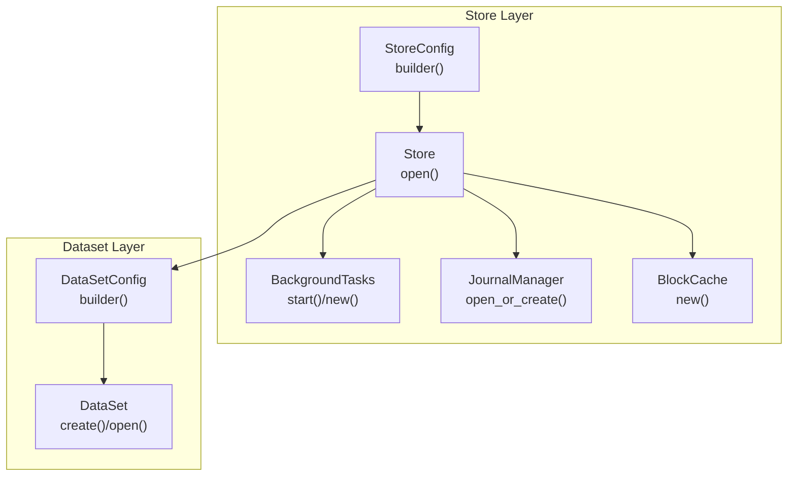
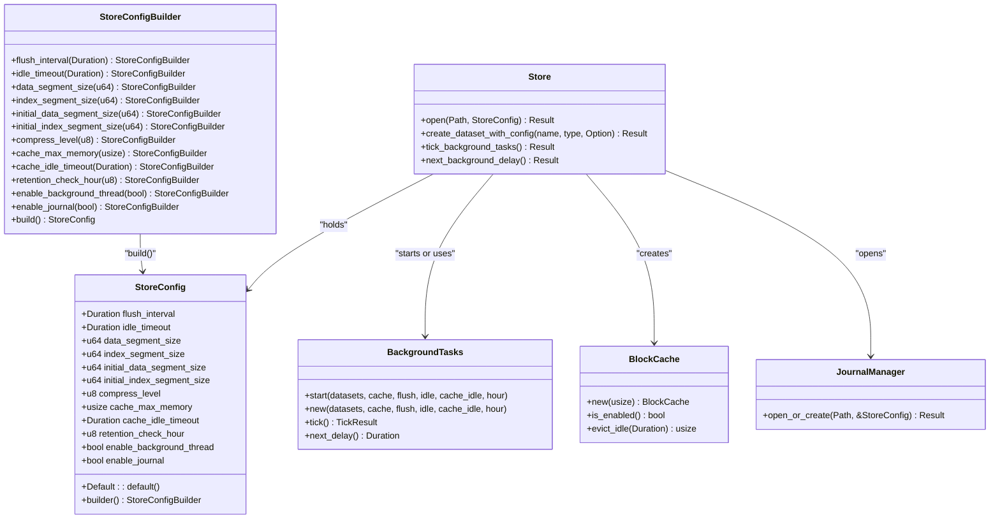
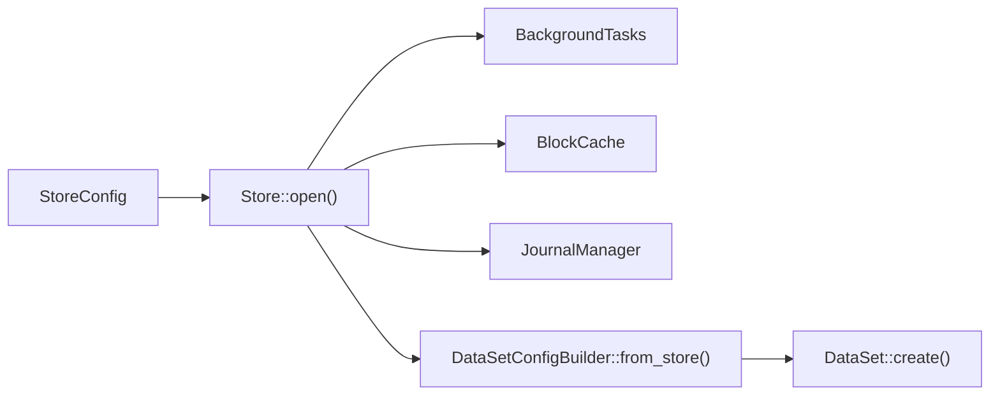

# Store Configuration

<cite>
**Referenced Files in This Document**
- [config.rs](file://src/config.rs)
- [store.rs](file://src/store.rs)
- [bg/mod.rs](file://src/bg/mod.rs)
- [cache.rs](file://src/cache.rs)
- [compress.rs](file://src/compress.rs)
- [journal/mod.rs](file://src/journal/mod.rs)
- [ffi.rs](file://src/ffi.rs)
- [lazy-allocation.md](file://docs/design/lazy-allocation.md)
- [background-and-cache.md](file://docs/design/background-and-cache.md)
- [compression.md](file://docs/design/compression.md)
- [phase-14-dataset-config-builder.md](file://docs/plan/phase-14-dataset-config-builder.md)
- [phase-21-manual-bg-execution.md](file://docs/plan/phase-21-manual-bg-execution.md)
- [config_test.rs](file://tests/config_test.rs)
- [test_config.py](file://wrapper/python/tests/test_config.py)
</cite>

## Table of Contents
1. [Introduction](#introduction)
2. [Project Structure](#project-structure)
3. [Core Components](#core-components)
4. [Architecture Overview](#architecture-overview)
5. [Detailed Component Analysis](#detailed-component-analysis)
6. [Dependency Analysis](#dependency-analysis)
7. [Performance Considerations](#performance-considerations)
8. [Troubleshooting Guide](#troubleshooting-guide)
9. [Conclusion](#conclusion)
10. [Appendices](#appendices)

## Introduction
This document explains TimSLite’s store-level configuration model and how it influences runtime behavior. It covers all StoreConfig parameters, the builder pattern implementation, validation rules, defaults, acceptable ranges, and performance implications. It also documents how dataset-level defaults are inherited, how background tasks are controlled, and how to tune configurations for common scenarios such as high-throughput logging, low-latency real-time systems, and cost-optimized storage. Practical examples and troubleshooting guidance are included.

## Project Structure
TimSLite organizes configuration at the store level and exposes a builder pattern for ergonomic construction. Store-level defaults are applied to newly created datasets, while existing datasets persist their own metadata and reopen independently of store defaults.

**Diagram sources**
- [config.rs:25-203](file://src/config.rs#L25-L203)
- [store.rs:46-161](file://src/store.rs#L46-L161)
- [bg/mod.rs:44-190](file://src/bg/mod.rs#L44-L190)
- [journal/mod.rs:329-357](file://src/journal/mod.rs#L329-L357)
- [cache.rs:43-63](file://src/cache.rs#L43-L63)

**Section sources**
- [config.rs:25-203](file://src/config.rs#L25-L203)
- [store.rs:46-161](file://src/store.rs#L46-L161)

## Core Components
- StoreConfig: Defines store-wide runtime settings and dataset defaults for newly created datasets.
- StoreConfigBuilder: Implements method chaining to construct StoreConfig with validation and defaults.
- BackgroundTasks: Drives periodic tasks (flush, idle-close, cache eviction, retention reclaim) either automatically or manually.
- BlockCache: Global read cache with capacity and idle eviction.
- JournalManager: Optional change log dataset that mirrors store-level segment sizing and compression defaults when enabled.
- DataSetConfig and DataSetConfigBuilder: Dataset-level configuration derived from StoreConfig defaults.

Key behaviors:
- Store-level defaults apply to new datasets; existing datasets reopen from their own metadata and ignore store defaults.
- Background tasks are controlled by enable_background_thread; manual ticking is available via Store::tick_background_tasks().
- Journal is enabled by default and inherits store-level segment sizes, compression level, and initial sizes when enabled.

**Section sources**
- [config.rs:25-203](file://src/config.rs#L25-L203)
- [store.rs:163-226](file://src/store.rs#L163-L226)
- [bg/mod.rs:44-190](file://src/bg/mod.rs#L44-L190)
- [journal/mod.rs:329-357](file://src/journal/mod.rs#L329-L357)

## Architecture Overview
Store configuration is the central contract between store initialization and dataset creation. The builder pattern ensures safe construction with validated ranges and sensible defaults.

**Diagram sources**
- [config.rs:25-203](file://src/config.rs#L25-L203)
- [store.rs:46-161](file://src/store.rs#L46-L161)
- [bg/mod.rs:44-190](file://src/bg/mod.rs#L44-L190)
- [cache.rs:43-63](file://src/cache.rs#L43-L63)
- [journal/mod.rs:329-357](file://src/journal/mod.rs#L329-L357)

## Detailed Component Analysis

### StoreConfig Parameters and Defaults
- flush_interval: Duration between background flush cycles (mmap sync only). Default is 10 minutes.
- idle_timeout: Duration of inactivity before segments are idle-closed. Default is 30 minutes.
- data_segment_size: Default data segment file size for newly created datasets. Default is 64 MiB.
- index_segment_size: Default index segment file size for newly created datasets. Default is 4 MiB.
- initial_data_segment_size: Default initial data segment size (grows up to data_segment_size). Default is 256 KiB.
- initial_index_segment_size: Default initial index segment size (grows up to index_segment_size). Default is 4 KiB.
- compress_level: Deflate compression level for newly created datasets (0-9). Default is 6.
- cache_max_memory: Maximum memory for the read block cache (bytes; 0 disables). Default is 256 MiB.
- cache_idle_timeout: Idle timeout for cache entries (evicted by background thread). Default is 30 minutes.
- retention_check_hour: UTC hour (0-23) at which daily retention reclamation runs. Default is 0 (UTC 00:00).
- enable_background_thread: Launch a background thread. When false, callers must invoke Store::tick_background_tasks() periodically. Default is true.
- enable_journal: Enable the built-in .journal/logs change log. Default is true.

Validation and normalization:
- compress_level is capped at 9.
- retention_check_hour is clamped to 0-23.
- cache_max_memory 0 disables the cache.
- enable_background_thread toggles automatic vs manual background task execution.

Behavioral notes:
- Store-level defaults are applied to newly created datasets via DataSetConfigBuilder::from_store.
- Existing datasets reopen from their own meta files and ignore store defaults.

**Section sources**
- [config.rs:12-71](file://src/config.rs#L12-L71)
- [config.rs:174-202](file://src/config.rs#L174-L202)
- [config.rs:410-421](file://src/config.rs#L410-L421)
- [config.rs:434-439](file://src/config.rs#L434-L439)
- [store.rs:163-226](file://src/store.rs#L163-L226)

### Builder Pattern Implementation and Validation
Method chaining:
- Each setter returns Self to support fluent configuration.
- build() merges provided values with StoreConfig::default(), inheriting unspecified fields from defaults.

Validation rules:
- compress_level is capped to 9.
- retention_check_hour is clamped to 0-23.
- cache_max_memory 0 disables caching.
- enable_background_thread toggles background thread mode.

Example usage patterns:
- Partial overrides: set only the fields you need; others inherit defaults.
- Full customization: pass explicit values for all fields.

**Section sources**
- [config.rs:97-202](file://src/config.rs#L97-L202)
- [config_test.rs:397-421](file://tests/config_test.rs#L397-L421)

### Background Task Controls
BackgroundTasks orchestrates four categories of tasks:
- Flush: Periodic flush of datasets (mmap sync).
- Idle-check: Periodic closure of inactive datasets.
- Cache eviction: Periodic eviction of idle cache entries.
- Retention reclaim: Daily reclaim of expired segments based on retention_check_hour.

Task scheduling:
- Intervals: flush_interval, fixed idle_check and cache_eviction intervals, and daily retention schedule computed from retention_check_hour.
- Concurrency: ExecutorState guarded by Mutex; external tick() serializes with background thread.

Manual execution:
- Store::tick_background_tasks() executes one tick synchronously and returns TickResult with executed_tasks and next_delay.
- Store::next_background_delay() returns the duration until the next task is due without executing.

**Section sources**
- [bg/mod.rs:23-51](file://src/bg/mod.rs#L23-L51)
- [bg/mod.rs:221-248](file://src/bg/mod.rs#L221-L248)
- [bg/mod.rs:250-284](file://src/bg/mod.rs#L250-L284)
- [bg/mod.rs:320-439](file://src/bg/mod.rs#L320-L439)
- [store.rs:514-540](file://src/store.rs#L514-L540)
- [phase-21-manual-bg-execution.md:13-30](file://docs/plan/phase-21-manual-bg-execution.md#L13-L30)

### Cache Configuration
BlockCache:
- Enabled when cache_max_memory > 0.
- Evicts entries by LRU when approaching capacity (target ~85% of max_memory).
- Evicts idle entries based on cache_idle_timeout.
- Provides hit/miss counters and entry statistics.

HotBlockCache (per-query local cache) avoids lock contention during reads.

**Section sources**
- [cache.rs:43-191](file://src/cache.rs#L43-L191)
- [cache.rs:288-359](file://src/cache.rs#L288-L359)

### Compression Settings
Compression level:
- 0-9; higher levels improve compression ratio but increase CPU usage.
- Levels are capped at 9 internally.
- Compression is applied to sealed blocks; pending raw blocks are not cached.

Space considerations:
- Compressed payload length determines space checks during writes.
- For large single records, compressed length is used for accounting.

**Section sources**
- [compress.rs:5-23](file://src/compress.rs#L5-L23)
- [compression.md:74-81](file://docs/design/compression.md#L74-L81)

### Segment Sizes and Lazy Allocation
Initial sizes:
- initial_data_segment_size and initial_index_segment_size define initial allocation sizes for new segments.
- Growth occurs exponentially (2x) until reaching configured max sizes.

Constraints:
- initial_* must be ≥ header sizes and ≤ corresponding segment_size.
- If initial_* equals segment_size, behavior degenerates to full preallocation.

Header sizes:
- DATA_HEADER_SIZE and INDEX_HEADER_SIZE define minimal header footprints.

**Section sources**
- [lazy-allocation.md:17-39](file://docs/design/lazy-allocation.md#L17-L39)
- [header.rs:128-158](file://src/header.rs#L128-L158)

### Journal Configuration
JournalManager:
- Enabled by default; inherits store-level segment sizes, compression level, and initial sizes when enabled.
- Disabled when enable_journal is false.

Impact:
- Enabling the journal adds overhead for write amplification and disk usage.
- Disabling reduces overhead but removes the change log.

**Section sources**
- [journal/mod.rs:329-357](file://src/journal/mod.rs#L329-L357)
- [config.rs:46-49](file://src/config.rs#L46-L49)

### Dataset-Level Defaults and Inheritance
DataSetConfigBuilder::from_store:
- Pre-fills dataset defaults from StoreConfig.
- Unset fields inherit store defaults; index_continuous defaults to 0.

Behavior on reopen:
- Existing datasets persist their own metadata and ignore store defaults.

**Section sources**
- [config.rs:220-236](file://src/config.rs#L220-L236)
- [config.rs:272-282](file://src/config.rs#L272-L282)
- [store.rs:108-121](file://src/store.rs#L108-L121)

### FFI and Python Wrappers
FFI:
- tmsl_store_config_default fills a C struct with defaults.
- store_config_from_ffi converts raw C config to Rust StoreConfig with validation.

Python:
- PyStoreConfig mirrors StoreConfig fields and defaults.
- Exposes getters for all parameters.

**Section sources**
- [ffi.rs:198-227](file://src/ffi.rs#L198-L227)
- [wrapper/python/src/config.rs:14-114](file://wrapper/python/tests/test_config.py)

## Dependency Analysis
Store configuration propagates through several subsystems:

**Diagram sources**
- [store.rs:60-161](file://src/store.rs#L60-L161)
- [bg/mod.rs:104-190](file://src/bg/mod.rs#L104-L190)
- [cache.rs:52-63](file://src/cache.rs#L52-L63)
- [journal/mod.rs:329-357](file://src/journal/mod.rs#L329-L357)
- [config.rs:272-282](file://src/config.rs#L272-L282)

**Section sources**
- [store.rs:60-161](file://src/store.rs#L60-L161)
- [config.rs:272-282](file://src/config.rs#L272-L282)

## Performance Considerations
- flush_interval
  - Lower values reduce data loss risk but increase flush overhead.
  - Higher values reduce I/O but increase potential data loss during crashes.
- idle_timeout
  - Lower values free resources sooner; higher values reduce reopen costs.
- data_segment_size and index_segment_size
  - Larger segments reduce metadata overhead and improve sequential I/O; increase initial disk usage.
- initial_data_segment_size and initial_index_segment_size
  - Smaller initial sizes reduce disk waste for small datasets; growth adds write amplification.
- compress_level
  - Higher levels reduce storage but increase CPU usage; verify compression effectiveness for your data.
- cache_max_memory
  - Larger caches reduce read latency; ensure sufficient RAM to avoid pressure.
  - 0 disables cache entirely.
- cache_idle_timeout
  - Shorter timeouts reduce stale data in cache; longer timeouts reduce eviction churn.
- retention_check_hour
  - Daily reclaim at UTC hour; choose off-peak hours to minimize impact.
- enable_background_thread
  - True: automatic background thread; False: manual ticking required.
- enable_journal
  - Adds write amplification and disk usage; beneficial for auditability and recovery.

[No sources needed since this section provides general guidance]

## Troubleshooting Guide
Common issues and remedies:
- Background tasks not running
  - Symptom: No flush, idle-close, cache eviction, or retention reclaim.
  - Cause: enable_background_thread is false.
  - Fix: Set enable_background_thread to true or call Store::tick_background_tasks() periodically.
- Excessive cache memory usage
  - Symptom: High RSS or eviction churn.
  - Cause: cache_max_memory too high or cache_idle_timeout too long.
  - Fix: Reduce cache_max_memory or shorten cache_idle_timeout.
- Disk space growth
  - Symptom: Rapidly growing segment files.
  - Cause: Very large data_segment_size or initial_data_segment_size.
  - Fix: Reduce segment sizes or rely on lazy allocation to grow gradually.
- High CPU usage
  - Symptom: Elevated CPU under compression.
  - Cause: compress_level too high.
  - Fix: Lower compress_level or disable compression for already-compressed data.
- Journal overhead
  - Symptom: Extra I/O and disk usage.
  - Cause: enable_journal true.
  - Fix: Disable journal if not needed; note reduced auditability.
- Retention reclaim not triggered
  - Symptom: Old segments not reclaimed.
  - Cause: retention_window not set on dataset or retention_check_hour misconfigured.
  - Fix: Set retention_window on dataset and ensure retention_check_hour aligns with your schedule.

**Section sources**
- [store.rs:514-540](file://src/store.rs#L514-L540)
- [bg/mod.rs:221-248](file://src/bg/mod.rs#L221-L248)
- [cache.rs:152-173](file://src/cache.rs#L152-L173)
- [journal/mod.rs:329-357](file://src/journal/mod.rs#L329-L357)

## Conclusion
StoreConfig provides a comprehensive, validated, and ergonomic way to configure TimSLite behavior. The builder pattern simplifies construction, while defaults balance performance and usability. Background tasks, caching, compression, and segment sizing can be tuned for specific workloads. Understanding dataset inheritance and manual background execution helps operate TimSLite efficiently across diverse environments.

[No sources needed since this section summarizes without analyzing specific files]

## Appendices

### Practical Configuration Scenarios
- High-throughput logging
  - Increase data_segment_size and index_segment_size to reduce metadata overhead.
  - Keep flush_interval moderate to balance durability and throughput.
  - Consider lower compress_level to reduce CPU load.
  - Enable background thread for automatic maintenance.
- Low-latency real-time systems
  - Reduce idle_timeout to keep datasets warm.
  - Increase cache_max_memory to minimize read latency.
  - Keep flush_interval relatively low for timely durability.
  - Consider enabling journal for auditability.
- Cost-optimized storage
  - Reduce data_segment_size and index_segment_size.
  - Use larger initial_* to reduce growth writes.
  - Increase compress_level to reduce storage.
  - Disable journal to save disk and I/O.

[No sources needed since this section provides general guidance]

### Builder API Reference
- StoreConfig::builder()
  - Returns StoreConfigBuilder.
- StoreConfigBuilder setters
  - flush_interval, idle_timeout, data_segment_size, index_segment_size, initial_data_segment_size, initial_index_segment_size, compress_level, cache_max_memory, cache_idle_timeout, retention_check_hour, enable_background_thread, enable_journal.
- StoreConfigBuilder::build()
  - Merges provided values with StoreConfig::default().

**Section sources**
- [config.rs:73-202](file://src/config.rs#L73-L202)

### Dataset-Level Inheritance Notes
- DataSetConfigBuilder::from_store(&store_config) pre-fills dataset defaults from store.
- Unset fields inherit store defaults; index_continuous defaults to 0.
- Existing datasets reopen from their own metadata and ignore store defaults.

**Section sources**
- [config.rs:220-236](file://src/config.rs#L220-L236)
- [config.rs:272-282](file://src/config.rs#L272-L282)
- [store.rs:108-121](file://src/store.rs#L108-L121)