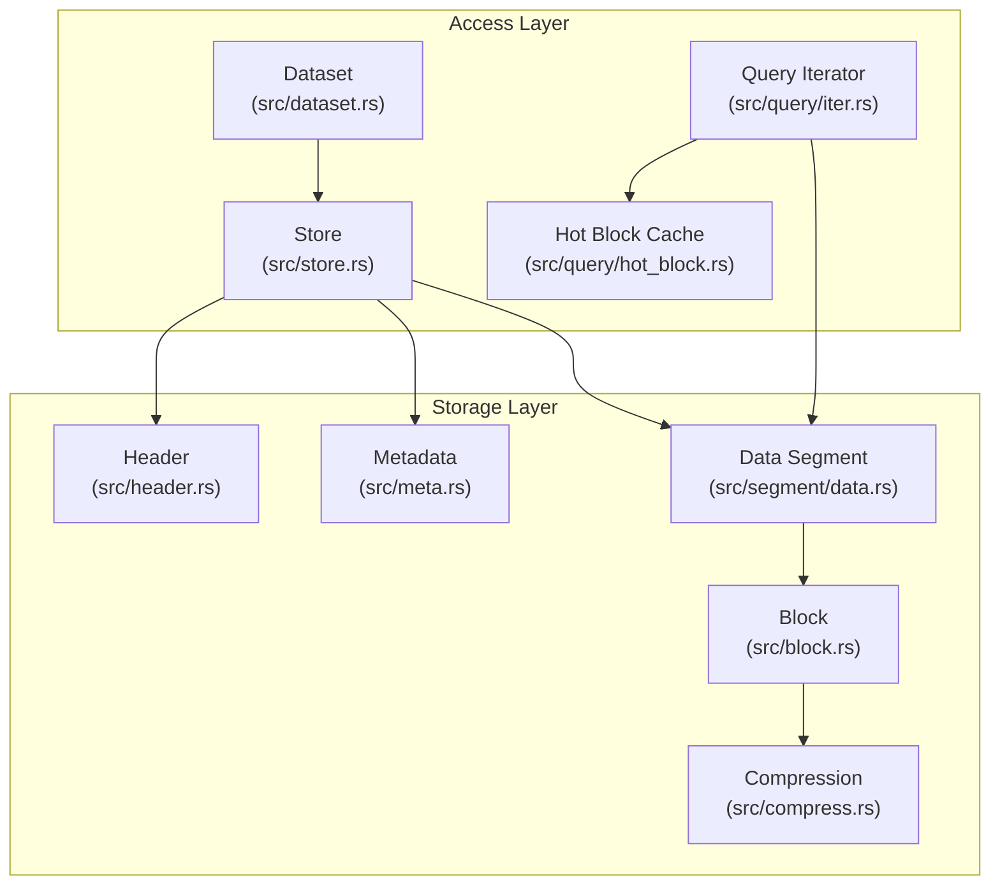
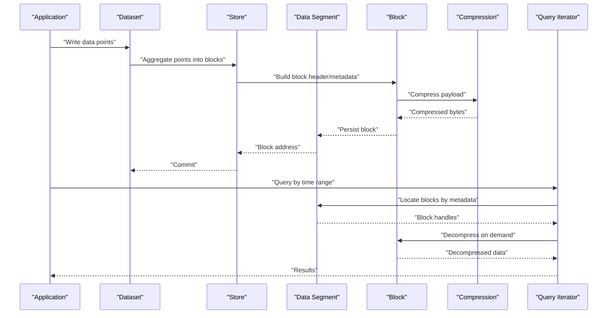
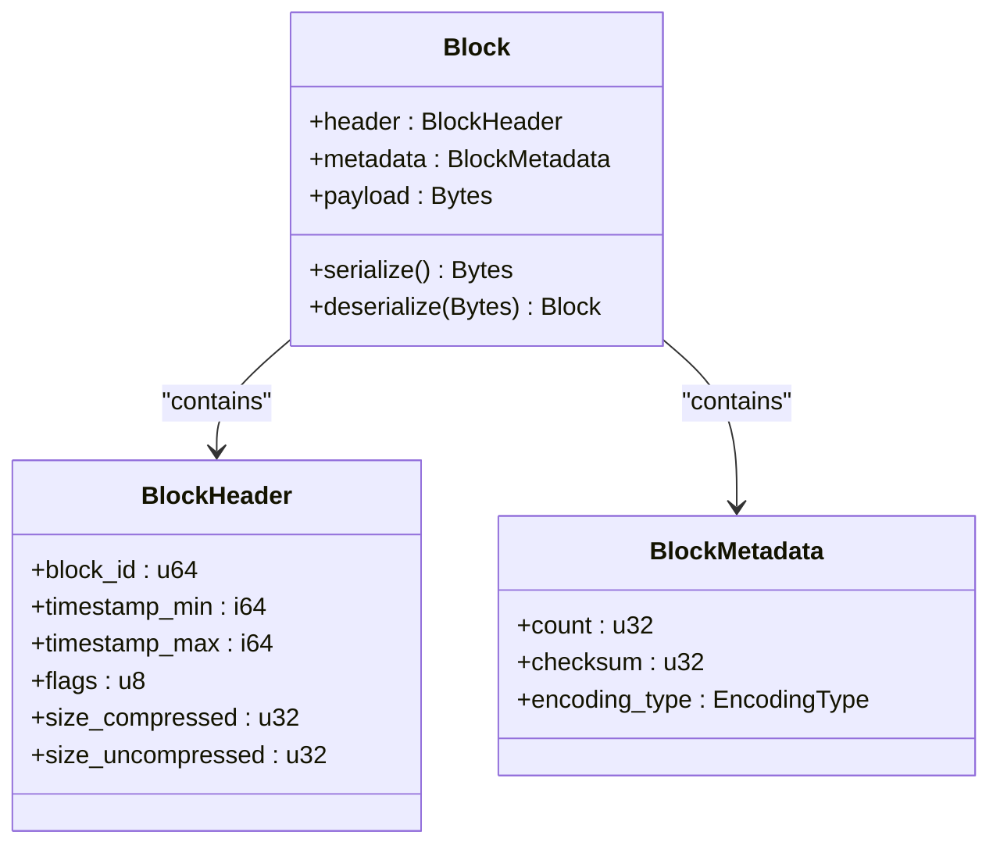
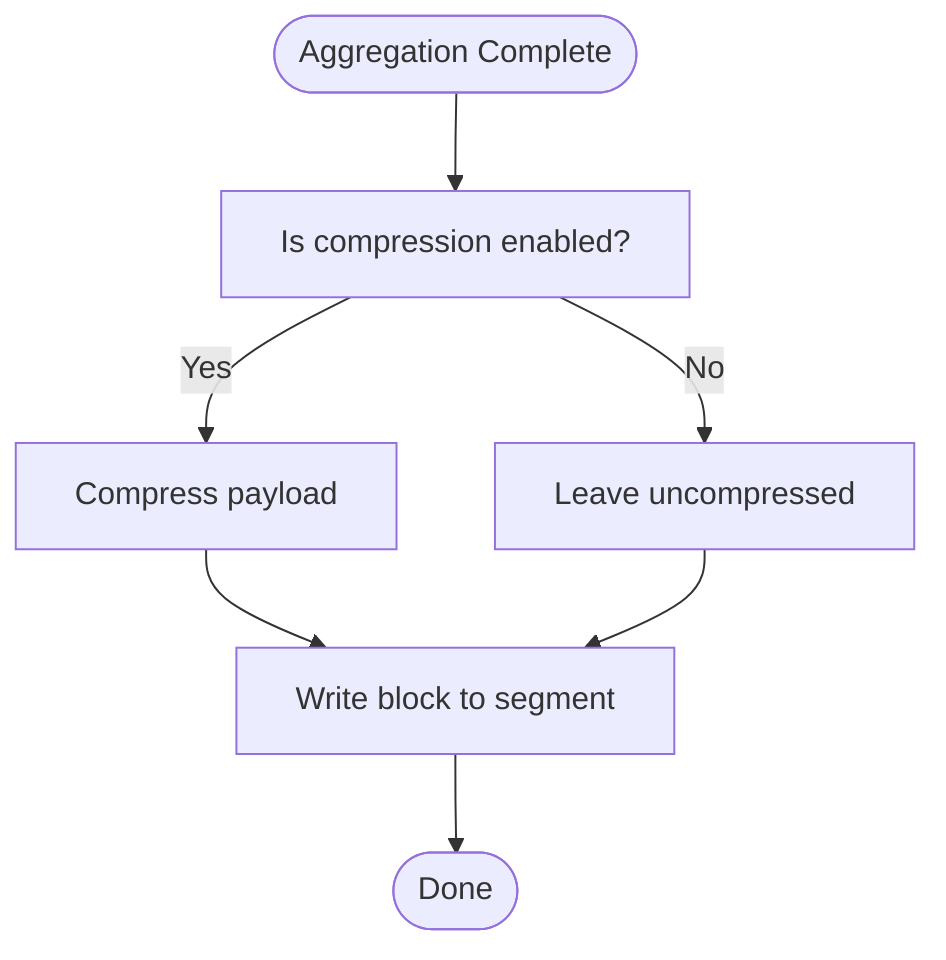
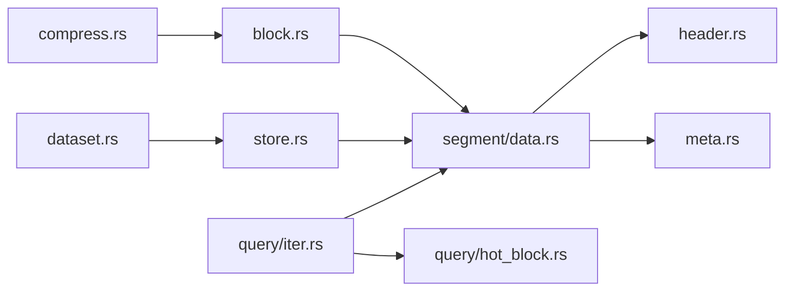

# Block-Level Data Aggregation

<cite>
**Referenced Files in This Document**
- [block.rs](file://src/block.rs)
- [compress.rs](file://src/compress.rs)
- [data.rs](file://src/segment/data.rs)
- [header.rs](file://src/header.rs)
- [meta.rs](file://src/meta.rs)
- [dataset.rs](file://src/dataset.rs)
- [store.rs](file://src/store.rs)
- [iter.rs](file://src/query/iter.rs)
- [hot_block.rs](file://src/query/hot_block.rs)
- [time-index.md](file://docs/design/time-index.md)
- [compression.md](file://docs/design/compression.md)
- [data-segment.md](file://docs/design/data-segment.md)
- [phase-03-datasegment.md](file://docs/plan/phase-03-datasegment.md)
- [phase-04-time-index.md](file://docs/plan/phase-04-time-index.md)
- [phase-09-blockcache.md](file://docs/plan/phase-09-blockcache.md)
</cite>

## Table of Contents
1. [Introduction](#introduction)
2. [Project Structure](#project-structure)
3. [Core Components](#core-components)
4. [Architecture Overview](#architecture-overview)
5. [Detailed Component Analysis](#detailed-component-analysis)
6. [Dependency Analysis](#dependency-analysis)
7. [Performance Considerations](#performance-considerations)
8. [Troubleshooting Guide](#troubleshooting-guide)
9. [Conclusion](#conclusion)

## Introduction
This document explains TimSLite's block-level data aggregation strategy and how it optimizes storage efficiency. TimSLite groups multiple data points into contiguous blocks to reduce index overhead, improve compression ratios, and enable efficient random access. The block structure includes headers, metadata, and compressed or uncompressed data sections. Aggregation algorithms vary by data type, and block boundaries are determined by configurable policies that balance compression effectiveness against random access performance.

## Project Structure
TimSLite organizes block-level concerns across several modules:
- Block definition and serialization: src/block.rs
- Compression utilities: src/compress.rs
- Data segment management: src/segment/data.rs
- Header and state management: src/header.rs
- Metadata handling: src/meta.rs
- Dataset and store orchestration: src/dataset.rs, src/store.rs
- Query iteration and hot block caching: src/query/iter.rs, src/query/hot_block.rs

**Diagram sources**
- [block.rs](file://src/block.rs)
- [compress.rs](file://src/compress.rs)
- [data.rs](file://src/segment/data.rs)
- [header.rs](file://src/header.rs)
- [meta.rs](file://src/meta.rs)
- [dataset.rs](file://src/dataset.rs)
- [store.rs](file://src/store.rs)
- [iter.rs](file://src/query/iter.rs)
- [hot_block.rs](file://src/query/hot_block.rs)

**Section sources**
- [block.rs](file://src/block.rs)
- [compress.rs](file://src/compress.rs)
- [data.rs](file://src/segment/data.rs)
- [header.rs](file://src/header.rs)
- [meta.rs](file://src/meta.rs)
- [dataset.rs](file://src/dataset.rs)
- [store.rs](file://src/store.rs)
- [iter.rs](file://src/query/iter.rs)
- [hot_block.rs](file://src/query/hot_block.rs)

## Core Components
- Block: Defines the unit of aggregation, including header, metadata, and payload sections. See [block.rs](file://src/block.rs).
- Compression: Provides compression and decompression utilities used by blocks. See [compress.rs](file://src/compress.rs).
- Data Segment: Manages physical storage of blocks and exposes read/write operations. See [data.rs](file://src/segment/data.rs).
- Header and Metadata: Store global state and per-dataset configuration affecting block behavior. See [header.rs](file://src/header.rs) and [meta.rs](file://src/meta.rs).
- Dataset and Store: Orchestrate block creation, persistence, and retrieval. See [dataset.rs](file://src/dataset.rs) and [store.rs](file://src/store.rs).
- Query Iteration and Hot Block Cache: Enable efficient random access and reduce repeated decompression. See [iter.rs](file://src/query/iter.rs) and [hot_block.rs](file://src/query/hot_block.rs).

Key responsibilities:
- Block-level aggregation reduces index overhead by grouping many data points into fewer, larger units.
- Compression improves storage density while maintaining fast random access via hot block caching and metadata indexing.
- Metadata and headers define block boundaries and encode per-block characteristics.

**Section sources**
- [block.rs](file://src/block.rs)
- [compress.rs](file://src/compress.rs)
- [data.rs](file://src/segment/data.rs)
- [header.rs](file://src/header.rs)
- [meta.rs](file://src/meta.rs)
- [dataset.rs](file://src/dataset.rs)
- [store.rs](file://src/store.rs)
- [iter.rs](file://src/query/iter.rs)
- [hot_block.rs](file://src/query/hot_block.rs)

## Architecture Overview
The block-level aggregation pipeline integrates write-time aggregation with read-time optimization:

**Diagram sources**
- [dataset.rs](file://src/dataset.rs)
- [store.rs](file://src/store.rs)
- [data.rs](file://src/segment/data.rs)
- [block.rs](file://src/block.rs)
- [compress.rs](file://src/compress.rs)
- [iter.rs](file://src/query/iter.rs)

## Detailed Component Analysis

### Block Structure and Serialization
Blocks encapsulate:
- Header: Contains block-level identifiers, timestamps, sizes, and flags indicating compression and encoding.
- Metadata: Describes the block’s content characteristics (e.g., min/max timestamps, count) to support fast random access.
- Payload: Compressed or uncompressed bytes representing aggregated data points.

Serialization and deserialization routines ensure deterministic layout and efficient parsing during queries.

**Diagram sources**
- [block.rs](file://src/block.rs)

**Section sources**
- [block.rs](file://src/block.rs)

### Compression Strategy
Compression is applied per block to maximize storage efficiency. The compressor supports multiple algorithms and can be selected via configuration. Decompression is performed on-demand during reads to minimize memory footprint.

**Diagram sources**
- [compress.rs](file://src/compress.rs)
- [block.rs](file://src/block.rs)

**Section sources**
- [compress.rs](file://src/compress.rs)
- [block.rs](file://src/block.rs)

### Data Segment Management
The data segment manages physical storage of blocks, including:
- Allocating contiguous regions for new blocks
- Tracking block addresses and sizes
- Providing read operations with bounds checking

Segment operations coordinate with block serialization and compression to maintain integrity.

**Section sources**
- [data.rs](file://src/segment/data.rs)

### Header and Metadata Coordination
Headers and metadata define global and per-block state:
- Header stores dataset configuration and global indices
- Metadata records per-block attributes enabling fast random access

These components collaborate with block construction to ensure accurate indexing and retrieval.

**Section sources**
- [header.rs](file://src/header.rs)
- [meta.rs](file://src/meta.rs)

### Aggregation Algorithms by Data Type
Aggregation strategies vary by data type to optimize compression and access:
- Numeric series: Group points with similar delta patterns to improve entropy for compression.
- Timestamp-aligned datasets: Align blocks to time boundaries to reduce cross-block scans.
- Mixed-type series: Encode deltas and run-length encodings to reduce variability.

Block boundaries are determined by:
- Fixed-size thresholds
- Time-window alignment
- Compression ratio targets

These policies balance storage savings with random access locality.

**Section sources**
- [block.rs](file://src/block.rs)
- [data.rs](file://src/segment/data.rs)

### Query Performance and Storage Impact
Block aggregation improves:
- Storage efficiency: Higher compression ratios due to larger, coherent payloads.
- Random access: Metadata and headers enable targeted block retrieval minimizing IO.

Trade-offs:
- Larger blocks increase decompression cost but reduce IO and index overhead.
- Smaller blocks improve random access granularity but reduce compression effectiveness.

Hot block caching mitigates repeated decompression costs for frequently accessed ranges.

**Section sources**
- [iter.rs](file://src/query/iter.rs)
- [hot_block.rs](file://src/query/hot_block.rs)

## Dependency Analysis
Block-level aggregation spans multiple modules with clear interfaces:

**Diagram sources**
- [compress.rs](file://src/compress.rs)
- [block.rs](file://src/block.rs)
- [data.rs](file://src/segment/data.rs)
- [header.rs](file://src/header.rs)
- [meta.rs](file://src/meta.rs)
- [dataset.rs](file://src/dataset.rs)
- [store.rs](file://src/store.rs)
- [iter.rs](file://src/query/iter.rs)
- [hot_block.rs](file://src/query/hot_block.rs)

**Section sources**
- [compress.rs](file://src/compress.rs)
- [block.rs](file://src/block.rs)
- [data.rs](file://src/segment/data.rs)
- [header.rs](file://src/header.rs)
- [meta.rs](file://src/meta.rs)
- [dataset.rs](file://src/dataset.rs)
- [store.rs](file://src/store.rs)
- [iter.rs](file://src/query/iter.rs)
- [hot_block.rs](file://src/query/hot_block.rs)

## Performance Considerations
- Block size tuning: Larger blocks typically yield higher compression but may increase latency for random access. Smaller blocks reduce latency but lower compression.
- Compression algorithm selection: Choose algorithms suited to data characteristics (e.g., high entropy vs. repetitive patterns).
- Hot block caching: Frequently accessed blocks remain in memory to avoid repeated decompression.
- Metadata indexing: Efficient headers and metadata accelerate block discovery and reduce IO.

[No sources needed since this section provides general guidance]

## Troubleshooting Guide
Common issues and resolutions:
- Decompression failures: Verify compression flags and checksums in block headers; ensure the correct algorithm is selected.
- Random access slowness: Confirm metadata entries are present and up-to-date; consider adjusting block size or enabling hot block caching.
- Storage bloat: Review aggregation thresholds and compression settings; align blocks to time windows to improve coherence.

**Section sources**
- [block.rs](file://src/block.rs)
- [compress.rs](file://src/compress.rs)
- [iter.rs](file://src/query/iter.rs)
- [hot_block.rs](file://src/query/hot_block.rs)

## Conclusion
TimSLite’s block-level data aggregation reduces index overhead and improves compression by grouping data points into contiguous blocks with compact headers, rich metadata, and compressed payloads. Strategic aggregation algorithms and configurable block boundaries balance storage efficiency with random access performance. Hot block caching further optimizes query latency for frequently accessed ranges, while robust compression and metadata indexing ensure scalable, high-performance time-series storage.