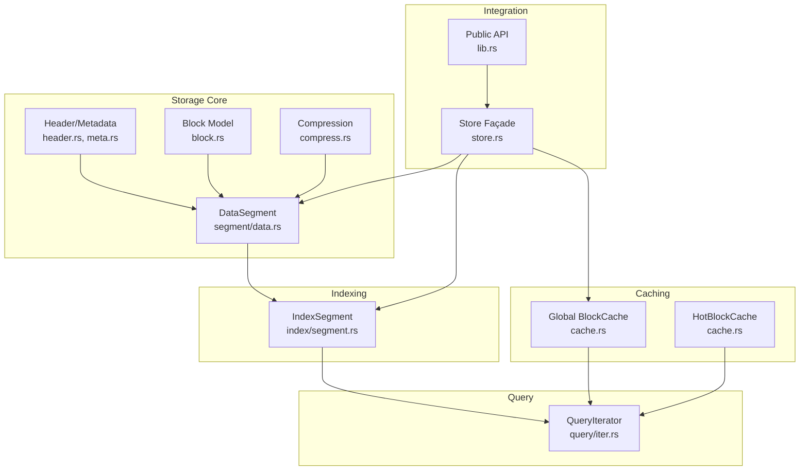
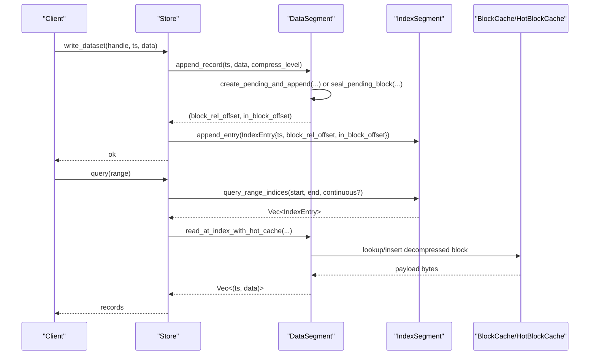
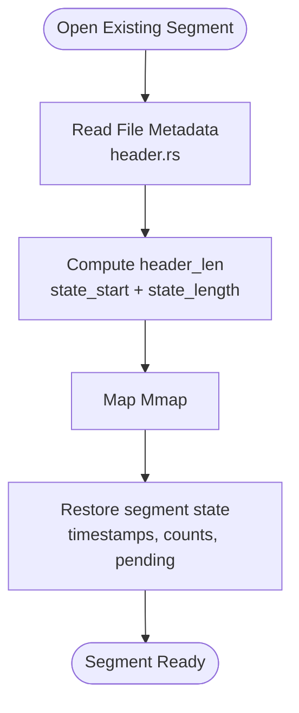
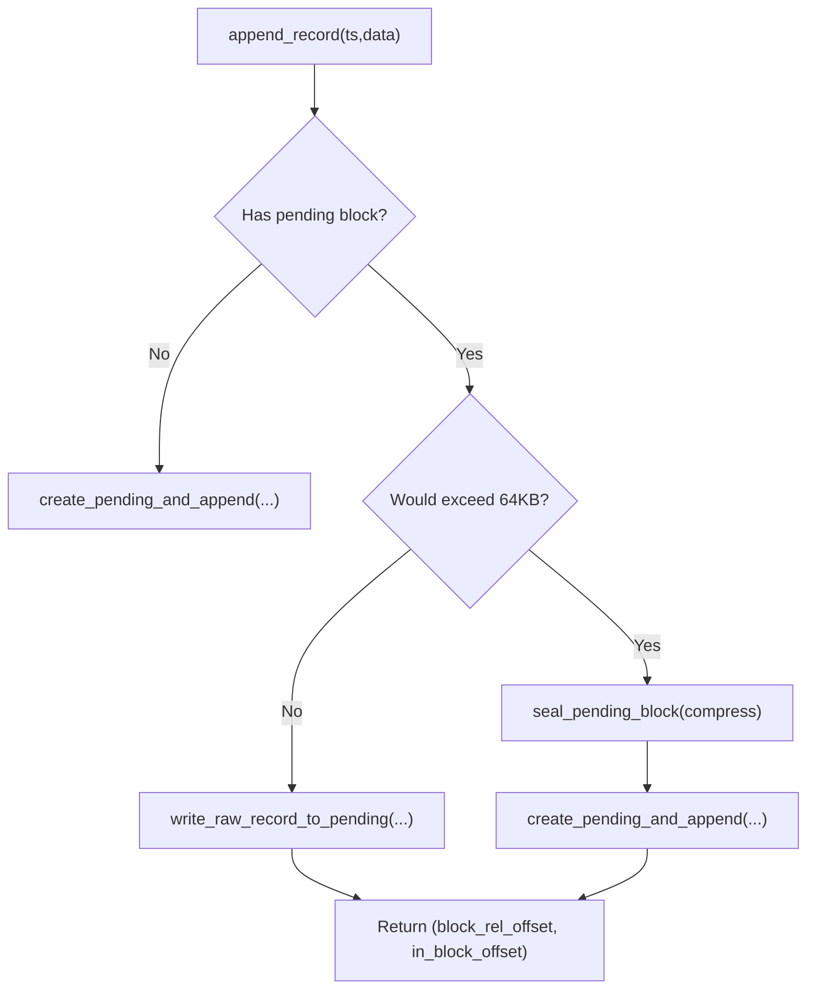
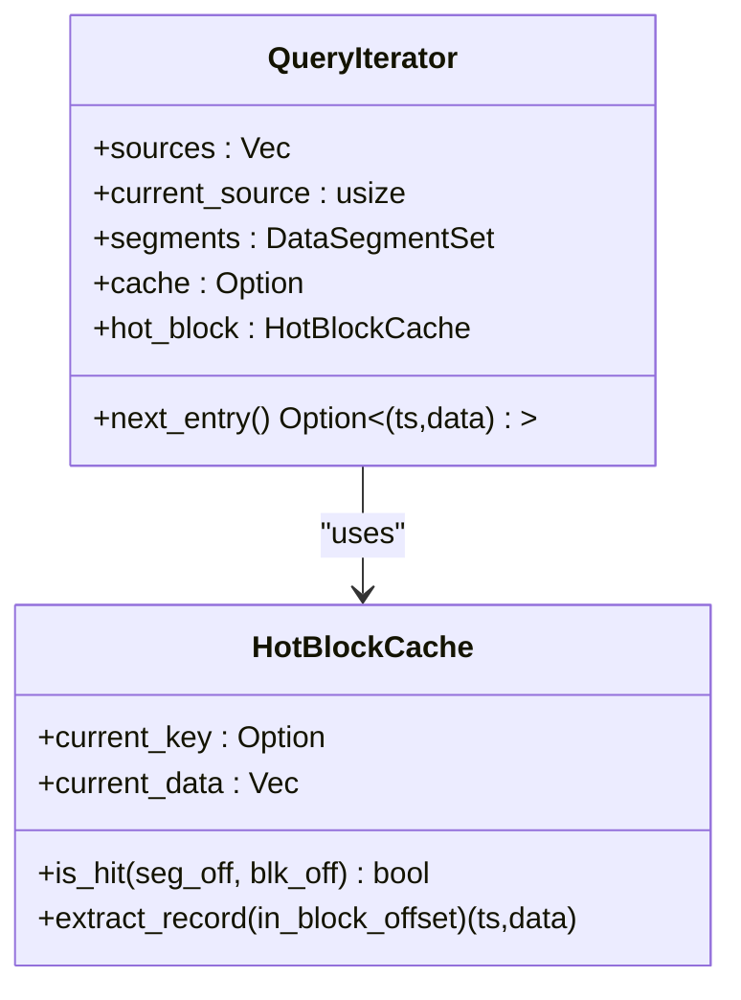
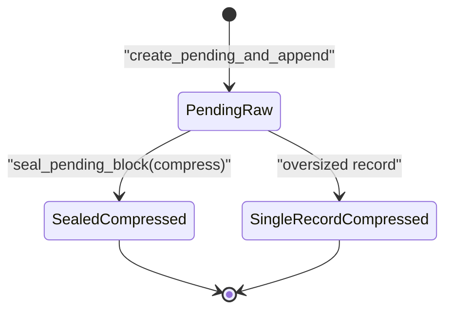
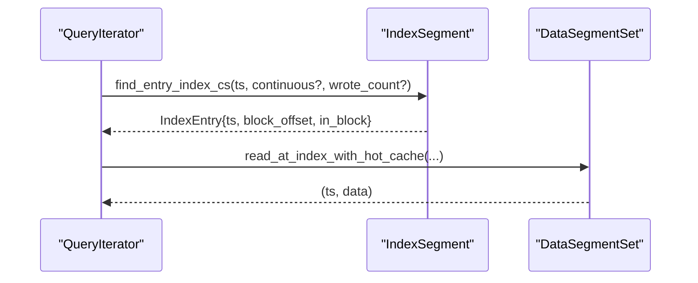
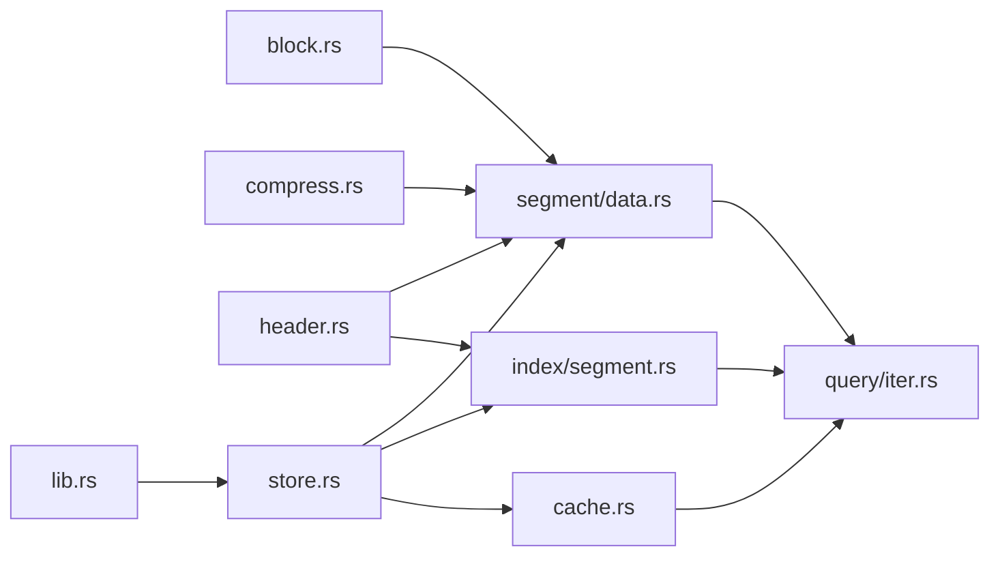

# Core Concepts

<cite>
**Referenced Files in This Document**
- [lib.rs](file://src/lib.rs)
- [header.rs](file://src/header.rs)
- [meta.rs](file://src/meta.rs)
- [block.rs](file://src/block.rs)
- [compress.rs](file://src/compress.rs)
- [cache.rs](file://src/cache.rs)
- [index/segment.rs](file://src/index/segment.rs)
- [segment/data.rs](file://src/segment/data.rs)
- [query/iter.rs](file://src/query/iter.rs)
- [util.rs](file://src/util.rs)
- [store.rs](file://src/store.rs)
- [data-model.md](file://docs/design/data-model.md)
- [compression.md](file://docs/design/compression.md)
- [lazy-allocation.md](file://docs/design/lazy-allocation.md)
- [time-index.md](file://docs/design/time-index.md)
</cite>

## Table of Contents
1. [Introduction](#introduction)
2. [Project Structure](#project-structure)
3. [Core Components](#core-components)
4. [Architecture Overview](#architecture-overview)
5. [Detailed Component Analysis](#detailed-component-analysis)
6. [Dependency Analysis](#dependency-analysis)
7. [Performance Considerations](#performance-considerations)
8. [Troubleshooting Guide](#troubleshooting-guide)
9. [Conclusion](#conclusion)

## Introduction
This document explains TimSLite’s fundamental concepts and design principles with a focus on time-series data fundamentals, memory-mapped I/O, block-level data aggregation, lazy evaluation strategies, and transparent compression. It also clarifies the relationship among timestamps, data segments, and index structures, and documents the rationale behind key design decisions such as delayed compression timing, continuous versus sparse indexing, and memory-efficient data structures. Practical examples and conceptual diagrams illustrate how these ideas work together to achieve high performance.

## Project Structure
TimSLite organizes functionality into cohesive modules:
- Storage core: headers, metadata, blocks, compression, and segment lifecycle
- Indexing: index segments, continuous indexing, and query iterators
- Caching: global and hot block caches for efficient reads
- Store façade: dataset lifecycle, background tasks, and FFI integration

**Diagram sources**
- [header.rs:1-919](file://src/header.rs#L1-L919)
- [meta.rs:1-410](file://src/meta.rs#L1-L410)
- [block.rs:1-154](file://src/block.rs#L1-L154)
- [compress.rs:1-101](file://src/compress.rs#L1-L101)
- [segment/data.rs:1-1513](file://src/segment/data.rs#L1-L1513)
- [index/segment.rs:1-727](file://src/index/segment.rs#L1-L727)
- [cache.rs:1-427](file://src/cache.rs#L1-L427)
- [query/iter.rs:1-258](file://src/query/iter.rs#L1-L258)
- [store.rs:1-681](file://src/store.rs#L1-L681)
- [lib.rs:1-133](file://src/lib.rs#L1-L133)

**Section sources**
- [lib.rs:1-133](file://src/lib.rs#L1-L133)
- [store.rs:46-161](file://src/store.rs#L46-L161)

## Core Components
- Time-series records: each record carries a timestamp and variable-length payload. See [data-model.md:5-14](file://docs/design/data-model.md#L5-L14).
- Blocks: multiple records are packed into a 16-byte header plus payload; payload size caps at 64KB for normal blocks; oversized records are isolated into single-record blocks. See [data-model.md:16-41](file://docs/design/data-model.md#L16-L41) and [block.rs:1-154](file://src/block.rs#L1-L154).
- Index entries: 18-byte records mapping timestamp to a logical block offset and in-block record offset. See [data-model.md:81-95](file://docs/design/data-model.md#L81-L95) and [index/segment.rs:15-64](file://src/index/segment.rs#L15-L64).
- Memory-mapped I/O: headers and segments use mmap for fast, direct access; lifecycle includes lazy open/idle-close to reduce resource usage. See [header.rs:1-919](file://src/header.rs#L1-L919) and [segment/data.rs:226-276](file://src/segment/data.rs#L226-L276).
- Compression: block-level, delayed until overflow or oversized records; enforced sealing with compression flags. See [compression.md:1-83](file://docs/design/compression.md#L1-L83) and [segment/data.rs:499-534](file://src/segment/data.rs#L499-L534).
- Caching: global BlockCache and per-query HotBlockCache minimize decompression and disk reads. See [cache.rs:1-427](file://src/cache.rs#L1-L427).
- Indexing modes: continuous (O(1) direct lookup) and sparse (logical holes with filler entries). See [time-index.md:1-234](file://docs/design/time-index.md#L1-L234) and [index/segment.rs:240-294](file://src/index/segment.rs#L240-L294).

**Section sources**
- [data-model.md:5-14](file://docs/design/data-model.md#L5-L14)
- [data-model.md:16-41](file://docs/design/data-model.md#L16-L41)
- [data-model.md:81-95](file://docs/design/data-model.md#L81-L95)
- [block.rs:1-154](file://src/block.rs#L1-L154)
- [header.rs:1-919](file://src/header.rs#L1-L919)
- [segment/data.rs:226-276](file://src/segment/data.rs#L226-L276)
- [compression.md:1-83](file://docs/design/compression.md#L1-L83)
- [cache.rs:1-427](file://src/cache.rs#L1-L427)
- [time-index.md:1-234](file://docs/design/time-index.md#L1-L234)
- [index/segment.rs:15-64](file://src/index/segment.rs#L15-L64)

## Architecture Overview
TimSLite’s architecture centers on:
- DataSegment: aggregates records into blocks, supports pending/raw state, and seals/compresses on overflow
- IndexSegment: maintains sorted, append-only entries with optional continuous mode
- QueryIterator: lazily fetches entries and resolves records via DataSegmentSet and caches
- Store: orchestrates datasets, background tasks, and FFI integration

**Diagram sources**
- [store.rs:400-472](file://src/store.rs#L400-L472)
- [segment/data.rs:352-407](file://src/segment/data.rs#L352-L407)
- [segment/data.rs:499-534](file://src/segment/data.rs#L499-L534)
- [index/segment.rs:447-465](file://src/index/segment.rs#L447-L465)
- [query/iter.rs:158-191](file://src/query/iter.rs#L158-L191)
- [cache.rs:288-359](file://src/cache.rs#L288-L359)

## Detailed Component Analysis

### Time-Series Data Fundamentals
- Record encoding: [data-model.md:5-14](file://docs/design/data-model.md#L5-L14) defines the logical record as timestamp plus variable-length data.
- Block layout: [data-model.md:28-41](file://docs/design/data-model.md#L28-L41) and [block.rs:25-80](file://src/block.rs#L25-L80) define the 16-byte header and payload composition.
- Payload limits: normal blocks cap at 64KB; oversized records become single-record blocks. See [data-model.md:20-26](file://docs/design/data-model.md#L20-L26).
- Endianness and utilities: [util.rs:5-109](file://src/util.rs#L5-L109) provides little-endian conversions used across headers and entries.

Practical example paths:
- Record append and pending block growth: [segment/data.rs:352-407](file://src/segment/data.rs#L352-L407)
- Single-record block creation: [segment/data.rs:537-594](file://src/segment/data.rs#L537-L594)

**Section sources**
- [data-model.md:5-14](file://docs/design/data-model.md#L5-L14)
- [data-model.md:28-41](file://docs/design/data-model.md#L28-L41)
- [block.rs:25-80](file://src/block.rs#L25-L80)
- [util.rs:5-109](file://src/util.rs#L5-L109)
- [segment/data.rs:352-407](file://src/segment/data.rs#L352-L407)
- [segment/data.rs:537-594](file://src/segment/data.rs#L537-L594)

### Memory-Mapped I/O Concepts
- Headers and metadata: [header.rs:1-919](file://src/header.rs#L1-L919) defines fixed prefixes, TLV meta, and variable-length state areas for both data and index segments.
- Segment lifecycle: [segment/data.rs:226-276](file://src/segment/data.rs#L226-L276) shows lazy open/idle-close semantics; [index/segment.rs:525-554](file://src/index/segment.rs#L525-L554) mirrors this for index segments.
- File sizing and allocation: [lazy-allocation.md:40-86](file://docs/design/lazy-allocation.md#L40-L86) explains initial allocation and 2x expansion to segment_size.

**Diagram sources**
- [header.rs:335-389](file://src/header.rs#L335-L389)
- [segment/data.rs:124-174](file://src/segment/data.rs#L124-L174)
- [index/segment.rs:144-173](file://src/index/segment.rs#L144-L173)

**Section sources**
- [header.rs:1-919](file://src/header.rs#L1-L919)
- [segment/data.rs:226-276](file://src/segment/data.rs#L226-L276)
- [index/segment.rs:525-554](file://src/index/segment.rs#L525-L554)
- [lazy-allocation.md:40-86](file://docs/design/lazy-allocation.md#L40-L86)

### Block-Level Data Aggregation
- Pending/raw blocks: [segment/data.rs:352-407](file://src/segment/data.rs#L352-L407) appends records to a pending block until overflow or full.
- Sealing and compression: [segment/data.rs:499-534](file://src/segment/data.rs#L499-L534) compresses pending payload and sets sealed/compressed flags.
- Oversized records: [segment/data.rs:537-594](file://src/segment/data.rs#L537-L594) creates single-record blocks immediately compressed.

**Diagram sources**
- [segment/data.rs:352-407](file://src/segment/data.rs#L352-L407)
- [segment/data.rs:499-534](file://src/segment/data.rs#L499-L534)
- [segment/data.rs:537-594](file://src/segment/data.rs#L537-L594)

**Section sources**
- [segment/data.rs:352-407](file://src/segment/data.rs#L352-L407)
- [segment/data.rs:499-534](file://src/segment/data.rs#L499-L534)
- [segment/data.rs:537-594](file://src/segment/data.rs#L537-L594)

### Lazy Evaluation Strategies
- QueryIterator defers segment opening and entry reads: [query/iter.rs:176-181](file://src/query/iter.rs#L176-L181) advances sources and opens index segments on demand.
- HotBlockCache avoids repeated decompression within a query: [cache.rs:288-359](file://src/cache.rs#L288-L359) stores decompressed block payloads keyed by segment and block offsets.
- Global BlockCache complements HotBlockCache for cross-query reuse: [cache.rs:1-191](file://src/cache.rs#L1-L191).

**Diagram sources**
- [query/iter.rs:119-126](file://src/query/iter.rs#L119-L126)
- [cache.rs:288-359](file://src/cache.rs#L288-L359)

**Section sources**
- [query/iter.rs:119-126](file://src/query/iter.rs#L119-L126)
- [query/iter.rs:176-181](file://src/query/iter.rs#L176-L181)
- [cache.rs:288-359](file://src/cache.rs#L288-L359)

### Transparent Compression
- Delayed compression: pending raw blocks are uncompressed; compression occurs on overflow or when creating oversized single-record blocks. See [compression.md:7-10](file://docs/design/compression.md#L7-L10).
- Enforced sealing: once sealed, blocks must be compressed and marked accordingly. See [compression.md:6-9](file://docs/design/compression.md#L6-L9).
- Decompression on read: [cache.rs:288-359](file://src/cache.rs#L288-L359) and [segment/data.rs:499-534](file://src/segment/data.rs#L499-L534) coordinate cache hits and inflation.

**Diagram sources**
- [segment/data.rs:499-534](file://src/segment/data.rs#L499-L534)
- [segment/data.rs:537-594](file://src/segment/data.rs#L537-L594)
- [compression.md:12-41](file://docs/design/compression.md#L12-L41)

**Section sources**
- [compression.md:7-10](file://docs/design/compression.md#L7-L10)
- [segment/data.rs:499-534](file://src/segment/data.rs#L499-L534)
- [segment/data.rs:537-594](file://src/segment/data.rs#L537-L594)
- [cache.rs:288-359](file://src/cache.rs#L288-L359)

### Relationship Between Timestamps, Data Segments, and Index Structures
- Timestamp routing: [index/segment.rs:240-294](file://src/index/segment.rs#L240-L294) and [time-index.md:181-202](file://docs/design/time-index.md#L181-L202) describe continuous mode direct lookup.
- IndexEntry coordinates: [data-model.md:96-117](file://docs/design/data-model.md#L96-L117) explains block_offset and in_block_offset semantics.
- Query pipeline: [query/iter.rs:183-191](file://src/query/iter.rs#L183-L191) resolves entries to records via DataSegmentSet.

**Diagram sources**
- [index/segment.rs:398-425](file://src/index/segment.rs#L398-L425)
- [query/iter.rs:183-191](file://src/query/iter.rs#L183-L191)
- [data-model.md:96-117](file://docs/design/data-model.md#L96-L117)

**Section sources**
- [index/segment.rs:240-294](file://src/index/segment.rs#L240-L294)
- [time-index.md:181-202](file://docs/design/time-index.md#L181-L202)
- [data-model.md:96-117](file://docs/design/data-model.md#L96-L117)
- [query/iter.rs:183-191](file://src/query/iter.rs#L183-L191)

### Design Decisions and Rationale
- Delayed compression timing: improves write throughput by avoiding premature compression; enforced sealing ensures consistency. See [compression.md:7-10](file://docs/design/compression.md#L7-L10).
- Continuous vs sparse indexing: continuous mode enables O(1) direct lookup with logical holes; sparse mode materializes only necessary filler entries. See [time-index.md:181-202](file://docs/design/time-index.md#L181-L202).
- Memory-efficient data structures: variable-length headers, minimal state fields, and targeted caching reduce memory footprint. See [header.rs:1-919](file://src/header.rs#L1-L919) and [cache.rs:1-191](file://src/cache.rs#L1-L191).
- Lazy allocation and 2x expansion: reduces disk waste for small datasets; header file_size remains unchanged to preserve crash safety. See [lazy-allocation.md:40-98](file://docs/design/lazy-allocation.md#L40-L98).

**Section sources**
- [compression.md:7-10](file://docs/design/compression.md#L7-L10)
- [time-index.md:181-202](file://docs/design/time-index.md#L181-L202)
- [header.rs:1-919](file://src/header.rs#L1-L919)
- [cache.rs:1-191](file://src/cache.rs#L1-L191)
- [lazy-allocation.md:40-98](file://docs/design/lazy-allocation.md#L40-L98)

## Dependency Analysis
Key dependencies and interactions:
- DataSegment depends on BlockHeader, compression utilities, and header metadata
- IndexSegment depends on header metadata and provides IndexEntry for queries
- QueryIterator composes IndexSegment and DataSegmentSet with BlockCache/HotBlockCache
- Store coordinates datasets, background tasks, and FFI

**Diagram sources**
- [block.rs:1-154](file://src/block.rs#L1-L154)
- [compress.rs:1-101](file://src/compress.rs#L1-L101)
- [header.rs:1-919](file://src/header.rs#L1-L919)
- [segment/data.rs:1-1513](file://src/segment/data.rs#L1-L1513)
- [index/segment.rs:1-727](file://src/index/segment.rs#L1-L727)
- [cache.rs:1-427](file://src/cache.rs#L1-L427)
- [query/iter.rs:1-258](file://src/query/iter.rs#L1-L258)
- [store.rs:1-681](file://src/store.rs#L1-L681)
- [lib.rs:1-133](file://src/lib.rs#L1-L133)

**Section sources**
- [lib.rs:38-73](file://src/lib.rs#L38-L73)
- [store.rs:1-681](file://src/store.rs#L1-L681)

## Performance Considerations
- Minimize disk writes: lazy open/idle-close and buffered writes reduce I/O churn. See [segment/data.rs:226-276](file://src/segment/data.rs#L226-L276) and [index/segment.rs:525-554](file://src/index/segment.rs#L525-L554).
- Favor continuous indexing for O(1) lookups when appropriate. See [time-index.md:172-179](file://docs/design/time-index.md#L172-L179).
- Use HotBlockCache to avoid repeated decompression within a query. See [cache.rs:288-359](file://src/cache.rs#L288-L359).
- Apply lazy allocation to reduce initial disk footprint and fragmentation. See [lazy-allocation.md:12-29](file://docs/design/lazy-allocation.md#L12-L29).

[No sources needed since this section provides general guidance]

## Troubleshooting Guide
Common issues and diagnostics:
- Segment full errors during append: indicates insufficient space; trigger expansion or create a new segment. See [segment/data.rs:380-405](file://src/segment/data.rs#L380-L405).
- Invalid magic/version in headers: indicates corrupted or incompatible files. See [header.rs:640-657](file://src/header.rs#L640-L657).
- Decompression failures: verify block flags and payload boundaries. See [compression.md:59-73](file://docs/design/compression.md#L59-L73).
- Index entry validation: ensure filler sentinel combinations are correct and timestamps are within bounds. See [index/segment.rs:60-64](file://src/index/segment.rs#L60-L64) and [data-model.md:131-140](file://docs/design/data-model.md#L131-L140).

**Section sources**
- [segment/data.rs:380-405](file://src/segment/data.rs#L380-L405)
- [header.rs:640-657](file://src/header.rs#L640-L657)
- [compression.md:59-73](file://docs/design/compression.md#L59-L73)
- [index/segment.rs:60-64](file://src/index/segment.rs#L60-L64)
- [data-model.md:131-140](file://docs/design/data-model.md#L131-L140)

## Conclusion
TimSLite’s design integrates time-series data fundamentals with memory-mapped I/O, block-level aggregation, and lazy evaluation to deliver high performance and operational simplicity. Delayed compression, continuous indexing, and memory-efficient structures collectively optimize throughput, latency, and resource usage. Together, these concepts form a robust foundation for scalable time-series storage.