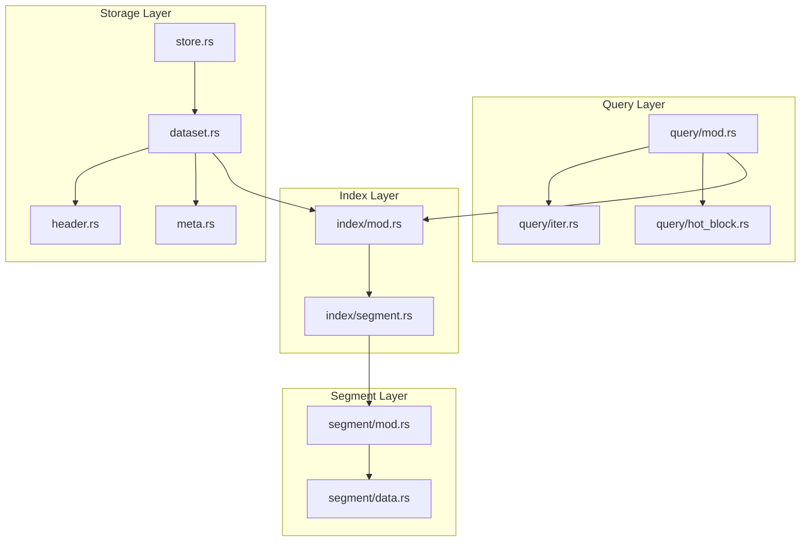
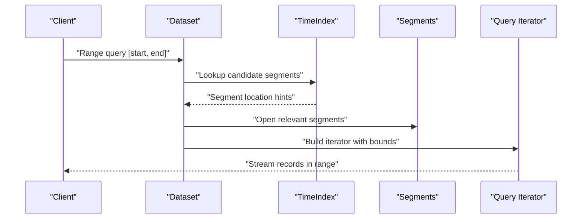
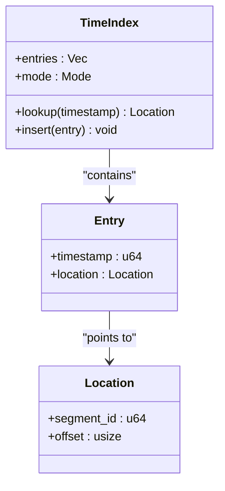
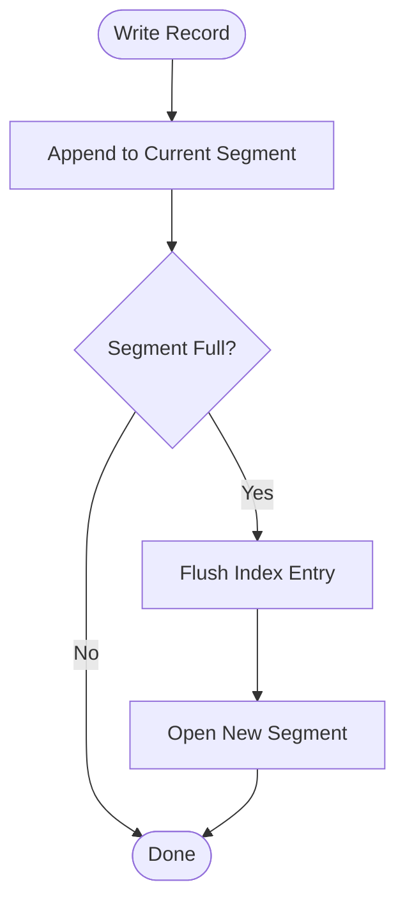
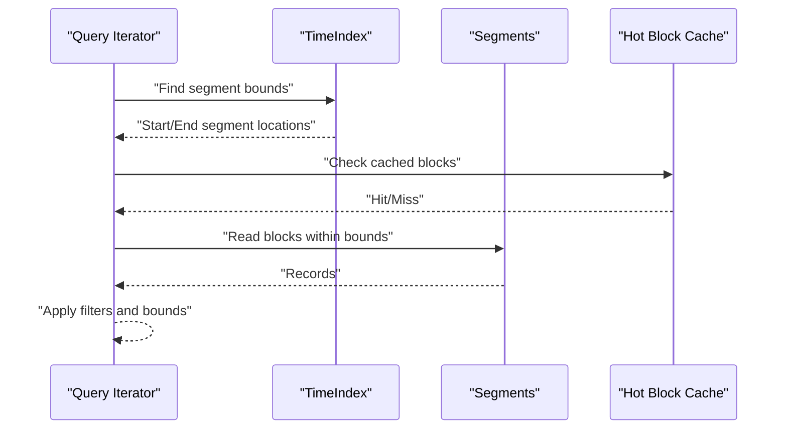
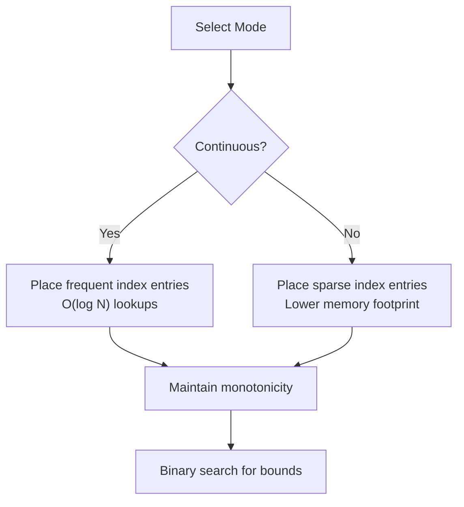
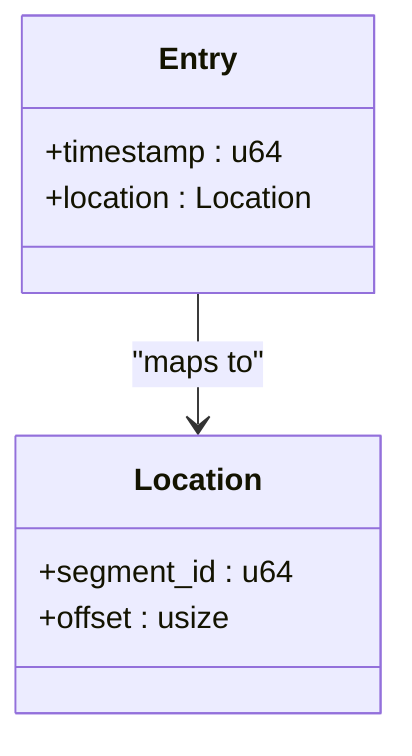
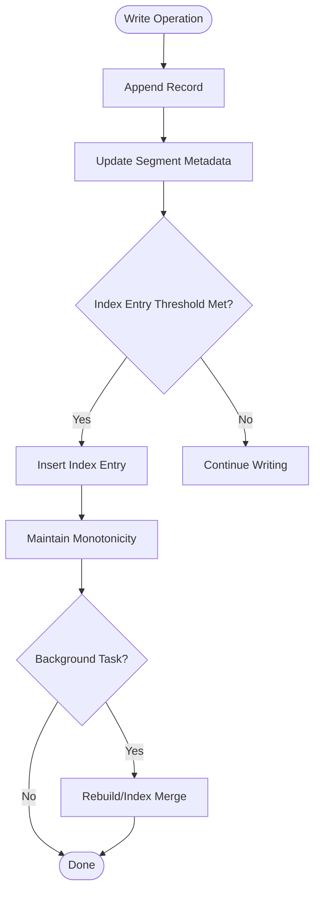
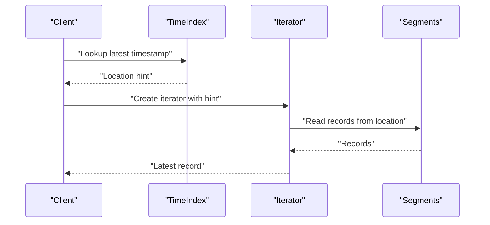
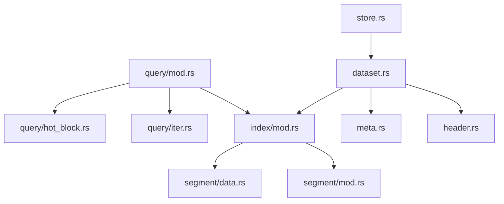

# Indexing Strategies and Time-Index Architecture

<cite>
**Referenced Files in This Document**
- [index/mod.rs](file://src/index/mod.rs)
- [index/segment.rs](file://src/index/segment.rs)
- [segment/mod.rs](file://src/segment/mod.rs)
- [segment/data.rs](file://src/segment/data.rs)
- [query/mod.rs](file://src/query/mod.rs)
- [query/iter.rs](file://src/query/iter.rs)
- [query/hot_block.rs](file://src/query/hot_block.rs)
- [store.rs](file://src/store.rs)
- [dataset.rs](file://src/dataset.rs)
- [header.rs](file://src/header.rs)
- [meta.rs](file://src/meta.rs)
- [docs/design/time-index.md](file://docs/design/time-index.md)
- [docs/design/index-continuous.md](file://docs/design/index-continuous.md)
- [docs/plan/phase-04-time-index.md](file://docs/plan/phase-04-time-index.md)
- [docs/plan/phase-24-sparse-continuous-index.md](file://docs/plan/phase-24-sparse-continuous-index.md)
</cite>

## Table of Contents
1. [Introduction](#introduction)
2. [Project Structure](#project-structure)
3. [Core Components](#core-components)
4. [Architecture Overview](#architecture-overview)
5. [Detailed Component Analysis](#detailed-component-analysis)
6. [Dependency Analysis](#dependency-analysis)
7. [Performance Considerations](#performance-considerations)
8. [Troubleshooting Guide](#troubleshooting-guide)
9. [Conclusion](#conclusion)

## Introduction
This document explains TimSLite's indexing strategies and time-index architecture. It focuses on how timestamps are indexed, the binary search implementation for timestamp-based lookups, continuous versus sparse indexing modes, and their performance characteristics. It also covers index entry structure, timestamp-to-location mapping, index maintenance during data operations, and the interplay between time indexes and data segments for efficient range queries. Finally, it outlines index rebuilding strategies and maintenance operations.

## Project Structure
TimSLite organizes indexing logic under the index module, with supporting components in segment, query, store, dataset, header, and meta modules. Design documents in docs/design and docs/plan provide conceptual and historical context for indexing decisions.

**Diagram sources**
- [index/mod.rs](file://src/index/mod.rs)
- [index/segment.rs](file://src/index/segment.rs)
- [segment/mod.rs](file://src/segment/mod.rs)
- [segment/data.rs](file://src/segment/data.rs)
- [query/mod.rs](file://src/query/mod.rs)
- [query/iter.rs](file://src/query/iter.rs)
- [query/hot_block.rs](file://src/query/hot_block.rs)
- [store.rs](file://src/store.rs)
- [dataset.rs](file://src/dataset.rs)
- [header.rs](file://src/header.rs)
- [meta.rs](file://src/meta.rs)

**Section sources**
- [index/mod.rs](file://src/index/mod.rs)
- [index/segment.rs](file://src/index/segment.rs)
- [segment/mod.rs](file://src/segment/mod.rs)
- [segment/data.rs](file://src/segment/data.rs)
- [query/mod.rs](file://src/query/mod.rs)
- [query/iter.rs](file://src/query/iter.rs)
- [query/hot_block.rs](file://src/query/hot_block.rs)
- [store.rs](file://src/store.rs)
- [dataset.rs](file://src/dataset.rs)
- [header.rs](file://src/header.rs)
- [meta.rs](file://src/meta.rs)

## Core Components
- Time Index Module: Provides index entry structure and lookup mechanisms for timestamp-based navigation.
- Segment Module: Manages data segments and their metadata, including how segments relate to indexes.
- Query Module: Implements iterators and hot-block caching to efficiently traverse indexed ranges.
- Store and Dataset: Coordinate persistence and lifecycle, including index updates during writes and compactions.
- Header and Meta: Track global state and configuration that influence indexing behavior.

Key responsibilities:
- Index entries map timestamps to segment locations for fast binary search.
- Continuous mode maintains frequent index points for O(log N) lookups with minimal overhead.
- Sparse mode reduces index size at the cost of slightly slower lookups but lower memory usage.
- During write operations, new entries update the time index and maintain monotonicity.
- Range queries leverage the index to locate segment boundaries and iterate within bounds.

**Section sources**
- [index/mod.rs](file://src/index/mod.rs)
- [index/segment.rs](file://src/index/segment.rs)
- [segment/mod.rs](file://src/segment/mod.rs)
- [segment/data.rs](file://src/segment/data.rs)
- [query/mod.rs](file://src/query/mod.rs)
- [query/iter.rs](file://src/query/iter.rs)
- [query/hot_block.rs](file://src/query/hot_block.rs)
- [store.rs](file://src/store.rs)
- [dataset.rs](file://src/dataset.rs)
- [header.rs](file://src/header.rs)
- [meta.rs](file://src/meta.rs)

## Architecture Overview
The time-index architecture integrates tightly with data segments to support efficient timestamp-based queries. Indexes are maintained per dataset and updated during append/write operations. Binary search locates candidate segments for a given timestamp, after which the iterator traverses within bounds.

**Diagram sources**
- [index/mod.rs](file://src/index/mod.rs)
- [index/segment.rs](file://src/index/segment.rs)
- [segment/mod.rs](file://src/segment/mod.rs)
- [query/mod.rs](file://src/query/mod.rs)
- [query/iter.rs](file://src/query/iter.rs)

## Detailed Component Analysis

### Time Index Module
The time index module defines the index entry structure and binary search routines for timestamp-based lookups. Index entries map timestamps to segment locations, enabling O(log N) retrieval via binary search.

Key aspects:
- Index entry structure: Contains timestamp and segment location fields.
- Binary search: Implemented to find the rightmost or leftmost position for a given timestamp, depending on whether the query requires inclusive/exclusive bounds.
- Continuous vs sparse modes: Continuous mode places index entries at regular intervals or per segment boundary, while sparse mode reduces frequency to save space.

**Diagram sources**
- [index/mod.rs](file://src/index/mod.rs)
- [index/segment.rs](file://src/index/segment.rs)

**Section sources**
- [index/mod.rs](file://src/index/mod.rs)
- [index/segment.rs](file://src/index/segment.rs)

### Segment Module and Data Segments
The segment module manages data segments and their metadata. Segments are the physical storage units that hold records, and the time index references segment locations to guide queries.

Key aspects:
- Segment boundaries: Each segment stores a contiguous set of records with monotonic timestamps.
- Location mapping: Locations in the index point to a specific segment and offset within that segment.
- Relationship to index: Index entries act as navigational aids to quickly locate the relevant segments for a timestamp range.

**Diagram sources**
- [segment/mod.rs](file://src/segment/mod.rs)
- [segment/data.rs](file://src/segment/data.rs)
- [index/mod.rs](file://src/index/mod.rs)

**Section sources**
- [segment/mod.rs](file://src/segment/mod.rs)
- [segment/data.rs](file://src/segment/data.rs)

### Query Iterators and Hot Block Caching
The query module provides iterators that traverse data within timestamp bounds. Hot block caching improves performance by keeping recently accessed blocks in memory.

Key aspects:
- Iterator construction: Uses index-provided segment hints to limit traversal scope.
- Hot block caching: Reduces repeated IO by caching frequently accessed blocks.
- Range enforcement: Iterators enforce start/end bounds derived from the time index.

**Diagram sources**
- [query/mod.rs](file://src/query/mod.rs)
- [query/iter.rs](file://src/query/iter.rs)
- [query/hot_block.rs](file://src/query/hot_block.rs)
- [index/mod.rs](file://src/index/mod.rs)

**Section sources**
- [query/mod.rs](file://src/query/mod.rs)
- [query/iter.rs](file://src/query/iter.rs)
- [query/hot_block.rs](file://src/query/hot_block.rs)

### Continuous vs Sparse Indexing Modes
Continuous indexing places frequent index entries to minimize lookup cost, while sparse indexing reduces index size at the expense of occasional extra segment scans.

Key aspects:
- Continuous mode: Higher granularity index entries for O(log N) lookups with minimal overhead.
- Sparse mode: Fewer index entries reduce memory footprint but may require additional checks.
- Trade-offs: Choose continuous for high-throughput reads; choose sparse for constrained memory environments.

**Diagram sources**
- [docs/design/index-continuous.md](file://docs/design/index-continuous.md)
- [docs/plan/phase-24-sparse-continuous-index.md](file://docs/plan/phase-24-sparse-continuous-index.md)

**Section sources**
- [docs/design/index-continuous.md](file://docs/design/index-continuous.md)
- [docs/plan/phase-24-sparse-continuous-index.md](file://docs/plan/phase-24-sparse-continuous-index.md)

### Index Entry Structure and Timestamp-to-Location Mapping
Index entries consist of a timestamp and a location pointing to a specific segment and offset. This mapping enables precise navigation to the relevant data region.

Key aspects:
- Entry fields: timestamp and location (segment_id, offset).
- Monotonicity: Entries are kept sorted by timestamp to support binary search.
- Location semantics: location identifies where to start reading within a segment.

**Diagram sources**
- [index/mod.rs](file://src/index/mod.rs)
- [index/segment.rs](file://src/index/segment.rs)

**Section sources**
- [index/mod.rs](file://src/index/mod.rs)
- [index/segment.rs](file://src/index/segment.rs)

### Maintenance During Data Operations
During write operations, new entries update the time index and maintain monotonicity. Compaction and background tasks may rebuild or reorganize indexes to optimize performance.

Key aspects:
- Write path: Append record, update current segment, insert index entry if threshold met.
- Background maintenance: Rebuilds and merges to keep index compact and sorted.
- Compaction: Merges small segments and updates index entries accordingly.

**Diagram sources**
- [index/mod.rs](file://src/index/mod.rs)
- [segment/mod.rs](file://src/segment/mod.rs)
- [store.rs](file://src/store.rs)
- [dataset.rs](file://src/dataset.rs)

**Section sources**
- [index/mod.rs](file://src/index/mod.rs)
- [segment/mod.rs](file://src/segment/mod.rs)
- [store.rs](file://src/store.rs)
- [dataset.rs](file://src/dataset.rs)

### Query Execution Examples
Example scenarios:
- Single-timestamp read: Binary search locates the nearest entry, then the iterator reads from that location.
- Latest timestamp read: Locate the last entry and read backwards if needed.
- Range query: Find start and end bounds using binary search, then stream records within those bounds.

**Diagram sources**
- [index/mod.rs](file://src/index/mod.rs)
- [query/mod.rs](file://src/query/mod.rs)
- [query/iter.rs](file://src/query/iter.rs)

**Section sources**
- [index/mod.rs](file://src/index/mod.rs)
- [query/mod.rs](file://src/query/mod.rs)
- [query/iter.rs](file://src/query/iter.rs)

## Dependency Analysis
The index module depends on segment metadata and is consumed by the query module. Store and dataset orchestrate persistence and lifecycle events that trigger index updates. Header and meta provide global configuration influencing index behavior.

**Diagram sources**
- [index/mod.rs](file://src/index/mod.rs)
- [index/segment.rs](file://src/index/segment.rs)
- [segment/mod.rs](file://src/segment/mod.rs)
- [segment/data.rs](file://src/segment/data.rs)
- [query/mod.rs](file://src/query/mod.rs)
- [query/iter.rs](file://src/query/iter.rs)
- [query/hot_block.rs](file://src/query/hot_block.rs)
- [store.rs](file://src/store.rs)
- [dataset.rs](file://src/dataset.rs)
- [header.rs](file://src/header.rs)
- [meta.rs](file://src/meta.rs)

**Section sources**
- [index/mod.rs](file://src/index/mod.rs)
- [index/segment.rs](file://src/index/segment.rs)
- [segment/mod.rs](file://src/segment/mod.rs)
- [segment/data.rs](file://src/segment/data.rs)
- [query/mod.rs](file://src/query/mod.rs)
- [query/iter.rs](file://src/query/iter.rs)
- [query/hot_block.rs](file://src/query/hot_block.rs)
- [store.rs](file://src/store.rs)
- [dataset.rs](file://src/dataset.rs)
- [header.rs](file://src/header.rs)
- [meta.rs](file://src/meta.rs)

## Performance Considerations
- Continuous vs sparse trade-offs: Continuous mode favors low-latency lookups; sparse mode favors memory efficiency.
- Binary search complexity: O(log N) for locating candidate segments; iteration within bounds is linear in the number of records returned.
- Hot block caching: Reduces repeated IO for frequently accessed regions.
- Background maintenance: Rebuilding and merging indexes keeps them compact and sorted, preventing fragmentation.
- Segment sizing: Larger segments reduce index entry count but increase scan costs; tune based on workload.

[No sources needed since this section provides general guidance]

## Troubleshooting Guide
Common issues and remedies:
- Index out of order: Verify monotonic insertion and rebuild if necessary.
- Memory pressure with continuous mode: Switch to sparse mode or adjust segment sizes.
- Slow range queries: Ensure index entries are placed appropriately; consider background rebuild.
- Iterator errors: Confirm bounds alignment with index hints and segment metadata.

**Section sources**
- [index/mod.rs](file://src/index/mod.rs)
- [index/segment.rs](file://src/index/segment.rs)
- [query/iter.rs](file://src/query/iter.rs)
- [segment/mod.rs](file://src/segment/mod.rs)

## Conclusion
TimSLite’s time-index architecture combines compact index entries with efficient binary search and iterator-based traversal to deliver fast timestamp-based queries. Continuous mode optimizes for speed, while sparse mode balances memory usage. Proper maintenance and background operations ensure indexes remain effective over time, and the tight coupling between indexes and data segments enables robust range queries.

[No sources needed since this section summarizes without analyzing specific files]