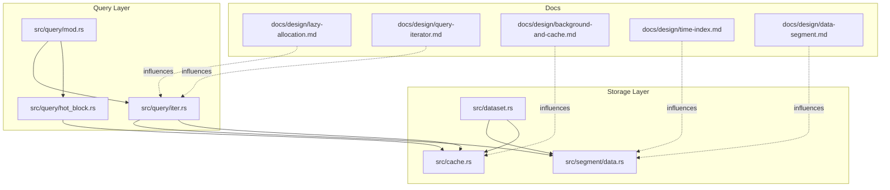
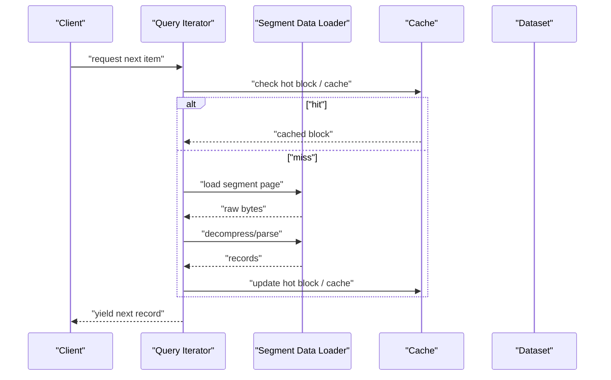
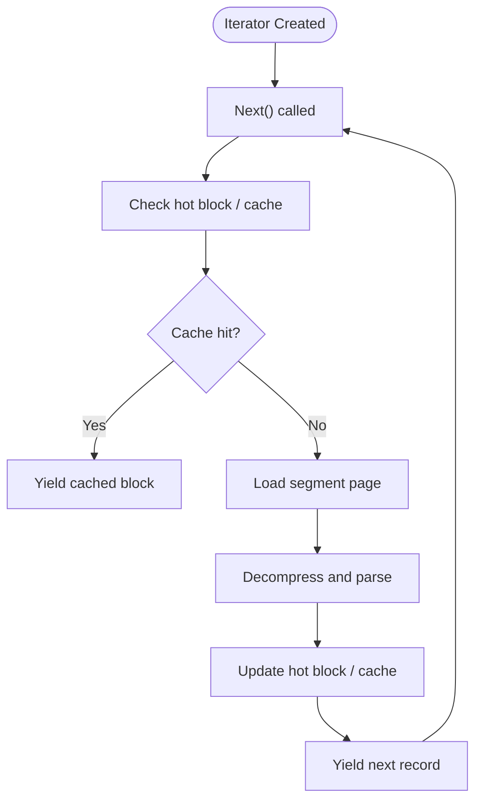
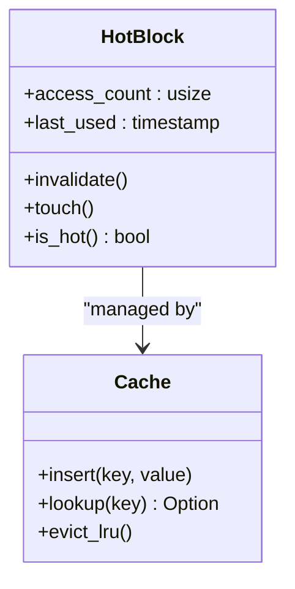
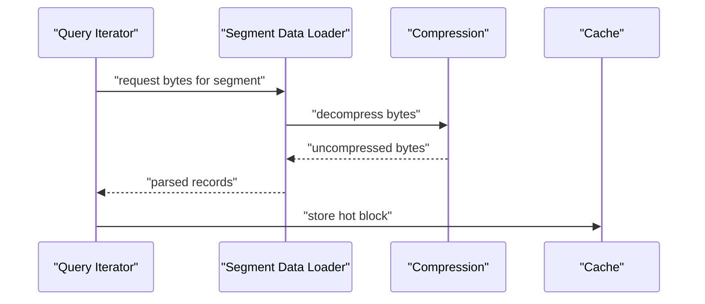
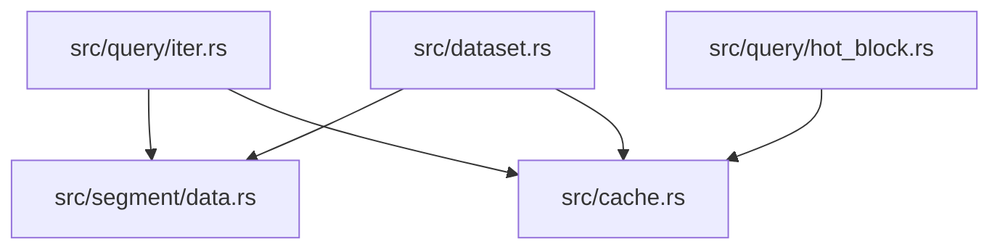

# Lazy Evaluation and Deferred Processing

<cite>
**Referenced Files in This Document**
- [lib.rs](file://src/lib.rs)
- [iter.rs](file://src/query/iter.rs)
- [hot_block.rs](file://src/query/hot_block.rs)
- [mod.rs](file://src/query/mod.rs)
- [data.rs](file://src/segment/data.rs)
- [cache.rs](file://src/cache.rs)
- [dataset.rs](file://src/dataset.rs)
- [lazy_allocation_test.rs](file://tests/lazy_allocation_test.rs)
- [query_test.rs](file://tests/query_test.rs)
- [design-decisions.md](file://docs/design/background-and-cache.md)
- [lazy-allocation.md](file://docs/design/lazy-allocation.md)
- [query-iterator.md](file://docs/design/query-iterator.md)
- [time-index.md](file://docs/design/time-index.md)
- [data-segment.md](file://docs/design/data-segment.md)
</cite>

## Table of Contents
1. [Introduction](#introduction)
2. [Project Structure](#project-structure)
3. [Core Components](#core-components)
4. [Architecture Overview](#architecture-overview)
5. [Detailed Component Analysis](#detailed-component-analysis)
6. [Dependency Analysis](#dependency-analysis)
7. [Performance Considerations](#performance-considerations)
8. [Troubleshooting Guide](#troubleshooting-guide)
9. [Conclusion](#conclusion)

## Introduction
This document explains TimSLite’s lazy evaluation and deferred processing strategies. It focuses on how the system loads only necessary data segments and index entries, generates query results on-demand via an iterator pattern, and optimizes frequently accessed data with a hot block mechanism. We also discuss how lazy evaluation enables efficient processing of large datasets and the trade-offs between memory efficiency and computational overhead compared to eager processing.

## Project Structure
TimSLite organizes query-related logic under the query module, with dedicated files for iterators and hot block optimization. Supporting components include segment data handling, caching, and dataset operations. Design documents outline the rationale for lazy allocation, query iteration, and caching strategies.

**Diagram sources**
- [mod.rs](file://src/query/mod.rs)
- [iter.rs](file://src/query/iter.rs)
- [hot_block.rs](file://src/query/hot_block.rs)
- [data.rs](file://src/segment/data.rs)
- [cache.rs](file://src/cache.rs)
- [dataset.rs](file://src/dataset.rs)
- [lazy-allocation.md](file://docs/design/lazy-allocation.md)
- [query-iterator.md](file://docs/design/query-iterator.md)
- [background-and-cache.md](file://docs/design/background-and-cache.md)
- [time-index.md](file://docs/design/time-index.md)
- [data-segment.md](file://docs/design/data-segment.md)

**Section sources**
- [lib.rs](file://src/lib.rs)
- [mod.rs](file://src/query/mod.rs)
- [iter.rs](file://src/query/iter.rs)
- [hot_block.rs](file://src/query/hot_block.rs)
- [data.rs](file://src/segment/data.rs)
- [cache.rs](file://src/cache.rs)
- [dataset.rs](file://src/dataset.rs)
- [lazy-allocation.md](file://docs/design/lazy-allocation.md)
- [query-iterator.md](file://docs/design/query-iterator.md)
- [background-and-cache.md](file://docs/design/background-and-cache.md)
- [time-index.md](file://docs/design/time-index.md)
- [data-segment.md](file://docs/design/data-segment.md)

## Core Components
- Query iterator: Implements on-demand traversal of data segments and index entries, minimizing memory footprint by loading only what is needed.
- Hot block optimization: Keeps frequently accessed blocks in fast-access storage to improve sequential access performance.
- Segment data loader: Provides lazy access to data segments, deferring decompression and deserialization until required.
- Caching subsystem: Supports both general caching and hot block caching to reduce repeated IO and computation.

These components work together to support lazy evaluation across query chains, enabling efficient processing of large datasets without loading entire datasets into memory.

**Section sources**
- [iter.rs](file://src/query/iter.rs)
- [hot_block.rs](file://src/query/hot_block.rs)
- [data.rs](file://src/segment/data.rs)
- [cache.rs](file://src/cache.rs)
- [lazy-allocation.md](file://docs/design/lazy-allocation.md)
- [query-iterator.md](file://docs/design/query-iterator.md)

## Architecture Overview
The query pipeline leverages lazy evaluation to traverse time-ordered data segments and index entries. Iterators yield items on demand, while hot blocks accelerate access to recent or frequently queried regions. Segment data is lazily decompressed and parsed only when a record is reached.

**Diagram sources**
- [iter.rs](file://src/query/iter.rs)
- [hot_block.rs](file://src/query/hot_block.rs)
- [data.rs](file://src/segment/data.rs)
- [cache.rs](file://src/cache.rs)
- [dataset.rs](file://src/dataset.rs)

## Detailed Component Analysis

### Query Iterator Pattern
The iterator pattern drives on-demand result generation. It traverses time-ordered segments and index entries, yielding records only when requested. This defers IO and parsing costs until the consumer needs them, reducing peak memory usage.

**Diagram sources**
- [iter.rs](file://src/query/iter.rs)
- [hot_block.rs](file://src/query/hot_block.rs)
- [data.rs](file://src/segment/data.rs)
- [cache.rs](file://src/cache.rs)

**Section sources**
- [iter.rs](file://src/query/iter.rs)
- [query-iterator.md](file://docs/design/query-iterator.md)

### Hot Block Optimization
Hot blocks keep recently accessed or frequently queried data in a fast-access cache region. This reduces repeated IO and accelerates sequential scans over contiguous time windows.

**Diagram sources**
- [hot_block.rs](file://src/query/hot_block.rs)
- [cache.rs](file://src/cache.rs)

**Section sources**
- [hot_block.rs](file://src/query/hot_block.rs)
- [cache.rs](file://src/cache.rs)
- [background-and-cache.md](file://docs/design/background-and-cache.md)

### Lazy Loading of Data Segments
Segment data is loaded lazily: raw bytes are fetched on demand, then decompressed and parsed only when a record is reached. This minimizes memory usage during scanning and avoids unnecessary CPU work.

**Diagram sources**
- [iter.rs](file://src/query/iter.rs)
- [data.rs](file://src/segment/data.rs)
- [cache.rs](file://src/cache.rs)

**Section sources**
- [data.rs](file://src/segment/data.rs)
- [lazy-allocation.md](file://docs/design/lazy-allocation.md)
- [data-segment.md](file://docs/design/data-segment.md)

### Query Chains and Deferred Processing
TimSLite supports chaining query operations (filter, sort, aggregation) that remain lazy until consumed. Each operation defers computation, building a pipeline of deferred steps. Only when the final consumer requests items does the pipeline execute incrementally.

**Diagram sources**
- [iter.rs](file://src/query/iter.rs)
- [query-iterator.md](file://docs/design/query-iterator.md)

**Section sources**
- [iter.rs](file://src/query/iter.rs)
- [query_test.rs](file://tests/query_test.rs)

## Dependency Analysis
The query iterator depends on segment data loading and caching. Hot block optimization integrates with the caching subsystem. Dataset operations supply the underlying time-ordered data that the iterator consumes.

**Diagram sources**
- [iter.rs](file://src/query/iter.rs)
- [hot_block.rs](file://src/query/hot_block.rs)
- [data.rs](file://src/segment/data.rs)
- [cache.rs](file://src/cache.rs)
- [dataset.rs](file://src/dataset.rs)

**Section sources**
- [iter.rs](file://src/query/iter.rs)
- [hot_block.rs](file://src/query/hot_block.rs)
- [data.rs](file://src/segment/data.rs)
- [cache.rs](file://src/cache.rs)
- [dataset.rs](file://src/dataset.rs)

## Performance Considerations
- Memory efficiency: Lazy loading and on-demand parsing reduce peak memory usage by avoiding full dataset loading.
- Computational overhead: Lazy evaluation introduces per-item overhead for IO and decompression; hot blocks mitigate this for sequential access.
- Throughput: Chaining deferred operations allows the system to process large datasets efficiently, but consumers should avoid materializing intermediate results unnecessarily.
- Trade-offs: Eager processing can reduce per-item overhead at the cost of higher memory usage. Lazy processing favors memory efficiency with incremental CPU costs.

[No sources needed since this section provides general guidance]

## Troubleshooting Guide
- Unexpected delays during initial scans: Verify hot block configuration and cache sizing; ensure sequential access patterns benefit from hot block promotion.
- Memory spikes during scans: Confirm that lazy loading is enabled and that consumers iterate without buffering entire result sets.
- Slow random access: Review cache hit rates and consider adjusting hot block thresholds or segment sizes for the workload.

**Section sources**
- [lazy_allocation_test.rs](file://tests/lazy_allocation_test.rs)
- [query_test.rs](file://tests/query_test.rs)
- [background-and-cache.md](file://docs/design/background-and-cache.md)

## Conclusion
TimSLite’s lazy evaluation and deferred processing strategies minimize memory usage by loading only necessary data segments and index entries, generating results on-demand via an iterator pattern. Hot blocks optimize sequential access for frequently used data, while query chains enable efficient processing of large datasets without eager materialization. The design balances memory efficiency against computational overhead, favoring scalable performance for time-series workloads.