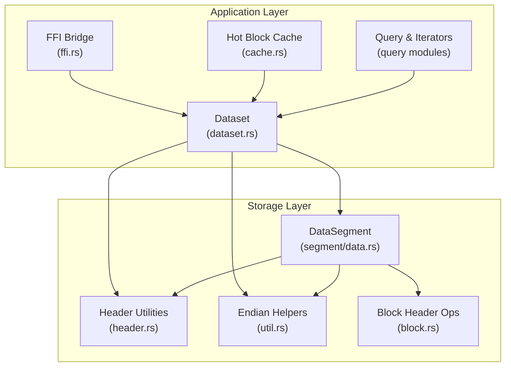
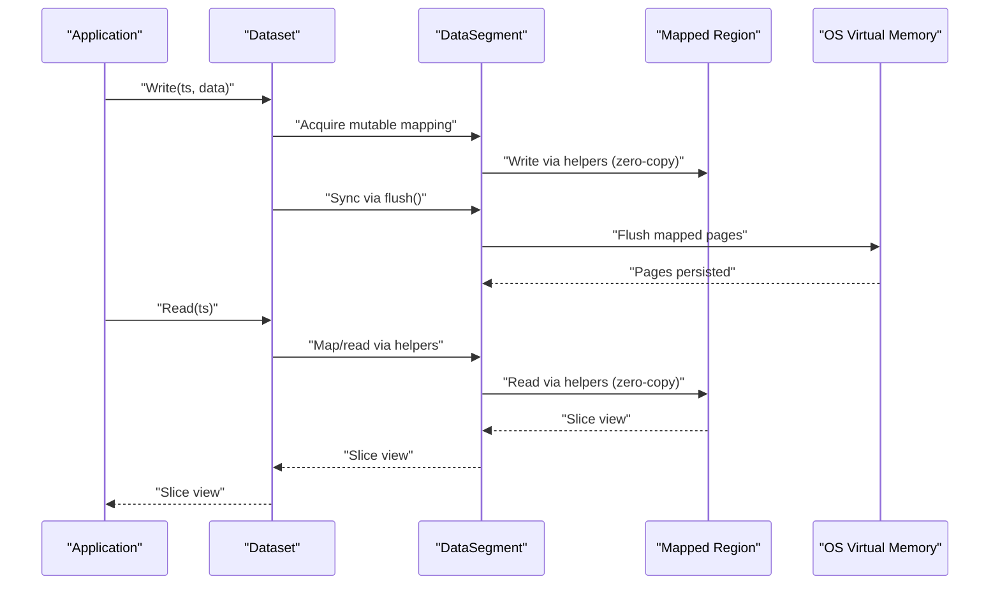
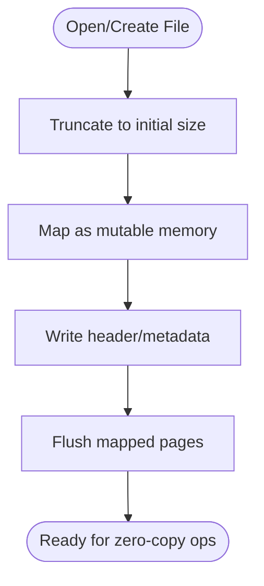
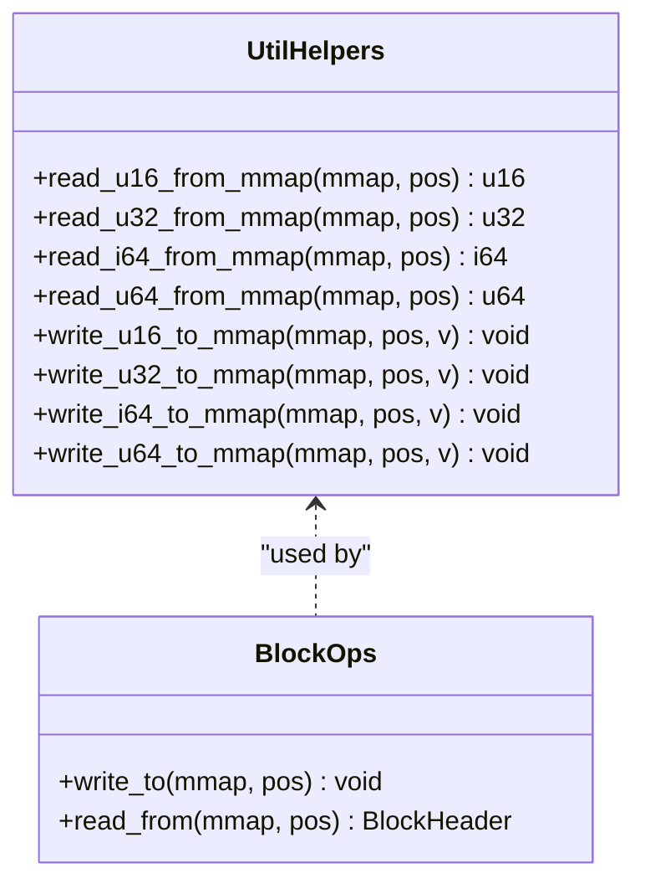
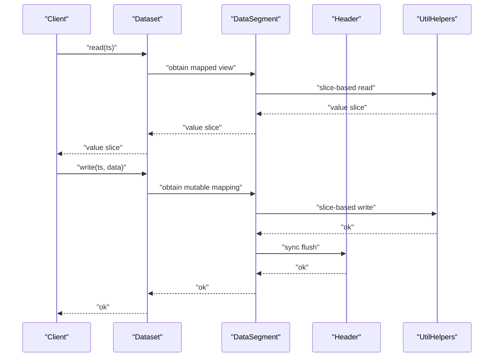
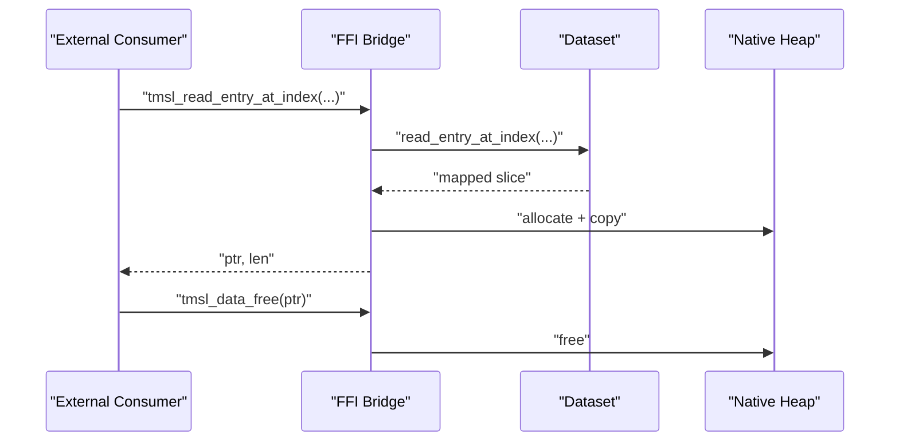
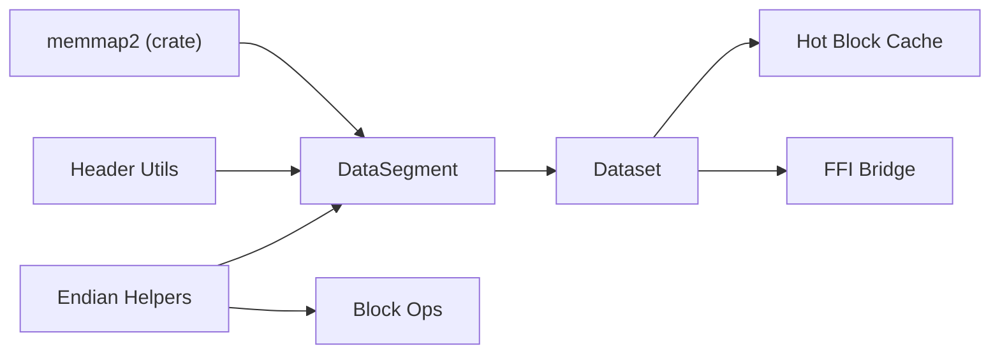

# Memory-Mapped I/O Architecture

<cite>
**Referenced Files in This Document**
- [util.rs](file://src/util.rs)
- [data.rs](file://src/segment/data.rs)
- [header.rs](file://src/header.rs)
- [dataset.rs](file://src/dataset.rs)
- [ffi.rs](file://src/ffi.rs)
- [cache.rs](file://src/cache.rs)
- [block.rs](file://src/block.rs)
- [Cargo.toml](file://Cargo.toml)
</cite>

## Table of Contents
1. [Introduction](#introduction)
2. [Project Structure](#project-structure)
3. [Core Components](#core-components)
4. [Architecture Overview](#architecture-overview)
5. [Detailed Component Analysis](#detailed-component-analysis)
6. [Dependency Analysis](#dependency-analysis)
7. [Performance Considerations](#performance-considerations)
8. [Troubleshooting Guide](#troubleshooting-guide)
9. [Conclusion](#conclusion)

## Introduction
This document explains TimSLite’s memory-mapped I/O architecture and how it enables zero-copy data access, eliminates redundant system calls, and leverages virtual memory and page faults for efficient storage operations. It covers how file-backed memory regions integrate with application memory, how data is accessed via pointers and slices, and how TimSLite synchronizes updates safely. It also outlines shared-memory usage patterns and cross-process access considerations, along with performance benefits derived from avoiding explicit read/write syscalls.

## Project Structure
TimSLite organizes memory-mapped storage around several core modules:
- Segment creation and lifecycle: DataSegment manages file creation, truncation, and initial mapping.
- Header and state management: Header utilities handle shared metadata and synchronization.
- Utility helpers: Endianness-aware read/write helpers operate directly on mapped slices.
- Dataset integration: Dataset coordinates reads/writes and exposes zero-copy views of mapped data.
- Query and caching: Hot block cache and iterators work over mapped buffers.
- FFI boundary: Exposes mapped data to external consumers while managing allocation lifecycles.

**Diagram sources**
- [data.rs:70-99](file://src/segment/data.rs#L70-L99)
- [header.rs:572-599](file://src/header.rs#L572-L599)
- [util.rs:53-162](file://src/util.rs#L53-L162)
- [block.rs:46-61](file://src/block.rs#L46-L61)
- [dataset.rs:757-810](file://src/dataset.rs#L757-L810)
- [cache.rs:338-353](file://src/cache.rs#L338-L353)
- [ffi.rs:817-853](file://src/ffi.rs#L817-L853)

**Section sources**
- [data.rs:70-99](file://src/segment/data.rs#L70-L99)
- [header.rs:572-599](file://src/header.rs#L572-L599)
- [util.rs:53-162](file://src/util.rs#L53-L162)
- [block.rs:46-61](file://src/block.rs#L46-L61)
- [dataset.rs:757-810](file://src/dataset.rs#L757-L810)
- [cache.rs:338-353](file://src/cache.rs#L338-L353)
- [ffi.rs:817-853](file://src/ffi.rs#L817-L853)

## Core Components
- Memory-mapped file creation and mapping:
  - DataSegment creates a file, truncates it to an initial size, and maps it as mutable memory. This establishes a file-backed region in process address space.
  - Header utilities provide synchronization primitives to flush mapped pages to disk and update state fields in-place.
- Zero-copy access helpers:
  - Endianness-aware helpers read/write fixed-size integers directly from mapped slices, enabling pointer-like access without extra copies.
- Dataset integration:
  - Dataset coordinates reads/writes, exposing mapped buffers for efficient iteration and query processing.
- Hot block cache:
  - A short-lived cache operates over mapped data to accelerate frequent reads within a recent window.
- FFI boundary:
  - When returning data across the FFI boundary, TimSLite allocates native memory and copies mapped data into it, ensuring safe ownership semantics.

**Section sources**
- [data.rs:70-99](file://src/segment/data.rs#L70-L99)
- [header.rs:572-599](file://src/header.rs#L572-L599)
- [util.rs:53-162](file://src/util.rs#L53-L162)
- [dataset.rs:757-810](file://src/dataset.rs#L757-L810)
- [cache.rs:338-353](file://src/cache.rs#L338-L353)
- [ffi.rs:817-853](file://src/ffi.rs#L817-L853)

## Architecture Overview
TimSLite’s memory-mapped architecture maps storage files directly into process virtual address space. Reads and writes become simple pointer dereferences and slice operations, bypassing traditional syscall overhead. Synchronization ensures durability and correctness across process boundaries.

**Diagram sources**
- [data.rs:70-99](file://src/segment/data.rs#L70-L99)
- [header.rs:572-599](file://src/header.rs#L572-L599)
- [util.rs:53-162](file://src/util.rs#L53-L162)
- [dataset.rs:757-810](file://src/dataset.rs#L757-L810)

## Detailed Component Analysis

### Memory Mapping Lifecycle
- Creation and mapping:
  - DataSegment opens a file, sets its length, and maps it as mutable. This creates a contiguous file-backed region in virtual memory.
- Header initialization:
  - Metadata is written into the mapped region, establishing layout and state offsets.
- Synchronization:
  - Header utilities expose a flush operation to synchronize mapped pages to disk, ensuring durability.

**Diagram sources**
- [data.rs:70-99](file://src/segment/data.rs#L70-L99)
- [header.rs:572-599](file://src/header.rs#L572-L599)

**Section sources**
- [data.rs:70-99](file://src/segment/data.rs#L70-L99)
- [header.rs:572-599](file://src/header.rs#L572-L599)

### Zero-Copy Access via Helpers
- Endianness-aware helpers:
  - Fixed-width reads/writes operate directly on slices within the mapped region, preserving endianness and avoiding syscalls.
- Block header operations:
  - Block-level structures are read/written using the same helpers, enabling compact, typed access to on-disk layouts.

**Diagram sources**
- [util.rs:53-162](file://src/util.rs#L53-L162)
- [block.rs:46-61](file://src/block.rs#L46-L61)

**Section sources**
- [util.rs:53-162](file://src/util.rs#L53-L162)
- [block.rs:46-61](file://src/block.rs#L46-L61)

### Dataset Read/Write Integration
- Dataset coordinates mapping and access:
  - On read, Dataset retrieves a mapped view and returns a slice for the requested record.
  - On write, Dataset updates the mapped region and triggers synchronization.
- Hot block cache:
  - A small cache stores recent blocks to reduce repeated reads within a short time window.

**Diagram sources**
- [dataset.rs:757-810](file://src/dataset.rs#L757-L810)
- [header.rs:572-599](file://src/header.rs#L572-L599)
- [util.rs:53-162](file://src/util.rs#L53-L162)

**Section sources**
- [dataset.rs:757-810](file://src/dataset.rs#L757-L810)
- [cache.rs:338-353](file://src/cache.rs#L338-L353)
- [header.rs:572-599](file://src/header.rs#L572-L599)
- [util.rs:53-162](file://src/util.rs#L53-L162)

### FFI Boundary and Cross-Process Considerations
- FFI data transfer:
  - When returning data across the FFI boundary, TimSLite allocates native memory and copies mapped data into it, ensuring safe ownership semantics.
- Shared memory and cross-process access:
  - TimSLite’s design centers on per-process mappings. Cross-process sharing requires careful coordination (e.g., shared files, locks, and explicit synchronization), which are not implemented in the current codebase.

**Diagram sources**
- [ffi.rs:817-853](file://src/ffi.rs#L817-L853)
- [dataset.rs:757-810](file://src/dataset.rs#L757-L810)

**Section sources**
- [ffi.rs:817-853](file://src/ffi.rs#L817-L853)
- [dataset.rs:757-810](file://src/dataset.rs#L757-L810)

## Dependency Analysis
- External dependency:
  - Memory mapping relies on the memmap2 crate for platform-agnostic mapping and flushing.
- Internal dependencies:
  - DataSegment depends on Header utilities for synchronization and on endian helpers for typed I/O.
  - Dataset integrates DataSegment, Header, and endian helpers, and optionally uses HotBlockCache for performance.

**Diagram sources**
- [Cargo.toml](file://Cargo.toml)
- [data.rs:70-99](file://src/segment/data.rs#L70-L99)
- [header.rs:572-599](file://src/header.rs#L572-L599)
- [util.rs:53-162](file://src/util.rs#L53-L162)
- [block.rs:46-61](file://src/block.rs#L46-L61)
- [dataset.rs:757-810](file://src/dataset.rs#L757-L810)
- [cache.rs:338-353](file://src/cache.rs#L338-L353)
- [ffi.rs:817-853](file://src/ffi.rs#L817-L853)

**Section sources**
- [Cargo.toml](file://Cargo.toml)
- [data.rs:70-99](file://src/segment/data.rs#L70-L99)
- [header.rs:572-599](file://src/header.rs#L572-L599)
- [util.rs:53-162](file://src/util.rs#L53-L162)
- [block.rs:46-61](file://src/block.rs#L46-L61)
- [dataset.rs:757-810](file://src/dataset.rs#L757-L810)
- [cache.rs:338-353](file://src/cache.rs#L338-L353)
- [ffi.rs:817-853](file://src/ffi.rs#L817-L853)

## Performance Considerations
- Elimination of syscall overhead:
  - Traditional file I/O involves kernel transitions for each read/write. With memory-mapped I/O, operations become pointer dereferences and slice copies, reducing syscall frequency and latency.
- Zero-copy data access:
  - Reads return slices backed by mapped memory, avoiding extra memcpy when the consumer can operate directly on the mapped buffer.
- Page fault handling:
  - First access to a page triggers a page fault handled by the OS; subsequent accesses are fast. TimSLite minimizes random access patterns by organizing data into contiguous segments and blocks.
- Synchronization cost:
  - Explicit flushes (via mapped-region sync) are necessary to guarantee durability. Batched writes followed by periodic flushes amortize this cost.
- Compression and caching:
  - Hot block caching reduces repeated reads of recent data, complementing zero-copy access for improved throughput.
- Benchmarking:
  - Benchmarks are not present in the current repository snapshot. To quantify benefits, measure typical workloads (sequential writes, random reads, mixed access patterns) using the standard Rust benchmarking framework and compare against equivalent buffered I/O implementations.

[No sources needed since this section provides general guidance]

## Troubleshooting Guide
- Invalid data access:
  - Bounds checks ensure reads/writes stay within mapped region limits. Out-of-bounds operations raise errors during slice construction or validation.
- Synchronization failures:
  - If flush fails, mapped pages may not be durable. Verify that flush operations succeed and that the underlying filesystem supports memory mapping.
- Endianness mismatches:
  - All multi-byte values are stored in little-endian format. Ensure helpers are used consistently to avoid misinterpretation of values.
- FFI ownership:
  - When crossing the FFI boundary, always free returned buffers using the provided free function to prevent leaks.

**Section sources**
- [util.rs:53-162](file://src/util.rs#L53-L162)
- [header.rs:572-599](file://src/header.rs#L572-L599)
- [ffi.rs:817-853](file://src/ffi.rs#L817-L853)

## Conclusion
TimSLite’s memory-mapped I/O replaces traditional read/write syscalls with direct pointer and slice operations over file-backed regions. Endianness-aware helpers and header utilities provide robust, typed access to on-disk structures, while synchronization ensures durability. Combined with hot block caching and careful access patterns, this architecture delivers zero-copy data access and reduced syscall overhead. Cross-process sharing is not implemented in the current codebase; explicit coordination would be required for shared scenarios.