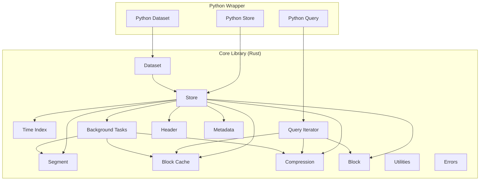
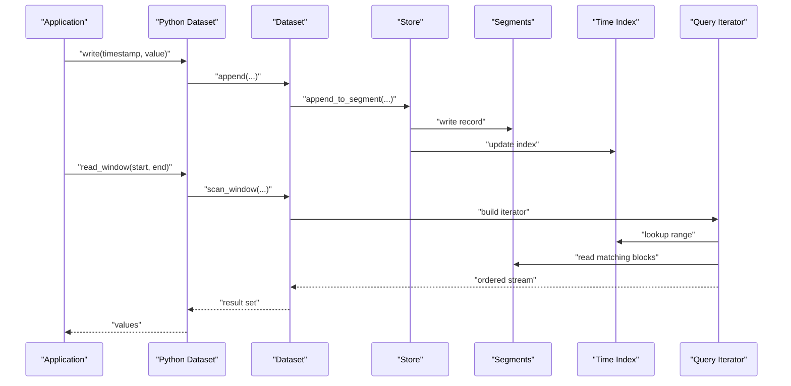
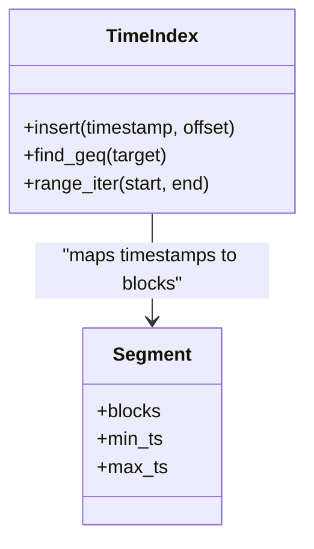
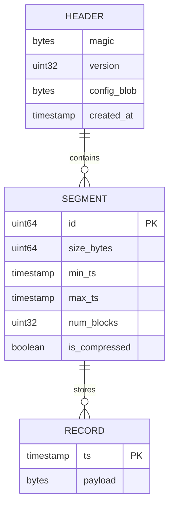
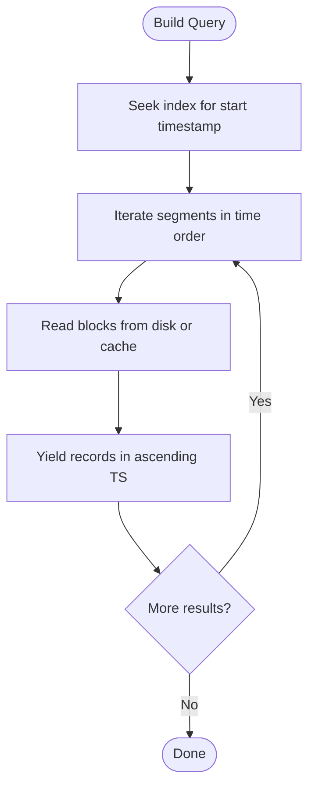
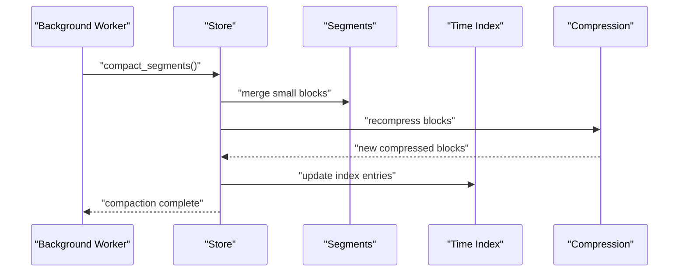
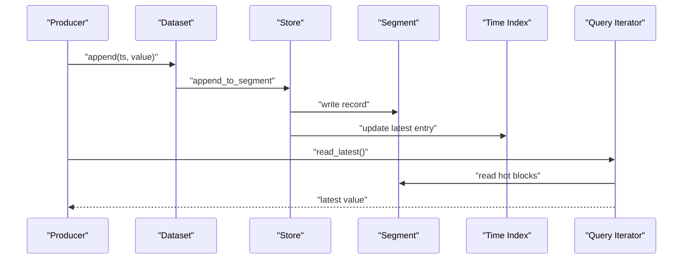
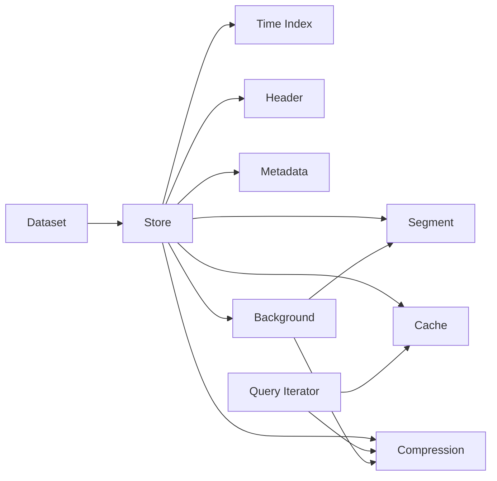

# Time-Series Data Fundamentals

<cite>
**Referenced Files in This Document**
- [lib.rs](file://src/lib.rs)
- [dataset.rs](file://src/dataset.rs)
- [store.rs](file://src/store.rs)
- [segment/mod.rs](file://src/segment/mod.rs)
- [segment/data.rs](file://src/segment/data.rs)
- [index/mod.rs](file://src/index/mod.rs)
- [index/segment.rs](file://src/index/segment.rs)
- [query/mod.rs](file://src/query/mod.rs)
- [query/iter.rs](file://src/query/iter.rs)
- [query/hot_block.rs](file://src/query/hot_block.rs)
- [journal/mod.rs](file://src/journal/mod.rs)
- [bg/mod.rs](file://src/bg/mod.rs)
- [config.rs](file://src/config.rs)
- [header.rs](file://src/header.rs)
- [meta.rs](file://src/meta.rs)
- [cache.rs](file://src/cache.rs)
- [compress.rs](file://src/compress.rs)
- [block.rs](file://src/block.rs)
- [util.rs](file://src/util.rs)
- [ffi.rs](file://src/ffi.rs)
- [error.rs](file://src/error.rs)
- [design.md](file://design.md)
- [plan.md](file://plan.md)
- [docs/design/architecture.md](file://docs/design/architecture.md)
- [docs/design/time-index.md](file://docs/design/time-index.md)
- [docs/design/data-segment.md](file://docs/design/data-segment.md)
- [docs/design/query-iterator.md](file://docs/design/query-iterator.md)
- [docs/design/background.md](file://docs/design/background.md)
- [docs/design/lazy-allocation.md](file://docs/design/lazy-allocation.md)
- [docs/design/compression.md](file://docs/design/compression.md)
- [docs/design/store-and-ffi.md](file://docs/design/store-and-ffi.md)
- [wrapper/python/src/dataset.rs](file://wrapper/python/src/dataset.rs)
- [wrapper/python/src/query.rs](file://wrapper/python/src/query.rs)
- [wrapper/python/src/store.rs](file://wrapper/python/src/store.rs)
- [wrapper/python/tests/test_write_query.py](file://wrapper/python/tests/test_write_query.py)
- [wrapper/python/tests/test_continuous.py](file://wrapper/python/tests/test_continuous.py)
</cite>

## Table of Contents
1. [Introduction](#introduction)
2. [Project Structure](#project-structure)
3. [Core Components](#core-components)
4. [Architecture Overview](#architecture-overview)
5. [Detailed Component Analysis](#detailed-component-analysis)
6. [Dependency Analysis](#dependency-analysis)
7. [Performance Considerations](#performance-considerations)
8. [Troubleshooting Guide](#troubleshooting-guide)
9. [Conclusion](#conclusion)
10. [Appendices](#appendices)

## Introduction
This document explains time-series data fundamentals and how TimSLite implements them. It covers temporal ordering, timestamp precision, and relationships among timestamps and values. It also documents internal organization of time-series data, including storage layout, indexing, and query mechanisms. Practical ingestion-to-query flows are described, along with common use cases and TimSLite’s optimizations for analytical queries and real-time access patterns.

## Project Structure
TimSLite is organized around a dataset abstraction that stores time-series data in segments, maintains a time index for fast access, and exposes a query iterator for scanning and filtering. Background tasks handle compaction and maintenance. The Python wrapper demonstrates end-to-end ingestion and querying.

**Diagram sources**
- [lib.rs](file://src/lib.rs)
- [dataset.rs](file://src/dataset.rs)
- [store.rs](file://src/store.rs)
- [segment/mod.rs](file://src/segment/mod.rs)
- [index/mod.rs](file://src/index/mod.rs)
- [query/mod.rs](file://src/query/mod.rs)
- [bg/mod.rs](file://src/bg/mod.rs)
- [header.rs](file://src/header.rs)
- [meta.rs](file://src/meta.rs)
- [cache.rs](file://src/cache.rs)
- [compress.rs](file://src/compress.rs)
- [block.rs](file://src/block.rs)
- [util.rs](file://src/util.rs)
- [error.rs](file://src/error.rs)
- [wrapper/python/src/dataset.rs](file://wrapper/python/src/dataset.rs)
- [wrapper/python/src/query.rs](file://wrapper/python/src/query.rs)
- [wrapper/python/src/store.rs](file://wrapper/python/src/store.rs)

**Section sources**
- [lib.rs](file://src/lib.rs)
- [design.md](file://design.md)
- [plan.md](file://plan.md)

## Core Components
- Dataset: The primary user-facing API for managing time-series datasets. It orchestrates writes, reads, and lifecycle operations.
- Store: Encapsulates persistent storage, including segments, headers, metadata, and background maintenance.
- Segment: Holds contiguous blocks of time-series records with optional compression and alignment to block boundaries.
- Time Index: Provides efficient lookup by timestamp and supports range scans and latest-value retrieval.
- Query Iterator: Scans segments and index entries to produce ordered results for analytical and real-time queries.
- Background Tasks: Compaction, compression, and maintenance to keep storage compact and query performance optimal.
- Header and Metadata: Define dataset schema, retention, and operational state.
- Block Cache and Compression: Optimize IO and storage footprint.
- Journal: Optional write-ahead logging for durability during ingestion.

Practical Python usage demonstrates writing continuous streams and reading aggregated windows.

**Section sources**
- [dataset.rs](file://src/dataset.rs)
- [store.rs](file://src/store.rs)
- [segment/mod.rs](file://src/segment/mod.rs)
- [index/mod.rs](file://src/index/mod.rs)
- [query/mod.rs](file://src/query/mod.rs)
- [bg/mod.rs](file://src/bg/mod.rs)
- [header.rs](file://src/header.rs)
- [meta.rs](file://src/meta.rs)
- [cache.rs](file://src/cache.rs)
- [compress.rs](file://src/compress.rs)
- [journal/mod.rs](file://src/journal/mod.rs)
- [wrapper/python/tests/test_write_query.py](file://wrapper/python/tests/test_write_query.py)
- [wrapper/python/tests/test_continuous.py](file://wrapper/python/tests/test_continuous.py)

## Architecture Overview
TimSLite organizes time-series data as ordered sequences of records keyed by timestamp. Writes append to the most recent segment, while background tasks periodically compact and compress older data. Queries traverse the time index and segments to return results in ascending timestamp order, enabling both analytical aggregations and real-time scans.

**Diagram sources**
- [dataset.rs](file://src/dataset.rs)
- [store.rs](file://src/store.rs)
- [segment/mod.rs](file://src/segment/mod.rs)
- [index/mod.rs](file://src/index/mod.rs)
- [query/mod.rs](file://src/query/mod.rs)
- [wrapper/python/src/dataset.rs](file://wrapper/python/src/dataset.rs)
- [wrapper/python/src/query.rs](file://wrapper/python/src/query.rs)

## Detailed Component Analysis

### Time Index Internals
The time index enables O(log n) timestamp lookups and efficient range scans. It partitions the timeline into segments and maintains metadata for quick navigation.

**Diagram sources**
- [index/mod.rs](file://src/index/mod.rs)
- [index/segment.rs](file://src/index/segment.rs)
- [segment/mod.rs](file://src/segment/mod.rs)

**Section sources**
- [index/mod.rs](file://src/index/mod.rs)
- [index/segment.rs](file://src/index/segment.rs)
- [docs/design/time-index.md](file://docs/design/time-index.md)

### Storage Layout and Segments
Data is stored in aligned blocks within segments. Each segment tracks min/max timestamps and supports compressed records. Headers define dataset configuration and state.

**Diagram sources**
- [header.rs](file://src/header.rs)
- [segment/mod.rs](file://src/segment/mod.rs)
- [segment/data.rs](file://src/segment/data.rs)
- [docs/design/data-segment.md](file://docs/design/data-segment.md)

**Section sources**
- [segment/mod.rs](file://src/segment/mod.rs)
- [segment/data.rs](file://src/segment/data.rs)
- [header.rs](file://src/header.rs)
- [meta.rs](file://src/meta.rs)
- [docs/design/data-segment.md](file://docs/design/data-segment.md)

### Query Iterator and Hot Blocks
The query iterator traverses index entries and segments to yield ordered results. Hot blocks cache recently accessed data for low-latency reads.

**Diagram sources**
- [query/mod.rs](file://src/query/mod.rs)
- [query/iter.rs](file://src/query/iter.rs)
- [query/hot_block.rs](file://src/query/hot_block.rs)
- [cache.rs](file://src/cache.rs)
- [docs/design/query-iterator.md](file://docs/design/query-iterator.md)

**Section sources**
- [query/mod.rs](file://src/query/mod.rs)
- [query/iter.rs](file://src/query/iter.rs)
- [query/hot_block.rs](file://src/query/hot_block.rs)
- [cache.rs](file://src/cache.rs)
- [docs/design/query-iterator.md](file://docs/design/query-iterator.md)

### Background Maintenance and Compression
Background tasks compact small segments, recompress blocks, and update indices to reduce storage and improve query performance.

**Diagram sources**
- [bg/mod.rs](file://src/bg/mod.rs)
- [compress.rs](file://src/compress.rs)
- [store.rs](file://src/store.rs)
- [docs/design/background.md](file://docs/design/background.md)
- [docs/design/compression.md](file://docs/design/compression.md)

**Section sources**
- [bg/mod.rs](file://src/bg/mod.rs)
- [compress.rs](file://src/compress.rs)
- [store.rs](file://src/store.rs)
- [docs/design/background.md](file://docs/design/background.md)
- [docs/design/compression.md](file://docs/design/compression.md)

### Ingestion Pipeline and Real-Time Access
Continuous ingestion appends records to the latest segment, updating the time index. Real-time queries scan recent blocks and hot cache for low latency.

**Diagram sources**
- [dataset.rs](file://src/dataset.rs)
- [store.rs](file://src/store.rs)
- [segment/mod.rs](file://src/segment/mod.rs)
- [index/mod.rs](file://src/index/mod.rs)
- [query/mod.rs](file://src/query/mod.rs)
- [query/hot_block.rs](file://src/query/hot_block.rs)

**Section sources**
- [dataset.rs](file://src/dataset.rs)
- [store.rs](file://src/store.rs)
- [segment/mod.rs](file://src/segment/mod.rs)
- [index/mod.rs](file://src/index/mod.rs)
- [query/mod.rs](file://src/query/mod.rs)
- [query/hot_block.rs](file://src/query/hot_block.rs)
- [wrapper/python/tests/test_continuous.py](file://wrapper/python/tests/test_continuous.py)

## Dependency Analysis
The system exhibits strong cohesion within modules and clean separation of concerns:
- Dataset depends on Store for persistence and on Query for reads.
- Store aggregates Segment, Time Index, Header, Metadata, Cache, Compression, and Background.
- Query relies on Cache and Compression for efficient traversal.
- Background tasks operate on Segments and Indices to maintain performance.

**Diagram sources**
- [dataset.rs](file://src/dataset.rs)
- [store.rs](file://src/store.rs)
- [segment/mod.rs](file://src/segment/mod.rs)
- [index/mod.rs](file://src/index/mod.rs)
- [query/mod.rs](file://src/query/mod.rs)
- [cache.rs](file://src/cache.rs)
- [compress.rs](file://src/compress.rs)
- [bg/mod.rs](file://src/bg/mod.rs)
- [header.rs](file://src/header.rs)
- [meta.rs](file://src/meta.rs)

**Section sources**
- [dataset.rs](file://src/dataset.rs)
- [store.rs](file://src/store.rs)
- [segment/mod.rs](file://src/segment/mod.rs)
- [index/mod.rs](file://src/index/mod.rs)
- [query/mod.rs](file://src/query/mod.rs)
- [cache.rs](file://src/cache.rs)
- [compress.rs](file://src/compress.rs)
- [bg/mod.rs](file://src/bg/mod.rs)
- [header.rs](file://src/header.rs)
- [meta.rs](file://src/meta.rs)

## Performance Considerations
- Temporal locality: Append-only writes and time-indexed scans exploit temporal locality for fast sequential IO.
- Compression: Compressed blocks reduce IO and storage costs; background tasks recompress to optimize density.
- Block cache: Hot blocks minimize repeated disk reads for recent data.
- Lazy allocation and sparse continuous index: Reduce overhead for sparse or bursty streams.
- Range scans: Efficiently serve analytical queries over time windows without random seeks.

[No sources needed since this section provides general guidance]

## Troubleshooting Guide
Common issues and remedies:
- Out-of-order writes: Use dataset APIs designed for out-of-order ingestion; background tasks reconcile indices.
- Query slowness: Verify index coverage and ensure background compaction is active; check cache hit rates.
- Storage growth: Confirm compression is enabled and background tasks are running; review retention policies.
- Corruption or partial writes: Journal can help recover; rebuild indices if necessary.

**Section sources**
- [error.rs](file://src/error.rs)
- [journal/mod.rs](file://src/journal/mod.rs)
- [bg/mod.rs](file://src/bg/mod.rs)
- [config.rs](file://src/config.rs)
- [docs/design/background.md](file://docs/design/background.md)

## Conclusion
TimSLite’s time-series design centers on temporal ordering, precise timestamp indexing, and efficient storage layout. Its ingestion pipeline and query iterator deliver strong performance for both analytical windows and real-time access. Background maintenance keeps storage compact and query paths fast, while the Python wrapper demonstrates practical end-to-end usage.

[No sources needed since this section summarizes without analyzing specific files]

## Appendices

### Practical Examples: Ingestion to Query
- Continuous ingestion: Append records with monotonically increasing timestamps; latest values are quickly retrievable.
- Windowed analytics: Scan a time range to compute aggregates over ordered records.
- Latest value reads: Fast retrieval of the newest entry using index and hot blocks.

These workflows are demonstrated in the Python tests for continuous streams and basic write/query patterns.

**Section sources**
- [wrapper/python/tests/test_continuous.py](file://wrapper/python/tests/test_continuous.py)
- [wrapper/python/tests/test_write_query.py](file://wrapper/python/tests/test_write_query.py)
- [wrapper/python/src/dataset.rs](file://wrapper/python/src/dataset.rs)
- [wrapper/python/src/query.rs](file://wrapper/python/src/query.rs)