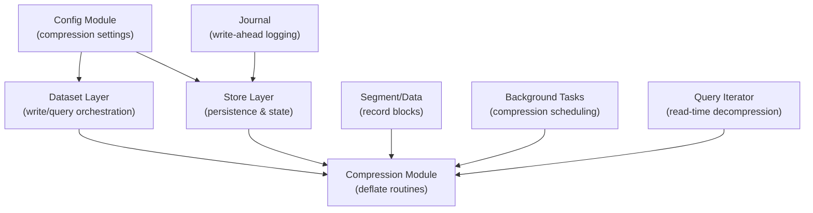
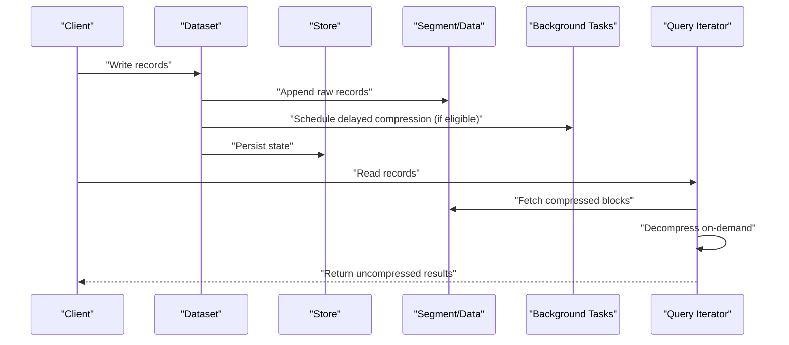
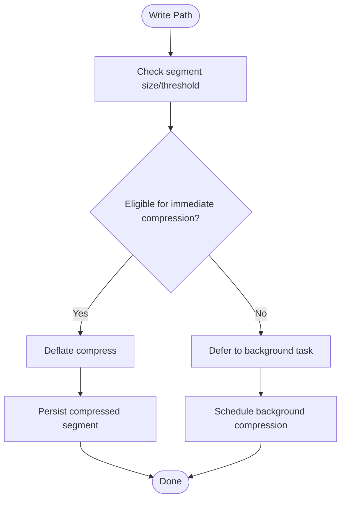
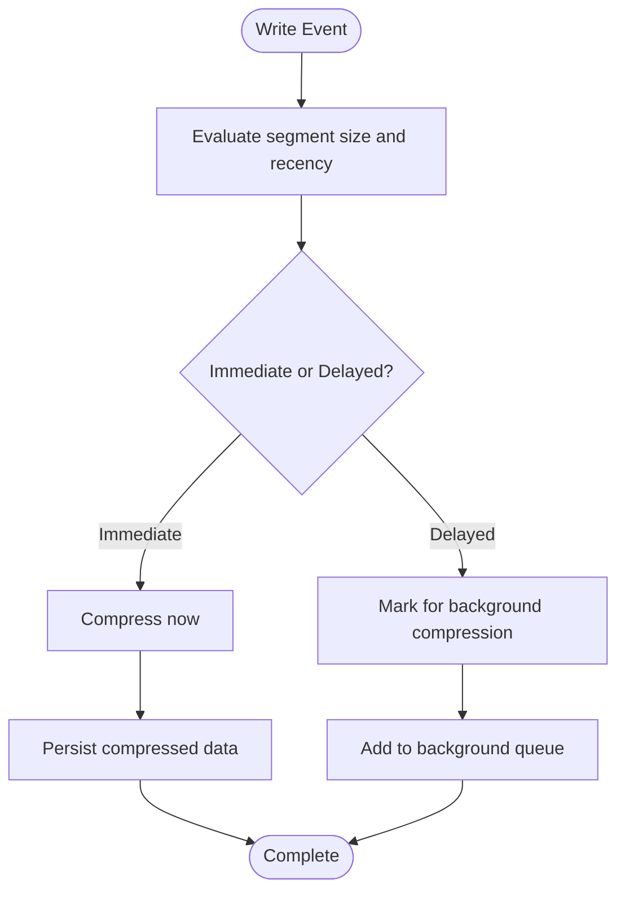
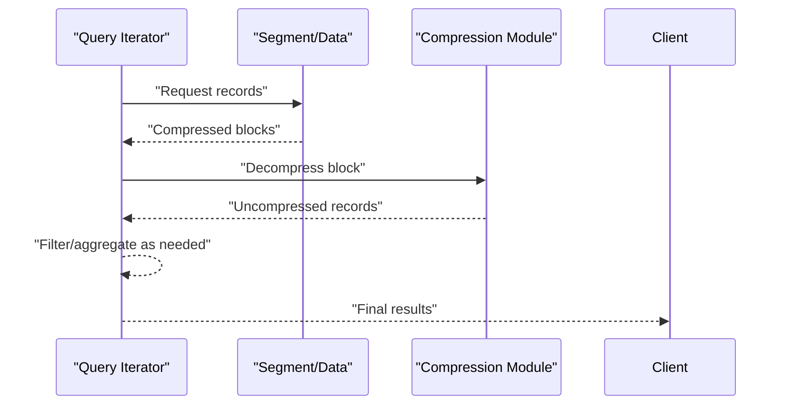
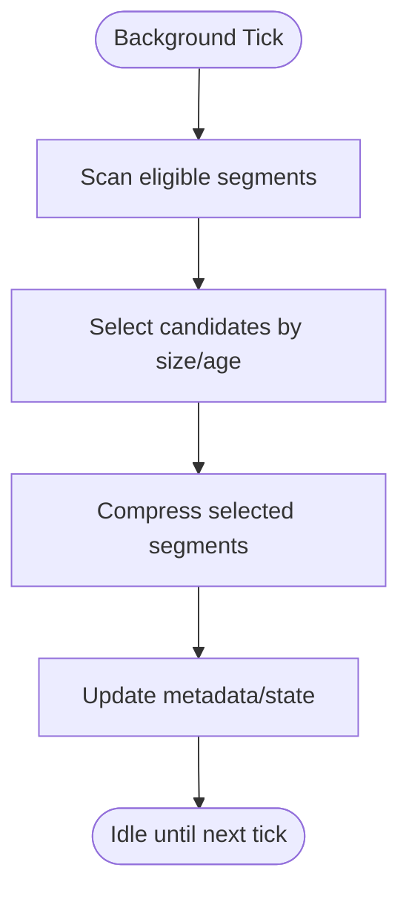
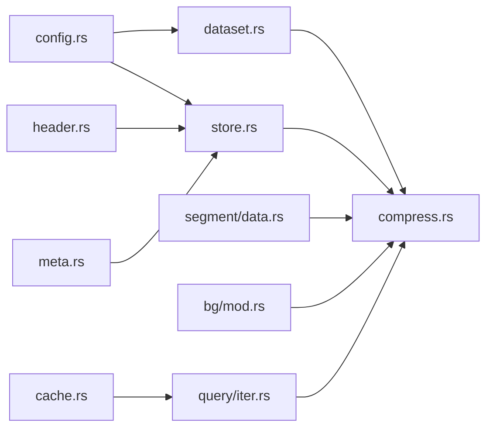

# Transparent Compression System

<cite>
**Referenced Files in This Document**
- [compress.rs](file://src/compress.rs)
- [config.rs](file://src/config.rs)
- [dataset.rs](file://src/dataset.rs)
- [store.rs](file://src/store.rs)
- [segment/data.rs](file://src/segment/data.rs)
- [bg/mod.rs](file://src/bg/mod.rs)
- [journal/mod.rs](file://src/journal/mod.rs)
- [query/iter.rs](file://src/query/iter.rs)
- [block.rs](file://src/block.rs)
- [header.rs](file://src/header.rs)
- [meta.rs](file://src/meta.rs)
- [cache.rs](file://src/cache.rs)
- [lib.rs](file://src/lib.rs)
- [ffi.rs](file://src/ffi.rs)
- [design.md](file://design.md)
- [docs/design/compression.md](file://docs/design/compression.md)
- [docs/design/data-segment.md](file://docs/design/data-segment.md)
- [docs/design/background.md](file://docs/design/background.md)
- [docs/design/queue-state-file.md](file://docs/design/queue-state-file.md)
- [docs/design/store-and-ffi.md](file://docs/design/store-and-ffi.md)
</cite>

## Table of Contents
1. [Introduction](#introduction)
2. [Project Structure](#project-structure)
3. [Core Components](#core-components)
4. [Architecture Overview](#architecture-overview)
5. [Detailed Component Analysis](#detailed-component-analysis)
6. [Dependency Analysis](#dependency-analysis)
7. [Performance Considerations](#performance-considerations)
8. [Troubleshooting Guide](#troubleshooting-guide)
9. [Conclusion](#conclusion)

## Introduction
This document explains TimSLite’s transparent compression system: how compression is applied, when it occurs, and how it integrates with data access patterns. It covers the deflate-based compression algorithm, compression timing strategies (immediate vs delayed), compression ratio and overhead characteristics, and configuration options that influence system behavior. The goal is to help users understand how transparent compression improves storage efficiency and query performance while maintaining simplicity of use.

## Project Structure
TimSLite organizes compression-related logic primarily in the compress module and integrates it across dataset, store, segment, and background processing layers. Configuration is centralized in the config module and exposed via the public API.

**Diagram sources**
- [compress.rs:1-200](file://src/compress.rs#L1-L200)
- [config.rs:1-200](file://src/config.rs#L1-L200)
- [dataset.rs:1-300](file://src/dataset.rs#L1-L300)
- [store.rs:1-300](file://src/store.rs#L1-L300)
- [segment/data.rs:1-200](file://src/segment/data.rs#L1-L200)
- [bg/mod.rs:1-200](file://src/bg/mod.rs#L1-L200)
- [journal/mod.rs:1-200](file://src/journal/mod.rs#L1-L200)
- [query/iter.rs:1-200](file://src/query/iter.rs#L1-L200)

**Section sources**
- [compress.rs:1-200](file://src/compress.rs#L1-L200)
- [config.rs:1-200](file://src/config.rs#L1-L200)
- [dataset.rs:1-300](file://src/dataset.rs#L1-L300)
- [store.rs:1-300](file://src/store.rs#L1-L300)
- [segment/data.rs:1-200](file://src/segment/data.rs#L1-L200)
- [bg/mod.rs:1-200](file://src/bg/mod.rs#L1-L200)
- [journal/mod.rs:1-200](file://src/journal/mod.rs#L1-L200)
- [query/iter.rs:1-200](file://src/query/iter.rs#L1-L200)

## Core Components
- Compression module: Implements deflate-based compression and decompression for record blocks and metadata segments.
- Configuration module: Exposes compression settings (algorithm, level, thresholds) and propagates them to write and read paths.
- Dataset and Store layers: Coordinate when compression is triggered and ensure persistence of compressed data.
- Background tasks: Schedule delayed compression for inactive segments to optimize long-term storage.
- Query iterator: Handles transparent decompression during reads to maintain transparent behavior.

Key responsibilities:
- Transparent compression: Compression happens behind the scenes without changing the user-facing API.
- Timing control: Immediate compression for recent data to reduce memory footprint; delayed compression for older data to save CPU.
- Seamless integration: Compression is applied at segment boundaries and record block granularity.

**Section sources**
- [compress.rs:1-200](file://src/compress.rs#L1-L200)
- [config.rs:1-200](file://src/config.rs#L1-L200)
- [dataset.rs:1-300](file://src/dataset.rs#L1-L300)
- [store.rs:1-300](file://src/store.rs#L1-L300)
- [bg/mod.rs:1-200](file://src/bg/mod.rs#L1-L200)

## Architecture Overview
The transparent compression system spans write-time and read-time paths. Writes may compress immediately for small or hot segments, or schedule delayed compression for larger or cold segments. Reads transparently decompress data on demand.

**Diagram sources**
- [dataset.rs:1-300](file://src/dataset.rs#L1-L300)
- [store.rs:1-300](file://src/store.rs#L1-L300)
- [segment/data.rs:1-200](file://src/segment/data.rs#L1-L200)
- [bg/mod.rs:1-200](file://src/bg/mod.rs#L1-L200)
- [query/iter.rs:1-200](file://src/query/iter.rs#L1-L200)

## Detailed Component Analysis

### Compression Module
The compression module encapsulates deflate-based compression and decompression. It operates on record blocks and metadata segments, returning compressed buffers and validating decompressed data integrity.

Implementation highlights:
- Deflate compression: Applied to contiguous record blocks to reduce storage size.
- Decompression on read: Transparently restores data for query processing.
- Integrity checks: Ensures compressed data validity before decompression.

**Diagram sources**
- [compress.rs:1-200](file://src/compress.rs#L1-L200)
- [config.rs:1-200](file://src/config.rs#L1-L200)

**Section sources**
- [compress.rs:1-200](file://src/compress.rs#L1-L200)

### Configuration Options
Compression settings are configured centrally and influence both write-time and read-time behavior:
- Algorithm: Deflate-based compression.
- Compression level: Controls compression ratio vs CPU trade-off.
- Thresholds: Minimum segment size and age criteria to trigger immediate vs delayed compression.
- Background scheduling: Enables/disables delayed compression tasks.

Impact on system behavior:
- Higher compression levels improve storage efficiency but increase CPU usage during writes.
- Threshold tuning balances CPU overhead with storage savings.
- Background tasks reduce write-time CPU load by deferring compression to off-peak periods.

**Section sources**
- [config.rs:1-200](file://src/config.rs#L1-L200)
- [docs/design/compression.md:1-200](file://docs/design/compression.md#L1-L200)

### Write-Time Compression Strategies
Immediate compression:
- Triggered for small or hot segments to minimize memory usage and improve responsiveness.
- Reduces in-memory footprint and speeds up subsequent reads.

Delayed compression:
- Scheduled for larger or cold segments to avoid write-time CPU spikes.
- Background tasks handle compression asynchronously, improving write throughput.

**Diagram sources**
- [dataset.rs:1-300](file://src/dataset.rs#L1-L300)
- [bg/mod.rs:1-200](file://src/bg/mod.rs#L1-L200)

**Section sources**
- [dataset.rs:1-300](file://src/dataset.rs#L1-L300)
- [bg/mod.rs:1-200](file://src/bg/mod.rs#L1-L200)

### Read-Time Transparent Decompression
During queries, the system transparently decompresses data as needed:
- Query iterator fetches compressed blocks from segments.
- Decompression is performed on-demand to minimize memory overhead.
- Results are returned in uncompressed form to the client.

**Diagram sources**
- [query/iter.rs:1-200](file://src/query/iter.rs#L1-L200)
- [segment/data.rs:1-200](file://src/segment/data.rs#L1-L200)
- [compress.rs:1-200](file://src/compress.rs#L1-L200)

**Section sources**
- [query/iter.rs:1-200](file://src/query/iter.rs#L1-L200)
- [segment/data.rs:1-200](file://src/segment/data.rs#L1-L200)

### Segment and Block Management
Segments group records into blocks. Compression applies at the block level, enabling targeted compression and efficient decompression during queries.

Key aspects:
- Block boundaries align with compression units.
- Metadata tracks compression state per segment.
- Hot/cold detection influences compression timing decisions.

**Section sources**
- [segment/data.rs:1-200](file://src/segment/data.rs#L1-L200)
- [header.rs:1-200](file://src/header.rs#L1-L200)
- [meta.rs:1-200](file://src/meta.rs#L1-L200)

### Background Compression Tasks
Background tasks coordinate delayed compression:
- Scan eligible segments based on thresholds and age.
- Compress selected segments asynchronously.
- Update metadata to reflect new compression state.

**Diagram sources**
- [bg/mod.rs:1-200](file://src/bg/mod.rs#L1-L200)
- [store.rs:1-300](file://src/store.rs#L1-L300)

**Section sources**
- [bg/mod.rs:1-200](file://src/bg/mod.rs#L1-L200)
- [store.rs:1-300](file://src/store.rs#L1-L300)

### Journal and Persistence Integration
The journal supports write-ahead logging and interacts with compression:
- Writes are first recorded in the journal for durability.
- After successful write, compression decisions are evaluated and persisted.

**Section sources**
- [journal/mod.rs:1-200](file://src/journal/mod.rs#L1-L200)
- [store.rs:1-300](file://src/store.rs#L1-L300)

## Dependency Analysis
Compression touches multiple subsystems. The primary dependencies are:

**Diagram sources**
- [config.rs:1-200](file://src/config.rs#L1-L200)
- [dataset.rs:1-300](file://src/dataset.rs#L1-L300)
- [store.rs:1-300](file://src/store.rs#L1-L300)
- [compress.rs:1-200](file://src/compress.rs#L1-L200)
- [segment/data.rs:1-200](file://src/segment/data.rs#L1-L200)
- [bg/mod.rs:1-200](file://src/bg/mod.rs#L1-L200)
- [query/iter.rs:1-200](file://src/query/iter.rs#L1-L200)
- [header.rs:1-200](file://src/header.rs#L1-L200)
- [meta.rs:1-200](file://src/meta.rs#L1-L200)
- [cache.rs:1-200](file://src/cache.rs#L1-L200)

**Section sources**
- [config.rs:1-200](file://src/config.rs#L1-L200)
- [dataset.rs:1-300](file://src/dataset.rs#L1-L300)
- [store.rs:1-300](file://src/store.rs#L1-L300)
- [compress.rs:1-200](file://src/compress.rs#L1-L200)
- [segment/data.rs:1-200](file://src/segment/data.rs#L1-L200)
- [bg/mod.rs:1-200](file://src/bg/mod.rs#L1-L200)
- [query/iter.rs:1-200](file://src/query/iter.rs#L1-L200)
- [header.rs:1-200](file://src/header.rs#L1-L200)
- [meta.rs:1-200](file://src/meta.rs#L1-L200)
- [cache.rs:1-200](file://src/cache.rs#L1-L200)

## Performance Considerations
Compression ratio and overhead:
- Compression ratio depends on data characteristics and compression level. Higher levels yield better ratios but increased CPU usage.
- Immediate compression reduces memory usage but increases write-time CPU.
- Delayed compression shifts CPU load to background tasks, improving write throughput.

Memory usage:
- Compressed segments require less disk space; decompression inflates in-memory buffers during reads.
- Query iterator manages decompressed buffers efficiently to limit peak memory.

CPU overhead:
- Write-time compression cost scales with compression level and data volume.
- Background compression avoids write stalls but introduces periodic CPU spikes.

Storage efficiency:
- Segments with repetitive or sequential data compress well, reducing I/O and storage costs.
- Metadata and headers remain uncompressed to support fast indexing and random access.

[No sources needed since this section provides general guidance]

## Troubleshooting Guide
Common issues and resolutions:
- Compression failures: Verify integrity checks and re-run compression on corrupted segments.
- High write latency: Tune compression level and thresholds to balance CPU and storage.
- Memory pressure during reads: Adjust query buffer sizes and leverage background compression to reduce in-memory decompression.
- Background task backlog: Increase background frequency or adjust eligibility thresholds.

**Section sources**
- [compress.rs:1-200](file://src/compress.rs#L1-L200)
- [bg/mod.rs:1-200](file://src/bg/mod.rs#L1-L200)
- [query/iter.rs:1-200](file://src/query/iter.rs#L1-L200)

## Conclusion
TimSLite’s transparent compression system integrates deflate-based compression into write and read paths without altering the user API. Immediate compression targets hot or small segments to reduce memory and improve responsiveness, while delayed compression handles cold or large segments via background tasks to preserve write throughput. Configuration options allow tuning compression level, thresholds, and scheduling to meet diverse performance and storage goals. Together, these mechanisms deliver significant storage savings with minimal operational complexity.