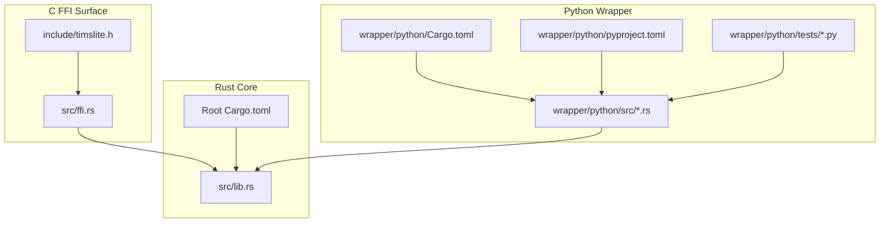
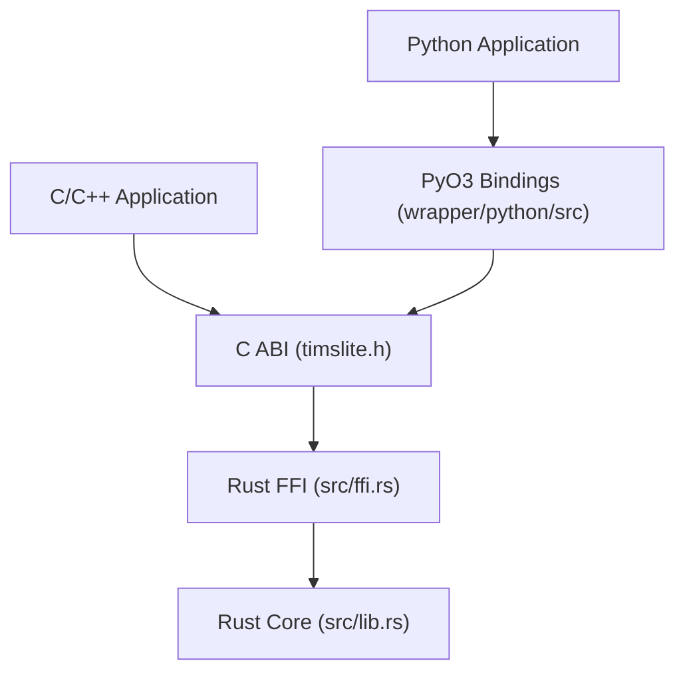
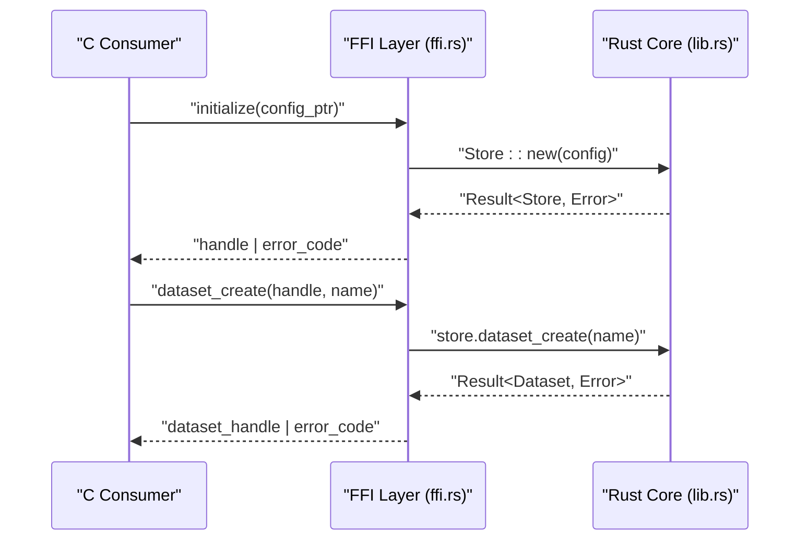
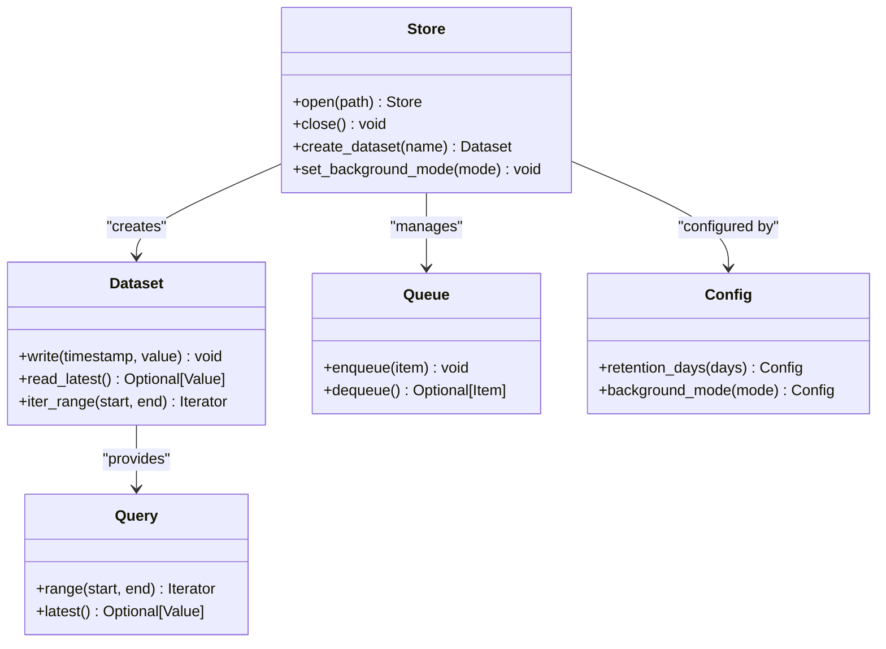
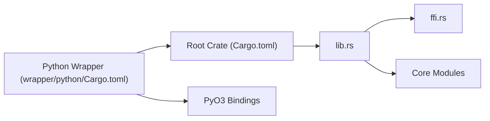

# Cross-Language Integration

<cite>
**Referenced Files in This Document**
- [timslite.h](file://include/timslite.h)
- [ffi.rs](file://src/ffi.rs)
- [lib.rs](file://src/lib.rs)
- [Cargo.toml](file://Cargo.toml)
- [wrapper_python_Cargo.toml](file://wrapper/python/Cargo.toml)
- [wrapper_python_pyproject.toml](file://wrapper/python/pyproject.toml)
- [wrapper_python_lib_rs](file://wrapper/python/src/lib.rs)
- [wrapper_python_config_rs](file://wrapper/python/src/config.rs)
- [wrapper_python_dataset_rs](file://wrapper/python/src/dataset.rs)
- [wrapper_python_exceptions_rs](file://wrapper/python/src/exceptions.rs)
- [wrapper_python_query_rs](file://wrapper/python/src/query.rs)
- [wrapper_python_queue_rs](file://wrapper/python/src/queue.rs)
- [wrapper_python_store_rs](file://wrapper/python/src/store.rs)
- [test_basic_py](file://wrapper/python/tests/test_basic.py)
- [test_config_py](file://wrapper/python/tests/test_config.py)
- [test_exceptions_py](file://wrapper/python/tests/test_exceptions.py)
- [test_lifecycle_py](file://wrapper/python/tests/test_lifecycle.py)
- [test_multi_dataset_py](file://wrapper/python/tests/test_multi_dataset.py)
- [test_persistence_py](file://wrapper/python/tests/test_persistence.py)
- [test_queue_py](file://wrapper/python/tests/test_queue.py)
- [test_store_manual_bg_py](file://wrapper/python/tests/test_store_manual_bg.py)
- [test_write_query_py](file://wrapper/python/tests/test_write_query.py)
- [design_md](file://docs/design/store-and-ffi.md)
- [plan_md](file://docs/plan/phase-07-ffi.md)
</cite>

## Table of Contents
1. [Introduction](#introduction)
2. [Project Structure](#project-structure)
3. [Core Components](#core-components)
4. [Architecture Overview](#architecture-overview)
5. [Detailed Component Analysis](#detailed-component-analysis)
6. [Dependency Analysis](#dependency-analysis)
7. [Performance Considerations](#performance-considerations)
8. [Troubleshooting Guide](#troubleshooting-guide)
9. [Conclusion](#conclusion)
10. [Appendices](#appendices)

## Introduction
This document explains TimSLite’s cross-language integration capabilities with a focus on:
- C ABI FFI interface compliance and memory management across language boundaries
- Error handling across language boundaries
- Python bindings built with PyO3, including API design and testing strategies
- Integration patterns with native applications, performance considerations, and resource management
- Complete API references, usage examples, troubleshooting, version compatibility, deployment, and migration strategies

## Project Structure
TimSLite exposes a C-compatible FFI surface and a Python wrapper crate that binds to the Rust core via PyO3. The key integration surfaces are:
- Public C header for FFI consumers
- Rust FFI module exporting C-compatible symbols
- Root library re-exports for internal use
- Python wrapper crate with PyO3 bindings and comprehensive tests

**Diagram sources**
- [timslite.h](file://include/timslite.h)
- [ffi.rs](file://src/ffi.rs)
- [lib.rs](file://src/lib.rs)
- [Cargo.toml](file://Cargo.toml)
- [wrapper_python_Cargo.toml](file://wrapper/python/Cargo.toml)
- [wrapper_python_pyproject.toml](file://wrapper/python/pyproject.toml)
- [wrapper_python_lib_rs](file://wrapper/python/src/lib.rs)

**Section sources**
- [timslite.h](file://include/timslite.h)
- [ffi.rs](file://src/ffi.rs)
- [lib.rs](file://src/lib.rs)
- [Cargo.toml](file://Cargo.toml)
- [wrapper_python_Cargo.toml](file://wrapper/python/Cargo.toml)
- [wrapper_python_pyproject.toml](file://wrapper/python/pyproject.toml)

## Core Components
- C ABI FFI interface: Declared in the public header and implemented in the FFI module. It defines opaque handles, enums, and function signatures compatible with C toolchains.
- Rust FFI exports: Bridges C ABI to internal Rust APIs, ensuring safe ownership and error propagation.
- Python bindings: PyO3-based bindings expose idiomatic Python APIs wrapping the underlying C FFI layer.
- Tests: Comprehensive Python tests validate lifecycle, configuration, persistence, queue operations, and exception handling.

Key integration responsibilities:
- Ownership and lifetime: Handles passed-in buffers and returned pointers correctly across FFI boundaries.
- Errors: Converts Rust errors into C-compatible error codes and messages.
- Resource management: Ensures proper initialization and destruction of resources.

**Section sources**
- [timslite.h](file://include/timslite.h)
- [ffi.rs](file://src/ffi.rs)
- [wrapper_python_lib_rs](file://wrapper/python/src/lib.rs)
- [wrapper_python_config_rs](file://wrapper/python/src/config.rs)
- [wrapper_python_dataset_rs](file://wrapper/python/src/dataset.rs)
- [wrapper_python_exceptions_rs](file://wrapper/python/src/exceptions.rs)
- [wrapper_python_query_rs](file://wrapper/python/src/query.rs)
- [wrapper_python_queue_rs](file://wrapper/python/src/queue.rs)
- [wrapper_python_store_rs](file://wrapper/python/src/store.rs)

## Architecture Overview
The cross-language architecture consists of three layers:
- C ABI layer: Stable interface for non-Rust consumers
- Rust FFI bridge: Safe translation between C and Rust semantics
- Python wrapper: PyO3 bindings exposing Pythonic APIs

**Diagram sources**
- [timslite.h](file://include/timslite.h)
- [ffi.rs](file://src/ffi.rs)
- [lib.rs](file://src/lib.rs)
- [wrapper_python_lib_rs](file://wrapper/python/src/lib.rs)

## Detailed Component Analysis

### C ABI FFI Interface
- Purpose: Provide a stable, language-neutral interface for consumers to manage stores, datasets, queues, and queries.
- Memory model: Buffers are owned by the caller; returned pointers must be freed according to documented semantics.
- Error handling: Returns error codes and optional error messages; callers must check return values and handle errors appropriately.
- Opaque handles: Internal state is hidden behind opaque pointer types to prevent misuse.

Implementation highlights:
- Exposes initialization, configuration, write, read, and cleanup routines.
- Defines enums and flags used across operations.
- Guarantees C ABI stability for downstream consumers.

**Section sources**
- [timslite.h](file://include/timslite.h)
- [ffi.rs](file://src/ffi.rs)

### Rust FFI Bridge
- Role: Translate C ABI calls into Rust semantics, manage lifetimes, and propagate errors.
- Safety: Uses unsafe blocks only around FFI boundaries; internal logic remains safe.
- Ownership: Ensures borrowed data does not outlive the call and that returned buffers are properly allocated/deallocated.

**Diagram sources**
- [ffi.rs](file://src/ffi.rs)
- [lib.rs](file://src/lib.rs)

**Section sources**
- [ffi.rs](file://src/ffi.rs)
- [lib.rs](file://src/lib.rs)

### Python Bindings (PyO3)
- Design: PyO3-based bindings wrap the C ABI layer with idiomatic Python classes and exceptions.
- API coverage: Store, Dataset, Queue, Config, and Query abstractions mirror the C interface while providing Pythonic ergonomics.
- Exceptions: Translates C error codes into Python exceptions for robust error handling.
- Testing: Extensive unit tests validate correctness, lifecycle, persistence, and error scenarios.

**Diagram sources**
- [wrapper_python_lib_rs](file://wrapper/python/src/lib.rs)
- [wrapper_python_config_rs](file://wrapper/python/src/config.rs)
- [wrapper_python_dataset_rs](file://wrapper/python/src/dataset.rs)
- [wrapper_python_queue_rs](file://wrapper/python/src/queue.rs)
- [wrapper_python_query_rs](file://wrapper/python/src/query.rs)
- [wrapper_python_store_rs](file://wrapper/python/src/store.rs)

**Section sources**
- [wrapper_python_lib_rs](file://wrapper/python/src/lib.rs)
- [wrapper_python_config_rs](file://wrapper/python/src/config.rs)
- [wrapper_python_dataset_rs](file://wrapper/python/src/dataset.rs)
- [wrapper_python_exceptions_rs](file://wrapper/python/src/exceptions.rs)
- [wrapper_python_query_rs](file://wrapper/python/src/query.rs)
- [wrapper_python_queue_rs](file://wrapper/python/src/queue.rs)
- [wrapper_python_store_rs](file://wrapper/python/src/store.rs)

### Python Test Suite
- Coverage: Lifecycle, configuration, persistence, multi-dataset scenarios, queue operations, manual background execution, and exception handling.
- Examples: Representative tests demonstrate typical usage patterns and error conditions.

**Section sources**
- [test_basic_py](file://wrapper/python/tests/test_basic.py)
- [test_config_py](file://wrapper/python/tests/test_config.py)
- [test_exceptions_py](file://wrapper/python/tests/test_exceptions.py)
- [test_lifecycle_py](file://wrapper/python/tests/test_lifecycle.py)
- [test_multi_dataset_py](file://wrapper/python/tests/test_multi_dataset.py)
- [test_persistence_py](file://wrapper/python/tests/test_persistence.py)
- [test_queue_py](file://wrapper/python/tests/test_queue.py)
- [test_store_manual_bg_py](file://wrapper/python/tests/test_store_manual_bg.py)
- [test_write_query_py](file://wrapper/python/tests/test_write_query.py)

## Dependency Analysis
- Root crate depends on internal modules for store, dataset, queue, and query logic.
- Python wrapper crate depends on the root crate and PyO3 for bindings.
- Build configuration ties the two crates together and publishes the Python package.

**Diagram sources**
- [Cargo.toml](file://Cargo.toml)
- [lib.rs](file://src/lib.rs)
- [ffi.rs](file://src/ffi.rs)
- [wrapper_python_Cargo.toml](file://wrapper/python/Cargo.toml)

**Section sources**
- [Cargo.toml](file://Cargo.toml)
- [wrapper_python_Cargo.toml](file://wrapper/python/Cargo.toml)

## Performance Considerations
- Minimize allocations across FFI boundaries: pass pre-sized buffers where possible and reuse memory.
- Batch operations: Prefer batch writes and reads to reduce overhead.
- Background execution: Use background mode for continuous storage to avoid blocking the main thread.
- Memory management: Respect ownership semantics; avoid leaks by freeing returned buffers and closing handles.
- Python overhead: Binding calls incur overhead; cache frequently accessed objects and avoid excessive small allocations.

[No sources needed since this section provides general guidance]

## Troubleshooting Guide
Common issues and resolutions:
- Invalid handle after close: Ensure handles are not used after closing; re-open or recreate as needed.
- Buffer size mismatches: Verify buffer sizes match expectations; oversized or undersized buffers cause errors.
- Permission errors: Confirm file permissions and paths for persistent stores.
- Python exceptions: Catch translated exceptions and inspect error messages for actionable diagnostics.
- Memory leaks: Track returned pointers and ensure they are freed per interface contract.

**Section sources**
- [wrapper_python_exceptions_rs](file://wrapper/python/src/exceptions.rs)
- [test_exceptions_py](file://wrapper/python/tests/test_exceptions.py)

## Conclusion
TimSLite provides a stable C ABI FFI surface and a mature Python wrapper built with PyO3. The design emphasizes safe memory management, clear error handling, and idiomatic Python APIs. With comprehensive tests and documented integration patterns, TimSLite supports reliable cross-language usage across native and Python environments.

[No sources needed since this section summarizes without analyzing specific files]

## Appendices

### API References

- C ABI Header: [include/timslite.h](file://include/timslite.h)
- Rust FFI Implementation: [src/ffi.rs](file://src/ffi.rs)
- Python Bindings: [wrapper/python/src/lib.rs](file://wrapper/python/src/lib.rs)

Usage examples:
- Python basic usage: [tests/test_basic.py](file://wrapper/python/tests/test_basic.py)
- Python lifecycle and persistence: [tests/test_lifecycle.py](file://wrapper/python/tests/test_lifecycle.py)
- Python configuration: [tests/test_config.py](file://wrapper/python/tests/test_config.py)
- Python multi-dataset: [tests/test_multi_dataset.py](file://wrapper/python/tests/test_multi_dataset.py)
- Python queue operations: [tests/test_queue.py](file://wrapper/python/tests/test_queue.py)
- Python manual background execution: [tests/test_store_manual_bg.py](file://wrapper/python/tests/test_store_manual_bg.py)
- Python write and query: [tests/test_write_query.py](file://wrapper/python/tests/test_write_query.py)
- Python exception handling: [tests/test_exceptions.py](file://wrapper/python/tests/test_exceptions.py)

Version compatibility and deployment:
- Build and packaging are defined in the root and Python wrapper Cargo configurations.
- Python package metadata and build settings are defined in the Python wrapper pyproject configuration.

**Section sources**
- [Cargo.toml](file://Cargo.toml)
- [wrapper_python_Cargo.toml](file://wrapper/python/Cargo.toml)
- [wrapper_python_pyproject.toml](file://wrapper/python/pyproject.toml)

### Migration Strategies
- From older FFI versions: Review breaking changes in the C ABI header and update consumers accordingly.
- From Python v1 to v2: Align with new binding APIs and exception handling patterns; run the Python test suite to validate behavior.
- Backward compatibility: Maintain stable C ABI where possible; introduce new functions alongside existing ones during transitions.

[No sources needed since this section provides general guidance]