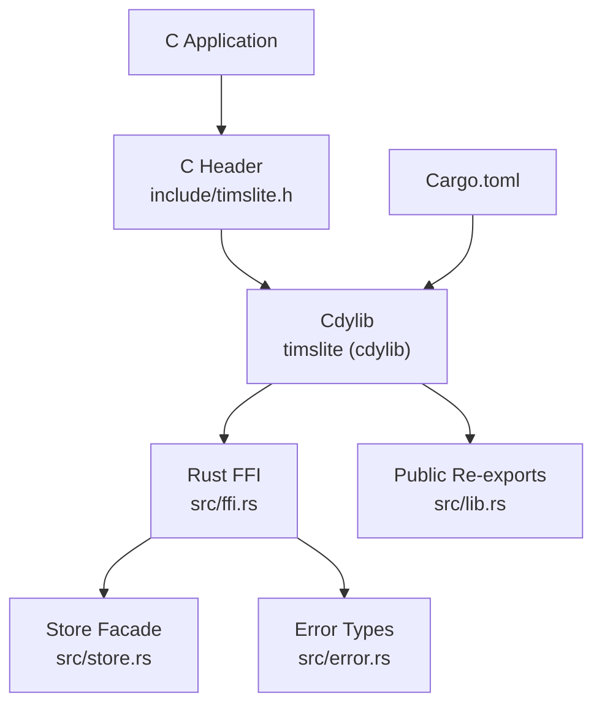
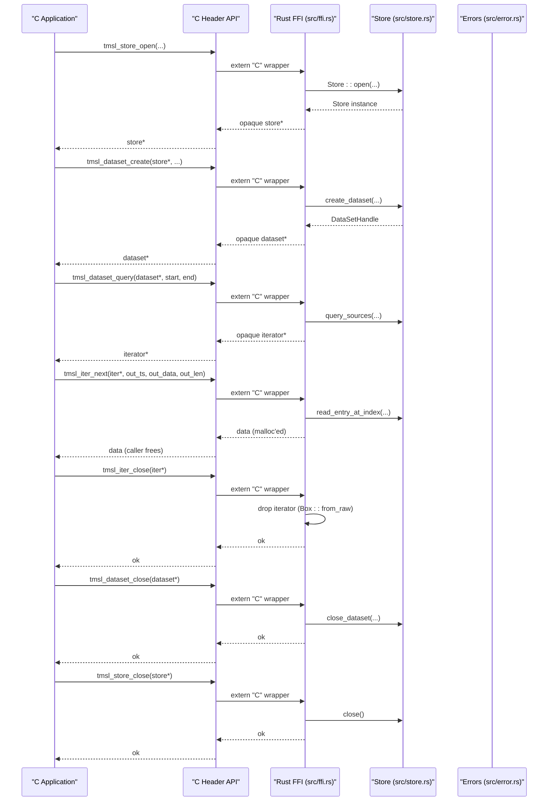
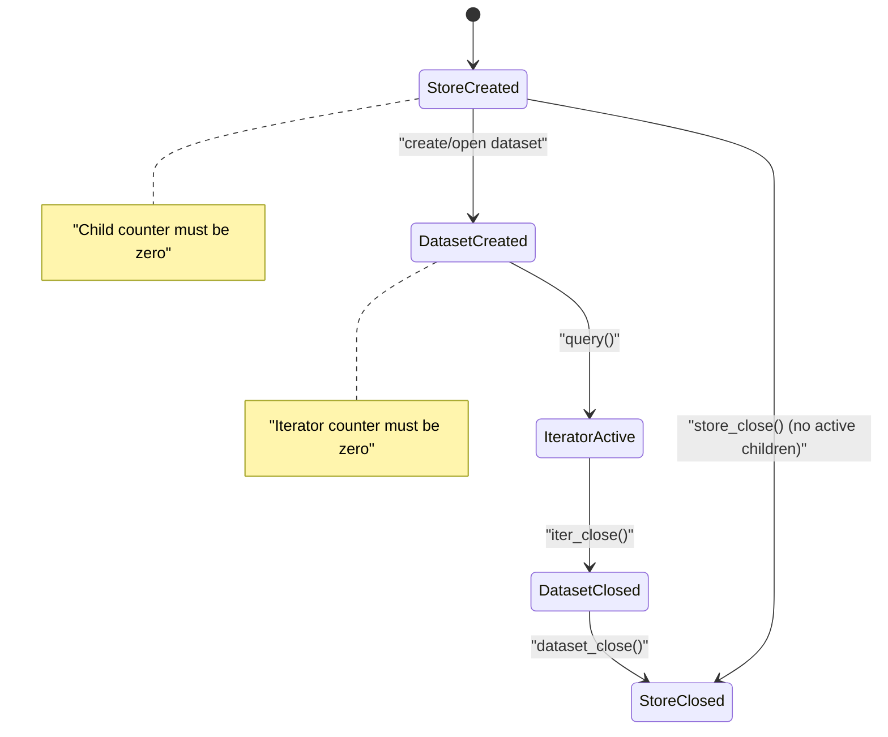
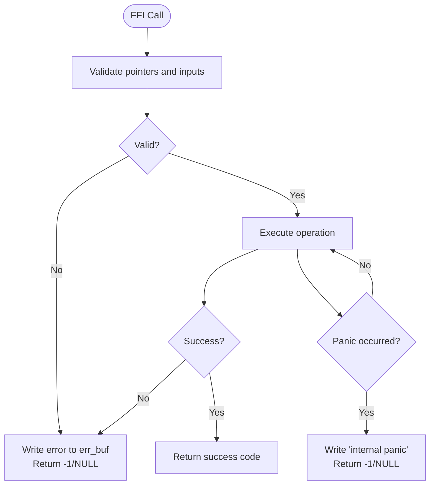
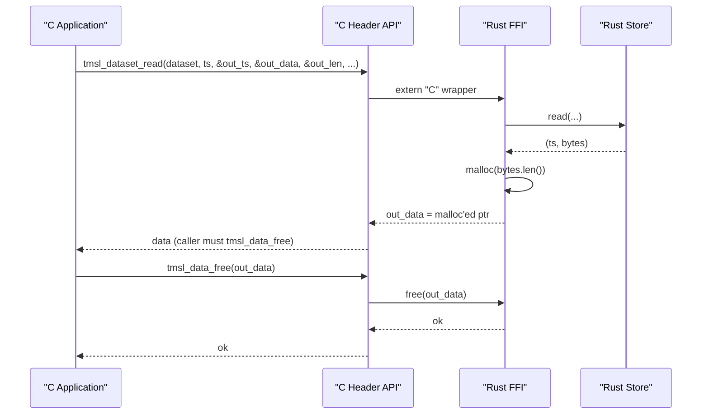
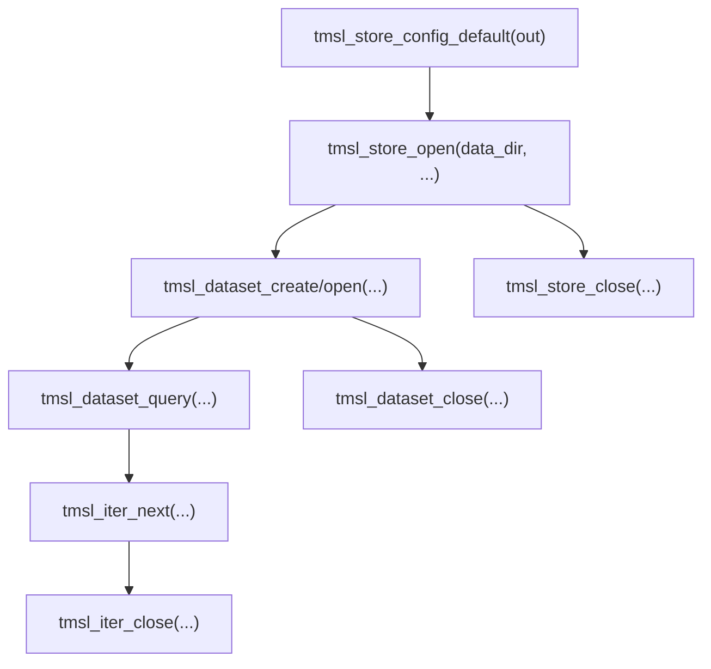
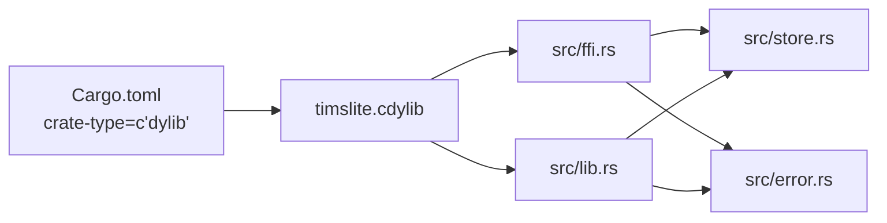

# FFI C Interface

<cite>
**Referenced Files in This Document**
- [include/timslite.h](file://include/timslite.h)
- [src/ffi.rs](file://src/ffi.rs)
- [src/lib.rs](file://src/lib.rs)
- [src/error.rs](file://src/error.rs)
- [src/store.rs](file://src/store.rs)
- [Cargo.toml](file://Cargo.toml)
- [docs/design/store-and-ffi.md](file://docs/design/store-and-ffi.md)
</cite>

## Table of Contents
1. [Introduction](#introduction)
2. [Project Structure](#project-structure)
3. [Core Components](#core-components)
4. [Architecture Overview](#architecture-overview)
5. [Detailed Component Analysis](#detailed-component-analysis)
6. [Dependency Analysis](#dependency-analysis)
7. [Performance Considerations](#performance-considerations)
8. [Troubleshooting Guide](#troubleshooting-guide)
9. [Conclusion](#conclusion)
10. [Appendices](#appendices)

## Introduction
This document describes TimSLite’s C ABI FFI interface for integrating native applications with the Rust-based time-series storage engine. It covers the complete C API, opaque handle management, error handling across the FFI boundary, memory ownership semantics, initialization/cleanup lifecycles, thread safety, and performance implications. Practical usage patterns and troubleshooting guidance are included to help C and other language bindings integrate efficiently.

## Project Structure
TimSLite exposes a C ABI-compatible API via a dynamic library built with a specific crate type. The public C header defines the API surface and opaque types. The Rust FFI module implements extern "C" wrappers around internal store/dataset/query abstractions, with careful error propagation and memory ownership rules.

**Diagram sources**
- [include/timslite.h:1-358](file://include/timslite.h#L1-L358)
- [src/ffi.rs:1-1187](file://src/ffi.rs#L1-L1187)
- [src/store.rs:1-200](file://src/store.rs#L1-L200)
- [src/error.rs:1-145](file://src/error.rs#L1-L145)
- [src/lib.rs:1-133](file://src/lib.rs#L1-L133)
- [Cargo.toml:1-18](file://Cargo.toml#L1-L18)

**Section sources**
- [include/timslite.h:1-358](file://include/timslite.h#L1-L358)
- [src/ffi.rs:1-1187](file://src/ffi.rs#L1-L1187)
- [src/lib.rs:1-133](file://src/lib.rs#L1-L133)
- [Cargo.toml:1-18](file://Cargo.toml#L1-L18)

## Core Components
- Opaque handles
  - Store: parent handle for datasets and iterators.
  - Dataset: child handle bound to a specific dataset.
  - Iterator: child handle bound to a dataset query range.
  - Queue/Consumer: separate handle space for queue operations.
- Configuration structs
  - Store configuration (versioned) and dataset configuration (versioned).
- Error handling
  - All extern "C" functions accept an error buffer and length.
  - Functions return -1 on error; pointer-returning functions return NULL on error.
  - Panic isolation via catch-unwind with error messages written to the buffer.
- Memory ownership
  - Data returned by read/query APIs is heap-allocated via malloc; callers must free via provided free functions.
  - Iterators and datasets must be closed before their parent store is closed.

**Section sources**
- [include/timslite.h:21-50](file://include/timslite.h#L21-L50)
- [src/ffi.rs:32-97](file://src/ffi.rs#L32-L97)
- [src/ffi.rs:253-261](file://src/ffi.rs#L253-L261)
- [docs/design/store-and-ffi.md:314-326](file://docs/design/store-and-ffi.md#L314-L326)

## Architecture Overview
The FFI layer wraps internal store/dataset/query types and enforces strict lifecycle and ownership rules. It translates between C types and Rust types, validates inputs, and ensures safe cross-language calls.

**Diagram sources**
- [include/timslite.h:60-122](file://include/timslite.h#L60-L122)
- [include/timslite.h:141-194](file://include/timslite.h#L141-L194)
- [include/timslite.h:318-351](file://include/timslite.h#L318-L351)
- [src/ffi.rs:298-358](file://src/ffi.rs#L298-L358)
- [src/ffi.rs:426-551](file://src/ffi.rs#L426-L551)
- [src/ffi.rs:764-794](file://src/ffi.rs#L764-L794)
- [src/ffi.rs:799-837](file://src/ffi.rs#L799-L837)
- [src/ffi.rs:749-758](file://src/ffi.rs#L749-L758)
- [src/ffi.rs:526-550](file://src/ffi.rs#L526-L550)
- [src/ffi.rs:334-358](file://src/ffi.rs#L334-L358)

## Detailed Component Analysis

### Opaque Handle Types and Lifecycle
- Store handle
  - Parent for datasets and iterators.
  - Must not be closed while any dataset or iterator handle exists.
- Dataset handle
  - Bound to a specific dataset; created via explicit creation or opening.
  - Must not be closed while any iterator handle exists.
- Iterator handle
  - Bound to a specific dataset query; must be closed before its dataset is closed.
- Queue/Consumer handles
  - Separate handle space for queue operations; managed independently.

**Diagram sources**
- [src/ffi.rs:253-261](file://src/ffi.rs#L253-L261)
- [src/ffi.rs:531-551](file://src/ffi.rs#L531-L551)
- [src/ffi.rs:749-758](file://src/ffi.rs#L749-L758)

**Section sources**
- [src/ffi.rs:253-261](file://src/ffi.rs#L253-L261)
- [src/ffi.rs:531-551](file://src/ffi.rs#L531-L551)
- [src/ffi.rs:749-758](file://src/ffi.rs#L749-L758)
- [docs/design/store-and-ffi.md:321-326](file://docs/design/store-and-ffi.md#L321-L326)

### Error Handling Across the FFI Boundary
- All functions accept an error buffer pointer and length.
- On error, functions return -1 (or NULL for pointer-returning functions) and write a null-terminated error message into the buffer (up to length-1 characters plus terminator).
- Panics are caught and mapped to error messages; callers should treat any negative return as failure.

**Diagram sources**
- [src/ffi.rs:32-47](file://src/ffi.rs#L32-L47)
- [src/ffi.rs:50-97](file://src/ffi.rs#L50-L97)

**Section sources**
- [src/ffi.rs:32-47](file://src/ffi.rs#L32-L47)
- [src/ffi.rs:50-97](file://src/ffi.rs#L50-L97)
- [src/error.rs:6-43](file://src/error.rs#L6-L43)

### Memory Ownership Semantics
- Returned data buffers from read/query APIs are allocated with malloc; callers must free them using the provided free function.
- Free functions:
  - tmsl_data_free for data returned by read/query APIs.
  - tmsl_iter_free_data is a compatibility alias for tmsl_data_free.
- Empty data (length 0) is a valid case; the caller must still free the pointer if non-null.

**Diagram sources**
- [include/timslite.h:303-305](file://include/timslite.h#L303-L305)
- [include/timslite.h:338-345](file://include/timslite.h#L338-L345)
- [src/ffi.rs:712-746](file://src/ffi.rs#L712-L746)
- [src/ffi.rs:840-845](file://src/ffi.rs#L840-L845)

**Section sources**
- [include/timslite.h:303-305](file://include/timslite.h#L303-L305)
- [include/timslite.h:338-345](file://include/timslite.h#L338-L345)
- [src/ffi.rs:712-746](file://src/ffi.rs#L712-L746)
- [src/ffi.rs:840-845](file://src/ffi.rs#L840-L845)
- [docs/design/store-and-ffi.md:314-319](file://docs/design/store-and-ffi.md#L314-L319)

### Initialization and Cleanup Procedures
- Store configuration
  - tmsl_store_config_default writes default values into a caller-provided struct.
  - tmsl_store_open opens a store at a directory; tmsl_store_open_with_config accepts a versioned store config.
- Dataset lifecycle
  - tmsl_dataset_create or tmsl_dataset_create_with_config to create; tmsl_dataset_open to open existing.
  - tmsl_dataset_flush to msync without sealing/compression.
  - tmsl_dataset_close closes a dataset; tmsl_dataset_drop deletes a dataset (destroying all data).
- Iterator lifecycle
  - tmsl_dataset_query returns an iterator; tmsl_iter_next retrieves records; tmsl_iter_close closes it.
- Store lifecycle
  - tmsl_store_close closes the store; fails if any dataset or iterator exists.

**Diagram sources**
- [include/timslite.h:60-122](file://include/timslite.h#L60-L122)
- [include/timslite.h:141-194](file://include/timslite.h#L141-L194)
- [include/timslite.h:318-351](file://include/timslite.h#L318-L351)

**Section sources**
- [include/timslite.h:60-122](file://include/timslite.h#L60-L122)
- [include/timslite.h:141-194](file://include/timslite.h#L141-L194)
- [include/timslite.h:318-351](file://include/timslite.h#L318-L351)

### Thread Safety Considerations
- The FFI layer uses atomic counters and shared Arc/Sync types internally to track child handle counts and synchronize access.
- Background tasks can be executed manually via tmsl_store_tick_background_tasks even when a background thread is disabled.
- The C header documents that background tasks can be invoked regardless of background thread enablement.

**Section sources**
- [src/ffi.rs:141-178](file://src/ffi.rs#L141-L178)
- [include/timslite.h:95-122](file://include/timslite.h#L95-L122)

### API Reference by Category

#### Store Management
- tmsl_store_config_default
  - Purpose: Fill a store config struct with default values.
  - Parameters: out_config (pointer to TmslStoreConfigFFI), err_buf, err_buf_len.
  - Returns: 0 on success, -1 on error.
- tmsl_store_open
  - Purpose: Open a store at the given directory.
  - Parameters: data_dir (const char*), err_buf, err_buf_len.
  - Returns: Opaque store pointer, or NULL on error.
- tmsl_store_open_with_config
  - Purpose: Open a store with explicit versioned config.
  - Parameters: data_dir, config (const TmslStoreConfigFFI*), err_buf, err_buf_len.
  - Returns: Opaque store pointer, or NULL on error.
- tmsl_store_close
  - Purpose: Close a store and release resources.
  - Parameters: store (void*), err_buf, err_buf_len.
  - Returns: 0 on success, -1 on error.
- tmsl_store_tick_background_tasks
  - Purpose: Execute one tick of background tasks synchronously.
  - Parameters: store, out_executed (unsigned int*), out_next_delay_ms (uint64_t*), err_buf, err_buf_len.
  - Returns: 0 on success, -1 on error.
- tmsl_store_next_background_delay
  - Purpose: Query delay until next background task without executing.
  - Parameters: store, out_next_delay_ms (uint64_t*), err_buf, err_buf_len.
  - Returns: 0 on success, -1 on error.

**Section sources**
- [include/timslite.h:60-122](file://include/timslite.h#L60-L122)
- [src/ffi.rs:278-420](file://src/ffi.rs#L278-L420)

#### Dataset Management
- tmsl_dataset_create
  - Purpose: Create a new dataset (explicit).
  - Parameters: store, name, dataset_type, sizes, compress_level, index_continuous, retention_window, err_buf, err_buf_len.
  - Returns: Opaque dataset pointer, or NULL on error.
- tmsl_dataset_create_with_config
  - Purpose: Create a new dataset with explicit versioned dataset config.
  - Parameters: store, name, dataset_type, config (const TmslDatasetConfigFFI*), err_buf, err_buf_len.
  - Returns: Opaque dataset pointer, or NULL on error.
- tmsl_dataset_open
  - Purpose: Open an existing dataset.
  - Parameters: store, name, dataset_type, err_buf, err_buf_len.
  - Returns: Opaque dataset pointer, or NULL on error.
- tmsl_dataset_close
  - Purpose: Close a dataset.
  - Parameters: dataset (void*), err_buf, err_buf_len.
  - Returns: 0 on success, -1 on error.
- tmsl_dataset_drop
  - Purpose: Drop (delete) an entire dataset.
  - Parameters: store, name, dataset_type, err_buf, err_buf_len.
  - Returns: 0 on success, -1 on error.
- tmsl_dataset_flush
  - Purpose: Flush a dataset (msync only).
  - Parameters: dataset (void*), err_buf, err_buf_len.
  - Returns: 0 on success, -1 on error.
- tmsl_dataset_latest_timestamp
  - Purpose: Get the maximum written timestamp.
  - Parameters: dataset (void*), out_ts (int64_t*), err_buf, err_buf_len.
  - Returns: 0 on success, -1 on error.

**Section sources**
- [include/timslite.h:141-218](file://include/timslite.h#L141-L218)
- [src/ffi.rs:426-630](file://src/ffi.rs#L426-L630)

#### Data Write Operations
- tmsl_dataset_write
  - Purpose: Write a record to a dataset.
  - Parameters: dataset, timestamp (int64_t), data (const unsigned char*), data_len (size_t), err_buf, err_buf_len.
  - Returns: 0 on success, -1 on error.
- tmsl_dataset_append
  - Purpose: Append bytes to a dataset record.
  - Parameters: dataset, timestamp, data, data_len, err_buf, err_buf_len.
  - Returns: 0 on success, -1 on error.
- tmsl_dataset_delete
  - Purpose: Delete the record at the given timestamp.
  - Parameters: dataset, timestamp, err_buf, err_buf_len.
  - Returns: 0 on success, -1 on error.

**Section sources**
- [include/timslite.h:240-279](file://include/timslite.h#L240-L279)
- [src/ffi.rs:633-703](file://src/ffi.rs#L633-L703)

#### Single Record Read
- tmsl_dataset_read
  - Purpose: Read a single record by exact timestamp.
  - Parameters: dataset, timestamp, out_ts (int64_t*), out_data (unsigned char**), out_data_len (size_t*), err_buf, err_buf_len.
  - Returns: 0 = success, 1 = not found, -1 = error.
  - Notes: On success, caller must free out_data via tmsl_data_free.

**Section sources**
- [include/timslite.h:303-305](file://include/timslite.h#L303-L305)
- [src/ffi.rs:712-746](file://src/ffi.rs#L712-L746)

#### Query Iterator
- tmsl_dataset_query
  - Purpose: Query records in a time range.
  - Parameters: dataset, start_ts, end_ts, err_buf, err_buf_len.
  - Returns: Opaque iterator pointer, or NULL on error.
- tmsl_iter_next
  - Purpose: Get the next record from the iterator.
  - Parameters: iter, out_ts, out_data, out_data_len, err_buf, err_buf_len.
  - Returns: 0 = success, 1 = exhausted, -1 = error.
- tmsl_iter_close
  - Purpose: Close and free an iterator.
  - Parameters: iter (void*).
  - Returns: none.
- tmsl_data_free
  - Purpose: Free data returned by read/query APIs.
  - Parameters: data (void*).
  - Returns: none.
- tmsl_iter_free_data
  - Purpose: Compatibility alias for tmsl_data_free.
  - Parameters: data (unsigned char*).
  - Returns: none.

**Section sources**
- [include/timslite.h:318-351](file://include/timslite.h#L318-L351)
- [src/ffi.rs:764-851](file://src/ffi.rs#L764-L851)

### Queue FFI (Advanced)
- tmsl_queue_open
  - Opens queue subsystem for a dataset; returns an opaque queue handle.
- tmsl_queue_close
  - Closes queue subsystem; invalidates consumers.
- tmsl_queue_consumer_open
  - Opens or creates a consumer group; returns an opaque consumer handle.
- tmsl_queue_consumer_drop
  - Drops (closes and removes) a consumer group.
- tmsl_queue_push
  - Pushes data into the queue; auto-increments timestamp; returns assigned timestamp.
- tmsl_queue_poll
  - Polls for the next record from a consumer; returns 0 on success, -1 on error, -2 on timeout.
- tmsl_queue_ack
  - Acknowledges a previously polled record.

**Section sources**
- [src/ffi.rs:860-1040](file://src/ffi.rs#L860-L1040)

## Dependency Analysis
- Crate type
  - The library builds as a cdylib to expose a stable C ABI.
- External dependencies
  - libc is used for malloc/free in FFI data paths.
- Internal dependencies
  - FFI depends on store/dataset/query modules and error types.
  - Public re-exports in lib.rs expose core types for higher-level bindings.

**Diagram sources**
- [Cargo.toml:6-8](file://Cargo.toml#L6-L8)
- [src/ffi.rs:1-18](file://src/ffi.rs#L1-L18)
- [src/store.rs:1-200](file://src/store.rs#L1-L200)
- [src/error.rs:1-145](file://src/error.rs#L1-L145)
- [src/lib.rs:39-72](file://src/lib.rs#L39-L72)

**Section sources**
- [Cargo.toml:6-8](file://Cargo.toml#L6-L8)
- [src/ffi.rs:1-18](file://src/ffi.rs#L1-L18)
- [src/lib.rs:39-72](file://src/lib.rs#L39-L72)

## Performance Considerations
- Cross-language calls
  - Each FFI call involves a boundary crossing; batch operations where possible (e.g., multiple tmsl_iter_next calls) to reduce overhead.
- Memory allocation
  - Read/query APIs allocate via malloc; minimize allocations by reusing buffers when feasible and freeing promptly.
- Background tasks
  - Manual ticks can be used when background threads are disabled to keep housekeeping timely.
- Data sizes
  - Single record payload upper bounds are enforced by the underlying implementation; avoid unnecessarily large payloads.

[No sources needed since this section provides general guidance]

## Troubleshooting Guide
- Common symptoms and causes
  - tmsl_store_close returns -1: indicates outstanding dataset or iterator handles; close all children first.
  - tmsl_dataset_close returns -1: indicates outstanding iterator handles; close iterators before closing the dataset.
  - tmsl_dataset_read returns 1: record not found or deleted/filler; verify timestamp and dataset state.
  - Negative return codes: check the error buffer for a descriptive message.
  - Memory leaks: ensure all data returned by read/query APIs is freed via tmsl_data_free; ensure iterators and datasets are closed.
- Error buffer usage
  - Always pass a non-null buffer and sufficient length; the library writes up to length-1 characters plus terminator.
- Panic isolation
  - If a function returns -1/null and the error message indicates “internal panic,” investigate potential misuse of handles or invalid pointers.

**Section sources**
- [src/ffi.rs:32-47](file://src/ffi.rs#L32-L47)
- [src/ffi.rs:50-97](file://src/ffi.rs#L50-L97)
- [docs/design/store-and-ffi.md:321-326](file://docs/design/store-and-ffi.md#L321-L326)

## Conclusion
TimSLite’s C ABI FFI provides a robust, versioned interface for native applications to manage stores, datasets, and queries with clear ownership and lifecycle rules. By following the documented patterns—correct handle management, proper memory ownership, and disciplined error handling—developers can integrate TimSLite safely and efficiently across languages.

[No sources needed since this section summarizes without analyzing specific files]

## Appendices

### Header File Structure and Data Type Mappings
- Header file
  - Defines opaque function prototypes and constants for C consumers.
- Data type mappings
  - C uint8_t/u32/u64/int64_t map to Rust u8/u32/u64/i64 respectively.
  - C char* maps to Rust &CStr/&str with UTF-8 validation.
  - C void* opaque pointers map to Rust *mut T with Box-based ownership.

**Section sources**
- [include/timslite.h:21-50](file://include/timslite.h#L21-L50)
- [src/ffi.rs:104-140](file://src/ffi.rs#L104-L140)

### Best Practices for Native Application Integration
- Always initialize store configuration via tmsl_store_config_default before opening a store.
- Close iterators before datasets; close datasets before stores.
- Free all data returned by read/query APIs; do not mix malloc/free from different libraries.
- Use tmsl_store_tick_background_tasks when background threads are disabled.
- Validate timestamps and dataset names/types according to documented constraints.

**Section sources**
- [include/timslite.h:126-139](file://include/timslite.h#L126-L139)
- [docs/design/store-and-ffi.md:314-326](file://docs/design/store-and-ffi.md#L314-L326)