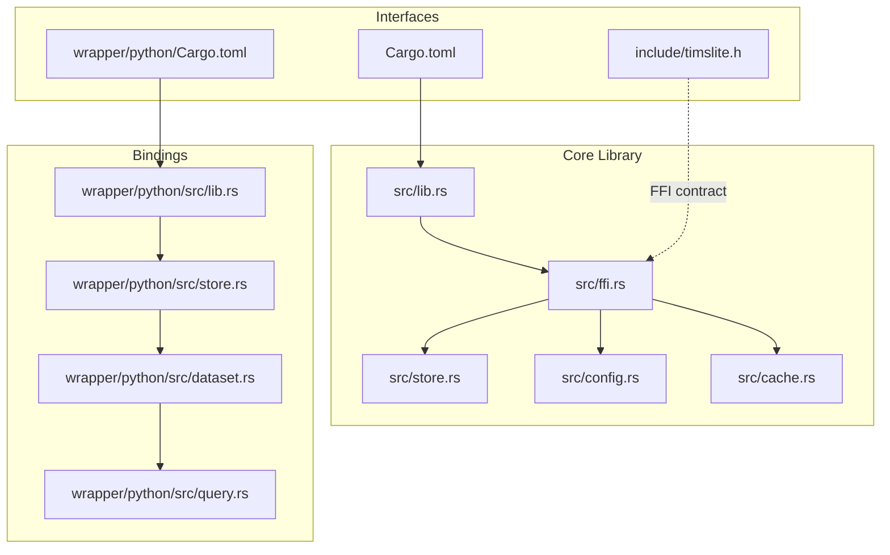
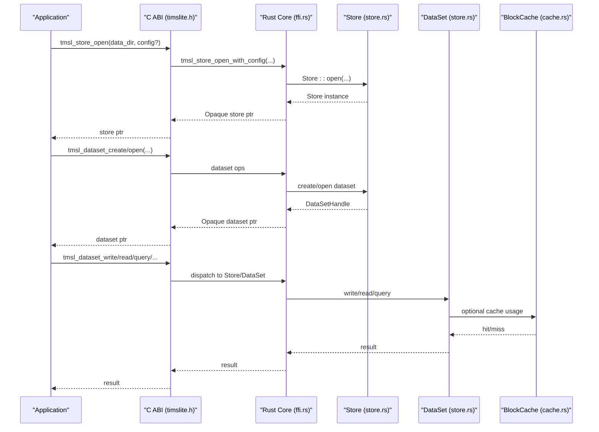
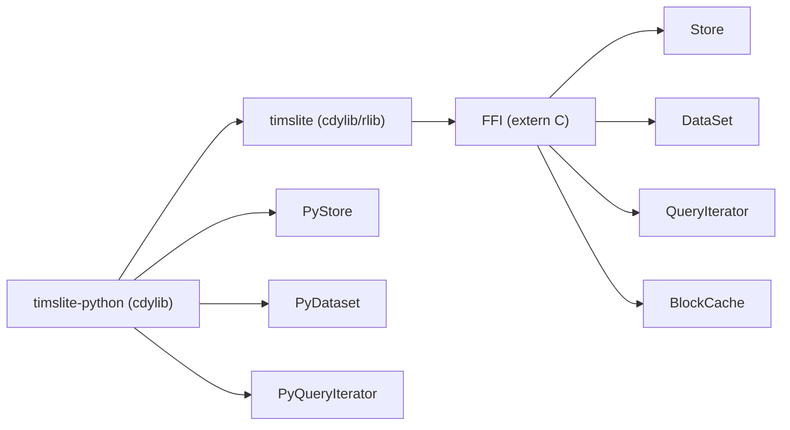

# Integration Patterns

<cite>
**Referenced Files in This Document**
- [Cargo.toml](file://Cargo.toml)
- [include/timslite.h](file://include/timslite.h)
- [src/lib.rs](file://src/lib.rs)
- [src/ffi.rs](file://src/ffi.rs)
- [src/config.rs](file://src/config.rs)
- [src/cache.rs](file://src/cache.rs)
- [src/store.rs](file://src/store.rs)
- [wrapper/python/Cargo.toml](file://wrapper/python/Cargo.toml)
- [wrapper/python/src/lib.rs](file://wrapper/python/src/lib.rs)
- [wrapper/python/src/store.rs](file://wrapper/python/src/store.rs)
- [wrapper/python/src/dataset.rs](file://wrapper/python/src/dataset.rs)
- [wrapper/python/src/query.rs](file://wrapper/python/src/query.rs)
- [wrapper/python/tests/test_basic.py](file://wrapper/python/tests/test_basic.py)
- [wrapper/python/README.md](file://wrapper/python/README.md)
- [design.md](file://design.md)
</cite>

## Table of Contents
1. [Introduction](#introduction)
2. [Project Structure](#project-structure)
3. [Core Components](#core-components)
4. [Architecture Overview](#architecture-overview)
5. [Detailed Component Analysis](#detailed-component-analysis)
6. [Dependency Analysis](#dependency-analysis)
7. [Performance Considerations](#performance-considerations)
8. [Troubleshooting Guide](#troubleshooting-guide)
9. [Conclusion](#conclusion)
10. [Appendices](#appendices)

## Introduction
This document describes TimSLite integration patterns across languages and environments. It focuses on:
- Native application integration (C ABI)
- Microservice architectures (via language bindings and FFI)
- Embedded systems usage (resource-aware configuration and lifecycle)
- Performance, memory management, and resource optimization
- Deployment considerations, version compatibility, and migration
- Production best practices, monitoring, and troubleshooting
- Security and compliance considerations

TimSLite exposes a C ABI FFI for cross-language interoperability and includes a thin Python binding built on PyO3. The core engine is a high-performance, mmap-backed time-series store with block-level aggregation, delayed compression, lazy segment lifecycle, and time-indexed queries.

## Project Structure
At a high level:
- Core library exposes a C ABI FFI and public Rust APIs
- Python wrapper provides a Pythonic API via PyO3
- Design documents outline detailed behavior and integration guidance

**Diagram sources**
- [src/lib.rs:39-72](file://src/lib.rs#L39-L72)
- [src/ffi.rs:1-120](file://src/ffi.rs#L1-L120)
- [src/store.rs:46-56](file://src/store.rs#L46-L56)
- [src/config.rs:26-52](file://src/config.rs#L26-L52)
- [src/cache.rs:43-67](file://src/cache.rs#L43-L67)
- [wrapper/python/src/lib.rs:14-28](file://wrapper/python/src/lib.rs#L14-L28)
- [wrapper/python/src/store.rs:16-24](file://wrapper/python/src/store.rs#L16-L24)
- [wrapper/python/src/dataset.rs:12-18](file://wrapper/python/src/dataset.rs#L12-L18)
- [wrapper/python/src/query.rs:11-19](file://wrapper/python/src/query.rs#L11-L19)
- [include/timslite.h:21-49](file://include/timslite.h#L21-L49)
- [wrapper/python/Cargo.toml:10-12](file://wrapper/python/Cargo.toml#L10-L12)
- [Cargo.toml:10-14](file://Cargo.toml#L10-L14)

**Section sources**
- [Cargo.toml:6-8](file://Cargo.toml#L6-L8)
- [wrapper/python/Cargo.toml:6-8](file://wrapper/python/Cargo.toml#L6-L8)
- [include/timslite.h:1-358](file://include/timslite.h#L1-L358)
- [src/lib.rs:39-72](file://src/lib.rs#L39-L72)
- [wrapper/python/src/lib.rs:14-28](file://wrapper/python/src/lib.rs#L14-L28)

## Core Components
- C ABI FFI: Defines versioned structs and functions for store, dataset, and iterator lifecycles, plus background task control and memory management.
- Store: Top-level facade managing datasets, background tasks, journal, and global block cache.
- Config: Store-level and dataset-level configuration builders with sensible defaults.
- Cache: Global block cache with LRU and idle eviction; hot-block cache for per-query locality.
- Python binding: PyO3-based wrapper exposing Store, Dataset, QueryIterator, and exceptions.

Key integration touchpoints:
- FFI versioning for store and dataset configs ensures forward/backward compatibility.
- Lifecycle guards prevent closing stores/datasets while children (iterators/handles) remain open.
- Background task execution can be automatic or manual, enabling integration in event loops.

**Section sources**
- [include/timslite.h:21-49](file://include/timslite.h#L21-L49)
- [src/ffi.rs:101-140](file://src/ffi.rs#L101-L140)
- [src/store.rs:46-56](file://src/store.rs#L46-L56)
- [src/config.rs:26-52](file://src/config.rs#L26-L52)
- [src/cache.rs:43-67](file://src/cache.rs#L43-L67)
- [wrapper/python/src/store.rs:16-24](file://wrapper/python/src/store.rs#L16-L24)

## Architecture Overview
The integration architecture centers on the FFI boundary and optional language bindings.

**Diagram sources**
- [include/timslite.h:60-93](file://include/timslite.h#L60-L93)
- [include/timslite.h:141-194](file://include/timslite.h#L141-L194)
- [include/timslite.h:240-305](file://include/timslite.h#L240-L305)
- [src/ffi.rs:308-330](file://src/ffi.rs#L308-L330)
- [src/ffi.rs:426-462](file://src/ffi.rs#L426-L462)
- [src/ffi.rs:633-654](file://src/ffi.rs#L633-L654)
- [src/store.rs:58-161](file://src/store.rs#L58-L161)
- [src/store.rs:167-226](file://src/store.rs#L167-L226)
- [src/cache.rs:68-85](file://src/cache.rs#L68-L85)

## Detailed Component Analysis

### C ABI Integration (Native Applications)
- Versioned config structs: Store and Dataset configs carry explicit version fields to detect mismatches.
- Store lifecycle: open/close with safety checks; background task tick and delay query.
- Dataset lifecycle: create/open/close/drop; flush; latest timestamp; write/append/delete; single record read; query iterator.
- Memory ownership: read APIs allocate via malloc; callers must free via provided free function.
- Error handling: functions return 0/-1 and write error messages into caller-provided buffers.

Common integration scenarios:
- Native C/C++ applications link against the cdylib artifact and call the FFI functions directly.
- Use tmsl_store_config_default to initialize defaults, then adjust as needed.
- For continuous operation without a background thread, poll tmsl_store_next_background_delay and call tmsl_store_tick_background_tasks in an event loop.

**Section sources**
- [include/timslite.h:21-49](file://include/timslite.h#L21-L49)
- [include/timslite.h:60-122](file://include/timslite.h#L60-L122)
- [include/timslite.h:141-218](file://include/timslite.h#L141-L218)
- [include/timslite.h:240-351](file://include/timslite.h#L240-L351)
- [src/ffi.rs:280-294](file://src/ffi.rs#L280-L294)
- [src/ffi.rs:308-330](file://src/ffi.rs#L308-L330)
- [src/ffi.rs:368-420](file://src/ffi.rs#L368-L420)
- [src/ffi.rs:426-462](file://src/ffi.rs#L426-L462)
- [src/ffi.rs:526-551](file://src/ffi.rs#L526-L551)
- [src/ffi.rs:612-629](file://src/ffi.rs#L612-L629)
- [src/ffi.rs:633-703](file://src/ffi.rs#L633-L703)
- [src/ffi.rs:712-746](file://src/ffi.rs#L712-L746)
- [src/ffi.rs:764-793](file://src/ffi.rs#L764-L793)
- [src/ffi.rs:799-800](file://src/ffi.rs#L799-L800)

### Python Binding Integration
- PyO3 module exports Store, Dataset, QueryIterator, and exception classes.
- Store wraps an Option<Store>, supports context manager semantics, and tracks open datasets.
- Dataset holds an Arc<Mutex<DataSet>> to safely outlive the Store and enforces read-only constraints for special datasets.
- QueryIterator pre-fetches index entries and lazily loads data under lock.

Typical usage patterns:
- Context manager for safe acquisition/release.
- Create/open datasets with optional overrides of store defaults.
- Manual background task execution when background thread is disabled.

**Section sources**
- [wrapper/python/src/lib.rs:14-28](file://wrapper/python/src/lib.rs#L14-L28)
- [wrapper/python/src/store.rs:16-24](file://wrapper/python/src/store.rs#L16-L24)
- [wrapper/python/src/store.rs:28-60](file://wrapper/python/src/store.rs#L28-L60)
- [wrapper/python/src/store.rs:107-145](file://wrapper/python/src/store.rs#L107-L145)
- [wrapper/python/src/store.rs:147-174](file://wrapper/python/src/store.rs#L147-L174)
- [wrapper/python/src/store.rs:214-224](file://wrapper/python/src/store.rs#L214-L224)
- [wrapper/python/src/store.rs:225-253](file://wrapper/python/src/store.rs#L225-L253)
- [wrapper/python/src/dataset.rs:12-18](file://wrapper/python/src/dataset.rs#L12-L18)
- [wrapper/python/src/dataset.rs:48-76](file://wrapper/python/src/dataset.rs#L48-L76)
- [wrapper/python/src/dataset.rs:78-113](file://wrapper/python/src/dataset.rs#L78-L113)
- [wrapper/python/src/dataset.rs:115-126](file://wrapper/python/src/dataset.rs#L115-L126)
- [wrapper/python/src/dataset.rs:128-148](file://wrapper/python/src/dataset.rs#L128-L148)
- [wrapper/python/src/dataset.rs:150-174](file://wrapper/python/src/dataset.rs#L150-L174)
- [wrapper/python/src/query.rs:11-19](file://wrapper/python/src/query.rs#L11-L19)
- [wrapper/python/src/query.rs:40-54](file://wrapper/python/src/query.rs#L40-L54)
- [wrapper/python/tests/test_basic.py:24-39](file://wrapper/python/tests/test_basic.py#L24-L39)
- [wrapper/python/README.md:14-41](file://wrapper/python/README.md#L14-L41)
- [wrapper/python/README.md:43-76](file://wrapper/python/README.md#L43-L76)

### Microservice Architectures
Recommended patterns:
- Use the C ABI from service processes to embed TimSLite directly, avoiding IPC overhead.
- For polyglot services, expose a small adapter that translates service-specific types to the FFI contract.
- Manage background tasks according to service lifecycle:
  - Enable background thread for long-running services.
  - Disable background thread and integrate tick calls into the service’s event loop for short-lived or containerized workloads.
- Use the journal and queue subsystems for change log and streaming ingestion where applicable.

Operational guidance:
- Monitor background task delays and tune flush/idle/cache intervals to balance latency and throughput.
- Use dataset-level continuous indexing for sparse time series to reduce gaps.

**Section sources**
- [src/store.rs:139-158](file://src/store.rs#L139-L158)
- [src/store.rs:550-576](file://src/store.rs#L550-L576)
- [src/config.rs:26-52](file://src/config.rs#L26-L52)
- [design.md:10-31](file://design.md#L10-L31)

### Embedded Systems Usage
Guidance:
- Configure conservative cache_max_memory and cache_idle_timeout to constrain memory usage.
- Choose smaller initial and default segment sizes to reduce peak memory and disk fragmentation.
- Disable background thread and drive ticks from a dedicated timer or event loop.
- Use continuous index mode judiciously; it increases index density and memory usage.

Lifecycle:
- Ensure proper close sequences to flush and release mmap resources before power-down or process termination.

**Section sources**
- [src/config.rs:26-52](file://src/config.rs#L26-L52)
- [src/cache.rs:43-67](file://src/cache.rs#L43-L67)
- [src/store.rs:139-158](file://src/store.rs#L139-L158)
- [src/store.rs:578-597](file://src/store.rs#L578-L597)

## Dependency Analysis
- The core library builds as a cdylib and rlib, exporting a C ABI and Rust API surface.
- The Python wrapper depends on the core library and PyO3.
- FFI functions depend on internal store/dataset/query/cache modules.

**Diagram sources**
- [Cargo.toml:6-8](file://Cargo.toml#L6-L8)
- [wrapper/python/Cargo.toml:6-8](file://wrapper/python/Cargo.toml#L6-L8)
- [src/lib.rs:39-72](file://src/lib.rs#L39-L72)
- [src/ffi.rs:1-120](file://src/ffi.rs#L1-L120)
- [src/store.rs:46-56](file://src/store.rs#L46-L56)
- [src/cache.rs:43-67](file://src/cache.rs#L43-L67)
- [wrapper/python/src/lib.rs:14-28](file://wrapper/python/src/lib.rs#L14-L28)

**Section sources**
- [Cargo.toml:10-14](file://Cargo.toml#L10-L14)
- [wrapper/python/Cargo.toml:10-12](file://wrapper/python/Cargo.toml#L10-L12)
- [src/lib.rs:39-72](file://src/lib.rs#L39-L72)

## Performance Considerations
- Background tasks:
  - Automatic: background thread executes flush, idle-close, cache eviction, and retention reclaim.
  - Manual: disable background thread and call tick functions in your event loop.
- Cache:
  - Global block cache with LRU and idle eviction; hot-block cache reduces lock contention during queries.
  - Tune cache_max_memory and cache_idle_timeout to balance hit rate and memory footprint.
- Segment sizing:
  - Adjust data_segment_size and index_segment_size to trade off I/O amplification vs. index overhead.
  - Initial sizes grow to configured limits; choose modest initial sizes for constrained environments.
- Compression:
  - Deflate compression level affects CPU and compression ratio; choose higher levels for archival-like workloads.
- Continuous index:
  - Reduces gaps in sparse series but increases index density; evaluate trade-offs for your workload.

**Section sources**
- [src/store.rs:139-158](file://src/store.rs#L139-L158)
- [src/store.rs:550-576](file://src/store.rs#L550-L576)
- [src/config.rs:26-52](file://src/config.rs#L26-L52)
- [src/cache.rs:43-67](file://src/cache.rs#L43-L67)
- [src/cache.rs:288-353](file://src/cache.rs#L288-L353)

## Troubleshooting Guide
Common issues and remedies:
- Store/Dataset close failures:
  - Ensure no outstanding child handles (datasets or iterators) remain open before closing.
- Iterator misuse:
  - Always close iterators to decrement internal counts; leaking iterators prevents dataset closure.
- Error reporting:
  - FFI functions write human-readable error messages into caller-provided buffers; check err_buf after failures.
- Panic safety:
  - FFI wrappers catch panics and return standardized error codes; investigate underlying causes in host language.
- Memory allocation:
  - Read APIs allocate via malloc; callers must free via tmsl_data_free or tmsl_iter_free_data.
- Background tasks not running:
  - If background thread is disabled, poll tmsl_store_next_background_delay and call tmsl_store_tick_background_tasks in your loop.

Validation via tests:
- Python smoke tests verify import, context manager, and basic config defaults.

**Section sources**
- [src/ffi.rs:32-47](file://src/ffi.rs#L32-L47)
- [src/ffi.rs:49-97](file://src/ffi.rs#L49-L97)
- [src/ffi.rs:332-358](file://src/ffi.rs#L332-L358)
- [src/ffi.rs:524-551](file://src/ffi.rs#L524-L551)
- [include/timslite.h:335-351](file://include/timslite.h#L335-L351)
- [wrapper/python/tests/test_basic.py:24-39](file://wrapper/python/tests/test_basic.py#L24-L39)

## Conclusion
TimSLite offers robust integration across native and managed environments through a stable C ABI and a thin Python binding. By tuning configuration, managing background tasks, and applying sound memory and resource strategies, teams can deploy TimSLite effectively in native applications, microservices, and embedded systems. The design documents provide deeper insights for advanced customization and troubleshooting.

## Appendices

### Version Compatibility and Migration
- FFI version fields in store and dataset config structs:
  - Store config version and dataset config version are explicitly defined and validated in the FFI layer.
  - Mismatches trigger errors, preventing accidental misconfiguration.
- Migration strategy:
  - When upgrading, keep existing datasets intact; they reopen from their meta files.
  - Review background task behavior if switching between automatic/manual execution.
  - Validate cache and segment sizes post-upgrade to maintain desired performance characteristics.

**Section sources**
- [include/timslite.h:21-49](file://include/timslite.h#L21-L49)
- [src/ffi.rs:205-227](file://src/ffi.rs#L205-L227)
- [src/ffi.rs:237-251](file://src/ffi.rs#L237-L251)
- [src/store.rs:108-121](file://src/store.rs#L108-L121)

### Security and Compliance Considerations
- Sandboxing:
  - Restrict filesystem access to designated data directories; avoid exposing internal journal paths.
- Data-at-rest:
  - Use appropriate filesystem permissions and encryption at rest where required.
- Auditability:
  - The journal subsystem logs dataset operations; ensure audit logging aligns with compliance policies.
- Data retention:
  - Configure retention windows and verify reclamation schedules meet compliance timelines.

**Section sources**
- [src/store.rs:108-121](file://src/store.rs#L108-L121)
- [src/config.rs:45-46](file://src/config.rs#L45-L46)
- [design.md:17-31](file://design.md#L17-L31)