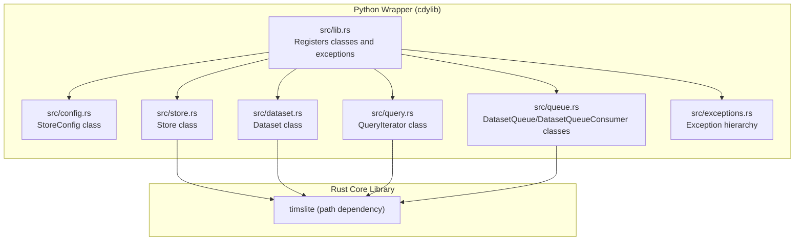
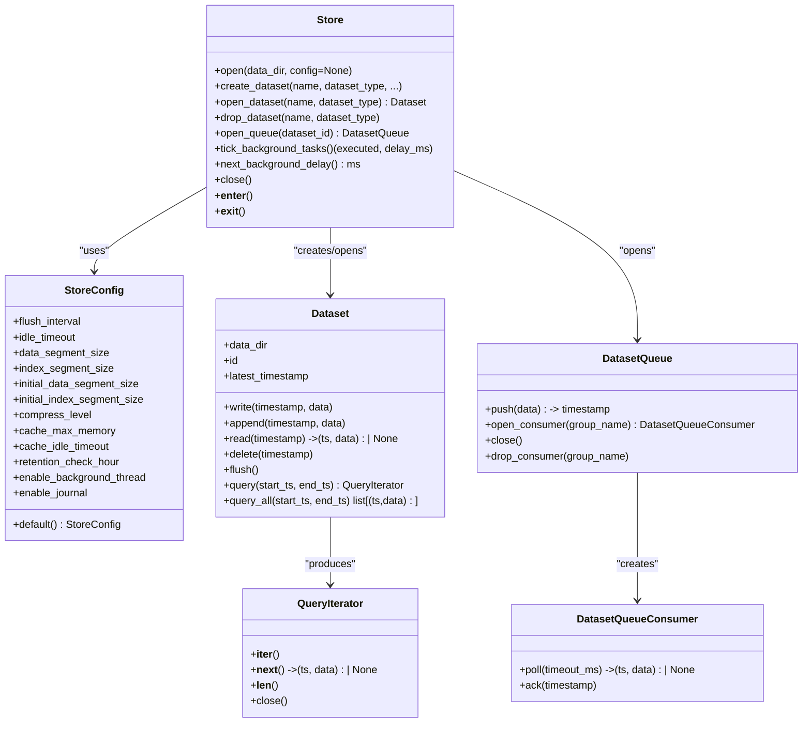
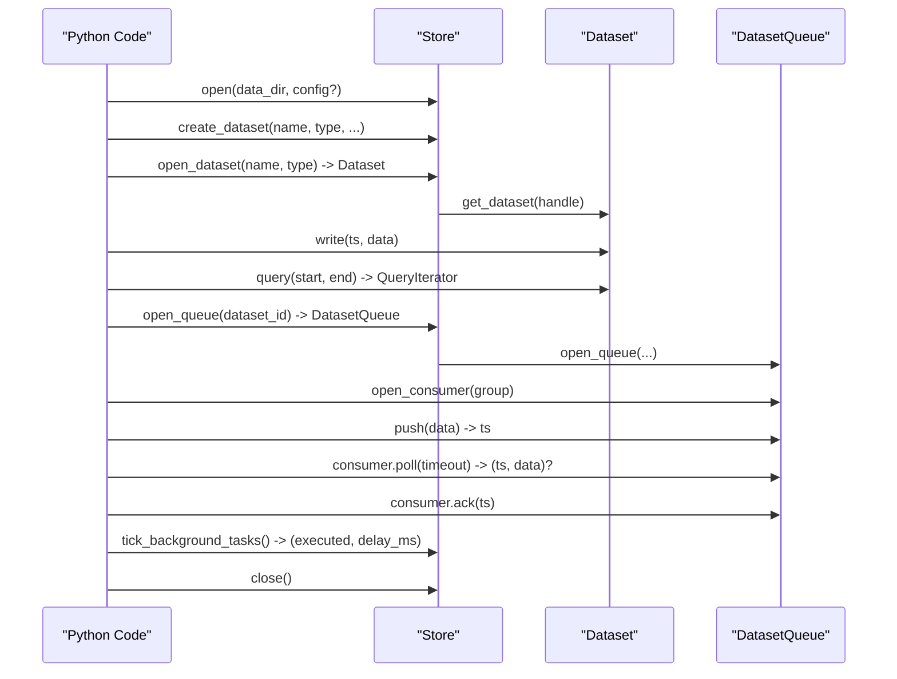
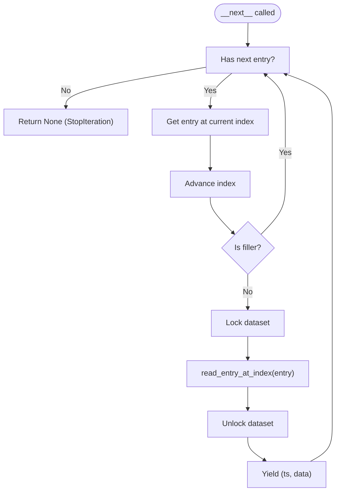
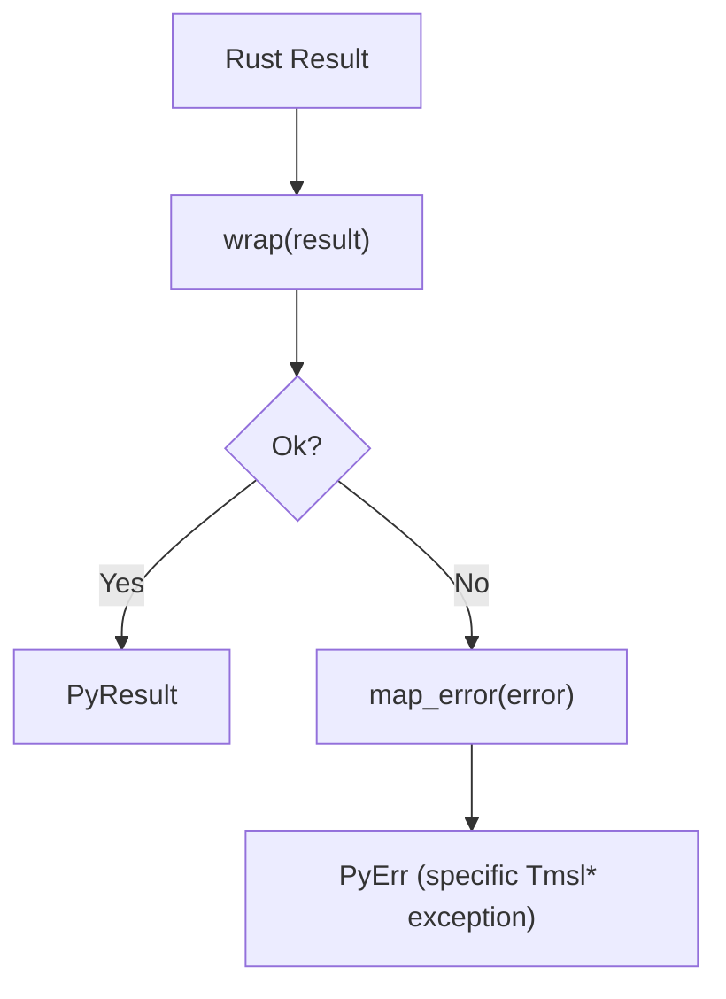
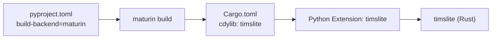

# Python Bindings

<cite>
**Referenced Files in This Document**
- [Cargo.toml](file://wrapper/python/Cargo.toml)
- [pyproject.toml](file://wrapper/python/pyproject.toml)
- [README.md](file://wrapper/python/README.md)
- [lib.rs](file://wrapper/python/src/lib.rs)
- [config.rs](file://wrapper/python/src/config.rs)
- [store.rs](file://wrapper/python/src/store.rs)
- [dataset.rs](file://wrapper/python/src/dataset.rs)
- [query.rs](file://wrapper/python/src/query.rs)
- [queue.rs](file://wrapper/python/src/queue.rs)
- [exceptions.rs](file://wrapper/python/src/exceptions.rs)
- [test_basic.py](file://wrapper/python/tests/test_basic.py)
- [test_config.py](file://wrapper/python/tests/test_config.py)
- [test_exceptions.py](file://wrapper/python/tests/test_exceptions.py)
- [test_write_query.py](file://wrapper/python/tests/test_write_query.py)
</cite>

## Update Summary
**Changes Made**
- Updated Dataset.read() method signature to remove explicit cache parameter
- Updated QueryIterator.read_entry_at_index() method signature to remove explicit cache parameter
- Revised performance considerations to reflect simplified API design
- Updated examples and troubleshooting guidance to match new method signatures

## Table of Contents
1. [Introduction](#introduction)
2. [Project Structure](#project-structure)
3. [Core Components](#core-components)
4. [Architecture Overview](#architecture-overview)
5. [Detailed Component Analysis](#detailed-component-analysis)
6. [Dependency Analysis](#dependency-analysis)
7. [Performance Considerations](#performance-considerations)
8. [Troubleshooting Guide](#troubleshooting-guide)
9. [Installation and Compatibility](#installation-and-compatibility)
10. [Testing Strategies](#testing-strategies)
11. [Examples and Workflows](#examples-and-workflows)
12. [Conclusion](#conclusion)

## Introduction
This document describes the Python bindings for TimSLite implemented with PyO3. It covers the Pythonic API design, class hierarchies, method signatures, exception handling, configuration management, dataset operations, query iteration, and queue semantics. It also includes practical usage patterns, performance tips, testing strategies, installation steps, and compatibility requirements.

## Project Structure
The Python wrapper is a separate crate that builds a Python extension module named timslite. It exposes a thin, Pythonic façade around the core Rust library.

**Diagram sources**
- [lib.rs:14-28](file://wrapper/python/src/lib.rs#L14-L28)
- [config.rs:6-26](file://wrapper/python/src/config.rs#L6-L26)
- [store.rs:16-24](file://wrapper/python/src/store.rs#L16-L24)
- [dataset.rs:12-18](file://wrapper/python/src/dataset.rs#L12-L18)
- [query.rs:11-19](file://wrapper/python/src/query.rs#L11-L19)
- [queue.rs:15-18](file://wrapper/python/src/queue.rs#L15-L18)
- [exceptions.rs:15-106](file://wrapper/python/src/exceptions.rs#L15-L106)

**Section sources**
- [Cargo.toml:1-13](file://wrapper/python/Cargo.toml#L1-L13)
- [pyproject.toml:1-22](file://wrapper/python/pyproject.toml#L1-L22)
- [lib.rs:14-28](file://wrapper/python/src/lib.rs#L14-L28)

## Core Components
- Store: Main entry point, context manager, dataset lifecycle, queue management, and background task control.
- StoreConfig: Configuration object for store behavior and defaults for datasets.
- Dataset: Per-dataset operations: write, append, read, delete, flush, query, and metadata accessors.
- QueryIterator: Lazy iterator over query results, implementing Python's iterator protocol.
- DatasetQueue and DatasetQueueConsumer: Producer/consumer queue semantics for datasets.
- Exception hierarchy: A set of Python exceptions mapped from Rust error variants.

Key Python classes and their primary roles:
- timslite.Store: open/close, create/open/drop datasets, open queues, manual background ticks.
- timslite.StoreConfig: kwargs-based configuration with defaults and getters.
- timslite.Dataset: write/read/delete/flush/query and metadata.
- timslite.QueryIterator: lazy iteration over query results.
- timslite.DatasetQueue and timslite.DatasetQueueConsumer: push/poll/ack and consumer group management.

**Section sources**
- [store.rs:16-254](file://wrapper/python/src/store.rs#L16-L254)
- [config.rs:6-122](file://wrapper/python/src/config.rs#L6-L122)
- [dataset.rs:12-175](file://wrapper/python/src/dataset.rs#L12-L175)
- [query.rs:11-68](file://wrapper/python/src/query.rs#L11-L68)
- [queue.rs:15-117](file://wrapper/python/src/queue.rs#L15-L117)
- [exceptions.rs:15-193](file://wrapper/python/src/exceptions.rs#L15-L193)

## Architecture Overview
The Python module registers Rust-backed classes and exposes them as native Python types. Exceptions are mapped from Rust to Python. Data access is mediated by internal locks to ensure thread-safe access to the underlying dataset.

**Diagram sources**
- [store.rs:16-254](file://wrapper/python/src/store.rs#L16-L254)
- [config.rs:6-122](file://wrapper/python/src/config.rs#L6-L122)
- [dataset.rs:12-175](file://wrapper/python/src/dataset.rs#L12-L175)
- [query.rs:11-68](file://wrapper/python/src/query.rs#L11-L68)
- [queue.rs:15-117](file://wrapper/python/src/queue.rs#L15-L117)

## Detailed Component Analysis

### Store
Responsibilities:
- Context manager support for safe resource management.
- Opening stores with optional configuration.
- Creating, opening, and dropping datasets.
- Managing queues per dataset.
- Manual background task execution and delay inspection.

Key behaviors:
- Enforces closed-store protection for operations.
- Tracks open datasets and read-only datasets (e.g., journal).
- Provides synchronous tick and delay helpers for manual background execution.

**Diagram sources**
- [store.rs:38-253](file://wrapper/python/src/store.rs#L38-L253)
- [dataset.rs:48-174](file://wrapper/python/src/dataset.rs#L48-L174)
- [queue.rs:26-109](file://wrapper/python/src/queue.rs#L26-L109)

**Section sources**
- [store.rs:16-254](file://wrapper/python/src/store.rs#L16-L254)

### StoreConfig
Design:
- Constructor accepts keyword arguments with sensible defaults mirroring the Rust builder.
- Provides property getters for all configuration fields.
- Includes a default classmethod to construct a default configuration.

Usage patterns:
- Pass a StoreConfig instance to Store.open to customize behavior.
- Override per-dataset defaults during create_dataset.

**Section sources**
- [config.rs:6-122](file://wrapper/python/src/config.rs#L6-L122)

### Dataset
Operations:
- write(timestamp, data): Append a new record or update an existing one depending on mode.
- append(timestamp, data): Append payload to the latest record at timestamp.
- read(timestamp): Retrieve a record by exact timestamp; -1 fetches the latest.
- delete(timestamp): Mark a record as deleted.
- flush(): Force pending writes to disk.
- query(start_ts, end_ts): Returns a lazy QueryIterator.
- query_all(start_ts, end_ts): Convenience returning a list of all results.
- Accessors: data_dir (base directory), id (internal dataset identifier), latest_timestamp.

Thread safety:
- Internally guarded by a mutex; methods lock around operations.

**Updated** Removed explicit cache parameter from read() method signature as part of API simplification.

**Section sources**
- [dataset.rs:12-175](file://wrapper/python/src/dataset.rs#L12-L175)

### QueryIterator
Behavior:
- Pre-fetches index entries (cheap) and lazily fetches payloads on demand.
- Implements Python's iterator protocol: __iter__, __next__, __len__.
- Skips filler entries automatically.
- Provides close() to release resources early.

**Diagram sources**
- [query.rs:40-54](file://wrapper/python/src/query.rs#L40-L54)

**Updated** Removed explicit cache parameter from read_entry_at_index() method signature as part of API simplification.

**Section sources**
- [query.rs:11-68](file://wrapper/python/src/query.rs#L11-L68)

### Queue Semantics
Classes:
- DatasetQueue: push data and manage consumer groups.
- DatasetQueueConsumer: poll for records and acknowledge processed items.

Patterns:
- push auto-increments timestamps and notifies waiting consumers.
- Consumers in the same group share progress via a shared state file.
- poll supports blocking and non-blocking modes via timeout.
- ack commits consumption and advances progress.

**Section sources**
- [queue.rs:15-117](file://wrapper/python/src/queue.rs#L15-L117)

### Exception Handling
Hierarchy:
- Base: TmslError
- Derived: TmslIoError, TmslNotFoundError, TmslAlreadyExistsError, TmslInvalidDataError, TmslSegmentFullError, TmslMmapError, TmslCompressionError, TmslDecompressionError, TmslExpiredError, TmslQueueAlreadyOpenError, TmslQueueNotOpenError, TmslConsumerGroupNotFoundError, TmslConsumerGroupExistsError, TmslQueueClosedError, TmslPendingFullError

Mapping:
- Rust error variants are mapped to specific Python exceptions.
- All conversions are handled by a central mapping function that converts errors into PyErr.

**Diagram sources**
- [exceptions.rs:164-193](file://wrapper/python/src/exceptions.rs#L164-L193)

**Section sources**
- [exceptions.rs:15-193](file://wrapper/python/src/exceptions.rs#L15-L193)

## Dependency Analysis
- Build system: Maturin is used to build a Python extension module.
- Runtime dependencies: PyO3 (extension-module feature) and the timslite Rust crate.
- Module registration: The Python module registers exception classes and Python classes in a single initialization function.

**Diagram sources**
- [pyproject.toml:1-22](file://wrapper/python/pyproject.toml#L1-L22)
- [Cargo.toml:1-13](file://wrapper/python/Cargo.toml#L1-L13)

**Section sources**
- [pyproject.toml:1-22](file://wrapper/python/pyproject.toml#L1-L22)
- [Cargo.toml:10-12](file://wrapper/python/Cargo.toml#L10-L12)

## Performance Considerations
- Lazy iteration: QueryIterator pre-fetches index entries and fetches payloads on demand, minimizing memory overhead.
- Batch queries: Prefer query_all when you need all results at once to avoid repeated locking.
- Manual flush: Call flush after bursts of writes to reduce latency and ensure durability.
- Continuous indexing: Enable index_continuous for datasets requiring logical gaps; it affects write semantics and query coverage.
- Background tasks: In manual mode, schedule periodic tick_background_tasks calls based on next_background_delay to keep housekeeping active.
- Memory cache: Tune cache_max_memory and cache_idle_timeout via StoreConfig to balance throughput and memory usage.
- API simplicity: The simplified API eliminates the need for explicit cache parameter management, reducing overhead and improving developer experience.

## Troubleshooting Guide
Common issues and resolutions:
- Using a closed store: Operations raise a runtime error indicating the store is closed. Ensure proper context manager usage or explicit close handling.
- Read-only datasets: Certain datasets (e.g., journal) are read-only; write and delete operations will fail with a runtime error.
- Out-of-order writes: In non-continuous mode, out-of-order updates overwrite existing entries; verify dataset mode and timestamps.
- Empty queries: query and query_all return no results for ranges with no data; confirm timestamp ranges and dataset contents.
- Queue closed: Polling on a closed queue raises a queue-specific error; ensure queue is open and consumers are valid.
- Simplified API: The removal of explicit cache parameters means cache management is now handled internally, eliminating cache-related configuration errors.

**Section sources**
- [dataset.rs:58-113](file://wrapper/python/src/dataset.rs#L58-L113)
- [store.rs:217-253](file://wrapper/python/src/store.rs#L217-L253)
- [exceptions.rs:164-187](file://wrapper/python/src/exceptions.rs#L164-L187)

## Installation and Compatibility
- Requires Python >= 3.9.
- Install in development mode using Maturin; release builds supported.
- The module name is timslite; it exports classes and exceptions at the package level.

**Section sources**
- [pyproject.toml:10-10](file://wrapper/python/pyproject.toml#L10-L10)
- [README.md:5-10](file://wrapper/python/README.md#L5-L10)

## Testing Strategies
Recommended approaches:
- Unit tests for each major component: Store, StoreConfig, Dataset, QueryIterator, and Queue.
- Behavior-driven tests covering typical workflows: creation, writing, querying, deletion, flushing, and queue operations.
- Exception coverage: Verify that specific Rust errors map to the correct Python exceptions and messages.
- Integration tests: Full end-to-end scenarios including manual background task execution and persistence.

Example test coverage areas:
- Basic import and context manager usage.
- Store configuration defaults and overrides.
- Exception hierarchy and error propagation.
- Write/query patterns, iterator protocol, partial consumption, and flush behavior.

**Section sources**
- [test_basic.py:7-58](file://wrapper/python/tests/test_basic.py#L7-L58)
- [test_config.py:7-73](file://wrapper/python/tests/test_config.py#L7-L73)
- [test_exceptions.py:7-52](file://wrapper/python/tests/test_exceptions.py#L7-L52)
- [test_write_query.py:7-128](file://wrapper/python/tests/test_write_query.py#L7-L128)

## Examples and Workflows

### Basic Store and Dataset Lifecycle
- Open a store with optional configuration.
- Create a dataset and open it.
- Write records, read by timestamp, query ranges, and delete selectively.
- Use flush to persist and latest_timestamp to inspect the latest entry.

**Section sources**
- [README.md:14-41](file://wrapper/python/README.md#L14-L41)

### Manual Background Tasks
- Disable automatic background threads and periodically call tick_background_tasks.
- Use next_background_delay to schedule the next tick.

**Section sources**
- [README.md:43-76](file://wrapper/python/README.md#L43-L76)

### Data Science Workflow Patterns
- Use query to iterate over time ranges; convert to lists with query_all when needed.
- Combine with Python libraries for analytics and plotting.
- Manage continuous vs non-continuous datasets depending on data characteristics.

**Section sources**
- [test_write_query.py:48-70](file://wrapper/python/tests/test_write_query.py#L48-L70)
- [test_config.py:63-73](file://wrapper/python/tests/test_config.py#L63-L73)

### Queue-Based Producer-Consumer
- Push records into a dataset queue; open a consumer group.
- Poll with timeouts for new records; acknowledge after processing.

**Section sources**
- [queue.rs:26-109](file://wrapper/python/src/queue.rs#L26-L109)

## Conclusion
The Python bindings provide a clean, Pythonic interface over TimSLite's high-performance time-series storage. They expose robust configuration, dataset operations, lazy query iteration, and queue semantics, with precise error mapping from Rust to Python. The recent API simplification removes the need for explicit cache parameter management while maintaining performance and reliability. By following the recommended usage patterns and performance guidelines, developers can integrate TimSLite into Python applications and data science workflows effectively.