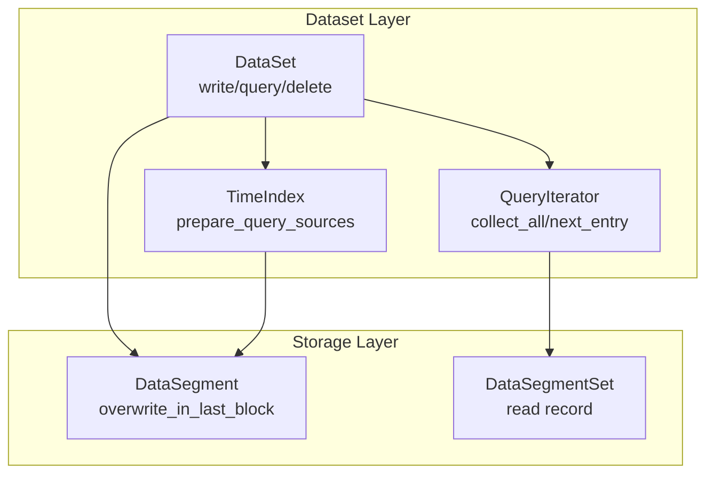
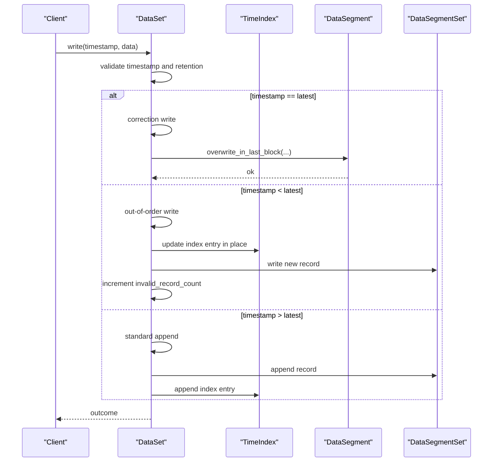
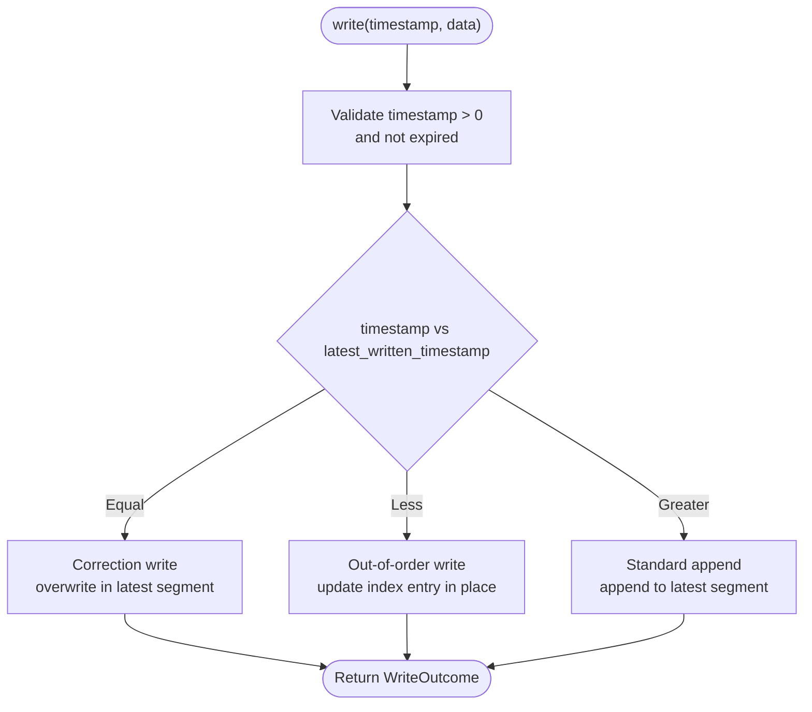
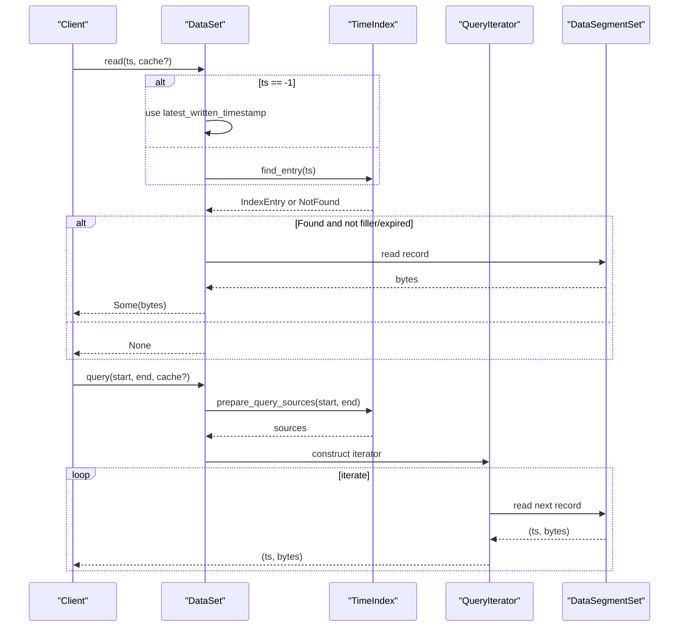
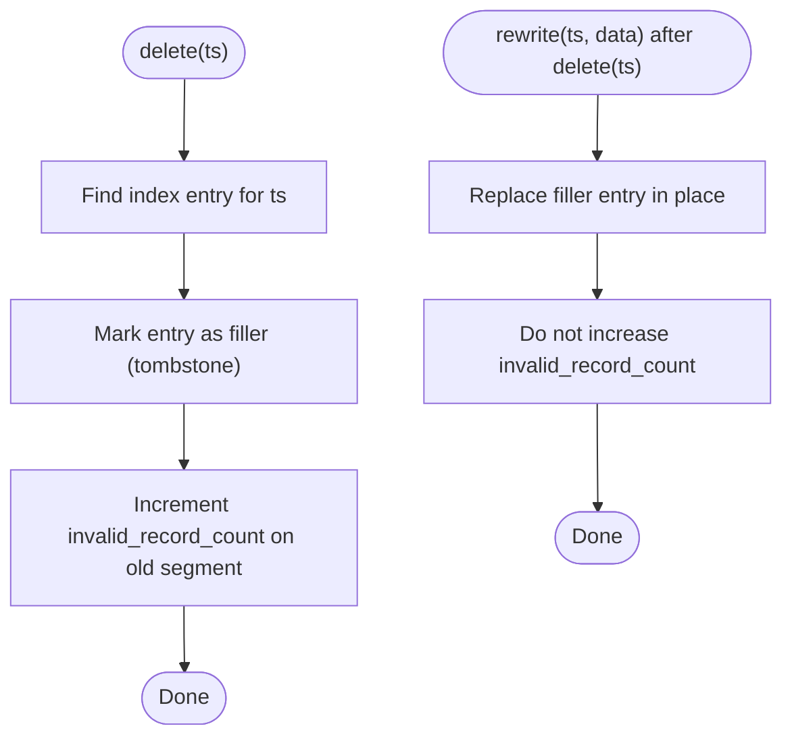
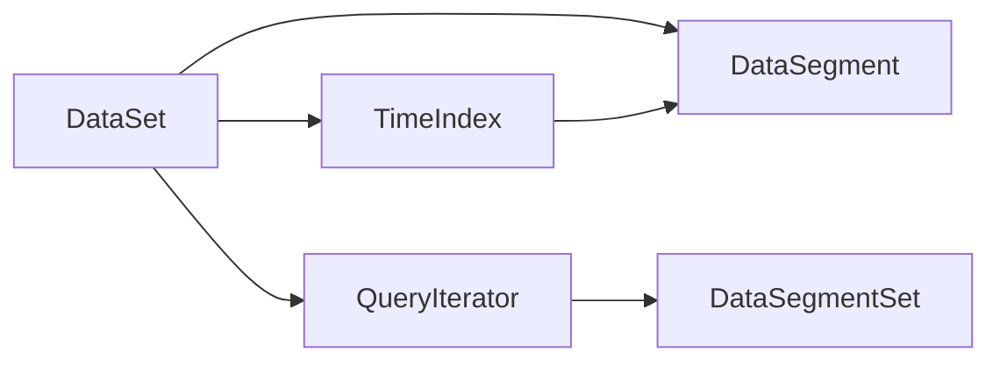

# Data Operations

<cite>
**Referenced Files in This Document**
- [dataset.rs](file://src/dataset.rs)
- [segment.rs](file://src/segment/mod.rs)
- [segment_data.rs](file://src/segment/data.rs)
- [query_iter.rs](file://src/query/iter.rs)
- [time_index.md](file://docs/design/time-index.md)
- [dataset-operations.md](file://docs/design/dataset-operations.md)
- [query-iterator.md](file://docs/design/query-iterator.md)
- [phase-17-correction-write.md](file://docs/plan/phase-17-correction-write.md)
- [phase-18-out-of-order-write-and-delete.md](file://docs/plan/phase-18-out-of-order-write-and-delete.md)
- [phase-19-single-timestamp-read.md](file://docs/plan/phase-19-single-timestamp-read.md)
- [phase-20-latest-timestamp-read.md](file://docs/plan/phase-20-latest-timestamp-read.md)
- [correction_write_test.rs](file://tests/correction_write_test.rs)
- [out_of_order_delete_test.rs](file://tests/out_of_order_delete_test.rs)
- [query_test.rs](file://tests/query_test.rs)
- [error.rs](file://src/error.rs)
</cite>

## Table of Contents
1. [Introduction](#introduction)
2. [Project Structure](#project-structure)
3. [Core Components](#core-components)
4. [Architecture Overview](#architecture-overview)
5. [Detailed Component Analysis](#detailed-component-analysis)
6. [Dependency Analysis](#dependency-analysis)
7. [Performance Considerations](#performance-considerations)
8. [Troubleshooting Guide](#troubleshooting-guide)
9. [Conclusion](#conclusion)
10. [Appendices](#appendices)

## Introduction
This document explains TimSLite's data operation capabilities comprehensively. It covers write operations (standard, append, correction, and out-of-order), read operations (single timestamp, latest timestamp, range queries, and batch operations), delete operations (tombstone marking and space reclamation), transaction semantics and consistency guarantees, error handling strategies, performance characteristics, optimization techniques, and best practices. Practical examples demonstrate common data manipulation workflows.

## Project Structure
TimSLite organizes data operations around the dataset abstraction, which coordinates indexing, segment storage, and query iteration. Key modules include:
- Dataset: orchestrates writes, reads, deletes, and retention policies
- Segment: manages data segments and low-level overwrites for correction writes
- Query iterator: provides streaming and batched range queries
- Time index: resolves query sources across memory and persisted segments
- Tests: validate correctness of correction writes, out-of-order writes/deletes, and query behavior

**Diagram sources**
- [dataset.rs:629-660](file://src/dataset.rs#L629-L660)
- [segment.rs:285-313](file://src/segment/mod.rs#L285-L313)
- [query_iter.rs](file://src/query/iter.rs)

**Section sources**
- [dataset.rs:245-282](file://src/dataset.rs#L245-L282)
- [segment.rs:285-313](file://src/segment/mod.rs#L285-L313)
- [query_iter.rs](file://src/query/iter.rs)

## Core Components
- DataSet: central API for writing, reading, and querying time-series data; enforces timestamp ordering, retention, and expiration
- DataSegment: encapsulates segment-level operations, including correction write overwrites in the latest segment
- QueryIterator: constructs and traverses query sources to stream or collect results
- TimeIndex: prepares query sources from in-memory and persisted segments

Key responsibilities:
- Write path validates timestamps, applies retention/expires rules, and routes to standard append, correction write, or out-of-order write
- Read path supports single-timestamp lookup, latest-timestamp shortcut, and range queries via iterator
- Delete marks records as filler and updates invalid record counts for reclaimability

**Section sources**
- [dataset.rs:245-282](file://src/dataset.rs#L245-L282)
- [segment.rs:285-313](file://src/segment/mod.rs#L285-L313)
- [query_iter.rs](file://src/query/iter.rs)

## Architecture Overview
The write pipeline selects the appropriate operation based on timestamp comparison with the latest written timestamp and applies retention/expires checks. Reads traverse prepared sources and skip filler entries. Deletes mark tombstones and enable space reclamation during compaction.

**Diagram sources**
- [dataset.rs:245-282](file://src/dataset.rs#L245-L282)
- [segment.rs:285-313](file://src/segment/mod.rs#L285-L313)

## Detailed Component Analysis

### Write Operations
- Standard Append: appends to the latest segment when timestamp is greater than the latest written timestamp; updates index and returns append outcome
- Correction Write: in-place overwrite of the last record in the latest segment when timestamp equals the latest written timestamp; preserves index entry
- Out-of-Order Write: writes at a timestamp earlier than the latest; updates the existing index entry in place and increments invalid record count on the old segment
- Timestamp Validation: rejects non-positive timestamps and timestamps older than retention threshold; rejects attempts to append at timestamps older than latest_written_timestamp

**Diagram sources**
- [dataset.rs:245-282](file://src/dataset.rs#L245-L282)
- [segment.rs:285-313](file://src/segment/mod.rs#L285-L313)

**Section sources**
- [dataset.rs:245-282](file://src/dataset.rs#L245-L282)
- [segment.rs:285-313](file://src/segment/mod.rs#L285-L313)
- [phase-17-correction-write.md](file://docs/plan/phase-17-correction-write.md)
- [phase-18-out-of-order-write-and-delete.md](file://docs/plan/phase-18-out-of-order-write-and-delete.md)

### Read Operations
- Single Timestamp Read: finds the exact timestamp entry; returns None if not found or if retention threshold excludes it; uses three-stage index search and respects expiration
- Latest Timestamp Read: shortcut path using latest_written_timestamp when timestamp = -1; still respects retention and filler tombstones
- Range Queries: prepare sources from in-memory and closed segments, skip filler entries, and stream records; supports both iterator and batch collection
- Batch Operations: collect_all aggregates results into a vector for consumption

**Diagram sources**
- [dataset.rs:629-660](file://src/dataset.rs#L629-L660)
- [dataset-operations.md:538-552](file://docs/design/dataset-operations.md#L538-L552)
- [query-iterator.md:22-49](file://docs/design/query-iterator.md#L22-L49)

**Section sources**
- [dataset.rs:629-660](file://src/dataset.rs#L629-L660)
- [dataset-operations.md:538-552](file://docs/design/dataset-operations.md#L538-L552)
- [query-iterator.md:22-49](file://docs/design/query-iterator.md#L22-L49)
- [phase-19-single-timestamp-read.md](file://docs/plan/phase-19-single-timestamp-read.md)
- [phase-20-latest-timestamp-read.md](file://docs/plan/phase-20-latest-timestamp-read.md)

### Delete Operations
- Tombstone Marking: deletes mark entries as filler; query iterators skip filler entries transparently
- Space Reclamation: invalid_record_count increments on overwritten segments; compaction can reclaim space by dropping filler records
- Out-of-Order Behavior: after delete(ts), rewriting at ts replaces the filler entry without increasing invalid_record_count

**Diagram sources**
- [dataset.rs:332-371](file://src/dataset.rs#L332-L371)
- [out_of_order_delete_test.rs:2279-2323](file://tests/out_of_order_delete_test.rs#L2279-L2323)

**Section sources**
- [dataset.rs:332-371](file://src/dataset.rs#L332-L371)
- [out_of_order_delete_test.rs:2279-2323](file://tests/out_of_order_delete_test.rs#L2279-L2323)
- [phase-18-out-of-order-write-and-delete.md](file://docs/plan/phase-18-out-of-order-write-and-delete.md)

### Transaction Semantics and Consistency Guarantees
- Atomicity: per-record operations are atomic; multi-record consistency requires external coordination
- Isolation: concurrent writers must avoid timestamp collisions; correction/out-of-order writes update index entries in place
- Durability: writes append to segments and update indices; background processes compact and reclaim space
- Read Consistency: iterators skip filler entries and respect retention thresholds; latest timestamp read uses cached latest_written_timestamp

**Section sources**
- [dataset.rs:245-282](file://src/dataset.rs#L245-L282)
- [query_iter.rs](file://src/query/iter.rs)

### Error Handling Strategies
Common errors include invalid timestamps, expired timestamps, not found conditions, and queue-related errors. Errors are surfaced as typed TmslError variants with descriptive messages.

Typical categories:
- InvalidData: timestamp must be positive; timestamp older than latest_written_timestamp for append
- NotFound: requested resource or consumer group not found
- QueueClosed: attempting operations on closed queues
- Expired: timestamp outside retention window

**Section sources**
- [dataset.rs:332-371](file://src/dataset.rs#L332-L371)
- [error.rs](file://src/error.rs)

## Dependency Analysis
The dataset module depends on the time index for source preparation and on data segments for record persistence. The query iterator consumes prepared sources and delegates record reads to the data segment set.

**Diagram sources**
- [dataset.rs:629-660](file://src/dataset.rs#L629-L660)
- [segment.rs:285-313](file://src/segment/mod.rs#L285-L313)
- [query_iter.rs](file://src/query/iter.rs)

**Section sources**
- [dataset.rs:629-660](file://src/dataset.rs#L629-L660)
- [segment.rs:285-313](file://src/segment/mod.rs#L285-L313)
- [query_iter.rs](file://src/query/iter.rs)

## Performance Considerations
- Correction writes avoid index updates and reduce overhead by overwriting the last record in the latest segment
- Out-of-order writes update index entries in place but increment invalid_record_count, enabling later compaction
- Range queries benefit from skipping filler entries and using hot block caching for recent blocks
- Retention clamps query ranges early, reducing scan work
- Batch vs streaming: collect_all loads all results into memory; query_iter streams for large ranges

Optimization techniques:
- Prefer correction writes for frequent updates at the latest timestamp
- Use query_iter for large ranges to minimize memory footprint
- Tune retention window to balance historical access and reclaimable space
- Leverage block caching for hot data windows

[No sources needed since this section provides general guidance]

## Troubleshooting Guide
- Append fails with "older than latest_written_timestamp": ensure monotonic timestamp progression or use correction/out-of-order write paths
- Read returns None unexpectedly: verify retention threshold and check if the timestamp was marked as filler
- Out-of-order rewrite increases invalid_record_count: confirm whether replacing a filler entry is intended behavior
- Query yields fewer records than expected: check retention clamping and filler entries

**Section sources**
- [dataset.rs:332-371](file://src/dataset.rs#L332-L371)
- [query_test.rs:17-52](file://tests/query_test.rs#L17-L52)
- [correction_write_test.rs](file://tests/correction_write_test.rs)

## Conclusion
TimSLite provides robust, efficient time-series data operations with explicit support for correction writes, out-of-order writes, and tombstoned deletes. Its query iterator and retention mechanisms enable scalable range scans while maintaining strong consistency for single-timestamp reads. Proper use of correction writes, careful timestamp management, and awareness of retention semantics yield optimal performance and reliability.

[No sources needed since this section summarizes without analyzing specific files]

## Appendices

### Practical Workflows
- Standard append pattern: write monotonic timestamps; monitor invalid_record_count growth for compaction scheduling
- Correction write pattern: update latest timestamp records frequently to leverage in-place overwrites
- Out-of-order write pattern: handle historical timestamps by updating existing index entries; expect invalid_record_count growth
- Range query pattern: use query_iter for streaming; apply retention-aware filtering; skip filler entries automatically
- Delete and rewrite pattern: after delete(ts), rewrite at ts replaces filler without increasing invalid_record_count

**Section sources**
- [dataset.rs:332-371](file://src/dataset.rs#L332-L371)
- [query_iter.rs](file://src/query/iter.rs)
- [query_test.rs:17-52](file://tests/query_test.rs#L17-L52)
- [out_of_order_delete_test.rs:2279-2323](file://tests/out_of_order_delete_test.rs#L2279-L2323)