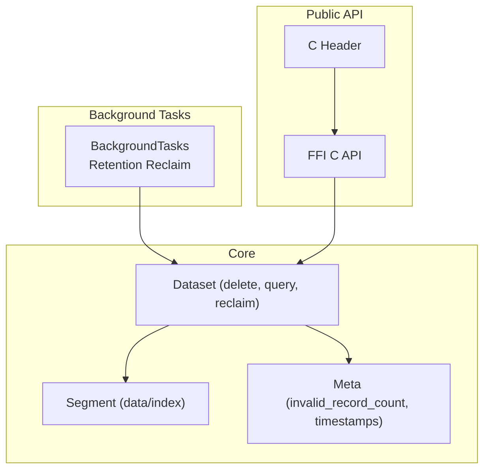
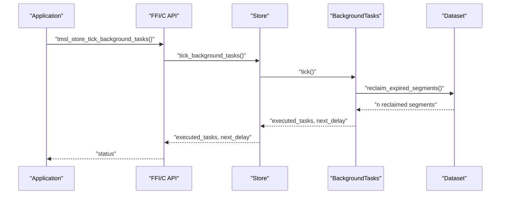
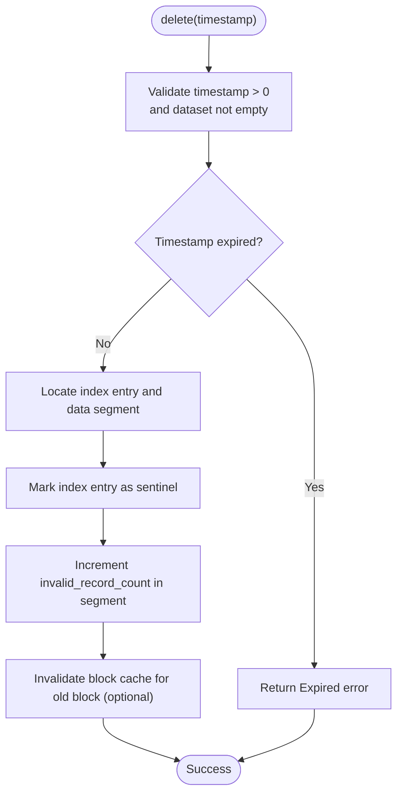
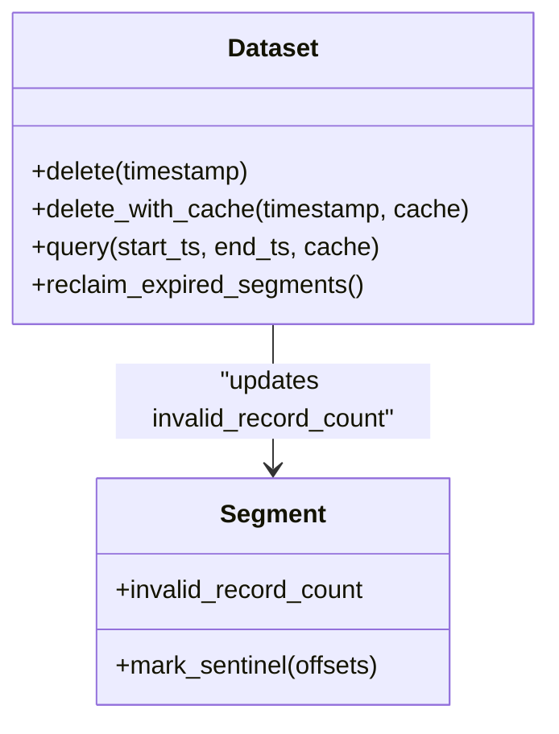
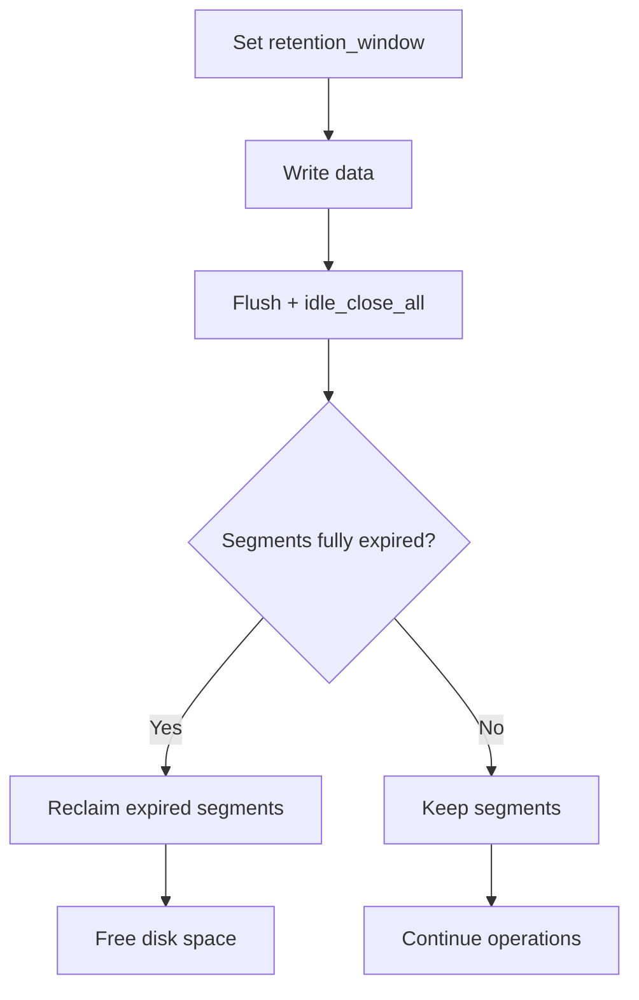
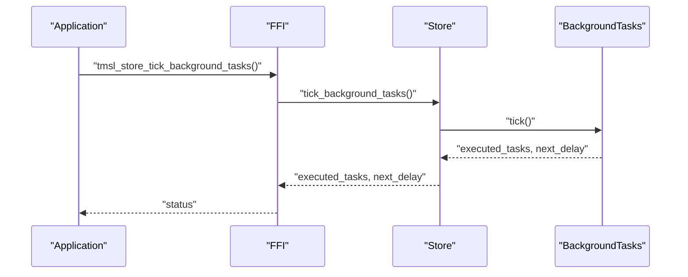
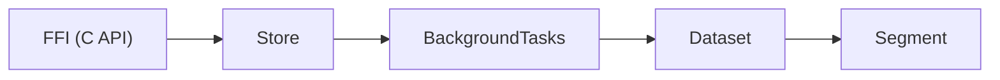

# Delete Operations

<cite>
**Referenced Files in This Document**
- [dataset.rs](file://src/dataset.rs)
- [dataset-operations.md](file://docs/design/dataset-operations.md)
- [phase-18-out-of-order-write-and-delete.md](file://docs/plan/phase-18-out-of-order-write-and-delete.md)
- [phase-21-manual-bg-execution.md](file://docs/plan/phase-21-manual-bg-execution.md)
- [mod.rs](file://src/bg/mod.rs)
- [timslite.h](file://include/timslite.h)
- [ffi.rs](file://src/ffi.rs)
- [out_of_order_delete_test.rs](file://tests/out_of_order_delete_test.rs)
- [dataset_basic_test.rs](file://tests/dataset_basic_test.rs)
- [dataset_lifecycle_test.rs](file://tests/dataset_lifecycle_test.rs)
</cite>

## Table of Contents
1. [Introduction](#introduction)
2. [Project Structure](#project-structure)
3. [Core Components](#core-components)
4. [Architecture Overview](#architecture-overview)
5. [Detailed Component Analysis](#detailed-component-analysis)
6. [Dependency Analysis](#dependency-analysis)
7. [Performance Considerations](#performance-considerations)
8. [Troubleshooting Guide](#troubleshooting-guide)
9. [Conclusion](#conclusion)
10. [Appendices](#appendices)

## Introduction
This document explains TimSLite’s delete operation capabilities and lifecycle. It covers selective record removal, time-range deletion strategies, tombstone marking for integrity, space reclamation via retention-based reclaim, compaction readiness, and storage optimization. It also documents transaction semantics, rollback limitations, consistency guarantees, performance implications, background task scheduling, and monitoring. Practical workflows, recovery procedures, and best practices for data lifecycle management are included.

## Project Structure
TimSLite organizes delete-related logic primarily within the dataset module, with supporting background task orchestration and public APIs exposed via FFI. Tests validate correctness and edge cases.

**Diagram sources**
- [dataset.rs](file://src/dataset.rs)
- [mod.rs](file://src/bg/mod.rs)
- [ffi.rs](file://src/ffi.rs)
- [timslite.h](file://include/timslite.h)

**Section sources**
- [dataset.rs](file://src/dataset.rs)
- [mod.rs](file://src/bg/mod.rs)
- [ffi.rs](file://src/ffi.rs)
- [timslite.h](file://include/timslite.h)

## Core Components
- Selective delete: Marks a single timestamp as deleted via a sentinel in the index and increments invalid record counters in the affected data segment(s).
- Tombstone mechanism: Uses sentinel markers to prevent visibility without immediately freeing disk space.
- Retention-based reclaim: Removes entire segments whose timestamps are fully outside the configured retention window.
- Compaction: Not implemented in current version; invalid_record_count is informational for diagnostics.
- Transaction semantics: No atomic transactions across delete and flush; crash can lose a delete or partially persist it; queries honor sentinels and retention thresholds.

**Section sources**
- [dataset.rs](file://src/dataset.rs)
- [dataset-operations.md](file://docs/design/dataset-operations.md)
- [phase-18-out-of-order-write-and-delete.md](file://docs/plan/phase-18-out-of-order-write-and-delete.md)

## Architecture Overview
The delete workflow integrates dataset operations, segment metadata, and background reclaim. The FFI exposes synchronous background task ticking to externally drive reclaim and maintenance.

**Diagram sources**
- [ffi.rs](file://src/ffi.rs)
- [mod.rs](file://src/bg/mod.rs)
- [timslite.h](file://include/timslite.h)

**Section sources**
- [ffi.rs](file://src/ffi.rs)
- [mod.rs](file://src/bg/mod.rs)
- [timslite.h](file://include/timslite.h)

## Detailed Component Analysis

### Selective Record Deletion
- Purpose: Remove a single timestamp’s record by marking its index entry as a sentinel and incrementing invalid record counts in the affected data segment(s).
- Behavior:
  - Rejects non-positive timestamps and missing/expired timestamps.
  - Prevents deleting fillers in continuous mode.
  - Idempotent: second delete on the same timestamp fails.
  - Increments invalid_record_count per affected segment.
- Query visibility: Deleted records become invisible via sentinel checks and retention clamping.

**Diagram sources**
- [dataset.rs](file://src/dataset.rs)

**Section sources**
- [dataset.rs](file://src/dataset.rs)
- [dataset_basic_test.rs](file://tests/dataset_basic_test.rs)

### Time-Range Deletion Strategies
- Current capability: No built-in range delete API.
- Recommended approach:
  - Iterate timestamps within the desired range and call delete(timestamp) for each.
  - Use retention window to automatically reclaim whole segments older than threshold.
- Future roadmap: Range delete API planned in design documents.

**Section sources**
- [phase-18-out-of-order-write-and-delete.md](file://docs/plan/phase-18-out-of-order-write-and-delete.md)

### Tombstone Marking and Integrity
- Tombstone mechanism:
  - Index entries are marked as sentinels (special marker) upon delete.
  - invalid_record_count increases per segment to track invalid records.
- Integrity guarantees:
  - Queries honor sentinels and retention thresholds; deleted records remain invisible.
  - Out-of-order writes after delete are rejected; fillers cannot be deleted.
  - Crash boundary: delete is not transactional; partial persistence is possible.

**Diagram sources**
- [dataset.rs](file://src/dataset.rs)

**Section sources**
- [dataset.rs](file://src/dataset.rs)
- [dataset-operations.md](file://docs/design/dataset-operations.md)

### Space Reclamation and Storage Optimization
- Retention-based reclaim:
  - Entire segments fully outside the retention window are physically removed.
  - Requires flush and idle-close to move segments into closed state before reclaim.
  - Mixed segments (containing both expired and unexpired timestamps) are preserved.
- Compaction:
  - Not implemented in current version; invalid_record_count is diagnostic only.
  - Future: trigger compaction when invalid_record_count / record_count exceeds a threshold to physically reclaim orphaned spaces.
- Monitoring:
  - invalid_record_count and record_count enable ratio-based monitoring for future compaction decisions.

**Diagram sources**
- [mod.rs](file://src/bg/mod.rs)
- [dataset-operations.md](file://docs/design/dataset-operations.md)

**Section sources**
- [mod.rs](file://src/bg/mod.rs)
- [dataset-operations.md](file://docs/design/dataset-operations.md)

### Transaction Semantics, Rollback, and Consistency
- Transaction semantics:
  - No atomic transaction across delete and flush; delete does not participate in write transactions.
- Crash consistency:
  - Partially applied deletes may be lost or partially persisted; queries rely on sentinel visibility and retention clamping to avoid inconsistent reads.
- Recovery:
  - On reopen, latest written timestamps and segment states are restored; deleted records remain invisible due to sentinel checks.

**Section sources**
- [dataset-operations.md](file://docs/design/dataset-operations.md)

### Background Cleanup Scheduling and Monitoring
- Manual background execution:
  - Store::tick_background_tasks() executes one round of due tasks (flush, idle-close, cache eviction, retention reclaim).
  - tmsl_store_tick_background_tasks() provides the same functionality via FFI.
  - tmsl_store_next_background_delay() reports the delay until the next task is due.
- Scheduling:
  - BackgroundTasks maintains internal intervals and executor state; external tick ensures deterministic scheduling even when background thread is disabled.

**Diagram sources**
- [ffi.rs](file://src/ffi.rs)
- [phase-21-manual-bg-execution.md](file://docs/plan/phase-21-manual-bg-execution.md)
- [timslite.h](file://include/timslite.h)

**Section sources**
- [ffi.rs](file://src/ffi.rs)
- [phase-21-manual-bg-execution.md](file://docs/plan/phase-21-manual-bg-execution.md)
- [timslite.h](file://include/timslite.h)

## Dependency Analysis
- Dataset depends on segment metadata (invalid_record_count) and retention configuration.
- BackgroundTasks coordinates dataset operations for reclaim and maintenance.
- FFI bridges external applications to background task scheduling.

**Diagram sources**
- [ffi.rs](file://src/ffi.rs)
- [mod.rs](file://src/bg/mod.rs)
- [dataset.rs](file://src/dataset.rs)

**Section sources**
- [ffi.rs](file://src/ffi.rs)
- [mod.rs](file://src/bg/mod.rs)
- [dataset.rs](file://src/dataset.rs)

## Performance Considerations
- Selective delete overhead:
  - Single timestamp lookup and index update; minimal IO cost.
  - Optional cache invalidation reduces subsequent read latency for the affected block.
- Retention reclaim:
  - Batch removal of entire segments; improves long-term storage efficiency.
  - Requires flush/idle-close to materialize closed segments eligible for reclaim.
- Compaction (future):
  - Would reduce fragmentation and reclaim space from invalid records without full segment removal.
- Background scheduling:
  - External ticking avoids contention with background threads; choose intervals aligned with workload patterns.

[No sources needed since this section provides general guidance]

## Troubleshooting Guide
- Delete returns “NotFound” or “Expired”:
  - Verify timestamp validity (> 0), dataset not empty, and timestamp not expired.
  - In continuous mode, do not attempt to delete fillers.
- Duplicate delete failure:
  - Deletes are idempotent; subsequent attempts on the same timestamp fail.
- Unexpected visibility after delete:
  - Ensure flush and idle-close have occurred so segments enter closed state for reclaim.
  - Confirm retention window is set appropriately; expired records are clamped by retention thresholds.
- Monitoring invalid_record_count:
  - Use segment statistics to estimate invalid record ratios; plan for future compaction when thresholds are exceeded.
- Background reclaim not triggered:
  - Call Store::tick_background_tasks() or tmsl_store_tick_background_tasks() to manually execute due tasks.

**Section sources**
- [dataset.rs](file://src/dataset.rs)
- [dataset_basic_test.rs](file://tests/dataset_basic_test.rs)
- [out_of_order_delete_test.rs](file://tests/out_of_order_delete_test.rs)
- [dataset_lifecycle_test.rs](file://tests/dataset_lifecycle_test.rs)

## Conclusion
TimSLite’s delete model uses tombstones and invalid record accounting to maintain integrity while deferring physical space reclamation to retention-based reclaim. There is no transactional rollback for deletes; crash boundaries require reliance on sentinel visibility and retention clamping. Background task ticking enables predictable, manual scheduling of maintenance. Future work includes range deletes and compaction to further optimize storage and reclaim orphaned spaces.

[No sources needed since this section summarizes without analyzing specific files]

## Appendices

### Practical Workflows and Best Practices
- Safe selective deletion:
  - Validate timestamp and existence before delete.
  - Perform flush and idle-close to prepare segments for reclaim.
  - Monitor invalid_record_count and schedule background ticks to reclaim expired segments.
- Bulk cleanup:
  - Iterate timestamps in the desired range and call delete(timestamp) for each.
  - Alternatively, widen retention window to accelerate expiration and reclaim.
- Recovery procedure:
  - On restart, reopened datasets restore latest timestamps and segment states; deleted records remain invisible due to sentinel checks.
- Monitoring:
  - Track invalid_record_count and record_count ratios to anticipate compaction needs when implemented.

**Section sources**
- [dataset.rs](file://src/dataset.rs)
- [mod.rs](file://src/bg/mod.rs)
- [phase-18-out-of-order-write-and-delete.md](file://docs/plan/phase-18-out-of-order-write-and-delete.md)