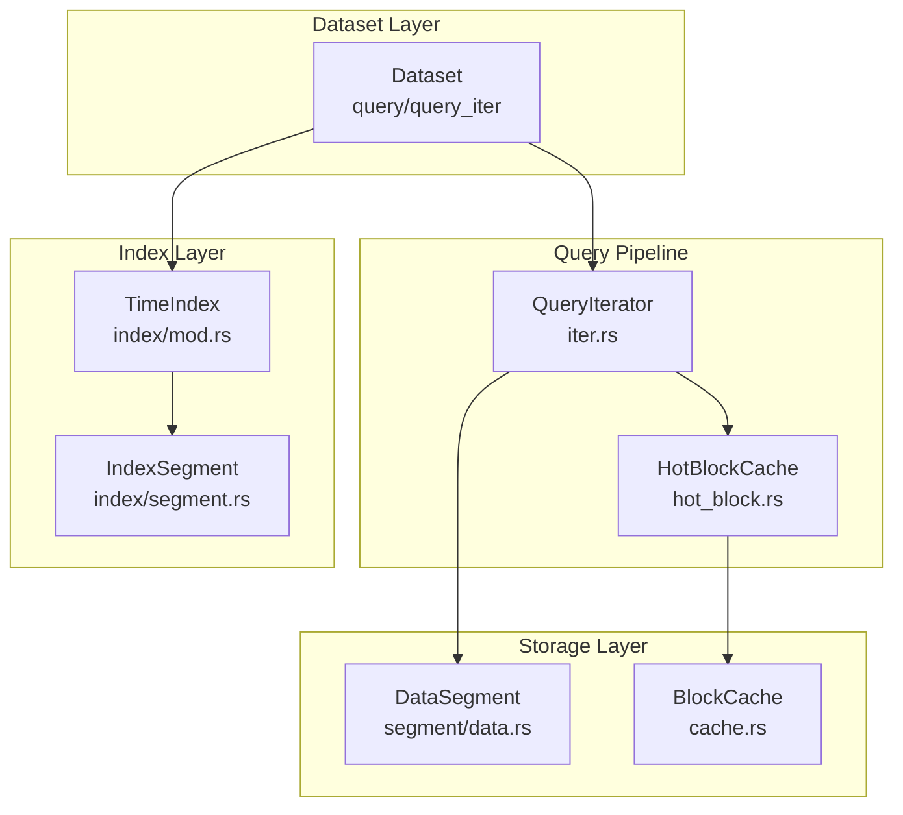
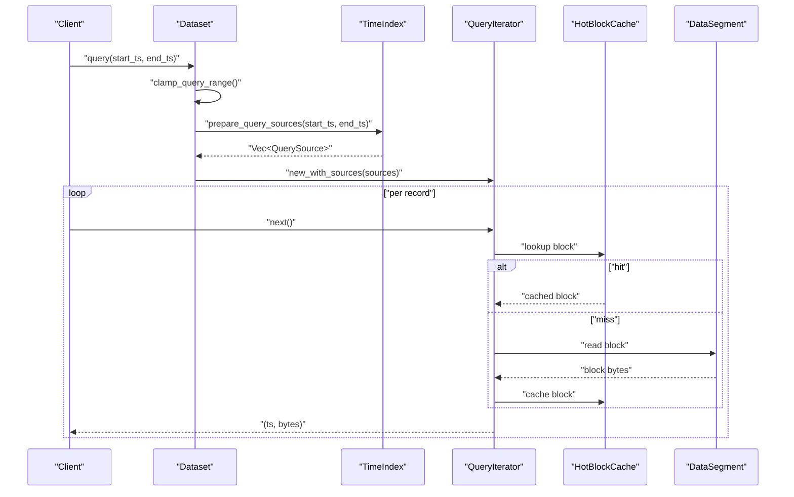
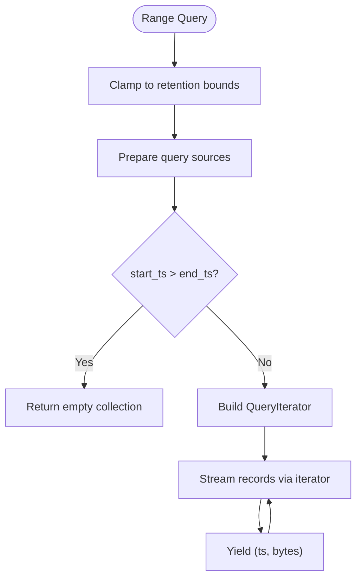
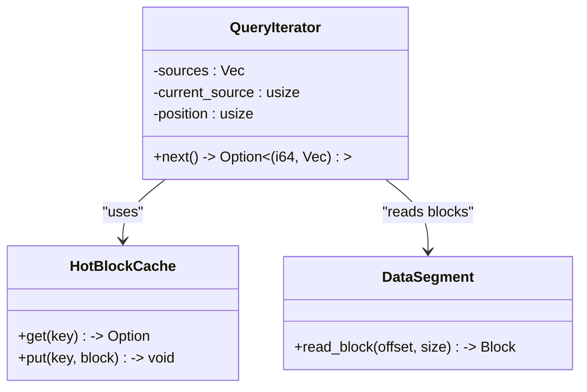
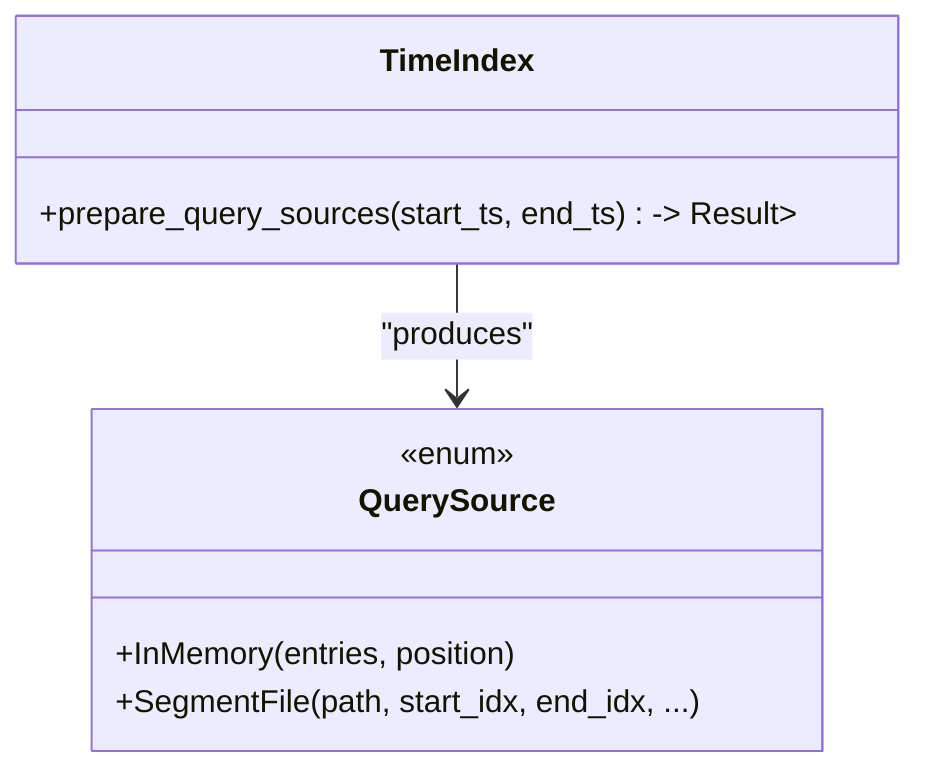
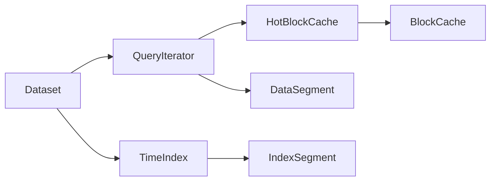

# Read Operations

<cite>
**Referenced Files in This Document**
- [dataset.rs](file://src/dataset.rs)
- [query/mod.rs](file://src/query/mod.rs)
- [query/iter.rs](file://src/query/iter.rs)
- [query/hot_block.rs](file://src/query/hot_block.rs)
- [index/mod.rs](file://src/index/mod.rs)
- [index/segment.rs](file://src/index/segment.rs)
- [cache.rs](file://src/cache.rs)
- [segment/data.rs](file://src/segment/data.rs)
- [ffi.rs](file://src/ffi.rs)
- [query_test.rs](file://tests/query_test.rs)
- [design/query-iterator.md](file://docs/design/query-iterator.md)
</cite>

## Table of Contents
1. [Introduction](#introduction)
2. [Project Structure](#project-structure)
3. [Core Components](#core-components)
4. [Architecture Overview](#architecture-overview)
5. [Detailed Component Analysis](#detailed-component-analysis)
6. [Dependency Analysis](#dependency-analysis)
7. [Performance Considerations](#performance-considerations)
8. [Troubleshooting Guide](#troubleshooting-guide)
9. [Conclusion](#conclusion)
10. [Appendices](#appendices)

## Introduction
This document explains TimSLite’s read operation capabilities with a focus on:
- Single timestamp reads and optimal lookup performance
- Range query operations including time window filtering, result ordering, and pagination strategies
- Batch read operations and streaming patterns
- Query optimization techniques such as index traversal, lazy evaluation, and memory-efficient iteration
- Performance characteristics, result formatting options, and integration with downstream processing pipelines

The goal is to help users select the right read pattern for their analytical workloads and optimize query performance using TimSLite’s internal mechanisms.

## Project Structure
TimSLite organizes read operations around a dataset-centric API with a query iterator pipeline. Key modules involved in reads:
- Dataset: exposes query APIs and orchestrates index preparation and data retrieval
- Query: provides the iterator abstraction and hot block caching
- Index: manages time-based index segments and source preparation
- Cache: provides block-level caching for hot data reuse
- Segment: handles low-level data segment access
- FFI: enables streaming consumption from external languages

**Diagram sources**
- [dataset.rs](file://src/dataset.rs)
- [query/iter.rs](file://src/query/iter.rs)
- [query/hot_block.rs](file://src/query/hot_block.rs)
- [index/mod.rs](file://src/index/mod.rs)
- [index/segment.rs](file://src/index/segment.rs)
- [segment/data.rs](file://src/segment/data.rs)
- [cache.rs](file://src/cache.rs)

**Section sources**
- [dataset.rs](file://src/dataset.rs)
- [query/mod.rs](file://src/query/mod.rs)
- [query/iter.rs](file://src/query/iter.rs)
- [index/mod.rs](file://src/index/mod.rs)
- [index/segment.rs](file://src/index/segment.rs)
- [segment/data.rs](file://src/segment/data.rs)
- [cache.rs](file://src/cache.rs)

## Core Components
- Dataset query APIs:
  - Range query returning collected results
  - Range query returning a lazy iterator for streaming consumption
  - Index entry enumeration for advanced planning and diagnostics
- Query iterator:
  - Drives index traversal and record retrieval
  - Supports hot block caching for repeated access to nearby blocks
- Index preparation:
  - Builds query sources across in-memory and persisted segments
  - Ensures ordered traversal and skip of filler/deleted entries
- Caching:
  - Hot block cache reduces repeated IO for nearby records
  - Optional external block cache integration

Key entry points and responsibilities:
- Range query: clamps the requested time window, prepares sources via the time index, and returns either a collected vector or a streaming iterator
- Iterator consumption: advances through prepared sources, skipping sentinel entries, and yields timestamped records

**Section sources**
- [dataset.rs](file://src/dataset.rs)
- [query/iter.rs](file://src/query/iter.rs)
- [index/mod.rs](file://src/index/mod.rs)
- [index/segment.rs](file://src/index/segment.rs)
- [query/hot_block.rs](file://src/query/hot_block.rs)
- [cache.rs](file://src/cache.rs)

## Architecture Overview
The read pipeline transforms a time window into a sequence of index entries and then materializes records on demand. The design emphasizes lazy evaluation and minimal memory footprint.

**Diagram sources**
- [dataset.rs](file://src/dataset.rs)
- [query/iter.rs](file://src/query/iter.rs)
- [query/hot_block.rs](file://src/query/hot_block.rs)
- [segment/data.rs](file://src/segment/data.rs)
- [index/mod.rs](file://src/index/mod.rs)

## Detailed Component Analysis

### Range Query API
- Purpose: Retrieve records within a closed time window [start_ts, end_ts]
- Behavior:
  - Clamps the query range to retention bounds
  - Prepares sources across in-memory and persisted segments
  - Returns either a collected vector of timestamped records or a streaming iterator
- Ordering: Results are yielded in ascending timestamp order via the iterator
- Pagination: Use the iterator to stream results and stop early when the downstream consumer has sufficient data

**Diagram sources**
- [dataset.rs](file://src/dataset.rs)
- [query/iter.rs](file://src/query/iter.rs)

**Section sources**
- [dataset.rs](file://src/dataset.rs)
- [query/iter.rs](file://src/query/iter.rs)

### QueryIterator Internals
- Responsibilities:
  - Traverse prepared QuerySource instances
  - Skip filler/deleted entries at the index level
  - Resolve records from data segments
  - Integrate hot block caching for locality
- Streaming model:
  - Consumed incrementally to avoid loading all results into memory
  - Suitable for downstream processing pipelines that consume records progressively

**Diagram sources**
- [query/iter.rs](file://src/query/iter.rs)
- [query/hot_block.rs](file://src/query/hot_block.rs)
- [segment/data.rs](file://src/segment/data.rs)

**Section sources**
- [query/iter.rs](file://src/query/iter.rs)
- [query/hot_block.rs](file://src/query/hot_block.rs)
- [segment/data.rs](file://src/segment/data.rs)

### Index Preparation and QuerySources
- TimeIndex builds a list of QuerySource objects representing:
  - In-memory entries (already flushed)
  - Open segment ranges
  - Closed segment ranges (temporarily opened)
- QuerySource encapsulates:
  - Segment path and positional bounds
  - Timestamp anchors for efficient traversal
- Benefits:
  - Minimizes IO by visiting only relevant segments
  - Maintains sorted order for predictable iteration

**Diagram sources**
- [index/mod.rs](file://src/index/mod.rs)
- [index/segment.rs](file://src/index/segment.rs)
- [design/query-iterator.md](file://docs/design/query-iterator.md)

**Section sources**
- [index/mod.rs](file://src/index/mod.rs)
- [index/segment.rs](file://src/index/segment.rs)
- [design/query-iterator.md](file://docs/design/query-iterator.md)

### Single Timestamp Reads
- Approach:
  - Issue a range query with identical start and end timestamps
  - Consume the iterator until the first record or return empty if none exists
- Performance:
  - Leverages the same index traversal and hot block caching
  - Minimal overhead compared to scanning entire windows
- Practical note:
  - If exact timestamp existence is critical, compare the first yielded timestamp to the requested value

**Section sources**
- [dataset.rs](file://src/dataset.rs)
- [query/iter.rs](file://src/query/iter.rs)
- [design/query-iterator.md](file://docs/design/query-iterator.md)

### Latest Timestamp Reads
- Approach:
  - Use the dataset’s latest timestamp capability to bound the upper end of a backward-looking window
  - Combine with forward iteration to retrieve recent records efficiently
- Integration:
  - Pair with the iterator to stream the most recent entries without loading all history

**Section sources**
- [dataset.rs](file://src/dataset.rs)
- [query/iter.rs](file://src/query/iter.rs)

### Batch Reads and Streaming Patterns
- Collected batch:
  - Use the range query that returns a vector of timestamped records
  - Best for small-to-medium windows or when downstream expects a bounded set
- Streaming batch:
  - Use the iterator to process records progressively
  - Ideal for large windows or continuous analytics pipelines
- Pagination:
  - Stop iteration after N records or when a condition is met
  - Resume by adjusting the start timestamp for the next window

**Section sources**
- [dataset.rs](file://src/dataset.rs)
- [query/iter.rs](file://src/query/iter.rs)

### Result Formatting Options
- Record representation:
  - Each returned item is a tuple of timestamp and raw bytes
  - Downstream consumers can parse the bytes according to their schema
- Ordering guarantees:
  - Records are yielded in ascending timestamp order
- Filtering:
  - Filler/deleted entries are automatically skipped during iteration

**Section sources**
- [dataset.rs](file://src/dataset.rs)
- [query/iter.rs](file://src/query/iter.rs)

### Integration with Downstream Pipelines
- Streaming:
  - Use the iterator to feed analytics engines, log processors, or real-time dashboards
- Chunked processing:
  - Apply pagination to limit per-batch memory usage
- FFI support:
  - The FFI layer exposes iterator-like consumption for non-Rust environments

**Section sources**
- [ffi.rs](file://src/ffi.rs)
- [query/iter.rs](file://src/query/iter.rs)

## Dependency Analysis
The read pipeline exhibits clear layering and low coupling:
- Dataset depends on TimeIndex and QueryIterator
- QueryIterator depends on HotBlockCache and DataSegment
- HotBlockCache integrates with BlockCache for persistence
- Index modules provide source preparation without exposing storage internals

**Diagram sources**
- [dataset.rs](file://src/dataset.rs)
- [query/iter.rs](file://src/query/iter.rs)
- [query/hot_block.rs](file://src/query/hot_block.rs)
- [cache.rs](file://src/cache.rs)
- [segment/data.rs](file://src/segment/data.rs)
- [index/mod.rs](file://src/index/mod.rs)
- [index/segment.rs](file://src/index/segment.rs)

**Section sources**
- [dataset.rs](file://src/dataset.rs)
- [query/iter.rs](file://src/query/iter.rs)
- [query/hot_block.rs](file://src/query/hot_block.rs)
- [cache.rs](file://src/cache.rs)
- [segment/data.rs](file://src/segment/data.rs)
- [index/mod.rs](file://src/index/mod.rs)
- [index/segment.rs](file://src/index/segment.rs)

## Performance Considerations
- Index traversal:
  - Query sources limit IO to relevant segments, reducing scan overhead
- Lazy evaluation:
  - Iterator avoids materializing all results at once, lowering peak memory
- Hot block caching:
  - Reuses recently accessed blocks to minimize disk reads for locality
- Memory efficiency:
  - Streaming consumption keeps memory usage proportional to batch size, not window size
- Result formatting:
  - Returning raw bytes avoids unnecessary parsing until downstream needs structured data

[No sources needed since this section provides general guidance]

## Troubleshooting Guide
- Empty results:
  - Verify the requested time window against retention bounds
  - Confirm that the dataset contains data within the queried range
- Slow queries:
  - Prefer the iterator for large windows
  - Ensure hot block caching is effective by accessing nearby timestamps
- Unexpected ordering:
  - Range queries yield ascending timestamps; if reverse order is needed, apply post-processing or adjust the query window
- FFI consumption:
  - Use the FFI interface to integrate with non-Rust pipelines and manage resource lifetimes properly

**Section sources**
- [dataset.rs](file://src/dataset.rs)
- [query/iter.rs](file://src/query/iter.rs)
- [query_test.rs](file://tests/query_test.rs)

## Conclusion
TimSLite’s read operations combine precise index-driven traversal with lazy, streaming consumption and hot block caching to deliver efficient, memory-conscious access to time-series data. Choose the iterator for continuous or large-scale analytics, and the collected batch for bounded scenarios. Optimize by leveraging index preparation, minimizing IO through targeted windows, and integrating with downstream pipelines via streaming or FFI.

[No sources needed since this section summarizes without analyzing specific files]

## Appendices

### Practical Examples and Workflows
- Small-range iteration:
  - Open a dataset, issue a range query, and iterate to validate timestamps within bounds
- Backward pagination:
  - Determine the latest timestamp, define a window, and consume records until reaching a desired count or condition
- FFI integration:
  - Use the FFI layer to consume records in external environments while maintaining streaming semantics

**Section sources**
- [query_test.rs](file://tests/query_test.rs)
- [dataset.rs](file://src/dataset.rs)
- [query/iter.rs](file://src/query/iter.rs)
- [ffi.rs](file://src/ffi.rs)