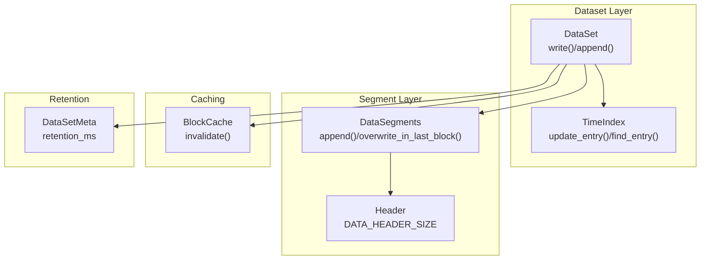
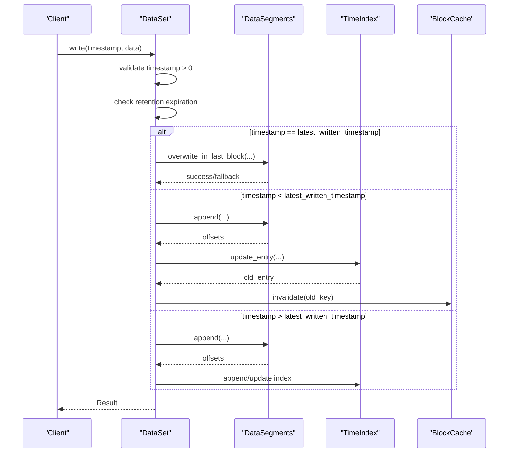
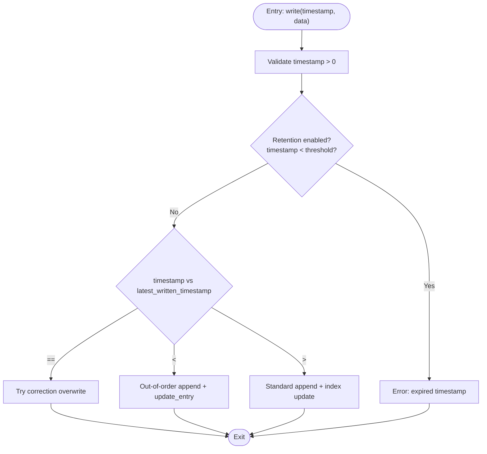
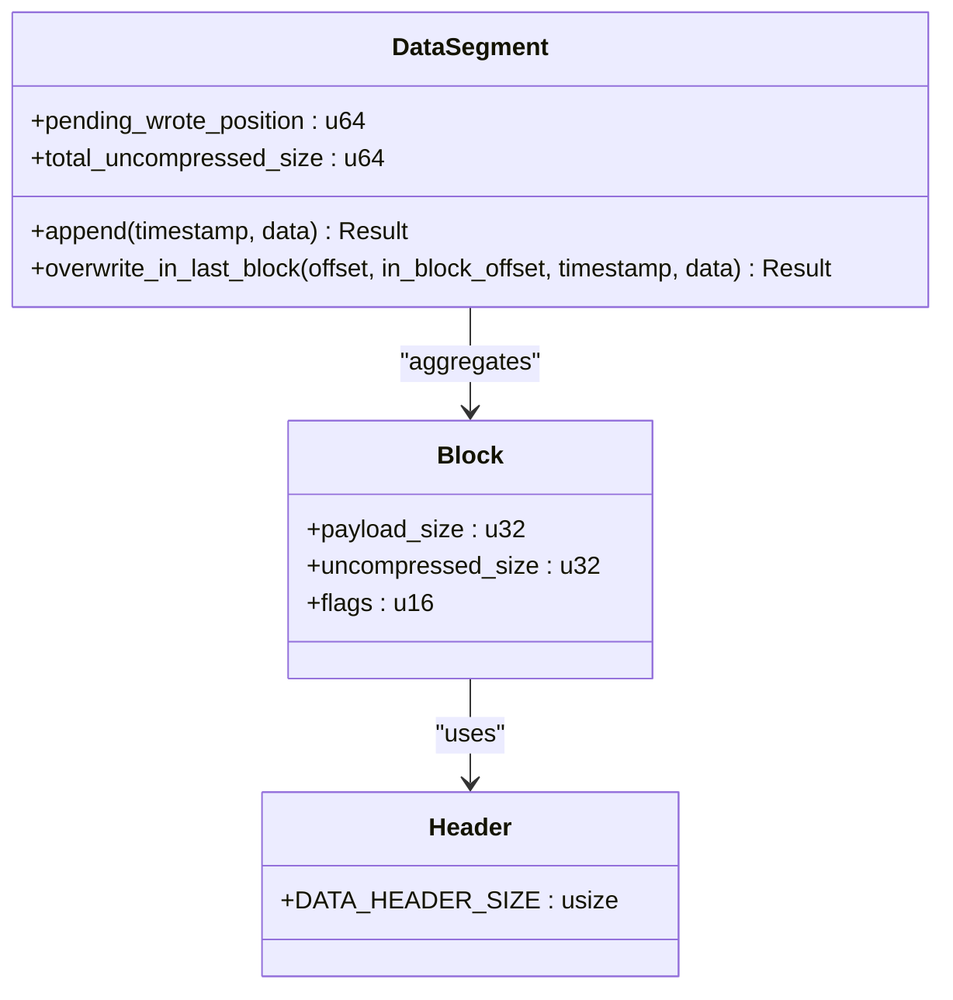
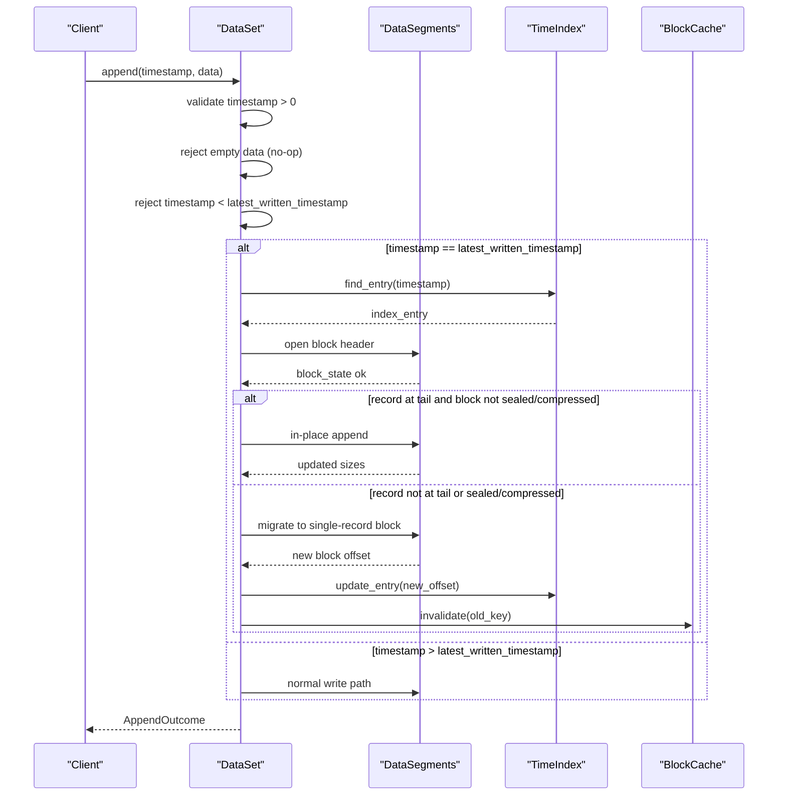
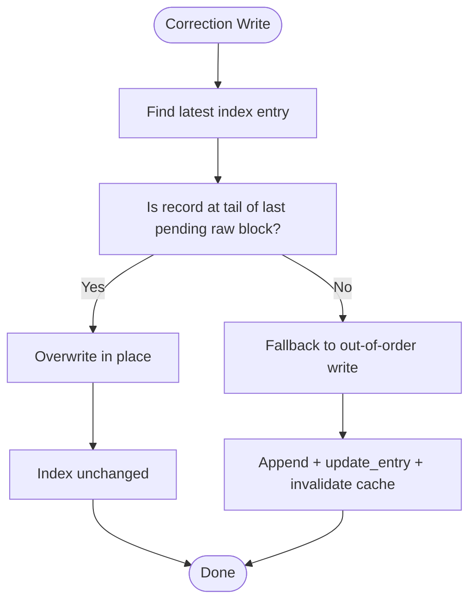
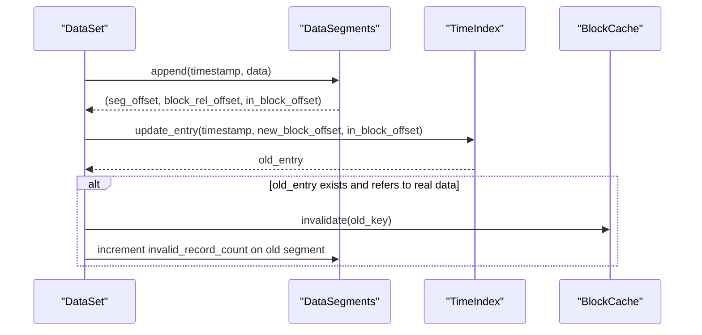
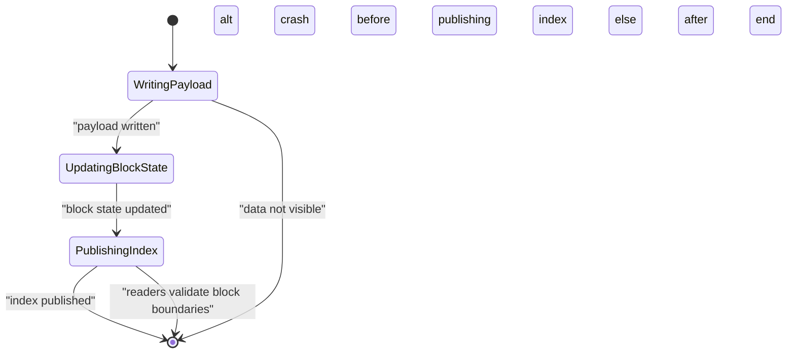
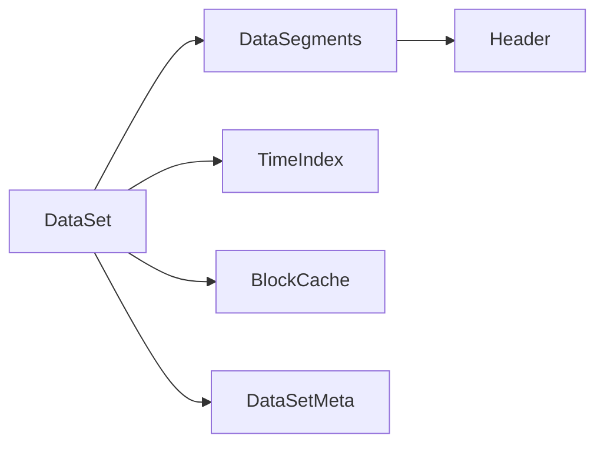

# Write Operations

<cite>
**Referenced Files in This Document**
- [dataset.rs](file://src/dataset.rs)
- [segment/mod.rs](file://src/segment/mod.rs)
- [segment/data.rs](file://src/segment/data.rs)
- [index/mod.rs](file://src/index/mod.rs)
- [index/segment.rs](file://src/index/segment.rs)
- [cache.rs](file://src/cache.rs)
- [header.rs](file://src/header.rs)
- [meta.rs](file://src/meta.rs)
- [error.rs](file://src/error.rs)
- [dataset-operations.md](file://docs/design/dataset-operations.md)
- [phase-16-data-retention.md](file://docs/plan/phase-16-data-retention.md)
- [correction_write_test.rs](file://tests/correction_write_test.rs)
- [out_of_order_delete_test.rs](file://tests/out_of_order_delete_test.rs)
- [query_test.rs](file://tests/query_test.rs)
</cite>

## Table of Contents
1. [Introduction](#introduction)
2. [Project Structure](#project-structure)
3. [Core Components](#core-components)
4. [Architecture Overview](#architecture-overview)
5. [Detailed Component Analysis](#detailed-component-analysis)
6. [Dependency Analysis](#dependency-analysis)
7. [Performance Considerations](#performance-considerations)
8. [Troubleshooting Guide](#troubleshooting-guide)
9. [Conclusion](#conclusion)
10. [Appendices](#appendices)

## Introduction
This document explains TimSLite’s write operation model with a focus on correctness, performance, and robustness. It covers:
- Timestamp validation and write branching
- Data serialization and block-level aggregation
- Standard writes, append operations, and correction writes
- Out-of-order writes and data quality improvements
- Transaction semantics, atomicity guarantees, and rollback mechanisms
- Error handling, conflict resolution, and consistency checks
- Practical patterns, performance characteristics, and optimization techniques

## Project Structure
TimSLite organizes write-related logic around the dataset abstraction, which coordinates:
- Data segmentation and block-level writes
- Time index updates
- Cache invalidation for correctness
- Retention and expiration checks

**Diagram sources**
- [dataset.rs](file://src/dataset.rs)
- [index/mod.rs](file://src/index/mod.rs)
- [index/segment.rs](file://src/index/segment.rs)
- [segment/mod.rs](file://src/segment/mod.rs)
- [header.rs](file://src/header.rs)
- [meta.rs](file://src/meta.rs)
- [cache.rs](file://src/cache.rs)

**Section sources**
- [dataset.rs](file://src/dataset.rs)
- [dataset-operations.md](file://docs/design/dataset-operations.md)

## Core Components
- DataSet: Orchestrates write/append, validates timestamps, applies retention rules, and manages index updates and cache invalidation.
- DataSegments: Manages block-level appends and correction overwrites in the latest pending segment.
- TimeIndex: Maintains per-timestamp metadata and supports updates and sparse continuous mode entries.
- BlockCache: Enforces cache correctness by invalidating entries affected by correction/out-of-order writes.
- DataSetMeta: Stores retention policy and expiration thresholds.

**Section sources**
- [dataset.rs](file://src/dataset.rs)
- [segment/mod.rs](file://src/segment/mod.rs)
- [index/mod.rs](file://src/index/mod.rs)
- [cache.rs](file://src/cache.rs)
- [meta.rs](file://src/meta.rs)

## Architecture Overview
The write pipeline integrates timestamp validation, retention checks, branch selection (standard, correction, out-of-order, append), and index updates. It ensures correctness via cache invalidation and maintains performance via block-level aggregation and optional single-record blocks for large data.

**Diagram sources**
- [dataset.rs](file://src/dataset.rs)
- [segment/mod.rs](file://src/segment/mod.rs)
- [index/mod.rs](file://src/index/mod.rs)
- [cache.rs](file://src/cache.rs)

## Detailed Component Analysis

### Timestamp Validation and Write Branching
- Reject non-positive timestamps early.
- Apply retention window checks to prevent writing expired data.
- Branch by comparison against latest_written_timestamp:
  - Correction write: same timestamp as latest and eligible for in-place overwrite in the latest pending raw block.
  - Out-of-order write: older timestamp; appends to latest segment and updates index in place.
  - Standard write: newer timestamp; normal append and index update.

**Diagram sources**
- [dataset.rs](file://src/dataset.rs)
- [dataset-operations.md](file://docs/design/dataset-operations.md)

**Section sources**
- [dataset.rs](file://src/dataset.rs)
- [dataset-operations.md](file://docs/design/dataset-operations.md)
- [phase-16-data-retention.md](file://docs/plan/phase-16-data-retention.md)

### Data Serialization and Block-Level Aggregation
- Records are serialized into blocks with a fixed-size header and variable-length payload.
- Blocks are aggregated until capacity; oversized records are placed in dedicated single-record blocks.
- Payload size and uncompressed sizes are tracked per block and segment to support compression and query.

**Diagram sources**
- [segment/mod.rs](file://src/segment/mod.rs)
- [segment/data.rs](file://src/segment/data.rs)
- [header.rs](file://src/header.rs)

**Section sources**
- [segment/mod.rs](file://src/segment/mod.rs)
- [segment/data.rs](file://src/segment/data.rs)
- [header.rs](file://src/header.rs)

### Append Operations for Sequential Data Insertion
- Append is a separate API that extends the latest record in place when the timestamp equals latest_written_timestamp.
- Validates that the target record is at the tail of the latest pending raw block and that the block is not sealed or compressed.
- Supports two outcomes:
  - In-place append: updates record length and block payload/uncompressed sizes.
  - Migration to a single-record block: when the combined size exceeds a soft cap, moves the record to a dedicated block and updates the index.

**Diagram sources**
- [dataset.rs](file://src/dataset.rs)
- [segment/mod.rs](file://src/segment/mod.rs)
- [index/mod.rs](file://src/index/mod.rs)
- [cache.rs](file://src/cache.rs)

**Section sources**
- [dataset.rs](file://src/dataset.rs)
- [dataset-operations.md](file://docs/design/dataset-operations.md)

### Correction Writes for Out-of-Order Data and Data Quality
- Correction write allows in-place overwrite at the latest timestamp when conditions are met:
  - Target record is the last record in the last pending raw block.
  - Block is not sealed or compressed.
- On failure, the system falls back to out-of-order write semantics, preserving atomicity boundaries and updating invalid_record_count on the old segment.

**Diagram sources**
- [dataset.rs](file://src/dataset.rs)
- [segment/mod.rs](file://src/segment/mod.rs)

**Section sources**
- [dataset.rs](file://src/dataset.rs)
- [segment/mod.rs](file://src/segment/mod.rs)
- [correction_write_test.rs](file://tests/correction_write_test.rs)

### Out-of-Order Writes and Data Quality Improvements
- Older timestamps trigger out-of-order writes:
  - Append to latest segment and update the index entry in place.
  - If the old entry referenced real data, increment invalid_record_count on the old segment and invalidate the corresponding cache key.
- Continuous mode supports sparse filler creation and logical hole materialization on demand.

**Diagram sources**
- [dataset.rs](file://src/dataset.rs)
- [index/mod.rs](file://src/index/mod.rs)
- [cache.rs](file://src/cache.rs)

**Section sources**
- [dataset.rs](file://src/dataset.rs)
- [index/mod.rs](file://src/index/mod.rs)
- [out_of_order_delete_test.rs](file://tests/out_of_order_delete_test.rs)

### Transaction Semantics, Atomicity Guarantees, and Rollback Mechanisms
- No ACID transactions: the system prioritizes high throughput with eventual consistency and crash-safe durability boundaries.
- Publish order:
  - Payload written first
  - Block header/state updated second
  - Index updated third (only visible after successful index update)
- Crash-safety constraints:
  - If index update fails, reads will not see partial data.
  - If index update succeeds but data is incomplete, read paths validate block boundaries and record timestamps to avoid returning stale or corrupted data.
- Rollback:
  - Not provided. Instead, correction writes and out-of-order writes maintain correctness by invalidating caches and marking records as invalid on the old segment.

**Diagram sources**
- [dataset-operations.md](file://docs/design/dataset-operations.md)
- [segment/mod.rs](file://src/segment/mod.rs)
- [index/mod.rs](file://src/index/mod.rs)

**Section sources**
- [dataset-operations.md](file://docs/design/dataset-operations.md)

### Error Handling Strategies, Conflict Resolution, and Consistency Checks
- Timestamp errors: rejects zero/negative timestamps and expired timestamps under retention policies.
- Block constraints: prevents appending to sealed/compressed blocks and ensures records are appended at the tail of the latest pending raw block.
- Conflict resolution:
  - Correction write fallback to out-of-order write when in-place overwrite is not possible.
  - Out-of-order write increments invalid_record_count on the old segment and invalidates cache keys.
- Consistency checks:
  - Read paths validate block boundaries and record timestamps to avoid returning corrupted data after crashes.

**Section sources**
- [dataset.rs](file://src/dataset.rs)
- [segment/mod.rs](file://src/segment/mod.rs)
- [error.rs](file://src/error.rs)
- [query_test.rs](file://tests/query_test.rs)

## Dependency Analysis
The write path depends on:
- DataSet orchestrator
- DataSegments for block-level operations
- TimeIndex for metadata updates
- BlockCache for correctness
- DataSetMeta for retention

**Diagram sources**
- [dataset.rs](file://src/dataset.rs)
- [segment/mod.rs](file://src/segment/mod.rs)
- [index/mod.rs](file://src/index/mod.rs)
- [cache.rs](file://src/cache.rs)
- [meta.rs](file://src/meta.rs)
- [header.rs](file://src/header.rs)

**Section sources**
- [dataset.rs](file://src/dataset.rs)
- [segment/mod.rs](file://src/segment/mod.rs)
- [index/mod.rs](file://src/index/mod.rs)
- [cache.rs](file://src/cache.rs)
- [meta.rs](file://src/meta.rs)
- [header.rs](file://src/header.rs)

## Performance Considerations
- Prefer correction writes for latest timestamp to avoid index churn and cache misses.
- Use append for sequential ingestion at the latest timestamp to minimize fragmentation and leverage in-place growth.
- Large records exceeding block capacity are moved to single-record blocks; batching similar-sized records reduces migrations.
- Out-of-order writes increase invalid_record_count on the old segment; batch writes to reduce fragmentation.
- Cache invalidation occurs on correction/out-of-order updates; avoid frequent corrections to minimize cache thrash.

[No sources needed since this section provides general guidance]

## Troubleshooting Guide
Common issues and resolutions:
- Timestamp rejected: Ensure timestamps are positive and within retention windows.
- Append fails at tail: Verify the record is at the tail of the latest pending raw block and the block is not sealed/compressed.
- Correction write fallback: Occurs when the target block is sealed/compressed; expect out-of-order semantics and cache invalidation.
- Out-of-order write errors: In non-continuous mode, an existing index entry is required for older timestamps.

**Section sources**
- [dataset.rs](file://src/dataset.rs)
- [segment/mod.rs](file://src/segment/mod.rs)
- [correction_write_test.rs](file://tests/correction_write_test.rs)
- [out_of_order_delete_test.rs](file://tests/out_of_order_delete_test.rs)

## Conclusion
TimSLite’s write model balances performance and correctness through careful timestamp validation, block-level aggregation, targeted correction writes, and robust out-of-order handling. While not transactional, the publish order and read-time validations ensure durable, consistent behavior. Use correction writes for latest-timestamp updates, append for sequential ingestion, and batch writes to optimize performance and reduce fragmentation.

[No sources needed since this section summarizes without analyzing specific files]

## Appendices

### Practical Write Patterns and Optimization Techniques
- Latest-timestamp correction: Use correction writes to overwrite the latest record in place when eligible.
- Sequential ingestion: Use append at the latest timestamp to grow records in place and reduce fragmentation.
- Batch writes: Group records by timestamp to minimize index updates and cache invalidations.
- Large records: Allow single-record blocks for oversized data; avoid frequent resizes to reduce migrations.
- Out-of-order ingestion: Accept older timestamps with out-of-order writes; monitor invalid_record_count for diagnostics.

[No sources needed since this section provides general guidance]