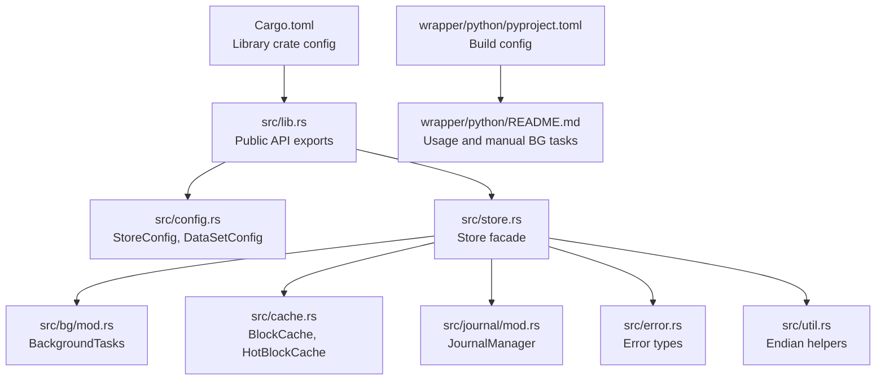
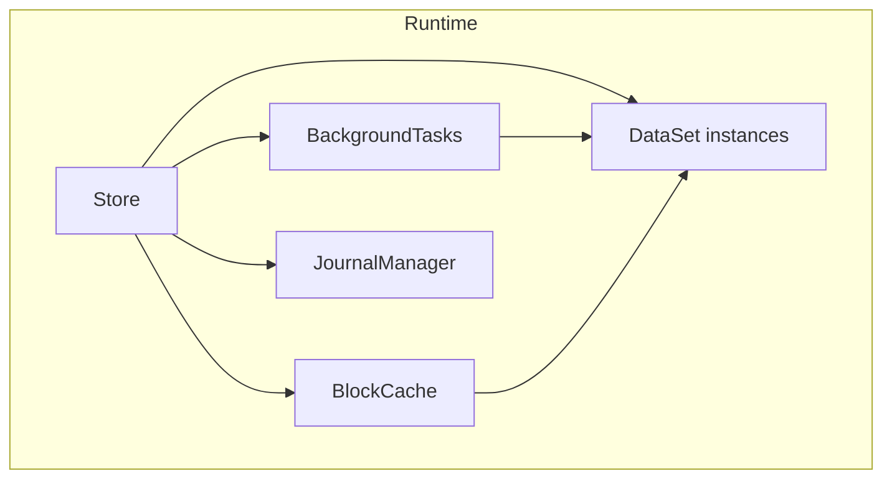
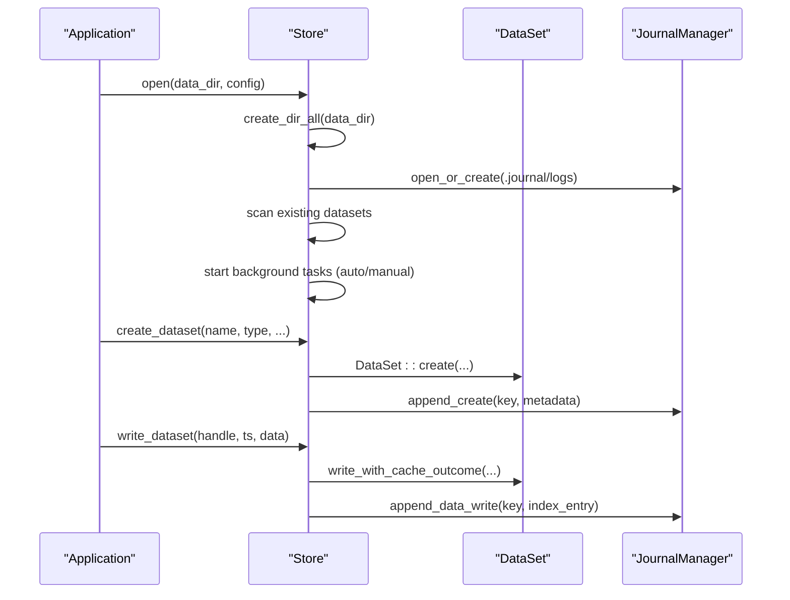
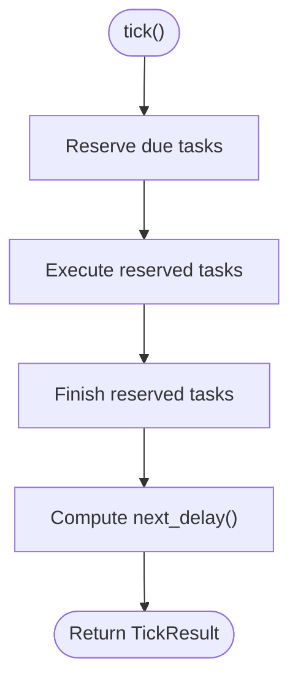
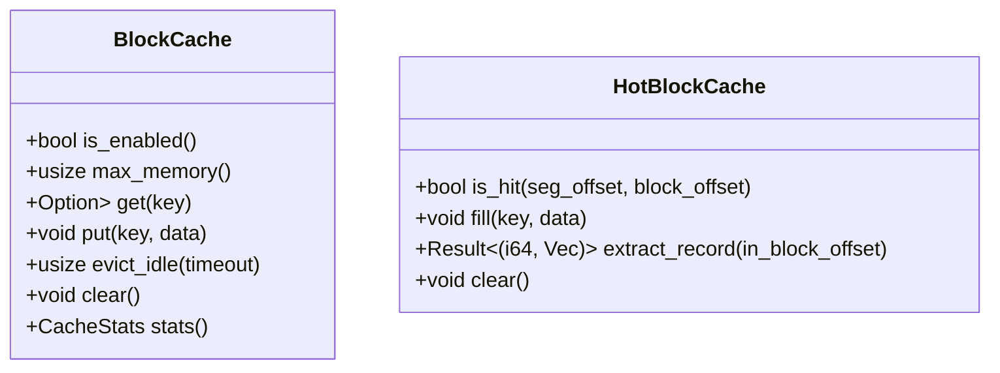
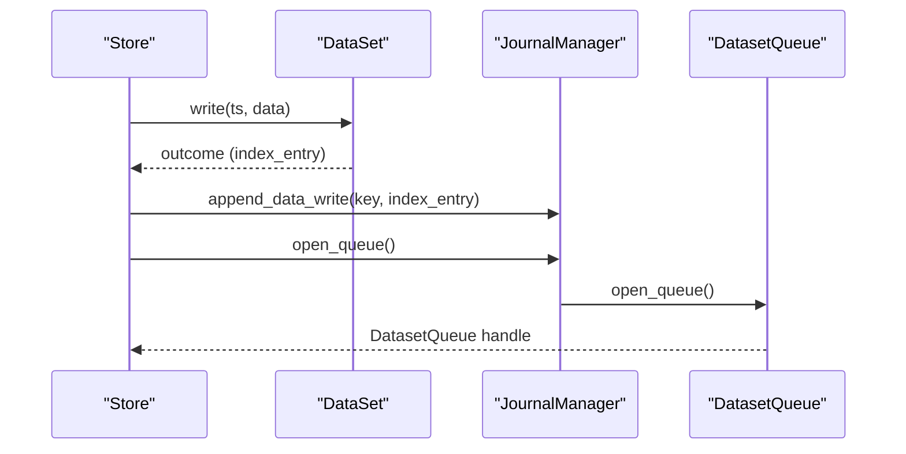
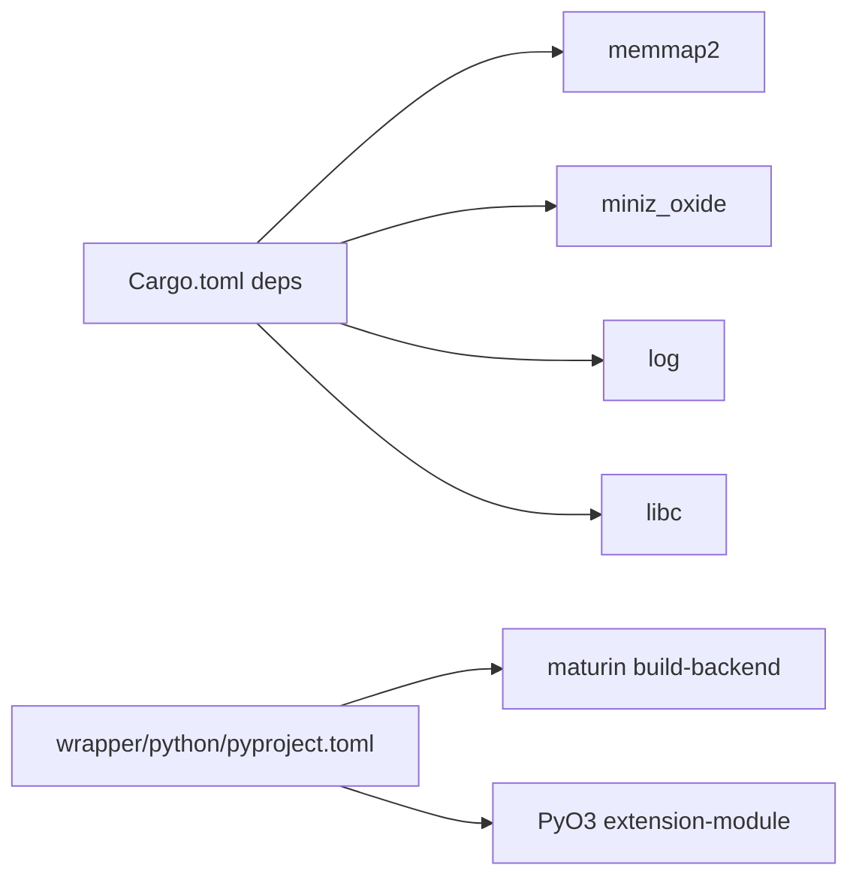

# Deployment and Operations

<cite>
**Referenced Files in This Document**
- [Cargo.toml](file://Cargo.toml)
- [design.md](file://design.md)
- [plan.md](file://plan.md)
- [src/lib.rs](file://src/lib.rs)
- [src/config.rs](file://src/config.rs)
- [src/store.rs](file://src/store.rs)
- [src/bg/mod.rs](file://src/bg/mod.rs)
- [src/journal/mod.rs](file://src/journal/mod.rs)
- [src/error.rs](file://src/error.rs)
- [src/cache.rs](file://src/cache.rs)
- [src/util.rs](file://src/util.rs)
- [wrapper/python/README.md](file://wrapper/python/README.md)
- [wrapper/python/pyproject.toml](file://wrapper/python/pyproject.toml)
</cite>

## Table of Contents
1. [Introduction](#introduction)
2. [Project Structure](#project-structure)
3. [Core Components](#core-components)
4. [Architecture Overview](#architecture-overview)
5. [Detailed Component Analysis](#detailed-component-analysis)
6. [Dependency Analysis](#dependency-analysis)
7. [Performance Considerations](#performance-considerations)
8. [Monitoring and Observability](#monitoring-and-observability)
9. [Maintenance Operations](#maintenance-operations)
10. [Security and Compliance](#security-and-compliance)
11. [Troubleshooting Guide](#troubleshooting-guide)
12. [Disaster Recovery and Capacity Planning](#disaster-recovery-and-capacity-planning)
13. [Operational Best Practices](#operational-best-practices)
14. [Conclusion](#conclusion)

## Introduction
This document provides comprehensive deployment and operations guidance for TimSLite, a high-performance time-series data storage library. It covers production deployment procedures, configuration, environment setup, monitoring, maintenance, troubleshooting, disaster recovery, capacity planning, and operational best practices. The content is derived from the repository’s source code and design documentation to ensure accuracy and traceability.

## Project Structure
TimSLite is organized as a Rust library crate with optional Python bindings. The core library exposes a Store facade, dataset management, background tasks, caching, journaling, and FFI/C interop. The Python wrapper enables Python applications to integrate TimSLite via PyO3/maturin.

**Diagram sources**
- [Cargo.toml:1-18](file://Cargo.toml#L1-L18)
- [src/lib.rs:38-72](file://src/lib.rs#L38-L72)
- [src/config.rs:25-71](file://src/config.rs#L25-L71)
- [src/store.rs:46-56](file://src/store.rs#L46-L56)
- [src/bg/mod.rs:44-54](file://src/bg/mod.rs#L44-L54)
- [src/cache.rs:43-49](file://src/cache.rs#L43-L49)
- [src/journal/mod.rs:321-327](file://src/journal/mod.rs#L321-L327)
- [src/error.rs:6-43](file://src/error.rs#L6-L43)
- [src/util.rs:1-51](file://src/util.rs#L1-L51)
- [wrapper/python/pyproject.toml:1-22](file://wrapper/python/pyproject.toml#L1-L22)
- [wrapper/python/README.md:1-77](file://wrapper/python/README.md#L1-L77)

**Section sources**
- [Cargo.toml:1-18](file://Cargo.toml#L1-L18)
- [src/lib.rs:1-133](file://src/lib.rs#L1-L133)
- [wrapper/python/pyproject.toml:1-22](file://wrapper/python/pyproject.toml#L1-L22)

## Core Components
- Store: Top-level facade managing datasets, background tasks, journal, and caches. It supports dataset lifecycle operations, queue subsystem, and manual background task execution.
- BackgroundTasks: Schedules and executes periodic tasks (flush, idle-close, cache eviction, retention reclaim) in auto or manual mode.
- BlockCache: Global read cache with LRU-like eviction and idle eviction.
- JournalManager: Built-in change log dataset (.journal/logs) enabling audit trails and real-time consumption.
- Config: Centralized configuration for store-level defaults and dataset-level overrides.

Key operational capabilities:
- Automatic or manual background task execution
- Read cache management
- Built-in journal for change tracking
- Queue subsystem for streaming ingestion and consumption
- Data retention and reclaim

**Section sources**
- [src/store.rs:46-161](file://src/store.rs#L46-L161)
- [src/bg/mod.rs:44-220](file://src/bg/mod.rs#L44-L220)
- [src/cache.rs:43-191](file://src/cache.rs#L43-L191)
- [src/journal/mod.rs:321-494](file://src/journal/mod.rs#L321-L494)
- [src/config.rs:25-203](file://src/config.rs#L25-L203)

## Architecture Overview
The system architecture centers on the Store facade coordinating datasets, background tasks, caches, and the journal. Datasets persist data and indices using memory-mapped files. Background tasks maintain system health and performance. The journal provides a read-only dataset for change logs.

**Diagram sources**
- [src/store.rs:46-161](file://src/store.rs#L46-L161)
- [src/bg/mod.rs:44-134](file://src/bg/mod.rs#L44-L134)
- [src/cache.rs:43-63](file://src/cache.rs#L43-L63)
- [src/journal/mod.rs:321-357](file://src/journal/mod.rs#L321-L357)

## Detailed Component Analysis

### Store and Lifecycle Management
- Opening a Store initializes directories, scans existing datasets, sets up the journal, and starts background tasks (auto or manual).
- Dataset lifecycle: create, open, close, drop; handles ensure safe access and prevent misuse of internal resources.
- Journal hooks: create, drop, write, delete, append operations are recorded in the built-in journal dataset.

**Diagram sources**
- [src/store.rs:60-161](file://src/store.rs#L60-L161)
- [src/store.rs:167-226](file://src/store.rs#L167-L226)
- [src/store.rs:400-431](file://src/store.rs#L400-L431)
- [src/journal/mod.rs:404-430](file://src/journal/mod.rs#L404-L430)

**Section sources**
- [src/store.rs:60-161](file://src/store.rs#L60-L161)
- [src/store.rs:167-226](file://src/store.rs#L167-L226)
- [src/store.rs:400-431](file://src/store.rs#L400-L431)
- [src/journal/mod.rs:329-357](file://src/journal/mod.rs#L329-L357)

### Background Task Scheduler
- Modes: auto (threaded) or manual (caller-driven).
- Tasks: flush, idle-check, cache eviction, retention reclaim.
- Scheduling: per-task intervals and UTC-based daily retention target.

**Diagram sources**
- [src/bg/mod.rs:194-203](file://src/bg/mod.rs#L194-L203)
- [src/bg/mod.rs:250-284](file://src/bg/mod.rs#L250-L284)
- [src/bg/mod.rs:286-318](file://src/bg/mod.rs#L286-L318)
- [src/bg/mod.rs:221-248](file://src/bg/mod.rs#L221-L248)

**Section sources**
- [src/bg/mod.rs:103-220](file://src/bg/mod.rs#L103-L220)
- [src/bg/mod.rs:221-248](file://src/bg/mod.rs#L221-L248)

### Caching Strategy
- Global BlockCache: LRU-like eviction and idle eviction; tracks hits/misses and memory usage.
- HotBlockCache: Per-query local cache to avoid cross-query contention.

**Diagram sources**
- [src/cache.rs:43-191](file://src/cache.rs#L43-L191)
- [src/cache.rs:291-359](file://src/cache.rs#L291-L359)

**Section sources**
- [src/cache.rs:43-191](file://src/cache.rs#L43-L191)
- [src/cache.rs:291-359](file://src/cache.rs#L291-L359)

### Journal Change Log
- Built-in dataset .journal/logs records create/drop and data operations.
- Encodes records with TLV fields and maintains monotonically increasing timestamps.

**Diagram sources**
- [src/store.rs:420-431](file://src/store.rs#L420-L431)
- [src/journal/mod.rs:381-402](file://src/journal/mod.rs#L381-L402)
- [src/journal/mod.rs:480-493](file://src/journal/mod.rs#L480-L493)

**Section sources**
- [src/journal/mod.rs:158-310](file://src/journal/mod.rs#L158-L310)
- [src/journal/mod.rs:381-402](file://src/journal/mod.rs#L381-L402)

## Dependency Analysis
- Library dependencies: memmap2, miniz_oxide, log, libc.
- Python packaging: maturin backend, PyO3 extension module.
- Crate exports: Store, StoreConfig, DataSet, Journal types, queue constants, and core constants.

**Diagram sources**
- [Cargo.toml:10-14](file://Cargo.toml#L10-L14)
- [wrapper/python/pyproject.toml:19-21](file://wrapper/python/pyproject.toml#L19-L21)

**Section sources**
- [Cargo.toml:10-14](file://Cargo.toml#L10-L14)
- [wrapper/python/pyproject.toml:19-21](file://wrapper/python/pyproject.toml#L19-L21)

## Performance Considerations
- Background task intervals: tune flush_interval and idle_timeout to balance durability and latency.
- Cache sizing: set cache_max_memory to control memory footprint; idle eviction reduces stale entries.
- Compression: configure compress_level per dataset to trade CPU for storage savings.
- Segment sizing: adjust data_segment_size and index_segment_size to fit workload patterns.
- Manual vs auto background tasks: in constrained environments, disable auto thread and call tick_background_tasks() in application loops.

[No sources needed since this section provides general guidance]

## Monitoring and Observability
- Logging: The library uses the log crate; configure your logging framework to capture info/warn/error messages emitted during store operations and background tasks.
- Journal consumption: Use the built-in journal dataset to stream changes for observability and audit trails.
- Metrics: Expose metrics via your platform’s metrics stack (e.g., Prometheus) by instrumenting application code around Store operations and background tick results.

[No sources needed since this section provides general guidance]

## Maintenance Operations
- Backup and recovery:
  - Back up the data directory containing datasets and the internal journal dataset.
  - For disaster recovery, restore the data directory to a new host and re-open the Store.
- Upgrades:
  - Rebuild the library with updated dependencies and repackage Python bindings if applicable.
  - Validate dataset compatibility post-upgrade by opening datasets and running basic queries.
- Routine maintenance:
  - Monitor disk usage and segment growth; adjust segment sizes and retention windows accordingly.
  - Periodically review background task logs and tune intervals for optimal performance.

[No sources needed since this section provides general guidance]

## Security and Compliance
- Access control: Restrict filesystem permissions on the data directory to trusted processes and users.
- Auditability: Enable the journal to maintain an immutable record of dataset operations.
- Data integrity: Rely on memory-mapped file semantics and checksum-free design; monitor for I/O errors and corruption indicators.

[No sources needed since this section provides general guidance]

## Troubleshooting Guide
Common operational issues and resolutions:
- I/O errors: Inspect underlying OS errors and ensure sufficient disk space and permissions.
- Invalid magic/version: Indicates incompatible or corrupted files; verify file integrity and format version.
- Mmap errors: Check memory mapping limits and available virtual address space.
- Compression/decompression errors: Validate data encoding and retry with corrected inputs.
- Not found/already exists: Verify dataset names and types conform to allowed patterns.
- Expired records: Confirm timestamp falls within retention window; adjust retention settings if needed.
- Segment full: Increase segment size or trigger sealing/new segment via dataset APIs.
- Queue errors: Ensure queue is opened before use and consumer groups are properly managed.

**Section sources**
- [src/error.rs:6-43](file://src/error.rs#L6-L43)

## Disaster Recovery and Capacity Planning
- Disaster recovery:
  - Maintain regular backups of the data directory.
  - Test restoration procedures periodically and validate dataset accessibility after restore.
- Capacity planning:
  - Estimate disk usage based on ingestion rate, retention window, and compression ratio.
  - Plan for peak concurrent queries and adjust cache_max_memory and segment sizes accordingly.

[No sources needed since this section provides general guidance]

## Operational Best Practices
- Environment setup:
  - Use separate data directories per environment (dev/staging/prod).
  - Configure logging levels appropriate for each environment.
- Configuration:
  - Use StoreConfigBuilder and DataSetConfigBuilder to centralize defaults and overrides.
  - Prefer manual background tasks in containerized or event-loop environments.
- Monitoring:
  - Track background task delays and executed counts to detect scheduling issues.
  - Observe cache hit ratios and eviction rates to size caches effectively.

[No sources needed since this section provides general guidance]

## Conclusion
TimSLite offers a robust, memory-mapped time-series storage engine with integrated background maintenance, caching, and a built-in change log. By tuning configuration, monitoring background tasks, and following sound operational practices, teams can deploy TimSLite reliably in production environments. The design and implementation support both automatic and manual operation modes, enabling flexibility across diverse infrastructures.