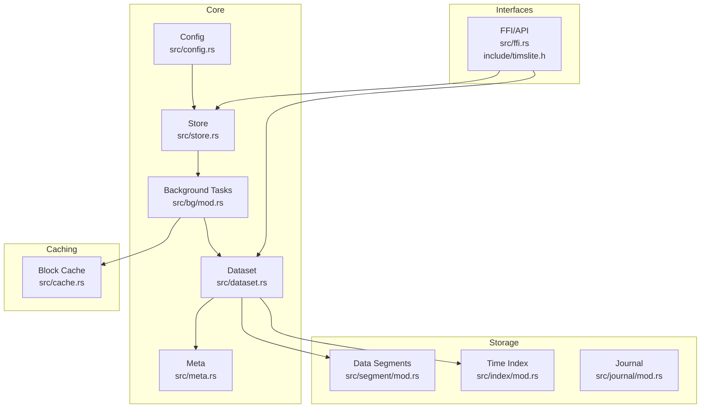
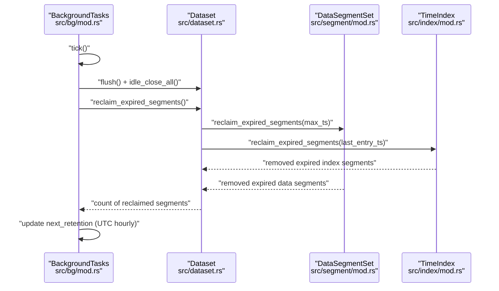
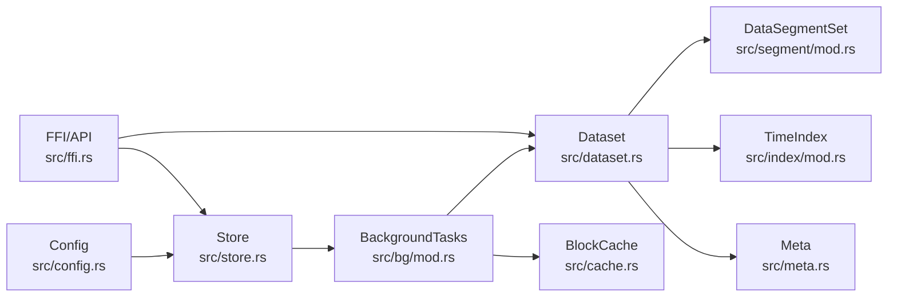

# Maintenance Operations

<cite>
**Referenced Files in This Document**
- [bg/mod.rs](file://src/bg/mod.rs)
- [timslite.h](file://include/timslite.h)
- [background-and-cache.md](file://docs/design/background-and-cache.md)
- [dataset-operations.md](file://docs/design/dataset-operations.md)
- [time-index.md](file://docs/design/time-index.md)
- [phase-16-data-retention.md](file://docs/plan/phase-16-data-retention.md)
- [phase-18-out-of-order-write-and-delete.md](file://docs/plan/phase-18-out-of-order-write-and-delete.md)
- [dataset.rs](file://src/dataset.rs)
- [config.rs](file://src/config.rs)
- [store.rs](file://src/store.rs)
- [cache.rs](file://src/cache.rs)
- [segment/mod.rs](file://src/segment/mod.rs)
- [index/mod.rs](file://src/index/mod.rs)
- [index/segment.rs](file://src/index/segment.rs)
- [ffi.rs](file://src/ffi.rs)
- [meta.rs](file://src/meta.rs)
- [compress.rs](file://src/compress.rs)
- [header.rs](file://src/header.rs)
- [journal/mod.rs](file://src/journal/mod.rs)
- [queue/mod.rs](file://src/queue/mod.rs)
- [query/mod.rs](file://src/query/mod.rs)
- [query/iter.rs](file://src/query/iter.rs)
- [query/hot_block.rs](file://src/query/hot_block.rs)
- [block.rs](file://src/block.rs)
- [util.rs](file://src/util.rs)
- [error.rs](file://src/error.rs)
- [lib.rs](file://src/lib.rs)
- [Cargo.toml](file://Cargo.toml)
</cite>

## Table of Contents
1. [Introduction](#introduction)
2. [Project Structure](#project-structure)
3. [Core Components](#core-components)
4. [Architecture Overview](#architecture-overview)
5. [Detailed Component Analysis](#detailed-component-analysis)
6. [Dependency Analysis](#dependency-analysis)
7. [Performance Considerations](#performance-considerations)
8. [Troubleshooting Guide](#troubleshooting-guide)
9. [Conclusion](#conclusion)
10. [Appendices](#appendices)

## Introduction
This document provides comprehensive maintenance operations guidance for TimSLite. It covers routine maintenance tasks (data compaction, cache management, index optimization, and background task scheduling), retention and lifecycle management, capacity and space reclamation strategies, and operational procedures for upgrades and recovery. The content is derived from the repository’s source code and design documents to ensure accuracy and traceability.

## Project Structure
TimSLite organizes maintenance-critical subsystems into focused modules:
- Background tasks and scheduling: src/bg
- Caching: src/cache
- Data segments and indices: src/segment, src/index
- Datasets and retention: src/dataset
- Configuration and store wiring: src/config, src/store
- FFI and public APIs: include/timslite.h, src/ffi.rs
- Journaling and continuous storage: src/journal
- Query pipeline and hot blocks: src/query
- Compression and headers: src/compress, src/header
- Utilities and errors: src/util, src/error

**Diagram sources**
- [bg/mod.rs:44-120](file://src/bg/mod.rs#L44-L120)
- [dataset.rs:175-204](file://src/dataset.rs#L175-L204)
- [config.rs](file://src/config.rs)
- [store.rs](file://src/store.rs)
- [segment/mod.rs](file://src/segment/mod.rs)
- [index/mod.rs](file://src/index/mod.rs)
- [cache.rs](file://src/cache.rs)
- [ffi.rs](file://src/ffi.rs)
- [timslite.h:95-124](file://include/timslite.h#L95-L124)

**Section sources**
- [lib.rs](file://src/lib.rs)
- [Cargo.toml](file://Cargo.toml)

## Core Components
- Background task manager orchestrates periodic maintenance: flush, idle checks, cache eviction, and retention reclaim. It computes delays and executes tasks based on intervals and thresholds.
- Dataset lifecycle and retention: datasets persist metadata, enforce retention windows, and reclaim expired segments for both data and index.
- Block cache: manages hot blocks and eviction policies to optimize read performance.
- Segment and index management: controls data/index segment sets, idle-close transitions, and reclaim logic.
- FFI and public API: expose synchronous background tick and delay queries for manual orchestration.

**Section sources**
- [bg/mod.rs:44-120](file://src/bg/mod.rs#L44-L120)
- [bg/mod.rs:387-425](file://src/bg/mod.rs#L387-L425)
- [dataset.rs:175-204](file://src/dataset.rs#L175-L204)
- [cache.rs](file://src/cache.rs)
- [segment/mod.rs](file://src/segment/mod.rs)
- [index/mod.rs](file://src/index/mod.rs)
- [index/segment.rs](file://src/index/segment.rs)
- [timslite.h:95-124](file://include/timslite.h#L95-L124)

## Architecture Overview
The maintenance architecture centers on a background executor that periodically evaluates due tasks and acts on datasets and caches. Retention reclaim runs daily at a configured UTC hour, closing datasets, computing expiration thresholds, and removing expired segments for both data and index.

**Diagram sources**
- [bg/mod.rs:387-425](file://src/bg/mod.rs#L387-L425)
- [dataset.rs:175-204](file://src/dataset.rs#L175-L204)
- [segment/mod.rs](file://src/segment/mod.rs)
- [index/mod.rs](file://src/index/mod.rs)
- [time-index.md:203-216](file://docs/design/time-index.md#L203-L216)

## Detailed Component Analysis

### Background Task Scheduling and Execution
- Task types: flush, idle-check, cache eviction, retention reclaim.
- Intervals: fixed intervals for idle-check and cache eviction; retention reclaim scheduled daily at a UTC hour.
- Manual execution API: synchronous tick and next-delay query via FFI.
- Delay computation: computes wait until next task due, saturating at zero.

Operational guidance:
- Monitor executed task counts and next-delay via the FFI APIs.
- Use manual tick for environments where background threads are disabled or require deterministic control.
- Tune intervals and retention hour via configuration to balance maintenance overhead and data lifecycle needs.

**Section sources**
- [bg/mod.rs:98-101](file://src/bg/mod.rs#L98-L101)
- [bg/mod.rs:73-96](file://src/bg/mod.rs#L73-L96)
- [bg/mod.rs:103-120](file://src/bg/mod.rs#L103-L120)
- [bg/mod.rs:576-578](file://src/bg/mod.rs#L576-L578)
- [timslite.h:95-124](file://include/timslite.h#L95-L124)
- [store.rs](file://src/store.rs)
- [config.rs](file://src/config.rs)

### Cache Management
- Block cache eviction runs at fixed intervals; idle timeout governs cache entry lifetime.
- Eviction prevents long-lived cache pollution while preserving hot blocks.
- Cache state and timeouts are configurable and exposed to the background executor.

Operational guidance:
- Adjust cache idle timeout to align with workload access patterns.
- Monitor cache hit rates and eviction frequency to size cache appropriately.
- Ensure sufficient disk space for cache growth during peak workloads.

**Section sources**
- [bg/mod.rs:98-101](file://src/bg/mod.rs#L98-L101)
- [cache.rs](file://src/cache.rs)

### Index Optimization and Retention Reclaim
Retention reclaim is the primary lifecycle operation:
- Daily trigger at a UTC hour; computes next retention instant based on epoch seconds modulo day boundary.
- For each dataset with retention enabled:
  - Close dataset (flush + idle-close-all) to move active segments to closed sets.
  - Compute expiration threshold from latest written timestamp minus retention window.
  - Remove index segments whose last entry timestamp is less than threshold.
  - Remove data segments whose max timestamp is less than threshold.
- Index reclaim reads last-entry timestamps from closed index segments, validates and drops read-only mappings immediately after inspection, then removes files.

Operational guidance:
- Set retention_check_hour to a maintenance-friendly UTC hour.
- Verify that foreground activity does not conflict with retention windows; consider scheduling heavy writes outside the retention window.
- Confirm that continuous mode index behavior aligns with recovery expectations post-reclaim.

**Section sources**
- [bg/mod.rs:73-96](file://src/bg/mod.rs#L73-L96)
- [bg/mod.rs:387-425](file://src/bg/mod.rs#L387-L425)
- [background-and-cache.md:100-150](file://docs/design/background-and-cache.md#L100-L150)
- [time-index.md:203-216](file://docs/design/time-index.md#L203-L216)
- [dataset-operations.md:634-646](file://docs/design/dataset-operations.md#L634-L646)

### Data Compaction
Current status:
- Compaction is not implemented in the current release.
- invalid_record_count exists for diagnostic purposes but does not drive automatic compaction or reclaim decisions.
- Future roadmap includes compaction triggers based on invalid record ratios and batch delete operations.

Operational guidance:
- Expect continued disk usage from non-expired segments containing invalid records until compaction is introduced.
- Plan for future upgrades that may enable compaction-driven space reclamation.

**Section sources**
- [dataset-operations.md:644-646](file://docs/design/dataset-operations.md#L644-L646)
- [phase-18-out-of-order-write-and-delete.md:212-217](file://docs/plan/phase-18-out-of-order-write-and-delete.md#L212-L217)

### Backup and Recovery Procedures
Backup strategies:
- Full system backup: package the store root directory, including datasets, journals, and metadata. Ensure the store is quiescent or use flush/idle-close to stabilize state before copying.
- Incremental backup: copy only changed data/index segment files after a baseline snapshot. Coordinate with dataset idle-close to avoid file locks.
- Point-in-time recovery: restore from a consistent snapshot and replay journal entries up to the desired timestamp if journaling is enabled.

Recovery steps:
- Restore store root from backup.
- Reopen datasets; pending block recovery is supported during reopen.
- Validate retention reclaim behavior after restore; ensure retention_check_hour remains aligned with maintenance windows.

Note: Journaling and continuous storage components support recovery workflows; consult their respective designs for replay semantics.

**Section sources**
- [background-and-cache.md:86-99](file://docs/design/background-and-cache.md#L86-L99)
- [journal/mod.rs](file://src/journal/mod.rs)
- [store.rs](file://src/store.rs)

### Upgrade Procedures
Patch releases:
- Apply binary updates and restart services.
- Validate background task scheduling and retention reclaim behavior after restart.

Major version upgrades:
- Review breaking changes in dataset configuration, retention semantics, and API signatures.
- Migrate dataset configurations to new schema if required.
- Test retention reclaim and background task execution in staging.

Breaking change migrations:
- Update retention_check_hour handling if changed.
- Adjust cache and segment sizes according to new defaults.
- Validate FFI usage and API signatures per the header.

**Section sources**
- [config.rs](file://src/config.rs)
- [store.rs](file://src/store.rs)
- [meta.rs](file://src/meta.rs)
- [ffi.rs](file://src/ffi.rs)
- [timslite.h:95-124](file://include/timslite.h#L95-L124)

### Capacity Management and Space Reclamation
- Retention-based reclamation is the primary mechanism for reclaiming expired data and index segments.
- Immediate file removal after validating closed segment metadata reduces lingering locks and accelerates cleanup.
- Disk usage can still include non-expired segments with invalid records until compaction is implemented.

Capacity planning:
- Size data/index segment capacities to balance write amplification and query performance.
- Monitor retention reclaim counts to estimate reclaimed space and adjust retention windows accordingly.
- Consider future compaction to reduce long-term storage overhead from invalid records.

**Section sources**
- [bg/mod.rs:387-425](file://src/bg/mod.rs#L387-L425)
- [segment/mod.rs](file://src/segment/mod.rs)
- [index/mod.rs](file://src/index/mod.rs)
- [index/segment.rs](file://src/index/segment.rs)
- [dataset-operations.md:634-646](file://docs/design/dataset-operations.md#L634-L646)

### Preventive Maintenance and Health Verification
Preventive schedule:
- Daily retention reclaim at UTC hour.
- Periodic cache eviction and idle checks.
- Manual background tick execution for deterministic maintenance windows.

Health verification:
- Query next-background-delay via FFI to confirm scheduler responsiveness.
- Inspect executed task counts post-tick.
- Validate dataset latest-written timestamps and retention thresholds.

Maintenance window planning:
- Schedule heavy writes before retention reclaim to minimize contention.
- Align retention_check_hour with off-peak hours to reduce impact on query latency.

**Section sources**
- [bg/mod.rs:98-101](file://src/bg/mod.rs#L98-L101)
- [bg/mod.rs:73-96](file://src/bg/mod.rs#L73-L96)
- [timslite.h:111-122](file://include/timslite.h#L111-L122)

## Dependency Analysis
The background executor depends on datasets, block cache, and configuration. Datasets depend on segment and index managers, and metadata persistence. FFI bridges external systems to the store and dataset APIs.

**Diagram sources**
- [bg/mod.rs:44-120](file://src/bg/mod.rs#L44-L120)
- [dataset.rs:175-204](file://src/dataset.rs#L175-L204)
- [segment/mod.rs](file://src/segment/mod.rs)
- [index/mod.rs](file://src/index/mod.rs)
- [cache.rs](file://src/cache.rs)
- [store.rs](file://src/store.rs)
- [config.rs](file://src/config.rs)
- [ffi.rs](file://src/ffi.rs)

**Section sources**
- [bg/mod.rs:44-120](file://src/bg/mod.rs#L44-L120)
- [dataset.rs:175-204](file://src/dataset.rs#L175-L204)
- [segment/mod.rs](file://src/segment/mod.rs)
- [index/mod.rs](file://src/index/mod.rs)
- [cache.rs](file://src/cache.rs)
- [store.rs](file://src/store.rs)
- [config.rs](file://src/config.rs)
- [ffi.rs](file://src/ffi.rs)

## Performance Considerations
- Retention reclaim closes datasets to ensure exclusive access to closed segments, minimizing contention.
- Immediate release of read-only index segment mappings reduces file-lock duration and improves throughput.
- Fixed intervals for idle checks and cache eviction balance responsiveness with overhead.
- Future compaction could reduce long-term storage footprint and improve read locality.

[No sources needed since this section provides general guidance]

## Troubleshooting Guide
Common issues and resolutions:
- Retention reclaim not executing: verify retention_check_hour and next retention calculation; confirm background executor is running or manual tick is invoked.
- Stalled writes during reclaim: ensure foreground activity is coordinated with maintenance windows; reclaim operates under dataset mutex.
- Cache eviction anomalies: adjust cache idle timeout and monitor eviction metrics.
- Recovery after restore: pending block recovery is supported during reopen; validate index segment removal and data segment closure.

**Section sources**
- [bg/mod.rs:73-96](file://src/bg/mod.rs#L73-L96)
- [bg/mod.rs:387-425](file://src/bg/mod.rs#L387-L425)
- [background-and-cache.md:100-150](file://docs/design/background-and-cache.md#L100-L150)
- [time-index.md:203-216](file://docs/design/time-index.md#L203-L216)

## Conclusion
TimSLite’s maintenance model relies on a robust background executor that performs periodic flushes, idle checks, cache eviction, and daily retention reclaim. Retention-based reclamation is the primary space-reclamation mechanism, with compaction planned for future releases. Operational excellence requires careful scheduling of maintenance windows, alignment of retention policies with data lifecycles, and monitoring of background task execution and cache behavior.

[No sources needed since this section summarizes without analyzing specific files]

## Appendices

### API Reference for Background Maintenance
- Synchronous background tick and next-delay query are exposed via the FFI header. Use these to integrate maintenance into external schedulers or to debug scheduling behavior.

**Section sources**
- [timslite.h:95-124](file://include/timslite.h#L95-L124)

### Design Notes on Retention Reclaim Flow
- Retention reclaim is a daily, UTC-hourly process that closes datasets, computes expiration thresholds, and removes expired segments for both data and index.

**Section sources**
- [background-and-cache.md:100-150](file://docs/design/background-and-cache.md#L100-L150)
- [time-index.md:203-216](file://docs/design/time-index.md#L203-L216)