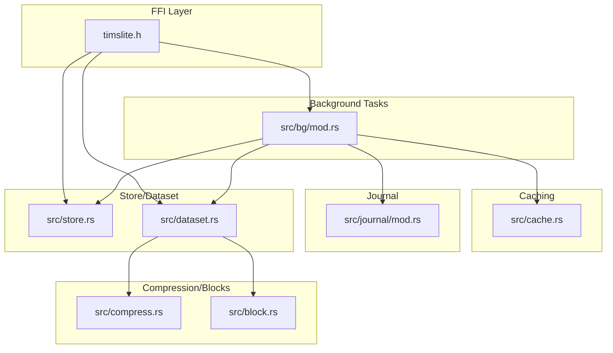
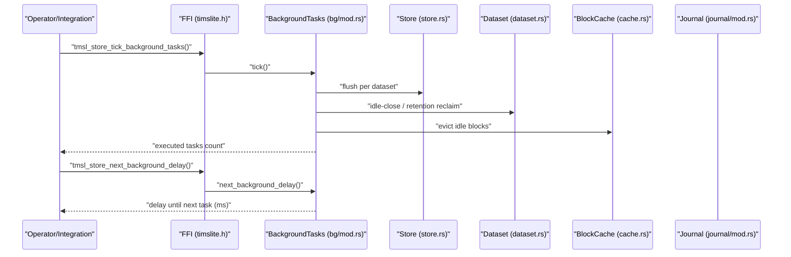
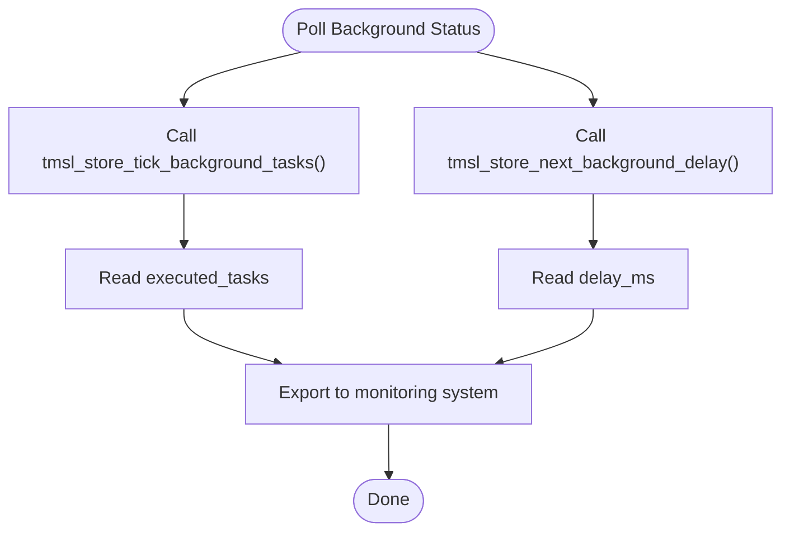
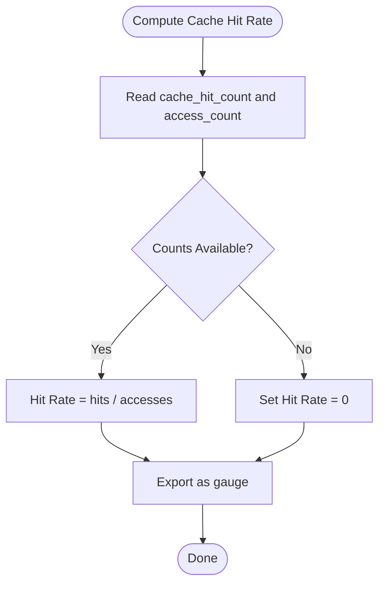
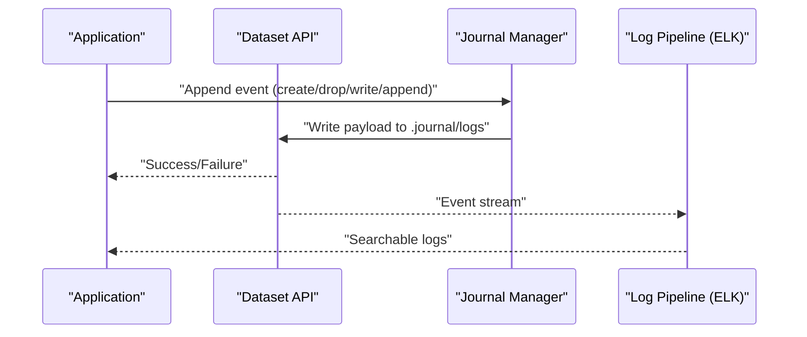
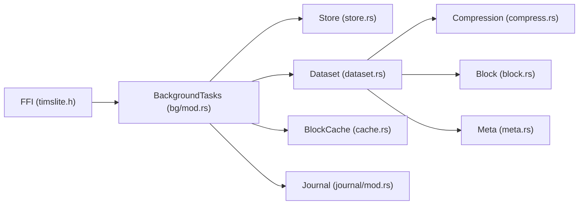

# Monitoring and Metrics

<cite>
**Referenced Files in This Document**
- [timslite.h](file://include/timslite.h)
- [mod.rs](file://src/bg/mod.rs)
- [cache.rs](file://src/cache.rs)
- [mod.rs](file://src/journal/mod.rs)
- [mod.rs](file://src/lib.rs)
- [mod.rs](file://src/store.rs)
- [mod.rs](file://src/dataset.rs)
- [mod.rs](file://src/query/iter.rs)
- [mod.rs](file://src/compress.rs)
- [mod.rs](file://src/block.rs)
- [mod.rs](file://src/meta.rs)
- [mod.rs](file://src/error.rs)
- [Cargo.toml](file://Cargo.toml)
- [AGENTS.md](file://AGENTS.md)
- [background-and-cache.md](file://docs/design/background-and-cache.md)
</cite>

## Table of Contents
1. [Introduction](#introduction)
2. [Project Structure](#project-structure)
3. [Core Components](#core-components)
4. [Architecture Overview](#architecture-overview)
5. [Detailed Component Analysis](#detailed-component-analysis)
6. [Dependency Analysis](#dependency-analysis)
7. [Performance Considerations](#performance-considerations)
8. [Troubleshooting Guide](#troubleshooting-guide)
9. [Conclusion](#conclusion)
10. [Appendices](#appendices)

## Introduction
This document provides comprehensive monitoring and metrics guidance for TimSLite production deployments. It focuses on observable signals available from the codebase, including throughput, latency, memory usage, disk I/O patterns, background task behavior, and operational observability via logs and FFI interfaces. It also outlines how to integrate these signals with external monitoring systems such as Prometheus, Grafana, and the ELK stack, and how to configure dashboards and alerts.

TimSLite exposes a C-compatible FFI interface for operational control and diagnostics. Background tasks (flush, idle-close, cache eviction, retention reclaim) are scheduled deterministically and expose scheduling delays via FFI. The library records operational events to an internal journal dataset, enabling audit trails and operational insights.

## Project Structure
The monitoring-relevant parts of the codebase are organized around:
- FFI interface for operational control and diagnostics
- Background task scheduler and scheduling delays
- Block-level caching and cache hit accounting
- Journal dataset for change logs and operational events
- Store and dataset APIs for write/query operations
- Compression and block-level metadata for I/O characteristics

**Diagram sources**
- [timslite.h:95-124](file://include/timslite.h#L95-L124)
- [mod.rs](file://src/bg/mod.rs)
- [cache.rs](file://src/cache.rs)
- [mod.rs](file://src/journal/mod.rs)
- [mod.rs](file://src/store.rs)
- [mod.rs](file://src/dataset.rs)
- [mod.rs](file://src/compress.rs)
- [mod.rs](file://src/block.rs)

**Section sources**
- [timslite.h:95-124](file://include/timslite.h#L95-L124)
- [mod.rs](file://src/bg/mod.rs)
- [cache.rs](file://src/cache.rs)
- [mod.rs](file://src/journal/mod.rs)
- [mod.rs](file://src/store.rs)
- [mod.rs](file://src/dataset.rs)
- [mod.rs](file://src/compress.rs)
- [mod.rs](file://src/block.rs)

## Core Components
This section highlights the primary sources of monitoring signals and how to observe them.

- FFI Operational Controls
  - Synchronous background tick and next-delay queries are exposed via FFI. These can be used to monitor scheduling behavior and detect stalls.
  - See [timslite.h:95-124](file://include/timslite.h#L95-L124).

- Background Task Scheduler
  - The scheduler computes the next background delay dynamically and executes tasks (flush, idle check, cache eviction, retention reclaim) when due.
  - See [mod.rs](file://src/bg/mod.rs) and [background-and-cache.md](file://docs/design/background-and-cache.md).

- Block Cache Hit Accounting
  - Cache hit counters are maintained atomically and can be queried to compute hit rates.
  - See [cache.rs](file://src/cache.rs).

- Journal Dataset
  - Operational events (create/drop dataset, write/delete/append) are recorded in a dedicated dataset for audit and operational visibility.
  - See [mod.rs](file://src/journal/mod.rs).

- Store and Dataset APIs
  - Store-level operations expose flush/close semantics and dataset-level operations support write/query lifecycle.
  - See [mod.rs](file://src/store.rs) and [mod.rs](file://src/dataset.rs).

- Compression and Blocks
  - Compression routines and block sealing provide insight into compression ratios and I/O sizes.
  - See [mod.rs](file://src/compress.rs) and [mod.rs](file://src/block.rs).

**Section sources**
- [timslite.h:95-124](file://include/timslite.h#L95-L124)
- [mod.rs](file://src/bg/mod.rs)
- [background-and-cache.md](file://docs/design/background-and-cache.md)
- [cache.rs](file://src/cache.rs)
- [mod.rs](file://src/journal/mod.rs)
- [mod.rs](file://src/store.rs)
- [mod.rs](file://src/dataset.rs)
- [mod.rs](file://src/compress.rs)
- [mod.rs](file://src/block.rs)

## Architecture Overview
The monitoring architecture centers on:
- FFI-provided hooks to observe scheduling and task execution
- Internal metrics captured in cache hit counters and background task logs
- Operational event logs written to the journal dataset
- Store and dataset APIs for write/query telemetry

**Diagram sources**
- [timslite.h:95-124](file://include/timslite.h#L95-L124)
- [mod.rs](file://src/bg/mod.rs)
- [mod.rs](file://src/store.rs)
- [mod.rs](file://src/dataset.rs)
- [cache.rs](file://src/cache.rs)
- [mod.rs](file://src/journal/mod.rs)

## Detailed Component Analysis

### Background Task Monitoring
- Purpose: Track periodic maintenance operations and their scheduling cadence.
- Signals:
  - Executed tasks per tick (0–4)
  - Next background delay in milliseconds
- Collection Mechanism:
  - Use FFI functions to poll task execution and scheduling delay.
- Export Formats:
  - Integers (task count, delay in ms)
- Integration:
  - Expose as Prometheus counters and gauges; track task counts per second and delay distribution.

**Diagram sources**
- [timslite.h:95-124](file://include/timslite.h#L95-L124)
- [mod.rs](file://src/bg/mod.rs)

**Section sources**
- [timslite.h:95-124](file://include/timslite.h#L95-L124)
- [mod.rs](file://src/bg/mod.rs)
- [background-and-cache.md](file://docs/design/background-and-cache.md)

### Cache Hit Rate Monitoring
- Purpose: Measure effectiveness of block-level caching.
- Signals:
  - Cache hit counter (atomic)
  - Access counter (atomic)
- Collection Mechanism:
  - Query current hit/access counts and compute hit rate.
- Export Formats:
  - Gauge (hit rate percentage)
- Integration:
  - Track trends and set alerts for sustained low hit rates indicating cache pressure or misconfiguration.

**Diagram sources**
- [cache.rs](file://src/cache.rs)

**Section sources**
- [cache.rs](file://src/cache.rs)

### Journal-Based Operational Logging
- Purpose: Provide audit trail and operational events for troubleshooting and compliance.
- Signals:
  - Event types: create/drop dataset, write/delete/append
  - Timestamp progression and ordering
- Collection Mechanism:
  - Read the journal dataset via dataset APIs.
- Export Formats:
  - Structured logs (JSON recommended) with fields: event_type, dataset_name, timestamp, metadata.
- Integration:
  - Ship to ELK stack for log aggregation and search; correlate with metrics.

**Diagram sources**
- [mod.rs](file://src/journal/mod.rs)
- [mod.rs](file://src/dataset.rs)

**Section sources**
- [mod.rs](file://src/journal/mod.rs)
- [mod.rs](file://src/dataset.rs)

### Write/Query Throughput and Latency
- Purpose: Measure ingestion and retrieval performance.
- Signals:
  - Write/query durations (recorded implicitly via store/dataset operations)
  - Operation counts over time windows
- Collection Mechanism:
  - Instrument calls to store/dataset APIs; measure start/end timestamps.
- Export Formats:
  - Histograms (latency buckets), counters (ops/sec)
- Integration:
  - Expose via Prometheus histograms and counters; visualize in Grafana.

[No sources needed since this section provides general guidance]

### Disk I/O Patterns
- Purpose: Understand flushing, compression, and segment behavior.
- Signals:
  - Flush frequency and duration (via background scheduling)
  - Compression ratio (compressed/uncompressed sizes)
  - Segment sealing and metadata
- Collection Mechanism:
  - Combine background delay polling with compression routines and block metadata.
- Export Formats:
  - Gauges (compression ratio), counters (flushes), histograms (flush duration)
- Integration:
  - Track I/O throughput and latency; alert on increased flush frequency or degraded compression.

**Section sources**
- [mod.rs](file://src/bg/mod.rs)
- [mod.rs](file://src/compress.rs)
- [mod.rs](file://src/block.rs)
- [mod.rs](file://src/meta.rs)

### Health Checks and Status Reporting
- Purpose: Provide liveness/readiness/status for operators and load balancers.
- Signals:
  - Background task scheduling delay indicates liveness
  - Journal flush/close operations indicate readiness
- Collection Mechanism:
  - Poll next background delay via FFI; attempt journal flush/close.
- Export Formats:
  - Boolean health flags, status text, and scheduling delay
- Integration:
  - Expose as HTTP endpoints or systemd-style status; feed to monitoring dashboards.

**Section sources**
- [timslite.h:95-124](file://include/timslite.h#L95-L124)
- [mod.rs](file://src/journal/mod.rs)

### Alerting Thresholds
- Background delay threshold: rising delay indicates stalled or overloaded background tasks.
- Cache hit rate threshold: sustained low hit rate suggests cache misconfiguration or memory pressure.
- Journal flush failures: errors during flush/close indicate storage or permission issues.
- Flush frequency spikes: frequent flushes may indicate small flush intervals or high churn.

**Section sources**
- [timslite.h:95-124](file://include/timslite.h#L95-L124)
- [cache.rs](file://src/cache.rs)
- [mod.rs](file://src/journal/mod.rs)

## Dependency Analysis
The following diagram shows how monitoring-relevant components depend on each other.

**Diagram sources**
- [timslite.h:95-124](file://include/timslite.h#L95-L124)
- [mod.rs](file://src/bg/mod.rs)
- [mod.rs](file://src/store.rs)
- [mod.rs](file://src/dataset.rs)
- [cache.rs](file://src/cache.rs)
- [mod.rs](file://src/journal/mod.rs)
- [mod.rs](file://src/compress.rs)
- [mod.rs](file://src/block.rs)
- [mod.rs](file://src/meta.rs)

**Section sources**
- [timslite.h:95-124](file://include/timslite.h#L95-L124)
- [mod.rs](file://src/bg/mod.rs)
- [cache.rs](file://src/cache.rs)
- [mod.rs](file://src/journal/mod.rs)
- [mod.rs](file://src/store.rs)
- [mod.rs](file://src/dataset.rs)
- [mod.rs](file://src/compress.rs)
- [mod.rs](file://src/block.rs)
- [mod.rs](file://src/meta.rs)

## Performance Considerations
- Background scheduling overhead: next_background_delay computation is lightweight and does not block long-running tasks.
- Cache hit accounting: atomic counters minimize contention; avoid excessive polling to prevent overhead.
- Journal writes: ensure adequate disk bandwidth; consider tuning flush intervals to balance durability and performance.
- Query iteration: collect_all() can allocate large buffers; monitor memory usage during bulk reads.

[No sources needed since this section provides general guidance]

## Troubleshooting Guide
- Symptoms: Rising background delay
  - Actions: Inspect background task logs; verify flush intervals; check for I/O bottlenecks.
- Symptoms: Low cache hit rate
  - Actions: Review cache configuration; assess memory limits; monitor access patterns.
- Symptoms: Journal flush/close errors
  - Actions: Check filesystem permissions; validate disk space; inspect error messages.
- Correlation Techniques:
  - Use timestamps to align metrics (background delay, cache hit rate) with log events from the journal dataset.
  - Aggregate logs in ELK and filter by dataset name and event type.

**Section sources**
- [timslite.h:95-124](file://include/timslite.h#L95-L124)
- [cache.rs](file://src/cache.rs)
- [mod.rs](file://src/journal/mod.rs)
- [mod.rs](file://src/error.rs)

## Conclusion
TimSLite provides robust hooks for production monitoring through its FFI interface, internal cache accounting, and operational journaling. By instrumenting background task scheduling, cache hit rates, and journal events, operators can build comprehensive dashboards and alerts. Integrating with Prometheus, Grafana, and ELK enables effective observability, anomaly detection, and troubleshooting.

[No sources needed since this section summarizes without analyzing specific files]

## Appendices

### A. Prometheus Integration Checklist
- Expose background tick executed_tasks and next_delay_ms as gauges/counters.
- Expose cache hit_rate as a gauge.
- Export journal flush/close success/failure as counters.
- Set up recording rules for moving averages and percentiles.

[No sources needed since this section provides general guidance]

### B. Grafana Dashboard Suggestions
- Panels:
  - Background delay histogram
  - Cache hit rate trend
  - Journal event volume by type
  - Flush frequency and duration
- Annotations:
  - Align with journal events for operational context.

[No sources needed since this section provides general guidance]

### C. ELK Log Management
- Index pattern: journal dataset events
- Fields: event_type, dataset_name, timestamp, metadata
- Queries: filter by dataset, event_type, and time range

**Section sources**
- [mod.rs](file://src/journal/mod.rs)
- [mod.rs](file://src/dataset.rs)

### D. Anomaly Detection Approaches
- Statistical baselines: compute mean/stddev for background delay and cache hit rate
- Machine learning: use Isolation Forest on background delay and flush duration
- Alert policies: escalate on sustained anomalies

[No sources needed since this section provides general guidance]