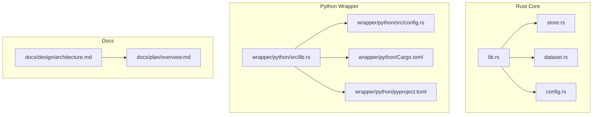
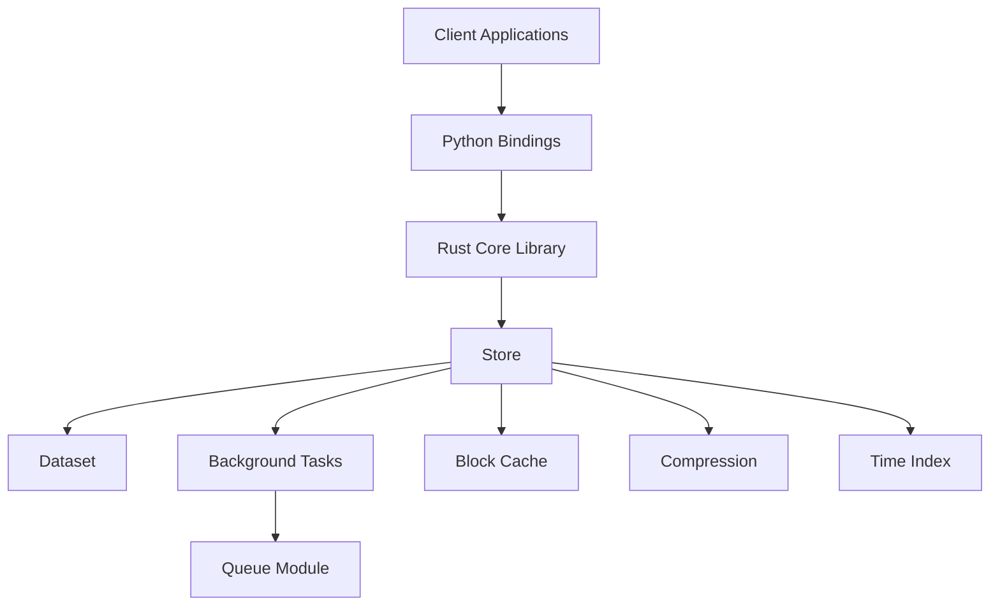
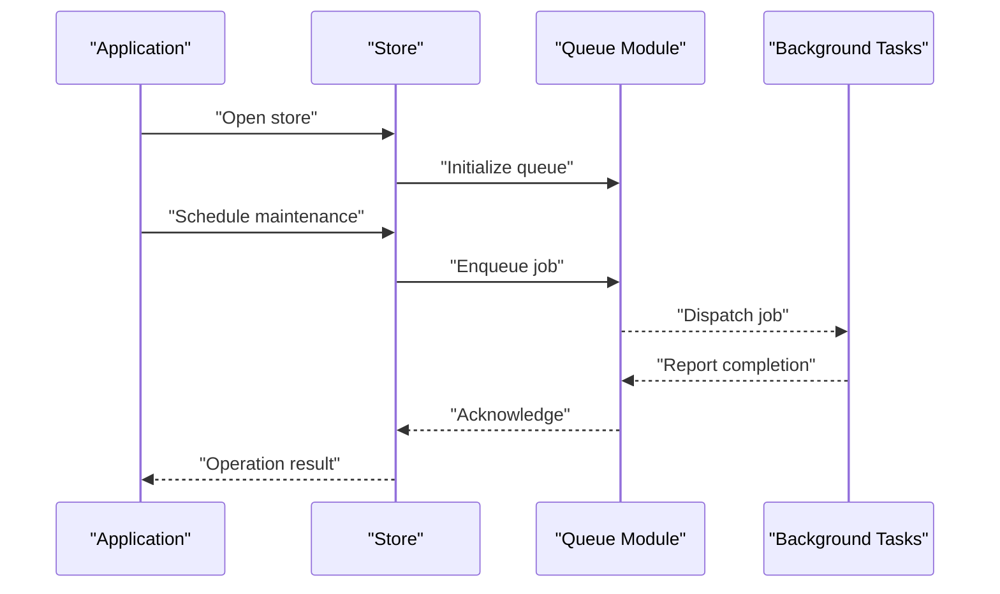
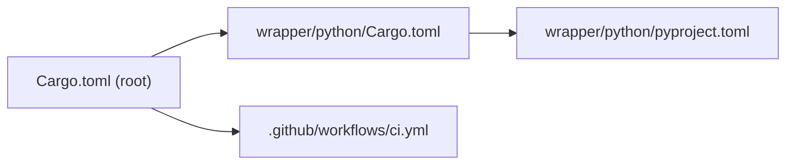

# Production Deployment

<cite>
**Referenced Files in This Document**
- [Cargo.toml](file://Cargo.toml)
- [src/config.rs](file://src/config.rs)
- [src/store.rs](file://src/store.rs)
- [src/dataset.rs](file://src/dataset.rs)
- [src/lib.rs](file://src/lib.rs)
- [wrapper/python/Cargo.toml](file://wrapper/python/Cargo.toml)
- [wrapper/python/pyproject.toml](file://wrapper/python/pyproject.toml)
- [wrapper/python/src/config.rs](file://wrapper/python/src/config.rs)
- [wrapper/python/design.md](file://wrapper/python/design.md)
- [.github/workflows/ci.yml](file://.github/workflows/ci.yml)
- [docs/design/architecture.md](file://docs/design/architecture.md)
- [docs/design/background-and-cache.md](file://docs/design/background-and-cache.md)
- [docs/design/data-segment.md](file://docs/design/data-segment.md)
- [docs/design/dataset-operations.md](file://docs/design/dataset-operations.md)
- [docs/design/time-index.md](file://docs/design/time-index.md)
- [docs/design/lazy-allocation.md](file://docs/design/lazy-allocation.md)
- [docs/design/compression.md](file://docs/design/compression.md)
- [docs/design/queue-overview.md](file://docs/design/queue-overview.md)
- [docs/design/queue-state-file.md](file://docs/design/queue-state-file.md)
- [docs/design/store-and-ffi.md](file://docs/design/store-and-ffi.md)
- [docs/design/query-iterator.md](file://docs/design/query-iterator.md)
- [docs/plan/overview.md](file://docs/plan/overview.md)
- [docs/plan/phase-01-skeleton.md](file://docs/plan/phase-01-skeleton.md)
- [docs/plan/phase-02-header-block.md](file://docs/plan/phase-02-header-block.md)
- [docs/plan/phase-03-datasegment.md](file://docs/plan/phase-03-datasegment.md)
- [docs/plan/phase-04-time-index.md](file://docs/plan/phase-04-time-index.md)
- [docs/plan/phase-05-dataset.md](file://docs/plan/phase-05-dataset.md)
- [docs/plan/phase-06-store-bg.md](file://docs/plan/phase-06-store-bg.md)
- [docs/plan/phase-07-ffi.md](file://docs/plan/phase-07-ffi.md)
- [docs/plan/phase-08-tests-perf.md](file://docs/plan/phase-08-tests-perf.md)
- [docs/plan/phase-09-blockcache.md](file://docs/plan/phase-09-blockcache.md)
- [docs/plan/phase-10-continuous-storage.md](file://docs/plan/phase-10-continuous-storage.md)
- [docs/plan/phase-11-o1-optimization.md](file://docs/plan/phase-11-o1-optimization.md)
- [docs/plan/phase-12-lazy-allocation.md](file://docs/plan/phase-12-lazy-allocation.md)
- [docs/plan/phase-13-query-iterator.md](file://docs/plan/phase-13-query-iterator.md)
- [docs/plan/phase-14-dataset-config-builder.md](file://docs/plan/phase-14-dataset-config-builder.md)
- [docs/plan/phase-15-header-state-split.md](file://docs/plan/phase-15-header-state-split.md)
- [docs/plan/phase-16-data-retention.md](file://docs/plan/phase-16-data-retention.md)
- [docs/plan/phase-17-correction-write.md](file://docs/plan/phase-17-correction-write.md)
- [docs/plan/phase-18-out-of-order-write-and-delete.md](file://docs/plan/phase-18-out-of-order-write-and-delete.md)
- [docs/plan/phase-19-single-timestamp-read.md](file://docs/plan/phase-19-single-timestamp-read.md)
- [docs/plan/phase-20-latest-timestamp-read.md](file://docs/plan/phase-20-latest-timestamp-read.md)
- [docs/plan/phase-21-manual-bg-execution.md](file://docs/plan/phase-21-manual-bg-execution.md)
- [docs/plan/phase-22-manual-bg-python-wrapper.md](file://docs/plan/phase-22-manual-bg-python-wrapper.md)
- [docs/plan/phase-23-record-length-u32.md](file://docs/plan/phase-23-record-length-u32.md)
- [docs/plan/phase-24-sparse-continuous-index.md](file://docs/plan/phase-24-sparse-continuous-index.md)
- [docs/plan/phase-25-header-variable-length.md](file://docs/plan/phase-25-header-variable-length.md)
- [docs/plan/phase-26-github-actions-ci.md](file://docs/plan/phase-26-github-actions-ci.md)
- [docs/plan/phase-27-queue-module.md](file://docs/plan/phase-27-queue-module.md)
- [docs/plan/phase-28-journal.md](file://docs/plan/phase-28-journal.md)
- [docs/plan/phase-29-dataset-append.md](file://docs/plan/phase-29-dataset-append.md)
</cite>

## Table of Contents
1. [Introduction](#introduction)
2. [Project Structure](#project-structure)
3. [Core Components](#core-components)
4. [Architecture Overview](#architecture-overview)
5. [Detailed Component Analysis](#detailed-component-analysis)
6. [Dependency Analysis](#dependency-analysis)
7. [Performance Considerations](#performance-considerations)
8. [Troubleshooting Guide](#troubleshooting-guide)
9. [Conclusion](#conclusion)
10. [Appendices](#appendices)

## Introduction
This document provides production-grade deployment guidance for TimSLite, covering platform-specific installation, system requirements, dependency management, configuration, containerization, orchestration, security hardening, capacity planning, and scaling strategies. It synthesizes configuration surfaces exposed by the Rust core and Python wrapper, and aligns operational recommendations with the internal architecture and design documents.

## Project Structure
TimSLite consists of:
- A Rust core library exposing storage, datasets, background tasks, indexing, caching, compression, and FFI interfaces.
- A Python wrapper that re-exports the Rust API and adds Python-specific bindings and configuration helpers.
- Documentation detailing design decisions, performance characteristics, and operational phases.

**Diagram sources**
- [src/lib.rs](file://src/lib.rs)
- [src/store.rs](file://src/store.rs)
- [src/dataset.rs](file://src/dataset.rs)
- [src/config.rs](file://src/config.rs)
- [wrapper/python/src/lib.rs](file://wrapper/python/src/lib.rs)
- [wrapper/python/src/config.rs](file://wrapper/python/src/config.rs)
- [wrapper/python/Cargo.toml](file://wrapper/python/Cargo.toml)
- [wrapper/python/pyproject.toml](file://wrapper/python/pyproject.toml)
- [docs/design/architecture.md](file://docs/design/architecture.md)
- [docs/plan/overview.md](file://docs/plan/overview.md)

**Section sources**
- [Cargo.toml](file://Cargo.toml)
- [wrapper/python/Cargo.toml](file://wrapper/python/Cargo.toml)
- [wrapper/python/pyproject.toml](file://wrapper/python/pyproject.toml)
- [src/lib.rs](file://src/lib.rs)
- [src/store.rs](file://src/store.rs)
- [src/dataset.rs](file://src/dataset.rs)
- [src/config.rs](file://src/config.rs)
- [wrapper/python/src/config.rs](file://wrapper/python/src/config.rs)

## Core Components
- Store: Manages persistent storage, background tasks, and lifecycle operations.
- Dataset: Encapsulates per-dataset configuration, append/write, and query interfaces.
- Config: Centralizes runtime and build-time configuration surfaces for both Rust and Python.
- Background Tasks: Asynchronous maintenance operations (e.g., compaction, retention).
- Indexing and Caching: Time-index and block-level caches for efficient reads.
- Compression: Optional compression for data segments to reduce storage footprint.
- Queue Module: Background job queue for scheduling maintenance tasks.

Key configuration surfaces:
- Store-level settings: path, background task scheduling, cache sizes, compression, and retention policies.
- Dataset-level settings: per-dataset configuration builder and dataset-specific parameters.
- Python wrapper configuration: mirrors and augments Rust configuration for Python consumers.

**Section sources**
- [src/store.rs](file://src/store.rs)
- [src/dataset.rs](file://src/dataset.rs)
- [src/config.rs](file://src/config.rs)
- [wrapper/python/src/config.rs](file://wrapper/python/src/config.rs)
- [docs/design/background-and-cache.md](file://docs/design/background-and-cache.md)
- [docs/design/compression.md](file://docs/design/compression.md)
- [docs/design/queue-overview.md](file://docs/design/queue-overview.md)
- [docs/design/queue-state-file.md](file://docs/design/queue-state-file.md)

## Architecture Overview
TimSLite’s production architecture centers on a Rust core with optional Python bindings. The system exposes:
- A store abstraction managing persistence and background maintenance.
- Per-dataset namespaces with independent configuration and lifecycle.
- An FFI boundary for external integrations.
- A queue module for background jobs.

**Diagram sources**
- [src/lib.rs](file://src/lib.rs)
- [src/store.rs](file://src/store.rs)
- [src/dataset.rs](file://src/dataset.rs)
- [src/config.rs](file://src/config.rs)
- [docs/design/architecture.md](file://docs/design/architecture.md)
- [docs/design/background-and-cache.md](file://docs/design/background-and-cache.md)
- [docs/design/compression.md](file://docs/design/compression.md)
- [docs/design/queue-overview.md](file://docs/design/queue-overview.md)
- [docs/design/time-index.md](file://docs/design/time-index.md)

## Detailed Component Analysis

### Store and Dataset Configuration
- Store-level configuration controls:
  - Storage path and permissions
  - Background task scheduling cadence
  - Cache sizing and eviction policies
  - Compression settings
  - Retention and compaction thresholds
- Dataset-level configuration controls:
  - Append/write behavior
  - Query window and iterator behavior
  - Time-index and block cache alignment
  - Dataset-specific retention and compaction policies

Operational implications:
- Larger cache sizes improve read throughput but increase memory usage.
- Compression reduces disk IO and storage costs but increases CPU usage.
- Retention and compaction schedules must balance storage growth with query performance.

**Section sources**
- [src/config.rs](file://src/config.rs)
- [src/store.rs](file://src/store.rs)
- [src/dataset.rs](file://src/dataset.rs)
- [docs/design/dataset-operations.md](file://docs/design/dataset-operations.md)
- [docs/design/data-segment.md](file://docs/design/data-segment.md)
- [docs/design/time-index.md](file://docs/design/time-index.md)
- [docs/design/lazy-allocation.md](file://docs/design/lazy-allocation.md)

### Background Tasks and Queue
- Background tasks handle compaction, retention cleanup, and periodic maintenance.
- The queue module schedules and executes background jobs reliably.

**Diagram sources**
- [docs/design/queue-overview.md](file://docs/design/queue-overview.md)
- [docs/design/queue-state-file.md](file://docs/design/queue-state-file.md)
- [docs/design/background-and-cache.md](file://docs/design/background-and-cache.md)

**Section sources**
- [docs/design/queue-overview.md](file://docs/design/queue-overview.md)
- [docs/design/queue-state-file.md](file://docs/design/queue-state-file.md)
- [docs/design/background-and-cache.md](file://docs/design/background-and-cache.md)

### Python Wrapper Configuration
- The Python wrapper mirrors Rust configuration and adds Python packaging metadata.
- Build and runtime dependencies are declared via Cargo and Poetry/pyproject configurations.

**Section sources**
- [wrapper/python/src/config.rs](file://wrapper/python/src/config.rs)
- [wrapper/python/Cargo.toml](file://wrapper/python/Cargo.toml)
- [wrapper/python/pyproject.toml](file://wrapper/python/pyproject.toml)
- [wrapper/python/design.md](file://wrapper/python/design.md)

## Dependency Analysis
- Rust core dependencies and targets are defined in the root Cargo manifest.
- Python wrapper depends on the Rust core crate and exposes Python bindings.
- CI workflows demonstrate build and test automation for multiple platforms.

**Diagram sources**
- [Cargo.toml](file://Cargo.toml)
- [wrapper/python/Cargo.toml](file://wrapper/python/Cargo.toml)
- [wrapper/python/pyproject.toml](file://wrapper/python/pyproject.toml)
- [.github/workflows/ci.yml](file://.github/workflows/ci.yml)

**Section sources**
- [Cargo.toml](file://Cargo.toml)
- [wrapper/python/Cargo.toml](file://wrapper/python/Cargo.toml)
- [wrapper/python/pyproject.toml](file://wrapper/python/pyproject.toml)
- [.github/workflows/ci.yml](file://.github/workflows/ci.yml)

## Performance Considerations
- Cache sizing: Increase block cache and time-index cache for higher read throughput; monitor memory pressure.
- Compression: Enable compression to reduce disk IO and storage; tune compression level vs CPU trade-offs.
- Background scheduling: Adjust compaction and retention frequencies to match write patterns and acceptable latency windows.
- Lazy allocation: Benefit from reduced initial overhead during dataset creation and growth.
- Query iterators: Tune iterator window sizes and prefetch behavior for batch workloads.

**Section sources**
- [docs/design/background-and-cache.md](file://docs/design/background-and-cache.md)
- [docs/design/compression.md](file://docs/design/compression.md)
- [docs/design/lazy-allocation.md](file://docs/design/lazy-allocation.md)
- [docs/design/query-iterator.md](file://docs/design/query-iterator.md)
- [docs/design/dataset-operations.md](file://docs/design/dataset-operations.md)

## Troubleshooting Guide
Common operational issues and remedies:
- Store initialization failures: Verify storage path permissions and availability; confirm background task queue state file integrity.
- Memory spikes during compaction: Reduce background concurrency or adjust cache sizes; consider throttling compaction frequency.
- Slow queries: Review time-index and block cache effectiveness; check compression impact on CPU and IO.
- Python binding errors: Rebuild the Python wrapper against the correct Rust core version; validate pyproject dependencies.

**Section sources**
- [docs/design/queue-state-file.md](file://docs/design/queue-state-file.md)
- [docs/design/background-and-cache.md](file://docs/design/background-and-cache.md)
- [docs/design/query-iterator.md](file://docs/design/query-iterator.md)
- [wrapper/python/design.md](file://wrapper/python/design.md)

## Conclusion
TimSLite’s production deployment hinges on robust configuration management, careful performance tuning, and reliable background maintenance. By aligning cache and compression settings with workload profiles, scheduling background tasks to minimize contention, and securing storage and network boundaries, operators can achieve predictable performance and scalability.

## Appendices

### Platform Installation Procedures
- Linux
  - Install Rust toolchain and system dependencies as required by the Rust core and Python wrapper.
  - Build the Rust core and Python bindings; install Python package via the wrapper’s build system.
  - Configure store paths and permissions; deploy background services to manage maintenance.
- Windows
  - Use a compatible Rust toolchain and MSVC or GNU ABI toolchain.
  - Build the Rust core and Python wrapper; ensure DLL dependencies are available at runtime.
  - Set up service accounts and scheduled tasks for background maintenance.
- macOS
  - Install Rust toolchain and Xcode command-line tools.
  - Build and install the Python package; configure sandbox and permission allowances for storage paths.

[No sources needed since this section provides general guidance]

### System Requirements and Dependencies
- Minimum OS: Linux, Windows, or macOS with a supported Rust toolchain.
- Python: Required only if using the Python wrapper; managed via the wrapper’s build system.
- Disk: Sufficient space for configured retention plus headroom for compaction and temporary segments.
- Memory: Proportional to cache sizes and concurrent query loads; provision headroom for background tasks.
- CPU: Variable depending on compression level and background compaction intensity.

[No sources needed since this section provides general guidance]

### Environment Setup
- Create dedicated service accounts for the store path ownership and least-privilege access.
- Set environment variables for store paths and dataset configuration overrides if applicable.
- Configure log rotation and monitoring hooks for background tasks and store health.

[No sources needed since this section provides general guidance]

### Configuration Management
- Store-level settings:
  - Path, permissions, cache sizes, compression, retention, and background scheduling.
- Dataset-level settings:
  - Append behavior, query window, and dataset-specific policies.
- Python wrapper:
  - Mirrors store/dataset configuration; ensure consistent defaults across environments.

**Section sources**
- [src/config.rs](file://src/config.rs)
- [wrapper/python/src/config.rs](file://wrapper/python/src/config.rs)

### Containerized Deployment and Kubernetes Orchestration
- Container image:
  - Package the Rust binary and Python bindings into a minimal container.
  - Mount persistent volumes for the store path; set appropriate file permissions.
- Kubernetes:
  - Deploy a StatefulSet for the store with persistent volume claims.
  - Use Jobs/CronJobs for background maintenance tasks; ensure idempotent execution.
  - Expose metrics and logs for monitoring; secure ingress and egress policies.

[No sources needed since this section provides general guidance]

### Security Hardening and Access Control
- Principle of least privilege for service accounts and file system access.
- Encrypt at rest for sensitive datasets; rotate keys periodically.
- Network segmentation and TLS termination at ingress; restrict egress to trusted endpoints.
- Audit and monitor access to store paths and Python bindings usage.

[No sources needed since this section provides general guidance]

### Capacity Planning and Scaling
- Write-heavy workloads:
  - Increase cache sizes; enable compression; schedule frequent compaction.
- Read-heavy workloads:
  - Prioritize block and time-index cache sizing; optimize query window sizes.
- Horizontal scaling:
  - Partition datasets across stores; use load balancing and sharding strategies.
- Vertical scaling:
  - Add CPU/memory resources; adjust background task concurrency and queue depth.

[No sources needed since this section provides general guidance]