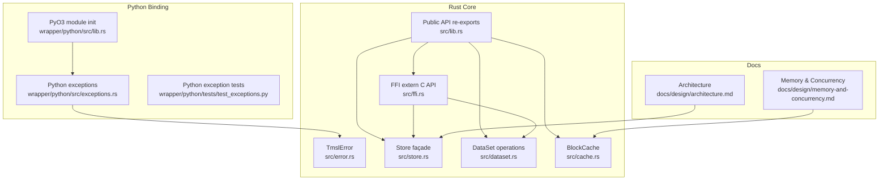
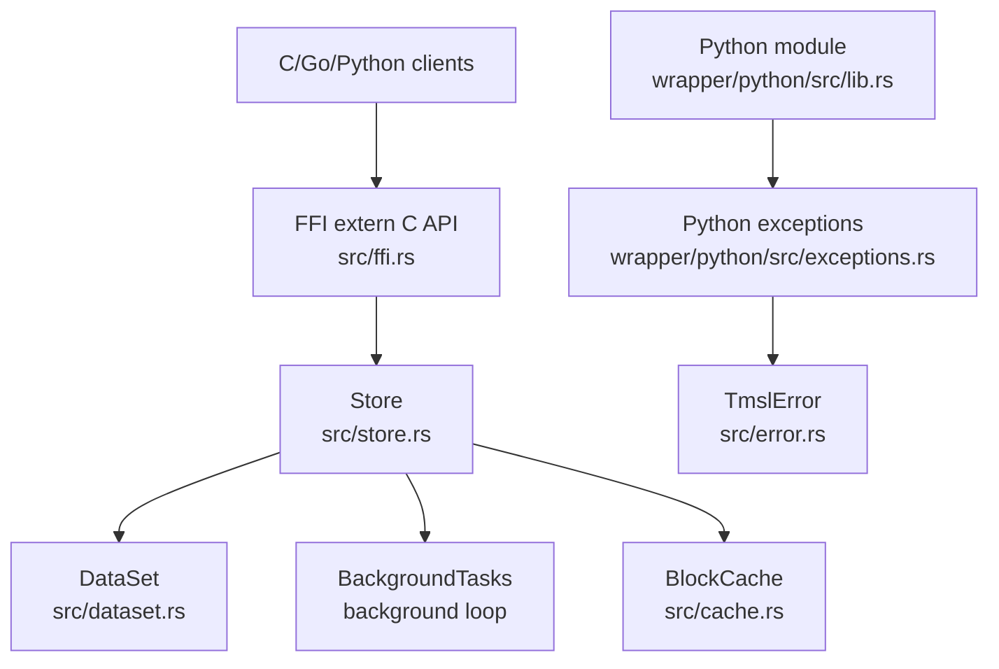
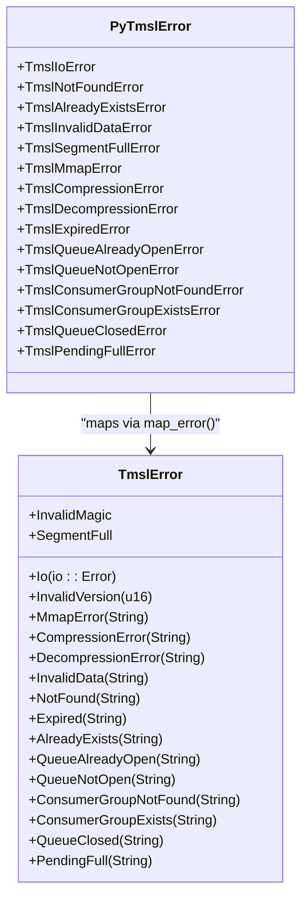
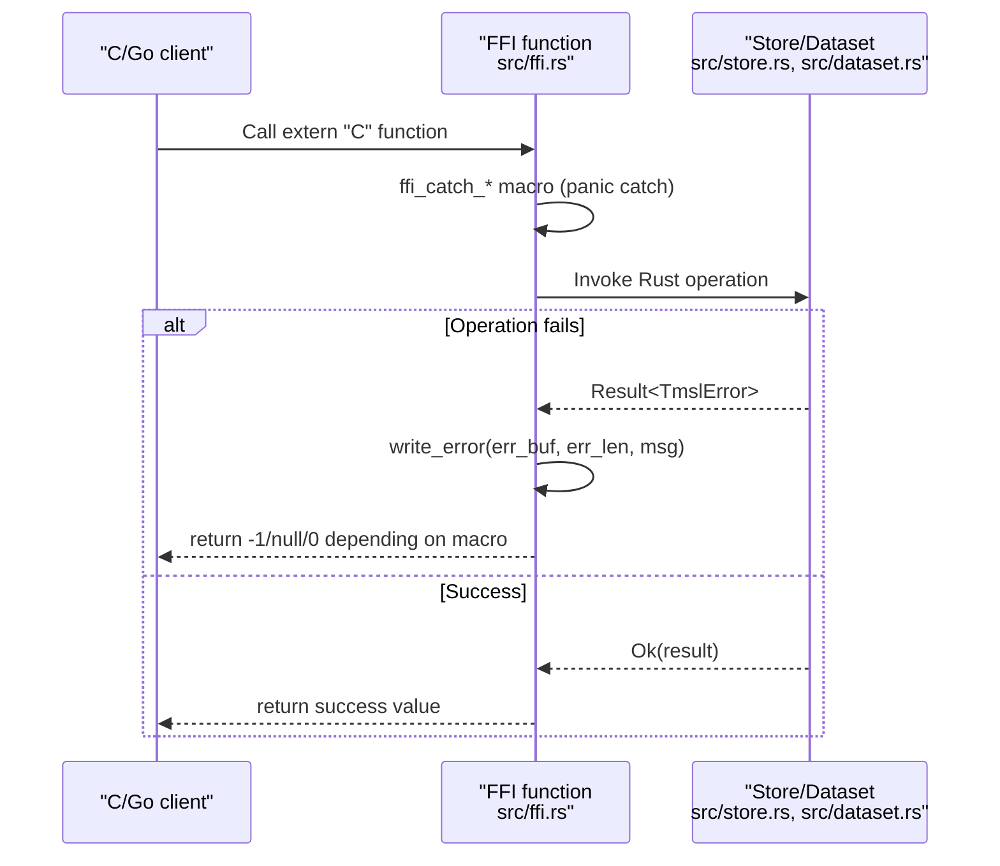
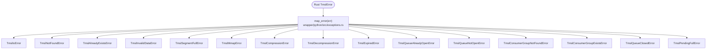
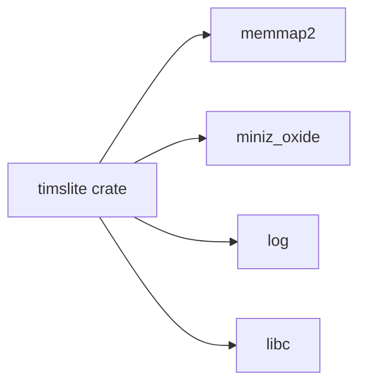

# Troubleshooting Guide

<cite>
**Referenced Files in This Document**
- [error.rs](file://src/error.rs)
- [ffi.rs](file://src/ffi.rs)
- [lib.rs](file://src/lib.rs)
- [store.rs](file://src/store.rs)
- [dataset.rs](file://src/dataset.rs)
- [cache.rs](file://src/cache.rs)
- [lib.rs](file://wrapper/python/src/lib.rs)
- [exceptions.rs](file://wrapper/python/src/exceptions.rs)
- [Cargo.toml](file://Cargo.toml)
- [architecture.md](file://docs/design/architecture.md)
- [memory-and-concurrency.md](file://docs/design/memory-and-concurrency.md)
- [test_exceptions.py](file://wrapper/python/tests/test_exceptions.py)
- [README.md](file://README.md)
</cite>

## Table of Contents
1. [Introduction](#introduction)
2. [Project Structure](#project-structure)
3. [Core Components](#core-components)
4. [Architecture Overview](#architecture-overview)
5. [Detailed Component Analysis](#detailed-component-analysis)
6. [Dependency Analysis](#dependency-analysis)
7. [Performance Considerations](#performance-considerations)
8. [Troubleshooting Guide](#troubleshooting-guide)
9. [Conclusion](#conclusion)
10. [Appendices](#appendices)

## Introduction
This guide provides a comprehensive troubleshooting methodology for TimSLite operational issues. It covers error scenarios such as file system errors, memory allocation failures, corruption detection, and performance degradation symptoms. It also documents systematic diagnostic procedures, error code reference, log analysis techniques, debugging strategies, and cross-language integration challenges for FFI and Python bindings. Finally, it outlines escalation procedures, support ticket preparation, and reproducible issue techniques.

## Project Structure
TimSLite exposes a C ABI FFI interface for cross-language integration and a Python binding built with PyO3. The core Rust library defines a unified error type and a store façade that orchestrates datasets, background tasks, caching, and queues. Logging is used throughout for diagnostics.

**Diagram sources**
- [lib.rs:60-72](file://src/lib.rs#L60-L72)
- [store.rs:46-56](file://src/store.rs#L46-L56)
- [dataset.rs:71-82](file://src/dataset.rs#L71-L82)
- [cache.rs:43-49](file://src/cache.rs#L43-L49)
- [ffi.rs:101-120](file://src/ffi.rs#L101-L120)
- [lib.rs:14-28](file://wrapper/python/src/lib.rs#L14-L28)
- [exceptions.rs:15-162](file://wrapper/python/src/exceptions.rs#L15-L162)
- [architecture.md:1-25](file://docs/design/architecture.md#L1-L25)
- [memory-and-concurrency.md:1-12](file://docs/design/memory-and-concurrency.md#L1-L12)

**Section sources**
- [lib.rs:38-72](file://src/lib.rs#L38-L72)
- [architecture.md:1-25](file://docs/design/architecture.md#L1-L25)
- [memory-and-concurrency.md:1-12](file://docs/design/memory-and-concurrency.md#L1-L12)

## Core Components
- Error model: A central TmslError enum encapsulates all failure modes, including I/O, invalid magic/version, memory-mapping, compression/decompression, invalid data, not found, expired, already exists, segment full, and queue-related errors. See [error.rs:6-43](file://src/error.rs#L6-L43).
- FFI error propagation: FFI helpers catch panics and convert Rust errors to C-friendly messages via write_error. See [ffi.rs:32-47](file://src/ffi.rs#L32-L47) and [ffi.rs:49-97](file://src/ffi.rs#L49-L97).
- Store façade: Manages datasets, background tasks, caches, and journaling. See [store.rs:46-56](file://src/store.rs#L46-L56).
- DataSet lifecycle: Creation, opening, writing, reading, querying, flushing, closing, and dropping. See [dataset.rs:84-218](file://src/dataset.rs#L84-L218).
- Caching: Global BlockCache with LRU and idle eviction; HotBlockCache for per-query local extraction. See [cache.rs:43-191](file://src/cache.rs#L43-L191).

**Section sources**
- [error.rs:6-43](file://src/error.rs#L6-L43)
- [ffi.rs:32-97](file://src/ffi.rs#L32-L97)
- [store.rs:46-56](file://src/store.rs#L46-L56)
- [dataset.rs:84-218](file://src/dataset.rs#L84-L218)
- [cache.rs:43-191](file://src/cache.rs#L43-L191)

## Architecture Overview
The system is organized around a store façade that coordinates datasets, background tasks, and caches. The FFI layer exposes extern "C" functions for C/C++/Go/Python. Python bindings translate Rust errors into Python exceptions.

**Diagram sources**
- [ffi.rs:278-330](file://src/ffi.rs#L278-L330)
- [store.rs:58-161](file://src/store.rs#L58-L161)
- [dataset.rs:84-218](file://src/dataset.rs#L84-L218)
- [cache.rs:43-63](file://src/cache.rs#L43-L63)
- [lib.rs:14-28](file://wrapper/python/src/lib.rs#L14-L28)
- [exceptions.rs:15-162](file://wrapper/python/src/exceptions.rs#L15-L162)
- [error.rs:6-43](file://src/error.rs#L6-L43)

## Detailed Component Analysis

### Error Model and Mapping
TimSLite’s TmslError covers:
- I/O and file system errors
- Invalid magic/version
- Memory-mapping failures
- Compression/decompression failures
- Invalid data, not found, expired, already exists
- Segment full, queue open/closed/not open, consumer group existence, pending entries full

Python exceptions mirror TmslError semantics and are registered in the module. See [exceptions.rs:15-162](file://wrapper/python/src/exceptions.rs#L15-L162) and [test_exceptions.py:7-52](file://wrapper/python/tests/test_exceptions.py#L7-L52).

**Diagram sources**
- [error.rs:6-43](file://src/error.rs#L6-L43)
- [exceptions.rs:15-162](file://wrapper/python/src/exceptions.rs#L15-L162)

**Section sources**
- [error.rs:6-78](file://src/error.rs#L6-L78)
- [exceptions.rs:15-187](file://wrapper/python/src/exceptions.rs#L15-L187)
- [test_exceptions.py:7-52](file://wrapper/python/tests/test_exceptions.py#L7-L52)

### FFI Error Propagation and Panic Safety
FFI functions use catch_unwind macros to convert panics and Rust errors into C-friendly error buffers. The write_error helper ensures null-terminated C strings and safe buffer writes. See [ffi.rs:32-97](file://src/ffi.rs#L32-L97).

**Diagram sources**
- [ffi.rs:32-97](file://src/ffi.rs#L32-L97)
- [store.rs:58-161](file://src/store.rs#L58-L161)
- [dataset.rs:84-218](file://src/dataset.rs#L84-L218)

**Section sources**
- [ffi.rs:32-97](file://src/ffi.rs#L32-L97)

### Python Binding Exception Hierarchy
The Python module registers a hierarchy of exceptions inheriting from TmslError. The map_error function translates Rust TmslError variants to Python exceptions. See [lib.rs:14-28](file://wrapper/python/src/lib.rs#L14-L28) and [exceptions.rs:164-193](file://wrapper/python/src/exceptions.rs#L164-L193).

**Diagram sources**
- [exceptions.rs:164-193](file://wrapper/python/src/exceptions.rs#L164-L193)

**Section sources**
- [lib.rs:14-28](file://wrapper/python/src/lib.rs#L14-L28)
- [exceptions.rs:164-193](file://wrapper/python/src/exceptions.rs#L164-L193)
- [test_exceptions.py:7-52](file://wrapper/python/tests/test_exceptions.py#L7-L52)

## Dependency Analysis
External dependencies include memmap2 for memory mapping, miniz_oxide for compression, log for logging, and libc for malloc/free in FFI. These influence error handling and performance characteristics.

**Diagram sources**
- [Cargo.toml:10-14](file://Cargo.toml#L10-L14)

**Section sources**
- [Cargo.toml:10-14](file://Cargo.toml#L10-L14)

## Performance Considerations
- Background tasks: flush, idle-close, cache eviction, and retention reclaim are coordinated by a single background loop. Manual ticking is supported even when background threads are enabled. See [store.rs:550-576](file://src/store.rs#L550-L576).
- Block cache: LRU eviction at 85% capacity and idle eviction based on configured timeouts. See [cache.rs:96-173](file://src/cache.rs#L96-L173).
- Memory mapping and concurrency: mmap-backed reads/writes, lazy open/close, and advisory hints improve throughput. See [memory-and-concurrency.md:1-12](file://docs/design/memory-and-concurrency.md#L1-L12).

Practical tips:
- Tune cache_max_memory and cache_idle_timeout to balance hit rate vs. memory usage.
- Monitor background task delays via tmsl_store_next_background_delay to detect scheduling pressure.
- Use manual tick when background threads are disabled to keep tasks timely.

**Section sources**
- [store.rs:550-576](file://src/store.rs#L550-L576)
- [cache.rs:96-173](file://src/cache.rs#L96-L173)
- [memory-and-concurrency.md:1-12](file://docs/design/memory-and-concurrency.md#L1-L12)

## Troubleshooting Guide

### Diagnostic Procedures
- Collect environment and configuration:
  - Store and dataset configuration values (flush intervals, cache limits, segment sizes).
  - Operating system and platform details.
  - TimSLite version and build info.
- Reproduce with minimal steps:
  - Isolate dataset name/type and timestamps involved.
  - Provide exact API calls (C/Go/Python) and parameters.
- Capture logs:
  - Enable logging in the host process (e.g., env_logger) and capture stderr/stdout.
  - Look for warn/info/error lines emitted by the library (e.g., store loading, background task activity, cache eviction, retention reclaim).
- Gather artifacts:
  - Data directory structure and meta files.
  - Last known good state and recent changes.
  - Stack traces if panics occurred (FFI catch_unwind surfaces panic as “internal panic”).

### Error Scenarios and Root Cause Analysis

- File system errors (I/O)
  - Symptoms: open/create/close failures, permission denied, path not found, disk full.
  - Diagnostics:
    - Verify data_dir permissions and disk space.
    - Confirm dataset name/type validity (ASCII alnum, dash, underscore).
    - Inspect meta file presence and integrity.
  - Corrective actions:
    - Fix permissions and quotas.
    - Rename datasets to valid identifiers.
    - Recreate datasets if meta is corrupted.

- Memory allocation failures
  - Symptoms: malloc failures during reads/queries, cache put failures, out-of-memory conditions.
  - Diagnostics:
    - Check cache_max_memory and current used_memory via cache stats.
    - Review idle eviction behavior and cache_idle_timeout.
  - Corrective actions:
    - Increase cache_max_memory cautiously.
    - Reduce cache_idle_timeout to free idle entries.
    - Disable cache by setting cache_max_memory to zero for testing.

- Corruption detection
  - Symptoms: invalid magic/version, decompression errors, invalid data, record extraction failures.
  - Diagnostics:
    - Validate file magic and version.
    - Check block boundaries and record headers.
    - Inspect index entries for filler/deleted markers.
  - Corrective actions:
    - Drop and recreate affected datasets if repair is not feasible.
    - Investigate OS-level issues (disk health, power loss).

- Performance degradation
  - Symptoms: slow queries, high memory usage, disk I/O bottlenecks.
  - Diagnostics:
    - Measure cache hit/miss ratios and eviction counts.
    - Observe background task delays and retention reclaim activity.
    - Profile CPU and I/O with OS tools.
  - Corrective actions:
    - Adjust segment sizes and compression level.
    - Tune flush and idle timeouts.
    - Reduce retention windows to reclaim disk space.

- FFI-related issues
  - Symptoms: panics reported as “internal panic”, null pointers, buffer overruns.
  - Diagnostics:
    - Ensure err_buf and err_buf_len are provided to FFI functions.
    - Validate input pointers and lengths.
    - Check opaque handle lifetimes and proper close order.
  - Corrective actions:
    - Always pass non-null buffers to write_error.
    - Close iterators and datasets before closing stores.
    - Use manual tick when background threads are disabled.

- Python binding problems
  - Symptoms: exceptions not caught, wrong exception types, import errors.
  - Diagnostics:
    - Confirm Python exceptions are importable and inherit from TmslError.
    - Verify exception hierarchy and mapping.
  - Corrective actions:
    - Catch specific exceptions (e.g., TmslNotFoundError) instead of generic TmslError.
    - Ensure the module is built and installed correctly.

### Error Code Reference
Common TmslError categories and typical causes:
- Io: filesystem errors, permissions, disk full
- InvalidMagic/InvalidVersion: wrong file format or incompatible version
- MmapError: memory mapping failures
- CompressionError/DecompressionError: compression/decompression failures
- InvalidData: malformed records, out-of-order, duplicates, bad offsets
- NotFound/AlreadyExists: missing dataset or duplicate creation
- Expired: timestamp outside retention window
- SegmentFull: data segment exhausted
- QueueAlreadyOpen/QueueNotOpen/QueueClosed: queue lifecycle issues
- ConsumerGroupNotFound/Exists: consumer group misconfiguration
- PendingFull: pending entries limit reached (max 239)

See [error.rs:6-43](file://src/error.rs#L6-L43) for the complete enumeration and messages.

**Section sources**
- [error.rs:6-78](file://src/error.rs#L6-L78)
- [ffi.rs:32-97](file://src/ffi.rs#L32-L97)
- [exceptions.rs:164-193](file://wrapper/python/src/exceptions.rs#L164-L193)
- [test_exceptions.py:7-52](file://wrapper/python/tests/test_exceptions.py#L7-L52)

### Log Analysis Techniques
- Look for structured log lines indicating:
  - Store load events and dataset discovery.
  - Background task activity (flush, idle-close, cache eviction, retention).
  - Queue state flush warnings.
- Use log levels to distinguish noisy info from actionable warnings/errors.
- Correlate timestamps with observed slowdowns or failures.

Examples of logged areas:
- Store open/load: dataset discovered, background thread status.
- Background tasks: eviction counts, retention reclaim counts, shutdown signals.
- Flush: queue state flush warnings.

**Section sources**
- [store.rs:80-120](file://src/store.rs#L80-L120)
- [store.rs:570-576](file://src/store.rs#L570-L576)
- [cache.rs:152-173](file://src/cache.rs#L152-L173)
- [dataset.rs:700-705](file://src/dataset.rs#L700-L705)

### Debugging Strategies
- Isolate by dataset: reproduce with a minimal dataset and exact timestamps.
- Instrument at the boundary: wrap FFI calls with error buffer checks.
- Validate assumptions: confirm segment sizes, retention windows, and index continuity modes.
- Stress-test: simulate high write/query loads to expose race conditions or memory pressure.

### Performance Troubleshooting Methodologies
- Slow queries:
  - Check cache hit ratio and eviction frequency.
  - Verify index continuity mode and filler entries.
  - Reduce query ranges and avoid scanning entire datasets.
- High memory usage:
  - Lower cache_max_memory or shorten cache_idle_timeout.
  - Confirm idle-close behavior and segment lifecycle.
- Disk I/O bottlenecks:
  - Tune flush intervals and compression levels.
  - Monitor retention reclaim activity and segment churn.

**Section sources**
- [cache.rs:96-173](file://src/cache.rs#L96-L173)
- [store.rs:550-576](file://src/store.rs#L550-L576)
- [memory-and-concurrency.md:1-12](file://docs/design/memory-and-concurrency.md#L1-L12)

### FFI and Cross-Language Integration Challenges
- Panic safety: wrap all FFI calls with panic catching and error buffer handling.
- Memory ownership: returned buffers must be freed by the caller (e.g., tmsl_iter_free_data).
- Handle lifetimes: ensure iterators and datasets are closed before closing stores.
- Version compatibility: validate FFI config versions and report unsupported versions.

**Section sources**
- [ffi.rs:32-97](file://src/ffi.rs#L32-L97)
- [ffi.rs:748-758](file://src/ffi.rs#L748-L758)
- [ffi.rs:198-251](file://src/ffi.rs#L198-L251)

### Escalation Procedures and Support Ticket Preparation
- Prepare a support ticket with:
  - Environment details and versions
  - Exact reproduction steps and minimal dataset
  - Logs with timestamps and relevant warn/info/error lines
  - Artifacts: data directory snapshots, meta files, and last known good state
  - Expected vs. actual behavior
- Include:
  - API call sequences (C/Go/Python)
  - Configuration values (cache, flush, idle, retention)
  - Observed symptoms and metrics (latency, memory, I/O)

### Issue Reproduction Techniques
- Use the smallest possible dataset and timestamps to isolate the problem.
- Toggle background thread vs. manual tick to differentiate scheduling issues.
- Temporarily disable compression or adjust segment sizes to narrow causes.
- Validate Python exception handling and hierarchy.

**Section sources**
- [test_exceptions.py:7-52](file://wrapper/python/tests/test_exceptions.py#L7-L52)
- [README.md:188-211](file://README.md#L188-L211)

## Conclusion
This guide provides a structured approach to diagnosing and resolving TimSLite operational issues across file system, memory, corruption, and performance domains. By leveraging the centralized error model, robust logging, and cross-language exception mapping, teams can quickly identify root causes, gather actionable diagnostics, and apply targeted fixes. For persistent or complex issues, follow the escalation procedures and include comprehensive reproduction details to expedite resolution.

## Appendices

### Quick Reference: Common FFI Functions and Return Codes
- tmsl_store_open/_with_config: returns opaque store pointer or NULL on error
- tmsl_store_tick_background_tasks: returns 0 on success, -1 on error; writes executed tasks and next delay
- tmsl_store_next_background_delay: returns 0 on success, -1 on error; writes next delay
- tmsl_dataset_create/_open/_close/_drop: manage dataset lifecycle
- tmsl_dataset_write/_append/_delete/_read/_flush/_latest_timestamp: dataset operations
- tmsl_dataset_query: returns iterator pointer or NULL on error
- tmsl_iter_next/_close: iterate and release results
- tmsl_iter_free_data: free returned buffers

**Section sources**
- [README.md:188-211](file://README.md#L188-L211)