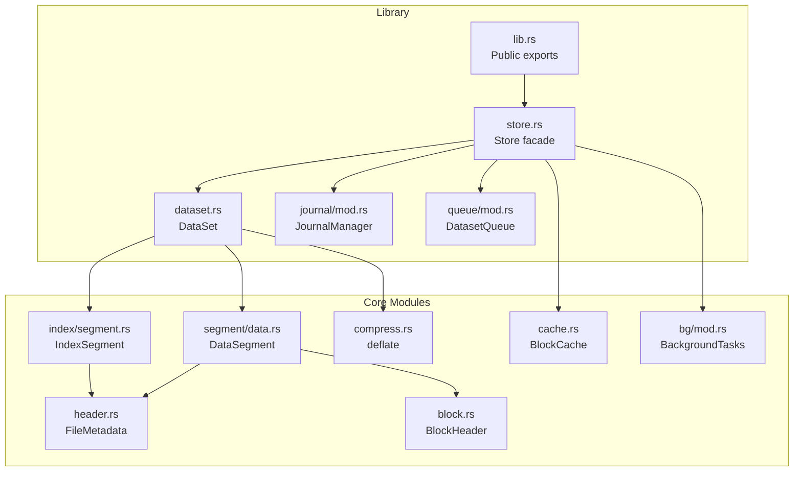
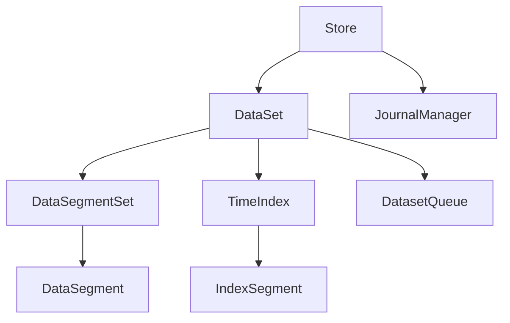
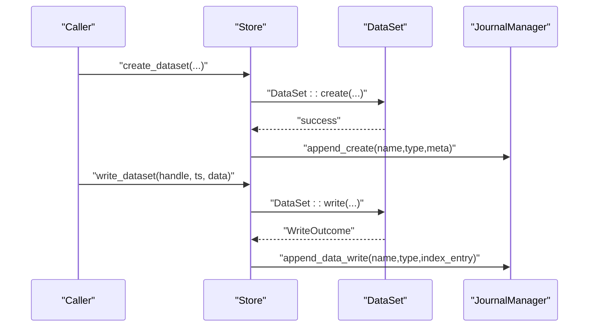
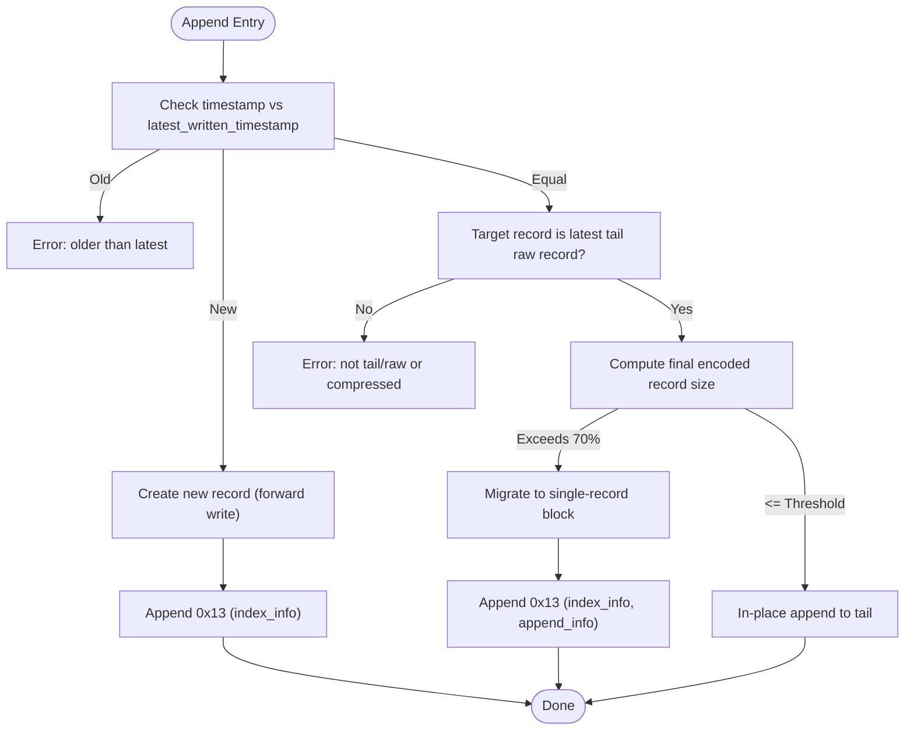
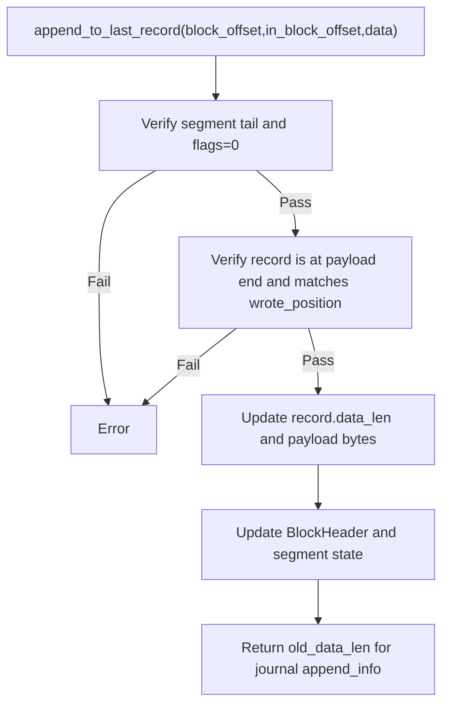
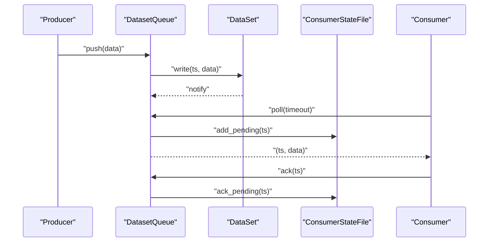
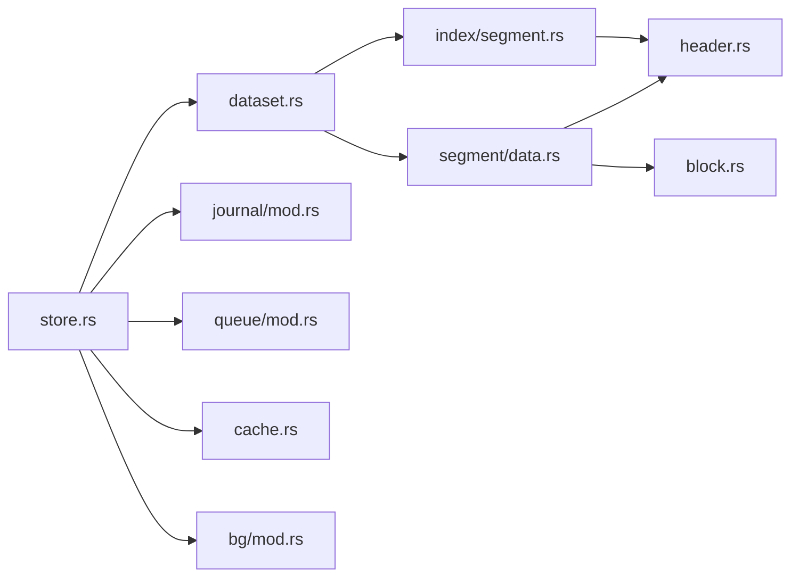

# Design Documents

<cite>
**Referenced Files in This Document**
- [design.md](file://design.md)
- [plan.md](file://plan.md)
- [architecture.md](file://docs/design/architecture.md)
- [design-decisions.md](file://docs/design/design-decisions.md)
- [data-segment.md](file://docs/design/data-segment.md)
- [time-index.md](file://docs/design/time-index.md)
- [phase-01-skeleton.md](file://docs/plan/phase-01-skeleton.md)
- [phase-28-journal.md](file://docs/plan/phase-28-journal.md)
- [phase-29-dataset-append.md](file://docs/plan/phase-29-dataset-append.md)
- [design-review.md](file://docs/review/design-review.md)
- [lib.rs](file://src/lib.rs)
- [store.rs](file://src/store.rs)
- [dataset.rs](file://src/dataset.rs)
- [mod.rs](file://src/journal/mod.rs)
- [mod.rs](file://src/queue/mod.rs)
</cite>

## Table of Contents
1. [Introduction](#introduction)
2. [Project Structure](#project-structure)
3. [Core Components](#core-components)
4. [Architecture Overview](#architecture-overview)
5. [Detailed Component Analysis](#detailed-component-analysis)
6. [Dependency Analysis](#dependency-analysis)
7. [Performance Considerations](#performance-considerations)
8. [Troubleshooting Guide](#troubleshooting-guide)
9. [Conclusion](#conclusion)
10. [Appendices](#appendices)

## Introduction
This document consolidates TimSLite’s design specifications and evolution into a coherent narrative spanning architectural decisions, trade-offs, roadmap, and implementation plans. It connects the high-level design documents with concrete implementation artifacts and outlines how design reviews informed changes, how version compatibility and migration are considered, and how stakeholder feedback shaped the product direction.

## Project Structure
TimSLite is a Rust cdylib providing a high-performance, mmap-backed time-series storage engine with:
- Block-level aggregation and delayed compression
- Time-indexed queries with binary search and optional continuous index
- Dataset lifecycle management (create/open/close/drop)
- Built-in change log (journal) and queue subsystems
- FFI and Python wrapper support

**Diagram sources**
- [lib.rs:1-133](file://src/lib.rs#L1-L133)
- [store.rs:1-681](file://src/store.rs#L1-L681)
- [dataset.rs:1-800](file://src/dataset.rs#L1-L800)
- [mod.rs:1-561](file://src/journal/mod.rs#L1-L561)
- [mod.rs:1-800](file://src/queue/mod.rs#L1-L800)

**Section sources**
- [design.md:1-105](file://design.md#L1-L105)
- [architecture.md:1-133](file://docs/design/architecture.md#L1-L133)

## Core Components
- Store: Top-level facade managing datasets, background tasks, block cache, and journal integration. It enforces dataset lifecycle rules and provides hooks for journal and cache.
- DataSet: Aggregates DataSegmentSet and TimeIndex for a (name, type) pair; implements write, read, query, delete, and append operations with retention and queue integration.
- DataSegmentSet/DataSegment: Manage segmented data files with lazy open/idle-close, pending block sealing, and tail append/migration logic.
- TimeIndex/IndexSegment: Maintain index segments with binary search and optional continuous mode for O(1) lookup.
- JournalManager: Built-in change log dataset (.journal/logs) with record encoding/decoding and queue-based real-time consumption.
- Queue: Multi-consumer-group persistent queue atop datasets with 4KB mmap state files and condvar-based notifications.

**Section sources**
- [store.rs:46-161](file://src/store.rs#L46-L161)
- [dataset.rs:71-218](file://src/dataset.rs#L71-L218)
- [data-segment.md:14-82](file://docs/design/data-segment.md#L14-L82)
- [time-index.md:8-68](file://docs/design/time-index.md#L8-L68)
- [mod.rs:321-494](file://src/journal/mod.rs#L321-L494)
- [mod.rs:380-595](file://src/queue/mod.rs#L380-L595)

## Architecture Overview
The architecture centers on:
- mmap-backed segments for data and index
- Block-level aggregation with delayed compression
- Time-index publishing boundary ensuring visibility ordering
- Store facade coordinating dataset operations, background tasks, and journal/cache
- Optional continuous index for O(1) sparse lookup
- Journal and queue as orthogonal extensions

**Diagram sources**
- [architecture.md:6-24](file://docs/design/architecture.md#L6-L24)
- [store.rs:46-56](file://src/store.rs#L46-L56)
- [dataset.rs:71-82](file://src/dataset.rs#L71-L82)

**Section sources**
- [architecture.md:6-24](file://docs/design/architecture.md#L6-L24)
- [design-decisions.md:3-17](file://docs/design/design-decisions.md#L3-L17)

## Detailed Component Analysis

### Store and Journal Integration
Store coordinates dataset operations and ensures journal hooks are invoked for create/drop/write/delete/append. JournalManager encapsulates the .journal/logs dataset, providing read-only access and queue integration.

**Diagram sources**
- [store.rs:167-226](file://src/store.rs#L167-L226)
- [store.rs:400-431](file://src/store.rs#L400-L431)
- [mod.rs:404-458](file://src/journal/mod.rs#L404-L458)

**Section sources**
- [store.rs:167-226](file://src/store.rs#L167-L226)
- [store.rs:400-431](file://src/store.rs#L400-L431)
- [phase-28-journal.md:14-28](file://docs/plan/phase-28-journal.md#L14-L28)

### Append API and Migration
Append extends DataSet with a new latest-tail append path and a migration threshold that moves records to single-record blocks when approaching 70% of block capacity. Journal records 0x13 capture append outcomes.

**Diagram sources**
- [dataset.rs:332-429](file://src/dataset.rs#L332-L429)
- [phase-29-dataset-append.md:30-42](file://docs/plan/phase-29-dataset-append.md#L30-L42)
- [mod.rs:444-458](file://src/journal/mod.rs#L444-L458)

**Section sources**
- [dataset.rs:332-429](file://src/dataset.rs#L332-L429)
- [phase-29-dataset-append.md:14-22](file://docs/plan/phase-29-dataset-append.md#L14-L22)

### DataSegment Tail Append and Migration
DataSegment validates tail conditions and performs in-place append or migration to a single-record block. It updates block headers and segment state atomically.

**Diagram sources**
- [data-segment.md:257-294](file://docs/design/data-segment.md#L257-L294)

**Section sources**
- [data-segment.md:257-294](file://docs/design/data-segment.md#L257-L294)

### Queue Subsystem Semantics
Queue provides multi-consumer-group semantics with persistent 4KB state files and condvar-based polling. It integrates with dataset write notifications.

**Diagram sources**
- [mod.rs:525-562](file://src/queue/mod.rs#L525-L562)
- [mod.rs:640-708](file://src/queue/mod.rs#L640-L708)

**Section sources**
- [mod.rs:525-562](file://src/queue/mod.rs#L525-L562)
- [mod.rs:640-708](file://src/queue/mod.rs#L640-L708)

## Dependency Analysis
- Store depends on DataSet, JournalManager, BlockCache, and BackgroundTasks.
- DataSet composes DataSegmentSet and TimeIndex and integrates with queue and cache.
- DataSegmentSet and TimeIndex depend on header metadata and mmap utilities.
- JournalManager depends on DataSet for internal dataset operations.
- Queue depends on DataSet and state file persistence.

**Diagram sources**
- [store.rs:1-681](file://src/store.rs#L1-L681)
- [dataset.rs:1-800](file://src/dataset.rs#L1-L800)
- [mod.rs:1-561](file://src/journal/mod.rs#L1-L561)
- [mod.rs:1-800](file://src/queue/mod.rs#L1-L800)

**Section sources**
- [lib.rs:39-72](file://src/lib.rs#L39-L72)

## Performance Considerations
- Block-level aggregation reduces index and filesystem overhead; delayed compression minimizes write-time CPU.
- mmap-backed segments enable zero-copy reads and efficient random access; lazy open/idle-close controls memory footprint.
- Continuous index reduces index file growth and lookup cost at the expense of sparse filler entries.
- Global BlockCache avoids repeated decompression; cache eviction follows LRU with headroom to reduce churn.
- Background tasks batch flushes and idle-close to amortize I/O costs.

[No sources needed since this section provides general guidance]

## Troubleshooting Guide
Common issues and resolutions:
- Journal disabled or misconfigured: Journal hooks become no-op; verify StoreConfig.enable_journal and ensure proper initialization.
- Append failures: Validate timestamp progression, record size limits, and tail conditions; migration occurs above threshold.
- Queue timeouts: Confirm notify mechanism and consumer state file integrity; ensure consumers call ack to advance processed_ts.
- Retention inconsistencies: Ensure retention window aligns with timestamp units and verify daily retention checks.

**Section sources**
- [phase-28-journal.md:70-86](file://docs/plan/phase-28-journal.md#L70-L86)
- [phase-29-dataset-append.md:45-52](file://docs/plan/phase-29-dataset-append.md#L45-L52)
- [mod.rs:296-337](file://src/queue/mod.rs#L296-L337)

## Conclusion
TimSLite balances performance and simplicity through block-level aggregation, delayed compression, and mmap-backed segments. The design emphasizes explicit lifecycle management, robust publication boundaries, and extensibility via journal and queue. The roadmap demonstrates steady evolution across phases, with recent additions for append, journal, and queue enabling real-time ingestion and observability. Design reviews have identified and refined critical cross-cutting concerns, ensuring consistency across documents and implementation.

[No sources needed since this section summarizes without analyzing specific files]

## Appendices

### A. Architectural Decisions and Trade-offs
- Block aggregation vs per-record compression: Improves compression ratio and reduces overhead at the cost of increased write-time CPU when compressing large blocks.
- Delayed compression: Reduces write amplification but increases read-time decompression; acceptable for time-series workloads favoring write throughput.
- Continuous index: Reduces index file size and improves lookup locality; introduces sparse filler entries and requires careful handling of gaps.
- Journal as change log: Provides auditability and real-time consumption without full WAL; consumers must validate against source dataset for hot migration scenarios.
- Queue state files: 4KB fixed-size mmap files simplify durability and enable efficient per-group progress tracking.

**Section sources**
- [design-decisions.md:18-53](file://docs/design/design-decisions.md#L18-L53)

### B. Evolution and Roadmap
Phases completed through dataset append and journal integration demonstrate iterative delivery:
- Skeleton and core modules (Phase 1–9)
- Continuous index and O(1) optimization (Phase 10–11)
- Lazy allocation and query iterator (Phase 12–13)
- Builder and header state split (Phase 14–15)
- Retention and correction/out-of-order features (Phase 16–18)
- Single/latest timestamp reads (Phase 19–20)
- Manual background execution and Python wrapper (Phase 21–22)
- Record length upgrade and sparse continuous index (Phase 23–24)
- Variable-length header and CI/CD (Phase 25–26)
- Queue module and journal (Phase 27–28)
- Dataset append API and journal 0x13 (Phase 29)

**Section sources**
- [plan.md:10-41](file://plan.md#L10-L41)
- [phase-01-skeleton.md:1-126](file://docs/plan/phase-01-skeleton.md#L1-L126)
- [phase-28-journal.md:1-340](file://docs/plan/phase-28-journal.md#L1-L340)
- [phase-29-dataset-append.md:1-140](file://docs/plan/phase-29-dataset-append.md#L1-L140)

### C. Design Review Feedback and Decisions
Key findings and actions:
- Retention unit consistency: Align retention semantics with timestamp units and unify backend calculations to saturating subtraction.
- Wrote position coordinate system: Disambiguate absolute vs relative positions and clarify append/correction logic.
- Journal format limitations: Clarify pointer-based nature and avoid misleading claims of self-contained redo logs; define consumer requirements.
- Append semantics: Define notify behavior for append-created records and clarify behavior for latest timestamp updates.
- Read-only journal restrictions: Extend prohibited operations to include append across all layers.
- Lock hierarchy and queue wait protocol: Clarify lock acquisition order and condvar semantics to prevent deadlocks.

**Section sources**
- [design-review.md:16-290](file://docs/review/design-review.md#L16-L290)

### D. Relationship Between Design and Implementation
- Design documents map directly to modules and APIs:
  - Architecture and design decisions guide module composition and responsibilities.
  - Data segment and time index designs underpin DataSegment and IndexSegment implementations.
  - Journal and queue designs are reflected in JournalManager and DatasetQueue modules.
- Version compatibility and migration:
  - File metadata and header separation enable evolving formats without breaking existing readers.
  - Journal records encode index_info and append_info to bridge API evolution and external consumers.
  - Queue state files maintain a fixed layout to ensure durable progress tracking across versions.

**Section sources**
- [architecture.md:84-114](file://docs/design/architecture.md#L84-L114)
- [data-segment.md:96-120](file://docs/design/data-segment.md#L96-L120)
- [time-index.md:143-164](file://docs/design/time-index.md#L143-L164)
- [mod.rs:158-201](file://src/journal/mod.rs#L158-L201)
- [mod.rs:105-110](file://src/queue/mod.rs#L105-L110)