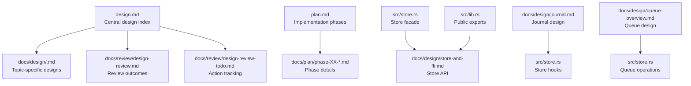
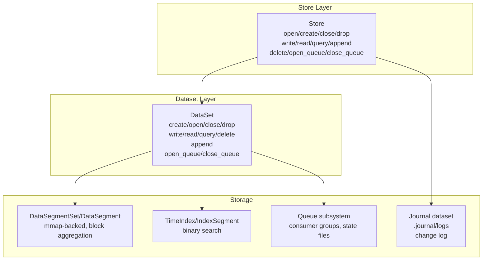
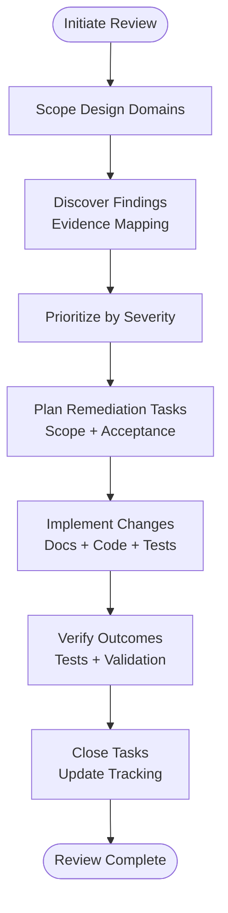
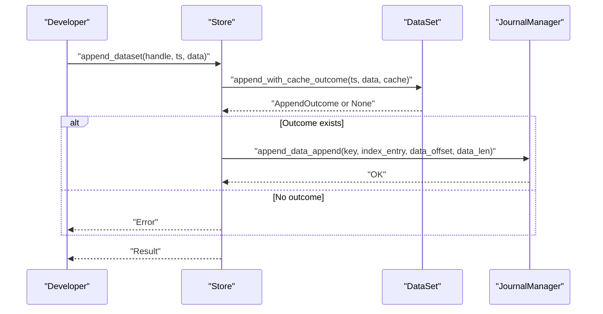
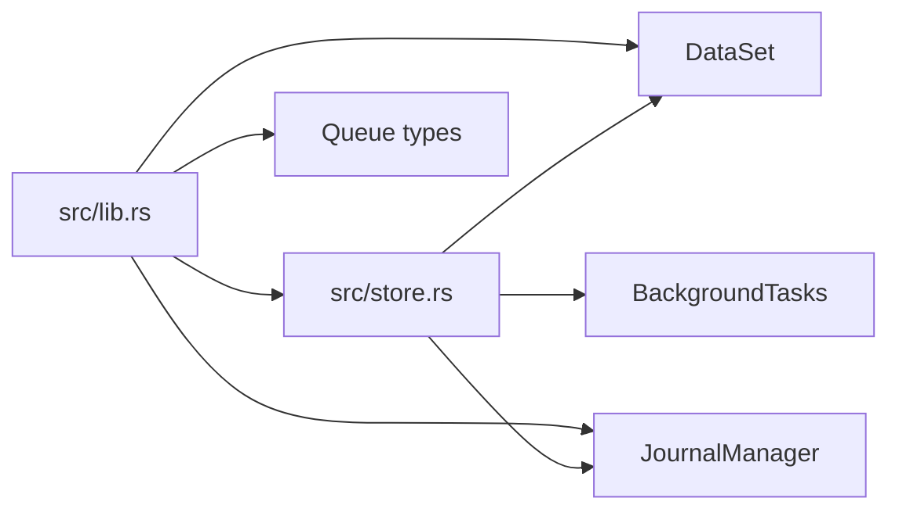

# Design Review and Evolution

<cite>
**Referenced Files in This Document**
- [design.md](file://design.md)
- [architecture.md](file://docs/design/architecture.md)
- [dataset-operations.md](file://docs/design/dataset-operations.md)
- [journal.md](file://docs/design/journal.md)
- [queue-overview.md](file://docs/design/queue-overview.md)
- [design-decisions.md](file://docs/design/design-decisions.md)
- [meta-format.md](file://docs/design/meta-format.md)
- [store-and-ffi.md](file://docs/design/store-and-ffi.md)
- [store.rs](file://src/store.rs)
- [lib.rs](file://src/lib.rs)
- [plan.md](file://plan.md)
- [phase-29-dataset-append.md](file://docs/plan/phase-29-dataset-append.md)
- [design-review.md](file://docs/review/design-review.md)
- [design-review-todo.md](file://docs/review/design-review-todo.md)
- [queue/mod.rs](file://src/queue/mod.rs)
- [journal/mod.rs](file://src/journal/mod.rs)
- [dataset.rs](file://src/dataset.rs)
- [ffi.rs](file://src/ffi.rs)
</cite>

## Update Summary
**Changes Made**
- Added new design review items covering path safety validation for queue group names
- Enhanced journal encoding validation with strict TLV field length limits
- Improved queue coordination validation with proper ordering constraints
- Updated troubleshooting guidance to include path safety and encoding validation requirements

## Table of Contents
1. [Introduction](#introduction)
2. [Project Structure](#project-structure)
3. [Core Components](#core-components)
4. [Architecture Overview](#architecture-overview)
5. [Detailed Component Analysis](#detailed-component-analysis)
6. [Dependency Analysis](#dependency-analysis)
7. [Performance Considerations](#performance-considerations)
8. [Troubleshooting Guide](#troubleshooting-guide)
9. [Conclusion](#conclusion)
10. [Appendices](#appendices)

## Introduction
This document explains TimSLite's design review process and architectural evolution. It documents formal procedures for initiating, iterating, and approving design changes; how stakeholder feedback is incorporated; and how decisions are validated against requirements, technical feasibility, and long-term maintainability. It covers design review cycles, validation criteria, alternatives considered, trade-offs, and final decision rationales. It also describes the relationship between design reviews and implementation changes, version control of design artifacts, and knowledge transfer to development teams. Finally, it outlines lessons learned, recurring design patterns, best practices, and archival/retrieval of design review materials.

## Project Structure
TimSLite organizes design and evolution through:
- Centralized design overview and cross-cutting topics
- Phase-based implementation plans
- Formal design review artifacts and action tracking
- Implementation modules that reflect design decisions

**Diagram sources**
- [design.md:1-105](file://design.md#L1-L105)
- [plan.md:1-122](file://plan.md#L1-L122)
- [store.rs:1-717](file://src/store.rs#L1-L717)
- [lib.rs:1-133](file://src/lib.rs#L1-L133)
- [journal.md:1-200](file://docs/design/journal.md#L1-L200)
- [queue-overview.md:1-200](file://docs/design/queue-overview.md#L1-L200)

**Section sources**
- [design.md:1-105](file://design.md#L1-L105)
- [plan.md:1-122](file://plan.md#L1-L122)

## Core Components
- Design review cycle: Initiation, discovery, prioritization, remediation, verification, closure.
- Stakeholder feedback: Structured findings and tasks with clear owners and acceptance criteria.
- Decision validation: Requirements alignment, feasibility, maintainability, and backward compatibility.
- Implementation linkage: Design-to-code traceability via module boundaries and API surfaces.
- Knowledge transfer: Cross-reference design documents, public API docs, and tests.

**Section sources**
- [design-review.md:1-290](file://docs/review/design-review.md#L1-L290)
- [design-review-todo.md:1-55](file://docs/review/design-review-todo.md#L1-L55)

## Architecture Overview
TimSLite's architecture centers on a Store facade managing datasets, background tasks, caching, and optional journaling. The design emphasizes:
- Mmap-backed segments with variable-length headers and block-level aggregation
- Time-indexed queries and lazy lifecycle management
- Optional journal dataset for change logging and queue consumption
- Queue subsystem for multi-consumer groups with persistent state

**Diagram sources**
- [store.rs:46-706](file://src/store.rs#L46-L706)
- [architecture.md:1-133](file://docs/design/architecture.md#L1-L133)
- [journal.md:25-80](file://docs/design/journal.md#L25-L80)
- [queue-overview.md:18-90](file://docs/design/queue-overview.md#L18-L90)

**Section sources**
- [architecture.md:1-133](file://docs/design/architecture.md#L1-L133)
- [store.rs:46-706](file://src/store.rs#L46-L706)

## Detailed Component Analysis

### Design Review Process and Governance
- Initiation: Reviews focus on specific design domains (e.g., design.md and docs/design/*) and are scoped to avoid modifying code during review.
- Discovery: Findings are categorized by severity (P1/P2), with evidence pointing to specific design documents and implementation risks.
- Prioritization: Severity-driven ordering ensures critical issues are addressed first.
- Remediation: Tasks specify scope, acceptance criteria, and verification steps; often tied to specific files and tests.
- Verification: Tests confirm behavior changes; documentation updates close loop.
- Closure: Completed tasks are marked and tracked in the review TODO list.

**Diagram sources**
- [design-review.md:1-290](file://docs/review/design-review.md#L1-L290)
- [design-review-todo.md:18-55](file://docs/review/design-review-todo.md#L18-L55)

**Section sources**
- [design-review.md:1-290](file://docs/review/design-review.md#L1-L290)
- [design-review-todo.md:1-55](file://docs/review/design-review-todo.md#L1-L55)

### Validation Criteria and Decision Rationale
- Requirements alignment: Ensures field semantics, naming, and units are consistent across documents and code.
- Technical feasibility: Validates coordinate systems, buffer sizes, and concurrency protocols.
- Long-term maintainability: Establishes naming conventions, separation of concerns, and backward-compatible extensions.

Examples:
- Retention window unit consistency and saturation subtraction semantics unify across meta, operations, and background tasks.
- Wrote position coordinate system unification separates on-disk absolute offsets from runtime relative positions.
- Journal v1 boundary clarified as pointer-based auxiliary log, not a self-contained redo log.
- Append semantics integrated with queue notifications and read-only restrictions on internal journal dataset.
- **Updated** Path safety validation now enforces strict naming rules for queue group names and dataset identifiers to prevent path traversal and security vulnerabilities.
- **Updated** Journal encoding validation implements comprehensive TLV field length limits and structural validation to ensure data integrity.
- **Updated** Queue coordination validation establishes proper ordering constraints between append operations and queue notifications.

**Section sources**
- [design-review.md:16-290](file://docs/review/design-review.md#L16-L290)
- [meta-format.md:40-72](file://docs/design/meta-format.md#L40-L72)
- [dataset-operations.md:14-196](file://docs/design/dataset-operations.md#L14-L196)
- [journal.md:5-24](file://docs/design/journal.md#L5-L24)
- [queue-overview.md:32-34](file://docs/design/queue-overview.md#L32-L34)

### Design Alternatives and Trade-offs
- Journal format: Pointer-based vs. self-contained change log. Trade-off: Simpler implementation vs. stronger portability and auditability.
- Single-record flag semantics: Tie to payload size vs. exclusive placement rationale. Trade-off: Consistency vs. clarity of intent.
- Queue notification policy for append: Notify on creation vs. no-op on update. Trade-off: Visibility vs. avoiding redundant delivery.
- **Updated** Path safety validation: Strict validation vs. lenient validation. Trade-off: Security vs. flexibility in naming schemes.

**Section sources**
- [design-review.md:159-180](file://docs/review/design-review.md#L159-L180)
- [journal.md:5-24](file://docs/design/journal.md#L5-L24)
- [design-decisions.md:20-48](file://docs/design/design-decisions.md#L20-L48)

### Relationship Between Reviews and Implementation
- Store facade centralizes hooks for journaling and caching, ensuring all public write-like operations traverse the same path.
- Append API integrates with Store/FFI and journal hooks; tests validate behavior and migration thresholds.
- Queue integration respects append semantics and maintains isolation of internal journal dataset.
- **Updated** Queue operations now include comprehensive path safety validation through dedicated validation functions.
- **Updated** Journal encoding includes strict TLV validation with configurable length limits for different field types.

**Diagram sources**
- [store.rs:433-472](file://src/store.rs#L433-L472)
- [journal.md:177-200](file://docs/design/journal.md#L177-L200)
- [phase-29-dataset-append.md:73-87](file://docs/plan/phase-29-dataset-append.md#L73-L87)

**Section sources**
- [store.rs:433-472](file://src/store.rs#L433-L472)
- [phase-29-dataset-append.md:1-140](file://docs/plan/phase-29-dataset-append.md#L1-L140)

### Version Control of Design Artifacts
- Design documents are maintained under docs/design/ with cross-references in design.md.
- Review outcomes and tasks are tracked in docs/review/.
- Implementation is linked to design via module boundaries and public API exports.

**Section sources**
- [design.md:8-32](file://design.md#L8-L32)
- [design-review.md:1-290](file://docs/review/design-review.md#L1-L290)
- [lib.rs:59-87](file://src/lib.rs#L59-L87)

### Knowledge Transfer to Development Teams
- Public API documentation and design references guide developers.
- Phase plans and design decisions consolidate rationale and patterns.
- Tests validate behavior and serve as executable specifications.

**Section sources**
- [store-and-ffi.md:36-47](file://docs/design/store-and-ffi.md#L36-L47)
- [design-decisions.md:18-53](file://docs/design/design-decisions.md#L18-L53)
- [phase-29-dataset-append.md:98-118](file://docs/plan/phase-29-dataset-append.md#L98-L118)

### Lessons Learned and Best Practices
- Unify semantics early: Resolve unit and coordinate system conflicts before implementation.
- Define boundaries explicitly: Clarify journal scope and internal dataset protections.
- Maintain naming consistency: Disambiguate flags and coordinates to prevent misinterpretation.
- Validate concurrency protocols: Document and test lock/unlock sequences and condition variable usage.
- Protect internal datasets: Enforce read-only constraints across all public entry points.
- **Updated** Implement comprehensive input validation: Enforce strict naming rules and length limits for all external inputs.
- **Updated** Validate data encoding: Implement structured validation for binary formats with configurable limits.
- **Updated** Establish ordering guarantees: Define clear precedence between operations to prevent inconsistent states.

**Section sources**
- [design-review.md:16-290](file://docs/review/design-review.md#L16-L290)
- [queue-overview.md:242-264](file://docs/design/queue-overview.md#L242-L264)

## Dependency Analysis
Design decisions influence module dependencies and public APIs. The Store facade depends on DataSet, JournalManager, and background tasks; public APIs are exported via lib.rs and documented in store-and-ffi.md.

**Diagram sources**
- [store.rs:14-17](file://src/store.rs#L14-L17)
- [lib.rs:59-72](file://src/lib.rs#L59-L72)

**Section sources**
- [store.rs:14-17](file://src/store.rs#L14-L17)
- [lib.rs:59-72](file://src/lib.rs#L59-L72)

## Performance Considerations
- Append threshold and migration: Balances in-place growth with single-record block overhead.
- Journal overhead: Pointer-based records minimize payload duplication while preserving auditability.
- Queue wait protocol: Optimizes lock acquisition and condition variable usage to reduce contention.
- **Updated** Validation overhead: Input validation adds minimal performance cost compared to the benefits of preventing security vulnerabilities and data corruption.

## Troubleshooting Guide
Common issues and resolutions derived from design reviews:
- Retention window unit mismatch: Align all references to timestamp unit semantics and replace non-saturating subtraction with saturating arithmetic.
- Wrote position ambiguity: Use distinct names for on-disk absolute and runtime relative positions; enforce coordinate consistency in tail checks.
- Journal completeness: Clarify pointer-based nature; require consumers to fetch payloads via index_info from the source dataset.
- Append queue behavior: Define notification semantics for new vs. updated latest timestamps; ensure consistency across journal and dataset queues.
- Read-only protection: Extend prohibited operations to include append for internal journal dataset across all public entry points.
- Group name safety: Apply dataset path safety rules to queue group names to prevent path traversal and invalid identifiers.
- **Updated** Path safety violations: Queue operations now validate group names against strict regex patterns and reject potentially dangerous characters.
- **Updated** Journal encoding errors: TLV field validation ensures all encoded data meets length and format requirements before processing.
- **Updated** Queue coordination failures: Proper ordering validation prevents race conditions between append operations and queue notifications.

**Section sources**
- [design-review.md:16-290](file://docs/review/design-review.md#L16-L290)
- [journal.md:5-24](file://docs/design/journal.md#L5-L24)
- [queue-overview.md:32-34](file://docs/design/queue-overview.md#L32-L34)

## Conclusion
TimSLite's design review process ensures rigorous validation of changes against requirements, feasibility, and maintainability. By linking reviews to implementation, enforcing explicit boundaries, and documenting trade-offs, the project sustains architectural coherence while evolving rapidly. The archival of review outcomes and action tracking provides historical continuity and facilitates knowledge transfer across teams. Recent enhancements in path safety validation, journal encoding validation, and queue coordination improvements strengthen the system's security posture and operational reliability.

## Appendices

### Appendix A: Design Review Cycle Summary
- Initial review: Scope design domains and capture findings.
- Iteration: Prioritize, remediate, and verify changes.
- Final approval: Close tasks, update tracking, and publish outcomes.

**Section sources**
- [design-review.md:1-290](file://docs/review/design-review.md#L1-L290)
- [design-review-todo.md:18-55](file://docs/review/design-review-todo.md#L18-L55)

### Appendix B: Design Alternatives and Decisions
- Journal format: Pointer-based auxiliary log with explicit limitations.
- Single-record semantics: Exclusive placement rationale independent of payload size.
- Queue notification: Distinct policies for new creation and latest updates.
- **Updated** Path safety validation: Strict enforcement of naming rules for all external inputs.

**Section sources**
- [design-review.md:159-180](file://docs/review/design-review.md#L159-L180)
- [journal.md:5-24](file://docs/design/journal.md#L5-L24)

### Appendix C: Archiving and Retrieval of Materials
- Central design index: design.md
- Topic-specific designs: docs/design/*
- Review outcomes: docs/review/design-review.md
- Action tracking: docs/review/design-review-todo.md
- Implementation plans: docs/plan/phase-XX-*.md

**Section sources**
- [design.md:8-32](file://design.md#L8-L32)
- [plan.md:70-122](file://plan.md#L70-L122)
- [design-review.md:1-290](file://docs/review/design-review.md#L1-L290)
- [design-review-todo.md:1-55](file://docs/review/design-review-todo.md#L1-L55)

### Appendix D: Updated Validation Specifications

#### Path Safety Validation
Queue group names and dataset identifiers now undergo strict validation:
- Non-empty string validation
- Maximum length enforcement (255 bytes)
- Character set restriction: `^[0-9A-Za-z_-]+$`
- Path traversal prevention: Rejects `.`, `..`, `/`, `\` characters
- Control character filtering: Prevents whitespace and non-printable characters
- Windows reserved name protection: Blocks reserved filenames

#### Journal Encoding Validation
TLV (Type-Length-Value) encoding includes comprehensive validation:
- Text field length limits: Configurable maximum per field type
- TLV value length constraints: Prevents oversized payloads
- TLV list size limits: Controls total encoded record size
- Binary field validation: Ensures proper fixed-length encoding
- Field presence requirements: Validates mandatory fields for each record type

#### Queue Coordination Validation
Operation ordering and state validation:
- Append operation precedence: Timestamp validation before data processing
- Queue state consistency: Prevents concurrent access violations
- Notification ordering: Ensures proper sequencing between operations
- Resource cleanup: Validates proper queue shutdown and resource release

**Section sources**
- [queue/mod.rs:59](file://src/queue/mod.rs#L59)
- [journal/mod.rs:328-356](file://src/journal/mod.rs#L328-L356)
- [store.rs:31-33](file://src/store.rs#L31-L33)