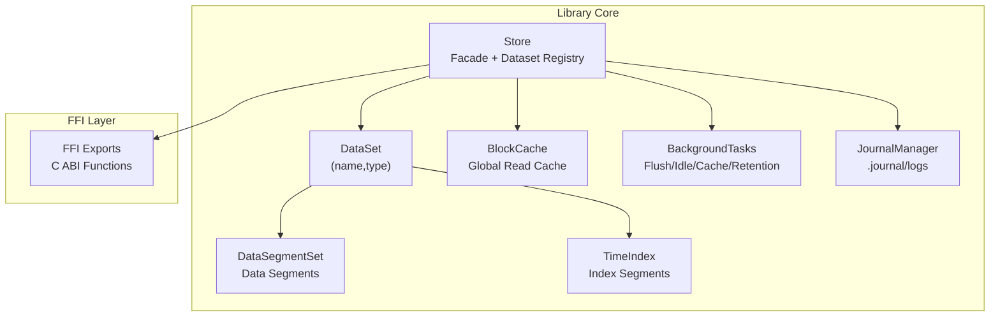
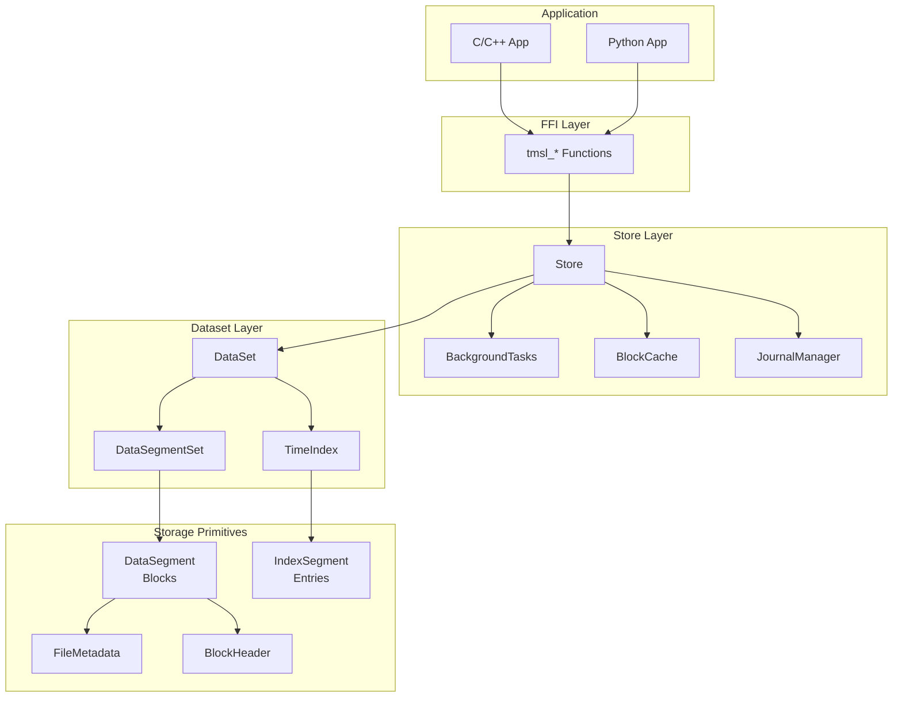
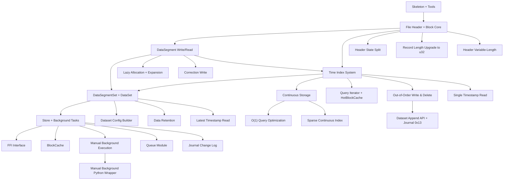
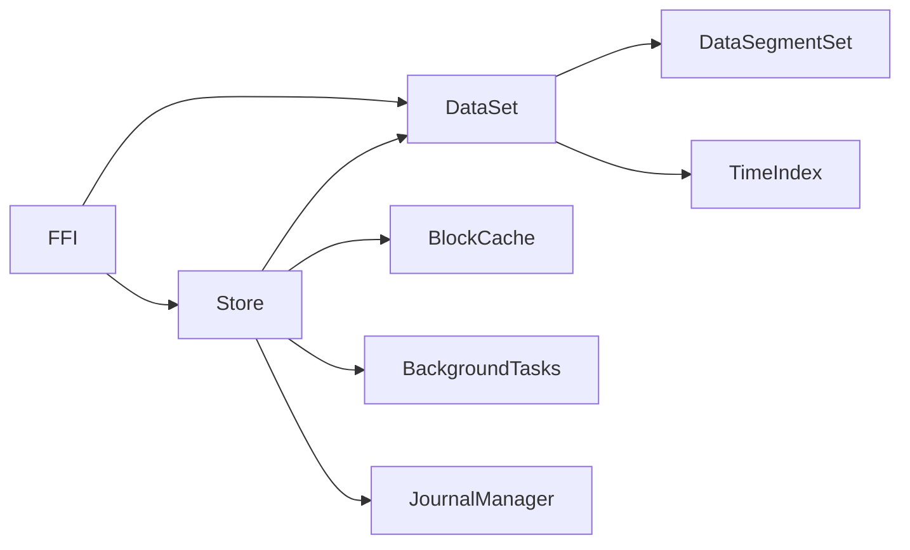

# Implementation Plans and Roadmap

<cite>
**Referenced Files in This Document**
- [plan.md](file://plan.md)
- [design.md](file://design.md)
- [overview.md](file://docs/plan/overview.md)
- [phase-01-skeleton.md](file://docs/plan/phase-01-skeleton.md)
- [phase-02-header-block.md](file://docs/plan/phase-02-header-block.md)
- [phase-03-datasegment.md](file://docs/plan/phase-03-datasegment.md)
- [phase-04-time-index.md](file://docs/plan/phase-04-time-index.md)
- [phase-05-dataset.md](file://docs/plan/phase-05-dataset.md)
- [phase-06-store-bg.md](file://docs/plan/phase-06-store-bg.md)
- [phase-07-ffi.md](file://docs/plan/phase-07-ffi.md)
- [phase-08-tests-perf.md](file://docs/plan/phase-08-tests-perf.md)
- [phase-09-blockcache.md](file://docs/plan/phase-09-blockcache.md)
- [phase-10-continuous-storage.md](file://docs/plan/phase-10-continuous-storage.md)
- [phase-11-o1-optimization.md](file://docs/plan/phase-11-o1-optimization.md)
- [phase-12-lazy-allocation.md](file://docs/plan/phase-12-lazy-allocation.md)
- [phase-13-query-iterator.md](file://docs/plan/phase-13-query-iterator.md)
- [phase-14-dataset-config-builder.md](file://docs/plan/phase-14-dataset-config-builder.md)
- [phase-15-header-state-split.md](file://docs/plan/phase-15-header-state-split.md)
- [phase-16-data-retention.md](file://docs/plan/phase-16-data-retention.md)
- [phase-17-correction-write.md](file://docs/plan/phase-17-correction-write.md)
- [phase-18-out-of-order-write-and-delete.md](file://docs/plan/phase-18-out-of-order-write-and-delete.md)
- [phase-19-single-timestamp-read.md](file://docs/plan/phase-19-single-timestamp-read.md)
- [phase-20-latest-timestamp-read.md](file://docs/plan/phase-20-latest-timestamp-read.md)
- [phase-21-manual-bg-execution.md](file://docs/plan/phase-21-manual-bg-execution.md)
- [phase-22-manual-bg-python-wrapper.md](file://docs/plan/phase-22-manual-bg-python-wrapper.md)
- [phase-23-record-length-u32.md](file://docs/plan/phase-23-record-length-u32.md)
- [phase-24-sparse-continuous-index.md](file://docs/plan/phase-24-sparse-continuous-index.md)
- [phase-25-header-variable-length.md](file://docs/plan/phase-25-header-variable-length.md)
- [phase-26-github-actions-ci.md](file://docs/plan/phase-26-github-actions-ci.md)
- [phase-27-queue-module.md](file://docs/plan/phase-27-queue-module.md)
- [phase-28-journal.md](file://docs/plan/phase-28-journal.md)
- [phase-29-dataset-append.md](file://docs/plan/phase-29-dataset-append.md)
- [lib.rs](file://src/lib.rs)
- [store.rs](file://src/store.rs)
- [dataset.rs](file://src/dataset.rs)
- [ffi.rs](file://src/ffi.rs)
- [config.rs](file://src/config.rs)
- [architecture.md](file://docs/design/architecture.md)
- [data-model.md](file://docs/design/data-model.md)
- [store-and-ffi.md](file://docs/design/store-and-ffi.md)
- [background-and-cache.md](file://docs/design/background-and-cache.md)
- [time-index.md](file://docs/design/time-index.md)
</cite>

## Table of Contents
1. [Introduction](#introduction)
2. [Project Structure](#project-structure)
3. [Core Components](#core-components)
4. [Architecture Overview](#architecture-overview)
5. [Detailed Component Analysis](#detailed-component-analysis)
6. [Dependency Analysis](#dependency-analysis)
7. [Performance Considerations](#performance-considerations)
8. [Troubleshooting Guide](#troubleshooting-guide)
9. [Conclusion](#conclusion)
10. [Appendices](#appendices)

## Introduction
This document presents a comprehensive implementation plan and roadmap for TimSLite, a high-performance, mmap-backed time-series data storage library with C ABI FFI. It chronicles the development phases from skeleton implementation through full feature completion, detailing objectives, milestones, deliverables, sequential dependencies, technical challenges, timeline expectations, resource requirements, risk mitigation strategies, and quality assurance practices. The plan covers the evolution from basic storage functionality to advanced capabilities such as continuous storage, out-of-order writes, and manual background execution, along with version compatibility and backward compatibility guarantees.

## Project Structure
TimSLite is organized as a Rust cdylib with a modular architecture supporting dataset-level isolation, memory-mapped I/O, time-indexed queries, background tasks, and a robust FFI surface for cross-language integration. The design emphasizes separation of concerns across modules for store management, dataset lifecycle, segment management, indexing, caching, background tasks, and FFI bindings.

**Diagram sources**
- [architecture.md: 6-24:6-24](file://docs/design/architecture.md#L6-L24)
- [lib.rs: 38-57:38-57](file://src/lib.rs#L38-L57)

**Section sources**
- [architecture.md: 6-24:6-24](file://docs/design/architecture.md#L6-L24)
- [lib.rs: 38-57:38-57](file://src/lib.rs#L38-L57)

## Core Components
- Store: Top-level facade managing datasets, background tasks, global cache, and journal. Provides create/open/close/drop APIs and FFI entry points.
- DataSet: Aggregates DataSegmentSet and TimeIndex for a (name, type) pair, encapsulating dataset lifecycle and operations.
- DataSegmentSet/DataSegment: Manages segmented data files with lazy open/close, pending block recovery, and block aggregation with delayed compression.
- TimeIndex/IndexSegment: Maintains time-indexed entries with binary search and optional continuous storage mode for O(1) lookup.
- BlockCache: Global LRU cache for decompressed block payloads with idle eviction.
- BackgroundTasks: Unified executor for flush, idle-close, cache eviction, and retention reclaim.
- JournalManager: Built-in change log dataset for operational auditing and real-time consumption.
- FFI: C-compatible API exposing store, dataset, and query operations with opaque handles and error reporting.

**Section sources**
- [store.rs: 46-56:46-56](file://src/store.rs#L46-L56)
- [dataset.rs: 71-82:71-82](file://src/dataset.rs#L71-L82)
- [background-and-cache.md: 65-72:65-72](file://docs/design/background-and-cache.md#L65-L72)
- [store-and-ffi.md: 25-69:25-69](file://docs/design/store-and-ffi.md#L25-L69)

## Architecture Overview
The system follows a layered architecture:
- Application layer: FFI consumers (C/C++, Python) interact via tmsl_* functions.
- Store layer: Central coordinator for datasets, background tasks, cache, and journal.
- Dataset layer: Encapsulates DataSegmentSet and TimeIndex for a specific (name, type).
- Storage primitives: DataSegment (blocks), IndexSegment (entries), FileMetadata, BlockHeader.
- Persistence: mmap-backed files with TLV-based metadata and variable-length headers.

**Diagram sources**
- [store-and-ffi.md: 232-333:232-333](file://docs/design/store-and-ffi.md#L232-L333)
- [store.rs: 46-56:46-56](file://src/store.rs#L46-L56)
- [dataset.rs: 71-82:71-82](file://src/dataset.rs#L71-L82)

## Detailed Component Analysis

### Phase 1: Skeleton + Basic Tools
- Objective: Establish project scaffolding, compile pipeline, and foundational utilities.
- Deliverables: Cargo project with cdylib target, module structure, endian utilities, error types, and basic constants.
- Dependencies: None (standalone bootstrap).
- Technical challenges: Ensuring cross-platform mmap behavior and consistent byte order handling.
- Timeline: 1-2 weeks.
- Resources: Rust toolchain, memmap2, miniz_oxide, log, libc.
- Risks: Platform-specific mmap semantics; mitigate by validating on Windows early.

**Section sources**
- [phase-01-skeleton.md: 7-42:7-42](file://docs/plan/phase-01-skeleton.md#L7-L42)
- [phase-01-skeleton.md: 72-122:72-122](file://docs/plan/phase-01-skeleton.md#L72-L122)

### Phase 2: File Header + Block Core
- Objective: Implement FileMetadata serialization/deserialization and BlockHeader operations.
- Deliverables: FileMetadata struct with meta/state separation, BlockHeader with flags, compression helpers.
- Dependencies: Phase 1.
- Technical challenges: Variable-length headers, state vs meta separation, endian encoding.
- Timeline: 1 week.
- Resources: miniz_oxide for compression wrappers.

**Section sources**
- [phase-02-header-block.md: 7-38:7-38](file://docs/plan/phase-02-header-block.md#L7-L38)
- [phase-02-header-block.md: 40-66:40-66](file://docs/plan/phase-02-header-block.md#L40-L66)

### Phase 3: DataSegment Write/Read
- Objective: Implement DataSegment lifecycle, block aggregation, lazy open/close, and recovery.
- Deliverables: DataSegment creation/open, pending block sealing, compression, and crash recovery.
- Dependencies: Phase 2.
- Technical challenges: Pending block recovery, mmap synchronization, and lifecycle transitions.
- Timeline: 2-3 weeks.

**Section sources**
- [phase-03-datasegment.md: 7-32:7-32](file://docs/plan/phase-03-datasegment.md#L7-L32)
- [phase-03-datasegment.md: 34-82:34-82](file://docs/plan/phase-03-datasegment.md#L34-L82)

### Phase 4: Time Index System
- Objective: Implement TimeIndex and IndexSegment with binary search and lifecycle.
- Deliverables: IndexEntry definition, segment append/query, and loading logic.
- Dependencies: Phase 2.
- Technical challenges: Binary search correctness, segment routing, and memory buffering.

**Section sources**
- [phase-04-time-index.md: 7-32:7-32](file://docs/plan/phase-04-time-index.md#L7-L32)
- [phase-04-time-index.md: 34-56:34-56](file://docs/plan/phase-04-time-index.md#L34-L56)

### Phase 5: DataSegmentSet + DataSet
- Objective: Aggregate DataSegmentSet and TimeIndex into DataSet with CRUD lifecycle.
- Deliverables: DataSet create/open/close/drop, parameter immutability via meta, and directory layout.
- Dependencies: Phases 3 and 4.
- Technical challenges: Directory structure migration, meta immutability, and concurrent access.

**Section sources**
- [phase-05-dataset.md: 7-20:7-20](file://docs/plan/phase-05-dataset.md#L7-L20)
- [phase-05-dataset.md: 25-83:25-83](file://docs/plan/phase-05-dataset.md#L25-L83)

### Phase 6: Store + Background Tasks
- Objective: Implement Store facade, background task executor, and cache initialization.
- Deliverables: Store open/create/open/close/drop, background thread/manual tick, and cache integration.
- Dependencies: Phase 5.
- Technical challenges: Unified executor pattern, race conditions on idle-close, and retention scheduling.

**Section sources**
- [phase-06-store-bg.md: 1-200:1-200](file://docs/plan/phase-06-store-bg.md#L1-L200)
- [background-and-cache.md: 65-211:65-211](file://docs/design/background-and-cache.md#L65-L211)

### Phase 7: FFI Interface
- Objective: Provide C ABI-compatible API for store and dataset operations.
- Deliverables: tmsl_store_* and tmsl_dataset_* functions, opaque handles, error handling, and memory ownership rules.
- Dependencies: Phase 6.
- Technical challenges: Panic catching, memory allocation/free, and handle lifecycle enforcement.

**Section sources**
- [phase-07-ffi.md: 1-200:1-200](file://docs/plan/phase-07-ffi.md#L1-L200)
- [store-and-ffi.md: 232-333:232-333](file://docs/design/store-and-ffi.md#L232-L333)

### Phase 8: Integration Tests + Performance Tuning
- Objective: Comprehensive integration testing and performance benchmarking.
- Deliverables: Test coverage for all major flows, performance baselines, and platform validation.
- Dependencies: Phase 7.
- Technical challenges: Cross-platform memory safety validation, benchmark harness setup.

**Section sources**
- [phase-08-tests-perf.md: 1-200:1-200](file://docs/plan/phase-08-tests-perf.md#L1-L200)

### Phase 9: BlockCache
- Objective: Implement global read cache with LRU and idle eviction.
- Deliverables: BlockCache with statistics, eviction policies, and integration with reads.
- Dependencies: Phase 6.
- Technical challenges: Memory footprint control, cache invalidation on writes/deletes.

**Section sources**
- [phase-09-blockcache.md: 1-200:1-200](file://docs/plan/phase-09-blockcache.md#L1-L200)
- [background-and-cache.md: 326-431:326-431](file://docs/design/background-and-cache.md#L326-L431)

### Phase 10: Continuous Storage
- Objective: Enable continuous storage mode for sparse, grid-aligned index segments.
- Deliverables: Base timestamp initialization, segment capacity calculation, and sparse filler logic.
- Dependencies: Phase 4.
- Technical challenges: Sparse materialization boundaries and logical holes.

**Section sources**
- [phase-10-continuous-storage.md: 1-200:1-200](file://docs/plan/phase-10-continuous-storage.md#L1-L200)
- [time-index.md: 181-202:181-202](file://docs/design/time-index.md#L181-L202)

### Phase 11: O(1) Query Optimization
- Objective: Optimize index lookup to constant time in continuous mode.
- Deliverables: Direct lookup calculations and continuous segment indexing.
- Dependencies: Phase 10.

**Section sources**
- [phase-11-o1-optimization.md: 1-200:1-200](file://docs/plan/phase-11-o1-optimization.md#L1-L200)
- [time-index.md: 170-178:170-178](file://docs/design/time-index.md#L170-L178)

### Phase 12: Lazy Allocation + Expansion
- Objective: Implement initial small allocations with 2x expansion up to configured limits.
- Deliverables: Initial size configuration, expansion triggers, and disk-space efficiency.
- Dependencies: Phase 3.

**Section sources**
- [phase-12-lazy-allocation.md: 1-200:1-200](file://docs/plan/phase-12-lazy-allocation.md#L1-L200)
- [data-model.md: 18-26:18-26](file://docs/design/data-model.md#L18-L26)

### Phase 13: Query Iterator + HotBlockCache
- Objective: Provide virtual iterators and local hot block caching for efficient traversal.
- Deliverables: QueryIterator with source cursors and HotBlockCache for intra-query reuse.
- Dependencies: Phase 4.

**Section sources**
- [phase-13-query-iterator.md: 1-200:1-200](file://docs/plan/phase-13-query-iterator.md#L1-L200)

### Phase 14: Dataset Config Builder
- Objective: Enhance dataset creation with a builder pattern inheriting store defaults.
- Deliverables: DataSetConfigBuilder and integration with StoreConfig.
- Dependencies: Phase 5.

**Section sources**
- [phase-14-dataset-config-builder.md: 1-200:1-200](file://docs/plan/phase-14-dataset-config-builder.md#L1-L200)
- [config.rs: 258-345:258-345](file://src/config.rs#L258-L345)

### Phase 15: Header State Split
- Objective: Separate data segment and index segment state fields for clarity and future extensibility.
- Deliverables: Updated FileMetadata with differentiated state layouts.
- Dependencies: Phase 2.

**Section sources**
- [phase-15-header-state-split.md: 1-200:1-200](file://docs/plan/phase-15-header-state-split.md#L1-L200)
- [data-model.md: 141-224:141-224](file://docs/design/data-model.md#L141-L224)

### Phase 16: Data Retention
- Objective: Implement retention window and daily reclaim process.
- Deliverables: Retention configuration, scheduled reclaim, and segment deletion.
- Dependencies: Phase 5.

**Section sources**
- [phase-16-data-retention.md: 1-200:1-200](file://docs/plan/phase-16-data-retention.md#L1-L200)
- [background-and-cache.md: 100-150:100-150](file://docs/design/background-and-cache.md#L100-L150)

### Phase 17: Correction Write
- Objective: Support in-place overwrite of the latest pending raw block for correction scenarios.
- Deliverables: Overwrite logic, fallback to out-of-order write, and cache invalidation.
- Dependencies: Phase 3.

**Section sources**
- [phase-17-correction-write.md: 1-200:1-200](file://docs/plan/phase-17-correction-write.md#L1-L200)
- [dataset.rs: 478-523:478-523](file://src/dataset.rs#L478-L523)

### Phase 18: Out-of-Order Write & Delete
- Objective: Allow writing/deleting at timestamps earlier than the latest, updating existing index entries.
- Deliverables: Update entry logic, delete sentinel handling, and invalid record counting.
- Dependencies: Phase 3 and 4.

**Section sources**
- [phase-18-out-of-order-write-and-delete.md: 1-200:1-200](file://docs/plan/phase-18-out-of-order-write-and-delete.md#L1-L200)
- [dataset.rs: 441-476:441-476](file://src/dataset.rs#L441-L476)

### Phase 19: Single Timestamp Read
- Objective: Add exact timestamp read capability with latest fallback semantics.
- Deliverables: read(timestamp) API and latest timestamp resolution.
- Dependencies: Phase 4.

**Section sources**
- [phase-19-single-timestamp-read.md: 1-200:1-200](file://docs/plan/phase-19-single-timestamp-read.md#L1-L200)
- [dataset.rs: 586-627:586-627](file://src/dataset.rs#L586-L627)

### Phase 20: Latest Timestamp Read
- Objective: Provide latest_written_timestamp retrieval for monitoring and downstream decisions.
- Deliverables: latest_written_timestamp API and integration with FFI.
- Dependencies: Phase 5.

**Section sources**
- [phase-20-latest-timestamp-read.md: 1-200:1-200](file://docs/plan/phase-20-latest-timestamp-read.md#L1-L200)
- [store-and-ffi.md: 310-312:310-312](file://docs/design/store-and-ffi.md#L310-L312)

### Phase 21: Manual Background Execution
- Objective: Enable external event loops to drive background tasks via manual tick.
- Deliverables: tick_background_tasks and next_background_delay APIs.
- Dependencies: Phase 6.

**Section sources**
- [phase-21-manual-bg-execution.md: 1-200:1-200](file://docs/plan/phase-21-manual-bg-execution.md#L1-L200)
- [background-and-cache.md: 212-296:212-296](file://docs/design/background-and-cache.md#L212-L296)

### Phase 22: Manual Background Python Wrapper
- Objective: Bind manual background execution to Python for external control.
- Deliverables: Python bindings for tick and delay queries.
- Dependencies: Phase 21.

**Section sources**
- [phase-22-manual-bg-python-wrapper.md: 1-200:1-200](file://docs/plan/phase-22-manual-bg-python-wrapper.md#L1-L200)

### Phase 23: Record Length Upgrade to u32
- Objective: Increase record header data_len from u16 to u32 for larger payloads.
- Deliverables: Updated record encoding, header layout, and validation.
- Dependencies: Phase 2.

**Section sources**
- [phase-23-record-length-u32.md: 1-200:1-200](file://docs/plan/phase-23-record-length-u32.md#L1-L200)
- [data-model.md: 63-80:63-80](file://docs/design/data-model.md#L63-L80)

### Phase 24: Sparse Continuous Index
- Objective: Refine continuous mode to avoid filler explosion by materializing only boundary segments.
- Deliverables: Sparse filler logic and continuous segment management.
- Dependencies: Phase 10.

**Section sources**
- [phase-24-sparse-continuous-index.md: 1-200:1-200](file://docs/plan/phase-24-sparse-continuous-index.md#L1-L200)
- [time-index.md: 181-202:181-202](file://docs/design/time-index.md#L181-L202)

### Phase 25: Header Variable-Length
- Objective: Support dynamic header lengths via computed header_len for forward compatibility.
- Deliverables: Runtime header_len computation and meta/state separation.
- Dependencies: Phase 2.

**Section sources**
- [phase-25-header-variable-length.md: 1-200:1-200](file://docs/plan/phase-25-header-variable-length.md#L1-L200)
- [data-model.md: 210-224:210-224](file://docs/design/data-model.md#L210-L224)

### Phase 26: GitHub Actions CI/CD
- Objective: Automate testing, linting, and matrix builds across Python versions.
- Deliverables: CI workflows, test matrices, and release automation.
- Dependencies: All prior phases.

**Section sources**
- [phase-26-github-actions-ci.md: 1-200:1-200](file://docs/plan/phase-26-github-actions-ci.md#L1-L200)

### Phase 27: Queue Module
- Objective: Implement dataset queue subsystem with consumer groups and state persistence.
- Deliverables: DatasetQueue, DatasetQueueConsumer, and state file management.
- Dependencies: Phase 5.

**Section sources**
- [phase-27-queue-module.md: 1-200:1-200](file://docs/plan/phase-27-queue-module.md#L1-L200)

### Phase 28: Journal Change Log
- Objective: Add built-in .journal/logs dataset for operational auditing and real-time consumption.
- Deliverables: JournalManager, record encoder/decoder, and store hooks.
- Dependencies: Phase 6.

**Section sources**
- [phase-28-journal.md: 1-200:1-200](file://docs/plan/phase-28-journal.md#L1-L200)

### Phase 29: Dataset Append API + Journal 0x13
- Objective: Enable safe tail append with migration thresholds and journal logging.
- Deliverables: Append API, migration logic, and journal record type 0x13.
- Dependencies: Phase 18 and 28.

**Section sources**
- [phase-29-dataset-append.md: 1-200:1-200](file://docs/plan/phase-29-dataset-append.md#L1-L200)

### Conceptual Overview
The development follows a sequential dependency graph where foundational modules (headers, blocks, segments) underpin higher-level constructs (indices, datasets, store), culminating in FFI and operational features (queues, journal, background execution).

**Diagram sources**
- [overview.md: 57-148:57-148](file://docs/plan/overview.md#L57-L148)

## Dependency Analysis
- Coupling: Store depends on DataSet, DataSegmentSet, TimeIndex, BlockCache, BackgroundTasks, and Journal. FFI depends on Store and DataSet.
- Cohesion: Each phase introduces cohesive functionality grouped by responsibility (storage primitives, indexing, lifecycle, background, FFI).
- External dependencies: memmap2 for mmap, miniz_oxide for compression, log for structured logging, libc for FFI interop.
- Risk mitigation: Unified executor prevents race conditions; meta immutability ensures backward compatibility; variable-length headers support future extensions.

**Diagram sources**
- [store.rs: 46-56:46-56](file://src/store.rs#L46-L56)
- [ffi.rs: 10-16:10-16](file://src/ffi.rs#L10-L16)

**Section sources**
- [store.rs: 46-56:46-56](file://src/store.rs#L46-L56)
- [ffi.rs: 10-16:10-16](file://src/ffi.rs#L10-L16)

## Performance Considerations
- Memory mapping: mmap for zero-copy reads; flush only for durability; idle-close reduces memory footprint.
- Compression: Block-level delayed compression with configurable levels; global cache avoids repeated decompression.
- Indexing: Binary search for non-continuous mode; O(1) direct lookup for continuous mode with sparse filler.
- Background tasks: Unified executor minimizes overhead; dynamic wake-up avoids polling.
- I/O patterns: Sequential writes to segments; batched flushes; minimal random access.

[No sources needed since this section provides general guidance]

## Troubleshooting Guide
- FFI panics: All FFI functions are wrapped with panic catching; inspect error buffers for details.
- Handle lifecycle violations: Closing store with active child handles or closing dataset with active iterators returns errors.
- Background task races: Use tick_background_tasks for external loops; rely on unified executor state for consistency.
- Memory safety: Use provided memory management helpers; avoid mixing Rust-owned buffers with C allocations.
- Recovery: Pending block sealing on reopen; crash-safe header updates; meta immutability validation.

**Section sources**
- [ffi.rs: 49-97:49-97](file://src/ffi.rs#L49-L97)
- [store-and-ffi.md: 337-349:337-349](file://docs/design/store-and-ffi.md#L337-L349)
- [background-and-cache.md: 163-211:163-211](file://docs/design/background-and-cache.md#L163-L211)

## Conclusion
TimSLite’s phased development approach systematically builds a robust, high-performance time-series storage engine with strong backward compatibility, comprehensive operational features, and a stable C ABI. The roadmap balances incremental delivery with architectural integrity, ensuring each phase lays a solid foundation for subsequent enhancements while maintaining reliability and performance.

[No sources needed since this section summarizes without analyzing specific files]

## Appendices

### Timeline Expectations
- Phase 1-2: 1-2 weeks
- Phase 3-4: 2-3 weeks
- Phase 5-6: 2-3 weeks
- Phase 7-8: 2-3 weeks
- Phase 9-29: Ongoing, 2+ months depending on testing and integration

[No sources needed since this section provides general guidance]

### Resource Requirements
- Development: Rust toolchain, memmap2, miniz_oxide, log, libc, Python 3.9-3.13 for bindings.
- Testing: Criterion for benchmarks, platform-specific memory safety validation.
- CI: GitHub Actions with test matrices and release automation.

[No sources needed since this section provides general guidance]

### Version Compatibility and Backward Compatibility
- Meta immutability: Once written, dataset parameters are fixed; opening reuses meta values.
- Variable-length headers: Future-proof header parsing via computed header_len.
- FFI versioning: Structured FFI configs with version fields; enable_journal added as a versioned field.
- Continuous mode: Immutable per dataset; switching requires recreation.

**Section sources**
- [phase-05-dataset.md: 106-125:106-125](file://docs/plan/phase-05-dataset.md#L106-L125)
- [phase-25-header-variable-length.md: 1-200:1-200](file://docs/plan/phase-25-header-variable-length.md#L1-L200)
- [store-and-ffi.md: 236-266:236-266](file://docs/design/store-and-ffi.md#L236-L266)

### Testing Strategies and Quality Assurance
- Unit tests: Module-level coverage for headers, blocks, segments, indices, and caches.
- Integration tests: Full lifecycle tests for dataset operations, background tasks, and FFI.
- Performance benchmarks: Criterion-based benchmarks for write/read/query workloads.
- Platform validation: Cross-platform testing for mmap behavior and memory safety.
- Static analysis: Clippy strictness enforced; comprehensive error handling without unwraps.

**Section sources**
- [phase-08-tests-perf.md: 1-200:1-200](file://docs/plan/phase-08-tests-perf.md#L1-L200)
- [overview.md: 150-188:150-188](file://docs/plan/overview.md#L150-L188)