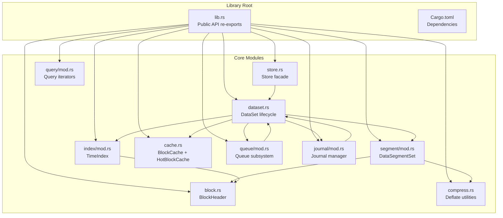
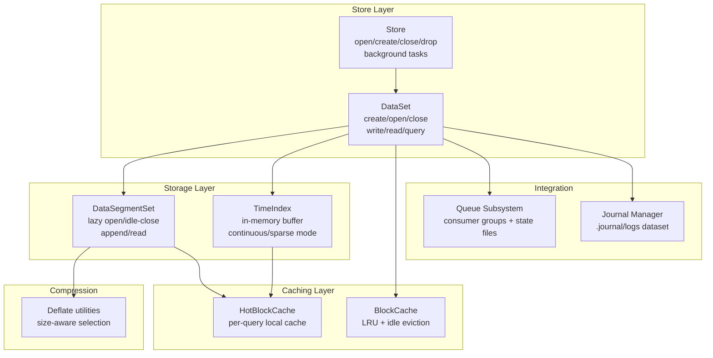
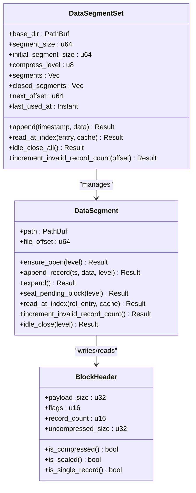
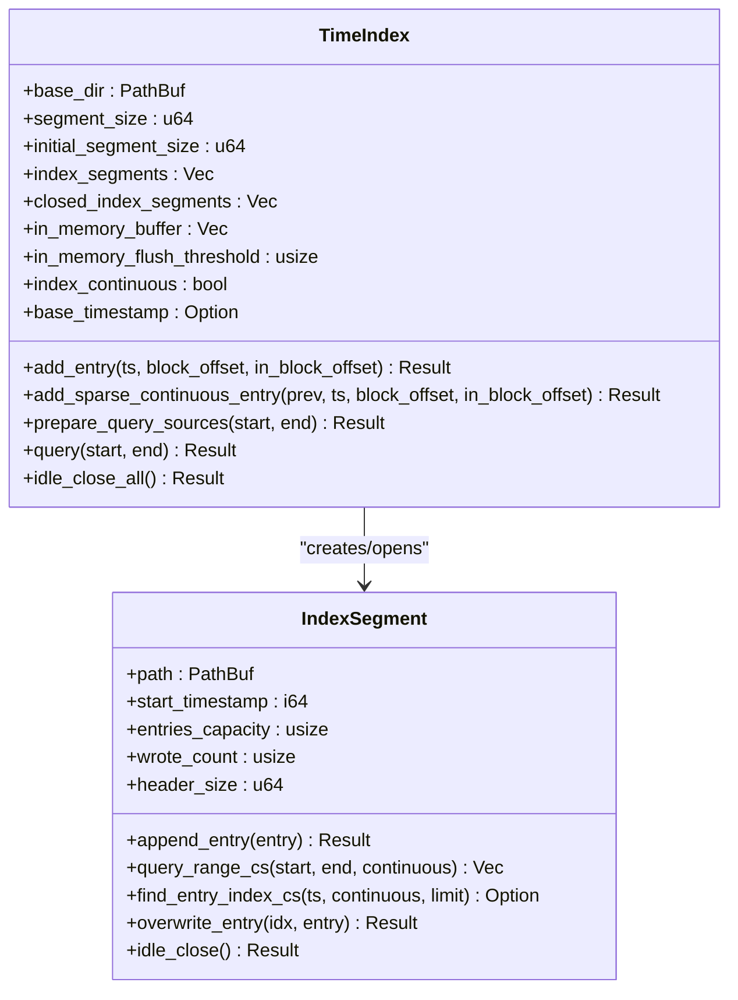
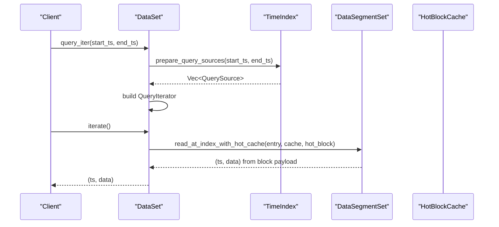
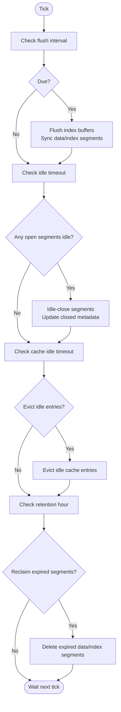
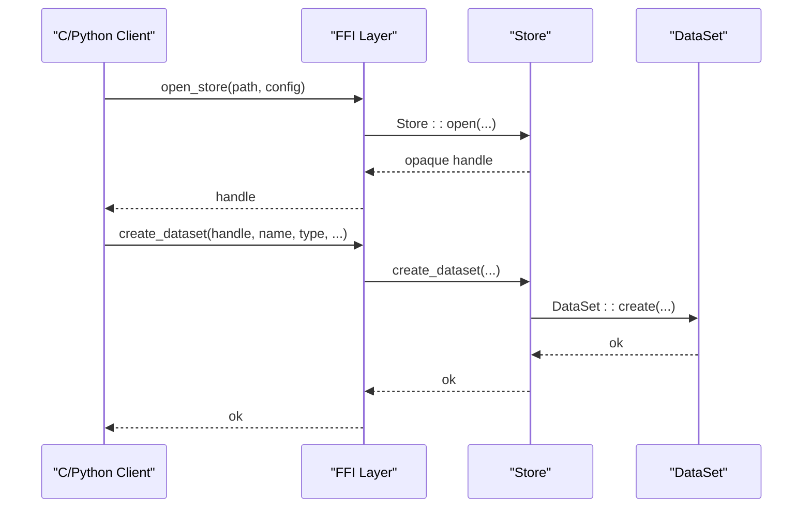
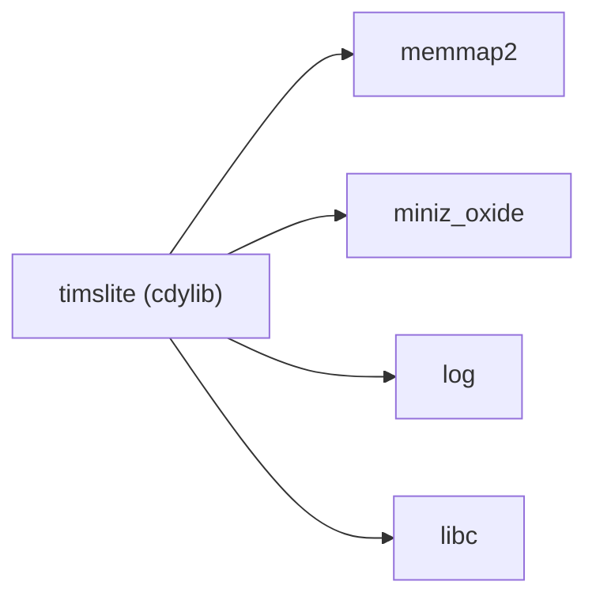

# Technical Design Specifications

<cite>
**Referenced Files in This Document**
- [design.md](file://design.md)
- [plan.md](file://plan.md)
- [lib.rs](file://src/lib.rs)
- [Cargo.toml](file://Cargo.toml)
- [architecture.md](file://docs/design/architecture.md)
- [store.rs](file://src/store.rs)
- [dataset.rs](file://src/dataset.rs)
- [segment/mod.rs](file://src/segment/mod.rs)
- [index/mod.rs](file://src/index/mod.rs)
- [block.rs](file://src/block.rs)
- [cache.rs](file://src/cache.rs)
- [compress.rs](file://src/compress.rs)
- [journal/mod.rs](file://src/journal/mod.rs)
- [queue/mod.rs](file://src/queue/mod.rs)
- [query/mod.rs](file://src/query/mod.rs)
</cite>

## Table of Contents
1. [Introduction](#introduction)
2. [Project Structure](#project-structure)
3. [Core Components](#core-components)
4. [Architecture Overview](#architecture-overview)
5. [Detailed Component Analysis](#detailed-component-analysis)
6. [Dependency Analysis](#dependency-analysis)
7. [Performance Considerations](#performance-considerations)
8. [Troubleshooting Guide](#troubleshooting-guide)
9. [Conclusion](#conclusion)
10. [Appendices](#appendices)

## Introduction
This document presents the technical design specifications for TimSLite, a high-performance, memory-mapped time-series data storage library implemented in Rust. The system targets low-latency ingestion and efficient time-range queries with robust background processing, compression, and cross-language integration. The design emphasizes:
- Block-level aggregation with delayed compression
- Memory-mapped file operations for zero-copy IO
- Lazy segment lifecycle management
- Sparse continuous index for O(1) lookups
- Global and per-query block caching
- Built-in journaling and queue subsystems

## Project Structure
TimSLite organizes functionality into cohesive modules under src/, with public exports in lib.rs and a C ABI FFI surface exposed via the ffi module. The design documents in docs/design/ and plan.md provide detailed rationale and evolution.

**Diagram sources**
- [lib.rs:39-73](file://src/lib.rs#L39-L73)
- [store.rs:46-56](file://src/store.rs#L46-L56)
- [dataset.rs:71-82](file://src/dataset.rs#L71-L82)
- [segment/mod.rs:43-53](file://src/segment/mod.rs#L43-L53)
- [index/mod.rs:20-31](file://src/index/mod.rs#L20-L31)
- [block.rs:27-80](file://src/block.rs#L27-L80)
- [cache.rs:43-49](file://src/cache.rs#L43-L49)
- [compress.rs:5-23](file://src/compress.rs#L5-L23)
- [queue/mod.rs:383-423](file://src/queue/mod.rs#L383-L423)
- [journal/mod.rs:321-327](file://src/journal/mod.rs#L321-L327)
- [query/mod.rs:1-5](file://src/query/mod.rs#L1-L5)

**Section sources**
- [lib.rs:1-133](file://src/lib.rs#L1-L133)
- [Cargo.toml:1-18](file://Cargo.toml#L1-L18)
- [architecture.md:1-133](file://docs/design/architecture.md#L1-L133)

## Core Components
- Store: Top-level facade managing datasets, background tasks, and global caches. Supports create/open/close/drop, write/append/delete, and queue operations. Exposes FFI entry points.
- DataSet: Encapsulates a (name, type) dataset with DataSegmentSet and TimeIndex, plus queue and journal hooks.
- DataSegmentSet: Manages multiple data segment files with lazy open/idle-close, append, and cross-segment reads. Implements block-level aggregation and lazy allocation.
- TimeIndex: Maintains index segments with in-memory buffering and optional continuous mode for O(1) lookups.
- BlockHeader: Defines the 16-byte block header and flags for compression, sealing, and single-record blocks.
- BlockCache and HotBlockCache: Global LRU cache with idle eviction and per-query hot cache for zero-copy extraction.
- Compression: Deflate-based compression with size-aware selection.
- Journal: Built-in change log dataset (.journal/logs) with TLV-encoded records and queue-based consumption.
- Queue: Multi-consumer-group persistent queue atop Dataset using 4KB mmap state files.

**Section sources**
- [store.rs:46-161](file://src/store.rs#L46-L161)
- [dataset.rs:71-218](file://src/dataset.rs#L71-L218)
- [segment/mod.rs:43-176](file://src/segment/mod.rs#L43-L176)
- [index/mod.rs:20-54](file://src/index/mod.rs#L20-L54)
- [block.rs:27-80](file://src/block.rs#L27-L80)
- [cache.rs:43-191](file://src/cache.rs#L43-L191)
- [compress.rs:5-23](file://src/compress.rs#L5-L23)
- [journal/mod.rs:321-494](file://src/journal/mod.rs#L321-L494)
- [queue/mod.rs:383-595](file://src/queue/mod.rs#L383-L595)

## Architecture Overview
TimSLite’s architecture centers on a hierarchical, memory-mapped storage model with explicit lifecycle controls and background maintenance.

**Diagram sources**
- [store.rs:46-161](file://src/store.rs#L46-L161)
- [dataset.rs:71-218](file://src/dataset.rs#L71-L218)
- [segment/mod.rs:43-176](file://src/segment/mod.rs#L43-L176)
- [index/mod.rs:20-54](file://src/index/mod.rs#L20-L54)
- [cache.rs:43-191](file://src/cache.rs#L43-L191)
- [compress.rs:5-23](file://src/compress.rs#L5-L23)
- [journal/mod.rs:321-494](file://src/journal/mod.rs#L321-L494)
- [queue/mod.rs:383-595](file://src/queue/mod.rs#L383-L595)

## Detailed Component Analysis

### Storage Architecture
- DataSegmentSet orchestrates data segment files with lazy open/idle-close semantics. It tracks closed segments metadata and lazily restores them on demand. Append operations select or create the appropriate segment, expand if needed, and seal segments on idle-close. Cross-segment reads route to the correct DataSegment.
- Block-level aggregation packs multiple records into a 16-byte header plus payload. The header encodes flags for compression/sealed/single-record and counters for payload size and record count. Compression is applied upon sealing when beneficial.

**Diagram sources**
- [segment/mod.rs:43-176](file://src/segment/mod.rs#L43-L176)
- [segment/mod.rs:454-521](file://src/segment/mod.rs#L454-L521)
- [block.rs:27-80](file://src/block.rs#L27-L80)

**Section sources**
- [segment/mod.rs:43-176](file://src/segment/mod.rs#L43-L176)
- [segment/mod.rs:180-272](file://src/segment/mod.rs#L180-L272)
- [segment/mod.rs:454-521](file://src/segment/mod.rs#L454-L521)
- [block.rs:27-80](file://src/block.rs#L27-L80)

### Indexing System
- TimeIndex maintains an in-memory buffer of IndexEntry items and flushes to disk segments when threshold is reached. It supports continuous mode where index entries are placed deterministically by base timestamp and segment capacity, enabling O(1) direct calculation of segment and entry indices. Sparse filler entries materialize only as needed.
- IndexSegment stores fixed-size entries with binary-search-friendly ordering. Continuous mode enforces strict ordering and capacity checks to maintain deterministic placement.

**Diagram sources**
- [index/mod.rs:20-54](file://src/index/mod.rs#L20-L54)
- [index/mod.rs:651-709](file://src/index/mod.rs#L651-L709)
- [index/mod.rs:720-771](file://src/index/mod.rs#L720-L771)

**Section sources**
- [index/mod.rs:66-117](file://src/index/mod.rs#L66-L117)
- [index/mod.rs:119-179](file://src/index/mod.rs#L119-L179)
- [index/mod.rs:412-503](file://src/index/mod.rs#L412-L503)
- [index/mod.rs:651-709](file://src/index/mod.rs#L651-L709)

### Query Engine
- QueryIterator prepares a list of QuerySource objects derived from in-memory buffer and index segments, then lazily reads blocks from DataSegmentSet. HotBlockCache reduces decompression and parsing overhead by caching decompressed block payloads and extracting records by in-block offsets.
- Single-timestamp and latest-timestamp reads are supported with explicit handling for deleted/filler entries.

**Diagram sources**
- [dataset.rs:631-647](file://src/dataset.rs#L631-L647)
- [dataset.rs:678-692](file://src/dataset.rs#L678-L692)
- [segment/mod.rs:470-485](file://src/segment/mod.rs#L470-L485)
- [cache.rs:291-353](file://src/cache.rs#L291-L353)

**Section sources**
- [dataset.rs:631-647](file://src/dataset.rs#L631-L647)
- [dataset.rs:678-692](file://src/dataset.rs#L678-L692)
- [segment/mod.rs:470-485](file://src/segment/mod.rs#L470-L485)
- [cache.rs:291-353](file://src/cache.rs#L291-L353)

### Background Processing
- BackgroundTasks coordinates periodic flush, idle-close, cache eviction, and retention reclaim. It supports both automatic background thread and manual tick modes. Store exposes tick_background_tasks and next_background_delay for integration with external event loops.

**Diagram sources**
- [store.rs:522-540](file://src/store.rs#L522-L540)
- [store.rs:139-158](file://src/store.rs#L139-L158)

**Section sources**
- [store.rs:522-540](file://src/store.rs#L522-L540)
- [store.rs:139-158](file://src/store.rs#L139-L158)

### Cross-Language Integration
- FFI exposes opaque handles and functions for Store operations, enabling C/C++/Python integration. The library compiles as a cdylib with a stable ABI surface. The FFI module defines extern "C" wrappers and handle lifecycles.

**Diagram sources**
- [lib.rs:39-73](file://src/lib.rs#L39-L73)
- [store.rs:163-253](file://src/store.rs#L163-L253)

**Section sources**
- [lib.rs:39-73](file://src/lib.rs#L39-L73)
- [store.rs:163-253](file://src/store.rs#L163-L253)

## Dependency Analysis
External dependencies and their roles:
- memmap2: Memory-mapped IO for zero-copy reads/writes on data and index segments.
- miniz_oxide: Deflate compression/decompression for block-level compression.
- log: Structured logging for background tasks and recovery events.
- libc: Platform-specific bindings for low-level operations.

**Diagram sources**
- [Cargo.toml:10-14](file://Cargo.toml#L10-L14)

**Section sources**
- [Cargo.toml:10-14](file://Cargo.toml#L10-L14)

## Performance Considerations
- Block-level aggregation reduces filesystem metadata overhead and improves sequential IO characteristics. The 64KB block size balances CPU cost of compression against IO amplification.
- Delayed compression applies compression on seal when beneficial, minimizing CPU during active writes and deferring work to background tasks.
- Memory-mapped IO eliminates kernel-userland copies for reads, with careful use of mmap for headers and controlled block reads.
- Global BlockCache and HotBlockCache reduce repeated decompression and parsing costs for frequently accessed blocks.
- Continuous index mode enables O(1) segment and entry lookups, dramatically reducing index traversal costs for dense time series.
- Lazy segment lifecycle avoids keeping inactive segments mapped, reducing memory footprint and file descriptor usage.
- Background tasks batch flushes and reclaims expired segments to minimize write amplification and disk pressure.

[No sources needed since this section provides general guidance]

## Troubleshooting Guide
Common issues and diagnostics:
- Invalid magic/version in queue state files indicate corruption or wrong format; verify state file layout and version.
- Pending queue capacity exceeded suggests consumers not acking or slow processing; monitor pending counts and timeouts.
- Segment full errors during append indicate insufficient initial size or expansion limits; adjust initial segment size or enable expansion.
- Decompression errors imply corrupted or mismatched compression; validate compression level and data integrity.
- Journal disabled errors occur when attempting to open the internal journal dataset without enabling journal; configure StoreConfig.enable_journal.

**Section sources**
- [queue/mod.rs:161-167](file://src/queue/mod.rs#L161-L167)
- [queue/mod.rs:228-237](file://src/queue/mod.rs#L228-L237)
- [segment/mod.rs:229-268](file://src/segment/mod.rs#L229-L268)
- [compress.rs:13-16](file://src/compress.rs#L13-L16)
- [journal/mod.rs:370-372](file://src/journal/mod.rs#L370-L372)

## Conclusion
TimSLite’s architecture combines memory-mapped IO, block-level aggregation, delayed compression, and continuous indexing to deliver high-throughput ingestion and efficient time-range queries. The modular design with explicit lifecycles, background maintenance, and robust caching enables predictable performance and scalability. The FFI and queue subsystems facilitate seamless integration across languages and streaming pipelines.

[No sources needed since this section summarizes without analyzing specific files]

## Appendices

### Design Decisions and Trade-offs
- Memory-mapped IO vs. buffered IO: Favor zero-copy reads for throughput; mitigate by careful mapping/unmapping and avoiding large contiguous mappings.
- Continuous vs. sparse index: Continuous index trades disk space for O(1) lookups; sparse index minimizes disk for sparse data.
- Lazy allocation and expansion: Reduces upfront disk usage; ensure adequate initial sizes to avoid frequent expansions.
- Compression timing: Seal-on-overflow prevents partial recompression; background tasks schedule compression to reduce write-time CPU.
- Cache sizing: Global cache with LRU and idle eviction balances memory usage and hit rate; hot cache avoids contention for per-query scans.

**Section sources**
- [architecture.md:6-27](file://docs/design/architecture.md#L6-L27)
- [index/mod.rs:119-179](file://src/index/mod.rs#L119-L179)
- [segment/mod.rs:229-268](file://src/segment/mod.rs#L229-L268)
- [cache.rs:96-113](file://src/cache.rs#L96-L113)

### Scalability and Future Enhancements
- Horizontal scaling: Partition datasets by name/type and distribute across nodes; leverage journal for replication.
- Compression levels: Tune compression level per workload; consider adaptive compression based on data characteristics.
- Background tuning: Adjust flush intervals, idle timeouts, and retention windows to balance latency and resource usage.
- Observability: Extend metrics collection for cache hit ratio, segment utilization, and background task durations.
- API evolution: Maintain backward compatibility for meta files and FFI; introduce feature flags for optional behaviors.

**Section sources**
- [plan.md:8-41](file://plan.md#L8-L41)
- [design.md:70-105](file://design.md#L70-L105)