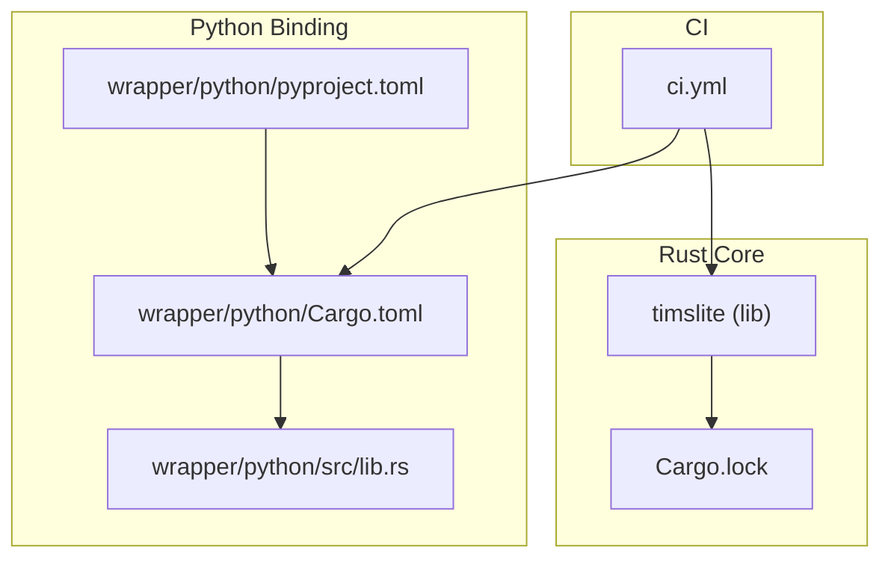
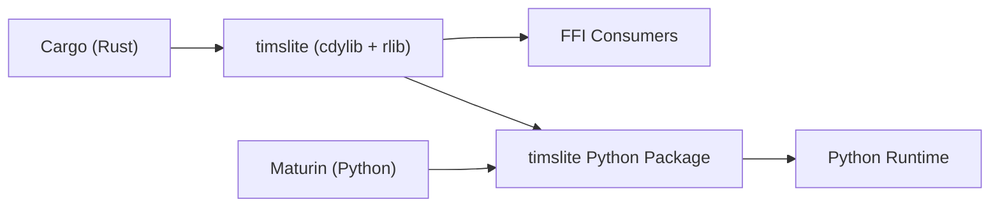
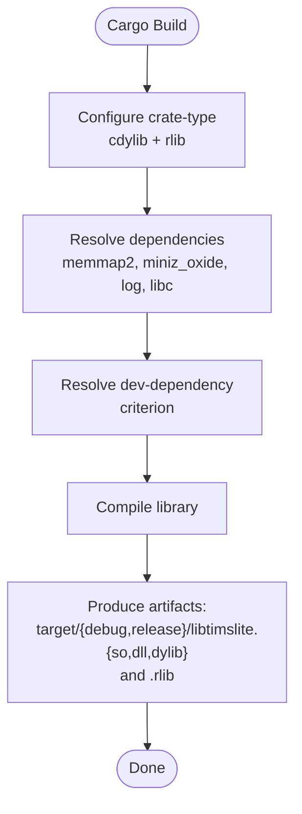
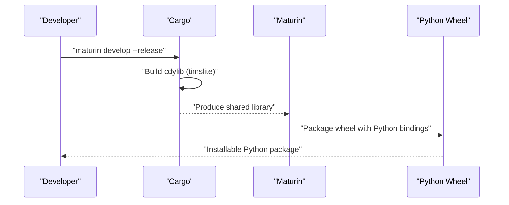
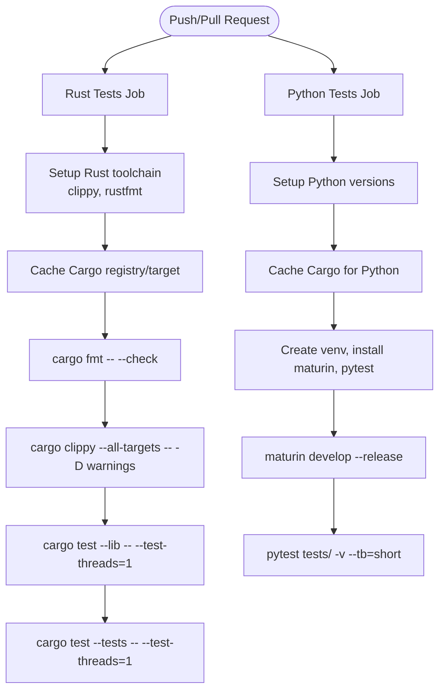
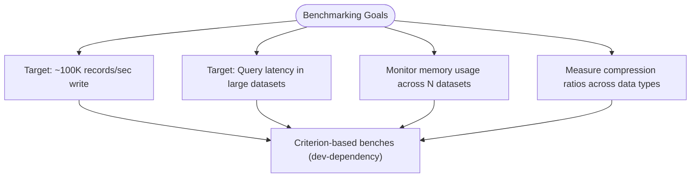
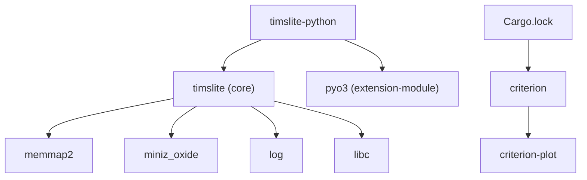

# Build System

<cite>
**Referenced Files in This Document**
- [Cargo.toml](file://Cargo.toml)
- [Cargo.lock](file://Cargo.lock)
- [src/lib.rs](file://src/lib.rs)
- [.github/workflows/ci.yml](file://.github/workflows/ci.yml)
- [wrapper/python/Cargo.toml](file://wrapper/python/Cargo.toml)
- [wrapper/python/pyproject.toml](file://wrapper/python/pyproject.toml)
- [wrapper/python/src/lib.rs](file://wrapper/python/src/lib.rs)
- [AGENTS.md](file://AGENTS.md)
- [docs/plan/phase-08-tests-perf.md](file://docs/plan/phase-08-tests-perf.md)
- [docs/review/archives/Round1/design-review.md](file://docs/review/archives/Round1/design-review.md)
</cite>

## Table of Contents
1. [Introduction](#introduction)
2. [Project Structure](#project-structure)
3. [Core Components](#core-components)
4. [Architecture Overview](#architecture-overview)
5. [Detailed Component Analysis](#detailed-component-analysis)
6. [Dependency Analysis](#dependency-analysis)
7. [Performance Considerations](#performance-considerations)
8. [Troubleshooting Guide](#troubleshooting-guide)
9. [Conclusion](#conclusion)
10. [Appendices](#appendices)

## Introduction
This document explains the TimSLite build system and compilation processes across the Rust core library and the Python binding package. It covers Cargo-based configuration, dependency management, cross-compilation considerations, and the Python binding build pipeline driven by Maturin. It also documents build profiles, optimization settings, platform-specific flags, benchmarking setup, performance measurement tools, profiling workflows, development and release procedures, artifact generation, and troubleshooting guidance.

## Project Structure
TimSLite comprises:
- A primary Rust library crate producing both a dynamic library and a static rlib for FFI consumption.
- A Python binding crate built as a cdylib and packaged via Maturin into a Python wheel.
- GitHub Actions CI workflows orchestrating Rust and Python builds and tests.

**Diagram sources**
- [Cargo.toml:1-18](file://Cargo.toml#L1-L18)
- [Cargo.lock:102-161](file://Cargo.lock#L102-L161)
- [wrapper/python/Cargo.toml:1-13](file://wrapper/python/Cargo.toml#L1-L13)
- [wrapper/python/pyproject.toml:1-22](file://wrapper/python/pyproject.toml#L1-L22)
- [wrapper/python/src/lib.rs:1-29](file://wrapper/python/src/lib.rs#L1-L29)
- [.github/workflows/ci.yml:1-86](file://.github/workflows/ci.yml#L1-L86)

**Section sources**
- [Cargo.toml:1-18](file://Cargo.toml#L1-L18)
- [wrapper/python/Cargo.toml:1-13](file://wrapper/python/Cargo.toml#L1-L13)
- [wrapper/python/pyproject.toml:1-22](file://wrapper/python/pyproject.toml#L1-L22)
- [.github/workflows/ci.yml:1-86](file://.github/workflows/ci.yml#L1-L86)

## Core Components
- Rust core library crate:
  - Produces a cdylib and an rlib for embedding and linking.
  - Declares runtime dependencies for memory mapping, compression, logging, and libc.
  - Includes a dev-dependency on Criterion for benchmarks.
- Python binding crate:
  - Builds a cdylib exposing a Python module via PyO3.
  - Depends on the core library crate via a local path.
- CI:
  - Rust jobs enforce formatting, linting, unit and integration tests.
  - Python jobs build and test the Python package across multiple Python versions.

**Section sources**
- [Cargo.toml:6-18](file://Cargo.toml#L6-L18)
- [wrapper/python/Cargo.toml:6-13](file://wrapper/python/Cargo.toml#L6-L13)
- [.github/workflows/ci.yml:13-86](file://.github/workflows/ci.yml#L13-L86)

## Architecture Overview
The build architecture separates concerns:
- The Rust core exposes a C-compatible ABI suitable for FFI consumers.
- The Python binding crate links against the core and exposes a Pythonic API via PyO3.
- Maturin builds the Python wheel from the Rust cdylib.

**Diagram sources**
- [Cargo.toml:6-8](file://Cargo.toml#L6-L8)
- [wrapper/python/Cargo.toml:6-12](file://wrapper/python/Cargo.toml#L6-L12)
- [wrapper/python/pyproject.toml:19-22](file://wrapper/python/pyproject.toml#L19-L22)

## Detailed Component Analysis

### Rust Core Library Build
- Crate type:
  - cdylib for FFI and rlib for internal/static linking.
- Dependencies:
  - memmap2 for memory-mapped IO.
  - miniz_oxide for compression.
  - log and libc for logging and system interop.
- Dev dependency:
  - criterion for benchmarking.
- Edition and metadata:
  - Uses Rust 2021 edition and standard package metadata.

**Diagram sources**
- [Cargo.toml:6-18](file://Cargo.toml#L6-L18)

**Section sources**
- [Cargo.toml:1-18](file://Cargo.toml#L1-L18)
- [src/lib.rs:1-133](file://src/lib.rs#L1-L133)

### Python Binding Build (PyO3 + Maturin)
- Crate configuration:
  - cdylib with name "timslite".
  - Depends on PyO3 extension-module feature and the core library via path.
- Packaging configuration:
  - Build backend is Maturin.
  - Requires Python >= 3.9.
  - Features include PyO3 extension-module.
  - Python source directory configured for packaging.
- Module registration:
  - PyO3 module macro registers Python classes for Store, Config, Dataset, QueryIterator, and Queue.

**Diagram sources**
- [wrapper/python/Cargo.toml:6-12](file://wrapper/python/Cargo.toml#L6-L12)
- [wrapper/python/pyproject.toml:1-22](file://wrapper/python/pyproject.toml#L1-L22)
- [wrapper/python/src/lib.rs:14-28](file://wrapper/python/src/lib.rs#L14-L28)

**Section sources**
- [wrapper/python/Cargo.toml:1-13](file://wrapper/python/Cargo.toml#L1-L13)
- [wrapper/python/pyproject.toml:1-22](file://wrapper/python/pyproject.toml#L1-L22)
- [wrapper/python/src/lib.rs:1-29](file://wrapper/python/src/lib.rs#L1-L29)

### CI Workflows
- Rust job:
  - Installs Rust toolchain with clippy and rustfmt.
  - Caches Cargo registry and target directories.
  - Runs formatting, clippy strict checks, unit tests, and integration tests.
- Python job:
  - Matrix builds across Python versions.
  - Caches Cargo for Python builds.
  - Creates a virtual environment, installs Maturin and pytest.
  - Builds and installs the Python package in development mode.
  - Runs Python tests.

**Diagram sources**
- [.github/workflows/ci.yml:13-86](file://.github/workflows/ci.yml#L13-L86)

**Section sources**
- [.github/workflows/ci.yml:1-86](file://.github/workflows/ci.yml#L1-86)

### Benchmarking System Setup
- Criterion is declared as a dev-dependency in the core crate.
- The project plan outlines performance goals and expectations for throughput, latency, memory usage, and compression metrics.
- The design review highlights that the current build documentation may imply a bench target that is not yet established.

**Diagram sources**
- [Cargo.toml:16-18](file://Cargo.toml#L16-L18)
- [docs/plan/phase-08-tests-perf.md:22-27](file://docs/plan/phase-08-tests-perf.md#L22-L27)
- [docs/review/archives/Round1/design-review.md:305-311](file://docs/review/archives/Round1/design-review.md#L305-L311)

**Section sources**
- [Cargo.toml:16-18](file://Cargo.toml#L16-L18)
- [docs/plan/phase-08-tests-perf.md:22-27](file://docs/plan/phase-08-tests-perf.md#L22-L27)
- [docs/review/archives/Round1/design-review.md:305-311](file://docs/review/archives/Round1/design-review.md#L305-L311)

### Build Profiles, Optimization, and Platform Flags
- Release profile:
  - The CI demonstrates building with --release to produce optimized binaries.
- Optimization settings:
  - Cargo defaults apply; no explicit profile overrides are present in the referenced files.
- Platform-specific flags:
  - No explicit target-specific flags are defined in the referenced files.
  - The Python binding uses a generic cdylib configuration suitable for cross-platform wheels.

**Section sources**
- [.github/workflows/ci.yml:79-81](file://.github/workflows/ci.yml#L79-L81)
- [wrapper/python/Cargo.toml:6-8](file://wrapper/python/Cargo.toml#L6-L8)

### Development and Release Procedures
- Development build:
  - Build without --release for faster iteration.
  - Use cargo test with single-threaded execution for stability.
- Release build:
  - Build with --release to produce optimized artifacts.
  - Python package built via Maturin in development mode during CI.
- Artifact generation:
  - Rust: target/{debug,release}/libtimslite.{so,dll,dylib} and .rlib.
  - Python: wheel produced by Maturin.

**Section sources**
- [AGENTS.md:54-69](file://AGENTS.md#L54-L69)
- [.github/workflows/ci.yml:79-81](file://.github/workflows/ci.yml#L79-L81)
- [wrapper/python/pyproject.toml:19-22](file://wrapper/python/pyproject.toml#L19-L22)

## Dependency Analysis
- Core crate dependencies:
  - memmap2, miniz_oxide, log, libc.
- Python binding dependencies:
  - pyo3 with extension-module feature.
  - Local path dependency on the core crate.
- Lock file:
  - Cargo.lock includes criterion and related plotting/visualization dependencies.

**Diagram sources**
- [Cargo.toml:10-14](file://Cargo.toml#L10-L14)
- [wrapper/python/Cargo.toml:10-12](file://wrapper/python/Cargo.toml#L10-L12)
- [Cargo.lock:109-142](file://Cargo.lock#L109-L142)

**Section sources**
- [Cargo.toml:10-14](file://Cargo.toml#L10-L14)
- [wrapper/python/Cargo.toml:10-12](file://wrapper/python/Cargo.toml#L10-L12)
- [Cargo.lock:109-142](file://Cargo.lock#L109-L142)

## Performance Considerations
- Criterion is available for benchmarking; define benches/ to enable cargo bench workflows.
- CI currently focuses on unit/integration tests; adding Criterion benches would integrate with the existing dev-dependency.
- Profiling workflows can leverage standard Rust profilers (e.g., perf, valgrind) as suggested in the project’s design review.

**Section sources**
- [Cargo.toml:16-18](file://Cargo.toml#L16-L18)
- [docs/review/archives/Round1/design-review.md:313-320](file://docs/review/archives/Round1/design-review.md#L313-L320)

## Troubleshooting Guide
- Formatting and linting:
  - Ensure cargo fmt passes and clippy runs without warnings.
- Test concurrency:
  - Use --test-threads=1 to avoid filesystem contention in tests.
- Python environment:
  - Install Maturin and pytest in a virtual environment before building the Python package.
- Cross-compilation:
  - No explicit target flags are set; ensure the host toolchain matches intended deployment platforms.
- Dependency resolution:
  - Verify Cargo.lock stability and cache hit effectiveness in CI.

**Section sources**
- [.github/workflows/ci.yml:34-44](file://.github/workflows/ci.yml#L34-L44)
- [AGENTS.md:61-71](file://AGENTS.md#L61-L71)
- [.github/workflows/ci.yml:73-85](file://.github/workflows/ci.yml#L73-L85)

## Conclusion
TimSLite’s build system centers on a dual-crate architecture: a Rust core producing a cdylib for FFI and an rlib for static linking, and a Python binding crate packaged via Maturin. CI enforces quality gates for Rust and Python, while Criterion is available for future benchmarking. The current configuration emphasizes correctness, portability, and maintainability, with straightforward development and release procedures.

## Appendices
- Quick commands:
  - Build core: cargo build [--release]
  - Test core: cargo test -- --test-threads=1
  - Lint/format: cargo clippy -- -D warnings && cargo fmt -- --check
  - Build Python package: maturin develop --release (from wrapper/python)

[No sources needed since this section provides general guidance]