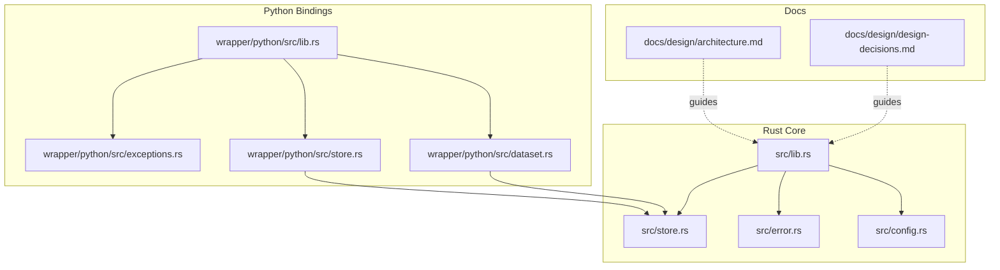
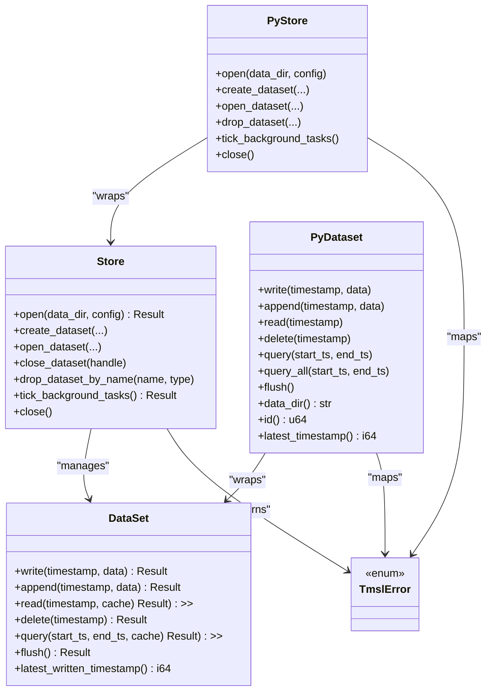
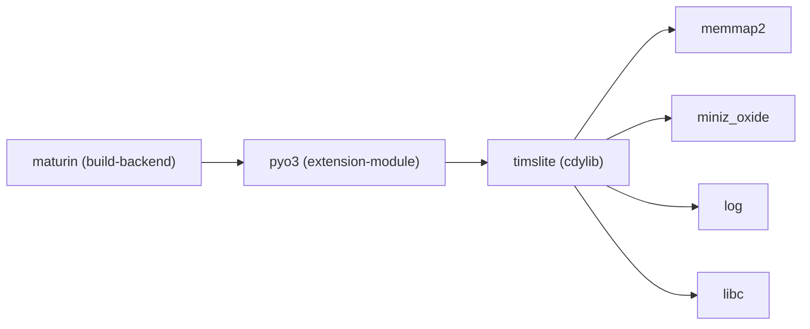

# Coding Standards

<cite>
**Referenced Files in This Document**
- [Cargo.toml](file://Cargo.toml)
- [lib.rs](file://src/lib.rs)
- [error.rs](file://src/error.rs)
- [config.rs](file://src/config.rs)
- [store.rs](file://src/store.rs)
- [architecture.md](file://docs/design/architecture.md)
- [design-decisions.md](file://docs/design/design-decisions.md)
- [dataset_basic_test.rs](file://tests/dataset_basic_test.rs)
- [pyproject.toml](file://wrapper/python/pyproject.toml)
- [lib.rs](file://wrapper/python/src/lib.rs)
- [exceptions.rs](file://wrapper/python/src/exceptions.rs)
- [store.rs](file://wrapper/python/src/store.rs)
- [dataset.rs](file://wrapper/python/src/dataset.rs)
- [test_basic.py](file://wrapper/python/tests/test_basic.py)
</cite>

## Table of Contents
1. [Introduction](#introduction)
2. [Project Structure](#project-structure)
3. [Core Components](#core-components)
4. [Architecture Overview](#architecture-overview)
5. [Detailed Component Analysis](#detailed-component-analysis)
6. [Dependency Analysis](#dependency-analysis)
7. [Performance Considerations](#performance-considerations)
8. [Troubleshooting Guide](#troubleshooting-guide)
9. [Conclusion](#conclusion)
10. [Appendices](#appendices)

## Introduction
This document establishes comprehensive coding standards and guidelines for TimSLite development across Rust and Python binding layers. It consolidates Rust conventions, naming patterns, architectural principles, error handling, PyO3 integration, documentation standards, memory safety and concurrency practices, performance optimization, and quality gates to ensure consistency and reliability.

## Project Structure
TimSLite is organized into:
- Core Rust library (cdylib + rlib) exposing a Store facade and dataset operations
- Python bindings via PyO3 that wrap the Rust core into a thin, Pythonic API
- Extensive design documentation supporting incremental understanding and cross-linking

**Diagram sources**
- [lib.rs:38-73](file://src/lib.rs#L38-L73)
- [store.rs:46-56](file://src/store.rs#L46-L56)
- [error.rs:6-43](file://src/error.rs#L6-L43)
- [config.rs:25-52](file://src/config.rs#L25-L52)
- [lib.rs:1-29](file://wrapper/python/src/lib.rs#L1-L29)
- [exceptions.rs:15-105](file://wrapper/python/src/exceptions.rs#L15-L105)
- [store.rs:16-24](file://wrapper/python/src/store.rs#L16-L24)
- [dataset.rs:12-18](file://wrapper/python/src/dataset.rs#L12-L18)
- [architecture.md:1-133](file://docs/design/architecture.md#L1-L133)
- [design-decisions.md:1-53](file://docs/design/design-decisions.md#L1-L53)

**Section sources**
- [lib.rs:38-73](file://src/lib.rs#L38-L73)
- [architecture.md:1-133](file://docs/design/architecture.md#L1-L133)
- [design-decisions.md:1-53](file://docs/design/design-decisions.md#L1-L53)

## Core Components
- Store: Top-level facade managing datasets, background tasks, caches, and journal. It enforces dataset lifecycle separation and exposes synchronous and asynchronous background tick APIs.
- DataSet: Per-dataset entity with strict locking, index-driven queries, and block-level read caching.
- Error Model: A unified TmslError enum with Display and std::error::Error implementations, plus From<io::Error>.
- Configuration: StoreConfig and DataSetConfig with builder patterns and sensible defaults.
- Python Bindings: PyStore, PyDataset, PyQueryIterator, and a complete exception hierarchy mapped from TmslError.

Key conventions:
- Naming: PascalCase for types, snake_case for fields and methods; constants in UPPER_SNAKE_CASE.
- Public API: Re-exported via src/lib.rs for both Rust and FFI consumers.
- Error propagation: Rust uses Result<T> consistently; Python converts to PyO3 exceptions via a mapping function.

**Section sources**
- [store.rs:46-56](file://src/store.rs#L46-L56)
- [error.rs:6-43](file://src/error.rs#L6-L43)
- [config.rs:25-52](file://src/config.rs#L25-L52)
- [lib.rs:60-72](file://src/lib.rs#L60-L72)
- [lib.rs:14-28](file://wrapper/python/src/lib.rs#L14-L28)
- [exceptions.rs:15-105](file://wrapper/python/src/exceptions.rs#L15-L105)

## Architecture Overview
TimSLite follows a modular, layered architecture:
- Store facade orchestrates datasets, background tasks, caches, and journal
- DataSet encapsulates per-dataset state with lazy segment lifecycle and time-indexed queries
- DataSegment and IndexSegment provide mmap-backed storage with block-level aggregation and compression
- FFI layer exposes extern "C" functions for C ABI interoperability
- Python bindings wrap the Rust core with PyO3, hiding locks and providing Pythonic APIs

**Diagram sources**
- [store.rs:46-717](file://src/store.rs#L46-L717)
- [dataset.rs:12-175](file://wrapper/python/src/dataset.rs#L12-L175)
- [error.rs:6-43](file://src/error.rs#L6-L43)
- [store.rs:16-274](file://wrapper/python/src/store.rs#L16-L274)

**Section sources**
- [architecture.md:6-27](file://docs/design/architecture.md#L6-L27)
- [design-decisions.md:18-49](file://docs/design/design-decisions.md#L18-L49)

## Detailed Component Analysis

### Rust Coding Conventions and Patterns
- Module organization: Public re-exports in src/lib.rs; internal modules keep concerns separated.
- Error handling: Centralized TmslError with Display and source() implementations; From<io::Error> for I/O interop.
- Configuration builders: StoreConfigBuilder and DataSetConfigBuilder enforce validation and clamping.
- Concurrency: RwLock<HashMap<DataSetKey, Arc<Mutex<DataSet>>>> for dataset registry; Arc<Mutex<DataSet>> for shared access.
- Constants: Exported via src/lib.rs for FFI consumers.

Recommended practices:
- Prefer Result-returning functions and propagate errors upward rather than panicking.
- Use builder patterns for configuration to avoid long argument lists.
- Keep public APIs minimal and cohesive; expose only necessary types.

**Section sources**
- [lib.rs:38-110](file://src/lib.rs#L38-L110)
- [error.rs:6-87](file://src/error.rs#L6-L87)
- [config.rs:25-203](file://src/config.rs#L25-L203)
- [store.rs:46-56](file://src/store.rs#L46-L56)

### Python Binding Coding Standards (PyO3)
- Thin wrapper philosophy: PyO3 classes wrap Rust types, hide locks, and expose Pythonic APIs.
- Exception mapping: exceptions.rs defines a hierarchy mirroring TmslError and a map_error function.
- Lifecycle management: PyStore implements __enter__/__exit__; PyDataset hides Arc<Mutex<DataSet>> behind a simple API.
- Type mapping: Clear mapping between Rust and Python types documented in wrapper design.

Guidelines:
- Use #[pyclass] for opaque wrappers; #[pymethods] for Pythonic methods.
- Always map Rust Result<T, TmslError> to PyErr via exceptions::wrap.
- Avoid exposing internal builder types; provide kwargs-based configuration.
- Keep PyO3 lifetimes static-safe; use Arc<Mutex<...>> sharing for lazy iteration.

**Section sources**
- [lib.rs:14-28](file://wrapper/python/src/lib.rs#L14-L28)
- [exceptions.rs:15-193](file://wrapper/python/src/exceptions.rs#L15-L193)
- [store.rs:16-274](file://wrapper/python/src/store.rs#L16-L274)
- [dataset.rs:12-175](file://wrapper/python/src/dataset.rs#L12-L175)

### Error Handling Patterns
- Rust: TmslError covers I/O, magic/version mismatches, mmap, compression/decompression failures, invalid data, not found, expired, segment full, and queue-related errors. Implement Display and source() for diagnostics.
- Python: exceptions.rs registers TmslError subclasses and map_error translates Rust errors to Python exceptions.

Best practices:
- Always convert io::Error to TmslError::Io.
- Provide contextual messages in error variants.
- In Python, catch and re-raise with meaningful messages for user-facing APIs.

**Section sources**
- [error.rs:6-87](file://src/error.rs#L6-L87)
- [exceptions.rs:164-193](file://wrapper/python/src/exceptions.rs#L164-L193)

### PyO3 Integration Guidelines
- Build system: maturin backend with extension-module feature.
- Module registration: lib.rs registers PyO3 classes and exceptions.
- Exception registration: exceptions.rs exports all subclasses via module.add.
- Mapping: wrap() function centralizes error conversion.

**Section sources**
- [pyproject.toml:19-21](file://wrapper/python/pyproject.toml#L19-L21)
- [lib.rs:14-28](file://wrapper/python/src/lib.rs#L14-L28)
- [exceptions.rs:107-162](file://wrapper/python/src/exceptions.rs#L107-L162)

### Documentation Standards and Comment Conventions
- Rust: Use module-level documentation comments for crates and modules; keep public items documented with concise summaries and examples where helpful.
- Python: Use docstrings for classes and methods; mirror Rust behavior and constraints.
- Design docs: docs/design/* provide detailed, cross-linked architecture and decisions.

Guidelines:
- Document public APIs with intent, arguments, return values, and error conditions.
- Link to related design documents for complex topics.
- Keep examples minimal and verifiable.

**Section sources**
- [lib.rs:1-36](file://src/lib.rs#L1-L36)
- [architecture.md:1-133](file://docs/design/architecture.md#L1-L133)
- [design-decisions.md:1-53](file://docs/design/design-decisions.md#L1-L53)

### Memory Safety and Concurrency Patterns
- Memory mapping: memmap2 is used for mmap-backed segments; lazy allocation and idle-close reduce memory footprint.
- Concurrency: RwLock for dataset registry; Arc<Mutex<DataSet>> for shared access; background tasks coordinate via BackgroundTasks.
- GIL: PyO3 holds the GIL during #[pymethods]; background threads operate independently.

Guidelines:
- Avoid holding locks longer than necessary; release early to minimize contention.
- Use Arc<Mutex<T>> for shared ownership across Python lifetimes.
- Ensure background tasks are stopped deterministically on drop.

**Section sources**
- [Cargo.toml:10-14](file://Cargo.toml#L10-L14)
- [store.rs:46-56](file://src/store.rs#L46-L56)
- [store.rs:256-273](file://wrapper/python/src/store.rs#L256-L273)

### Performance Optimization
- Block-level aggregation (≤64KB) improves compression and cache locality.
- Lazy segment lifecycle (idle-close after inactivity) reduces memory usage.
- Read block cache with LRU and idle eviction.
- Delayed compression (pending overflow) minimizes CPU during writes.
- Time-indexed queries with binary search and HotBlockCache for iteration.

Guidelines:
- Tune StoreConfig cache_max_memory and intervals for workload characteristics.
- Prefer append and batch writes to reduce index updates.
- Use query_index_entries + lazy data fetching to minimize memory copies.

**Section sources**
- [design-decisions.md:20-49](file://docs/design/design-decisions.md#L20-L49)
- [config.rs:25-71](file://src/config.rs#L25-L71)

### Quality Gates and Testing Requirements
- Rust tests validate lifecycle, isolation, persistence, and background behavior.
- Python tests validate imports, context manager behavior, default configs, and basic operations.
- CI builds and publishes Python wheels via maturin.

Requirements:
- All new features must include Rust unit/integration tests.
- Python bindings must include representative smoke and integration tests.
- Changes affecting FFI or Python API must update tests accordingly.

**Section sources**
- [dataset_basic_test.rs:17-286](file://tests/dataset_basic_test.rs#L17-L286)
- [test_basic.py:7-58](file://wrapper/python/tests/test_basic.py#L7-L58)

## Dependency Analysis
External dependencies and their roles:
- memmap2: memory-mapped files for data/index segments
- miniz_oxide: block-level compression
- log: structured logging
- libc: low-level system calls
- pyo3: PyO3 extension module for Python bindings

**Diagram sources**
- [Cargo.toml:10-17](file://Cargo.toml#L10-L17)
- [pyproject.toml:1-22](file://wrapper/python/pyproject.toml#L1-L22)

**Section sources**
- [Cargo.toml:10-17](file://Cargo.toml#L10-L17)
- [pyproject.toml:1-22](file://wrapper/python/pyproject.toml#L1-L22)

## Performance Considerations
- Tune flush_interval and idle_timeout to balance durability and throughput.
- Adjust cache_max_memory and cache_idle_timeout to fit workload patterns.
- Use continuous index mode judiciously; it enables out-of-order writes but adds complexity.
- Monitor retention_check_hour to align with operational windows.

[No sources needed since this section provides general guidance]

## Troubleshooting Guide
Common issues and resolutions:
- Invalid dataset name/type: Ensure values match ^[0-9A-Za-z_-]+$ and are validated before path construction.
- Segment full errors: Increase segment sizes or trigger retention-based reclaim.
- Expired timestamps: Respect retention window and query within allowed bounds.
- Queue errors: Ensure queue is opened before push/consumer operations; check consumer group existence.

**Section sources**
- [store.rs:19-39](file://src/store.rs#L19-L39)
- [error.rs:25-42](file://src/error.rs#L25-L42)
- [exceptions.rs:164-193](file://wrapper/python/src/exceptions.rs#L164-L193)

## Conclusion
These standards unify TimSLite’s Rust and Python layers around consistent conventions, robust error handling, safe concurrency, and performance-conscious design. Adhering to these guidelines ensures maintainability, portability, and reliability across the codebase and its Python ecosystem.

[No sources needed since this section summarizes without analyzing specific files]

## Appendices

### API Documentation Requirements
- Rust: Document public modules, structs, enums, and functions with summaries, parameter descriptions, return values, and error conditions.
- Python: Mirror Rust behavior in docstrings; specify types, durations in seconds, and constraints.

**Section sources**
- [lib.rs:1-36](file://src/lib.rs#L1-L36)
- [dataset.rs:42-175](file://wrapper/python/src/dataset.rs#L42-L175)

### Code Review Standards
- Validate adherence to naming and module organization.
- Confirm error handling completeness and mapping in Python.
- Verify concurrency correctness and resource cleanup.
- Ensure performance-sensitive defaults are justified and configurable.

**Section sources**
- [config.rs:25-71](file://src/config.rs#L25-L71)
- [store.rs:578-597](file://src/store.rs#L578-L597)