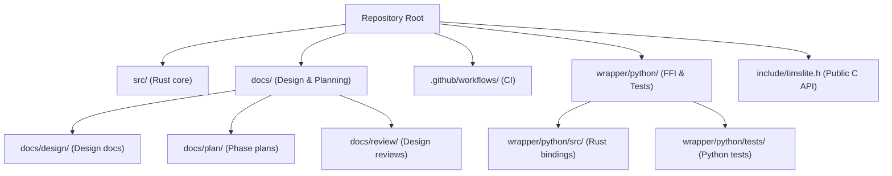
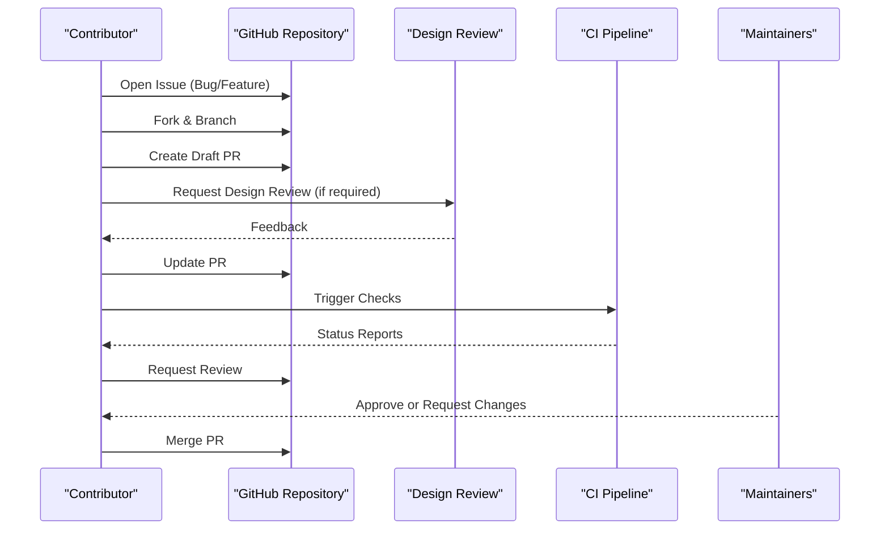
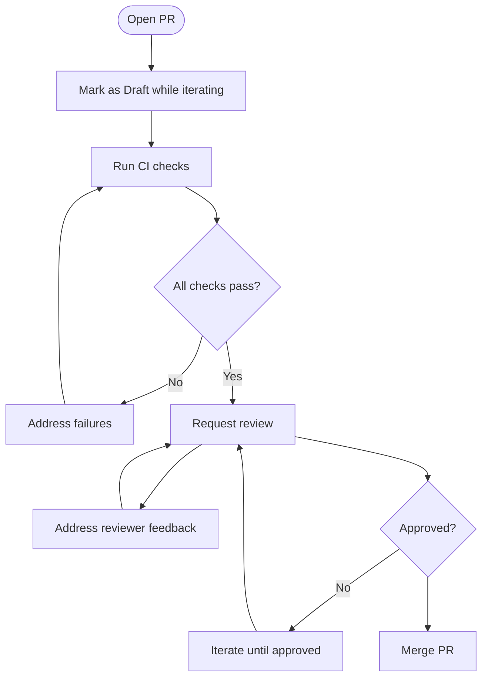
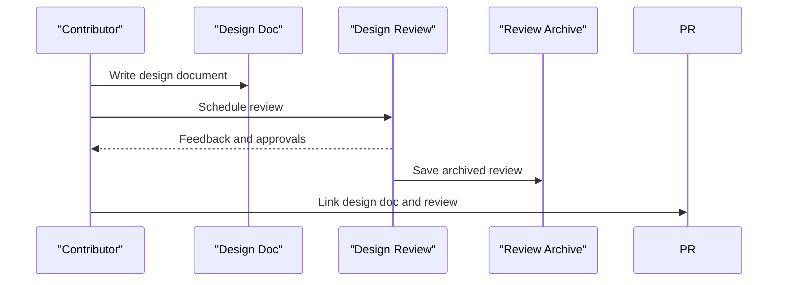
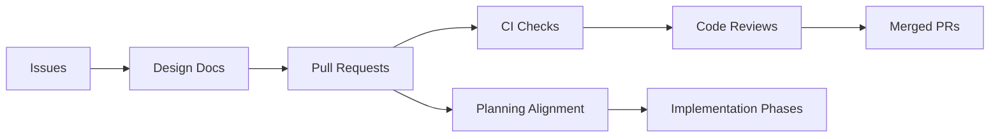

# Contribution Workflow

<cite>
**Referenced Files in This Document**
- [README.md](file://README.md)
- [AGENTS.md](file://AGENTS.md)
- [.github/workflows/ci.yml](file://.github/workflows/ci.yml)
- [design.md](file://design.md)
- [plan.md](file://plan.md)
- [docs/design/architecture.md](file://docs/design/architecture.md)
- [docs/review/design-review.md](file://docs/review/design-review.md)
- [docs/review/archives/Round1/design-review.md](file://docs/review/archives/Round1/design-review.md)
- [wrapper/python/README.md](file://wrapper/python/wrapper/python/README.md)
- [wrapper/python/design.md](file://wrapper/python/design.md)
- [wrapper/python/plan.md](file://wrapper/python/plan.md)
</cite>

## Table of Contents
1. [Introduction](#introduction)
2. [Project Structure](#project-structure)
3. [Core Components](#core-components)
4. [Architecture Overview](#architecture-overview)
5. [Detailed Component Analysis](#detailed-component-analysis)
6. [Dependency Analysis](#dependency-analysis)
7. [Performance Considerations](#performance-considerations)
8. [Troubleshooting Guide](#troubleshooting-guide)
9. [Conclusion](#conclusion)
10. [Appendices](#appendices)

## Introduction
This document describes the contribution workflow for TimSLite contributors. It covers the end-to-end development lifecycle from issue identification to merged pull requests, including branching strategy, commit message conventions, code review processes, and maintenance responsibilities. It also outlines how to report bugs, propose features, submit patches, and participate in design reviews. Guidance on writing design documents, maintaining backward compatibility, and handling breaking changes is included, along with community guidelines and communication channels.

## Project Structure
TimSLite is a Rust-based storage engine with a Python FFI wrapper. The repository includes:
- Core library under src/
- Documentation under docs/, including design documents, planning artifacts, and design review records
- Python wrapper under wrapper/python/ with its own design and plan
- CI workflow under .github/workflows/

**Diagram sources**
- [README.md](file://README.md)
- [Cargo.toml](file://Cargo.toml)
- [wrapper/python/Cargo.toml](file://wrapper/python/Cargo.toml)

**Section sources**
- [README.md](file://README.md)
- [Cargo.toml](file://Cargo.toml)
- [wrapper/python/Cargo.toml](file://wrapper/python/Cargo.toml)

## Core Components
- Rust core library: Implements storage engine internals, indexing, caching, compression, and background tasks.
- Python FFI wrapper: Provides Python bindings and tests for the Rust core.
- Documentation: Design decisions, architecture, and planning artifacts guide implementation and review.
- CI pipeline: Ensures quality gates for contributions.

Key contribution touchpoints:
- Issue triage and feature proposals via GitHub Issues
- Branching and PR workflow
- Commit message conventions
- Code review and approval
- Design review process for significant changes
- Backward compatibility and breaking change policies

**Section sources**
- [design.md](file://design.md)
- [docs/design/architecture.md](file://docs/design/architecture.md)
- [.github/workflows/ci.yml](file://.github/workflows/ci.yml)

## Architecture Overview
The contribution workflow integrates with the repository’s documentation-driven development and CI checks.

**Diagram sources**
- [docs/review/design-review.md](file://docs/review/design-review.md)
- [.github/workflows/ci.yml](file://.github/workflows/ci.yml)

## Detailed Component Analysis

### Issue Identification and Triage
- Use GitHub Issues to report bugs and propose features.
- Provide clear problem statements, reproduction steps, and acceptance criteria.
- For major changes, open a design discussion issue before implementation.

**Section sources**
- [README.md](file://README.md)
- [docs/review/design-review.md](file://docs/review/design-review.md)

### Branching Strategy
- Use feature branches prefixed with descriptive names (e.g., feature/<short-description>).
- Keep branches focused and small to facilitate review.
- Rebase onto the latest main branch before requesting review to minimize conflicts.

**Section sources**
- [README.md](file://README.md)

### Commit Message Conventions
- Use imperative mood and concise summaries.
- Reference related issues by number.
- Include a brief description of the change and its motivation.
- For breaking changes, include a “BREAKING CHANGE” footer and rationale.

**Section sources**
- [README.md](file://README.md)

### Code Review Process
- Open a Pull Request early (Draft) to gather feedback during development.
- Respond to comments promptly and update the PR accordingly.
- Ensure CI checks pass before requesting final review.
- Obtain approval from maintainers before merging.

**Diagram sources**
- [.github/workflows/ci.yml](file://.github/workflows/ci.yml)

**Section sources**
- [README.md](file://README.md)
- [.github/workflows/ci.yml](file://.github/workflows/ci.yml)

### Design Review Process
- For substantial changes, initiate a design review aligned with the documented process.
- Prepare a design document that outlines goals, alternatives considered, trade-offs, and implementation plan.
- Archive previous rounds of design reviews for traceability.

**Diagram sources**
- [docs/review/design-review.md](file://docs/review/design-review.md)
- [docs/review/archives/Round1/design-review.md](file://docs/review/archives/Round1/design-review.md)

**Section sources**
- [docs/review/design-review.md](file://docs/review/design-review.md)
- [docs/review/archives/Round1/design-review.md](file://docs/review/archives/Round1/design-review.md)

### Implementation Planning and Milestones
- Use the planning documents to align work with project phases and milestones.
- Link PRs to specific phases and outcomes to maintain traceability.

**Section sources**
- [plan.md](file://plan.md)
- [docs/plan/overview.md](file://docs/plan/overview.md)

### Writing Design Documents
- Structure documents around goals, scope, alternatives, risks, and implementation plan.
- Reference prior design decisions and architecture documents.
- Keep documents concise but comprehensive for reviewers.

**Section sources**
- [design.md](file://design.md)
- [docs/design/architecture.md](file://docs/design/architecture.md)

### Backward Compatibility and Breaking Changes
- Prefer additive changes; avoid breaking existing APIs unless justified.
- If a breaking change is necessary, document the migration path and timeline.
- Include deprecation notices and transitional APIs where feasible.

**Section sources**
- [design.md](file://design.md)
- [docs/design/architecture.md](file://docs/design/architecture.md)

### Community Guidelines and Communication
- Follow the project’s agent roles and responsibilities for contributor interactions.
- Engage respectfully and constructively in discussions.
- Use appropriate labels and milestones to organize work.

**Section sources**
- [AGENTS.md](file://AGENTS.md)

### Contribution Steps: Bug Reports
- Search existing issues to avoid duplicates.
- Provide environment details, steps to reproduce, and expected vs. actual behavior.
- Tag issues appropriately and link related PRs.

**Section sources**
- [README.md](file://README.md)

### Contribution Steps: Feature Proposals
- Open a feature request issue describing the problem and proposed solution.
- For significant features, propose a design document and outline implementation phases.
- Link to planning documents and design decisions.

**Section sources**
- [plan.md](file://plan.md)
- [docs/design/architecture.md](file://docs/design/architecture.md)

### Contribution Steps: Submitting Patches
- Fork the repository and create a feature branch.
- Implement changes with clear commit messages and minimal diffs.
- Add or update tests and documentation as needed.
- Open a PR with a clear description and links to related issues and design docs.

**Section sources**
- [README.md](file://README.md)
- [.github/workflows/ci.yml](file://.github/workflows/ci.yml)

### Python Wrapper Contributions
- For Python-specific changes, coordinate with the wrapper’s design and plan.
- Ensure tests under wrapper/python/tests/ remain green.
- Keep the public C API stable and clearly document changes.

**Section sources**
- [wrapper/python/README.md](file://wrapper/python/README.md)
- [wrapper/python/design.md](file://wrapper/python/design.md)
- [wrapper/python/plan.md](file://wrapper/python/plan.md)
- [include/timslite.h](file://include/timslite.h)

## Dependency Analysis
The contribution workflow depends on:
- Documentation artifacts for design alignment
- CI checks for quality assurance
- Maintainer approvals for merges
- Planning documents for roadmap alignment

**Diagram sources**
- [docs/review/design-review.md](file://docs/review/design-review.md)
- [.github/workflows/ci.yml](file://.github/workflows/ci.yml)
- [plan.md](file://plan.md)

**Section sources**
- [docs/review/design-review.md](file://docs/review/design-review.md)
- [.github/workflows/ci.yml](file://.github/workflows/ci.yml)
- [plan.md](file://plan.md)

## Performance Considerations
- Keep PRs scoped to reduce review time and CI overhead.
- Prefer incremental changes aligned with planning phases.
- Run local tests before opening PRs to minimize CI failures.

[No sources needed since this section provides general guidance]

## Troubleshooting Guide
- CI Failures: Inspect logs, fix linting/formatting, and re-run checks.
- Review Feedback: Address comments systematically and update the PR.
- Conflicts: Rebase onto the latest main branch and force-push if necessary.
- Design Review Delays: Ensure the design document is complete and linked to the PR.

**Section sources**
- [.github/workflows/ci.yml](file://.github/workflows/ci.yml)
- [docs/review/design-review.md](file://docs/review/design-review.md)

## Conclusion
TimSLite’s contribution workflow emphasizes documentation-driven development, iterative design reviews, and robust CI checks. Contributors should align changes with planning documents, follow commit conventions, and engage constructively in reviews. For major changes, initiate a design review and maintain backward compatibility where possible.

[No sources needed since this section summarizes without analyzing specific files]

## Appendices

### Appendix A: Quick Reference
- Issue types: bug reports, feature requests, design discussions
- Branch naming: feature/<short-description>
- Commit messages: imperative, issue references, rationale
- PR lifecycle: draft → review → CI → approval → merge
- Design review: prepare doc, schedule, iterate, archive
- Python wrapper: keep API stable, update tests, link design docs

**Section sources**
- [README.md](file://README.md)
- [docs/review/design-review.md](file://docs/review/design-review.md)
- [wrapper/python/README.md](file://wrapper/python/README.md)